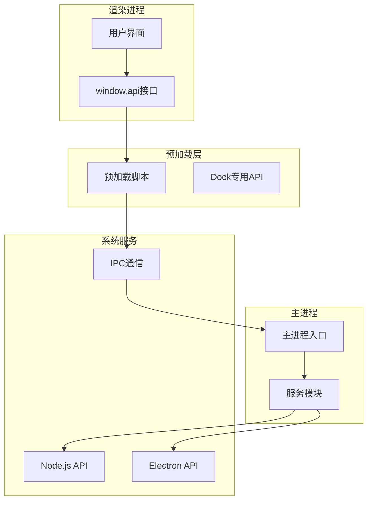
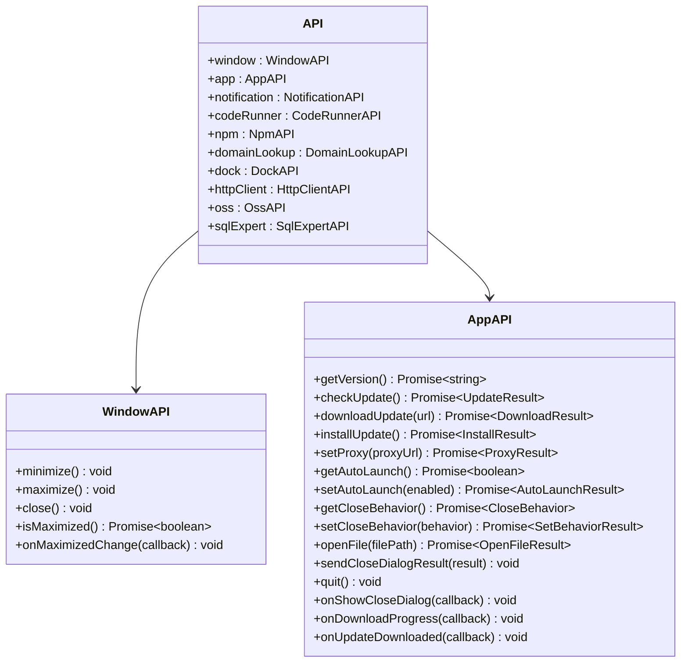
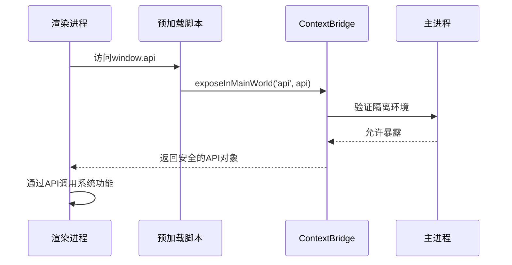
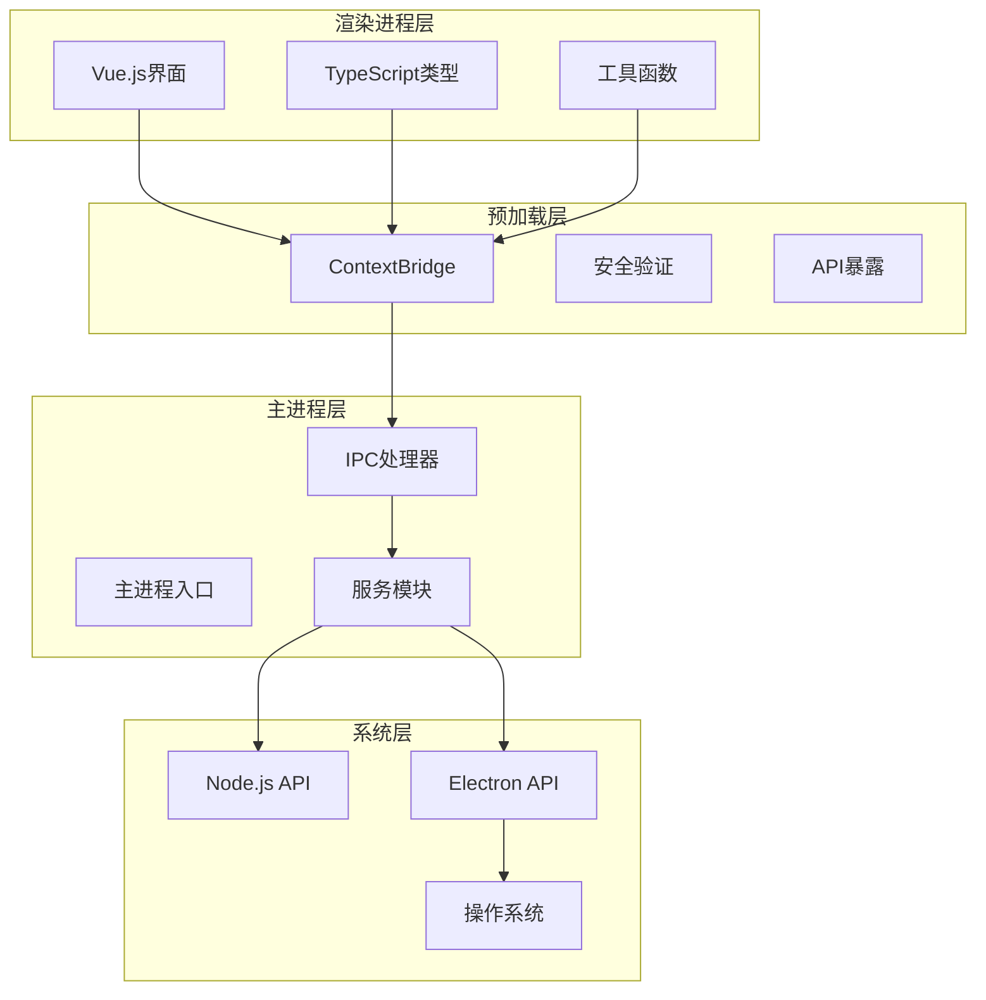
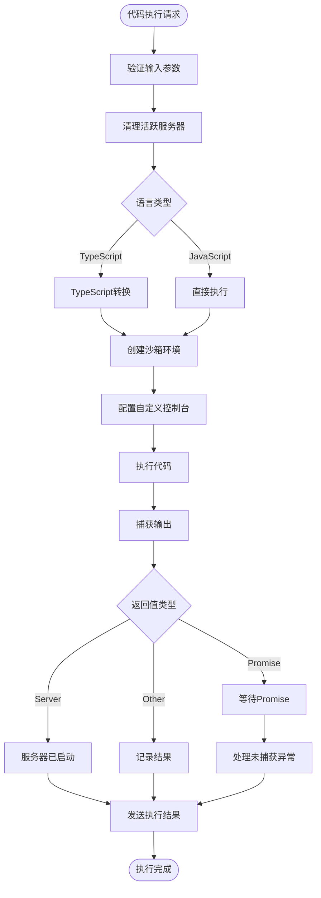
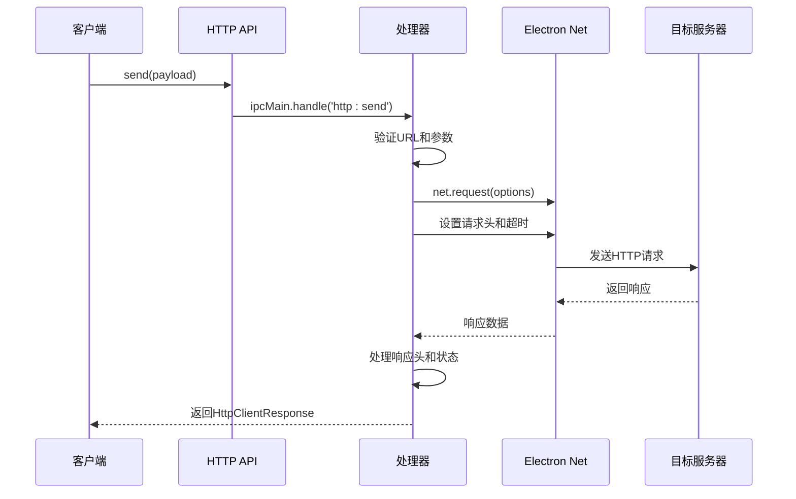
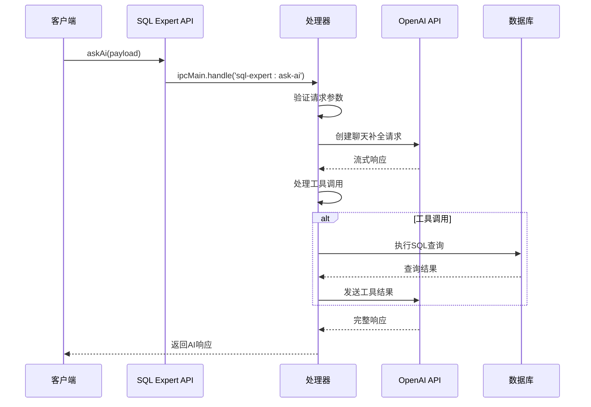
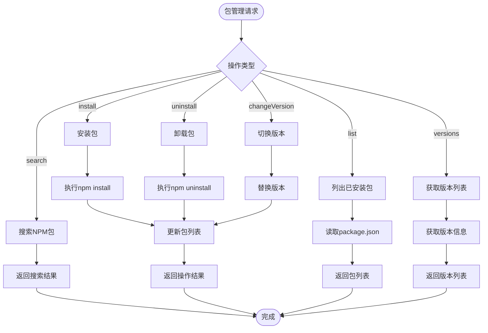
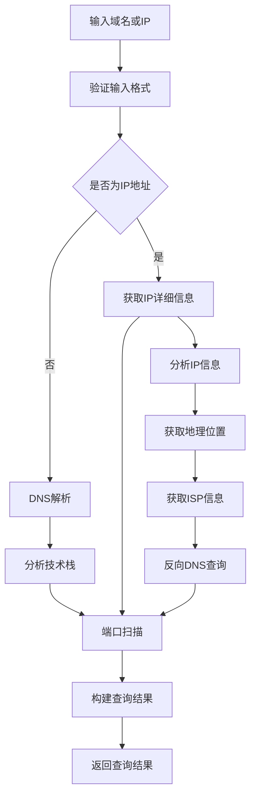
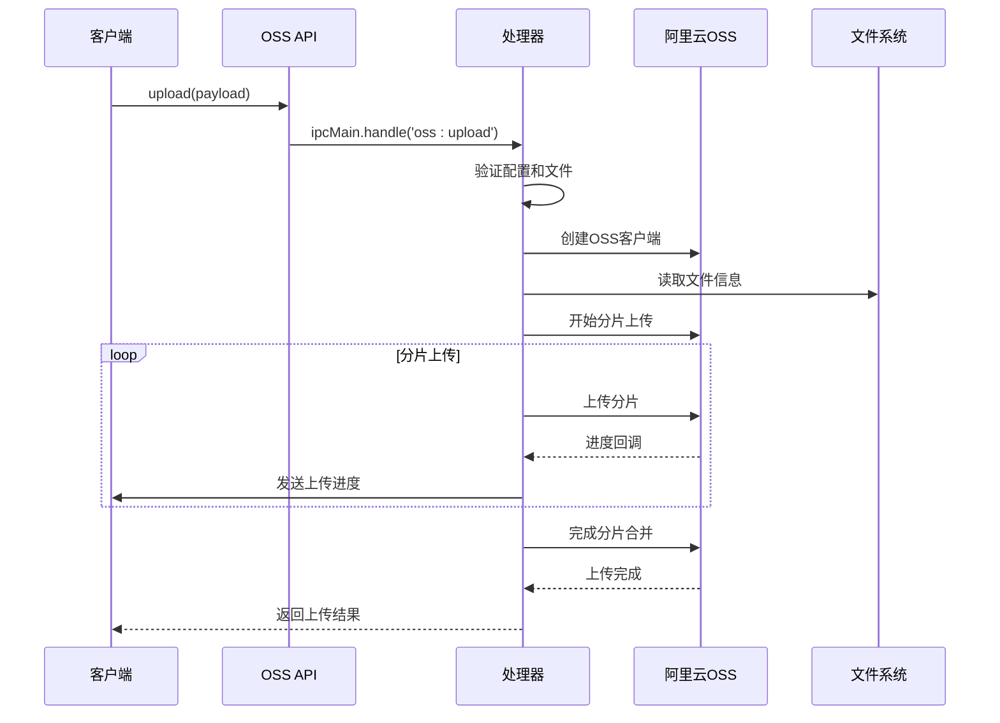

# API参考文档

<cite>
**本文档引用的文件**
- [src/preload/index.ts](file://src/preload/index.ts)
- [src/preload/index.d.ts](file://src/preload/index.d.ts)
- [src/main/index.ts](file://src/main/index.ts)
- [src/main/services/codeRunner.ts](file://src/main/services/codeRunner.ts)
- [src/main/services/httpClient.ts](file://src/main/services/httpClient.ts)
- [src/main/services/sqlExpert.ts](file://src/main/services/sqlExpert.ts)
- [src/main/services/dockService.ts](file://src/main/services/dockService.ts)
- [src/main/services/domainLookup.ts](file://src/main/services/domainLookup.ts)
- [src/main/services/ossManager.ts](file://src/main/services/ossManager.ts)
- [src/main/services/npmManager.ts](file://src/main/services/npmManager.ts)
- [src/main/services/notification.ts](file://src/main/services/notification.ts)
- [src/renderer/src/types.d.ts](file://src/renderer/src/types.d.ts)
- [src/renderer/src/env.d.ts](file://src/renderer/src/env.d.ts)
- [src/renderer/index.html](file://src/renderer/index.html)
- [src/renderer/dock.html](file://src/renderer/dock.html)
- [src/preload/dock.ts](file://src/preload/dock.ts)
- [package.json](file://package.json)
</cite>

## 目录
1. [简介](#简介)
2. [项目结构](#项目结构)
3. [核心组件](#核心组件)
4. [架构概览](#架构概览)
5. [详细组件分析](#详细组件分析)
6. [依赖关系分析](#依赖关系分析)
7. [性能考虑](#性能考虑)
8. [故障排除指南](#故障排除指南)
9. [结论](#结论)
10. [附录](#附录)

## 简介

开发者工具箱是一个基于Electron的桌面应用程序，提供了丰富的开发工具集合。本项目通过统一的window.api对象为渲染进程提供标准化的API接口，涵盖了代码运行、HTTP客户端、数据库查询、文件上传、系统集成等多个功能模块。

该项目采用TypeScript开发，具有完善的类型定义和错误处理机制，支持跨平台运行（Windows、macOS、Linux）。

## 项目结构

项目采用模块化的架构设计，主要分为三个层次：



**图表来源**
- [src/preload/index.ts:1-229](file://src/preload/index.ts#L1-L229)
- [src/main/index.ts:1-444](file://src/main/index.ts#L1-L444)

**章节来源**
- [src/preload/index.ts:1-229](file://src/preload/index.ts#L1-L229)
- [src/main/index.ts:1-444](file://src/main/index.ts#L1-L444)

## 核心组件

### window.api对象规范

window.api是项目的核心统一接口，为渲染进程提供标准化的API访问方式。该对象按照功能模块进行组织，每个模块都提供了完整的类型定义和方法签名。

#### API对象结构



**图表来源**
- [src/preload/index.d.ts:374-385](file://src/preload/index.d.ts#L374-L385)
- [src/preload/index.d.ts:6-33](file://src/preload/index.d.ts#L6-L33)

**章节来源**
- [src/preload/index.d.ts:374-385](file://src/preload/index.d.ts#L374-L385)
- [src/preload/index.ts:11-213](file://src/preload/index.ts#L11-L213)

### 预加载安全机制

项目采用了严格的预加载安全机制，通过contextBridge.exposeInMainWorld()方法安全地暴露API接口：



**图表来源**
- [src/preload/index.ts:215-228](file://src/preload/index.ts#L215-L228)

**章节来源**
- [src/preload/index.ts:215-228](file://src/preload/index.ts#L215-L228)

## 架构概览

项目采用典型的Electron三层架构，实现了安全的进程间通信和模块化服务设计：



**图表来源**
- [src/main/index.ts:421-428](file://src/main/index.ts#L421-L428)
- [src/preload/index.ts:215-228](file://src/preload/index.ts#L215-L228)

**章节来源**
- [src/main/index.ts:421-428](file://src/main/index.ts#L421-L428)
- [src/preload/index.ts:215-228](file://src/preload/index.ts#L215-L228)

## 详细组件分析

### 代码运行器服务

代码运行器提供了安全的代码执行环境，支持JavaScript和TypeScript代码的实时运行。

#### 核心功能



**图表来源**
- [src/main/services/codeRunner.ts:98-235](file://src/main/services/codeRunner.ts#L98-L235)

#### API接口定义

| 方法 | 参数 | 返回值 | 描述 |
|------|------|--------|------|
| run | code: string, language: 'javascript' \| 'typescript' | Promise~CodeRunResult~ | 执行代码并返回结果 |
| stop | - | void | 停止当前执行的代码 |
| clean | - | Promise~boolean~ | 清理所有活跃服务器 |
| killPort | port: number | Promise~KillPortResult~ | 终止指定端口的进程 |

**章节来源**
- [src/main/services/codeRunner.ts:98-318](file://src/main/services/codeRunner.ts#L98-L318)
- [src/preload/index.d.ts:41-46](file://src/preload/index.d.ts#L41-L46)

### HTTP客户端服务

HTTP客户端服务提供了绕过CORS限制的HTTP请求功能，支持自定义代理设置。

#### 请求流程



**图表来源**
- [src/main/services/httpClient.ts:15-112](file://src/main/services/httpClient.ts#L15-L112)

#### API接口定义

| 方法 | 参数 | 返回值 | 描述 |
|------|------|--------|------|
| send | payload: HttpClientRequestPayload | Promise~HttpClientResponse~ | 发送HTTP请求 |

**章节来源**
- [src/main/services/httpClient.ts:15-112](file://src/main/services/httpClient.ts#L15-L112)
- [src/preload/index.d.ts:240-242](file://src/preload/index.d.ts#L240-L242)

### SQL专家服务

SQL专家服务集成了AI驱动的数据库查询能力，提供了智能的SQL生成和数据分析功能。

#### AI交互流程



**图表来源**
- [src/main/services/sqlExpert.ts:676-739](file://src/main/services/sqlExpert.ts#L676-L739)

#### 核心功能模块

| 功能模块 | 方法 | 描述 |
|----------|------|------|
| 数据库连接 | testDb, loadSchema | 管理数据库连接和模式 |
| AI交互 | askAi, cancelAskAi | 处理AI查询和工具调用 |
| SQL执行 | executeSql | 执行SQL查询并返回结果 |
| 配置管理 | saveConfig, loadConfig | 管理数据库和AI配置 |
| 记忆管理 | loadMemories, addMemory, updateMemory, deleteMemory | 管理AI记忆和上下文 |

**章节来源**
- [src/main/services/sqlExpert.ts:1-800](file://src/main/services/sqlExpert.ts#L1-L800)
- [src/preload/index.d.ts:274-372](file://src/preload/index.d.ts#L274-L372)

### NPM包管理服务

NPM包管理服务提供了包的搜索、安装、卸载和版本管理功能。

#### 包管理流程



**图表来源**
- [src/main/services/npmManager.ts:207-552](file://src/main/services/npmManager.ts#L207-L552)

#### API接口定义

| 方法 | 参数 | 返回值 | 描述 |
|------|------|--------|------|
| search | query: string | Promise~NpmPackage[]~ | 搜索NPM包 |
| install | packageName: string | Promise~InstallResult~ | 安装包 |
| uninstall | packageName: string | Promise~UninstallResult~ | 卸载包 |
| list | - | Promise~InstalledPackage[]~ | 列出已安装包 |
| versions | packageName: string | Promise~string[]~ | 获取版本列表 |
| changeVersion | packageName: string, version: string | Promise~ChangeVersionResult~ | 切换包版本 |
| getDir | - | Promise~string~ | 获取包目录 |
| setDir | - | Promise~SetDirResult~ | 设置包目录 |
| resetDir | - | Promise~ResetDirResult~ | 重置包目录 |
| getTypes | packageName: string | Promise~GetTypesResult~ | 获取类型定义 |
| clearTypeCache | packageName: string | Promise~void~ | 清除类型缓存 |

**章节来源**
- [src/main/services/npmManager.ts:207-552](file://src/main/services/npmManager.ts#L207-L552)
- [src/preload/index.d.ts:48-69](file://src/preload/index.d.ts#L48-L69)

### 域名查询服务

域名查询服务提供了DNS解析、IP地理位置查询、端口扫描等功能。

#### 查询流程



**图表来源**
- [src/main/services/domainLookup.ts:606-666](file://src/main/services/domainLookup.ts#L606-L666)

#### API接口定义

| 方法 | 参数 | 返回值 | 描述 |
|------|------|--------|------|
| lookup | input: string | Promise~DomainInfo~ | 查询域名或IP信息 |
| scanPorts | ip: string | Promise~PortScanResult~ | 扫描IP端口 |

**章节来源**
- [src/main/services/domainLookup.ts:679-689](file://src/main/services/domainLookup.ts#L679-L689)
- [src/preload/index.d.ts:145-148](file://src/preload/index.d.ts#L145-L148)

### 阿里云OSS上传服务

OSS上传服务提供了大文件分片上传、断点续传和进度监控功能。

#### 上传流程



**图表来源**
- [src/main/services/ossManager.ts:334-438](file://src/main/services/ossManager.ts#L334-L438)

#### API接口定义

| 方法 | 参数 | 返回值 | 描述 |
|------|------|--------|------|
| selectFiles | - | Promise~OssUploadFile[]~ | 选择文件 |
| selectFolder | - | Promise~OssUploadFile[]~ | 选择文件夹 |
| cancelUpload | payload: { taskId: string } | Promise~CancelResult~ | 取消上传任务 |
| upload | payload: UploadPayload | Promise~OssUploadResult~ | 上传文件 |

**章节来源**
- [src/main/services/ossManager.ts:296-439](file://src/main/services/ossManager.ts#L296-L439)
- [src/preload/index.d.ts:211-218](file://src/preload/index.d.ts#L211-L218)

### Dock服务

Dock服务提供了macOS风格的系统Dock功能，支持自定义应用和动作。

#### Dock配置

| 配置项 | 类型 | 默认值 | 描述 |
|--------|------|--------|------|
| position | 'bottom' \| 'left' \| 'right' | 'bottom' | Dock位置 |
| iconSize | number | 48 | 图标尺寸 |
| autoHide | boolean | false | 是否自动隐藏 |
| magnification | boolean | true | 是否启用放大效果 |

**章节来源**
- [src/main/services/dockService.ts:19-26](file://src/main/services/dockService.ts#L19-L26)
- [src/preload/dock.ts:4-6](file://src/preload/dock.ts#L4-L6)

## 依赖关系分析

项目采用模块化的依赖管理，各组件之间保持松耦合的设计。

```mermaid
graph TB
subgraph "核心依赖"
Electron[electron@^35.1.5]
TypeScript[typescript@^5.8.3]
Vue[vue@^3.5.13]
end
subgraph "功能依赖"
Axios[axios@^1.7.9]
MySQL[mysql2@^3.20.0]
OpenAI[openai@^6.32.0]
AliOSS[ali-oss@^6.0.0]
ESBuild[esbuild@^0.24.2]
end
subgraph "工具依赖"
TailwindCSS[tailwindcss@^4.1.8]
MonacoEditor[monaco-editor@^0.52.0]
HighlightJS[highlight.js@^11.11.1]
ExcelJS[exceljs@^4.4.0]
end
Electron --> Axios
Electron --> MySQL
Electron --> OpenAI
Electron --> AliOSS
Electron --> ESBuild
Vue --> MonacoEditor
Vue --> HighlightJS
Vue --> ExcelJS
```

**图表来源**
- [package.json:28-51](file://package.json#L28-L51)

**章节来源**
- [package.json:28-51](file://package.json#L28-L51)

## 性能考虑

### 内存管理

项目在多个服务中实现了内存优化策略：

1. **代码运行器**：使用WeakMap跟踪活跃服务器，防止内存泄漏
2. **SQL专家**：实现连接池管理和缓存机制
3. **OSS上传**：支持断点续传和分片上传，减少内存占用

### 并发控制

- HTTP客户端支持超时控制和错误重试
- NPM包管理限制安装超时时间
- SQL查询执行设置超时保护

### 缓存策略

- 类型定义缓存管理
- OSS上传进度缓存
- 配置文件持久化存储

## 故障排除指南

### 常见错误类型

| 错误类型 | 触发场景 | 解决方案 |
|----------|----------|----------|
| 网络连接失败 | 更新检查、HTTP请求 | 配置代理或检查网络连接 |
| 权限不足 | 文件操作、端口占用 | 以管理员权限运行或调整权限 |
| 超时错误 | 网络请求、包安装 | 增加超时时间或检查服务器状态 |
| 内存不足 | 大文件处理、批量操作 | 释放内存或分批处理 |

### 调试工具

1. **开发者工具**：按F12打开Electron开发者工具
2. **日志输出**：查看控制台输出的详细信息
3. **状态监控**：使用内置的状态指示器
4. **错误报告**：系统自动收集错误信息

**章节来源**
- [src/main/services/notification.ts:15-28](file://src/main/services/notification.ts#L15-L28)

## 结论

开发者工具箱提供了一个完整、安全、高性能的开发工具平台。通过统一的API接口设计和模块化的架构，项目实现了良好的可扩展性和维护性。

主要特点：
- **安全性**：严格的预加载安全机制和权限控制
- **完整性**：涵盖开发工作的各个方面
- **易用性**：直观的API设计和完善的类型定义
- **可靠性**：全面的错误处理和故障恢复机制

## 附录

### TypeScript类型定义

项目提供了完整的TypeScript类型定义，确保开发过程中的类型安全和IDE支持。

### API使用示例

以下是一些常用的API调用示例：

1. **代码运行**
```typescript
const result = await window.api.codeRunner.run('console.log("Hello")', 'javascript');
```

2. **HTTP请求**
```typescript
const response = await window.api.httpClient.send({
  method: 'GET',
  url: 'https://api.example.com/data',
  headers: { 'Content-Type': 'application/json' }
});
```

3. **数据库查询**
```typescript
const result = await window.api.sqlExpert.askAi({
  messages: [{ role: 'user', content: '查询用户信息' }],
  schema: 'users(id, name, email)'
});
```

### 版本信息

- **当前版本**：0.4.10
- **Electron版本**：^35.1.5
- **Node.js版本**：^22.14.1
- **TypeScript版本**：^5.8.3