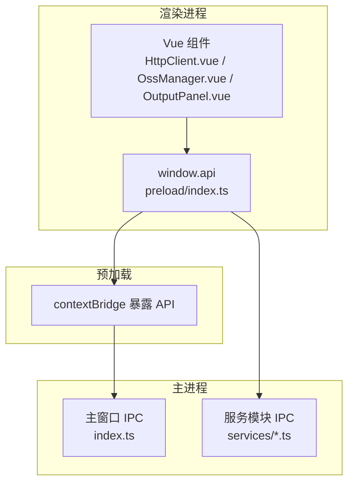
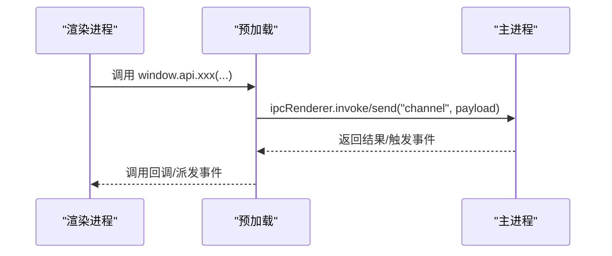
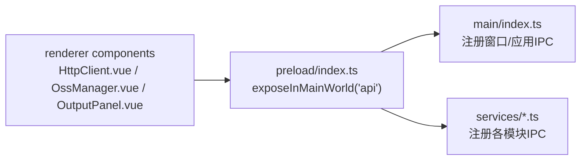

# IPC通信接口

<cite>
**本文档引用的文件**
- [src/main/index.ts](file://src/main/index.ts)
- [src/preload/index.ts](file://src/preload/index.ts)
- [src/preload/index.d.ts](file://src/preload/index.d.ts)
- [src/main/services/codeRunner.ts](file://src/main/services/codeRunner.ts)
- [src/main/services/npmManager.ts](file://src/main/services/npmManager.ts)
- [src/main/services/domainLookup.ts](file://src/main/services/domainLookup.ts)
- [src/main/services/dockService.ts](file://src/main/services/dockService.ts)
- [src/main/services/ossManager.ts](file://src/main/services/ossManager.ts)
- [src/main/services/httpClient.ts](file://src/main/services/httpClient.ts)
- [src/main/services/sqlExpert.ts](file://src/main/services/sqlExpert.ts)
- [src/main/services/notification.ts](file://src/main/services/notification.ts)
- [src/renderer/src/views/runjs/components/OutputPanel.vue](file://src/renderer/src/views/runjs/components/OutputPanel.vue)
- [src/renderer/src/views/httpclient/HttpClient.vue](file://src/renderer/src/views/httpclient/HttpClient.vue)
- [src/renderer/src/views/oss/OssManager.vue](file://src/renderer/src/views/oss/OssManager.vue)
</cite>

## 目录
1. [简介](#简介)
2. [项目结构](#项目结构)
3. [核心组件](#核心组件)
4. [架构总览](#架构总览)
5. [详细组件分析](#详细组件分析)
6. [依赖关系分析](#依赖关系分析)
7. [性能考虑](#性能考虑)
8. [故障排除指南](#故障排除指南)
9. [结论](#结论)

## 简介
本文件系统性梳理开发者工具箱的IPC通信接口，覆盖Electron主进程与渲染进程之间的消息传递机制，重点区分invoke与send两种通信方式的差异、适用场景与最佳实践。文档逐模块列出IPC通道名称、参数格式、返回值类型、错误处理策略与异步调用示例，并说明上下文隔离的安全机制与API暴露方式。

## 项目结构
项目采用主进程-预加载桥接-渲染进程的经典架构：
- 主进程负责系统级能力与高权限操作（窗口控制、应用更新、系统托盘、文件系统、网络请求等）
- 预加载脚本通过contextBridge安全地向渲染进程暴露受控API
- 渲染进程通过window.api调用主进程提供的功能

**图表来源**
- [src/main/index.ts:110-395](file://src/main/index.ts#L110-L395)
- [src/preload/index.ts:1-229](file://src/preload/index.ts#L1-L229)

**章节来源**
- [src/main/index.ts:110-395](file://src/main/index.ts#L110-L395)
- [src/preload/index.ts:1-229](file://src/preload/index.ts#L1-L229)

## 核心组件
- 窗口控制：最小化、最大化、关闭、最大化状态监听
- 应用信息：版本查询、更新检查/下载/安装、代理设置、开机自启动、关闭行为、退出
- 通知系统：全局通知事件派发
- 代码运行：代码执行、停止、清理、端口进程终止
- NPM管理：包搜索、安装、卸载、列表、版本查询、切换版本、类型定义获取与缓存清理
- 域名查询：域名解析、IP地理信息、ISP信息、连接类型、反向DNS、端口扫描
- Dock服务：macOS风格Dock窗口的打开/关闭/状态查询与动作执行
- HTTP客户端：主进程发起HTTP请求，绕过CORS限制，自动使用应用代理
- OSS管理：阿里云OSS文件上传、进度监听、取消上传
- SQL专家：数据库连接测试、配置保存/加载、Schema动态加载、SQL只读执行、AI对话（流式）、工具调用、记忆管理、余额查询

**章节来源**
- [src/preload/index.ts:11-213](file://src/preload/index.ts#L11-L213)
- [src/main/index.ts:175-395](file://src/main/index.ts#L175-L395)

## 架构总览
IPC通信分为两类：
- invoke：请求-响应模式，适合需要返回值的同步/异步调用
- send：单向事件，适合实时推送或无需返回值的通知

**图表来源**
- [src/preload/index.ts:11-213](file://src/preload/index.ts#L11-L213)
- [src/main/index.ts:175-395](file://src/main/index.ts#L175-L395)

## 详细组件分析

### 窗口控制与应用信息
- 窗口控制
  - send通道：window:minimize、window:maximize、window:close
  - invoke通道：window:isMaximized
  - 事件监听：window:maximized-change
- 应用信息
  - invoke通道：app:getVersion、app:checkUpdate、app:downloadUpdate、app:installUpdate、app:openFile、app:setProxy、app:getAutoLaunch、app:setAutoLaunch、app:getCloseBehavior、app:setCloseBehavior
  - send通道：app:closeDialogResult、app:quit
  - 事件监听：app:showCloseDialog、app:downloadProgress、app:updateDownloaded
- 关闭行为与托盘
  - 通过app:getCloseBehavior/app:setCloseBehavior控制关闭行为（询问/最小化到托盘/直接退出）
  - 托盘菜单支持显示主窗口与退出应用

消息格式与返回值
- 窗口控制：无参数，返回void
- window:isMaximized：返回Promise<boolean>
- app:checkUpdate：返回Promise<{ success: boolean; currentVersion?: string; latestVersion?: string; hasUpdate?: boolean; releaseUrl?: string; downloadUrl?: string; error?: string }>
- app:downloadUpdate：返回Promise<{ success: boolean; error?: string }>
- app:installUpdate：返回Promise<{ success: boolean }>
- app:openFile：返回Promise<{ success: boolean }>
- app:setProxy：返回Promise<{ success: boolean; error?: string }>
- app:getAutoLaunch：返回Promise<boolean>
- app:setAutoLaunch：返回Promise<{ success: boolean; error?: string }>
- app:getCloseBehavior：返回Promise<'ask' | 'minimize' | 'quit'>
- app:setCloseBehavior：返回Promise<{ success: boolean }>
- app:closeDialogResult：发送结果对象{ action: 'minimize' | 'quit'; remember: boolean }
- app:quit：无参数，返回void

错误处理
- 网络异常时（超时/拒绝/不可达）统一转化为用户可理解的提示
- 代理设置失败时返回错误信息并通知

**章节来源**
- [src/main/index.ts:175-395](file://src/main/index.ts#L175-L395)
- [src/preload/index.ts:13-47](file://src/preload/index.ts#L13-L47)

### 通知系统
- 主进程通知：通过notification模块向渲染进程发送全局通知
- 渲染进程API：notification.onNotify、notification.removeListener
- 事件通道：app:notify（主进程向渲染进程派发）

消息格式
- 事件负载：(message: string, type: 'info' | 'success' | 'warning' | 'error')

**章节来源**
- [src/main/services/notification.ts:1-29](file://src/main/services/notification.ts#L1-L29)
- [src/preload/index.ts:50-59](file://src/preload/index.ts#L50-L59)

### 代码运行（Code Runner）
- invoke通道：code:run（参数：code: string, language: 'javascript' | 'typescript'；返回：Promise<CodeRunResult>）
- send通道：code:stop
- invoke通道：code:clean（返回Promise<boolean>）
- invoke通道：code:killPort（参数：port: number；返回Promise<{ success: boolean; message: string }>）
- 实时日志：主进程通过code:log推送日志到渲染进程

CodeRunResult结构
- success: boolean
- output: string
- error?: string
- duration: number

端口终止流程
- 通过netstat查找占用端口的PID
- 仅终止electron.exe进程
- 返回终止结果与消息

**章节来源**
- [src/main/services/codeRunner.ts:98-318](file://src/main/services/codeRunner.ts#L98-L318)
- [src/preload/index.ts:63-69](file://src/preload/index.ts#L63-L69)

### NPM管理
- invoke通道：
  - npm:search（参数：query: string；返回Promise<NpmPackage[]>）
  - npm:install（参数：packageName: string；返回Promise<{ success: boolean; message: string }>)
  - npm:uninstall（参数：packageName: string；返回Promise<{ success: boolean; message: string }>)
  - npm:list（返回Promise<InstalledPackage[]>）
  - npm:versions（参数：packageName: string；返回Promise<string[]>）
  - npm:changeVersion（参数：packageName: string, version: string；返回Promise<{ success: boolean; message: string }>)
  - npm:getDir（返回Promise<string>）
  - npm:setDir（返回Promise<{ success: boolean; path?: string }>)
  - npm:resetDir（返回Promise<{ success: boolean; path: string }>)
  - npm:getTypes（参数：packageName: string；返回Promise<{ success: boolean; content?: string; files?: Record<string, string>; entry?: string; version?: string }>)
  - npm:clearTypeCache（参数：packageName: string；返回Promise<void>）
- 交互式通道：npm:getDir、npm:setDir、npm:resetDir配合文件对话框

**章节来源**
- [src/main/services/npmManager.ts:207-552](file://src/main/services/npmManager.ts#L207-L552)
- [src/preload/index.ts:71-85](file://src/preload/index.ts#L71-L85)

### 域名查询
- invoke通道：
  - domain:lookup（参数：input: string；返回Promise<DomainInfo>）
  - domain:scanPorts（参数：ip: string；返回Promise<{ success: boolean; ports: PortInfo[]; useNmap: boolean }>)
- 结果类型：DomainInfo、PortInfo[]、useNmap标志

**章节来源**
- [src/main/services/domainLookup.ts:679-689](file://src/main/services/domainLookup.ts#L679-L689)
- [src/preload/index.ts:87-91](file://src/preload/index.ts#L87-L91)

### Dock服务（macOS）
- invoke通道：
  - dock:open（参数：settings: DockSettings；返回Promise<{ success: boolean; message?: string }>)
  - dock:close（返回Promise<{ success: boolean; message?: string }>)
  - dock:isOpen（返回Promise<boolean>）
  - dock:action（参数：action: string；返回Promise<{ success: boolean }>)
- Dock窗口：独立BrowserWindow，alwaysOnTop，可见于所有工作区

**章节来源**
- [src/main/services/dockService.ts:110-229](file://src/main/services/dockService.ts#L110-L229)
- [src/preload/index.ts:93-104](file://src/preload/index.ts#L93-L104)

### HTTP客户端
- invoke通道：http:send（参数：{ method: string; url: string; headers: Record<string,string>; body?: string; timeout?: number }；返回Promise<HttpClientResponse>）
- HttpClientResponse：
  - status: number
  - statusText: string
  - headers: Record<string,string>
  - body: string
  - size: number
  - time: number
  - error?: string

**章节来源**
- [src/main/services/httpClient.ts:15-112](file://src/main/services/httpClient.ts#L15-L112)
- [src/preload/index.ts:106-115](file://src/preload/index.ts#L106-L115)

### OSS管理（阿里云）
- invoke通道：
  - oss:selectFiles（返回Promise<OssUploadFile[]>）
  - oss:selectFolder（返回Promise<OssUploadFile[]>）
  - oss:upload（参数：{ taskId: string; config: OssConfig; files: OssUploadFile[] }；返回Promise<OssUploadResult>）
  - oss:cancelUpload（参数：{ taskId: string }；返回Promise<{ success: boolean; error?: string }>)
- 事件通道：oss:uploadProgress（负载：OssUploadProgress）
- OssUploadResult：
  - success: boolean
  - uploaded?: number
  - failed?: number
  - errors?: { file: string; message: string }[]
  - error?: string

**章节来源**
- [src/main/services/ossManager.ts:296-439](file://src/main/services/ossManager.ts#L296-L439)
- [src/preload/index.ts:117-154](file://src/preload/index.ts#L117-L154)

### SQL专家
- invoke通道：
  - sql-expert:test-db（参数：DbConfig；返回Promise<{ success: boolean; message: string }>)
  - sql-expert:save-config（参数：SqlExpertConfig；返回Promise<{ success: boolean }>)
  - sql-expert:load-config（返回Promise<{ config: SqlExpertConfig | null; schema: string; schemaPath: string; memories: MemoryEntry[]; memoryPath: string; memoryScope: string; memoryCount: number }>)
  - sql-expert:load-schema（参数：DbConfig | undefined；返回Promise<{ success: boolean; schema?: string; schemaPath?: string; tableCount?: number; memories: MemoryEntry[]; memoryPath: string; memoryScope: string; memoryCount: number; error?: string }>)
  - sql-expert:describe-table（参数：string[]；返回Promise<{ success: boolean; rows?: Array<Record<string,unknown>>; error?: string }>)
  - sql-expert:execute-sql（参数：string；返回Promise<{ success: boolean; ok?: boolean; truncated?: boolean; totalRows?: number; returnedRows?: number; rows?: Array<Record<string,unknown>>; error?: string }>)
  - sql-expert:ask-ai（参数：AskAiPayload；返回Promise<{ success: boolean; requestId?: string; reply?: string; toolCalls?: ToolCallRecord[]; usage?: AgentUsage; status?: 'done' | 'stopped'; error?: string }>)
  - sql-expert:cancel-ask-ai（参数：{ requestId: string }；返回Promise<{ success: boolean; message: string }>)
  - sql-expert:check-balance（参数：{ url?: string; apiKey?: string } | undefined；返回Promise<{ success: boolean; message: string }>)
  - sql-expert:load-memories（参数：{ database?: string; apiKey?: string } | undefined；返回Promise<{ success: boolean; memories: MemoryEntry[]; memoryPath: string; memoryScope: string; memoryCount: number; error?: string }>)
  - sql-expert:update-memory（参数：{ memoryId: string; content: string; database?: string; apiKey?: string }；返回Promise<{ success: boolean; memories: MemoryEntry[]; memoryPath: string; memoryScope: string; memoryCount: number; error?: string }>)
  - sql-expert:delete-memory（参数：{ memoryId: string; database?: string; apiKey?: string }；返回Promise<{ success: boolean; memories: MemoryEntry[]; memoryPath: string; memoryScope: string; memoryCount: number; error?: string }>)
  - sql-expert:add-memory（参数：{ content: string; database?: string; apiKey?: string }；返回Promise<{ success: boolean; memories: MemoryEntry[]; memoryPath: string; memoryScope: string; memoryCount: number; error?: string }>)
- 事件通道：
  - sql-expert:ai-content（负载：{ requestId: string; content: string }）
  - sql-expert:ai-tool-start（负载：{ requestId: string; id: string; name: string; args: Record<string,unknown> }）
  - sql-expert:ai-tool-done（负载：{ requestId: string; id: string; name: string; args: Record<string,unknown>; status: string; result: Record<string,unknown>; errorMessage?: string }）

**章节来源**
- [src/main/services/sqlExpert.ts:968-1502](file://src/main/services/sqlExpert.ts#L968-L1502)
- [src/preload/index.ts:156-212](file://src/preload/index.ts#L156-L212)

## 依赖关系分析
- 预加载层通过contextBridge.exposeInMainWorld暴露window.api，统一管理所有IPC通道
- 主进程在createWindow时注册窗口控制与应用信息IPC处理器
- 各服务模块在whenReady阶段注册自身IPC处理器
- 渲染进程通过window.api调用，实现松耦合

**图表来源**
- [src/preload/index.ts:215-229](file://src/preload/index.ts#L215-L229)
- [src/main/index.ts:421-429](file://src/main/index.ts#L421-L429)

**章节来源**
- [src/preload/index.ts:215-229](file://src/preload/index.ts#L215-L229)
- [src/main/index.ts:421-429](file://src/main/index.ts#L421-L429)

## 性能考虑
- invoke适合一次性请求-响应，避免频繁事件监听导致的内存累积
- send适合高频事件（如上传进度、AI流式内容），注意及时移除监听器
- 代码运行与HTTP请求均设置超时，避免阻塞
- OSS上传使用分片与并行，合理设置进度上报频率
- SQL专家对AI流式响应进行节流与合并，减少渲染压力

## 故障排除指南
- 网络与代理
  - app:checkUpdate与app:downloadUpdate在网络异常时返回错误信息，提示设置代理
  - http:send支持超时与错误回调，返回error字段
- 代码运行
  - code:killPort返回未找到占用或查找失败时，检查端口范围与权限
- OSS上传
  - oss:upload返回错误时，检查AccessKey、Endpoint、Bucket配置与ACL
  - oss:cancelUpload失败时，确认taskId与当前任务一致
- SQL专家
  - sql-expert:ask-ai返回错误时，检查AI配置与Schema加载状态
  - sql-expert:execute-sql对非法SQL抛出错误，确保只读与显式别名

**章节来源**
- [src/main/index.ts:218-294](file://src/main/index.ts#L218-L294)
- [src/main/services/httpClient.ts:15-112](file://src/main/services/httpClient.ts#L15-L112)
- [src/main/services/ossManager.ts:296-439](file://src/main/services/ossManager.ts#L296-L439)
- [src/main/services/sqlExpert.ts:968-1502](file://src/main/services/sqlExpert.ts#L968-L1502)

## 结论
本项目通过invoke与send两种IPC模式实现了清晰的职责分离：invoke用于需要返回值的请求，send用于高频事件推送。预加载层统一暴露API，既保证了安全性（contextIsolation），又提供了良好的开发体验。各模块IPC接口设计遵循统一的消息格式与错误处理策略，便于维护与扩展。