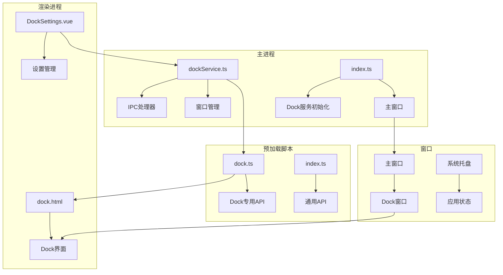
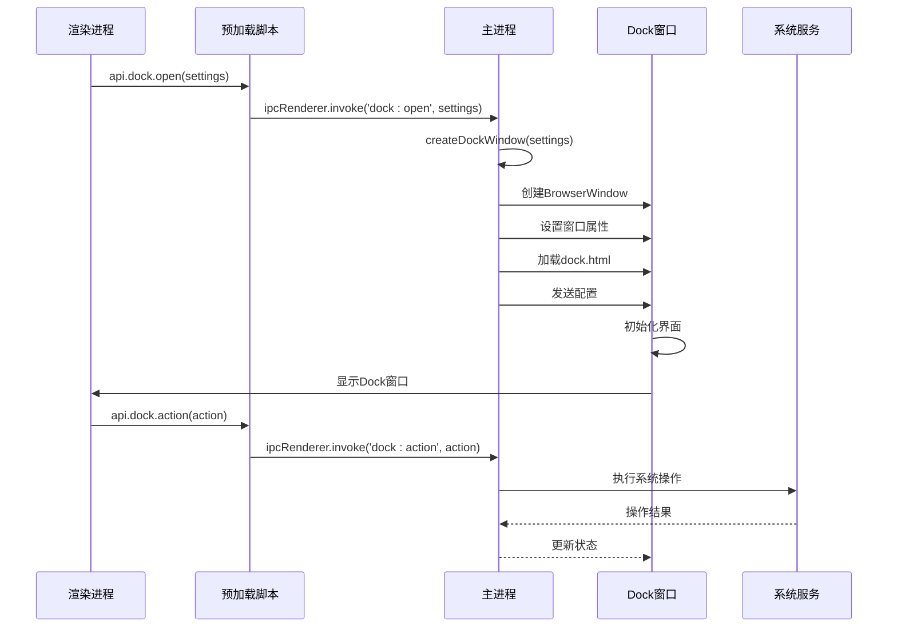
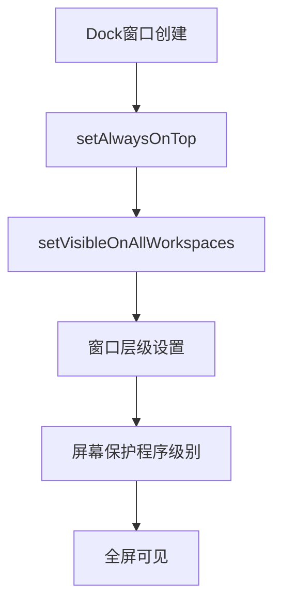
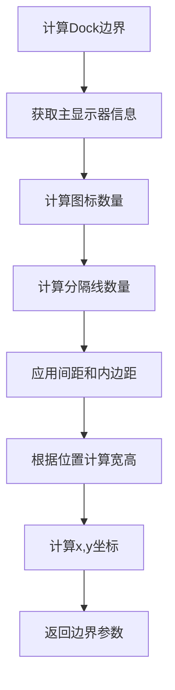
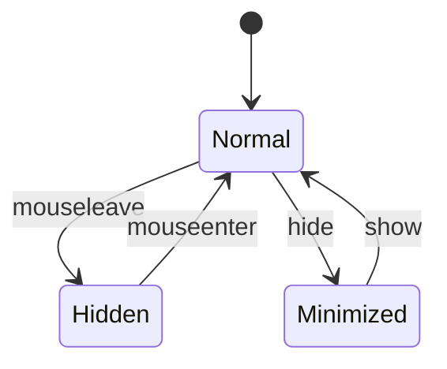
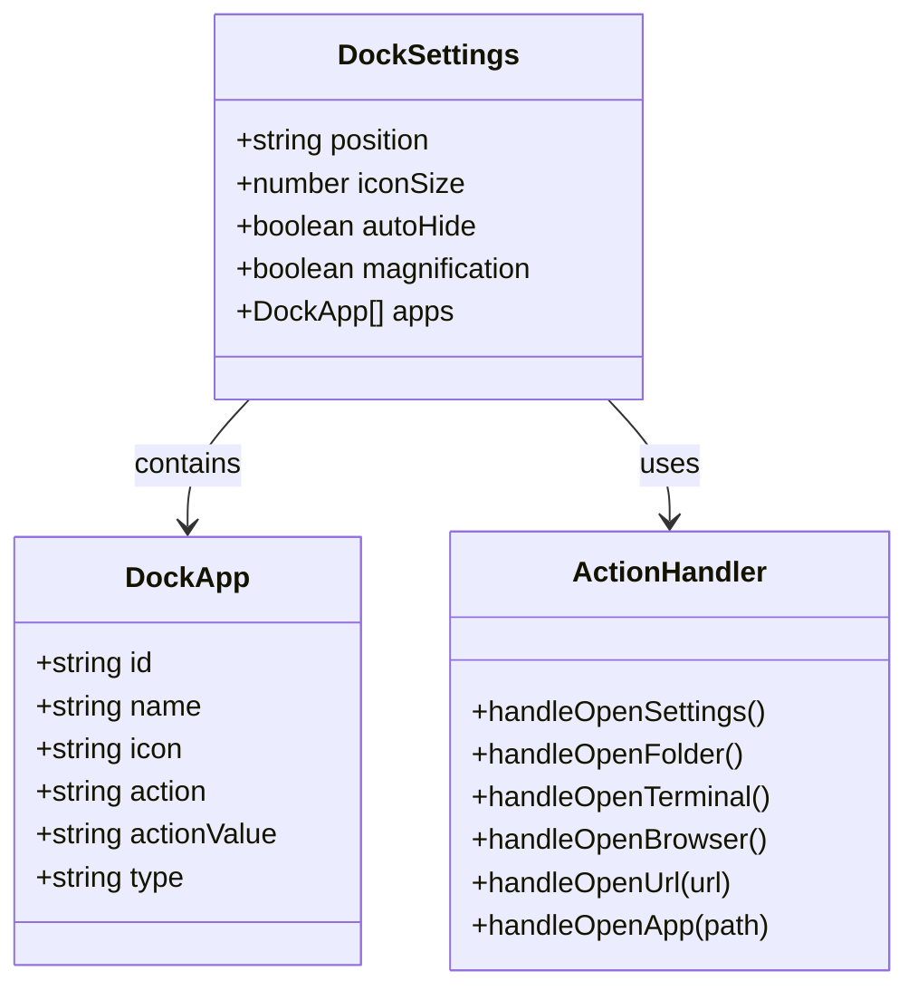
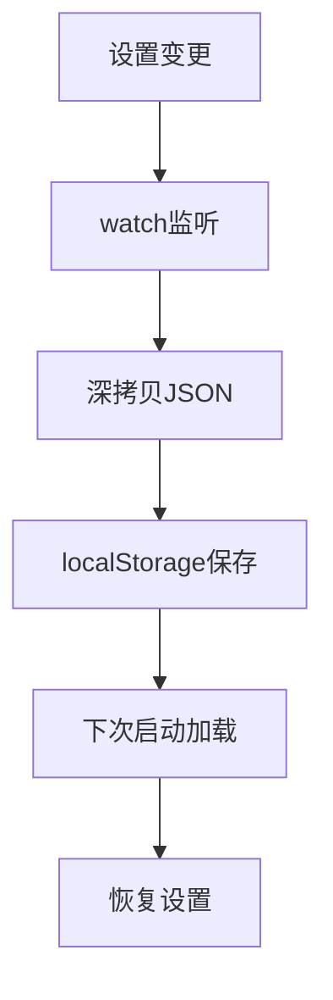
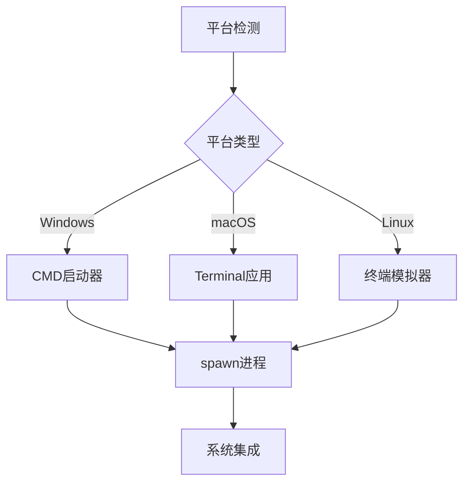
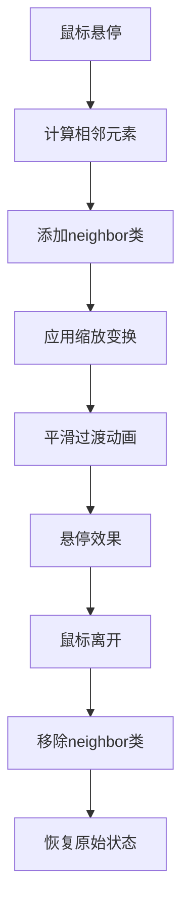
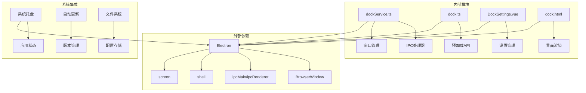

# Dock服务接口规范

<cite>
**本文档引用的文件**
- [dockService.ts](file://src/main/services/dockService.ts)
- [dock.ts](file://src/preload/dock.ts)
- [DockSettings.vue](file://src/renderer/src/views/dock/DockSettings.vue)
- [dock.html](file://src/renderer/dock.html)
- [index.ts](file://src/main/index.ts)
- [index.ts](file://src/preload/index.ts)
</cite>

## 目录
1. [简介](#简介)
2. [项目结构](#项目结构)
3. [核心组件](#核心组件)
4. [架构概览](#架构概览)
5. [详细组件分析](#详细组件分析)
6. [依赖关系分析](#依赖关系分析)
7. [性能考虑](#性能考虑)
8. [故障排除指南](#故障排除指南)
9. [结论](#结论)

## 简介

Dock服务是一个基于Electron的macOS风格悬浮工具栏解决方案，为开发者工具箱提供了独立的Dock窗口功能。该服务实现了完整的IPC接口规范，支持跨平台兼容性，并提供了丰富的自定义配置选项。

Dock服务的核心特性包括：
- macOS风格的悬浮工具栏界面
- 跨平台兼容的窗口管理
- 自定义应用项配置
- 系统集成功能
- 热更新机制
- 透明度和动画效果

## 项目结构

Dock服务在整个项目中的组织结构如下：



**图表来源**
- [dockService.ts:1-243](file://src/main/services/dockService.ts#L1-L243)
- [index.ts:1-444](file://src/main/index.ts#L1-L444)

**章节来源**
- [dockService.ts:1-243](file://src/main/services/dockService.ts#L1-L243)
- [index.ts:1-444](file://src/main/index.ts#L1-L444)

## 核心组件

### 数据结构定义

Dock服务使用以下核心数据结构：

#### Dock应用项接口
```typescript
interface DockApp {
  id: string
  name: string
  icon: string
  action: string
  actionValue?: string
  type?: 'separator'
}
```

#### Dock设置接口
```typescript
interface DockSettings {
  position: 'bottom' | 'left' | 'right'
  iconSize: number
  autoHide: boolean
  magnification: boolean
  apps: DockApp[]
}
```

#### 预设应用列表
- Finder (访达) - 打开文件管理器
- Terminal (终端) - 打开系统终端
- Browser (浏览器) - 打开默认浏览器
- Settings (设置) - 显示主窗口
- Folder (文件夹) - 打开指定文件夹

**章节来源**
- [dockService.ts:9-26](file://src/main/services/dockService.ts#L9-L26)
- [DockSettings.vue:4-39](file://src/renderer/src/views/dock/DockSettings.vue#L4-L39)

### IPC接口规范

Dock服务提供以下IPC接口：

#### 主进程接口
- `dock:open` - 打开Dock窗口
- `dock:close` - 关闭Dock窗口  
- `dock:isOpen` - 检查Dock状态
- `dock:action` - 处理Dock动作

#### 渲染进程接口
- `api.dock.open` - 打开Dock窗口
- `api.dock.close` - 关闭Dock窗口
- `api.dock.isOpen` - 检查Dock状态
- `api.dock.action` - 触发动作

**章节来源**
- [dockService.ts:111-229](file://src/main/services/dockService.ts#L111-L229)
- [index.ts:93-104](file://src/preload/index.ts#L93-L104)

## 架构概览

Dock服务采用分层架构设计，实现了清晰的职责分离：



**图表来源**
- [dockService.ts:65-108](file://src/main/services/dockService.ts#L65-L108)
- [dock.ts:4-6](file://src/preload/dock.ts#L4-L6)

**章节来源**
- [dockService.ts:65-229](file://src/main/services/dockService.ts#L65-L229)

## 详细组件分析

### Dock窗口创建组件

#### 窗口属性配置
Dock窗口使用以下配置参数：

| 属性 | 值 | 说明 |
|------|-----|------|
| frame | false | 无边框窗口 |
| transparent | true | 透明背景 |
| backgroundColor | '#00000000' | 完全透明 |
| alwaysOnTop | true | 始终置顶 |
| skipTaskbar | true | 不显示在任务栏 |
| movable | false | 不可移动 |
| focusable | false | 不可获得焦点 |
| hasShadow | false | 无阴影 |

#### 窗口层级管理


**图表来源**
- [dockService.ts:87-89](file://src/main/services/dockService.ts#L87-L89)

**章节来源**
- [dockService.ts:68-108](file://src/main/services/dockService.ts#L68-L108)

### 位置计算和尺寸调整组件

#### 尺寸计算算法


**图表来源**
- [dockService.ts:29-62](file://src/main/services/dockService.ts#L29-L62)

#### 边界计算公式
- **底部Dock**: width = dockLength + 80, height = iconSize + padding + 80
- **左侧Dock**: width = iconSize + padding + 100, height = dockLength + 80  
- **右侧Dock**: width = iconSize + padding + 100, height = dockLength + 80

**章节来源**
- [dockService.ts:29-62](file://src/main/services/dockService.ts#L29-L62)

### 系统集成机制组件

#### 窗口层级管理
Dock服务通过以下方式实现系统集成：

1. **始终置顶**: 使用 `setAlwaysOnTop(true, 'screen-saver')`
2. **全工作区可见**: `setVisibleOnAllWorkspaces(true)`
3. **系统事件响应**: 监听鼠标事件和窗口状态变化

#### 焦点处理机制


**图表来源**
- [dock.html:372-444](file://src/renderer/dock.html#L372-L444)

**章节来源**
- [dockService.ts:87-89](file://src/main/services/dockService.ts#L87-L89)
- [dock.html:372-444](file://src/renderer/dock.html#L372-L444)

### 自定义应用项配置组件

#### 应用项数据结构


**图表来源**
- [dockService.ts:9-26](file://src/main/services/dockService.ts#L9-L26)
- [dockService.ts:162-228](file://src/main/services/dockService.ts#L162-L228)

#### 动作处理机制
- **预设动作**: openSettings, openFolder, openTerminal, openBrowser
- **自定义动作**: openUrl:*, openApp:*
- **跨平台支持**: Windows CMD, macOS Terminal, Linux终端模拟器

**章节来源**
- [dockService.ts:162-228](file://src/main/services/dockService.ts#L162-L228)

### Dock设置管理组件

#### 配置持久化机制


**图表来源**
- [DockSettings.vue:110-111](file://src/renderer/src/views/dock/DockSettings.vue#L110-L111)
- [DockSettings.vue:93-108](file://src/renderer/src/views/dock/DockSettings.vue#L93-L108)

#### 设置项说明

| 设置项 | 类型 | 默认值 | 说明 |
|--------|------|--------|------|
| position | enum | 'bottom' | Dock位置 |
| iconSize | number | 48 | 图标大小 |
| autoHide | boolean | false | 自动隐藏 |
| magnification | boolean | true | 放大效果 |

**章节来源**
- [DockSettings.vue:17-30](file://src/renderer/src/views/dock/DockSettings.vue#L17-L30)
- [DockSettings.vue:93-108](file://src/renderer/src/views/dock/DockSettings.vue#L93-L108)

### 跨平台兼容性组件

#### 平台特定实现


**图表来源**
- [dockService.ts:179-191](file://src/main/services/dockService.ts#L179-L191)

#### 窗口透明度处理
- **Windows**: 禁用GPU合成以避免标题栏问题
- **macOS**: 使用原生透明效果
- **Linux**: 标准透明支持

**章节来源**
- [index.ts:38-41](file://src/main/index.ts#L38-L41)
- [dockService.ts:179-191](file://src/main/services/dockService.ts#L179-L191)

### 动画效果组件

#### 悬停动画效果


**图表来源**
- [dock.html:347-362](file://src/renderer/dock.html#L347-L362)

#### 自动隐藏动画
- **触发区域**: Dock边缘3像素范围
- **显示延迟**: 300ms
- **隐藏延迟**: 1000ms
- **过渡时间**: 0.3秒

**章节来源**
- [dock.html:347-444](file://src/renderer/dock.html#L347-L444)

## 依赖关系分析

Dock服务的依赖关系图：



**图表来源**
- [dockService.ts:1-4](file://src/main/services/dockService.ts#L1-L4)
- [index.ts:1-14](file://src/main/index.ts#L1-L14)

**章节来源**
- [dockService.ts:1-4](file://src/main/services/dockService.ts#L1-L4)
- [index.ts:1-14](file://src/main/index.ts#L1-L14)

## 性能考虑

### 内存管理
- **窗口复用**: 已存在的Dock窗口直接更新而非重新创建
- **事件清理**: 自动清理定时器和事件监听器
- **资源释放**: 应用退出时正确关闭所有窗口

### 渲染优化
- **CSS硬件加速**: 使用transform进行动画
- **最小重绘**: 通过类名切换减少DOM操作
- **懒加载**: 按需加载SVG图标

### IPC通信优化
- **批量处理**: 合并多个设置变更
- **防抖处理**: 避免频繁的窗口重绘
- **错误处理**: 完善的异常捕获和恢复机制

## 故障排除指南

### 常见问题及解决方案

#### Dock窗口无法显示
1. **检查权限**: 确保应用有显示置顶窗口的权限
2. **验证配置**: 检查Dock设置的有效性
3. **查看日志**: 监控IPC通信状态

#### 动作执行失败
1. **平台兼容性**: 验证目标平台的可用性
2. **路径解析**: 检查应用路径的正确性
3. **权限问题**: 确认系统访问权限

#### 动画效果异常
1. **硬件加速**: 检查GPU支持情况
2. **CSS冲突**: 验证样式覆盖规则
3. **浏览器兼容**: 确认CSS属性支持

**章节来源**
- [dockService.ts:138-140](file://src/main/services/dockService.ts#L138-L140)
- [dockService.ts:222-224](file://src/main/services/dockService.ts#L222-L224)

## 结论

Dock服务提供了一个完整、可扩展的macOS风格悬浮工具栏解决方案。通过清晰的IPC接口设计、完善的跨平台兼容性和丰富的自定义选项，该服务能够满足开发者工具箱的各种需求。

主要优势包括：
- **模块化设计**: 清晰的职责分离和接口定义
- **跨平台支持**: 统一的API在多平台上一致运行
- **配置灵活**: 支持动态配置和热更新
- **性能优化**: 合理的内存管理和渲染优化
- **易于维护**: 完善的错误处理和日志记录

未来可以考虑的功能增强：
- 更多的自定义主题选项
- 支持更多的系统集成特性
- 增强的动画效果和视觉反馈
- 更好的性能监控和诊断工具