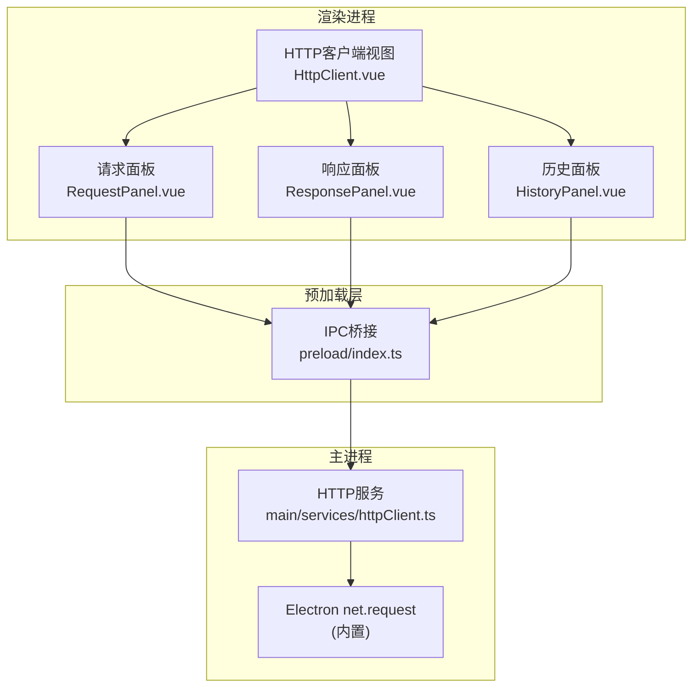
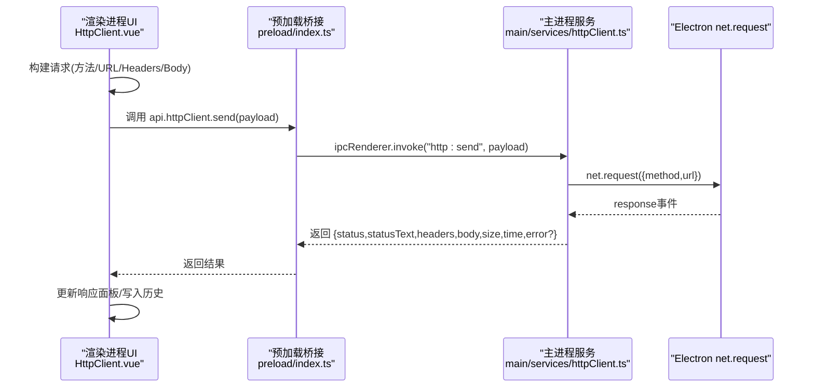
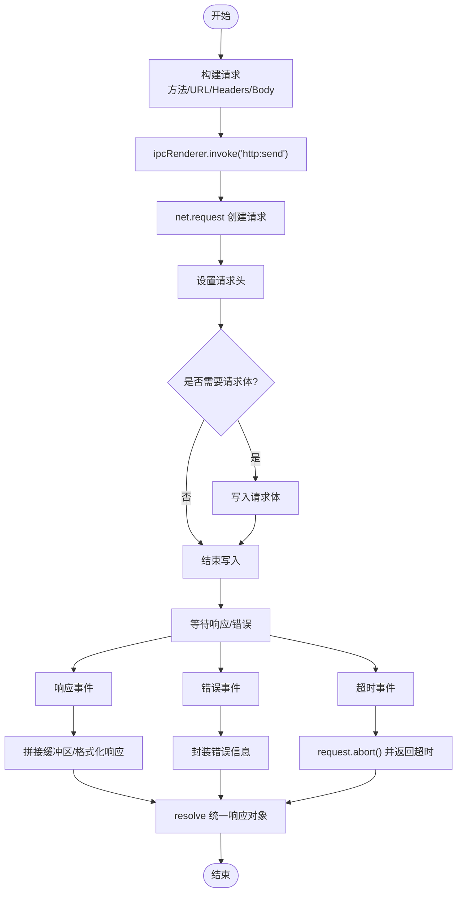
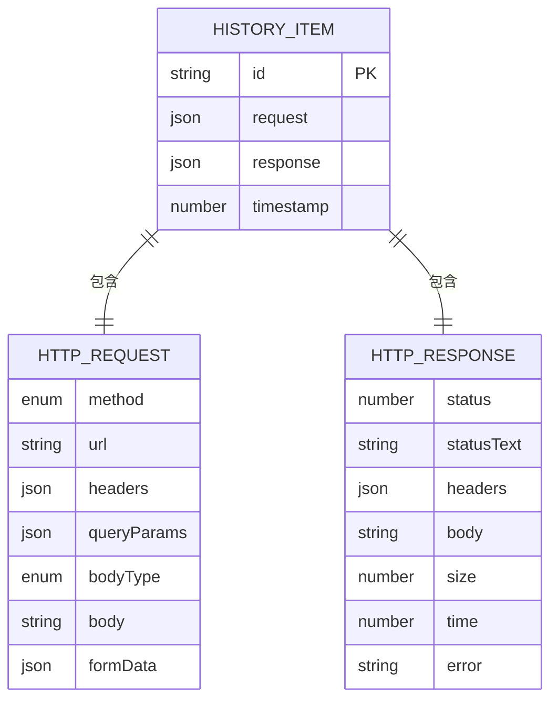
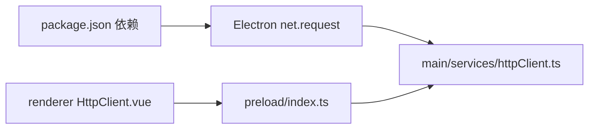

# HTTP客户端接口

<cite>
**本文档引用的文件**
- [httpClient.ts](file://src/main/services/httpClient.ts)
- [types.ts](file://src/renderer/src/views/httpclient/types.ts)
- [HttpClient.vue](file://src/renderer/src/views/httpclient/HttpClient.vue)
- [RequestPanel.vue](file://src/renderer/src/views/httpclient/components/RequestPanel.vue)
- [ResponsePanel.vue](file://src/renderer/src/views/httpclient/components/ResponsePanel.vue)
- [HistoryPanel.vue](file://src/renderer/src/views/httpclient/components/HistoryPanel.vue)
- [KeyValueEditor.vue](file://src/renderer/src/views/httpclient/components/KeyValueEditor.vue)
- [index.ts](file://src/preload/index.ts)
- [index.ts](file://src/main/index.ts)
- [package.json](file://package.json)
</cite>

## 目录
1. [简介](#简介)
2. [项目结构](#项目结构)
3. [核心组件](#核心组件)
4. [架构总览](#架构总览)
5. [详细组件分析](#详细组件分析)
6. [依赖关系分析](#依赖关系分析)
7. [性能考虑](#性能考虑)
8. [故障排除指南](#故障排除指南)
9. [结论](#结论)

## 简介
本文件为HTTP客户端服务的完整接口规范文档，涵盖IPC接口定义、请求发送与响应接收流程、错误处理机制、CORS绕过原理、代理配置与请求头处理、请求历史管理的数据结构与存储、代理支持与认证处理、SSL证书验证、请求重试与超时控制、并发限制以及响应数据格式化与状态码处理等。文档面向开发与运维人员，既提供高层概览，也包含代码级别的架构图与数据流图，帮助快速理解与集成。

## 项目结构
HTTP客户端位于Electron应用的渲染进程与主进程之间，通过IPC通信完成请求发送与结果返回。主要模块如下：
- 主进程服务：负责实际网络请求、超时控制与错误封装
- 渲染进程视图：提供请求构建、历史管理与响应展示
- 预加载桥接：暴露安全的IPC接口给渲染进程
- 应用代理设置：通过主进程会话配置全局代理

图表来源
- [HttpClient.vue:1-275](file://src/renderer/src/views/httpclient/HttpClient.vue#L1-L275)
- [index.ts:106-115](file://src/preload/index.ts#L106-L115)
- [httpClient.ts:15-112](file://src/main/services/httpClient.ts#L15-L112)

章节来源
- [HttpClient.vue:1-275](file://src/renderer/src/views/httpclient/HttpClient.vue#L1-L275)
- [index.ts:106-115](file://src/preload/index.ts#L106-L115)
- [httpClient.ts:15-112](file://src/main/services/httpClient.ts#L15-L112)

## 核心组件
- 请求模型与响应模型：定义HTTP方法、键值对、Body类型、请求与响应结构
- 请求构建器：组装URL、查询参数、请求头、请求体
- IPC调用器：通过预加载层暴露的API向主进程发起请求
- 主进程HTTP服务：执行net.request、超时控制、错误封装
- 响应解析器：格式化响应体、状态码分类、头部展示与复制
- 历史管理器：本地存储请求历史，支持增删查改与清空

章节来源
- [types.ts:1-38](file://src/renderer/src/views/httpclient/types.ts#L1-L38)
- [HttpClient.vue:121-167](file://src/renderer/src/views/httpclient/HttpClient.vue#L121-L167)
- [index.ts:106-115](file://src/preload/index.ts#L106-L115)
- [httpClient.ts:15-112](file://src/main/services/httpClient.ts#L15-L112)
- [ResponsePanel.vue:13-47](file://src/renderer/src/views/httpclient/components/ResponsePanel.vue#L13-L47)
- [HistoryPanel.vue:16-45](file://src/renderer/src/views/httpclient/components/HistoryPanel.vue#L16-L45)

## 架构总览
HTTP客户端采用“渲染进程构建请求 -> 预加载层桥接 -> 主进程执行请求”的分层设计。主进程使用Electron内置net模块绕过浏览器CORS限制，自动继承应用代理设置；渲染进程负责UI交互、历史记录与响应展示。

图表来源
- [HttpClient.vue:121-167](file://src/renderer/src/views/httpclient/HttpClient.vue#L121-L167)
- [index.ts:106-115](file://src/preload/index.ts#L106-L115)
- [httpClient.ts:15-112](file://src/main/services/httpClient.ts#L15-L112)

## 详细组件分析

### IPC接口定义
- 接口名称：http:send
- 调用方：渲染进程
- 参数结构：包含method、url、headers、body、timeout
- 返回结构：包含status、statusText、headers、body、size、time、error（可选）
- 超时控制：主进程内部基于setTimeout实现，超时后request.abort()

章节来源
- [httpClient.ts:7-13](file://src/main/services/httpClient.ts#L7-L13)
- [httpClient.ts:15-112](file://src/main/services/httpClient.ts#L15-L112)
- [index.ts:106-115](file://src/preload/index.ts#L106-L115)

### 请求发送流程
- 渲染进程构建请求：方法、URL、查询参数、请求头、请求体
- 预加载层转发：ipcRenderer.invoke触发主进程处理
- 主进程执行：net.request发送请求，设置请求头，处理响应与错误
- 结果回传：Promise解析为统一响应对象

图表来源
- [HttpClient.vue:121-167](file://src/renderer/src/views/httpclient/HttpClient.vue#L121-L167)
- [httpClient.ts:15-112](file://src/main/services/httpClient.ts#L15-L112)

### 响应接收与错误处理
- 成功响应：status/statusText/headers/body/size/time
- 错误处理：超时、网络错误、URL解析失败等，均封装为统一错误对象
- 状态码分类：根据状态码范围进行颜色标识与分类统计

章节来源
- [httpClient.ts:54-92](file://src/main/services/httpClient.ts#L54-L92)
- [ResponsePanel.vue:13-47](file://src/renderer/src/views/httpclient/components/ResponsePanel.vue#L13-L47)

### CORS限制绕过机制
- 使用Electron内置net.request在主进程发起请求，绕过浏览器CORS限制
- 自动继承应用代理设置：主进程通过session.setProxy配置全局代理
- 请求头处理：主进程遍历headers并setHeader，保持与浏览器一致的请求头语义

章节来源
- [httpClient.ts:25-36](file://src/main/services/httpClient.ts#L25-L36)
- [index.ts:306-327](file://src/main/index.ts#L306-L327)

### 代理配置支持与请求头处理
- 代理设置：主进程提供app:setProxy接口，支持HTTP/HTTPS代理规则
- 代理生效：同时设置Electron会话代理与环境变量，确保自动更新器也使用代理
- 请求头：主进程严格过滤空key/value，避免无效请求头

章节来源
- [index.ts:306-327](file://src/main/index.ts#L306-L327)
- [httpClient.ts:32-36](file://src/main/services/httpClient.ts#L32-L36)

### 认证处理
- 当前实现未提供专门的认证接口或凭据管理
- 如需认证，建议在请求头中手动添加Authorization字段（如Bearer Token）

章节来源
- [HttpClient.vue:80-99](file://src/renderer/src/views/httpclient/HttpClient.vue#L80-L99)
- [types.ts:12-20](file://src/renderer/src/views/httpclient/types.ts#L12-L20)

### SSL证书验证
- 代码库未显式实现自定义SSL证书校验逻辑
- 默认遵循Electron/Chromium的SSL证书验证策略

章节来源
- [httpClient.ts:22-24](file://src/main/services/httpClient.ts#L22-L24)

### 请求重试机制
- 代码库未实现自动重试逻辑
- 建议在渲染进程层面根据业务需求实现指数退避重试

章节来源
- [httpClient.ts:15-112](file://src/main/services/httpClient.ts#L15-L112)

### 超时控制
- 主进程内部使用setTimeout实现超时控制
- 超时后调用request.abort()并返回统一错误对象

章节来源
- [httpClient.ts:38-50](file://src/main/services/httpClient.ts#L38-L50)

### 并发限制
- 代码库未实现并发队列或限流控制
- 建议在渲染进程侧限制同时发送的请求数量

章节来源
- [HttpClient.vue:121-167](file://src/renderer/src/views/httpclient/HttpClient.vue#L121-L167)

### 响应数据格式化与状态码处理
- JSON格式化：尝试解析响应体为JSON并格式化输出
- 状态码分类：按2xx/3xx/4xx/5xx分类并着色
- 复制功能：支持复制格式化后的响应体

章节来源
- [ResponsePanel.vue:23-47](file://src/renderer/src/views/httpclient/components/ResponsePanel.vue#L23-L47)
- [ResponsePanel.vue:117-129](file://src/renderer/src/views/httpclient/components/ResponsePanel.vue#L117-L129)

### 请求历史管理
- 数据结构：HistoryItem包含id、request、response、timestamp
- 存储格式：localStorage保存JSON数组，最多保留100条
- 检索接口：支持选择历史项、删除单条、清空全部

图表来源
- [types.ts:32-37](file://src/renderer/src/views/httpclient/types.ts#L32-L37)
- [types.ts:12-30](file://src/renderer/src/views/httpclient/types.ts#L12-L30)

章节来源
- [types.ts:32-37](file://src/renderer/src/views/httpclient/types.ts#L32-L37)
- [HttpClient.vue:33-51](file://src/renderer/src/views/httpclient/HttpClient.vue#L33-L51)
- [HttpClient.vue:169-183](file://src/renderer/src/views/httpclient/HttpClient.vue#L169-L183)

## 依赖关系分析
- Electron内置net模块用于HTTP请求
- axios、https-proxy-agent、socks-proxy-agent等作为项目依赖存在，但当前HTTP客户端未直接使用这些库
- 应用代理设置通过Electron session.setProxy实现

图表来源
- [httpClient.ts:5](file://src/main/services/httpClient.ts#L5)
- [index.ts:106-115](file://src/preload/index.ts#L106-L115)
- [HttpClient.vue:121-167](file://src/renderer/src/views/httpclient/HttpClient.vue#L121-L167)
- [package.json:28-51](file://package.json#L28-L51)

章节来源
- [package.json:28-51](file://package.json#L28-L51)
- [httpClient.ts:5](file://src/main/services/httpClient.ts#L5)

## 性能考虑
- 超时控制：合理设置timeout，避免长时间阻塞
- 响应体处理：大响应体建议在渲染进程侧进行节流或分页展示
- 历史存储：localStorage容量有限，建议限制最大历史数量
- 并发控制：建议在渲染进程侧限制同时发送的请求数量，避免资源争用

## 故障排除指南
- 超时错误：检查timeout设置与网络状况，必要时调整代理或网络环境
- URL解析失败：确认URL格式，自动补全协议逻辑仅在缺少协议时生效
- 代理问题：通过主进程app:setProxy设置代理，确保环境变量同步
- CORS相关：主进程使用net.request绕过浏览器CORS限制，无需额外处理

章节来源
- [httpClient.ts:38-50](file://src/main/services/httpClient.ts#L38-L50)
- [HttpClient.vue:53-77](file://src/renderer/src/views/httpclient/HttpClient.vue#L53-L77)
- [index.ts:306-327](file://src/main/index.ts#L306-L327)

## 结论
该HTTP客户端通过Electron IPC与主进程协作，实现了跨域请求、代理支持、超时控制与统一响应封装。请求历史管理与响应格式化提升了用户体验。未来可在重试机制、并发限制、认证与SSL自定义校验等方面进一步增强，以满足更复杂的生产场景需求。