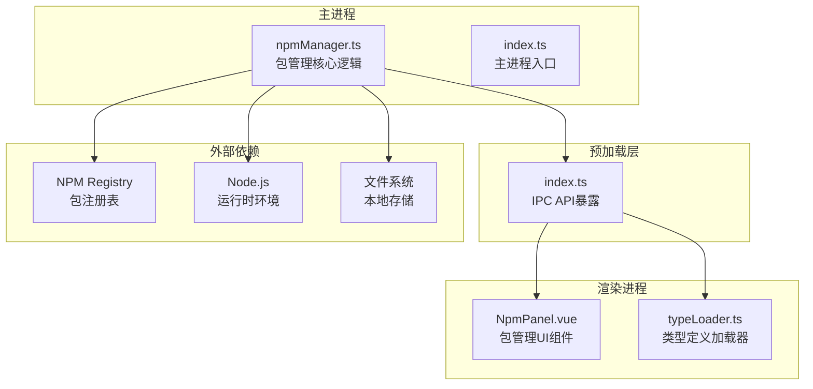
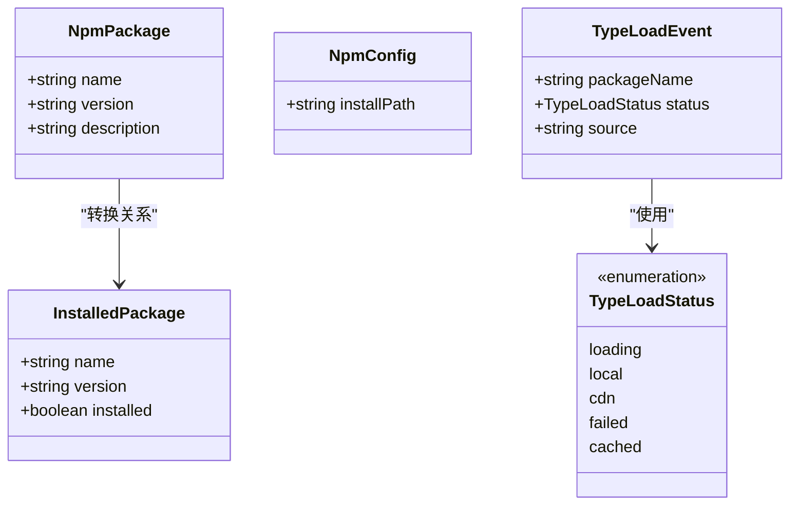
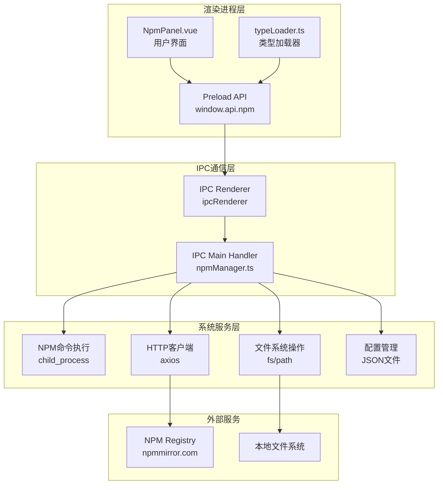
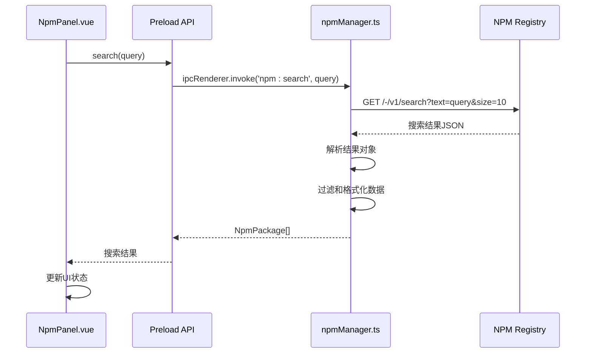
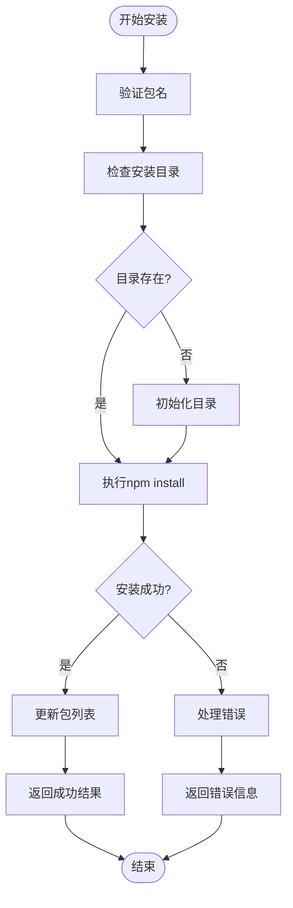
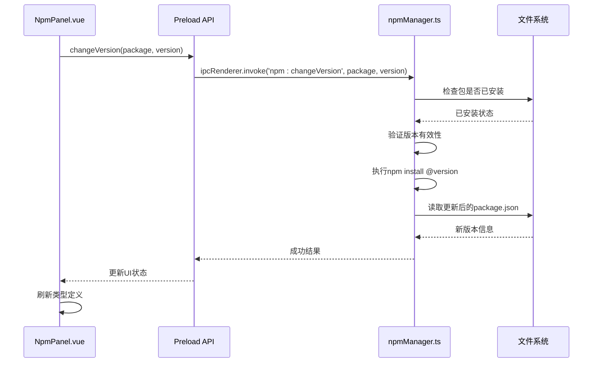
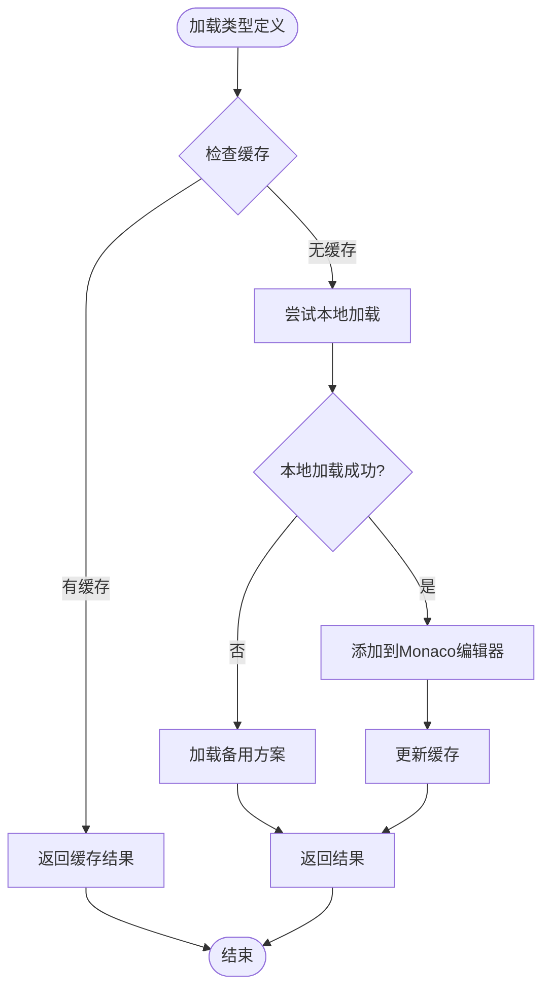
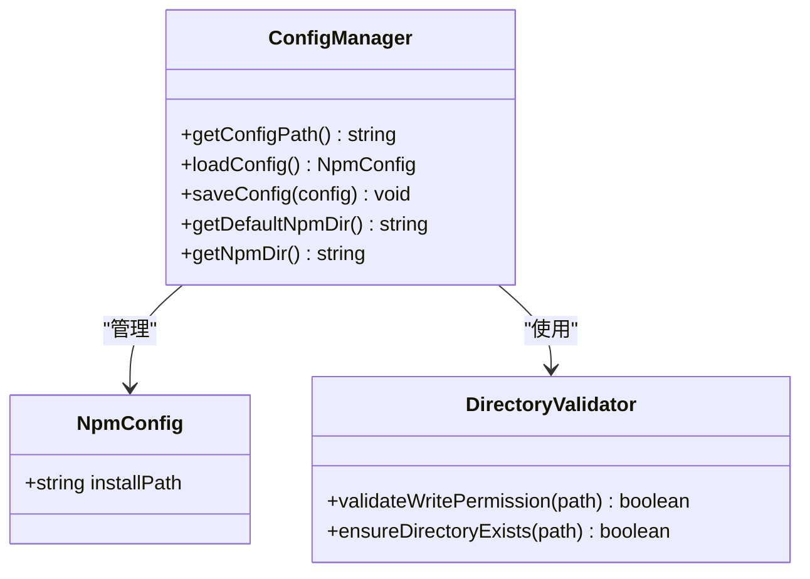
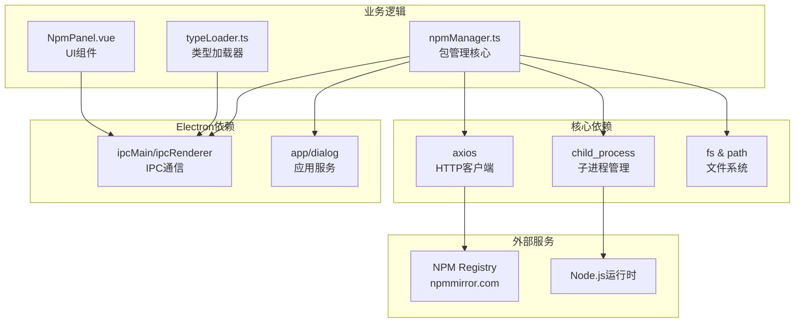
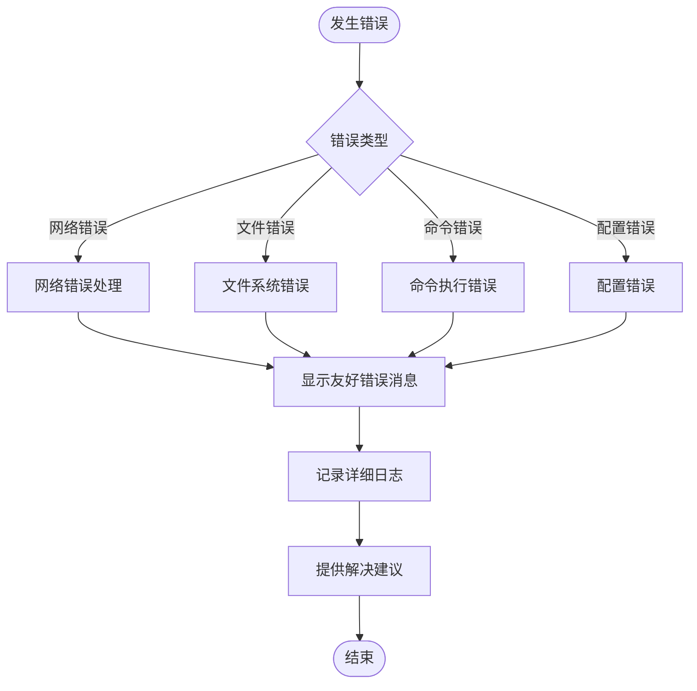

# NPM管理接口

<cite>
**本文档引用的文件**
- [npmManager.ts](file://src/main/services/npmManager.ts)
- [NpmPanel.vue](file://src/renderer/src/views/runjs/components/NpmPanel.vue)
- [index.ts](file://src/preload/index.ts)
- [typeLoader.ts](file://src/renderer/src/utils/typeLoader.ts)
- [index.ts](file://src/main/index.ts)
- [package.json](file://package.json)
</cite>

## 目录
1. [简介](#简介)
2. [项目结构](#项目结构)
3. [核心组件](#核心组件)
4. [架构概览](#架构概览)
5. [详细组件分析](#详细组件分析)
6. [依赖分析](#依赖分析)
7. [性能考虑](#性能考虑)
8. [故障排除指南](#故障排除指南)
9. [结论](#结论)

## 简介

NPM管理服务是开发者工具箱中的核心功能模块，提供了完整的包管理解决方案。该服务通过Electron的IPC机制实现了跨进程的包管理操作，包括包搜索、安装、卸载、版本切换、类型定义获取等功能。系统采用双层架构设计，主进程负责实际的包管理操作，渲染进程提供用户界面和交互体验。

## 项目结构

项目采用典型的Electron应用结构，NPM管理功能主要分布在以下模块中：

**图表来源**
- [npmManager.ts:1-635](file://src/main/services/npmManager.ts#L1-L635)
- [index.ts:1-444](file://src/main/index.ts#L1-L444)

**章节来源**
- [npmManager.ts:1-635](file://src/main/services/npmManager.ts#L1-L635)
- [index.ts:1-444](file://src/main/index.ts#L1-L444)

## 核心组件

### 主要数据结构

系统定义了几个关键的数据接口来描述包管理操作：

**图表来源**
- [npmManager.ts:7-21](file://src/main/services/npmManager.ts#L7-L21)
- [typeLoader.ts:8-15](file://src/renderer/src/utils/typeLoader.ts#L8-L15)

### IPC接口定义

系统通过Electron的IPC机制暴露了完整的包管理API：

| 接口名称 | 参数类型 | 返回值类型 | 描述 |
|---------|----------|------------|------|
| npm:search | string | NpmPackage[] | 搜索NPM包 |
| npm:install | string | InstallResult | 安装指定包 |
| npm:uninstall | string | UninstallResult | 卸载指定包 |
| npm:list | void | InstalledPackage[] | 获取已安装包列表 |
| npm:versions | string | string[] | 获取包的版本列表 |
| npm:changeVersion | string, string | VersionChangeResult | 切换包版本 |
| npm:getDir | void | string | 获取包安装目录 |
| npm:setDir | void | SetDirResult | 设置包安装目录 |
| npm:resetDir | void | ResetDirResult | 重置包安装目录 |
| npm:getTypes | string | TypesResult | 获取包类型定义 |
| npm:clearTypeCache | string | void | 清除类型缓存 |

**章节来源**
- [index.ts:71-85](file://src/preload/index.ts#L71-L85)
- [npmManager.ts:211-552](file://src/main/services/npmManager.ts#L211-L552)

## 架构概览

系统采用分层架构设计，实现了清晰的职责分离：

**图表来源**
- [NpmPanel.vue:1-431](file://src/renderer/src/views/runjs/components/NpmPanel.vue#L1-L431)
- [npmManager.ts:154-194](file://src/main/services/npmManager.ts#L154-L194)

## 详细组件分析

### 包搜索功能

包搜索功能实现了高效的包发现机制，支持实时搜索和结果过滤：

**图表来源**
- [NpmPanel.vue:59-78](file://src/renderer/src/views/runjs/components/NpmPanel.vue#L59-L78)
- [npmManager.ts:212-230](file://src/main/services/npmManager.ts#L212-L230)

搜索查询支持以下特性：
- **实时搜索**：输入延迟300ms触发搜索
- **结果过滤**：最多返回10个结果
- **错误处理**：网络超时10秒，搜索失败返回空数组
- **防抖机制**：避免频繁请求

**章节来源**
- [NpmPanel.vue:164-171](file://src/renderer/src/views/runjs/components/NpmPanel.vue#L164-L171)
- [npmManager.ts:212-230](file://src/main/services/npmManager.ts#L212-L230)

### 包安装与卸载

包安装和卸载功能提供了完整的生命周期管理：

**图表来源**
- [npmManager.ts:233-267](file://src/main/services/npmManager.ts#L233-L267)

安装流程包含以下步骤：
1. **参数验证**：检查包名格式
2. **目录准备**：确保安装目录存在
3. **命令执行**：调用npm命令安装
4. **状态更新**：刷新本地包列表
5. **结果反馈**：返回安装结果

**章节来源**
- [npmManager.ts:233-304](file://src/main/services/npmManager.ts#L233-L304)

### 版本管理功能

版本管理提供了灵活的版本切换机制：

**图表来源**
- [NpmPanel.vue:139-156](file://src/renderer/src/views/runjs/components/NpmPanel.vue#L139-L156)
- [npmManager.ts:379-426](file://src/main/services/npmManager.ts#L379-L426)

版本切换支持：
- **版本验证**：检查目标版本是否存在
- **原子操作**：使用npm原生命令确保一致性
- **类型更新**：自动重新加载相关类型定义
- **状态同步**：保持UI和实际状态一致

**章节来源**
- [NpmPanel.vue:117-156](file://src/renderer/src/views/runjs/components/NpmPanel.vue#L117-L156)
- [npmManager.ts:379-426](file://src/main/services/npmManager.ts#L379-L426)

### 类型定义管理系统

类型定义系统提供了智能的类型文件加载和缓存机制：

**图表来源**
- [typeLoader.ts:68-103](file://src/renderer/src/utils/typeLoader.ts#L68-L103)

类型加载策略：
1. **缓存优先**：优先使用内存缓存
2. **本地优先**：检查本地node_modules
3. **智能降级**：无本地类型时返回失败
4. **Monaco集成**：直接注入到编辑器中

**章节来源**
- [typeLoader.ts:68-139](file://src/renderer/src/utils/typeLoader.ts#L68-L139)

### 配置管理

系统提供了灵活的配置管理机制：

**图表来源**
- [npmManager.ts:19-47](file://src/main/services/npmManager.ts#L19-L47)
- [npmManager.ts:49-80](file://src/main/services/npmManager.ts#L49-L80)

配置特性：
- **用户数据目录**：使用Electron的userData路径
- **JSON存储**：简单可靠的配置存储
- **目录验证**：自动检查写入权限
- **回退机制**：失败时自动回退到默认目录

**章节来源**
- [npmManager.ts:19-80](file://src/main/services/npmManager.ts#L19-L80)

## 依赖分析

系统依赖关系图展示了各模块间的耦合程度：

**图表来源**
- [npmManager.ts:1-6](file://src/main/services/npmManager.ts#L1-L6)
- [package.json:28-51](file://package.json#L28-L51)

**章节来源**
- [package.json:28-51](file://package.json#L28-L51)
- [npmManager.ts:1-6](file://src/main/services/npmManager.ts#L1-L6)

## 性能考虑

系统在多个层面实现了性能优化：

### 并发控制
- **批量加载**：类型加载支持批量处理，限制并发数量
- **防抖机制**：搜索输入使用300ms防抖
- **超时控制**：网络请求设置合理超时时间

### 缓存策略
- **内存缓存**：已加载的类型定义缓存在内存中
- **文件缓存**：包信息持久化存储
- **智能失效**：版本切换时自动清理相关缓存

### 资源管理
- **进程隔离**：使用独立子进程执行npm命令
- **资源清理**：及时清理临时文件和监听器
- **内存监控**：避免内存泄漏和过度占用

## 故障排除指南

### 常见问题及解决方案

| 问题类型 | 症状 | 可能原因 | 解决方案 |
|---------|------|----------|----------|
| 安装失败 | 包安装后无法使用 | 网络连接问题 | 检查代理设置，重试安装 |
| 版本切换失败 | 切换后仍使用旧版本 | npm命令执行失败 | 清理缓存，重新安装 |
| 类型定义缺失 | 编辑器无类型提示 | 本地类型文件损坏 | 重新安装包，清理类型缓存 |
| 目录权限错误 | 无法写入安装目录 | 权限不足 | 修改目录权限或选择其他目录 |

### 错误处理机制

系统实现了多层次的错误处理：

**章节来源**
- [npmManager.ts:260-301](file://src/main/services/npmManager.ts#L260-L301)
- [typeLoader.ts:96-102](file://src/renderer/src/utils/typeLoader.ts#L96-L102)

## 结论

NPM管理服务是一个功能完整、设计合理的包管理解决方案。系统通过清晰的架构设计、完善的错误处理机制和优化的性能策略，为开发者提供了流畅的包管理体验。

### 主要优势
- **架构清晰**：分层设计便于维护和扩展
- **用户体验好**：响应迅速，界面友好
- **可靠性高**：完善的错误处理和恢复机制
- **性能优秀**：多层缓存和并发优化

### 改进建议
- **离线模式**：可以考虑实现更完善的离线支持
- **代理配置**：增强代理设置的灵活性
- **版本锁定**：添加更细粒度的版本控制选项
- **增量更新**：优化大型包的安装和更新流程

该系统为开发者工具箱提供了坚实的包管理基础，能够满足大多数开发场景下的包管理需求。