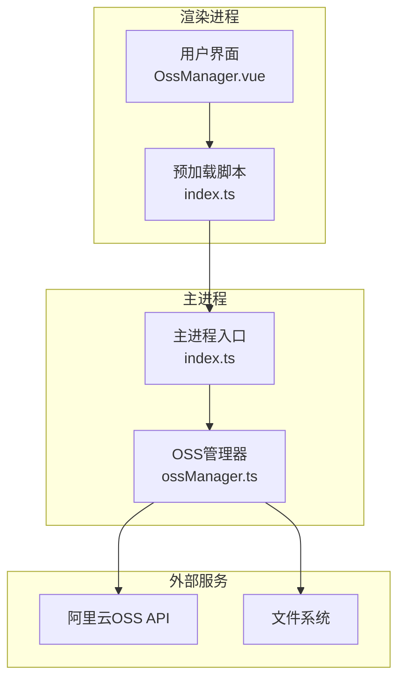
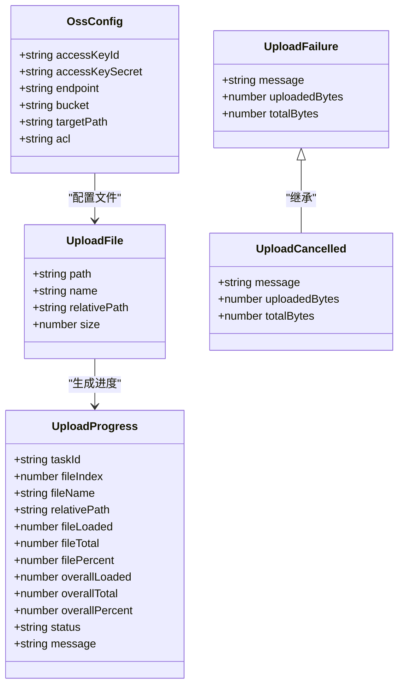
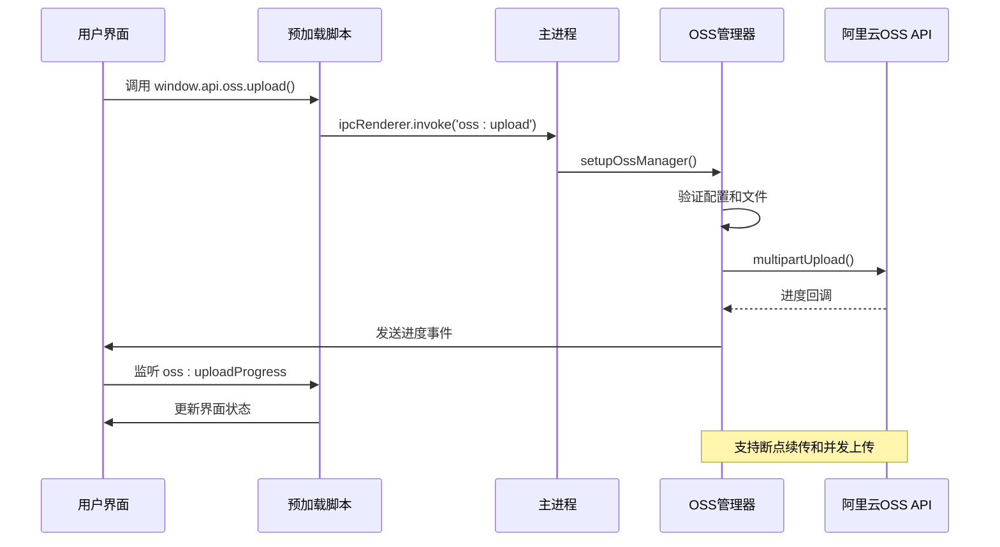
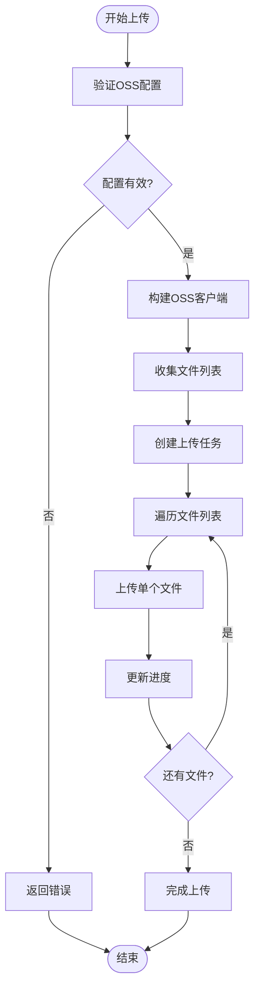
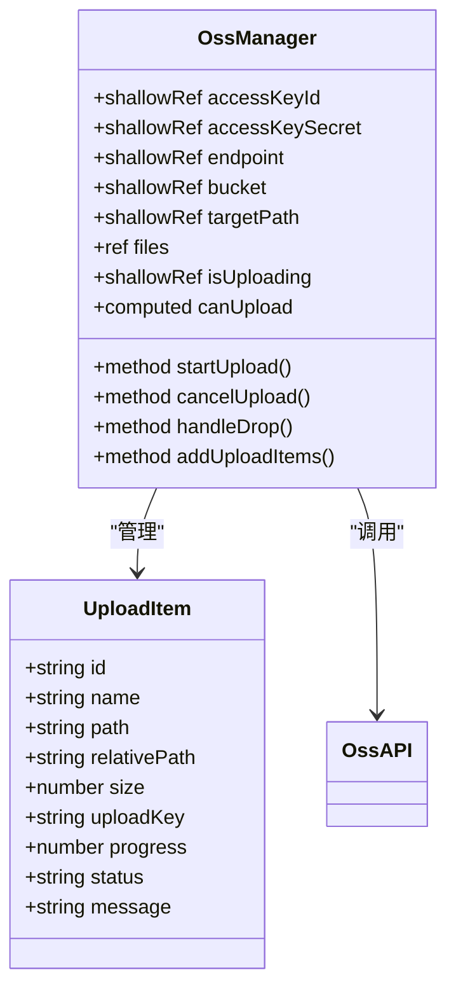
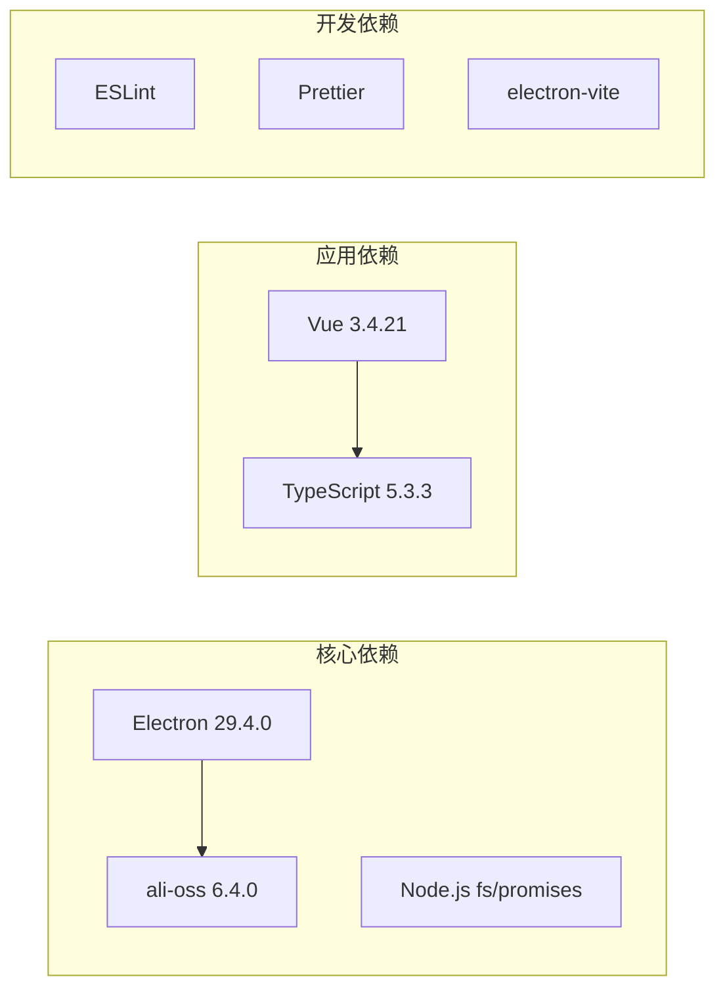
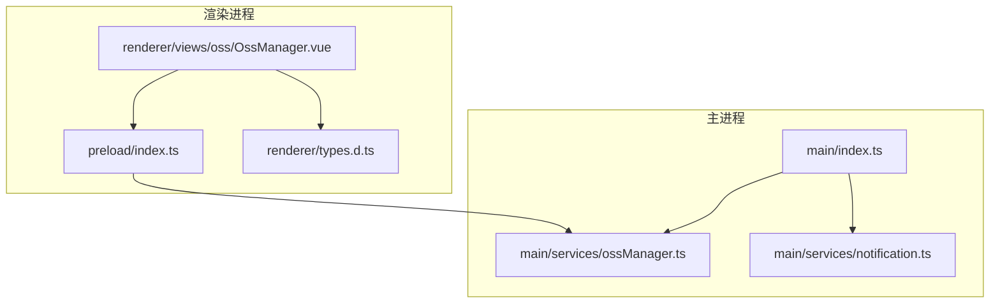

# OSS管理接口

<cite>
**本文档引用的文件**
- [ossManager.ts](file://src/main/services/ossManager.ts)
- [OssManager.vue](file://src/renderer/src/views/oss/OssManager.vue)
- [index.ts](file://src/preload/index.ts)
- [index.ts](file://src/main/index.ts)
- [types.d.ts](file://src/renderer/src/types.d.ts)
</cite>

## 目录
1. [简介](#简介)
2. [项目结构](#项目结构)
3. [核心组件](#核心组件)
4. [架构概览](#架构概览)
5. [详细组件分析](#详细组件分析)
6. [依赖关系分析](#依赖关系分析)
7. [性能考虑](#性能考虑)
8. [故障排除指南](#故障排除指南)
9. [结论](#结论)

## 简介

OSS管理服务是一个基于Electron框架开发的阿里云OSS文件上传管理工具。该服务提供了完整的文件上传、进度监控、错误处理和用户界面集成功能。通过IPC接口实现主进程与渲染进程之间的通信，支持多文件并发上传、断点续传和实时进度反馈。

## 项目结构

OSS管理服务采用典型的Electron应用架构，主要分为三个层次：

**图表来源**
- [index.ts:1-50](file://src/renderer/src/views/oss/OssManager.vue#L1-L50)
- [index.ts:117-154](file://src/preload/index.ts#L117-L154)
- [index.ts:425-427](file://src/main/index.ts#L425-L427)

**章节来源**
- [index.ts:1-50](file://src/renderer/src/views/oss/OssManager.vue#L1-L50)
- [index.ts:117-154](file://src/preload/index.ts#L117-L154)
- [index.ts:425-427](file://src/main/index.ts#L425-L427)

## 核心组件

### 主要数据结构

OSS管理服务定义了以下核心数据结构：

**图表来源**
- [ossManager.ts:14-62](file://src/main/services/ossManager.ts#L14-L62)
- [types.d.ts:79-128](file://src/renderer/src/types.d.ts#L79-L128)

### IPC接口定义

服务通过以下IPC接口实现主进程与渲染进程的通信：

| 接口名称 | 类型 | 参数 | 返回值 | 描述 |
|---------|------|------|--------|------|
| `oss:selectFiles` | `ipcMain.handle` | 无 | `Promise<UploadFile[]>` | 选择单个或多个文件 |
| `oss:selectFolder` | `ipcMain.handle` | 无 | `Promise<UploadFile[]>` | 选择整个文件夹 |
| `oss:upload` | `ipcMain.handle` | `UploadPayload` | `Promise<OssUploadResult>` | 开始文件上传任务 |
| `oss:cancelUpload` | `ipcMain.handle` | `{taskId: string}` | `Promise<{success: boolean, error?: string}>` | 取消上传任务 |
| `oss:uploadProgress` | `ipcRenderer.on` | `UploadProgress` | 无 | 上传进度事件 |

**章节来源**
- [ossManager.ts:296-438](file://src/main/services/ossManager.ts#L296-L438)
- [index.ts:117-154](file://src/preload/index.ts#L117-L154)

## 架构概览

OSS管理服务采用分层架构设计，实现了清晰的关注点分离：

**图表来源**
- [index.ts:117-154](file://src/preload/index.ts#L117-L154)
- [ossManager.ts:334-438](file://src/main/services/ossManager.ts#L334-L438)

## 详细组件分析

### OSS管理器核心功能

#### 配置验证与客户端构建

OSS管理器负责处理所有与阿里云OSS相关的操作，包括配置验证、客户端构建和文件处理。

**图表来源**
- [ossManager.ts:334-438](file://src/main/services/ossManager.ts#L334-L438)
- [ossManager.ts:191-294](file://src/main/services/ossManager.ts#L191-L294)

#### 并发上传与进度监控

服务实现了高效的并发上传机制，支持多文件同时上传和实时进度监控：

**章节来源**
- [ossManager.ts:365-422](file://src/main/services/ossManager.ts#L365-L422)
- [ossManager.ts:267-294](file://src/main/services/ossManager.ts#L267-L294)

### 用户界面组件

#### Vue组件架构

OssManager.vue组件提供了完整的用户交互界面，包括文件选择、上传控制和进度显示。

**图表来源**
- [OssManager.vue:1-169](file://src/renderer/src/views/oss/OssManager.vue#L1-L169)
- [types.d.ts:79-128](file://src/renderer/src/types.d.ts#L79-L128)

#### 文件选择与拖拽处理

组件支持多种文件选择方式，包括拖拽、文件选择器和文件夹选择器：

**章节来源**
- [OssManager.vue:171-209](file://src/renderer/src/views/oss/OssManager.vue#L171-L209)
- [OssManager.vue:266-278](file://src/renderer/src/views/oss/OssManager.vue#L266-L278)

### 预加载脚本接口

#### 安全的IPC桥接

预加载脚本提供了安全的IPC接口桥接，确保渲染进程只能访问授权的API：

**章节来源**
- [index.ts:117-154](file://src/preload/index.ts#L117-L154)
- [types.d.ts:117-128](file://src/renderer/src/types.d.ts#L117-L128)

## 依赖关系分析

### 外部依赖

OSS管理服务依赖以下关键外部库：

**图表来源**
- [package.json](file://package.json)

### 内部模块依赖

服务内部模块之间存在清晰的依赖关系：

**图表来源**
- [index.ts:425-427](file://src/main/index.ts#L425-L427)
- [index.ts:216-228](file://src/preload/index.ts#L216-L228)

**章节来源**
- [index.ts:425-427](file://src/main/index.ts#L425-L427)
- [index.ts:216-228](file://src/preload/index.ts#L216-L228)

## 性能考虑

### 并发上传优化

服务实现了智能的并发上传策略：

- **并发控制**: 默认并发数为4，平衡上传速度和资源消耗
- **分片大小**: 默认5MB分片，适合大多数网络环境
- **进度节流**: 进度更新频率限制在每80ms一次，减少UI更新开销
- **内存管理**: 使用引用计数跟踪已上传字节数，避免重复计算

### 错误处理与重试机制

服务提供了完善的错误处理机制：

- **断点续传**: 支持自动检测和恢复中断的上传任务
- **任务取消**: 完整的任务取消流程，包括清理临时文件
- **错误分类**: 区分网络错误、配置错误和业务逻辑错误
- **用户反馈**: 详细的错误信息和友好的用户提示

## 故障排除指南

### 常见问题诊断

#### 连接配置问题

**症状**: 上传前验证失败
**可能原因**:
- AccessKey配置错误
- Endpoint格式不正确
- Bucket名称不存在
- 网络连接问题

**解决方案**:
1. 验证AccessKey和AccessKeySecret的有效性
2. 检查Endpoint是否包含协议前缀
3. 确认Bucket名称拼写正确
4. 测试网络连接和防火墙设置

#### 上传失败问题

**症状**: 文件上传过程中断
**可能原因**:
- 网络不稳定
- 文件过大导致超时
- 权限不足
- 存储空间不足

**解决方案**:
1. 检查网络连接稳定性
2. 减小并发数或增加超时时间
3. 验证OSS权限设置
4. 清理存储空间或联系管理员

#### 进度显示异常

**症状**: 进度条不更新或显示错误百分比
**可能原因**:
- 进度回调频率过高
- 文件大小计算错误
- 任务ID不匹配

**解决方案**:
1. 检查进度更新逻辑
2. 验证文件统计信息
3. 确保任务ID一致性

**章节来源**
- [ossManager.ts:178-189](file://src/main/services/ossManager.ts#L178-L189)
- [ossManager.ts:296-311](file://src/main/services/ossManager.ts#L296-L311)

## 结论

OSS管理服务提供了一个功能完整、性能优异的文件上传解决方案。通过精心设计的架构和完善的错误处理机制，该服务能够满足各种复杂的上传需求。

### 主要优势

1. **用户友好**: 直观的拖拽界面和实时进度反馈
2. **功能丰富**: 支持多文件上传、断点续传、并发控制
3. **性能优化**: 智能的并发策略和内存管理
4. **错误处理**: 完善的错误分类和恢复机制
5. **安全性**: 严格的IPC接口和配置验证

### 技术特色

- 基于Electron的桌面应用架构
- 阿里云OSS SDK的深度集成
- Vue 3响应式数据绑定
- TypeScript类型安全保障
- 模块化的代码组织结构

该服务为开发者提供了一个可靠的OSS文件管理解决方案，适用于各种规模的企业和个人项目。