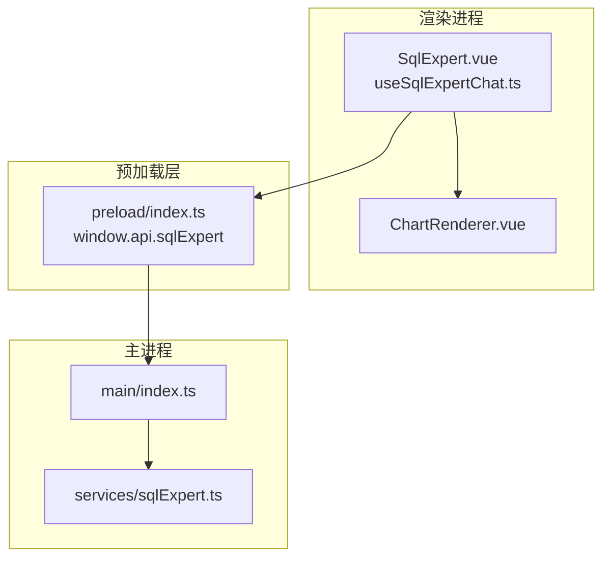
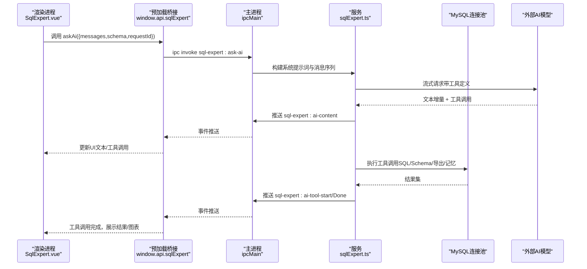
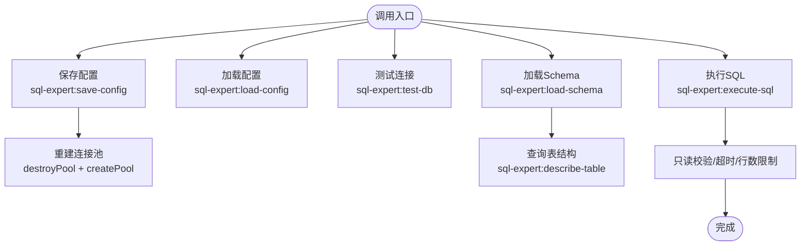
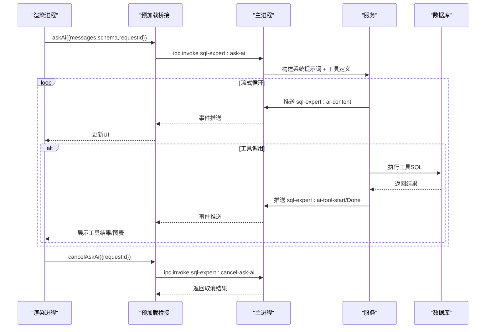
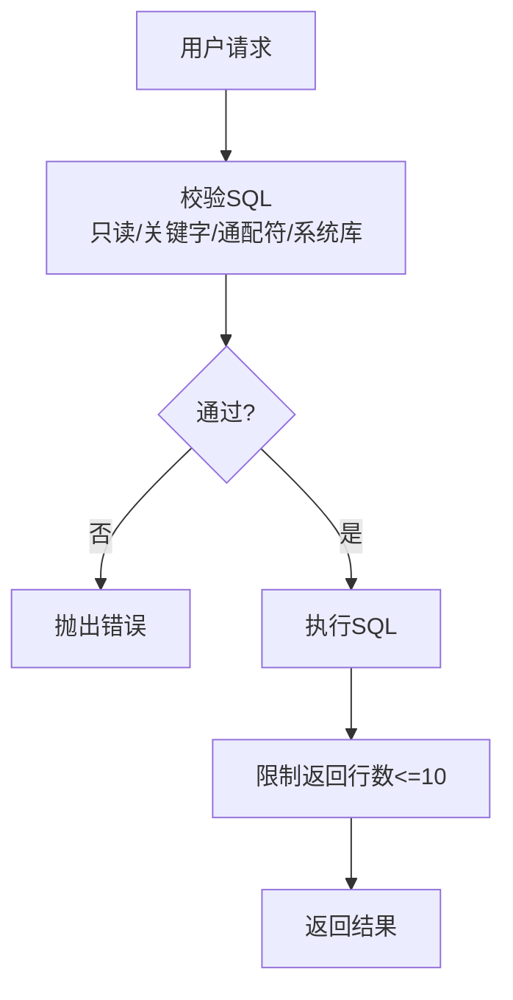
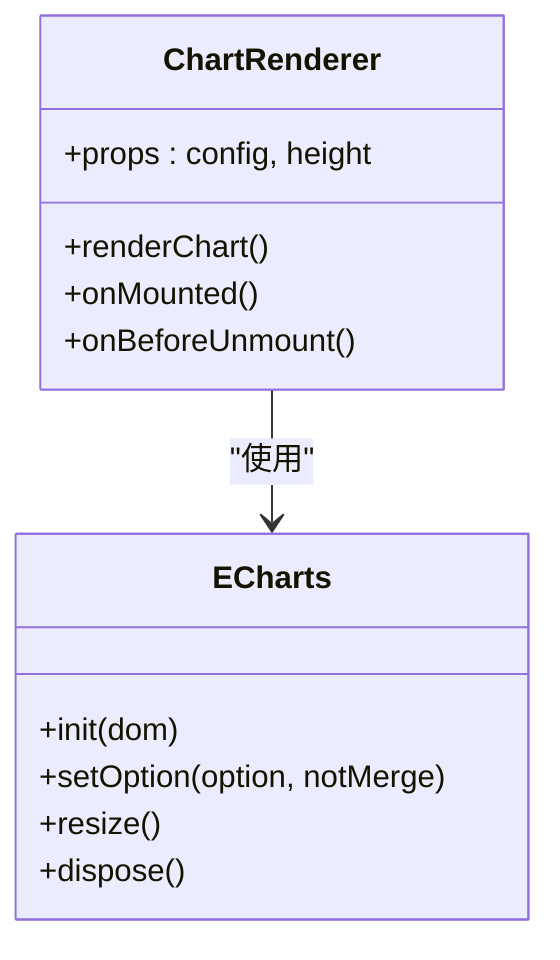
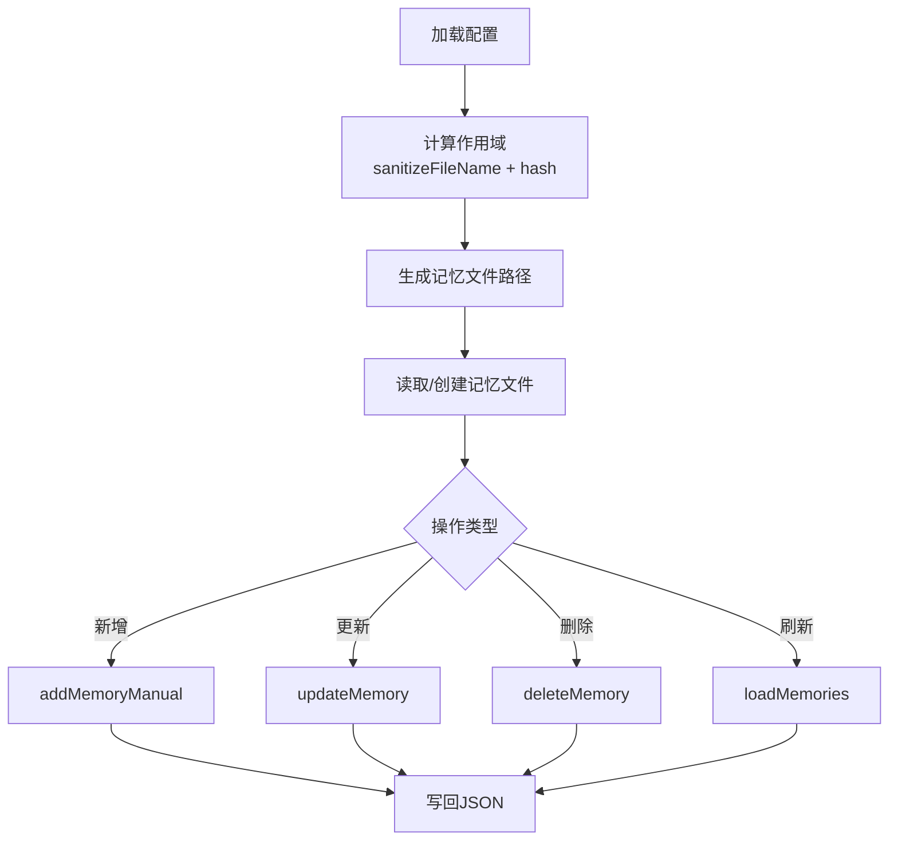
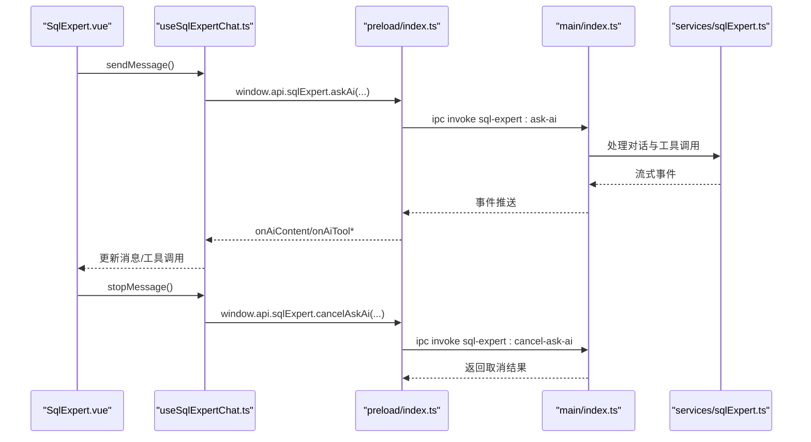
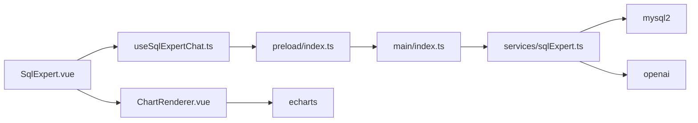

# SQL专家接口

<cite>
**本文引用的文件**
- [sqlExpert.ts](file://src/main/services/sqlExpert.ts)
- [index.ts](file://src/main/index.ts)
- [index.ts](file://src/preload/index.ts)
- [SqlExpert.vue](file://src/renderer/src/views/sqlexpert/SqlExpert.vue)
- [useSqlExpertChat.ts](file://src/renderer/src/views/sqlexpert/useSqlExpertChat.ts)
- [ChartRenderer.vue](file://src/renderer/src/views/sqlexpert/ChartRenderer.vue)
- [package.json](file://package.json)
- [README.md](file://README.md)
</cite>

## 目录
1. [简介](#简介)
2. [项目结构](#项目结构)
3. [核心组件](#核心组件)
4. [架构总览](#架构总览)
5. [详细组件分析](#详细组件分析)
6. [依赖关系分析](#依赖关系分析)
7. [性能考量](#性能考量)
8. [故障排查指南](#故障排查指南)
9. [结论](#结论)
10. [附录](#附录)

## 简介
本文件为“SQL专家服务”的接口规范文档，聚焦于AI驱动的数据库查询分析能力，覆盖以下方面：
- AI对话与工具调用：SQL执行、Schema查询、图表生成、数据导出、记忆沉淀
- 数据库连接管理：连接配置、连接池、连接状态与超时控制
- IPC接口：消息发送、流式响应、会话管理与取消
- Schema动态生成、查询优化建议与数据可视化转换
- 记忆系统管理、上下文保持与历史记录
- 错误处理、异常恢复与性能优化

## 项目结构
项目采用Electron + Vue 3架构，SQL专家服务位于主进程，通过安全桥接暴露IPC接口给渲染进程使用。

**图表来源**
- [index.ts:427-427](file://src/main/index.ts#L427-L427)
- [index.ts:156-212](file://src/preload/index.ts#L156-L212)
- [sqlExpert.ts:968-968](file://src/main/services/sqlExpert.ts#L968-L968)

**章节来源**
- [README.md:140-153](file://README.md#L140-L153)
- [package.json:1-120](file://package.json#L1-L120)

## 核心组件
- 主进程服务：负责数据库连接池、AI对话、工具调度、Schema与记忆持久化、IPC注册
- 预加载桥接：在渲染进程暴露受控API（window.api.sqlExpert）
- 渲染进程视图：负责对话UI、流式接收、工具调用可视化、图表渲染
- 图表渲染组件：基于ECharts的可视化组件

**章节来源**
- [sqlExpert.ts:968-1502](file://src/main/services/sqlExpert.ts#L968-L1502)
- [index.ts:156-212](file://src/preload/index.ts#L156-L212)
- [SqlExpert.vue:1-800](file://src/renderer/src/views/sqlexpert/SqlExpert.vue#L1-L800)
- [ChartRenderer.vue:1-66](file://src/renderer/src/views/sqlexpert/ChartRenderer.vue#L1-L66)

## 架构总览
SQL专家服务的端到端流程如下：
- 渲染进程发起AI对话（携带历史消息、Schema、工具定义）
- 主进程构建系统提示词与消息序列，调用外部AI模型（流式）
- AI模型返回文本内容与工具调用请求
- 主进程执行工具调用（SQL执行、Schema查询、图表配置、导出、记忆管理）
- 主进程通过IPC事件流式推送内容与工具调用进度
- 渲染进程实时更新UI，支持停止生成、重新生成、复制、打开导出文件等操作

**图表来源**
- [index.ts:156-212](file://src/preload/index.ts#L156-L212)
- [sqlExpert.ts:1280-1501](file://src/main/services/sqlExpert.ts#L1280-L1501)
- [SqlExpert.vue:585-611](file://src/renderer/src/views/sqlexpert/SqlExpert.vue#L585-L611)
- [useSqlExpertChat.ts:282-420](file://src/renderer/src/views/sqlexpert/useSqlExpertChat.ts#L282-L420)

## 详细组件分析

### 1) 数据库连接管理接口
- 连接配置
  - 保存配置：sql-expert:save-config
  - 加载配置：sql-expert:load-config
  - 测试连接：sql-expert:test-db
- 连接池管理
  - 创建连接池：createPool（连接数、队列、超时）
  - 获取连接池：ensurePool（懒加载/重建）
  - 销毁连接池：destroyPool
- Schema动态生成
  - 动态加载Schema：sql-expert:load-schema（information_schema）
  - 查询表结构：sql-expert:describe-table
- 只读SQL执行
  - 执行SQL：sql-expert:execute-sql（校验只读、限制行数、超时）

**图表来源**
- [sqlExpert.ts:994-1003](file://src/main/services/sqlExpert.ts#L994-L1003)
- [sqlExpert.ts:1060-1076](file://src/main/services/sqlExpert.ts#L1060-L1076)
- [sqlExpert.ts:970-991](file://src/main/services/sqlExpert.ts#L970-L991)
- [sqlExpert.ts:1159-1212](file://src/main/services/sqlExpert.ts#L1159-L1212)
- [sqlExpert.ts:1215-1241](file://src/main/services/sqlExpert.ts#L1215-L1241)
- [sqlExpert.ts:1244-1266](file://src/main/services/sqlExpert.ts#L1244-L1266)

**章节来源**
- [sqlExpert.ts:404-435](file://src/main/services/sqlExpert.ts#L404-L435)
- [sqlExpert.ts:1159-1266](file://src/main/services/sqlExpert.ts#L1159-L1266)

### 2) AI对话与工具调用接口
- 对话接口
  - 发起对话：sql-expert:ask-ai（支持取消）
  - 取消对话：sql-expert:cancel-ask-ai
  - 余额查询：sql-expert:check-balance
- 流式事件
  - 内容增量：sql-expert:ai-content
  - 工具开始：sql-expert:ai-tool-start
  - 工具完成：sql-expert:ai-tool-done
- 工具定义
  - query_database：只读SQL执行
  - describe_table_schema：查询表结构
  - render_chart：生成图表配置
  - export_data：导出CSV
  - save_memory：保存记忆

**图表来源**
- [index.ts:156-212](file://src/preload/index.ts#L156-L212)
- [sqlExpert.ts:1280-1501](file://src/main/services/sqlExpert.ts#L1280-L1501)
- [useSqlExpertChat.ts:282-420](file://src/renderer/src/views/sqlexpert/useSqlExpertChat.ts#L282-L420)

**章节来源**
- [sqlExpert.ts:473-572](file://src/main/services/sqlExpert.ts#L473-L572)
- [sqlExpert.ts:676-739](file://src/main/services/sqlExpert.ts#L676-L739)
- [sqlExpert.ts:1280-1501](file://src/main/services/sqlExpert.ts#L1280-L1501)

### 3) Schema动态生成与查询优化建议
- Schema生成
  - 从information_schema读取表名与注释，生成文本清单
  - 缓存至磁盘，供AI系统提示词使用
- 查询优化建议
  - 仅允许SELECT/WITH，禁止DDL/DML
  - 禁止SELECT *
  - 输出列必须使用AS别名
  - 禁止访问information_schema/mysql系统库（除非通过工具）
  - 工具调用结果最多返回10行样例

**图表来源**
- [sqlExpert.ts:365-400](file://src/main/services/sqlExpert.ts#L365-L400)
- [sqlExpert.ts:844-860](file://src/main/services/sqlExpert.ts#L844-L860)

**章节来源**
- [sqlExpert.ts:1159-1212](file://src/main/services/sqlExpert.ts#L1159-L1212)
- [sqlExpert.ts:365-400](file://src/main/services/sqlExpert.ts#L365-L400)

### 4) 数据可视化转换接口
- 图表生成
  - render_chart工具：支持line/bar/pie/line_bar
  - 构建ECharts配置：buildChartOption
- 渲染组件
  - ChartRenderer.vue：基于ECharts初始化、响应式尺寸、销毁释放

**图表来源**
- [ChartRenderer.vue:1-66](file://src/renderer/src/views/sqlexpert/ChartRenderer.vue#L1-L66)
- [sqlExpert.ts:746-785](file://src/main/services/sqlExpert.ts#L746-L785)

**章节来源**
- [sqlExpert.ts:898-916](file://src/main/services/sqlExpert.ts#L898-L916)
- [ChartRenderer.vue:1-66](file://src/renderer/src/views/sqlexpert/ChartRenderer.vue#L1-L66)

### 5) 记忆系统管理与上下文保持
- 记忆文件
  - 按数据库名+API Key哈希生成作用域，文件名为scope.json
  - 支持新增、更新、删除、刷新
- 上下文注入
  - 构建系统提示词时注入历史记忆
  - 支持save_memory工具沉淀可复用经验

**图表来源**
- [sqlExpert.ts:128-137](file://src/main/services/sqlExpert.ts#L128-L137)
- [sqlExpert.ts:172-264](file://src/main/services/sqlExpert.ts#L172-L264)
- [sqlExpert.ts:1078-1156](file://src/main/services/sqlExpert.ts#L1078-L1156)

**章节来源**
- [sqlExpert.ts:128-264](file://src/main/services/sqlExpert.ts#L128-L264)
- [sqlExpert.ts:437-471](file://src/main/services/sqlExpert.ts#L437-L471)

### 6) IPC接口定义与会话管理
- 渲染进程API（window.api.sqlExpert）
  - askAi/cancelAskAi/executeSql/saveConfig/loadConfig/loadSchema/loadMemories/updateMemory/deleteMemory/addMemory/describeTable/checkBalance
  - 流式事件监听：onAiContent/onAiToolStart/onAiToolDone/removeAiListeners
- 主进程IPC注册
  - sql-expert:* 命名空间下的所有处理函数
  - 会话ID与AbortController映射，支持取消

**图表来源**
- [index.ts:156-212](file://src/preload/index.ts#L156-L212)
- [index.ts:427-427](file://src/main/index.ts#L427-L427)
- [sqlExpert.ts:1280-1501](file://src/main/services/sqlExpert.ts#L1280-L1501)
- [useSqlExpertChat.ts:422-430](file://src/renderer/src/views/sqlexpert/useSqlExpertChat.ts#L422-L430)

**章节来源**
- [index.ts:156-212](file://src/preload/index.ts#L156-L212)
- [sqlExpert.ts:968-1502](file://src/main/services/sqlExpert.ts#L968-L1502)
- [useSqlExpertChat.ts:282-420](file://src/renderer/src/views/sqlexpert/useSqlExpertChat.ts#L282-L420)

## 依赖关系分析
- 外部依赖
  - mysql2：连接池与SQL执行
  - openai：流式AI调用
  - echarts：图表渲染
  - electron-updater：应用更新
- 内部模块
  - 主进程服务注册：setupSqlExpert
  - 预加载桥接：window.api.sqlExpert
  - 渲染进程：Vue组件与Composable

**图表来源**
- [package.json:28-51](file://package.json#L28-L51)
- [index.ts:427-427](file://src/main/index.ts#L427-L427)
- [index.ts:156-212](file://src/preload/index.ts#L156-L212)
- [sqlExpert.ts:968-1502](file://src/main/services/sqlExpert.ts#L968-L1502)
- [ChartRenderer.vue:1-66](file://src/renderer/src/views/sqlexpert/ChartRenderer.vue#L1-L66)

**章节来源**
- [package.json:28-51](file://package.json#L28-L51)

## 性能考量
- 连接池
  - 连接数限制为5，队列无上限，连接超时10秒
  - 配置变更后重建连接池，避免旧连接状态污染
- SQL执行
  - 超时60秒，结果集最多返回10行样例，避免大结果集阻塞
  - 只读校验与关键字过滤，防止慢查询与危险操作
- AI调用
  - 流式返回，逐步推送内容与工具调用进度
  - 使用AbortController支持取消，避免长时间占用
- 图表渲染
  - ECharts按需初始化与销毁，ResizeObserver响应容器尺寸变化
- 会话持久化
  - 本地存储会话，压缩工具调用结果中的大数据字段，降低存储体积

**章节来源**
- [sqlExpert.ts:404-435](file://src/main/services/sqlExpert.ts#L404-L435)
- [sqlExpert.ts:824-834](file://src/main/services/sqlExpert.ts#L824-L834)
- [sqlExpert.ts:365-400](file://src/main/services/sqlExpert.ts#L365-L400)
- [sqlExpert.ts:676-739](file://src/main/services/sqlExpert.ts#L676-L739)
- [ChartRenderer.vue:33-57](file://src/renderer/src/views/sqlexpert/ChartRenderer.vue#L33-L57)
- [useSqlExpertChat.ts:104-121](file://src/renderer/src/views/sqlexpert/useSqlExpertChat.ts#L104-L121)

## 故障排查指南
- 数据库连接失败
  - 使用sql-expert:test-db验证连接参数
  - 检查连接池是否已重建（保存配置后）
- AI请求失败
  - 确认AI URL/API Key/model已配置
  - 检查网络代理设置（应用内设置）
  - 使用sql-expert:check-balance确认余额状态
- SQL执行异常
  - 检查是否违反只读规则、是否使用SELECT *、是否访问系统库
  - 查看工具调用返回的错误信息
- 图表渲染问题
  - 确认图表配置字段（type/xAxisData/series）正确
  - 检查容器尺寸变化导致的渲染时机
- 记忆管理异常
  - 确认数据库名与API Key一致，作用域文件存在
  - 刷新记忆列表或重新加载Schema

**章节来源**
- [sqlExpert.ts:970-991](file://src/main/services/sqlExpert.ts#L970-L991)
- [sqlExpert.ts:1006-1057](file://src/main/services/sqlExpert.ts#L1006-L1057)
- [sqlExpert.ts:365-400](file://src/main/services/sqlExpert.ts#L365-L400)
- [ChartRenderer.vue:33-57](file://src/renderer/src/views/sqlexpert/ChartRenderer.vue#L33-L57)
- [sqlExpert.ts:1078-1156](file://src/main/services/sqlExpert.ts#L1078-L1156)

## 结论
SQL专家服务通过主进程的数据库连接池与AI工具调度，结合渲染进程的流式UI与可视化组件，实现了从自然语言到SQL执行、结果分析与图表生成的完整闭环。其接口设计强调安全性（只读校验、系统库隔离）、可观测性（流式事件、用量统计）与可维护性（连接池管理、记忆系统、会话持久化）。建议在生产环境中配合代理与限额策略，确保网络稳定与成本可控。

## 附录
- 接口一览（渲染进程调用）
  - askAi/cancelAskAi/executeSql/saveConfig/loadConfig/loadSchema/loadMemories/updateMemory/deleteMemory/addMemory/describeTable/checkBalance
  - 流式事件：onAiContent/onAiToolStart/onAiToolDone/removeAiListeners
- 关键配置
  - 数据库：host/port/user/password/database
  - AI：url/apiKey/model
  - 配置与Schema、记忆文件保存在Electron userData目录

**章节来源**
- [index.ts:156-212](file://src/preload/index.ts#L156-L212)
- [README.md:122-129](file://README.md#L122-L129)