# 代码运行器接口

<cite>
**本文档引用的文件**
- [codeRunner.ts](file://src/main/services/codeRunner.ts)
- [index.ts](file://src/preload/index.ts)
- [RunJS.vue](file://src/renderer/src/views/runjs/RunJS.vue)
- [OutputPanel.vue](file://src/renderer/src/views/runjs/components/OutputPanel.vue)
- [CodeEditor.vue](file://src/renderer/src/views/runjs/components/CodeEditor.vue)
- [monacoSetup.ts](file://src/renderer/src/utils/monacoSetup.ts)
- [typeLoader.ts](file://src/renderer/src/utils/typeLoader.ts)
- [npmManager.ts](file://src/main/services/npmManager.ts)
- [package.json](file://package.json)
</cite>

## 目录
1. [简介](#简介)
2. [项目结构](#项目结构)
3. [核心组件](#核心组件)
4. [架构概览](#架构概览)
5. [详细组件分析](#详细组件分析)
6. [依赖关系分析](#依赖关系分析)
7. [性能考虑](#性能考虑)
8. [故障排除指南](#故障排除指南)
9. [结论](#结论)

## 简介

代码运行器服务是一个基于 Electron 的代码执行引擎，提供了安全的沙箱环境来执行 JavaScript 和 TypeScript 代码。该系统通过 IPC 接口与渲染进程通信，实现了完整的代码执行生命周期管理，包括代码编译、沙箱执行、实时日志传输和资源清理等功能。

## 项目结构

代码运行器服务采用分层架构设计，主要包含以下层次：

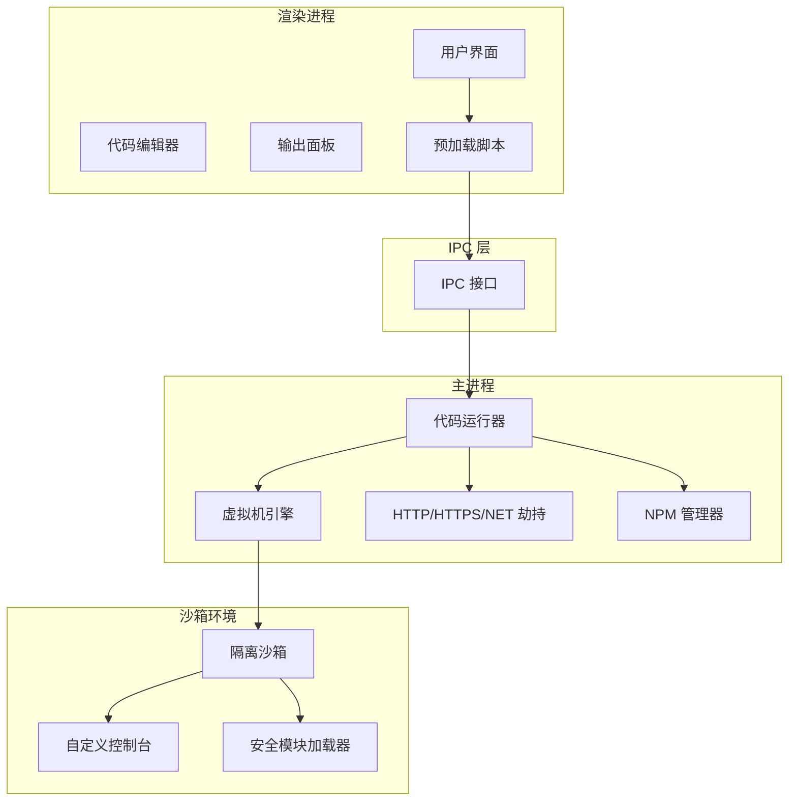

**图表来源**
- [codeRunner.ts:1-461](file://src/main/services/codeRunner.ts#L1-L461)
- [index.ts:62-69](file://src/preload/index.ts#L62-L69)

**章节来源**
- [codeRunner.ts:1-461](file://src/main/services/codeRunner.ts#L1-L461)
- [index.ts:1-229](file://src/preload/index.ts#L1-L229)

## 核心组件

### IPC 接口定义

代码运行器通过 Electron 的 IPC 机制提供以下核心接口：

#### 代码执行接口

| 接口名称 | 方法类型 | 参数 | 返回值 | 描述 |
|---------|---------|------|--------|------|
| code:run | handle | code: string<br/>language: 'javascript' \| 'typescript' | Promise<RunResult> | 执行代码的主要接口 |
| code:stop | on | - | void | 停止代码执行并清理资源 |
| code:clean | handle | - | Promise<boolean> | 手动清理所有活动的服务器 |
| code:killPort | handle | port: number | Promise<{success: boolean, message: string}> | 根据端口号终止进程 |

#### RunResult 数据结构

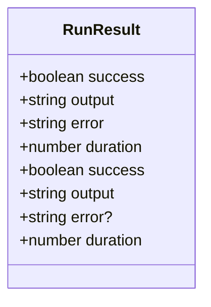

**图表来源**
- [codeRunner.ts:14-19](file://src/main/services/codeRunner.ts#L14-L19)

#### 日志传输接口

渲染进程通过 `code:log` 事件接收实时日志：

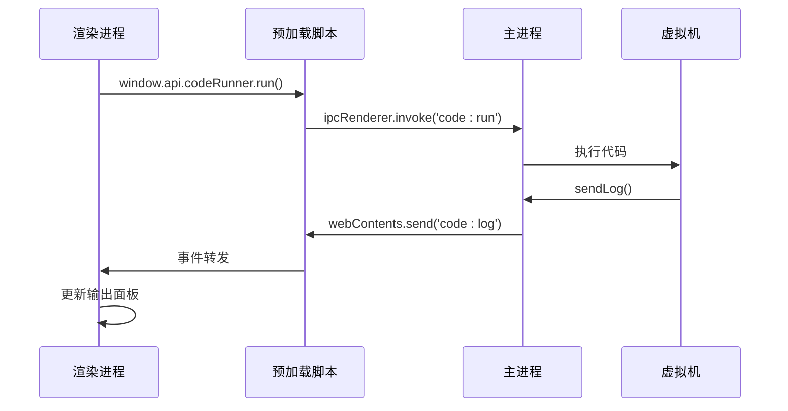

**图表来源**
- [codeRunner.ts:109-116](file://src/main/services/codeRunner.ts#L109-L116)
- [index.ts:63-69](file://src/preload/index.ts#L63-L69)

**章节来源**
- [codeRunner.ts:98-318](file://src/main/services/codeRunner.ts#L98-L318)
- [index.ts:62-69](file://src/preload/index.ts#L62-L69)

## 架构概览

代码运行器采用多层安全架构，确保代码执行的安全性和稳定性：

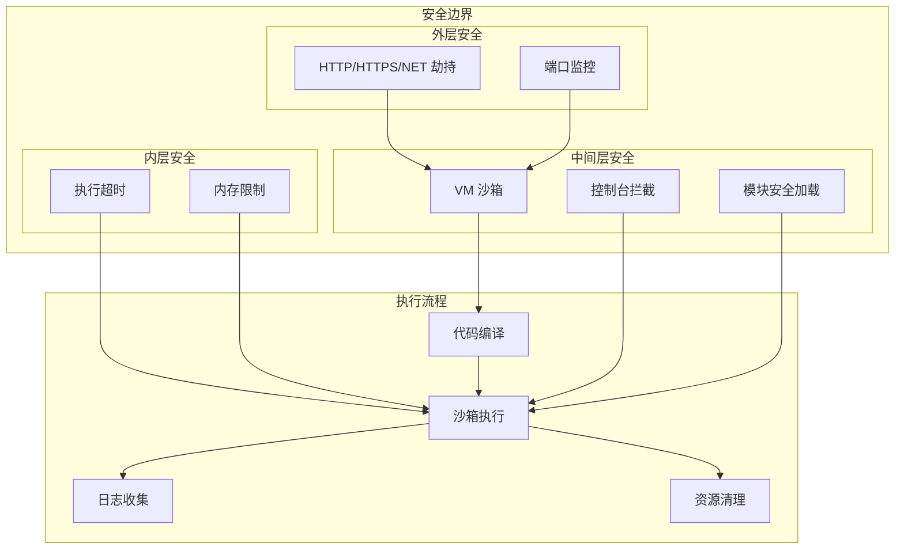

**图表来源**
- [codeRunner.ts:24-75](file://src/main/services/codeRunner.ts#L24-L75)
- [codeRunner.ts:141-181](file://src/main/services/codeRunner.ts#L141-L181)

## 详细组件分析

### 沙箱安全机制

#### VM 上下文创建

代码运行器创建了高度隔离的沙箱环境：

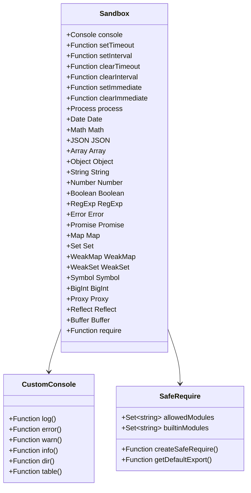

**图表来源**
- [codeRunner.ts:141-181](file://src/main/services/codeRunner.ts#L141-L181)
- [codeRunner.ts:364-460](file://src/main/services/codeRunner.ts#L364-L460)

#### 模块劫持机制

系统实现了对关键模块的全局劫持：

| 被劫持模块 | 劫持方式 | 目的 |
|-----------|---------|------|
| http | Proxy 代理 + require.cache 替换 | 追踪 HTTP 服务器实例 |
| https | Proxy 代理 + require.cache 替换 | 追踪 HTTPS 服务器实例 |
| net | Proxy 代理 + Server 构造函数拦截 | 追踪网络服务器实例 |

#### 安全限制实现

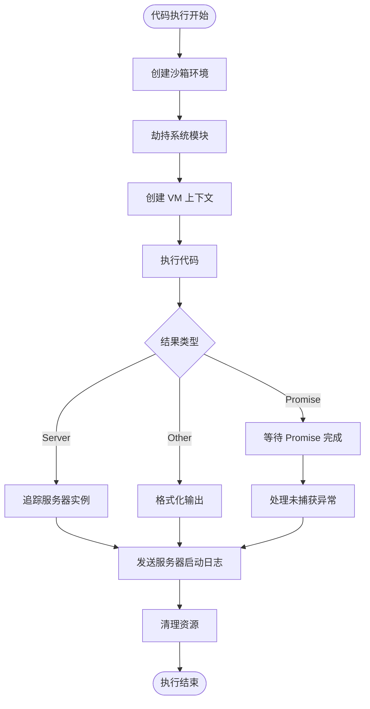

**图表来源**
- [codeRunner.ts:183-211](file://src/main/services/codeRunner.ts#L183-L211)
- [codeRunner.ts:237-246](file://src/main/services/codeRunner.ts#L237-L246)

**章节来源**
- [codeRunner.ts:24-96](file://src/main/services/codeRunner.ts#L24-L96)
- [codeRunner.ts:141-211](file://src/main/services/codeRunner.ts#L141-L211)

### TypeScript 编译处理

#### 编译流程

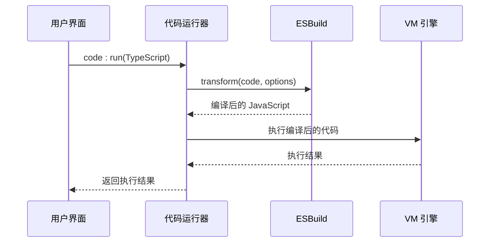

**图表来源**
- [codeRunner.ts:121-129](file://src/main/services/codeRunner.ts#L121-L129)

#### 编译选项配置

| 选项 | 值 | 说明 |
|------|-----|------|
| loader | 'ts' | TypeScript 加载器 |
| target | 'es2020' | 目标 ECMAScript 版本 |
| format | 'cjs' | CommonJS 输出格式 |

**章节来源**
- [codeRunner.ts:121-129](file://src/main/services/codeRunner.ts#L121-L129)

### 输出格式化规则

#### 格式化策略

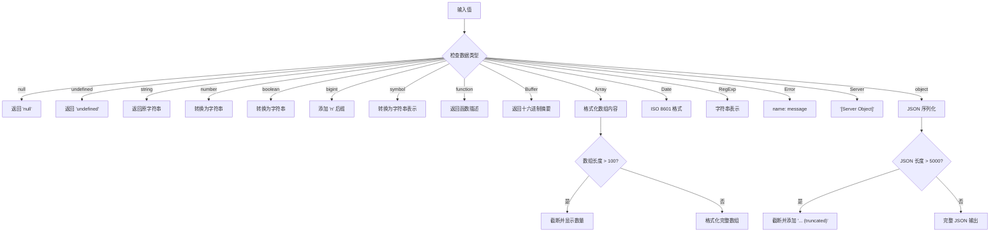

**图表来源**
- [codeRunner.ts:320-362](file://src/main/services/codeRunner.ts#L320-L362)

**章节来源**
- [codeRunner.ts:320-362](file://src/main/services/codeRunner.ts#L320-L362)

### 错误处理机制

#### 错误分类处理

| 错误类型 | 处理方式 | 输出格式 |
|----------|---------|----------|
| 编译错误 | 捕获并返回 | 标准化错误消息 |
| 运行时错误 | 捕获并返回 | 标准化错误消息 |
| Promise 未捕获异常 | 捕获并记录 | '[Error] Unhandled Rejection: message' |
| 服务器端口冲突 | 清理并重试 | 清理后的成功消息 |

#### 资源清理策略

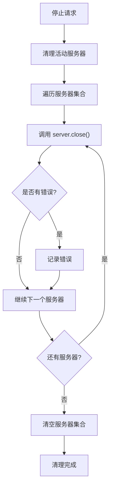

**图表来源**
- [codeRunner.ts:77-96](file://src/main/services/codeRunner.ts#L77-L96)

**章节来源**
- [codeRunner.ts:220-233](file://src/main/services/codeRunner.ts#L220-L233)
- [codeRunner.ts:77-96](file://src/main/services/codeRunner.ts#L77-L96)

### 实时日志传输

#### 日志流处理

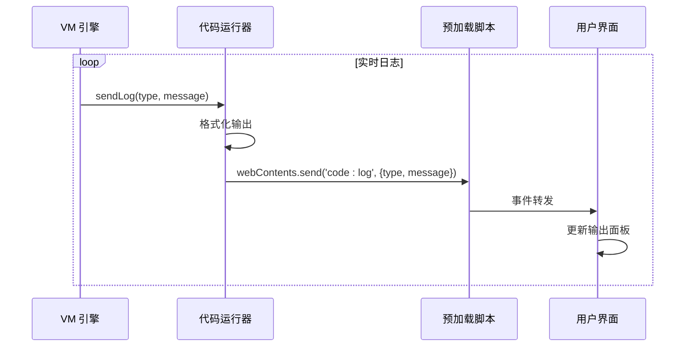

**图表来源**
- [codeRunner.ts:109-116](file://src/main/services/codeRunner.ts#L109-L116)
- [index.ts:63-69](file://src/preload/index.ts#L63-L69)

**章节来源**
- [codeRunner.ts:109-116](file://src/main/services/codeRunner.ts#L109-L116)

### 性能监控

#### 执行时间统计

系统提供精确的执行时间测量：

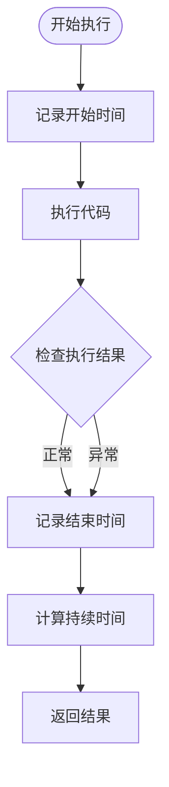

**图表来源**
- [codeRunner.ts:101-213](file://src/main/services/codeRunner.ts#L101-L213)

**章节来源**
- [codeRunner.ts:101-213](file://src/main/services/codeRunner.ts#L101-L213)

## 依赖关系分析

### 外部依赖

| 依赖包 | 版本 | 用途 |
|--------|------|------|
| esbuild | ^0.24.2 | TypeScript 编译器 |
| vm | Node.js 内置 | 代码执行沙箱 |
| net | Node.js 内置 | 网络服务器追踪 |
| http | Node.js 内置 | HTTP 服务器追踪 |
| https | Node.js 内置 | HTTPS 服务器追踪 |
| child_process | Node.js 内置 | 进程管理 |

### 内部依赖

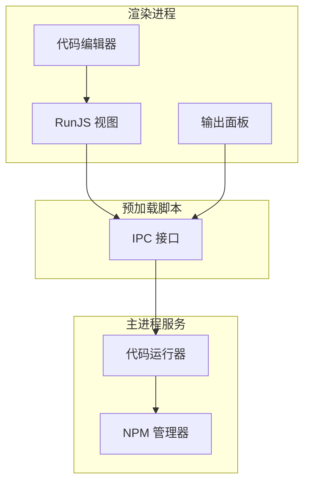

**图表来源**
- [codeRunner.ts](file://src/main/services/codeRunner.ts#L8)
- [index.ts:62-69](file://src/preload/index.ts#L62-L69)

**章节来源**
- [package.json:28-51](file://package.json#L28-L51)
- [codeRunner.ts](file://src/main/services/codeRunner.ts#L8)

## 性能考虑

### 执行超时控制

代码运行器设置了 30 秒的执行超时时间，防止长时间运行的代码阻塞系统：

- **超时时间**: 30000 毫秒
- **超时处理**: VM 执行超时抛出异常
- **异常处理**: 捕获超时异常并返回标准错误格式

### 内存管理

- **沙箱隔离**: 每次执行都在独立的 VM 上下文中进行
- **自动清理**: 执行完成后自动释放 VM 资源
- **服务器追踪**: 自动追踪和清理网络服务器实例

### 并发控制

- **串行执行**: 同一时间只允许一个代码执行任务
- **资源清理**: 执行前自动清理之前的活动服务器
- **端口管理**: 提供专门的端口终止功能

## 故障排除指南

### 常见问题及解决方案

#### 1. 代码执行超时

**症状**: 代码执行超过 30 秒后被终止

**原因**: 代码中存在长时间运行的操作

**解决方案**: 
- 优化算法复杂度
- 使用异步操作替代同步阻塞
- 实现合理的超时控制

#### 2. 端口占用问题

**症状**: 服务器启动失败，提示端口被占用

**原因**: 之前运行的服务器未正确清理

**解决方案**:
```bash
# 使用内置端口终止功能
window.api.codeRunner.killPort(3000)
```

#### 3. 模块加载失败

**症状**: require 指定模块时报错

**原因**: 模块未安装或路径错误

**解决方案**:
- 通过 NPM 面板安装所需模块
- 确认模块名称拼写正确
- 重启应用使新安装的模块生效

#### 4. TypeScript 类型错误

**症状**: TypeScript 代码编译时报错

**原因**: 类型定义缺失或版本不兼容

**解决方案**:
- 安装相应的 @types 包
- 更新到兼容的 TypeScript 版本
- 检查代码语法和类型注解

**章节来源**
- [codeRunner.ts:248-318](file://src/main/services/codeRunner.ts#L248-L318)
- [npmManager.ts:232-267](file://src/main/services/npmManager.ts#L232-L267)

## 结论

代码运行器服务提供了一个安全、可靠的代码执行环境，具有以下特点：

### 核心优势

1. **安全性**: 通过 VM 沙箱和模块劫持实现全面的安全防护
2. **易用性**: 提供直观的 IPC 接口和实时日志传输
3. **可靠性**: 完善的错误处理和资源清理机制
4. **性能**: 合理的超时控制和内存管理

### 技术特色

- **多层安全架构**: 从模块劫持到 VM 隔离的全方位保护
- **实时交互**: 支持实时日志传输和用户中断
- **类型安全**: 完整的 TypeScript 编译和类型支持
- **资源管理**: 自动化的服务器追踪和清理

### 应用场景

该代码运行器适用于：
- 在线代码编辑器
- 开发环境测试
- 教学演示平台
- 快速原型开发

通过合理使用这些接口和特性，开发者可以构建稳定可靠的代码执行环境，为用户提供流畅的编程体验。