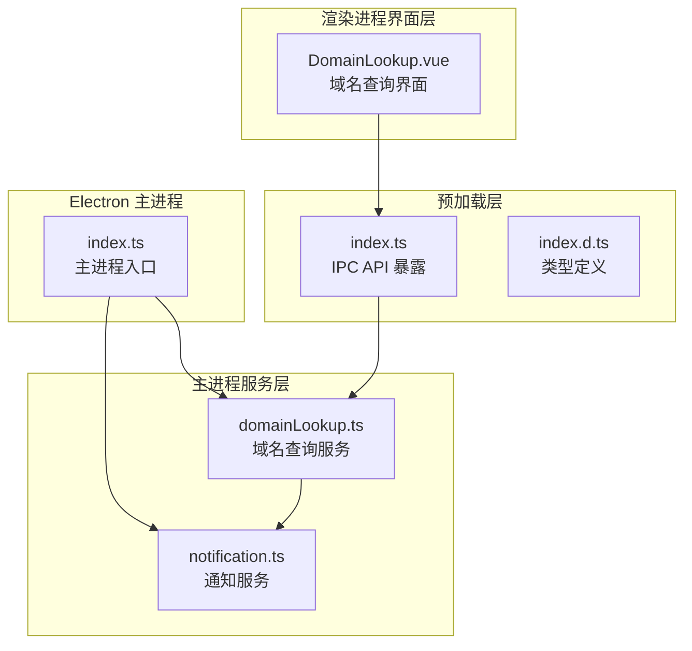
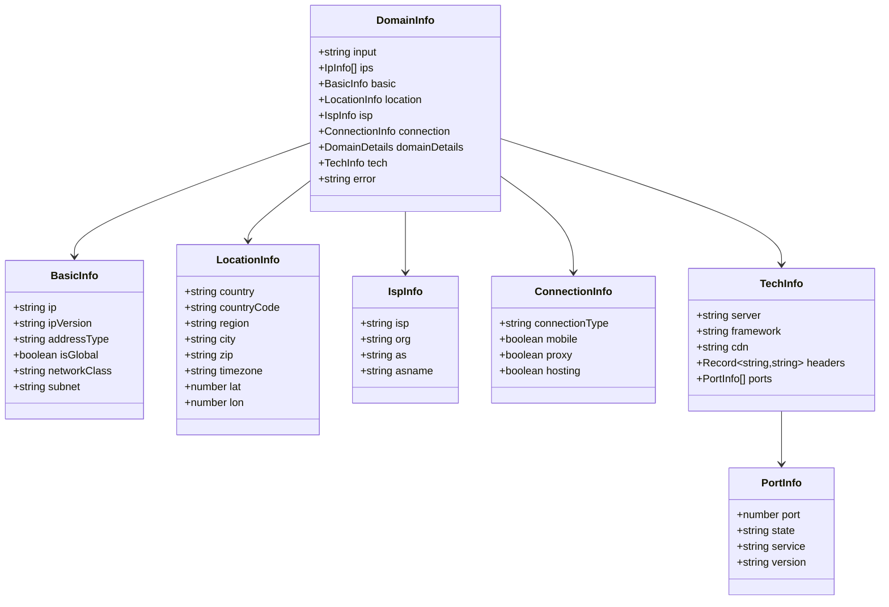
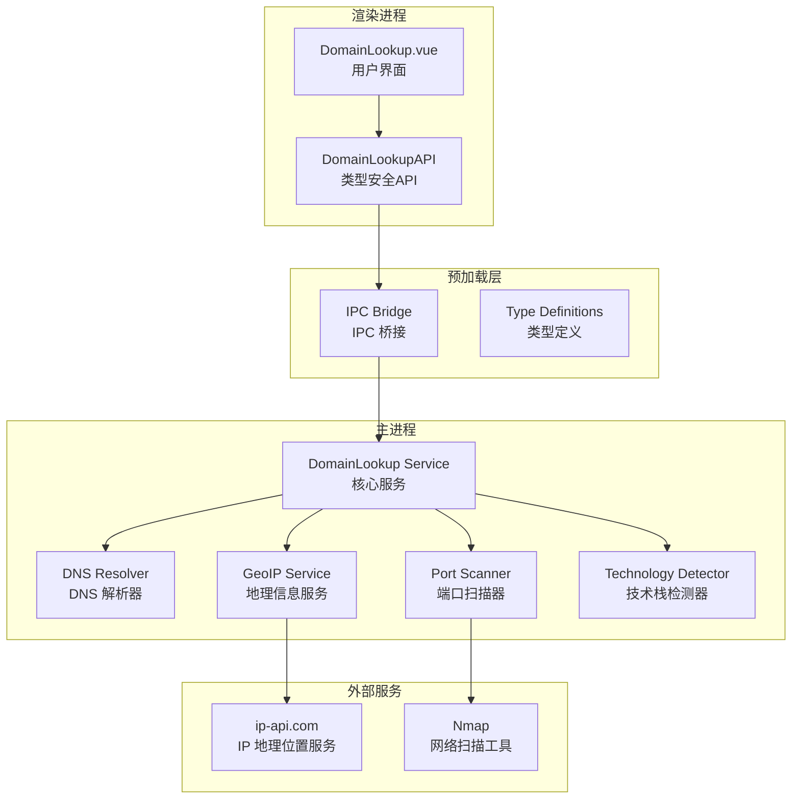
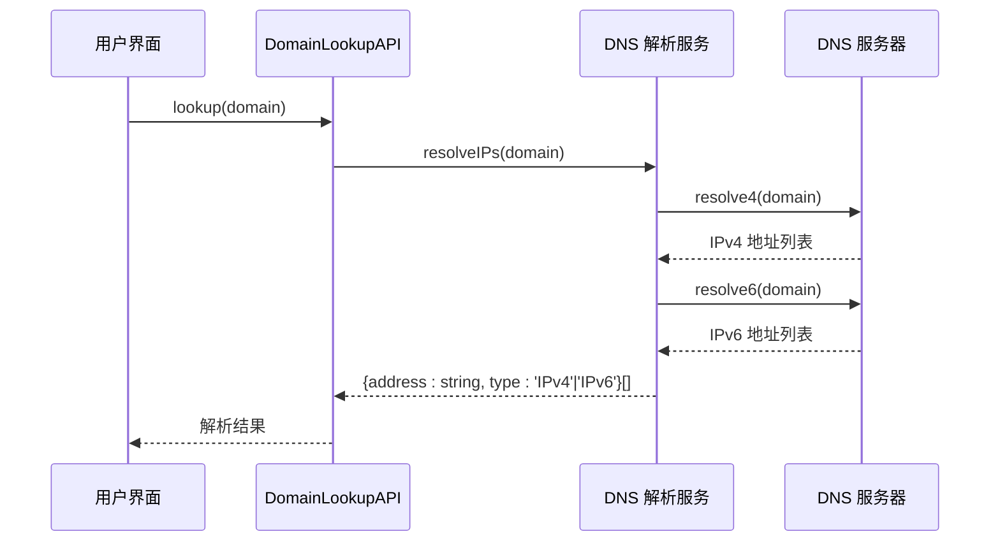
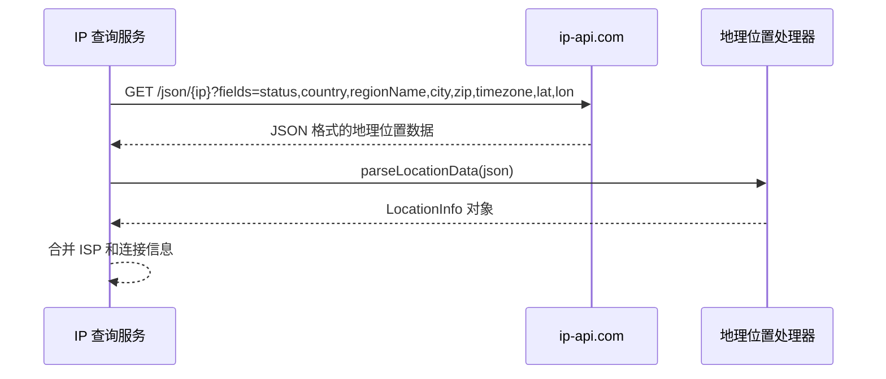
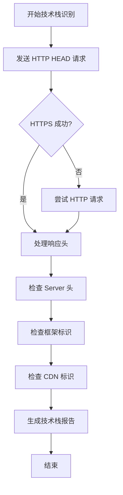
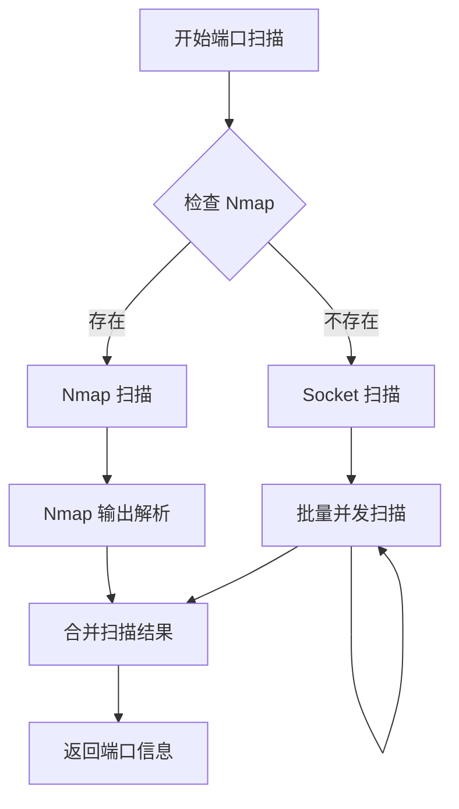
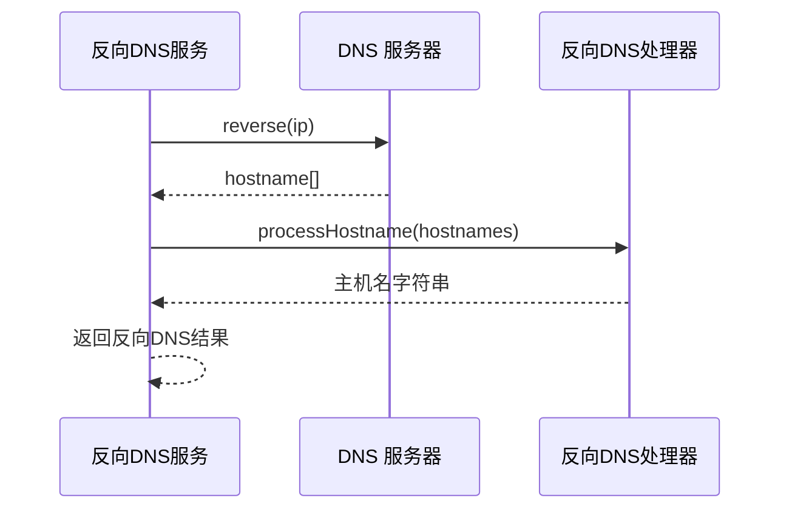
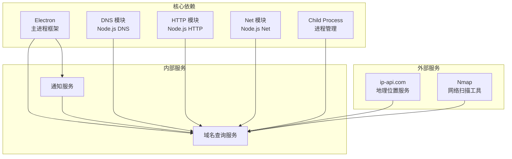
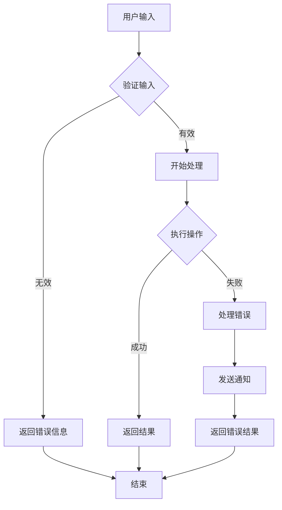

# 域名查询接口

<cite>
**本文档引用的文件**
- [domainLookup.ts](file://src/main/services/domainLookup.ts)
- [DomainLookup.vue](file://src/renderer/src/views/domainlookup/DomainLookup.vue)
- [index.ts](file://src/preload/index.ts)
- [index.ts](file://src/main/index.ts)
- [notification.ts](file://src/main/services/notification.ts)
- [index.d.ts](file://src/preload/index.d.ts)
</cite>

## 目录
1. [简介](#简介)
2. [项目结构](#项目结构)
3. [核心组件](#核心组件)
4. [架构概览](#架构概览)
5. [详细组件分析](#详细组件分析)
6. [依赖关系分析](#依赖关系分析)
7. [性能考虑](#性能考虑)
8. [故障排除指南](#故障排除指南)
9. [结论](#结论)

## 简介

域名查询服务是一个基于 Electron 的桌面应用程序，提供了完整的域名/IP地址查询功能。该服务集成了多种网络分析能力，包括 DNS 解析、IP 地理位置查询、ISP 信息获取、反向 DNS 查询、端口扫描以及技术栈识别等功能。

该服务采用主进程-渲染进程分离的架构设计，通过 IPC 通信实现功能调用，支持并发控制和超时处理，确保了良好的用户体验和系统稳定性。

## 项目结构

域名查询服务位于项目的 `src/main/services/` 目录下，主要由以下核心文件组成：

**图表来源**
- [domainLookup.ts:1-690](file://src/main/services/domainLookup.ts#L1-L690)
- [index.ts:1-444](file://src/main/index.ts#L1-L444)
- [index.ts:1-229](file://src/preload/index.ts#L1-L229)

**章节来源**
- [domainLookup.ts:1-690](file://src/main/services/domainLookup.ts#L1-L690)
- [index.ts:1-444](file://src/main/index.ts#L1-L444)

## 核心组件

域名查询服务的核心组件包括：

### 数据接口定义

服务定义了完整的数据接口体系，用于标准化查询结果的结构：

**图表来源**
- [domainLookup.ts:14-86](file://src/main/services/domainLookup.ts#L14-L86)

### IPC 接口定义

服务通过 Electron 的 IPC 机制暴露了两个核心接口：

1. **域名查询接口**: `domain:lookup`
2. **端口扫描接口**: `domain:scanPorts`

这些接口在预加载层进行了类型安全的封装，确保了前端调用的安全性和可靠性。

**章节来源**
- [domainLookup.ts:679-689](file://src/main/services/domainLookup.ts#L679-L689)
- [index.ts:87-91](file://src/preload/index.ts#L87-L91)
- [index.d.ts:145-149](file://src/preload/index.d.ts#L145-L149)

## 架构概览

域名查询服务采用了分层架构设计，实现了清晰的关注点分离：

**图表来源**
- [domainLookup.ts:175-666](file://src/main/services/domainLookup.ts#L175-L666)
- [index.ts:87-91](file://src/preload/index.ts#L87-L91)

## 详细组件分析

### DNS 解析组件

DNS 解析组件负责将域名转换为对应的 IP 地址，并支持 IPv4 和 IPv6 双协议栈：

**图表来源**
- [domainLookup.ts:175-194](file://src/main/services/domainLookup.ts#L175-L194)

DNS 解析功能具有以下特点：
- 支持同步解析 IPv4 和 IPv6 地址
- 异常处理：解析失败时返回空数组而非抛出异常
- 自动选择 IPv4 作为主要地址

**章节来源**
- [domainLookup.ts:175-194](file://src/main/services/domainLookup.ts#L175-L194)

### IP 地理位置查询组件

IP 地理位置查询组件通过第三方 API 服务获取详细的地理位置信息：

**图表来源**
- [domainLookup.ts:206-257](file://src/main/services/domainLookup.ts#L206-L257)

地理位置查询支持以下信息：
- 国家和地区信息
- 城市和邮政编码
- 时区和经纬度坐标
- ISP 信息（运营商、组织、AS 号码）
- 连接类型（移动网络、代理、数据中心）

**章节来源**
- [domainLookup.ts:206-257](file://src/main/services/domainLookup.ts#L206-L257)

### 技术栈识别组件

技术栈识别组件通过分析 HTTP 响应头来识别服务器技术：

**图表来源**
- [domainLookup.ts:259-360](file://src/main/services/domainLookup.ts#L259-L360)

技术栈识别支持：
- Web 服务器识别（Apache、Nginx、IIS 等）
- 框架检测（Express.js、Next.js、WordPress 等）
- CDN 识别（Cloudflare、Vercel、Akamai 等）
- 自动超时处理（10 秒超时）

**章节来源**
- [domainLookup.ts:259-360](file://src/main/services/domainLookup.ts#L259-L360)

### 端口扫描组件

端口扫描组件提供了两种扫描策略：

**图表来源**
- [domainLookup.ts:388-602](file://src/main/services/domainLookup.ts#L388-L602)

端口扫描特性：
- **Nmap 模式**：快速扫描常用端口，支持版本探测
- **Socket 模式**：作为备选方案，扫描 25 种常见端口
- **并发控制**：每批 10 个端口并发扫描
- **超时处理**：每个端口 2 秒超时
- **智能解析**：自动提取 Nmap 输出中的版本信息

**章节来源**
- [domainLookup.ts:388-602](file://src/main/services/domainLookup.ts#L388-L602)

### 反向 DNS 查询组件

反向 DNS 查询组件负责将 IP 地址转换为对应的域名：

**图表来源**
- [domainLookup.ts:196-204](file://src/main/services/domainLookup.ts#L196-L204)

**章节来源**
- [domainLookup.ts:196-204](file://src/main/services/domainLookup.ts#L196-L204)

## 依赖关系分析

域名查询服务的依赖关系如下：

**图表来源**
- [domainLookup.ts:5-10](file://src/main/services/domainLookup.ts#L5-L10)
- [index.ts:1-12](file://src/main/index.ts#L1-L12)

**章节来源**
- [domainLookup.ts:5-10](file://src/main/services/domainLookup.ts#L5-L10)
- [index.ts:1-12](file://src/main/index.ts#L1-L12)

## 性能考虑

域名查询服务在设计时充分考虑了性能优化：

### 并发控制策略

1. **端口扫描并发限制**：每批最多 10 个端口并发扫描
2. **DNS 解析异步处理**：IPv4 和 IPv6 解析并行执行
3. **HTTP 请求超时控制**：10 秒超时限制，避免阻塞

### 缓存机制

虽然当前实现未显式实现缓存，但可以通过以下方式优化：
- IP 地址查询结果的短期缓存
- DNS 记录的 TTL 利用
- 技术栈识别结果的临时存储

### 超时处理

服务实现了多层次的超时处理：
- HTTP 请求超时：10 秒
- Socket 端口扫描：2 秒/端口
- Nmap 扫描：60 秒总超时
- 整体查询取消机制

**章节来源**
- [domainLookup.ts:389-395](file://src/main/services/domainLookup.ts#L389-L395)
- [domainLookup.ts:534-585](file://src/main/services/domainLookup.ts#L534-L585)

## 故障排除指南

### 常见问题及解决方案

#### DNS 解析失败
**症状**：域名无法解析为 IP 地址
**原因**：DNS 服务器不可达或域名不存在
**解决方案**：
- 检查网络连接
- 验证域名格式
- 尝试其他 DNS 服务器

#### IP 地理位置查询失败
**症状**：无法获取地理位置信息
**原因**：ip-api.com 服务不可用或 IP 地址无效
**解决方案**：
- 检查外部服务状态
- 验证 IP 地址格式
- 查看网络代理设置

#### 端口扫描超时
**症状**：端口扫描长时间无响应
**原因**：目标主机防火墙阻止或网络延迟过高
**解决方案**：
- 检查防火墙设置
- 调整超时参数
- 使用不同的扫描策略

#### Nmap 未安装
**症状**：端口扫描使用 Socket 方案
**原因**：系统缺少 Nmap 工具
**解决方案**：
- 安装 Nmap 工具
- 确保 Nmap 在 PATH 中可访问

### 错误处理机制

服务实现了完善的错误处理机制：

**图表来源**
- [domainLookup.ts:661-666](file://src/main/services/domainLookup.ts#L661-L666)

**章节来源**
- [domainLookup.ts:661-666](file://src/main/services/domainLookup.ts#L661-L666)

## 结论

域名查询服务是一个功能完整、架构清晰的网络分析工具。其主要优势包括：

1. **模块化设计**：各功能模块职责明确，便于维护和扩展
2. **类型安全**：完整的 TypeScript 类型定义，提供编译时类型检查
3. **错误处理**：完善的异常处理机制，确保系统稳定性
4. **性能优化**：合理的并发控制和超时处理策略
5. **用户体验**：直观的界面设计和及时的状态反馈

该服务为开发者提供了强大的网络分析能力，支持从基础的 DNS 查询到高级的技术栈识别，满足了多样化的网络分析需求。通过持续的优化和扩展，该服务可以进一步提升性能和功能完整性。