# 服务接口规范

<cite>
**本文档引用的文件**
- [src/main/index.ts](file://src/main/index.ts)
- [src/preload/index.ts](file://src/preload/index.ts)
- [src/main/services/codeRunner.ts](file://src/main/services/codeRunner.ts)
- [src/main/services/httpClient.ts](file://src/main/services/httpClient.ts)
- [src/main/services/sqlExpert.ts](file://src/main/services/sqlExpert.ts)
- [src/main/services/dockService.ts](file://src/main/services/dockService.ts)
- [src/main/services/domainLookup.ts](file://src/main/services/domainLookup.ts)
- [src/main/services/ossManager.ts](file://src/main/services/ossManager.ts)
- [src/main/services/npmManager.ts](file://src/main/services/npmManager.ts)
- [src/main/services/notification.ts](file://src/main/services/notification.ts)
</cite>

## 目录
1. [简介](#简介)
2. [项目结构](#项目结构)
3. [核心组件](#核心组件)
4. [架构概览](#架构概览)
5. [详细组件分析](#详细组件分析)
6. [依赖关系分析](#依赖关系分析)
7. [性能考虑](#性能考虑)
8. [故障排除指南](#故障排除指南)
9. [结论](#结论)

## 简介

开发者工具箱是一个基于 Electron 的桌面应用程序，提供了丰富的开发工具服务。本文档详细说明了主进程服务模块的接口定义，包括代码运行器、HTTP 客户端、SQL 专家、Dock 服务、域名查询、OSS 管理、NPM 管理和通知服务等模块的 API 规范。

该工具箱旨在为开发者提供一体化的开发环境，通过主进程服务模块实现各种功能，包括代码执行、网络请求、数据库查询、文件管理等。所有服务都通过 IPC 机制与渲染进程进行通信，确保了安全性和稳定性。

## 项目结构

项目采用模块化的架构设计，主要分为以下几个层次：

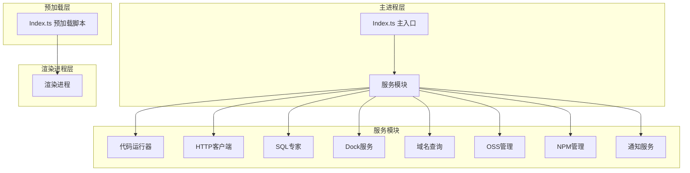
```mermaid
graph TB
subgraph "主进程层"
Main[Index.ts 主入口]
Services[服务模块]
end
subgraph "预加载层"
Preload[Index.ts 预加载脚本]
end
subgraph "渲染进程层"
Renderer[渲染进程]
end
subgraph "服务模块"
CodeRunner[代码运行器]
HttpClient[HTTP客户端]
SqlExpert[SQL专家]
DockService[Dock服务]
DomainLookup[域名查询]
OssManager[OSS管理]
NpmManager[NPM管理]
Notification[通知服务]
end
Main --> Services
Preload --> Renderer
Services --> CodeRunner
Services --> HttpClient
Services --> SqlExpert
Services --> DockService
Services --> DomainLookup
Services --> OssManager
Services --> NpmManager
Services --> Notification
```

**图表来源**
- [src/main/index.ts:1-444](file://src/main/index.ts#L1-L444)
- [src/preload/index.ts:1-229](file://src/preload/index.ts#L1-L229)

**章节来源**
- [src/main/index.ts:1-444](file://src/main/index.ts#L1-L444)
- [src/preload/index.ts:1-229](file://src/preload/index.ts#L1-L229)

## 核心组件

### 服务初始化流程

主进程通过统一的初始化流程启动各个服务模块：

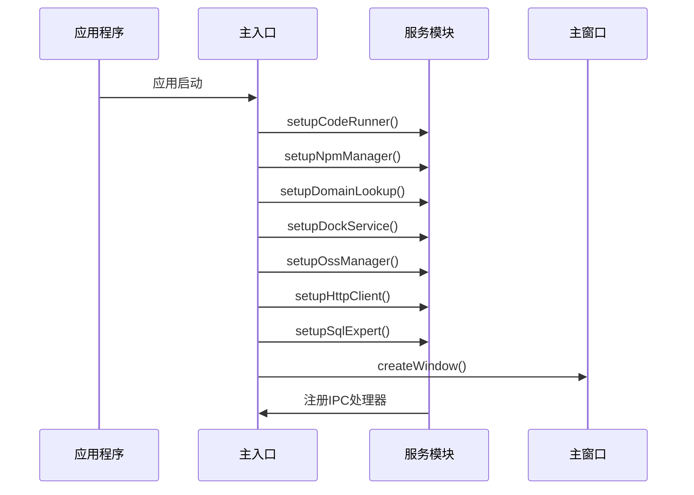
```mermaid
sequenceDiagram
participant App as 应用程序
participant Main as 主入口
participant Services as 服务模块
participant Window as 主窗口
App->>Main : 应用启动
Main->>Services : setupCodeRunner()
Main->>Services : setupNpmManager()
Main->>Services : setupDomainLookup()
Main->>Services : setupDockService()
Main->>Services : setupOssManager()
Main->>Services : setupHttpClient()
Main->>Services : setupSqlExpert()
Main->>Window : createWindow()
Services->>Main : 注册IPC处理器
```

**图表来源**
- [src/main/index.ts:421-429](file://src/main/index.ts#L421-L429)

### IPC 通信机制

预加载脚本通过 `contextBridge` 暴露安全的 API 给渲染进程：

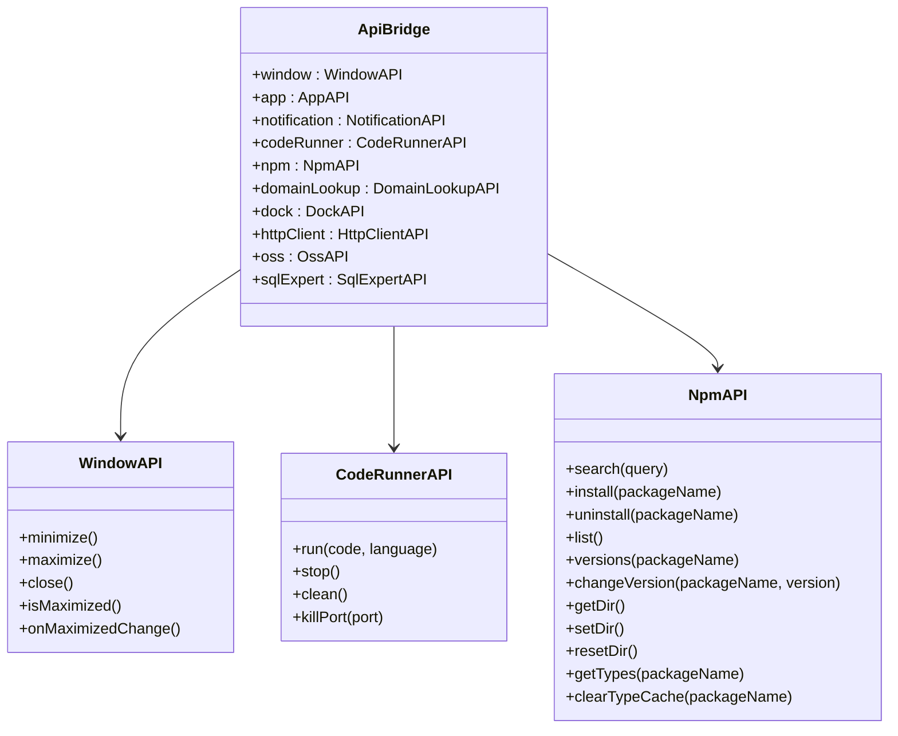
```mermaid
classDiagram
class ApiBridge {
+window : WindowAPI
+app : AppAPI
+notification : NotificationAPI
+codeRunner : CodeRunnerAPI
+npm : NpmAPI
+domainLookup : DomainLookupAPI
+dock : DockAPI
+httpClient : HttpClientAPI
+oss : OssAPI
+sqlExpert : SqlExpertAPI
}
class WindowAPI {
+minimize()
+maximize()
+close()
+isMaximized()
+onMaximizedChange()
}
class CodeRunnerAPI {
+run(code, language)
+stop()
+clean()
+killPort(port)
}
class NpmAPI {
+search(query)
+install(packageName)
+uninstall(packageName)
+list()
+versions(packageName)
+changeVersion(packageName, version)
+getDir()
+setDir()
+resetDir()
+getTypes(packageName)
+clearTypeCache(packageName)
}
ApiBridge --> WindowAPI
ApiBridge --> CodeRunnerAPI
ApiBridge --> NpmAPI
```

**图表来源**
- [src/preload/index.ts:11-213](file://src/preload/index.ts#L11-L213)

**章节来源**
- [src/main/index.ts:421-429](file://src/main/index.ts#L421-L429)
- [src/preload/index.ts:1-229](file://src/preload/index.ts#L1-L229)

## 架构概览

### 整体架构设计

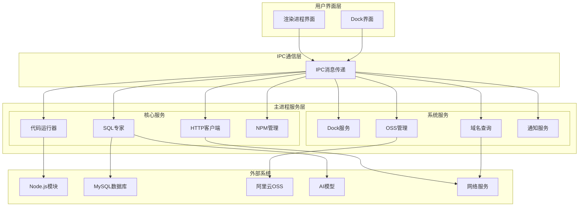
```mermaid
graph TB
subgraph "用户界面层"
UI[渲染进程界面]
DockUI[Dock界面]
end
subgraph "IPC通信层"
IPC[IPC消息传递]
end
subgraph "主进程服务层"
subgraph "核心服务"
CodeRunner[代码运行器]
HttpClient[HTTP客户端]
SqlExpert[SQL专家]
NpmManager[NPM管理]
end
subgraph "系统服务"
DockService[Dock服务]
DomainLookup[域名查询]
OssManager[OSS管理]
Notification[通知服务]
end
end
subgraph "外部系统"
NodeModules[Node.js模块]
MySQL[MySQL数据库]
OSS[阿里云OSS]
AI[AI模型]
Network[网络服务]
end
UI --> IPC
DockUI --> IPC
IPC --> CodeRunner
IPC --> HttpClient
IPC --> SqlExpert
IPC --> NpmManager
IPC --> DockService
IPC --> DomainLookup
IPC --> OssManager
IPC --> Notification
CodeRunner --> NodeModules
SqlExpert --> MySQL
OssManager --> OSS
SqlExpert --> AI
HttpClient --> Network
DomainLookup --> Network
```

**图表来源**
- [src/main/index.ts:5-12](file://src/main/index.ts#L5-L12)
- [src/preload/index.ts:1-229](file://src/preload/index.ts#L1-L229)

### 服务间通信协议

服务间的通信遵循统一的 IPC 协议：

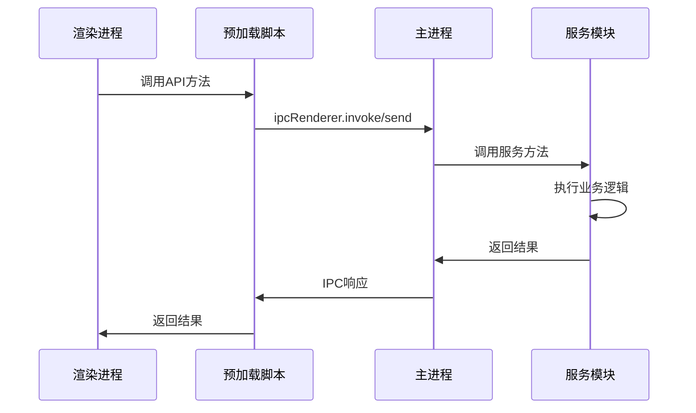
```mermaid
sequenceDiagram
participant Renderer as 渲染进程
participant Preload as 预加载脚本
participant Main as 主进程
participant Service as 服务模块
Renderer->>Preload : 调用API方法
Preload->>Main : ipcRenderer.invoke/send
Main->>Service : 调用服务方法
Service->>Service : 执行业务逻辑
Service->>Main : 返回结果
Main->>Preload : IPC响应
Preload->>Renderer : 返回结果
```

**图表来源**
- [src/preload/index.ts:62-213](file://src/preload/index.ts#L62-L213)

**章节来源**
- [src/main/index.ts:1-444](file://src/main/index.ts#L1-L444)
- [src/preload/index.ts:1-229](file://src/preload/index.ts#L1-L229)

## 详细组件分析

### 代码运行器服务

代码运行器服务提供了安全的代码执行环境，支持 JavaScript 和 TypeScript 代码的运行。

#### 接口定义

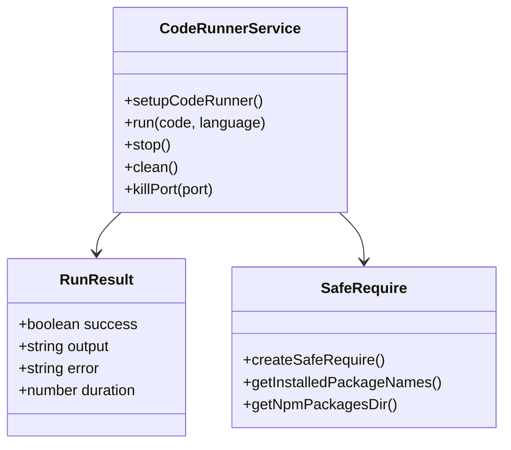
```mermaid
classDiagram
class CodeRunnerService {
+setupCodeRunner()
+run(code, language)
+stop()
+clean()
+killPort(port)
}
class RunResult {
+boolean success
+string output
+string error
+number duration
}
class SafeRequire {
+createSafeRequire()
+getInstalledPackageNames()
+getNpmPackagesDir()
}
CodeRunnerService --> RunResult
CodeRunnerService --> SafeRequire
```

**图表来源**
- [src/main/services/codeRunner.ts:14-461](file://src/main/services/codeRunner.ts#L14-L461)

#### 初始化参数

代码运行器服务的初始化过程包括：

1. **模块劫持**：全局劫持 `http`、`https`、`net` 模块，跟踪服务器实例
2. **沙箱环境**：创建隔离的执行环境，限制访问权限
3. **安全模块**：实现受控的模块加载机制

#### 方法调用规范

| 方法 | 参数 | 返回值 | 描述 |
|------|------|--------|------|
| `run` | `code: string`, `language: 'javascript' \| 'typescript'` | `Promise<RunResult>` | 执行代码并返回结果 |
| `stop` | 无 | `void` | 停止当前执行的代码 |
| `clean` | 无 | `Promise<boolean>` | 清理所有活动的服务器实例 |
| `killPort` | `port: number` | `Promise<{ success: boolean; message: string }>` | 终止占用指定端口的进程 |

#### 错误处理

代码运行器实现了多层次的错误处理机制：

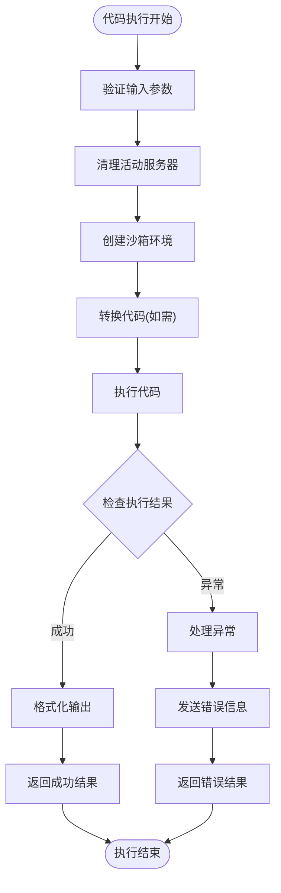
```mermaid
flowchart TD
Start([代码执行开始]) --> ValidateInput["验证输入参数"]
ValidateInput --> CleanServers["清理活动服务器"]
CleanServers --> CreateSandbox["创建沙箱环境"]
CreateSandbox --> TransformCode["转换代码(如需)"]
TransformCode --> ExecuteCode["执行代码"]
ExecuteCode --> CheckResult{"检查执行结果"}
CheckResult --> |成功| FormatOutput["格式化输出"]
CheckResult --> |异常| HandleError["处理异常"]
FormatOutput --> ReturnSuccess["返回成功结果"]
HandleError --> SendError["发送错误信息"]
SendError --> ReturnError["返回错误结果"]
ReturnSuccess --> End([执行结束])
ReturnError --> End
```

**图表来源**
- [src/main/services/codeRunner.ts:118-234](file://src/main/services/codeRunner.ts#L118-L234)

**章节来源**
- [src/main/services/codeRunner.ts:1-461](file://src/main/services/codeRunner.ts#L1-L461)

### HTTP 客户端服务

HTTP 客户端服务提供了绕过 CORS 限制的网络请求能力。

#### 接口定义

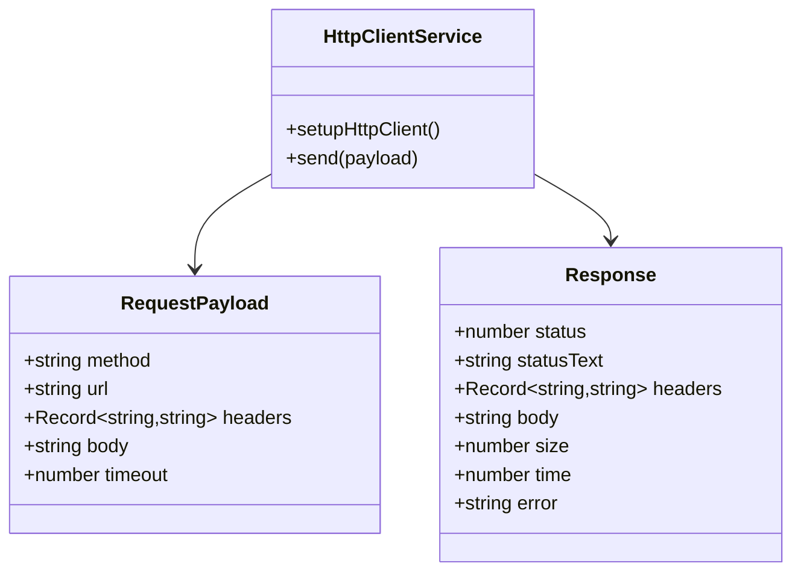
```mermaid
classDiagram
class HttpClientService {
+setupHttpClient()
+send(payload)
}
class RequestPayload {
+string method
+string url
+Record~string,string~ headers
+string body
+number timeout
}
class Response {
+number status
+string statusText
+Record~string,string~ headers
+string body
+number size
+number time
+string error
}
HttpClientService --> RequestPayload
HttpClientService --> Response
```

**图表来源**
- [src/main/services/httpClient.ts:7-113](file://src/main/services/httpClient.ts#L7-L113)

#### 配置选项

HTTP 客户端支持以下配置选项：

| 选项 | 类型 | 默认值 | 描述 |
|------|------|--------|------|
| `method` | `string` | 必填 | HTTP 方法 (GET, POST, PUT, DELETE 等) |
| `url` | `string` | 必填 | 目标 URL |
| `headers` | `Record<string,string>` | `{}` | 请求头 |
| `body` | `string` | `undefined` | 请求体 |
| `timeout` | `number` | `30000` | 超时时间(毫秒) |

#### 返回值格式

HTTP 客户端返回标准化的响应格式：

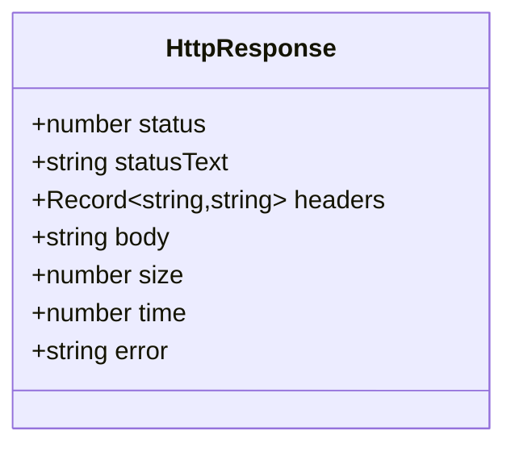
```mermaid
classDiagram
class HttpResponse {
+number status
+string statusText
+Record~string,string~ headers
+string body
+number size
+number time
+string error
}
```

**图表来源**
- [src/main/services/httpClient.ts:16-112](file://src/main/services/httpClient.ts#L16-L112)

**章节来源**
- [src/main/services/httpClient.ts:1-113](file://src/main/services/httpClient.ts#L1-L113)

### SQL 专家服务

SQL 专家服务是一个企业级的数据库查询和分析助手，集成了 AI 能力。

#### 接口定义

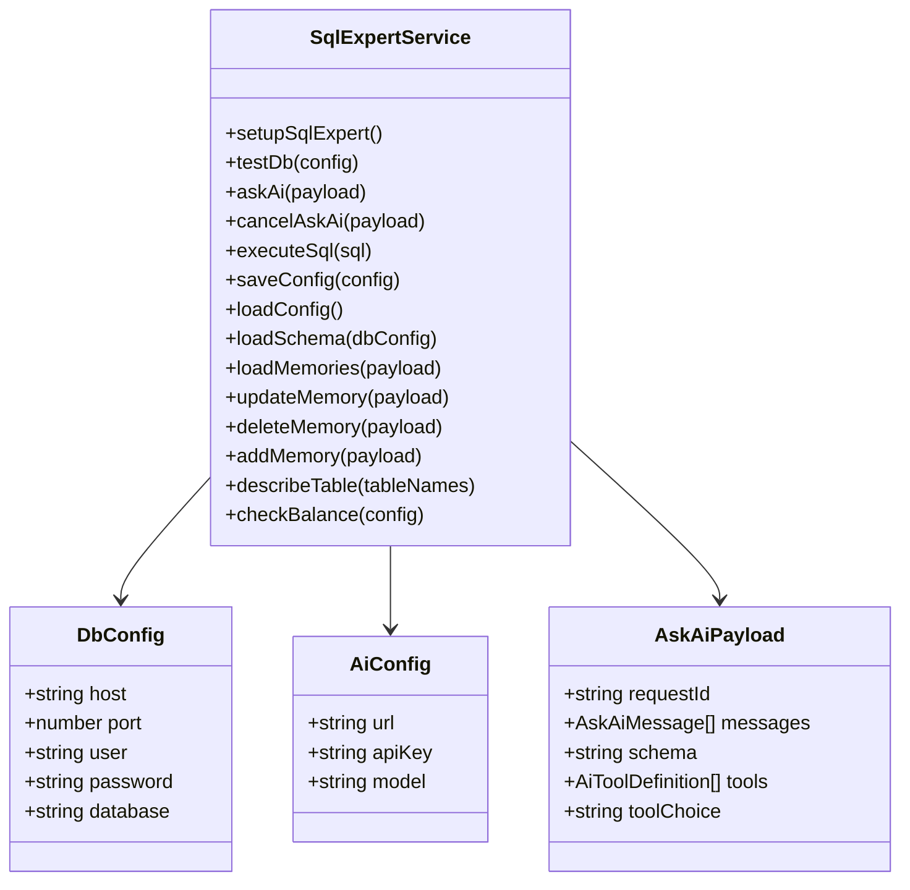
```mermaid
classDiagram
class SqlExpertService {
+setupSqlExpert()
+testDb(config)
+askAi(payload)
+cancelAskAi(payload)
+executeSql(sql)
+saveConfig(config)
+loadConfig()
+loadSchema(dbConfig)
+loadMemories(payload)
+updateMemory(payload)
+deleteMemory(payload)
+addMemory(payload)
+describeTable(tableNames)
+checkBalance(config)
}
class DbConfig {
+string host
+number port
+string user
+string password
+string database
}
class AiConfig {
+string url
+string apiKey
+string model
}
class AskAiPayload {
+string requestId
+AskAiMessage[] messages
+string schema
+AiToolDefinition[] tools
+string toolChoice
}
SqlExpertService --> DbConfig
SqlExpertService --> AiConfig
SqlExpertService --> AskAiPayload
```

**图表来源**
- [src/main/services/sqlExpert.ts:14-1503](file://src/main/services/sqlExpert.ts#L14-L1503)

#### 数据库配置

SQL 专家服务支持以下数据库配置：

| 配置项 | 类型 | 必填 | 描述 |
|--------|------|------|------|
| `host` | `string` | 是 | 数据库主机地址 |
| `port` | `number` | 是 | 数据库端口 |
| `user` | `string` | 是 | 用户名 |
| `password` | `string` | 是 | 密码 |
| `database` | `string` | 是 | 数据库名称 |

#### AI 配置

AI 服务配置包括：

| 配置项 | 类型 | 必填 | 描述 |
|--------|------|------|------|
| `url` | `string` | 是 | AI 服务 URL |
| `apiKey` | `string` | 是 | API 密钥 |
| `model` | `string` | 是 | 模型名称 |

#### 工具定义

SQL 专家服务内置了多种工具：

| 工具名称 | 功能描述 | 参数 |
|----------|----------|------|
| `query_database` | 执行只读 SQL 查询 | `sql: string`, `reason: string` |
| `describe_table_schema` | 查询表结构 | `tableName: string` 或 `tableNames: string[]` |
| `render_chart` | 绘制图表 | `type: string`, `title: string`, `series: any[]` |
| `save_memory` | 保存记忆 | `content: string`, `reason: string` |
| `export_data` | 导出数据 | `sql: string`, `reason: string`, `fileName: string` |

#### 流式响应处理

SQL 专家服务支持流式响应处理：

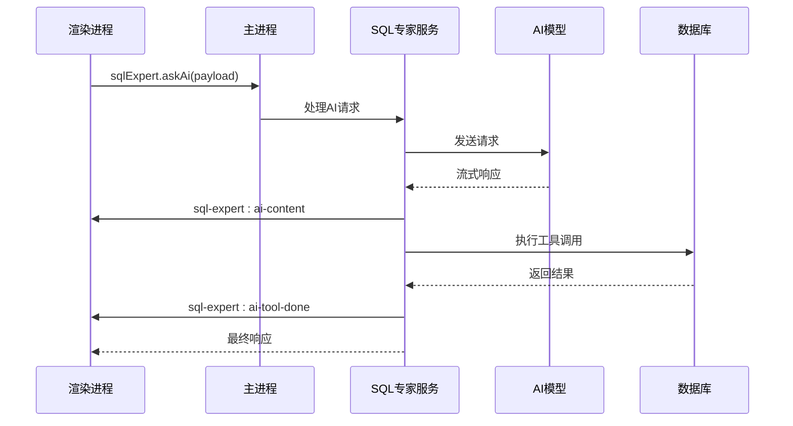
```mermaid
sequenceDiagram
participant Renderer as 渲染进程
participant Main as 主进程
participant Service as SQL专家服务
participant AI as AI模型
participant DB as 数据库
Renderer->>Main : sqlExpert.askAi(payload)
Main->>Service : 处理AI请求
Service->>AI : 发送请求
AI-->>Service : 流式响应
Service->>Renderer : sql-expert : ai-content
Service->>DB : 执行工具调用
DB-->>Service : 返回结果
Service->>Renderer : sql-expert : ai-tool-done
Service-->>Renderer : 最终响应
```

**图表来源**
- [src/main/services/sqlExpert.ts:1281-1501](file://src/main/services/sqlExpert.ts#L1281-L1501)

**章节来源**
- [src/main/services/sqlExpert.ts:1-1503](file://src/main/services/sqlExpert.ts#L1-L1503)

### Dock 服务

Dock 服务提供了类似 macOS 的应用程序启动器功能。

#### 接口定义

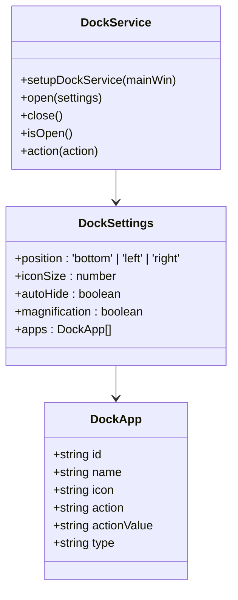
```mermaid
classDiagram
class DockService {
+setupDockService(mainWin)
+open(settings)
+close()
+isOpen()
+action(action)
}
class DockSettings {
+position : 'bottom' \| 'left' \| 'right'
+iconSize : number
+autoHide : boolean
+magnification : boolean
+apps : DockApp[]
}
class DockApp {
+string id
+string name
+string icon
+string action
+string actionValue
+string type
}
DockService --> DockSettings
DockSettings --> DockApp
```

**图表来源**
- [src/main/services/dockService.ts:9-243](file://src/main/services/dockService.ts#L9-L243)

#### 配置选项

Dock 服务支持以下配置选项：

| 选项 | 类型 | 默认值 | 描述 |
|------|------|--------|------|
| `position` | `'bottom' \| 'left' \| 'right'` | `'bottom'` | Dock 位置 |
| `iconSize` | `number` | `48` | 图标尺寸 |
| `autoHide` | `boolean` | `true` | 自动隐藏 |
| `magnification` | `boolean` | `true` | 放大效果 |
| `apps` | `DockApp[]` | `[]` | 应用程序列表 |

#### 支持的动作类型

| 动作类型 | 描述 | 示例 |
|----------|-------|------|
| `openSettings` | 打开设置界面 | 打开主窗口 |
| `openFolder` | 打开文件夹 | 打开用户主目录 |
| `openTerminal` | 打开终端 | 根据平台选择终端 |
| `openBrowser` | 打开浏览器 | 打开默认浏览器 |
| `openUrl:<url>` | 打开指定 URL | `openUrl:https://example.com` |
| `openApp:<path>` | 打开指定应用 | `openApp:C:\\Program Files\\App.exe` |

**章节来源**
- [src/main/services/dockService.ts:1-243](file://src/main/services/dockService.ts#L1-L243)

### 域名查询服务

域名查询服务提供了全面的网络信息查询功能。

#### 接口定义

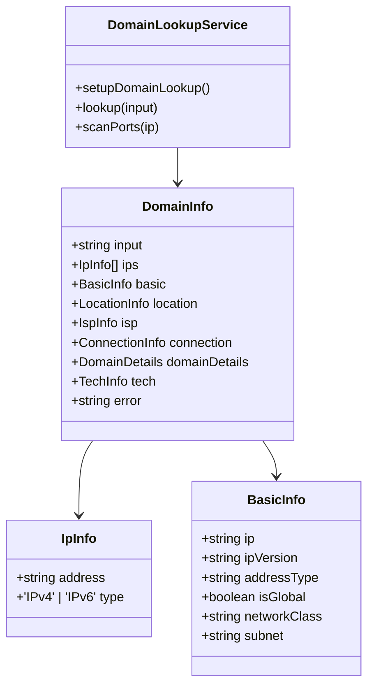
```mermaid
classDiagram
class DomainLookupService {
+setupDomainLookup()
+lookup(input)
+scanPorts(ip)
}
class DomainInfo {
+string input
+IpInfo[] ips
+BasicInfo basic
+LocationInfo location
+IspInfo isp
+ConnectionInfo connection
+DomainDetails domainDetails
+TechInfo tech
+string error
}
class IpInfo {
+string address
+'IPv4' \| 'IPv6' type
}
class BasicInfo {
+string ip
+string ipVersion
+string addressType
+boolean isGlobal
+string networkClass
+string subnet
}
DomainLookupService --> DomainInfo
DomainInfo --> IpInfo
DomainInfo --> BasicInfo
```

**图表来源**
- [src/main/services/domainLookup.ts:14-690](file://src/main/services/domainLookup.ts#L14-L690)

#### 查询结果结构

域名查询服务返回标准化的结果结构：

| 字段 | 类型 | 描述 |
|------|------|------|
| `input` | `string` | 输入的域名或 IP |
| `ips` | `IpInfo[]` | 解析到的 IP 地址列表 |
| `basic` | `BasicInfo` | 基础 IP 信息 |
| `location` | `LocationInfo` | 地理位置信息 |
| `isp` | `IspInfo` | ISP 信息 |
| `connection` | `ConnectionInfo` | 连接类型信息 |
| `domainDetails` | `DomainDetails` | 域名详细信息 |
| `tech` | `TechInfo` | 技术栈信息 |
| `error` | `string` | 错误信息 |

#### 端口扫描功能

域名查询服务支持两种端口扫描方式：

1. **Nmap 扫描**：使用 `nmap` 命令进行深度扫描
2. **Socket 扫描**：使用纯 JavaScript 进行快速扫描

**章节来源**
- [src/main/services/domainLookup.ts:1-690](file://src/main/services/domainLookup.ts#L1-L690)

### OSS 管理服务

OSS 管理服务提供了阿里云 OSS 的文件上传功能。

#### 接口定义

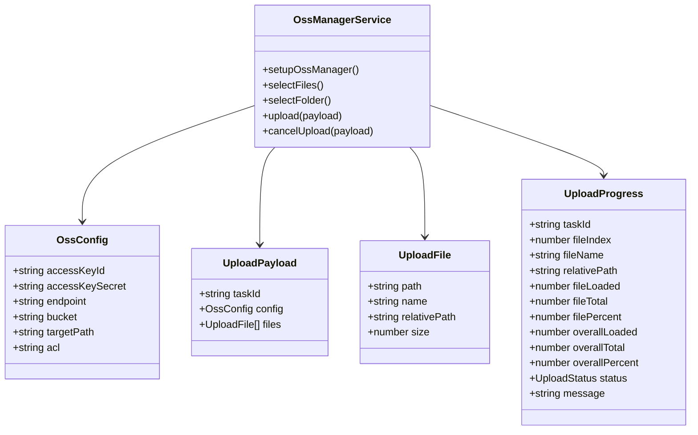
```mermaid
classDiagram
class OssManagerService {
+setupOssManager()
+selectFiles()
+selectFolder()
+upload(payload)
+cancelUpload(payload)
}
class OssConfig {
+string accessKeyId
+string accessKeySecret
+string endpoint
+string bucket
+string targetPath
+string acl
}
class UploadPayload {
+string taskId
+OssConfig config
+UploadFile[] files
}
class UploadFile {
+string path
+string name
+string relativePath
+number size
}
class UploadProgress {
+string taskId
+number fileIndex
+string fileName
+string relativePath
+number fileLoaded
+number fileTotal
+number filePercent
+number overallLoaded
+number overallTotal
+number overallPercent
+UploadStatus status
+string message
}
OssManagerService --> OssConfig
OssManagerService --> UploadPayload
OssManagerService --> UploadFile
OssManagerService --> UploadProgress
```

**图表来源**
- [src/main/services/ossManager.ts:14-440](file://src/main/services/ossManager.ts#L14-L440)

#### 配置选项

OSS 服务支持以下配置选项：

| 选项 | 类型 | 必填 | 描述 |
|------|------|------|------|
| `accessKeyId` | `string` | 是 | 访问密钥 ID |
| `accessKeySecret` | `string` | 是 | 访问密钥密钥 |
| `endpoint` | `string` | 是 | 服务端点 |
| `bucket` | `string` | 是 | 存储桶名称 |
| `targetPath` | `string` | 否 | 目标路径前缀 |
| `acl` | `string` | 否 | 访问控制列表 |

#### 上传进度监控

OSS 上传支持实时进度监控：

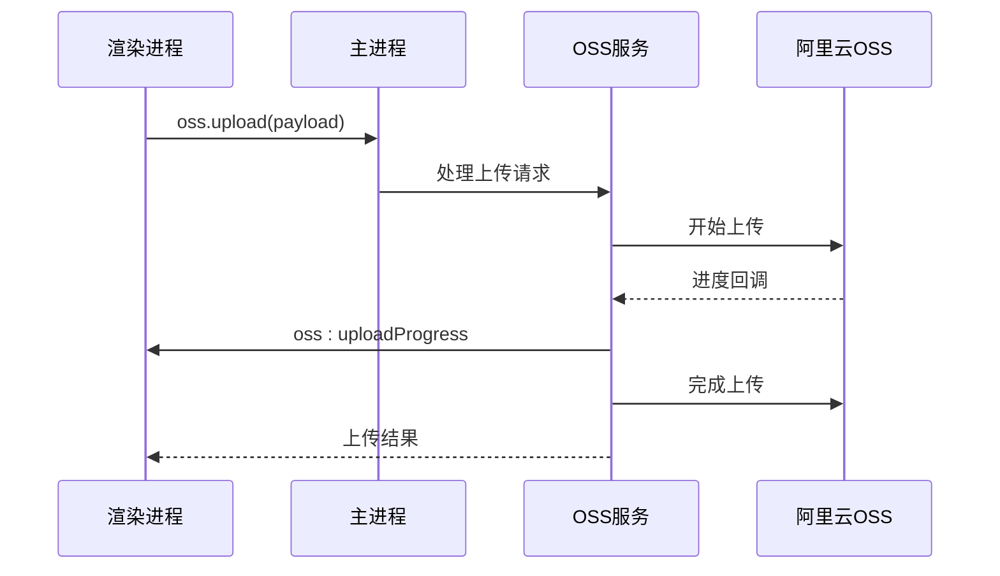
```mermaid
sequenceDiagram
participant Renderer as 渲染进程
participant Main as 主进程
participant Service as OSS服务
participant OSS as 阿里云OSS
Renderer->>Main : oss.upload(payload)
Main->>Service : 处理上传请求
Service->>OSS : 开始上传
OSS-->>Service : 进度回调
Service->>Renderer : oss : uploadProgress
Service->>OSS : 完成上传
Service-->>Renderer : 上传结果
```

**图表来源**
- [src/main/services/ossManager.ts:334-438](file://src/main/services/ossManager.ts#L334-L438)

**章节来源**
- [src/main/services/ossManager.ts:1-440](file://src/main/services/ossManager.ts#L1-L440)

### NPM 管理服务

NPM 管理服务提供了包的搜索、安装、卸载和版本管理功能。

#### 接口定义

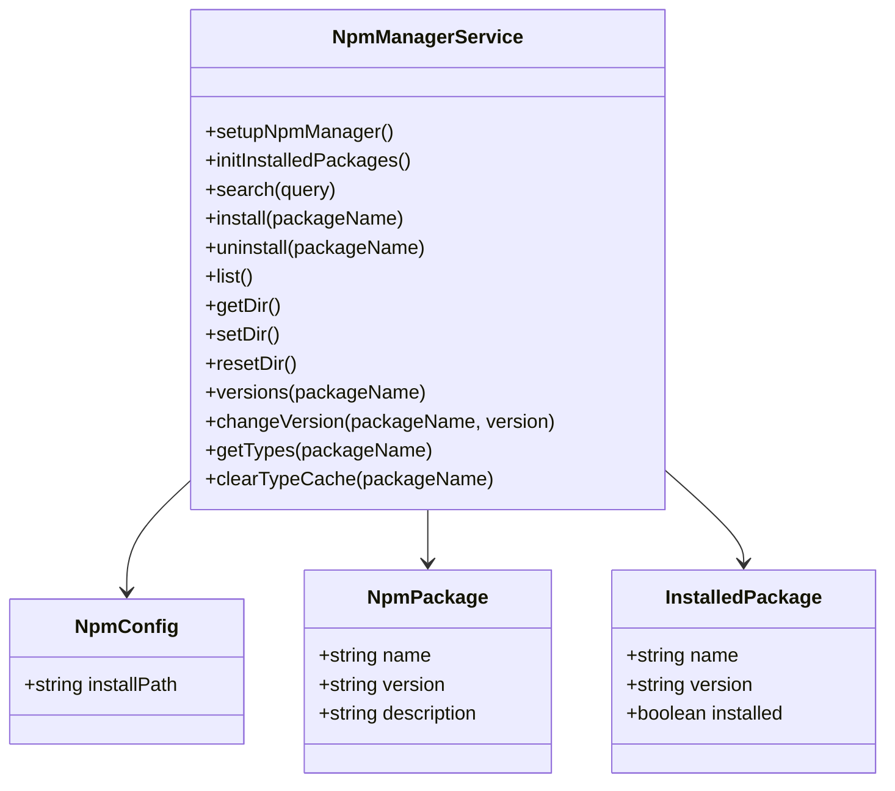
```mermaid
classDiagram
class NpmManagerService {
+setupNpmManager()
+initInstalledPackages()
+search(query)
+install(packageName)
+uninstall(packageName)
+list()
+getDir()
+setDir()
+resetDir()
+versions(packageName)
+changeVersion(packageName, version)
+getTypes(packageName)
+clearTypeCache(packageName)
}
class NpmConfig {
+string installPath
}
class NpmPackage {
+string name
+string version
+string description
}
class InstalledPackage {
+string name
+string version
+boolean installed
}
NpmManagerService --> NpmConfig
NpmManagerService --> NpmPackage
NpmManagerService --> InstalledPackage
```

**图表来源**
- [src/main/services/npmManager.ts:19-635](file://src/main/services/npmManager.ts#L19-L635)

#### 包管理功能

NPM 服务支持以下功能：

| 功能 | 方法 | 描述 |
|------|------|------|
| 搜索包 | `search(query)` | 搜索 NPM 包 |
| 安装包 | `install(packageName)` | 安装指定包 |
| 卸载包 | `uninstall(packageName)` | 卸载指定包 |
| 列出包 | `list()` | 获取已安装包列表 |
| 获取版本 | `versions(packageName)` | 获取包的版本列表 |
| 切换版本 | `changeVersion(packageName, version)` | 切换包版本 |
| 获取类型 | `getTypes(packageName)` | 获取包的类型定义 |
| 清除缓存 | `clearTypeCache(packageName)` | 清除类型缓存 |

#### 包安装目录

NPM 服务支持自定义安装目录：

1. **默认目录**：`app.getPath('userData')/npm_packages`
2. **自定义目录**：用户可选择任意目录
3. **权限验证**：安装目录需要具有写入权限

**章节来源**
- [src/main/services/npmManager.ts:1-635](file://src/main/services/npmManager.ts#L1-L635)

### 通知服务

通知服务提供了统一的通知发送机制。

#### 接口定义

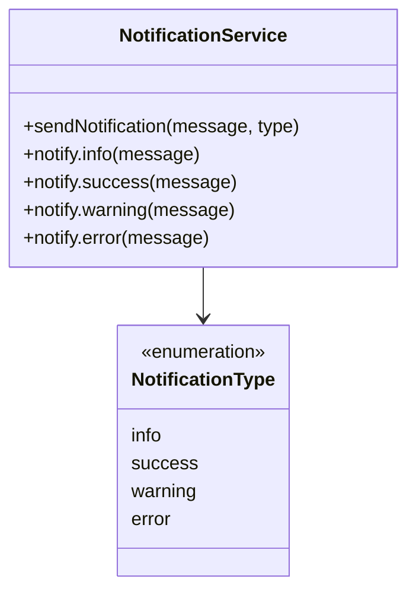
```mermaid
classDiagram
class NotificationService {
+sendNotification(message, type)
+notify.info(message)
+notify.success(message)
+notify.warning(message)
+notify.error(message)
}
class NotificationType {
<<enumeration>>
info
success
warning
error
}
NotificationService --> NotificationType
```

**图表来源**
- [src/main/services/notification.ts:7-29](file://src/main/services/notification.ts#L7-L29)

#### 通知类型

通知服务支持四种通知类型：

| 类型 | 颜色 | 用途 |
|------|------|------|
| `info` | 蓝色 | 信息提示 |
| `success` | 绿色 | 成功消息 |
| `warning` | 黄色 | 警告消息 |
| `error` | 红色 | 错误消息 |

**章节来源**
- [src/main/services/notification.ts:1-29](file://src/main/services/notification.ts#L1-L29)

## 依赖关系分析

### 服务依赖图

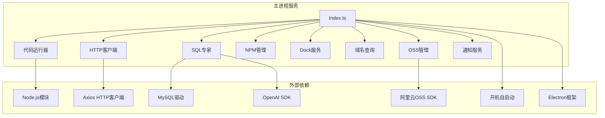
```mermaid
graph TB
subgraph "主进程服务"
Main[Index.ts]
CodeRunner[代码运行器]
HttpClient[HTTP客户端]
SqlExpert[SQL专家]
NpmManager[NPM管理]
DockService[Dock服务]
DomainLookup[域名查询]
OssManager[OSS管理]
Notification[通知服务]
end
subgraph "外部依赖"
Electron[Electron框架]
NodeModules[Node.js模块]
MySQL[MySQL驱动]
AliOSS[阿里云OSS SDK]
Axios[Axios HTTP客户端]
OpenAI[OpenAI SDK]
AutoLaunch[开机自启动]
end
Main --> CodeRunner
Main --> HttpClient
Main --> SqlExpert
Main --> NpmManager
Main --> DockService
Main --> DomainLookup
Main --> OssManager
Main --> Notification
CodeRunner --> NodeModules
SqlExpert --> MySQL
SqlExpert --> OpenAI
OssManager --> AliOSS
HttpClient --> Axios
Main --> AutoLaunch
Main --> Electron
```

**图表来源**
- [src/main/index.ts:5-12](file://src/main/index.ts#L5-L12)

### 模块导入关系

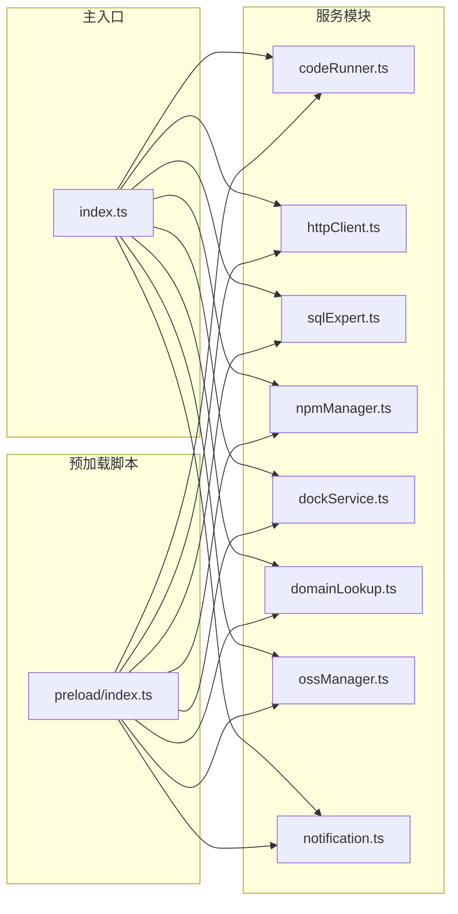
```mermaid
graph LR
subgraph "主入口"
Index[index.ts]
end
subgraph "服务模块"
CodeRunner[codeRunner.ts]
HttpClient[httpClient.ts]
SqlExpert[sqlExpert.ts]
NpmManager[npmManager.ts]
DockService[dockService.ts]
DomainLookup[domainLookup.ts]
OssManager[ossManager.ts]
Notification[notification.ts]
end
subgraph "预加载脚本"
Preload[preload/index.ts]
end
Index --> CodeRunner
Index --> HttpClient
Index --> SqlExpert
Index --> NpmManager
Index --> DockService
Index --> DomainLookup
Index --> OssManager
Index --> Notification
Preload --> CodeRunner
Preload --> HttpClient
Preload --> SqlExpert
Preload --> NpmManager
Preload --> DockService
Preload --> DomainLookup
Preload --> OssManager
Preload --> Notification
```

**图表来源**
- [src/main/index.ts:5-12](file://src/main/index.ts#L5-L12)
- [src/preload/index.ts:1-229](file://src/preload/index.ts#L1-L229)

**章节来源**
- [src/main/index.ts:1-444](file://src/main/index.ts#L1-L444)
- [src/preload/index.ts:1-229](file://src/preload/index.ts#L1-L229)

## 性能考虑

### 代码运行器性能优化

代码运行器采用了多项性能优化措施：

1. **沙箱隔离**：使用 `vm.createContext` 创建隔离的执行环境
2. **超时控制**：设置 30 秒的执行超时时间
3. **内存管理**：及时清理活动的服务器实例
4. **输出限制**：限制输出内容的大小和格式

### HTTP 客户端性能

HTTP 客户端具有以下性能特点：

1. **连接复用**：使用 Electron 的 `net` 模块进行高效的网络请求
2. **超时处理**：支持可配置的超时时间
3. **错误恢复**：自动处理网络错误和超时情况

### SQL 专家性能

SQL 专家服务的性能优化包括：

1. **连接池管理**：使用 MySQL 连接池减少连接开销
2. **查询限制**：默认限制查询结果为 10 行
3. **缓存机制**：缓存数据库表结构和配置信息
4. **流式处理**：支持 AI 响应的流式处理

### 文件上传性能

OSS 上传服务采用以下优化策略：

1. **分片上传**：使用 5MB 的分片大小
2. **并发上传**：支持 4 个并发上传任务
3. **进度监控**：实时监控上传进度
4. **断点续传**：支持中断后的续传

## 故障排除指南

### 常见问题及解决方案

#### 代码运行器问题

| 问题 | 可能原因 | 解决方案 |
|------|----------|----------|
| 代码执行超时 | 代码包含无限循环或长时间阻塞操作 | 检查代码逻辑，使用异步操作 |
| 模块加载失败 | 未安装所需的 NPM 包 | 在 NPM 面板中安装相应包 |
| 端口占用 | 之前的服务器实例未正确关闭 | 使用 `code:clean` 或 `code:killPort` 清理 |

#### HTTP 客户端问题

| 问题 | 可能原因 | 解决方案 |
|------|----------|----------|
| CORS 错误 | 跨域请求被阻止 | 使用 HTTP 客户端服务绕过限制 |
| 超时错误 | 网络连接缓慢 | 增加超时时间或检查网络连接 |
| 代理问题 | 代理设置不正确 | 在应用设置中配置正确的代理 |

#### SQL 专家问题

| 问题 | 可能原因 | 解决方案 |
|------|----------|----------|
| 数据库连接失败 | 连接信息错误或网络问题 | 检查数据库配置和网络连接 |
| 查询超时 | SQL 查询过于复杂 | 优化 SQL 语句或添加索引 |
| AI 服务错误 | API 密钥无效或配额不足 | 检查 API 配置和账户状态 |

#### OSS 上传问题

| 问题 | 可能原因 | 解决方案 |
|------|----------|----------|
| 上传失败 | 权限不足或配置错误 | 检查 OSS 配置和权限设置 |
| 上传超时 | 网络连接不稳定 | 检查网络连接或使用断点续传 |
| 进度不更新 | 网络延迟或服务器问题 | 检查网络状态或稍后重试 |

### 日志和调试

服务提供了完善的日志记录机制：

1. **控制台日志**：所有服务都会在控制台输出相关信息
2. **错误报告**：详细的错误信息和堆栈跟踪
3. **性能监控**：执行时间和资源使用情况
4. **调试模式**：开发环境下提供额外的调试信息

**章节来源**
- [src/main/services/codeRunner.ts:78-96](file://src/main/services/codeRunner.ts#L78-L96)
- [src/main/services/httpClient.ts:19-111](file://src/main/services/httpClient.ts#L19-L111)
- [src/main/services/sqlExpert.ts:418-436](file://src/main/services/sqlExpert.ts#L418-L436)

## 结论

开发者工具箱的服务接口规范涵盖了现代桌面应用所需的各种功能。通过模块化的架构设计和标准化的 IPC 通信协议，该工具箱为开发者提供了强大而易用的开发工具集。

### 主要特性总结

1. **安全性**：代码运行器提供沙箱执行环境，防止恶意代码执行
2. **可靠性**：完善的错误处理和超时控制机制
3. **可扩展性**：模块化的服务架构支持功能扩展
4. **易用性**：统一的 API 接口和标准化的数据格式
5. **性能**：针对不同场景的性能优化策略

### 未来发展方向

1. **功能增强**：持续添加新的开发工具和服务
2. **性能优化**：进一步提升各服务的执行效率
3. **用户体验**：改进界面设计和交互体验
4. **集成能力**：增强与其他开发工具的集成能力
5. **安全性加固**：持续改进安全防护机制

该服务接口规范为开发者提供了完整的参考文档，有助于理解和使用开发者工具箱的各项功能，同时也为未来的功能扩展和维护奠定了坚实的基础。