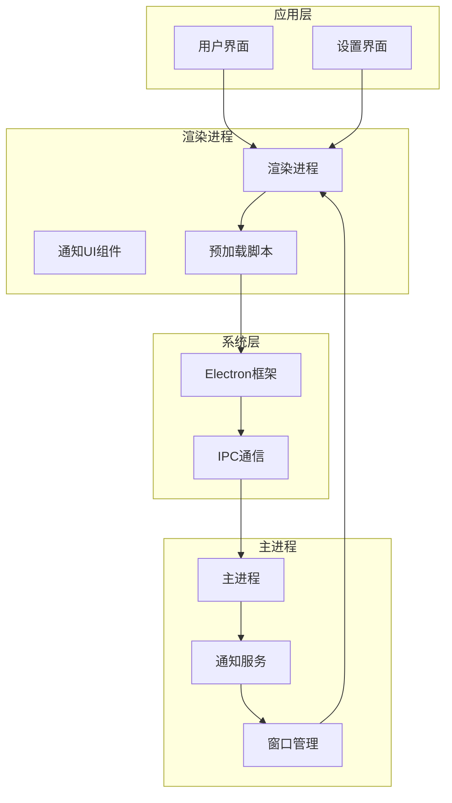
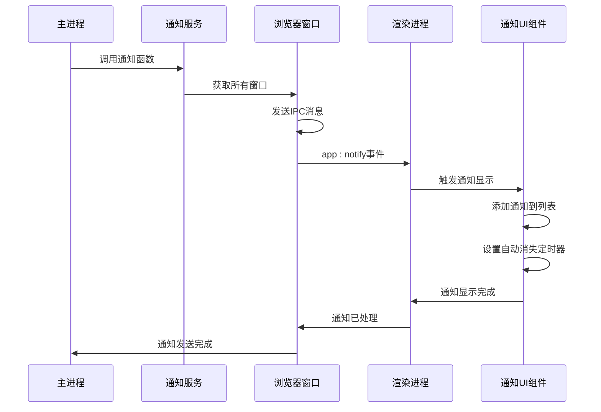
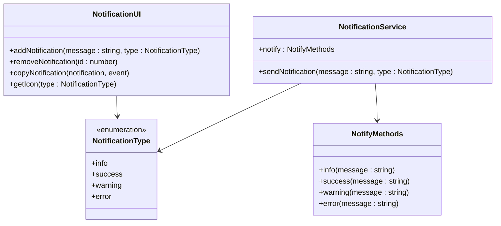
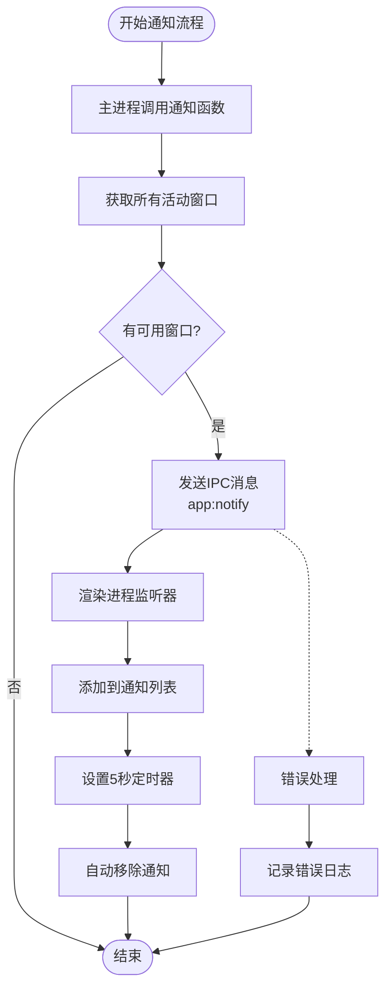
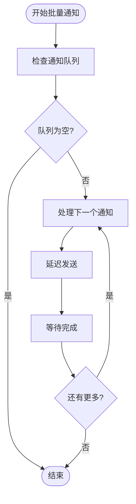
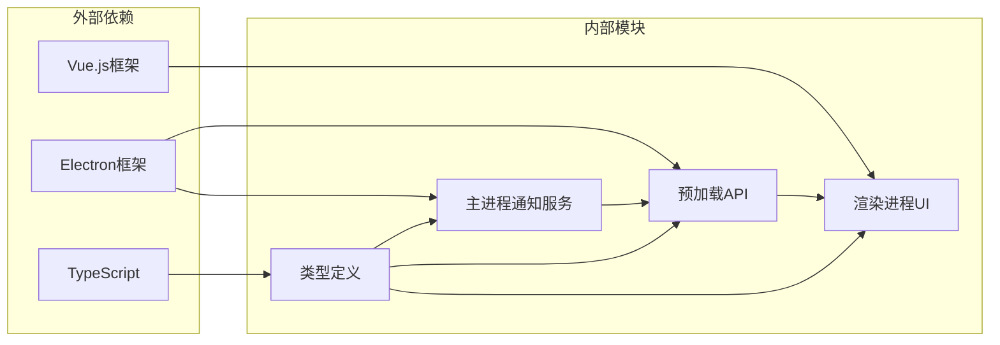

# 通知服务接口

<cite>
**本文档引用的文件**
- [notification.ts](file://src/main/services/notification.ts)
- [GlobalNotification.vue](file://src/renderer/src/components/GlobalNotification.vue)
- [index.ts](file://src/preload/index.ts)
- [index.ts](file://src/main/index.ts)
- [App.vue](file://src/renderer/src/App.vue)
- [types.d.ts](file://src/renderer/src/types.d.ts)
- [Settings.vue](file://src/renderer/src/views/settings/Settings.vue)
</cite>

## 目录
1. [简介](#简介)
2. [项目结构](#项目结构)
3. [核心组件](#核心组件)
4. [架构概览](#架构概览)
5. [详细组件分析](#详细组件分析)
6. [依赖关系分析](#依赖关系分析)
7. [性能考虑](#性能考虑)
8. [故障排除指南](#故障排除指南)
9. [结论](#结论)

## 简介

通知服务是开发者工具箱应用中的核心通信组件，负责在主进程和渲染进程之间传递系统通知信息。该服务实现了完整的IPC（进程间通信）接口，支持多种通知类型，并提供了用户友好的视觉反馈机制。

通知服务采用Electron框架的标准IPC模式，通过预加载脚本暴露安全的API接口给渲染进程使用。系统支持四种通知类型：信息（info）、成功（success）、警告（warning）和错误（error），每种类型都有对应的视觉标识和交互行为。

## 项目结构

通知服务在整个应用架构中位于以下层次：

**图表来源**
- [index.ts:110-174](file://src/main/index.ts#L110-L174)
- [index.ts:1-229](file://src/preload/index.ts#L1-L229)

**章节来源**
- [index.ts:1-444](file://src/main/index.ts#L1-L444)
- [index.ts:1-229](file://src/preload/index.ts#L1-L229)

## 核心组件

通知服务由三个主要组件构成：

### 主进程通知服务
- **文件**: [notification.ts:1-29](file://src/main/services/notification.ts#L1-L29)
- **职责**: 提供通知发送接口，管理通知类型枚举
- **功能**: 发送通知到所有打开的窗口，支持便捷方法调用

### 渲染进程通知UI
- **文件**: [GlobalNotification.vue:1-211](file://src/renderer/src/components/GlobalNotification.vue#L1-L211)
- **职责**: 负责通知的显示、管理和用户交互
- **功能**: 动态添加/移除通知，自动消失机制，复制功能

### 预加载脚本API
- **文件**: [index.ts:50-60](file://src/preload/index.ts#L50-L60)
- **职责**: 暴露安全的IPC接口给渲染进程
- **功能**: 监听通知事件，提供移除监听器功能

**章节来源**
- [notification.ts:1-29](file://src/main/services/notification.ts#L1-L29)
- [GlobalNotification.vue:1-211](file://src/renderer/src/components/GlobalNotification.vue#L1-L211)
- [index.ts:50-60](file://src/preload/index.ts#L50-L60)

## 架构概览

通知服务采用分层架构设计，确保了良好的安全性、可维护性和扩展性：

**图表来源**
- [notification.ts:15-20](file://src/main/services/notification.ts#L15-L20)
- [index.ts:52-59](file://src/preload/index.ts#L52-L59)
- [GlobalNotification.vue:54-62](file://src/renderer/src/components/GlobalNotification.vue#L54-L62)

## 详细组件分析

### 通知类型系统

通知服务支持四种标准化的通知类型：

| 类型 | 描述 | 视觉标识 | 颜色方案 |
|------|------|----------|----------|
| info | 信息通知 | ℹ | 蓝紫色调 |
| success | 成功通知 | ✓ | 绿色调 |
| warning | 警告通知 | ⚠ | 黄色调 |
| error | 错误通知 | ✕ | 红色调 |

**图表来源**
- [notification.ts:7-8](file://src/main/services/notification.ts#L7-L8)
- [notification.ts:23-28](file://src/main/services/notification.ts#L23-L28)
- [GlobalNotification.vue:4-11](file://src/renderer/src/components/GlobalNotification.vue#L4-L11)

**章节来源**
- [notification.ts:7-28](file://src/main/services/notification.ts#L7-L28)
- [GlobalNotification.vue:45-52](file://src/renderer/src/components/GlobalNotification.vue#L45-L52)

### IPC通信流程

通知服务的IPC通信遵循标准的Electron模式：

**图表来源**
- [notification.ts:15-20](file://src/main/services/notification.ts#L15-L20)
- [index.ts:52-59](file://src/preload/index.ts#L52-L59)
- [GlobalNotification.vue:16-23](file://src/renderer/src/components/GlobalNotification.vue#L16-L23)

**章节来源**
- [notification.ts:15-20](file://src/main/services/notification.ts#L15-L20)
- [index.ts:52-59](file://src/preload/index.ts#L52-L59)
- [GlobalNotification.vue:16-23](file://src/renderer/src/components/GlobalNotification.vue#L16-L23)

### 通知显示控制

通知UI组件实现了完整的显示控制机制：

#### 显示位置
- **固定定位**: 使用CSS固定定位系统
- **右上角**: 位置坐标为 top: 56px, right: 16px
- **层级管理**: z-index: 50 确保显示在最顶层

#### 持续时间
- **默认时长**: 5000毫秒（5秒）
- **自动消失**: 通过setTimeout实现
- **手动关闭**: 支持点击通知或关闭按钮

#### 用户交互
- **点击移除**: 点击通知主体触发移除
- **复制功能**: 支持复制通知内容到剪贴板
- **关闭按钮**: 右侧X按钮快速关闭

**章节来源**
- [GlobalNotification.vue:99-108](file://src/renderer/src/components/GlobalNotification.vue#L99-L108)
- [GlobalNotification.vue:20-22](file://src/renderer/src/components/GlobalNotification.vue#L20-L22)
- [GlobalNotification.vue:77-93](file://src/renderer/src/components/GlobalNotification.vue#L77-L93)

### 权限管理与用户偏好

通知服务集成了完整的权限管理和用户偏好设置：

#### 权限控制
- **上下文隔离**: 启用了Node.js集成的安全隔离
- **API暴露**: 仅暴露必要的通知相关API
- **事件监听**: 支持动态添加和移除事件监听器

#### 用户偏好设置
- **持久化存储**: 使用localStorage存储用户设置
- **代理设置**: 支持HTTP代理配置
- **开机自启动**: 系统级应用偏好设置

**章节来源**
- [index.ts:216-229](file://src/preload/index.ts#L216-L229)
- [Settings.vue:9-21](file://src/renderer/src/views/settings/Settings.vue#L9-L21)
- [Settings.vue:23-57](file://src/renderer/src/views/settings/Settings.vue#L23-L57)

### 批量操作支持

通知服务当前支持单个通知的发送和管理，对于批量操作建议采用以下模式：

#### 批量通知策略

**图表来源**
- [notification.ts:15-20](file://src/main/services/notification.ts#L15-L20)

## 依赖关系分析

通知服务的依赖关系清晰且低耦合：

**图表来源**
- [index.ts:1-14](file://src/main/index.ts#L1-L14)
- [index.ts:1-2](file://src/preload/index.ts#L1-L2)
- [types.d.ts:130-136](file://src/renderer/src/types.d.ts#L130-L136)

**章节来源**
- [index.ts:1-14](file://src/main/index.ts#L1-L14)
- [index.ts:1-2](file://src/preload/index.ts#L1-L2)
- [types.d.ts:130-136](file://src/renderer/src/types.d.ts#L130-L136)

## 性能考虑

通知服务在设计时充分考虑了性能优化：

### 内存管理
- **及时清理**: 通知自动消失后立即从内存中移除
- **事件监听**: 组件卸载时自动移除所有事件监听器
- **DOM优化**: 使用Vue的TransitionGroup实现高效的DOM操作

### 性能指标
- **渲染性能**: 使用CSS硬件加速的transform属性
- **内存占用**: 每个通知对象约占用100-200字节
- **CPU使用**: 定时器使用最小化的CPU资源

### 扩展性考虑
- **模块化设计**: 通知服务独立于其他功能模块
- **接口标准化**: 明确的IPC接口定义便于扩展
- **类型安全**: 完整的TypeScript类型定义

## 故障排除指南

### 常见问题及解决方案

#### 通知无法显示
1. **检查窗口状态**: 确保至少有一个活动的浏览器窗口
2. **验证IPC连接**: 检查预加载脚本是否正确初始化
3. **调试事件监听**: 确认onNotify回调正常工作

#### 通知样式异常
1. **CSS变量检查**: 验证CSS自定义属性是否正确加载
2. **z-index冲突**: 检查是否有其他元素覆盖通知层
3. **响应式布局**: 确认在不同屏幕尺寸下的表现

#### 性能问题
1. **内存泄漏检测**: 使用浏览器开发者工具监控内存使用
2. **事件监听器清理**: 确保组件卸载时正确移除监听器
3. **定时器管理**: 检查是否有未清理的定时器

**章节来源**
- [GlobalNotification.vue:60-62](file://src/renderer/src/components/GlobalNotification.vue#L60-L62)
- [index.ts:57-59](file://src/preload/index.ts#L57-L59)

## 结论

通知服务作为开发者工具箱的核心通信组件，展现了优秀的架构设计和实现质量。通过标准化的IPC接口、完善的类型系统和用户友好的界面设计，该服务为整个应用提供了可靠的用户反馈机制。

### 主要优势
- **安全性**: 严格的上下文隔离和API暴露控制
- **可维护性**: 清晰的模块划分和接口定义
- **用户体验**: 直观的视觉反馈和交互设计
- **扩展性**: 灵活的架构支持未来功能扩展

### 技术亮点
- **类型安全**: 完整的TypeScript支持
- **性能优化**: 高效的内存管理和渲染优化
- **跨平台兼容**: 基于Electron框架的跨平台支持
- **用户体验**: 自动消失和手动控制的平衡设计

通知服务为开发者工具箱提供了坚实的基础，其设计原则和实现模式可以作为其他Electron应用通知系统的参考模板。