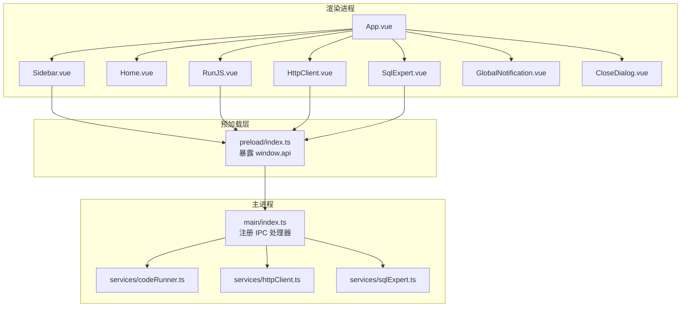
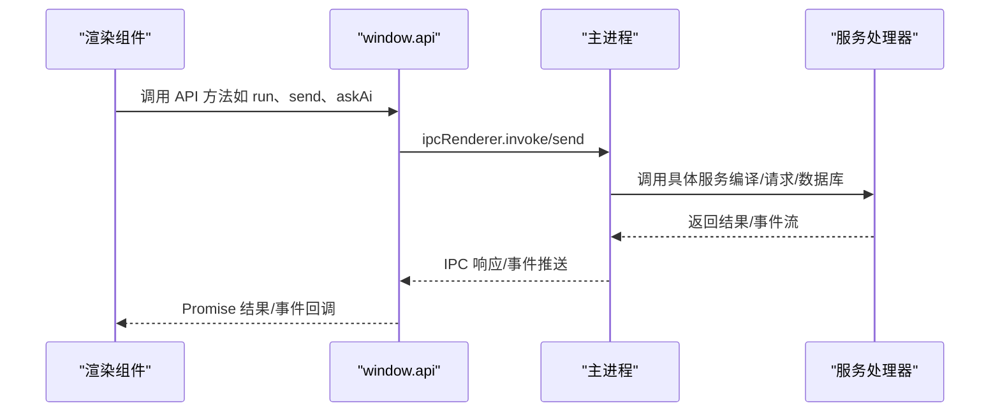
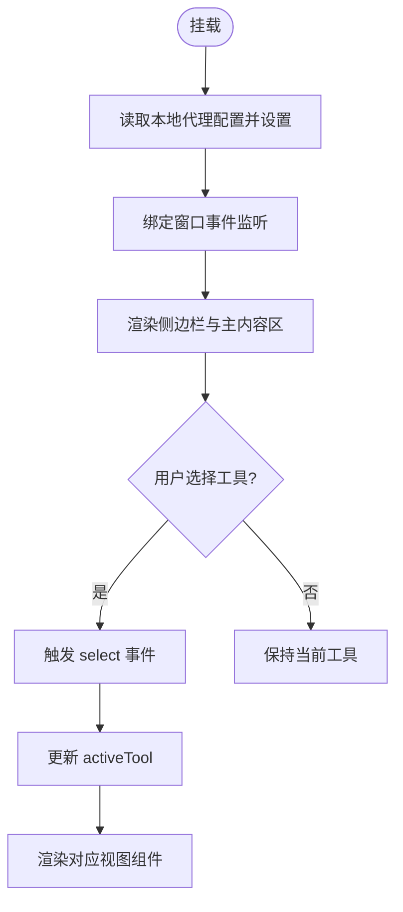
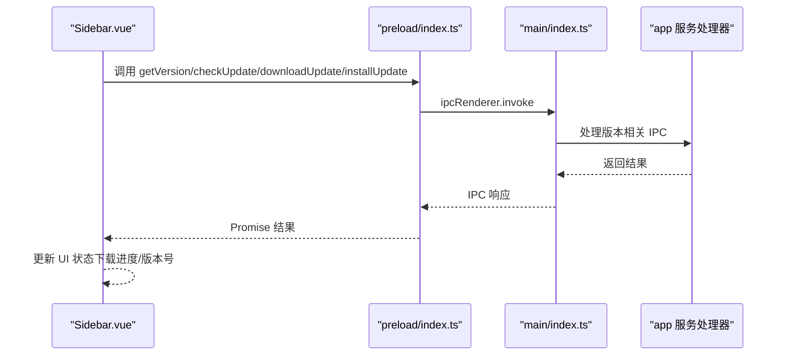
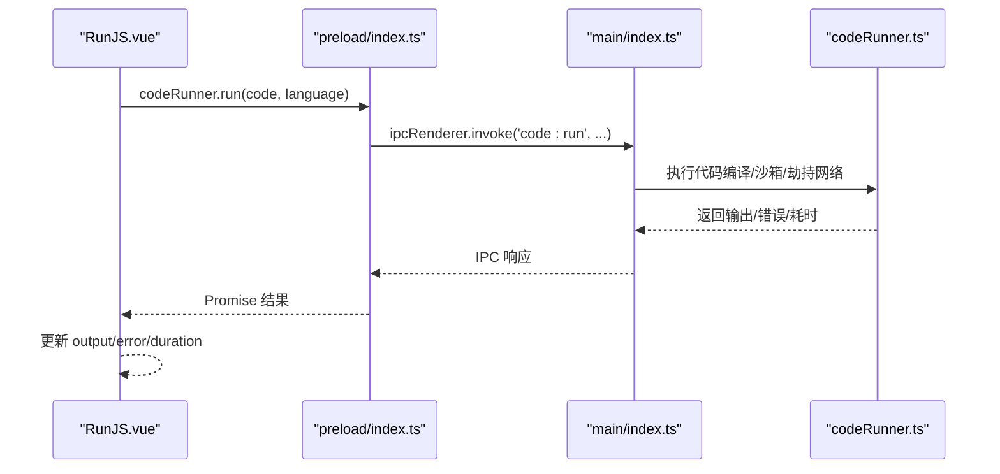
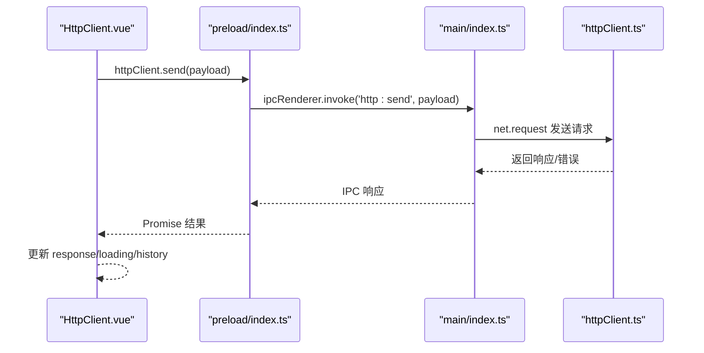
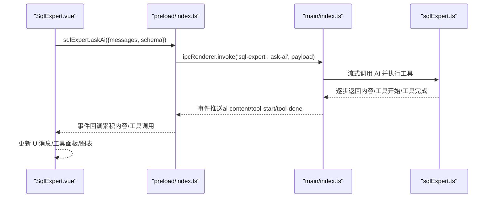
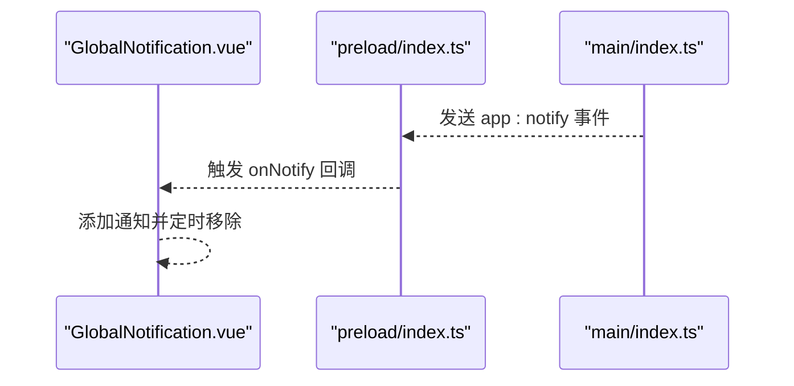
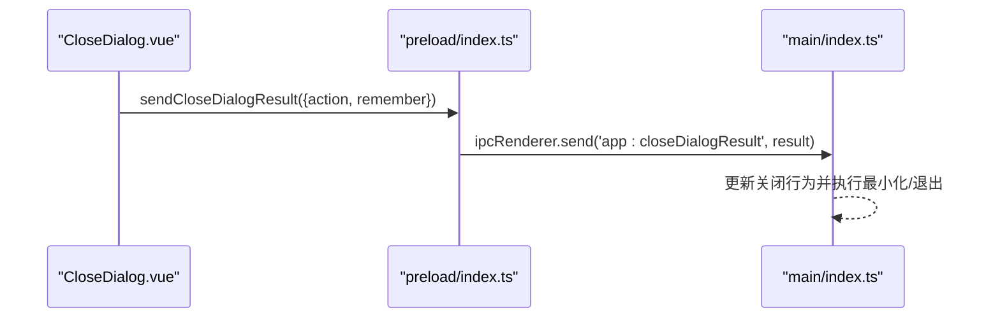
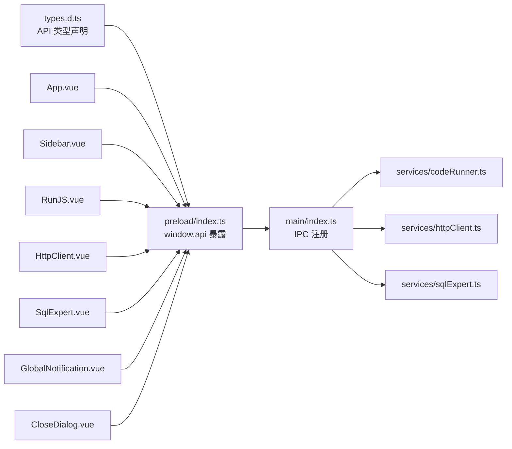

# 组件通信协议

<cite>
**本文档引用的文件**
- [App.vue](file://src/renderer/src/App.vue)
- [main.ts](file://src/renderer/src/main.ts)
- [index.ts](file://src/main/index.ts)
- [Sidebar.vue](file://src/renderer/src/components/Sidebar.vue)
- [GlobalNotification.vue](file://src/renderer/src/components/GlobalNotification.vue)
- [CloseDialog.vue](file://src/renderer/src/components/CloseDialog.vue)
- [Home.vue](file://src/renderer/src/views/home/Home.vue)
- [RunJS.vue](file://src/renderer/src/views/runjs/RunJS.vue)
- [HttpClient.vue](file://src/renderer/src/views/httpclient/HttpClient.vue)
- [SqlExpert.vue](file://src/renderer/src/views/sqlexpert/SqlExpert.vue)
- [codeRunner.ts](file://src/main/services/codeRunner.ts)
- [httpClient.ts](file://src/main/services/httpClient.ts)
- [sqlExpert.ts](file://src/main/services/sqlExpert.ts)
- [index.ts](file://src/preload/index.ts)
- [types.d.ts](file://src/renderer/src/types.d.ts)
</cite>

## 目录
1. [简介](#简介)
2. [项目结构](#项目结构)
3. [核心组件](#核心组件)
4. [架构总览](#架构总览)
5. [详细组件分析](#详细组件分析)
6. [依赖关系分析](#依赖关系分析)
7. [性能考虑](#性能考虑)
8. [故障排查指南](#故障排查指南)
9. [结论](#结论)
10. [附录](#附录)

## 简介
本文件面向开发者工具箱的组件通信机制，系统性梳理 Vue 组件间通信方式（props 传递、事件发射、provide/inject、Vuex 状态管理）、组件与服务层交互协议、数据流向与事件触发机制、状态同步协议、生命周期管理、异步数据处理与错误传播策略，并总结父子、兄弟与跨层级组件通信的最佳实践。

## 项目结构
项目采用 Electron + Vue 3 + TypeScript 的架构，渲染进程负责 UI 与交互，主进程负责系统能力与服务集成。组件通信主要通过以下路径实现：
- 渲染进程组件通过 window.api（预加载桥接）调用主进程服务
- 主进程通过 IPC 与渲染进程进行双向通信
- 组件内部通过 props、事件、状态与生命周期协同工作

图示来源
- [App.vue:1-102](file://src/renderer/src/App.vue#L1-L102)
- [Sidebar.vue:1-385](file://src/renderer/src/components/Sidebar.vue#L1-L385)
- [RunJS.vue:1-353](file://src/renderer/src/views/runjs/RunJS.vue#L1-L353)
- [HttpClient.vue:1-275](file://src/renderer/src/views/httpclient/HttpClient.vue#L1-L275)
- [SqlExpert.vue:1-800](file://src/renderer/src/views/sqlexpert/SqlExpert.vue#L1-L800)
- [index.ts:1-229](file://src/preload/index.ts#L1-L229)
- [index.ts:1-444](file://src/main/index.ts#L1-L444)
- [codeRunner.ts:1-461](file://src/main/services/codeRunner.ts#L1-L461)
- [httpClient.ts:1-113](file://src/main/services/httpClient.ts#L1-L113)
- [sqlExpert.ts:1-800](file://src/main/services/sqlExpert.ts#L1-L800)

章节来源
- [main.ts:1-6](file://src/renderer/src/main.ts#L1-L6)
- [index.ts:1-444](file://src/main/index.ts#L1-L444)

## 核心组件
- App.vue：应用入口，维护当前激活工具、路由容器、全局对话框与窗口事件绑定
- Sidebar.vue：侧边导航，负责工具选择、版本检查与更新流程
- GlobalNotification.vue：全局通知组件，接收主进程通知并展示
- CloseDialog.vue：关闭行为确认对话框，向主进程回传用户选择
- RunJS.vue：代码运行与输出面板，管理文件集合与运行状态
- HttpClient.vue：HTTP 请求工具，构建请求并展示响应
- SqlExpert.vue：企业级分析专家，管理聊天、工具调用、图表渲染与记忆

章节来源
- [App.vue:1-102](file://src/renderer/src/App.vue#L1-L102)
- [Sidebar.vue:1-385](file://src/renderer/src/components/Sidebar.vue#L1-L385)
- [GlobalNotification.vue:1-211](file://src/renderer/src/components/GlobalNotification.vue#L1-L211)
- [CloseDialog.vue:1-215](file://src/renderer/src/components/CloseDialog.vue#L1-L215)
- [RunJS.vue:1-353](file://src/renderer/src/views/runjs/RunJS.vue#L1-L353)
- [HttpClient.vue:1-275](file://src/renderer/src/views/httpclient/HttpClient.vue#L1-L275)
- [SqlExpert.vue:1-800](file://src/renderer/src/views/sqlexpert/SqlExpert.vue#L1-L800)

## 架构总览
组件通信与数据流遵循“渲染层组件 → 预加载桥接 → 主进程服务 → IPC 回传”的链路，结合组件内部状态与事件实现完整的交互闭环。

图示来源
- [index.ts:1-229](file://src/preload/index.ts#L1-L229)
- [index.ts:1-444](file://src/main/index.ts#L1-L444)
- [codeRunner.ts:1-461](file://src/main/services/codeRunner.ts#L1-L461)
- [httpClient.ts:1-113](file://src/main/services/httpClient.ts#L1-L113)
- [sqlExpert.ts:1-800](file://src/main/services/sqlExpert.ts#L1-L800)

## 详细组件分析

### App.vue：应用容器与全局事件
- 负责维护当前激活工具 id、异步组件映射与 KeepAlive 缓存
- 监听主进程窗口事件，控制全局对话框显示
- 通过事件向下传递工具切换指令

图示来源
- [App.vue:37-52](file://src/renderer/src/App.vue#L37-L52)
- [App.vue:33-35](file://src/renderer/src/App.vue#L33-L35)
- [App.vue:69-71](file://src/renderer/src/App.vue#L69-L71)

章节来源
- [App.vue:1-102](file://src/renderer/src/App.vue#L1-L102)

### Sidebar.vue：工具导航与版本更新
- 接收父组件传入的工具列表与当前激活项
- 通过事件向上抛出工具选择与回到首页
- 与主进程交互实现版本检查、下载与安装

图示来源
- [Sidebar.vue:25-79](file://src/renderer/src/components/Sidebar.vue#L25-L79)
- [index.ts:24-47](file://src/preload/index.ts#L24-L47)
- [index.ts:218-299](file://src/main/index.ts#L218-L299)

章节来源
- [Sidebar.vue:1-385](file://src/renderer/src/components/Sidebar.vue#L1-L385)

### RunJS.vue：代码运行与文件管理
- 管理多文件集合、活动文件、运行状态与输出
- 通过 window.api.codeRunner.run/send 命令与主进程交互
- 支持快捷键运行/停止、持久化存储

图示来源
- [RunJS.vue:152-181](file://src/renderer/src/views/runjs/RunJS.vue#L152-L181)
- [index.ts:63-69](file://src/preload/index.ts#L63-L69)
- [codeRunner.ts:98-247](file://src/main/services/codeRunner.ts#L98-L247)

章节来源
- [RunJS.vue:1-353](file://src/renderer/src/views/runjs/RunJS.vue#L1-L353)
- [codeRunner.ts:1-461](file://src/main/services/codeRunner.ts#L1-L461)

### HttpClient.vue：HTTP 请求与历史记录
- 构建请求 URL、Headers、Body，调用 window.api.httpClient.send
- 维护历史记录并持久化到 localStorage
- 展示响应状态与错误信息

图示来源
- [HttpClient.vue:121-167](file://src/renderer/src/views/httpclient/HttpClient.vue#L121-L167)
- [index.ts:106-115](file://src/preload/index.ts#L106-L115)
- [httpClient.ts:15-113](file://src/main/services/httpClient.ts#L15-L113)

章节来源
- [HttpClient.vue:1-275](file://src/renderer/src/views/httpclient/HttpClient.vue#L1-L275)
- [httpClient.ts:1-113](file://src/main/services/httpClient.ts#L1-L113)

### SqlExpert.vue：AI 聊天与工具调用
- 管理聊天消息、工具调用、图表渲染与记忆
- 通过 window.api.sqlExpert.askAi/onAiContent/onAiToolDone 与主进程交互
- 支持余额查询、表结构加载、导出与图表渲染

图示来源
- [SqlExpert.vue:658-681](file://src/renderer/src/views/sqlexpert/SqlExpert.vue#L658-L681)
- [index.ts:156-212](file://src/preload/index.ts#L156-L212)
- [sqlExpert.ts:676-739](file://src/main/services/sqlExpert.ts#L676-L739)

章节来源
- [SqlExpert.vue:1-800](file://src/renderer/src/views/sqlexpert/SqlExpert.vue#L1-L800)
- [sqlExpert.ts:1-800](file://src/main/services/sqlExpert.ts#L1-L800)

### GlobalNotification.vue：全局通知
- 监听主进程通知事件，展示通知并支持复制
- 生命周期内注册/移除事件监听

图示来源
- [GlobalNotification.vue:54-62](file://src/renderer/src/components/GlobalNotification.vue#L54-L62)
- [index.ts:50-60](file://src/preload/index.ts#L50-L60)
- [index.ts:134-137](file://src/main/index.ts#L134-L137)

章节来源
- [GlobalNotification.vue:1-211](file://src/renderer/src/components/GlobalNotification.vue#L1-L211)

### CloseDialog.vue：关闭行为确认
- 接收用户选择并通过 window.api.sendCloseDialogResult 回传
- 触发主进程关闭行为决策

图示来源
- [CloseDialog.vue:11-21](file://src/renderer/src/components/CloseDialog.vue#L11-L21)
- [index.ts:36-38](file://src/preload/index.ts#L36-L38)
- [index.ts:364-377](file://src/main/index.ts#L364-L377)

章节来源
- [CloseDialog.vue:1-215](file://src/renderer/src/components/CloseDialog.vue#L1-L215)

### 组件间通信模式与最佳实践

- 父子组件通信
  - Props 传递：Sidebar 接收工具列表与激活项；App 通过 props 控制 Sidebar 激活态
  - 事件发射：Sidebar 通过 select/go-home 向父组件传递工具选择；RunJS 通过 @run/@stop/@clear 与父组件解耦
  - 最佳实践：明确事件命名与参数结构，避免跨层级事件冒泡

- 兄弟组件通信
  - 通过共同父组件进行事件中转（App.vue 作为路由容器，统一转发工具切换）
  - 通过全局通知组件（GlobalNotification.vue）广播系统级消息

- 跨层级组件通信
  - 通过 window.api 预加载桥接与主进程服务解耦 UI 与系统能力
  - 通过 IPC 事件流（如 sql-expert:ai-content）实现长链路状态同步

- 状态管理
  - 项目未引入 Vuex，采用组件局部状态与生命周期管理
  - 推荐：复杂跨组件共享状态（如运行时配置、全局主题）可引入 Pinia，避免深层 props 与事件风暴

章节来源
- [App.vue:62-71](file://src/renderer/src/App.vue#L62-L71)
- [Sidebar.vue:12-15](file://src/renderer/src/components/Sidebar.vue#L12-L15)
- [RunJS.vue:256-274](file://src/renderer/src/views/runjs/RunJS.vue#L256-L274)
- [GlobalNotification.vue:54-62](file://src/renderer/src/components/GlobalNotification.vue#L54-L62)

### 生命周期管理与异步处理
- 组件挂载：App.vue 加载代理配置并绑定窗口事件；Sidebar.vue 初始化版本检查；SqlExpert.vue 监听 AI 事件
- 组件卸载：GlobalNotification.vue 移除通知监听；SqlExpert.vue 移除 AI 事件监听
- 异步处理：RunJS 与 HttpClient 使用 Promise；SqlExpert 使用流式事件；Sidebar 使用轮询式下载进度

章节来源
- [App.vue:37-52](file://src/renderer/src/App.vue#L37-L52)
- [Sidebar.vue:25-34](file://src/renderer/src/components/Sidebar.vue#L25-L34)
- [GlobalNotification.vue:54-62](file://src/renderer/src/components/GlobalNotification.vue#L54-L62)
- [SqlExpert.vue:658-681](file://src/renderer/src/views/sqlexpert/SqlExpert.vue#L658-L681)

### 错误传播与用户体验
- 组件内部：RunJS/HttpClient 捕获异常并返回错误信息；Sidebar 展示下载失败与更新错误
- 全局通知：通过 GlobalNotification.vue 统一展示错误与成功提示
- 主进程：错误信息通过 IPC 事件或 Promise 拒绝返回渲染进程

章节来源
- [RunJS.vue:167-171](file://src/renderer/src/views/runjs/RunJS.vue#L167-L171)
- [HttpClient.vue:154-166](file://src/renderer/src/views/httpclient/HttpClient.vue#L154-L166)
- [Sidebar.vue:45-47](file://src/renderer/src/components/Sidebar.vue#L45-L47)
- [GlobalNotification.vue:16-30](file://src/renderer/src/components/GlobalNotification.vue#L16-L30)

## 依赖关系分析

图示来源
- [types.d.ts:276-295](file://src/renderer/src/types.d.ts#L276-L295)
- [index.ts:1-229](file://src/preload/index.ts#L1-L229)
- [index.ts:1-444](file://src/main/index.ts#L1-L444)
- [codeRunner.ts:1-461](file://src/main/services/codeRunner.ts#L1-L461)
- [httpClient.ts:1-113](file://src/main/services/httpClient.ts#L1-L113)
- [sqlExpert.ts:1-800](file://src/main/services/sqlExpert.ts#L1-L800)

章节来源
- [types.d.ts:1-295](file://src/renderer/src/types.d.ts#L1-L295)
- [index.ts:1-229](file://src/preload/index.ts#L1-L229)
- [index.ts:1-444](file://src/main/index.ts#L1-L444)

## 性能考虑
- 组件缓存：App.vue 使用 KeepAlive 缓存视图，减少重复渲染与初始化成本
- 异步优化：RunJS/HttpClient 使用超时与 Promise 控制并发；SqlExpert 使用流式事件避免阻塞
- 资源清理：CodeRunner 服务清理活跃服务器；SqlExpert 移除事件监听；Sidebar 下载完成后重置状态
- 数据持久化：RunJS/HttpClient 使用 localStorage 减少重复计算与网络请求

章节来源
- [App.vue:69-71](file://src/renderer/src/App.vue#L69-L71)
- [codeRunner.ts:77-96](file://src/main/services/codeRunner.ts#L77-L96)
- [SqlExpert.vue:658-681](file://src/renderer/src/views/sqlexpert/SqlExpert.vue#L658-L681)

## 故障排查指南
- 代理设置失败
  - 现象：更新/网络请求失败
  - 排查：检查主进程 setProxy 返回值与错误提示；确认代理格式与网络连通性
  - 参考
    - [index.ts:306-327](file://src/main/index.ts#L306-L327)
    - [index.ts:140-157](file://src/main/index.ts#L140-L157)

- 代码运行异常
  - 现象：运行卡住或输出异常
  - 排查：检查 CodeRunner 沙箱输出与服务器清理；必要时调用 stop/clean
  - 参考
    - [codeRunner.ts:237-247](file://src/main/services/codeRunner.ts#L237-L247)
    - [RunJS.vue:175-181](file://src/renderer/src/views/runjs/RunJS.vue#L175-L181)

- HTTP 请求超时/错误
  - 现象：请求无响应或返回错误
  - 排查：检查 URL、Headers、Body 构建；调整超时；确认代理与网络
  - 参考
    - [httpClient.ts:16-113](file://src/main/services/httpClient.ts#L16-L113)
    - [HttpClient.vue:121-167](file://src/renderer/src/views/httpclient/HttpClient.vue#L121-L167)

- AI 聊天无响应
  - 现象：内容不更新、工具未执行
  - 排查：确认 API Key、URL、Schema 加载；检查 onAiContent/onAiToolDone 事件监听
  - 参考
    - [sqlExpert.ts:676-739](file://src/main/services/sqlExpert.ts#L676-L739)
    - [SqlExpert.vue:658-681](file://src/renderer/src/views/sqlexpert/SqlExpert.vue#L658-L681)

章节来源
- [index.ts:306-327](file://src/main/index.ts#L306-L327)
- [codeRunner.ts:237-247](file://src/main/services/codeRunner.ts#L237-L247)
- [httpClient.ts:16-113](file://src/main/services/httpClient.ts#L16-L113)
- [sqlExpert.ts:676-739](file://src/main/services/sqlExpert.ts#L676-L739)

## 结论
本项目通过 window.api 预加载桥接与主进程服务实现了稳定的组件通信协议，组件内部采用 props/事件与生命周期管理实现清晰的数据流与状态同步。建议在复杂场景引入 Pinia 管理共享状态，并持续完善错误传播与性能监控，以提升整体稳定性与可维护性。

## 附录

### 组件通信协议清单
- 父子通信
  - Sidebar → App：select/go-home 事件
  - RunJS → 父组件：run/stop/clear 事件
- 兄弟通信
  - App → Sidebar：tools/activeTool props
  - App → 全局通知：通过 GlobalNotification 暴露方法
- 跨层级通信
  - 渲染组件 ↔ 主进程：window.api.* 方法
  - 主进程 ↔ 渲染进程：ipcRenderer.invoke/send 与事件监听

章节来源
- [App.vue:62-71](file://src/renderer/src/App.vue#L62-L71)
- [Sidebar.vue:12-15](file://src/renderer/src/components/Sidebar.vue#L12-L15)
- [RunJS.vue:256-274](file://src/renderer/src/views/runjs/RunJS.vue#L256-L274)
- [GlobalNotification.vue:64-66](file://src/renderer/src/components/GlobalNotification.vue#L64-L66)
- [index.ts:1-229](file://src/preload/index.ts#L1-L229)