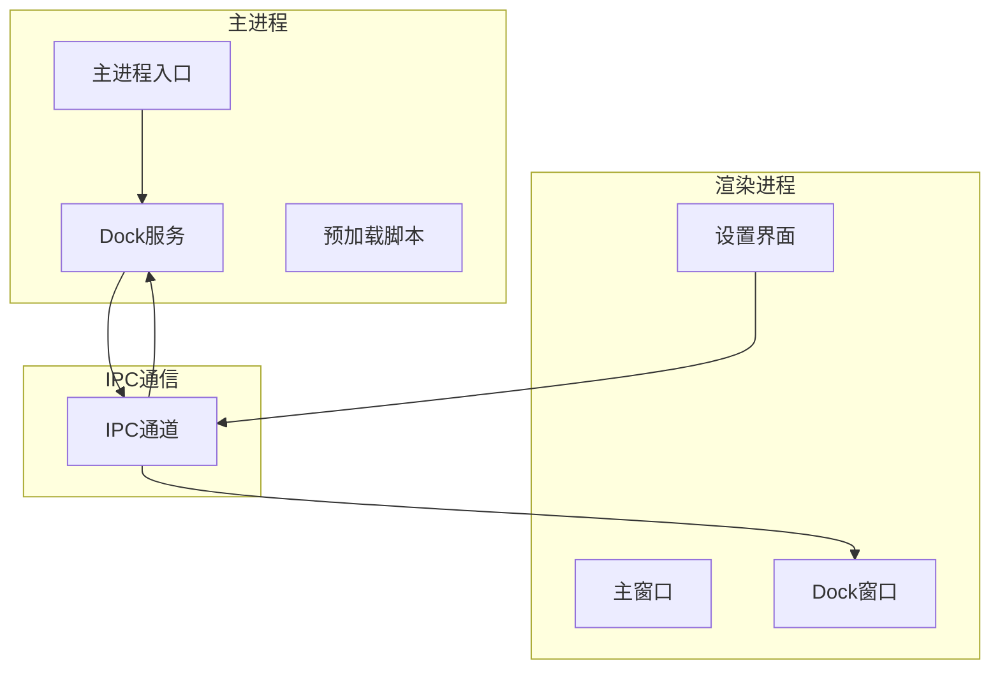
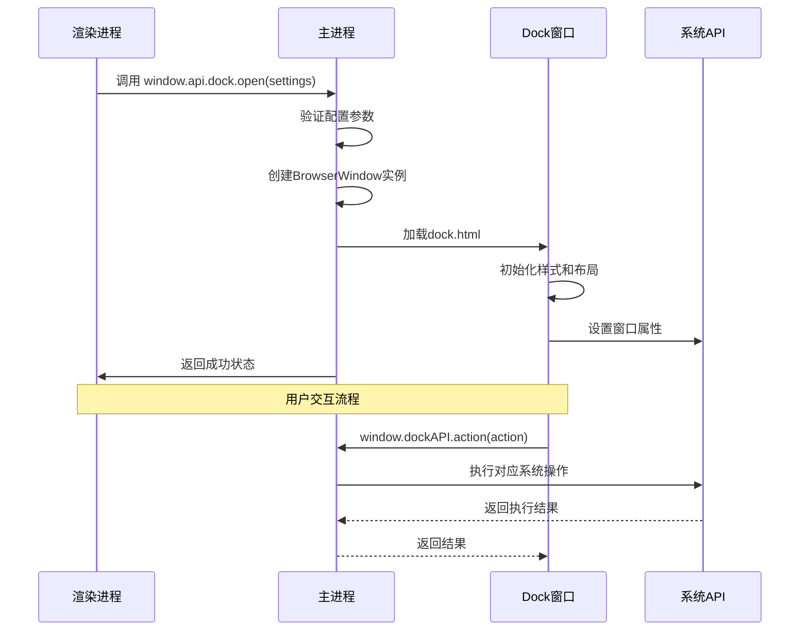
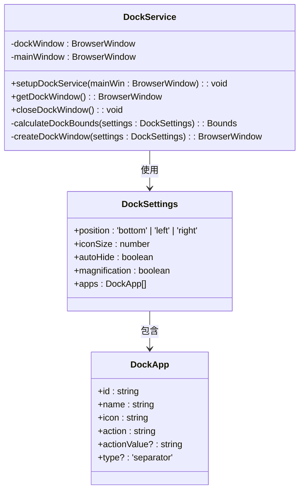
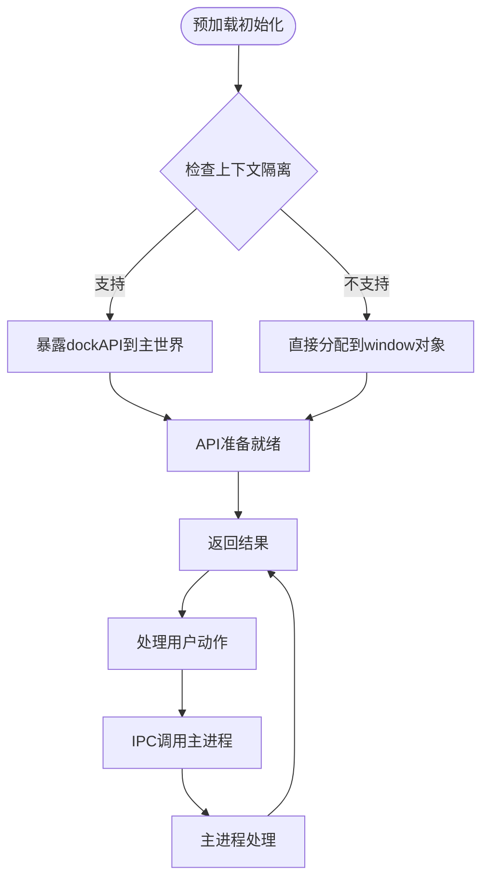
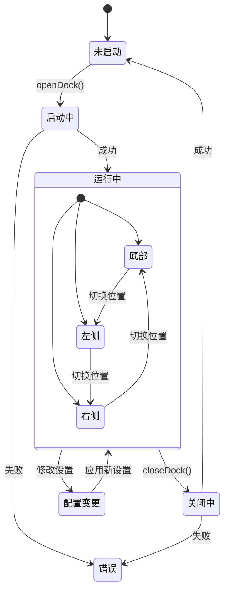
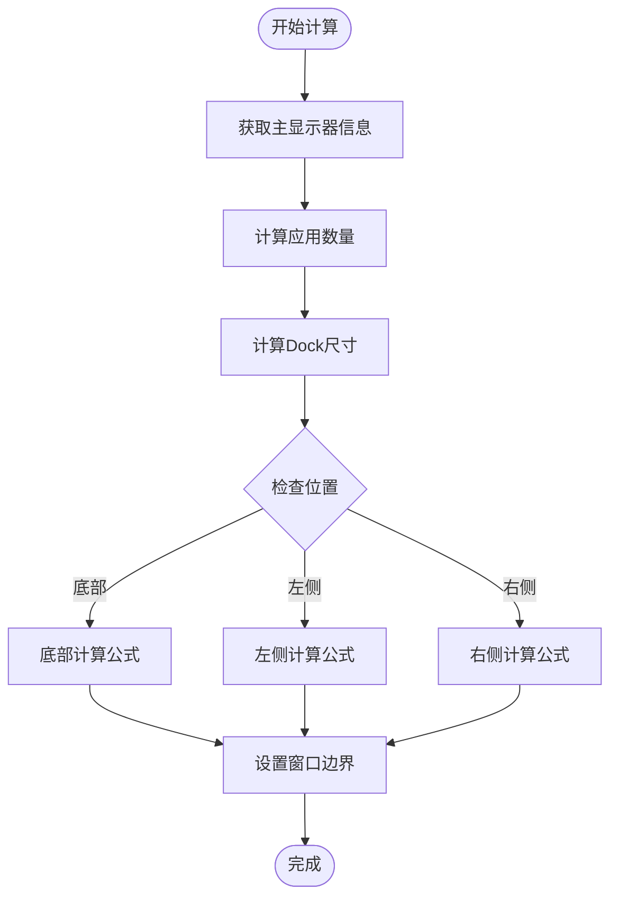
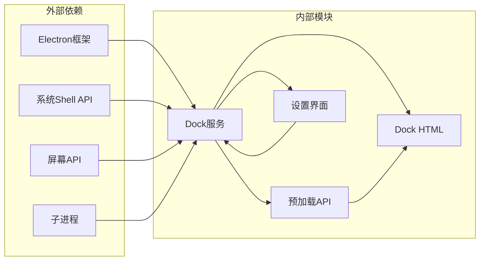

# Dock服务API

<cite>
**本文档引用的文件**
- [dockService.ts](file://src/main/services/dockService.ts)
- [dock.ts](file://src/preload/dock.ts)
- [DockSettings.vue](file://src/renderer/src/views/dock/DockSettings.vue)
- [index.d.ts](file://src/preload/index.d.ts)
- [dock.html](file://src/renderer/dock.html)
- [index.ts](file://src/main/index.ts)
</cite>

## 目录
1. [简介](#简介)
2. [项目结构](#项目结构)
3. [核心组件](#核心组件)
4. [架构概览](#架构概览)
5. [详细组件分析](#详细组件分析)
6. [依赖关系分析](#依赖关系分析)
7. [性能考虑](#性能考虑)
8. [故障排除指南](#故障排除指南)
9. [结论](#结论)

## 简介

Dock服务API是一个基于Electron的macOS风格工具栏解决方案，为开发者工具箱提供了独立的Dock窗口功能。该API实现了完整的macOS Dock体验，包括窗口管理、配置管理和交互处理等功能。

该服务通过IPC机制与主进程通信，支持多平台部署（Windows、macOS、Linux），并提供了丰富的自定义选项和事件监听能力。

## 项目结构

Dock服务API位于项目的Electron主进程和渲染进程之间，采用模块化设计：

**图表来源**
- [index.ts:393-395](file://src/main/index.ts#L393-L395)
- [dockService.ts:111-112](file://src/main/services/dockService.ts#L111-L112)

**章节来源**
- [index.ts:110-127](file://src/main/index.ts#L110-L127)
- [dockService.ts:65-108](file://src/main/services/dockService.ts#L65-L108)

## 核心组件

### Dock服务接口

Dock服务提供了四个核心方法：

| 方法 | 参数 | 返回值 | 描述 |
|------|------|--------|------|
| open | settings: DockSettings | Promise<DockResult> | 打开Dock窗口并应用配置 |
| close | 无 | Promise<DockResult> | 关闭Dock窗口 |
| isOpen | 无 | Promise<boolean> | 检查Dock窗口状态 |
| action | action: string | Promise<{success: boolean}> | 执行指定动作 |

### 配置参数

Dock配置包含以下关键属性：

| 属性名 | 类型 | 默认值 | 描述 |
|--------|------|--------|------|
| position | 'bottom' \| 'left' \| 'right' | 'bottom' | Dock位置 |
| iconSize | number | 48 | 图标尺寸（像素） |
| autoHide | boolean | false | 自动隐藏功能 |
| magnification | boolean | true | 放大效果 |

**章节来源**
- [index.d.ts:152-169](file://src/preload/index.d.ts#L152-L169)
- [DockSettings.vue:18-30](file://src/renderer/src/views/dock/DockSettings.vue#L18-L30)

## 架构概览

Dock服务采用分层架构设计，确保了良好的模块分离和可维护性：

**图表来源**
- [dockService.ts:115-141](file://src/main/services/dockService.ts#L115-L141)
- [dock.ts:4-6](file://src/preload/dock.ts#L4-L6)

## 详细组件分析

### 主服务实现

Dock服务的核心实现在主进程中，负责窗口生命周期管理和系统集成：

**图表来源**
- [dockService.ts:10-26](file://src/main/services/dockService.ts#L10-L26)
- [dockService.ts:111-112](file://src/main/services/dockService.ts#L111-L112)

### 预加载脚本

预加载脚本为Dock窗口提供了安全的API访问：

**图表来源**
- [dock.ts:9-18](file://src/preload/dock.ts#L9-L18)

### 设置界面实现

设置界面提供了完整的Dock配置管理功能：

**图表来源**
- [DockSettings.vue:114-135](file://src/renderer/src/views/dock/DockSettings.vue#L114-L135)

**章节来源**
- [dockService.ts:29-62](file://src/main/services/dockService.ts#L29-L62)
- [dock.ts:1-19](file://src/preload/dock.ts#L1-L19)

### 窗口边界计算

Dock窗口的边界计算逻辑根据配置动态调整：

**图表来源**
- [dockService.ts:29-62](file://src/main/services/dockService.ts#L29-L62)

**章节来源**
- [dockService.ts:29-62](file://src/main/services/dockService.ts#L29-L62)

## 依赖关系分析

Dock服务API的依赖关系清晰明确，遵循单一职责原则：

**图表来源**
- [dockService.ts:1-5](file://src/main/services/dockService.ts#L1-L5)
- [index.ts:1-4](file://src/main/index.ts#L1-L4)

**章节来源**
- [dockService.ts:1-5](file://src/main/services/dockService.ts#L1-L5)
- [index.ts:1-4](file://src/main/index.ts#L1-L4)

## 性能考虑

### 内存管理

Dock服务实现了智能的内存管理策略：

1. **窗口复用**：已存在的Dock窗口会被复用而非重复创建
2. **资源清理**：应用退出时自动清理Dock窗口资源
3. **事件监听**：合理管理IPC事件监听器的生命周期

### 渲染性能

Dock窗口采用了多项性能优化技术：

1. **CSS硬件加速**：利用transform和opacity属性启用GPU加速
2. **最小重绘**：通过精确的CSS类切换减少DOM重绘
3. **延迟加载**：自动隐藏功能通过延迟机制减少资源占用

### 跨平台兼容性

服务针对不同平台进行了专门优化：

| 平台 | 特殊处理 | 注意事项 |
|------|----------|----------|
| Windows | 禁用GPU合成避免标题栏问题 | 需要特定开关参数 |
| macOS | 使用原生Dock特性 | 支持全屏可见和屏幕保护 |
| Linux | 终端模拟器检测 | 支持多种终端应用 |

**章节来源**
- [index.ts:38-41](file://src/main/index.ts#L38-L41)
- [dockService.ts:87-89](file://src/main/services/dockService.ts#L87-L89)

## 故障排除指南

### 常见问题及解决方案

#### Dock窗口无法启动

**症状**：调用open()方法返回失败状态

**可能原因**：
1. 配置参数验证失败
2. 窗口创建过程中出现异常
3. IPC通信中断

**解决步骤**：
1. 检查Dock配置参数的有效性
2. 查看主进程日志中的错误信息
3. 确认IPC通道正常工作

#### 自动隐藏功能失效

**症状**：Dock窗口不会自动隐藏

**可能原因**：
1. 鼠标位置检测逻辑异常
2. 定时器管理问题
3. CSS样式冲突

**解决步骤**：
1. 验证autoHide配置为true
2. 检查CSS样式是否正确应用
3. 确认事件监听器正常注册

#### 动作执行失败

**症状**：点击Dock图标无响应

**可能原因**：
1. IPC调用失败
2. 系统权限不足
3. 应用路径错误

**解决步骤**：
1. 检查action参数格式
2. 验证目标应用是否存在
3. 确认系统shell权限

**章节来源**
- [dockService.ts:138-140](file://src/main/services/dockService.ts#L138-L140)
- [dockService.ts:151-153](file://src/main/services/dockService.ts#L151-L153)

## 结论

Dock服务API为开发者工具箱提供了完整且高效的macOS风格工具栏解决方案。该API具有以下优势：

1. **模块化设计**：清晰的分层架构便于维护和扩展
2. **跨平台支持**：统一的API接口支持多平台部署
3. **性能优化**：多项性能优化技术确保流畅体验
4. **配置灵活**：丰富的配置选项满足不同需求
5. **易于集成**：简洁的API设计便于第三方集成

通过合理的错误处理和资源管理，该服务能够稳定地运行在各种环境中，为用户提供接近原生macOS体验的工具栏功能。