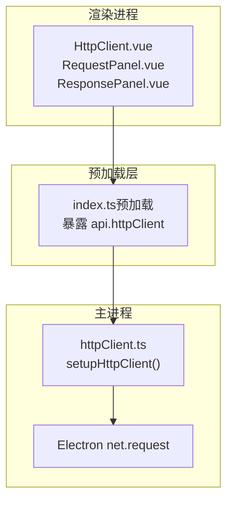
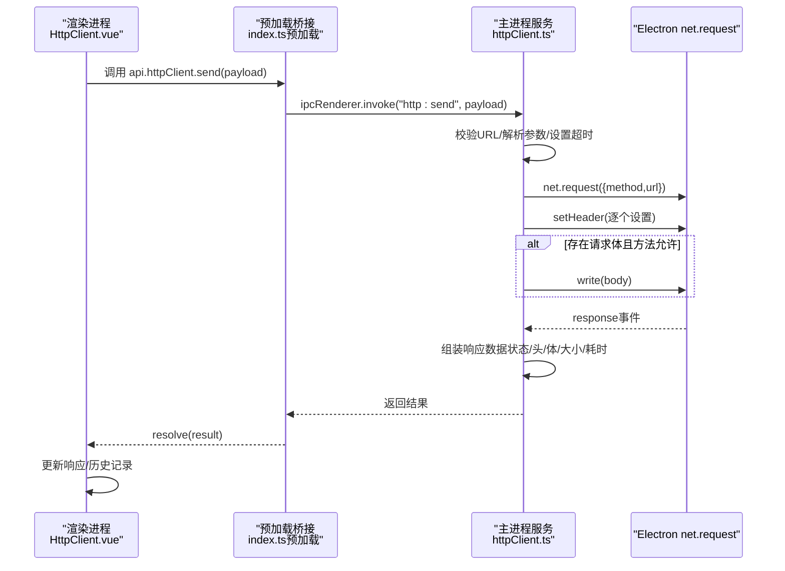
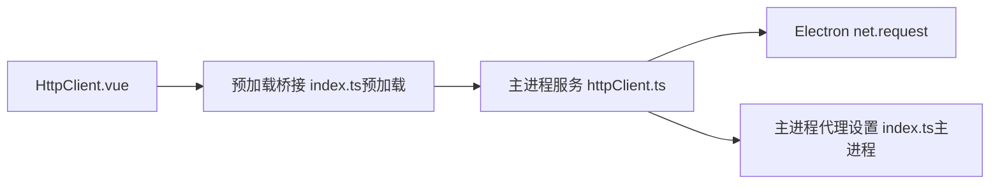
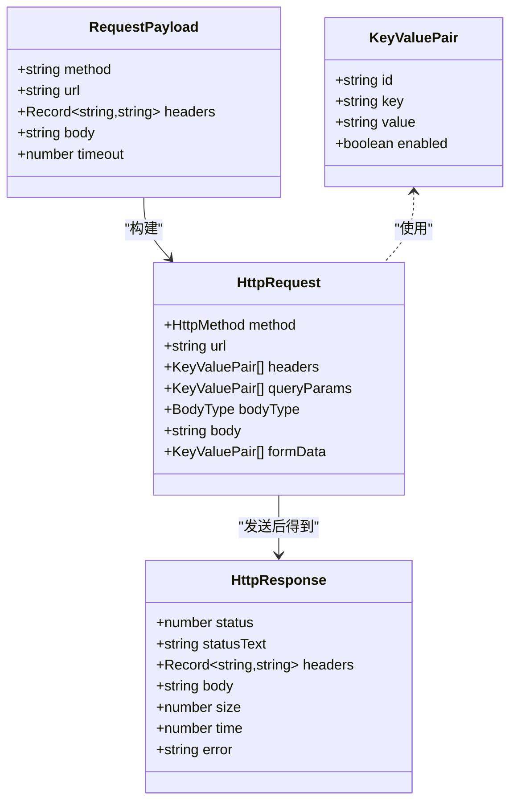

# HTTP客户端API

<cite>
**本文档引用的文件**
- [httpClient.ts](file://src/main/services/httpClient.ts)
- [types.ts](file://src/renderer/src/views/httpclient/types.ts)
- [HttpClient.vue](file://src/renderer/src/views/httpclient/HttpClient.vue)
- [RequestPanel.vue](file://src/renderer/src/views/httpclient/components/RequestPanel.vue)
- [ResponsePanel.vue](file://src/renderer/src/views/httpclient/components/ResponsePanel.vue)
- [HistoryPanel.vue](file://src/renderer/src/views/httpclient/components/HistoryPanel.vue)
- [KeyValueEditor.vue](file://src/renderer/src/views/httpclient/components/KeyValueEditor.vue)
- [index.ts（预加载）](file://src/preload/index.ts)
- [index.ts（主进程）](file://src/main/index.ts)
- [README.md](file://README.md)
- [package.json](file://package.json)
</cite>

## 目录
1. [简介](#简介)
2. [项目结构](#项目结构)
3. [核心组件](#核心组件)
4. [架构总览](#架构总览)
5. [详细组件分析](#详细组件分析)
6. [依赖关系分析](#依赖关系分析)
7. [性能考量](#性能考量)
8. [故障排查指南](#故障排查指南)
9. [结论](#结论)
10. [附录](#附录)

## 简介
本文件为HTTP客户端API的全面接口文档，聚焦于主进程中的httpClient对象及其网络请求功能，重点覆盖以下方面：
- send()方法的完整请求处理流程
- 请求负载(payload)的数据结构定义与字段说明
- CORS绕过机制与代理集成
- 请求头自定义、请求体格式化策略
- 超时控制与错误处理
- 性能监控指标与最佳实践
- 安全考虑与调试技巧

该HTTP客户端通过Electron主进程发起请求，从而绕过浏览器CORS限制，并自动使用应用代理设置，确保在桌面应用环境中稳定访问各类后端服务。

章节来源
- [README.md: 42-47:42-47](file://README.md#L42-L47)

## 项目结构
HTTP客户端位于Electron应用的“渲染进程-预加载桥接-主进程服务”三层架构中：
- 渲染进程：提供HTTP客户端界面与交互逻辑
- 预加载层：通过contextBridge暴露受控API至渲染进程
- 主进程：实现实际网络请求与CORS绕过

图示来源
- [HttpClient.vue: 1-275:1-275](file://src/renderer/src/views/httpclient/HttpClient.vue#L1-L275)
- [index.ts（预加载）: 106-115:106-115](file://src/preload/index.ts#L106-L115)
- [httpClient.ts: 15-112:15-112](file://src/main/services/httpClient.ts#L15-L112)

章节来源
- [HttpClient.vue: 1-275:1-275](file://src/renderer/src/views/httpclient/HttpClient.vue#L1-L275)
- [index.ts（预加载）: 106-115:106-115](file://src/preload/index.ts#L106-L115)
- [httpClient.ts: 15-112:15-112](file://src/main/services/httpClient.ts#L15-L112)

## 核心组件
- 主进程HTTP服务：负责接收渲染进程请求、构建net.request、设置请求头、处理超时与错误、组装响应数据
- 渲染进程HTTP客户端：负责构建请求负载、格式化请求体、触发IPC调用、展示响应与历史记录
- 预加载桥接：在隔离上下文中暴露受控API（ipcRenderer.invoke）

章节来源
- [httpClient.ts: 15-112:15-112](file://src/main/services/httpClient.ts#L15-L112)
- [HttpClient.vue: 121-167:121-167](file://src/renderer/src/views/httpclient/HttpClient.vue#L121-L167)
- [index.ts（预加载）: 106-115:106-115](file://src/preload/index.ts#L106-L115)

## 架构总览
下图展示了从渲染进程到主进程再到网络请求的整体序列流程：

图示来源
- [HttpClient.vue: 133-138:133-138](file://src/renderer/src/views/httpclient/HttpClient.vue#L133-L138)
- [index.ts（预加载）: 108-114:108-114](file://src/preload/index.ts#L108-L114)
- [httpClient.ts: 16-99:16-99](file://src/main/services/httpClient.ts#L16-L99)

## 详细组件分析

### 请求负载（RequestPayload）结构定义
- 字段说明
  - method：HTTP方法字符串（GET/POST/PUT/DELETE/PATCH/HEAD/OPTIONS）
  - url：目标URL字符串（支持自动补全协议）
  - headers：请求头键值对映射
  - body：可选请求体字符串（仅在允许的方法上发送）
  - timeout：可选超时时间（毫秒，默认30000）

- 数据流与验证
  - 渲染进程构建payload后，调用预加载桥接的invoke接口
  - 主进程接收payload后，先解析并校验URL，再创建net.request

章节来源
- [httpClient.ts: 7-13:7-13](file://src/main/services/httpClient.ts#L7-L13)
- [HttpClient.vue: 133-138:133-138](file://src/renderer/src/views/httpclient/HttpClient.vue#L133-L138)
- [index.ts（预加载）: 108-114:108-114](file://src/preload/index.ts#L108-L114)

### CORS绕过机制
- 机制原理
  - Electron主进程使用net.request直接发起HTTP请求，绕过浏览器同源策略
  - 应用支持全局代理设置，主进程会将代理规则应用于session，从而影响所有网络请求
- 代理集成
  - 通过主进程IPC接口设置代理，同时设置环境变量使自动更新等子系统也走代理
  - 渲染进程通过预加载桥接调用主进程设置代理

章节来源
- [httpClient.ts: 15-112:15-112](file://src/main/services/httpClient.ts#L15-L112)
- [index.ts（主进程）: 306-327:306-327](file://src/main/index.ts#L306-L327)
- [README.md: 118-121:118-121](file://README.md#L118-L121)

### 请求头自定义
- 渲染进程
  - 通过KeyValueEditor维护headers列表，过滤启用项后转换为Record<string,string>
  - 若未手动设置Content-Type且方法允许，根据bodyType自动设置Content-Type
- 主进程
  - 将headers逐个设置到net.request，保证键值非空才写入

章节来源
- [RequestPanel.vue: 80-99:80-99](file://src/renderer/src/views/httpclient/components/RequestPanel.vue#L80-L99)
- [HttpClient.vue: 80-99:80-99](file://src/renderer/src/views/httpclient/HttpClient.vue#L80-L99)
- [httpClient.ts: 32-36:32-36](file://src/main/services/httpClient.ts#L32-L36)

### 请求体格式化
- 支持的bodyType
  - none：无请求体（适用于GET/HEAD/OPTIONS）
  - json：JSON字符串，自动设置Content-Type为application/json
  - form：application/x-www-form-urlencoded格式
  - text：纯文本，Content-Type为text/plain
- 渲染进程
  - JSON格式化：提供格式化按钮，尝试解析并美化输出
  - Form数据：通过KeyValueEditor生成键值对并编码
- 主进程
  - 仅在允许的方法（POST/PUT/PATCH/DELETE）上发送body

章节来源
- [types.ts: 10](file://src/renderer/src/views/httpclient/types.ts#L10)
- [RequestPanel.vue: 166-222:166-222](file://src/renderer/src/views/httpclient/components/RequestPanel.vue#L166-L222)
- [HttpClient.vue: 102-119:102-119](file://src/renderer/src/views/httpclient/HttpClient.vue#L102-L119)
- [httpClient.ts: 95-97:95-97](file://src/main/services/httpClient.ts#L95-L97)

### 超时控制
- 默认超时：30000毫秒（30秒）
- 实现方式
  - 主进程在创建请求后启动定时器，超时则调用request.abort()并返回超时结果
  - 正常响应结束时清除定时器，计算耗时并返回完整响应

章节来源
- [httpClient.ts: 20](file://src/main/services/httpClient.ts#L20)
- [httpClient.ts: 39-50:39-50](file://src/main/services/httpClient.ts#L39-L50)
- [httpClient.ts: 59-78:59-78](file://src/main/services/httpClient.ts#L59-L78)

### 错误处理
- 超时错误：返回status=0、statusText='Timeout'、包含error字段
- 网络错误：捕获error事件，返回status=0、statusText='Error'
- URL异常：try/catch包裹，统一返回错误响应
- 渲染进程：捕获异常并构造标准错误响应对象

章节来源
- [httpClient.ts: 39-50:39-50](file://src/main/services/httpClient.ts#L39-L50)
- [httpClient.ts: 81-92:81-92](file://src/main/services/httpClient.ts#L81-L92)
- [httpClient.ts: 100-110:100-110](file://src/main/services/httpClient.ts#L100-L110)
- [HttpClient.vue: 154-166:154-166](file://src/renderer/src/views/httpclient/HttpClient.vue#L154-L166)

### 响应数据结构
- 字段说明
  - status：HTTP状态码
  - statusText：状态消息
  - headers：响应头映射
  - body：响应体字符串
  - size：字节数
  - time：耗时（毫秒）
  - error：可选错误信息

- 渲染进程展示
  - 自动根据状态码着色
  - JSON响应自动格式化
  - 提供复制响应体功能

章节来源
- [types.ts: 22-30:22-30](file://src/renderer/src/views/httpclient/types.ts#L22-L30)
- [ResponsePanel.vue: 13-42:13-42](file://src/renderer/src/views/httpclient/components/ResponsePanel.vue#L13-L42)
- [ResponsePanel.vue: 23-32:23-32](file://src/renderer/src/views/httpclient/components/ResponsePanel.vue#L23-L32)

### 历史记录与UI交互
- 历史存储
  - 使用localStorage保存最近100条记录
  - 记录包含请求与响应快照及时间戳
- UI交互
  - 支持选择历史恢复请求
  - 支持删除单条或清空历史
  - 历史面板可折叠/展开

章节来源
- [HttpClient.vue: 8-51:8-51](file://src/renderer/src/views/httpclient/HttpClient.vue#L8-L51)
- [HistoryPanel.vue: 1-116:1-116](file://src/renderer/src/views/httpclient/components/HistoryPanel.vue#L1-L116)

## 依赖关系分析
- 渲染进程依赖预加载桥接暴露的api.httpClient.send
- 预加载桥接依赖Electron ipcRenderer.invoke
- 主进程服务依赖Electron ipcMain.handle与net.request
- 应用代理设置由主进程统一管理，影响所有网络请求

图示来源
- [HttpClient.vue: 133-138:133-138](file://src/renderer/src/views/httpclient/HttpClient.vue#L133-L138)
- [index.ts（预加载）: 108-114:108-114](file://src/preload/index.ts#L108-L114)
- [httpClient.ts: 16-112:16-112](file://src/main/services/httpClient.ts#L16-L112)
- [index.ts（主进程）: 306-327:306-327](file://src/main/index.ts#L306-L327)

章节来源
- [HttpClient.vue: 121-167:121-167](file://src/renderer/src/views/httpclient/HttpClient.vue#L121-L167)
- [index.ts（预加载）: 106-115:106-115](file://src/preload/index.ts#L106-L115)
- [httpClient.ts: 15-112:15-112](file://src/main/services/httpClient.ts#L15-L112)
- [index.ts（主进程）: 306-327:306-327](file://src/main/index.ts#L306-L327)

## 性能考量
- 超时控制
  - 合理设置timeout，避免长时间阻塞
  - 对长耗时请求建议在UI层面提供中断能力（当前实现为abort）
- 响应体处理
  - 大响应体建议分页或导出，避免UI一次性渲染
  - JSON格式化仅在需要时触发，避免频繁解析
- 代理与网络
  - 使用应用代理提升跨域与内网访问稳定性
  - 避免在高频请求中频繁切换代理

章节来源
- [httpClient.ts: 39-50:39-50](file://src/main/services/httpClient.ts#L39-L50)
- [ResponsePanel.vue: 23-32:23-32](file://src/renderer/src/views/httpclient/components/ResponsePanel.vue#L23-L32)
- [index.ts（主进程）: 306-327:306-327](file://src/main/index.ts#L306-L327)

## 故障排查指南
- CORS相关
  - 确认请求在主进程发起，避免浏览器同源限制
  - 检查代理设置是否正确，必要时在设置中重新配置
- 超时问题
  - 调整timeout参数或优化后端响应
  - 检查网络连通性与防火墙策略
- 请求体问题
  - 确认方法与bodyType匹配（仅POST/PUT/PATCH/DELETE发送body）
  - JSON格式化失败时检查语法
- 错误定位
  - 查看响应中的error字段
  - 在主进程日志中确认URL解析与请求头设置

章节来源
- [httpClient.ts: 23-24:23-24](file://src/main/services/httpClient.ts#L23-L24)
- [HttpClient.vue: 154-166:154-166](file://src/renderer/src/views/httpclient/HttpClient.vue#L154-L166)
- [index.ts（主进程）: 306-327:306-327](file://src/main/index.ts#L306-L327)

## 结论
该HTTP客户端API通过Electron主进程实现，具备以下优势：
- 绕过浏览器CORS限制，便于调试各类后端接口
- 支持代理设置与超时控制，适应复杂网络环境
- 提供丰富的请求头与请求体格式化能力
- 内置历史记录与响应展示，提升调试效率

建议在生产使用中结合代理、超时与错误处理策略，确保稳定性与安全性。

## 附录

### API定义与调用流程
- 渲染进程调用
  - 路径：window.api.httpClient.send(payload)
  - 参数：见“请求负载（RequestPayload）结构定义”
- 主进程处理
  - 路径：ipcMain.handle('http:send', handler)
  - 返回：见“响应数据结构”

章节来源
- [index.ts（预加载）: 108-114:108-114](file://src/preload/index.ts#L108-L114)
- [httpClient.ts: 16-112:16-112](file://src/main/services/httpClient.ts#L16-L112)

### 数据模型类图

图示来源
- [httpClient.ts: 7-13:7-13](file://src/main/services/httpClient.ts#L7-L13)
- [types.ts: 12-37:12-37](file://src/renderer/src/views/httpclient/types.ts#L12-L37)