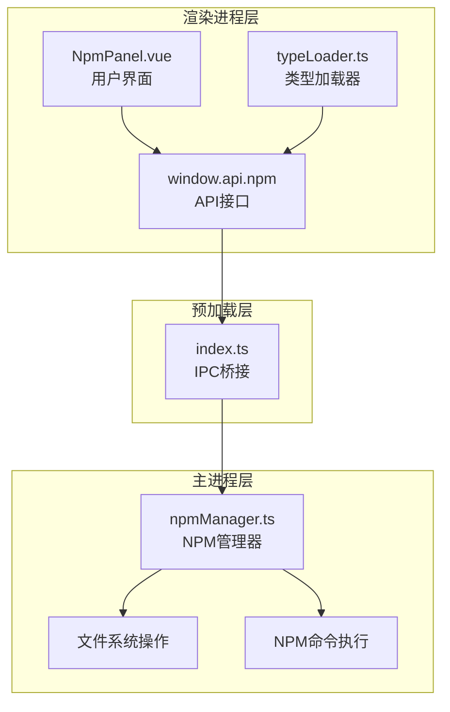
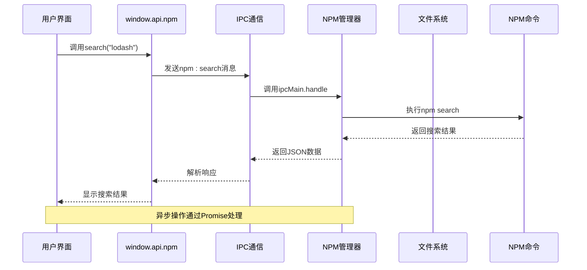
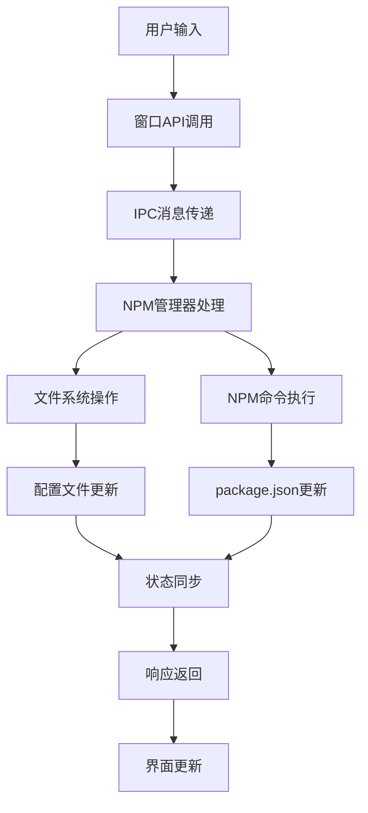
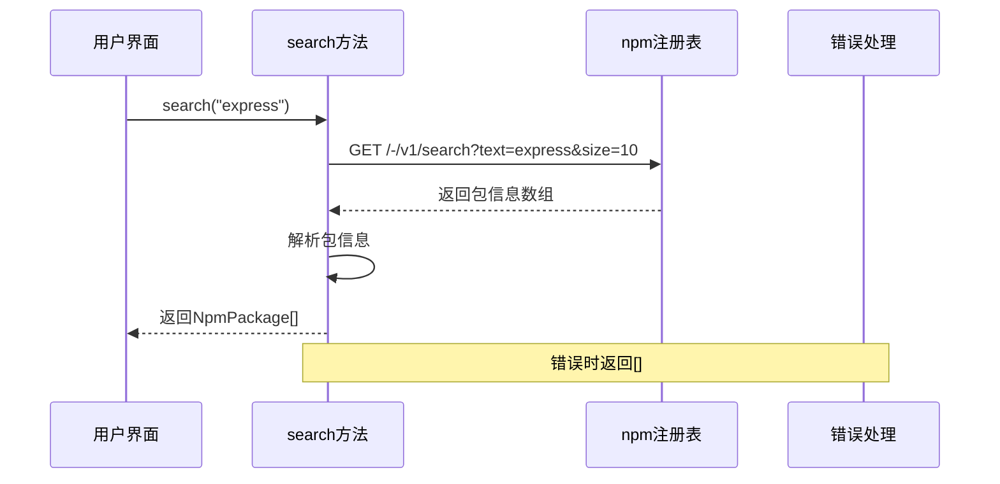
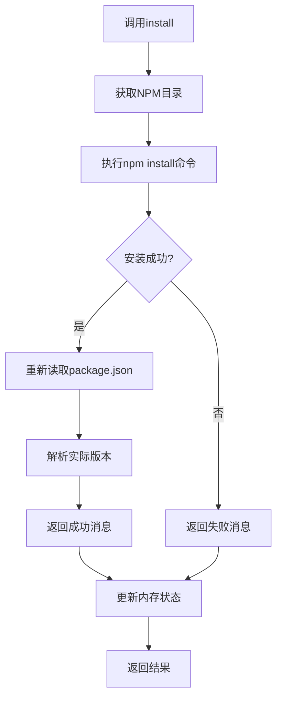
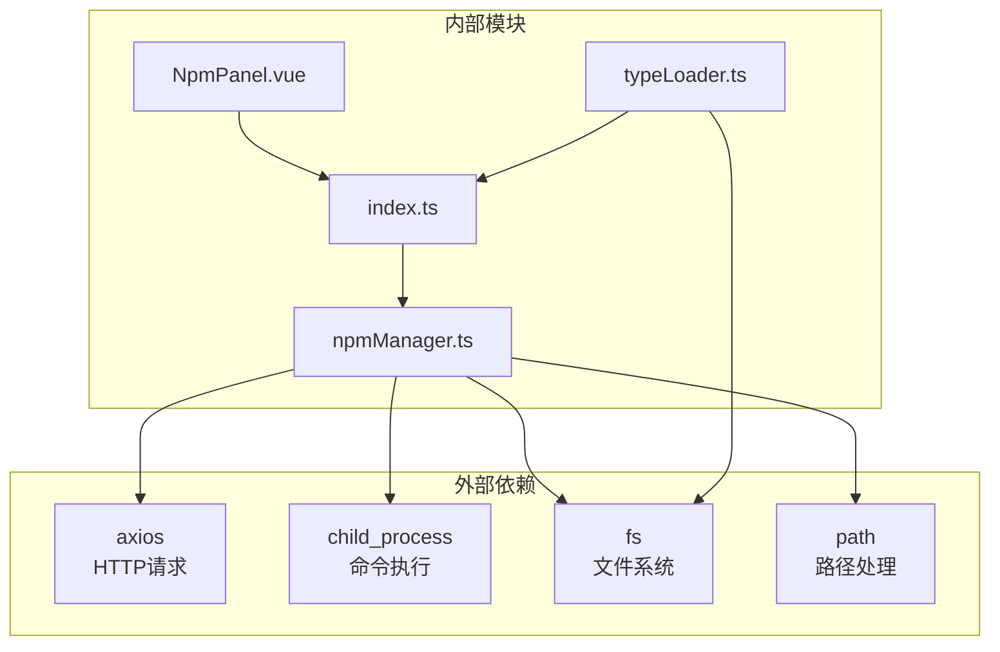

# NPM管理API

<cite>
**本文档引用的文件**
- [npmManager.ts](file://src/main/services/npmManager.ts)
- [NpmPanel.vue](file://src/renderer/src/views/runjs/components/NpmPanel.vue)
- [index.ts](file://src/preload/index.ts)
- [typeLoader.ts](file://src/renderer/src/utils/typeLoader.ts)
- [types.d.ts](file://src/renderer/src/types.d.ts)
- [index.d.ts](file://src/preload/index.d.ts)
</cite>

## 目录
1. [简介](#简介)
2. [项目结构](#项目结构)
3. [核心组件](#核心组件)
4. [架构概览](#架构概览)
5. [详细组件分析](#详细组件分析)
6. [依赖关系分析](#依赖关系分析)
7. [性能考虑](#性能考虑)
8. [故障排除指南](#故障排除指南)
9. [最佳实践](#最佳实践)
10. [结论](#结论)

## 简介

NPM管理API是开发者工具箱中的核心功能模块，提供了完整的包管理能力。该系统允许用户在Electron应用中进行NPM包的搜索、安装、卸载、版本管理和类型定义加载等功能。通过IPC通信机制，前端界面可以与主进程的NPM管理器进行交互，实现无缝的包管理体验。

该API设计遵循现代JavaScript生态系统标准，支持多种包类型（包括scoped packages），提供智能的类型定义加载机制，并具备完善的错误处理和状态管理功能。

## 项目结构

NPM管理功能分布在三个主要层次中：



**图表来源**
- [NpmPanel.vue:1-431](file://src/renderer/src/views/runjs/components/NpmPanel.vue#L1-L431)
- [index.ts:71-85](file://src/preload/index.ts#L71-L85)
- [npmManager.ts:207-552](file://src/main/services/npmManager.ts#L207-L552)

**章节来源**
- [npmManager.ts:1-635](file://src/main/services/npmManager.ts#L1-L635)
- [NpmPanel.vue:1-431](file://src/renderer/src/views/runjs/components/NpmPanel.vue#L1-L431)
- [index.ts:1-229](file://src/preload/index.ts#L1-L229)

## 核心组件

### 主进程NPM管理器

主进程中的`npmManager.ts`文件实现了完整的NPM管理功能，包括：

- **包搜索**：通过npm镜像注册表进行实时搜索
- **包安装/卸载**：真实的NPM命令执行
- **版本管理**：获取版本列表和切换版本
- **目录管理**：自定义安装目录和配置持久化
- **类型定义**：智能类型文件解析和加载

### 渲染进程API接口

预加载脚本暴露了统一的`window.api.npm`接口，包含以下方法：

- `search(query: string)`: 搜索NPM包
- `install(packageName: string)`: 安装包
- `uninstall(packageName: string)`: 卸载包
- `list()`: 获取已安装包列表
- `versions(packageName: string)`: 获取版本列表
- `changeVersion(packageName: string, version: string)`: 切换版本
- `getDir()`: 获取当前安装目录
- `setDir()`: 设置自定义安装目录
- `resetDir()`: 重置为默认目录
- `getTypes(packageName: string)`: 获取类型定义
- `clearTypeCache(packageName: string)`: 清理类型缓存

### 类型定义加载器

`typeLoader.ts`提供了智能的类型定义加载机制，支持：

- 本地node_modules类型文件的优先加载
- 缓存机制避免重复加载
- 并发加载优化
- 状态通知系统

**章节来源**
- [npmManager.ts:7-21](file://src/main/services/npmManager.ts#L7-L21)
- [index.ts:71-85](file://src/preload/index.ts#L71-L85)
- [typeLoader.ts:1-206](file://src/renderer/src/utils/typeLoader.ts#L1-L206)

## 架构概览

NPM管理API采用分层架构设计，确保了良好的职责分离和可维护性：



**图表来源**
- [NpmPanel.vue:70-78](file://src/renderer/src/views/runjs/components/NpmPanel.vue#L70-L78)
- [index.ts:73](file://src/preload/index.ts#L73)
- [npmManager.ts:212-230](file://src/main/services/npmManager.ts#L212-L230)

### 数据流架构



**图表来源**
- [npmManager.ts:82-115](file://src/main/services/npmManager.ts#L82-L115)
- [NpmPanel.vue:50-57](file://src/renderer/src/views/runjs/components/NpmPanel.vue#L50-L57)

## 详细组件分析

### 包搜索功能

#### 方法定义
- **方法名**: `search(query: string)`
- **返回值**: `Promise<NpmPackage[]>`
- **参数类型**: `string`
- **异步处理**: 是

#### 功能特性
- 支持模糊搜索和精确匹配
- 限制搜索结果数量（默认10个）
- 使用npm镜像注册表提高访问速度
- 超时控制（10秒）

#### 错误处理
- 空查询返回空数组
- 网络错误记录日志并返回空数组
- 解析失败的安全处理



**图表来源**
- [npmManager.ts:212-230](file://src/main/services/npmManager.ts#L212-L230)
- [NpmPanel.vue:60-78](file://src/renderer/src/views/runjs/components/NpmPanel.vue#L60-L78)

**章节来源**
- [npmManager.ts:212-230](file://src/main/services/npmManager.ts#L212-L230)
- [NpmPanel.vue:60-78](file://src/renderer/src/views/runjs/components/NpmPanel.vue#L60-L78)

### 包安装功能

#### 方法定义
- **方法名**: `install(packageName: string)`
- **返回值**: `Promise<{ success: boolean; message: string }>`
- **参数类型**: `string`
- **异步处理**: 是

#### 功能特性
- 真实的NPM安装过程
- 自动更新package.json
- 版本解析和显示
- 超时控制（60秒）

#### 处理流程


**图表来源**
- [npmManager.ts:233-267](file://src/main/services/npmManager.ts#L233-L267)
- [NpmPanel.vue:80-98](file://src/renderer/src/views/runjs/components/NpmPanel.vue#L80-L98)

**章节来源**
- [npmManager.ts:233-267](file://src/main/services/npmManager.ts#L233-L267)
- [NpmPanel.vue:80-98](file://src/renderer/src/views/runjs/components/NpmPanel.vue#L80-L98)

### 包卸载功能

#### 方法定义
- **方法名**: `uninstall(packageName: string)`
- **返回值**: `Promise<{ success: boolean; message: string }>`
- **参数类型**: `string`
- **异步处理**: 是

#### 功能特性
- 检查包是否已安装
- 真实卸载过程
- 更新内存状态
- package.json同步

#### 错误状态码
- 成功: `{ success: true, message: "成功卸载 包名" }`
- 未安装: `{ success: false, message: "包 包名 未安装" }`
- 失败: `{ success: false, message: "卸载失败: 错误信息" }`

**章节来源**
- [npmManager.ts:269-304](file://src/main/services/npmManager.ts#L269-L304)
- [NpmPanel.vue:100-110](file://src/renderer/src/views/runjs/components/NpmPanel.vue#L100-L110)

### 已安装包列表

#### 方法定义
- **方法名**: `list()`
- **返回值**: `Promise<InstalledPackage[]>`
- **参数类型**: 无
- **异步处理**: 是

#### 数据结构
```typescript
interface InstalledPackage {
  name: string;
  version: string;
  installed: boolean;
}
```

#### 功能特性
- 实时刷新安装状态
- 版本格式化处理（去除^和~前缀）
- 内存状态同步

**章节来源**
- [npmManager.ts:306-316](file://src/main/services/npmManager.ts#L306-L316)
- [NpmPanel.vue:50-57](file://src/renderer/src/views/runjs/components/NpmPanel.vue#L50-L57)

### 版本列表获取

#### 方法定义
- **方法名**: `versions(packageName: string)`
- **返回值**: `Promise<string[]>`
- **参数类型**: `string`
- **异步处理**: 是

#### 功能特性
- 获取包的所有可用版本
- 版本排序（最新版本在前）
- 超时控制（15秒）
- 错误安全处理

#### 返回格式
- 数字版本号数组（如：["1.2.3", "1.2.2", "1.2.1"]）
- 空数组表示获取失败

**章节来源**
- [npmManager.ts:363-377](file://src/main/services/npmManager.ts#L363-L377)
- [NpmPanel.vue:117-137](file://src/renderer/src/views/runjs/components/NpmPanel.vue#L117-L137)

### 版本切换功能

#### 方法定义
- **方法名**: `changeVersion(packageName: string, version: string)`
- **返回值**: `Promise<{ success: boolean; message: string }>`
- **参数类型**: `string, string`
- **异步处理**: 是

#### 处理机制
- 直接安装指定版本（npm自动替换）
- 实时更新内存状态
- 自动版本解析

#### 错误处理
- 未安装包检查
- 安装失败处理
- 版本不存在处理

**章节来源**
- [npmManager.ts:379-426](file://src/main/services/npmManager.ts#L379-L426)
- [NpmPanel.vue:139-156](file://src/renderer/src/views/runjs/components/NpmPanel.vue#L139-L156)

### 目录管理功能

#### 目录获取
- **方法名**: `getDir()`
- **返回值**: `Promise<string>`
- **用途**: 获取当前NPM包安装目录

#### 目录设置
- **方法名**: `setDir()`
- **返回值**: `Promise<{ success: boolean; path?: string }>`
- **功能**: 选择自定义安装目录
- **验证**: 写入权限检查

#### 目录重置
- **方法名**: `resetDir()`
- **返回值**: `Promise<{ success: boolean; path: string }>`
- **功能**: 重置为默认目录

#### 默认行为
- 默认目录：`userData/npm_packages`
- 自动创建缺失目录
- 初始化package.json

**章节来源**
- [npmManager.ts:318-361](file://src/main/services/npmManager.ts#L318-L361)
- [NpmPanel.vue:173-210](file://src/renderer/src/views/runjs/components/NpmPanel.vue#L173-L210)

### 类型定义获取

#### 方法定义
- **方法名**: `getTypes(packageName: string)`
- **返回值**: `Promise<{ success: boolean; content?: string; files?: Record<string, string>; entry?: string; version?: string }>`
- **参数类型**: `string`
- **异步处理**: 是

#### 类型解析策略
1. **优先级1**: 本地node_modules中的类型文件
2. **优先级2**: @types包（自动安装）
3. **优先级3**: 常见路径搜索

#### 类型文件收集
- 递归解析依赖文件
- 支持相对路径导入
- 防止循环引用
- 统一文件路径格式

**章节来源**
- [npmManager.ts:428-552](file://src/main/services/npmManager.ts#L428-L552)
- [typeLoader.ts:68-103](file://src/renderer/src/utils/typeLoader.ts#L68-L103)

### 缓存清理功能

#### 方法定义
- **方法名**: `clearTypeCache(packageName: string)`
- **返回值**: `Promise<void>`
- **参数类型**: `string`
- **异步处理**: 否

#### 功能说明
- 清理类型定义缓存
- 支持强制重新加载
- 通知渲染进程更新

**章节来源**
- [npmManager.ts:546-552](file://src/main/services/npmManager.ts#L546-L552)
- [typeLoader.ts:114-117](file://src/renderer/src/utils/typeLoader.ts#L114-L117)

## 依赖关系分析

### 组件依赖图



**图表来源**
- [npmManager.ts:1-6](file://src/main/services/npmManager.ts#L1-L6)
- [index.ts:1-2](file://src/preload/index.ts#L1-L2)
- [typeLoader.ts:1-6](file://src/renderer/src/utils/typeLoader.ts#L1-L6)

### IPC通信协议

| 方法名 | 请求参数 | 返回值 | 用途 |
|--------|----------|--------|------|
| `npm:search` | `string` | `NpmPackage[]` | 搜索包 |
| `npm:install` | `string` | `{ success: boolean; message: string }` | 安装包 |
| `npm:uninstall` | `string` | `{ success: boolean; message: string }` | 卸载包 |
| `npm:list` | 无 | `InstalledPackage[]` | 获取列表 |
| `npm:versions` | `string` | `string[]` | 获取版本 |
| `npm:changeVersion` | `string, string` | `{ success: boolean; message: string }` | 切换版本 |
| `npm:getDir` | 无 | `string` | 获取目录 |
| `npm:setDir` | 无 | `{ success: boolean; path?: string }` | 设置目录 |
| `npm:resetDir` | 无 | `{ success: boolean; path: string }` | 重置目录 |
| `npm:getTypes` | `string` | `{ success: boolean; files?: Record<string, string>; entry?: string; version?: string }` | 获取类型 |
| `npm:clearTypeCache` | `string` | `void` | 清理缓存 |

**章节来源**
- [index.ts:71-85](file://src/preload/index.ts#L71-L85)
- [npmManager.ts:207-552](file://src/main/services/npmManager.ts#L207-L552)

## 性能考虑

### 并发控制
- 类型定义加载采用批量处理（每批3个）
- 避免同时执行大量NPM命令
- 内存状态缓存减少重复计算

### 超时机制
- 搜索超时：10秒
- 版本获取超时：15秒
- 安装超时：60秒
- 自动终止长时间运行的进程

### 缓存策略
- 已安装包列表缓存
- 类型定义文件缓存
- 配置文件持久化
- 避免重复网络请求

### 内存管理
- 及时清理临时文件
- 控制文件内容大小
- 监控内存使用情况

## 故障排除指南

### 常见问题及解决方案

#### 1. 安装超时
**症状**: 安装操作长时间无响应
**原因**: 网络连接问题或NPM注册表访问缓慢
**解决方案**: 
- 检查网络连接
- 稍后重试
- 考虑使用代理

#### 2. 权限不足
**症状**: 目录设置失败
**原因**: 选择的目录没有写入权限
**解决方案**:
- 选择有写权限的目录
- 使用管理员权限运行
- 检查文件系统权限

#### 3. 类型定义加载失败
**症状**: 代码提示不完整
**原因**: 类型文件缺失或损坏
**解决方案**:
- 重新安装包
- 清理类型缓存
- 检查@types包安装

#### 4. 版本切换失败
**症状**: 版本无法切换
**原因**: 目标版本不存在或网络问题
**解决方案**:
- 验证版本号正确性
- 检查网络连接
- 使用versions()方法确认版本存在

### 错误诊断步骤

1. **检查网络连接**: 确保能够访问npm注册表
2. **验证目录权限**: 确认安装目录可写
3. **查看日志输出**: 检查控制台错误信息
4. **测试基本功能**: 验证search和list功能
5. **清理缓存**: 执行clearTypeCache()重置

**章节来源**
- [npmManager.ts:188-193](file://src/main/services/npmManager.ts#L188-L193)
- [typeLoader.ts:114-117](file://src/renderer/src/utils/typeLoader.ts#L114-L117)

## 最佳实践

### 包管理最佳实践

#### 1. 版本管理
- 使用语义化版本控制
- 定期更新依赖包
- 避免锁定在过时版本
- 使用^和~前缀管理兼容性

#### 2. 目录管理
- 选择合适的安装目录
- 定期清理不需要的包
- 监控磁盘空间使用
- 备份重要配置

#### 3. 类型定义
- 优先使用官方@types包
- 避免手动修改类型文件
- 定期更新类型定义
- 检查类型兼容性

#### 4. 性能优化
- 合理使用缓存机制
- 避免频繁的网络请求
- 批量处理相似操作
- 监控资源使用情况

### 安全建议

#### 1. 包来源验证
- 仅从可信源安装包
- 检查包的下载量和评价
- 避免安装未知来源的包
- 定期扫描安全漏洞

#### 2. 权限控制
- 使用最小权限原则
- 定期审查目录权限
- 避免在系统关键目录安装
- 监控文件变更

#### 3. 数据保护
- 备份重要配置
- 定期清理临时文件
- 监控敏感信息泄露
- 使用加密存储

## 结论

NPM管理API为开发者工具箱提供了完整的包管理解决方案。通过精心设计的架构和丰富的功能集，该系统能够满足各种包管理需求，包括搜索、安装、卸载、版本管理和类型定义加载等核心功能。

系统的主要优势包括：
- **完整的功能覆盖**: 从基础搜索到高级版本管理
- **良好的用户体验**: 直观的界面和流畅的操作流程
- **强大的扩展性**: 模块化设计便于功能扩展
- **可靠的稳定性**: 完善的错误处理和状态管理
- **高效的性能**: 智能缓存和并发控制机制

通过遵循最佳实践和故障排除指南，用户可以充分利用该API的强大功能，提升开发效率和代码质量。随着项目的持续发展，该API将继续演进，为开发者提供更好的包管理体验。