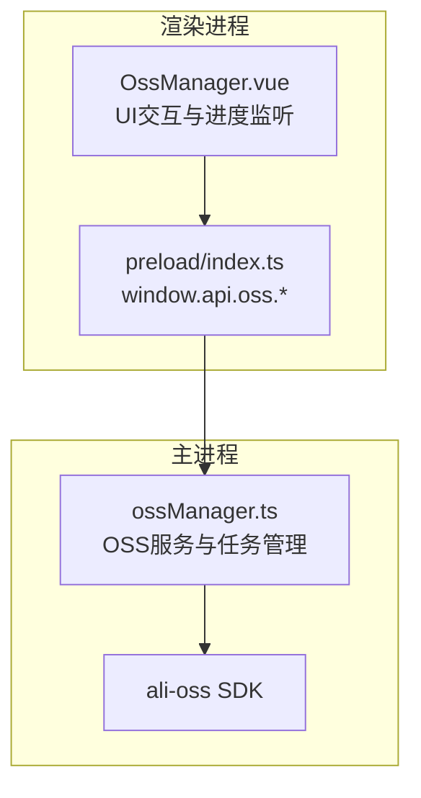
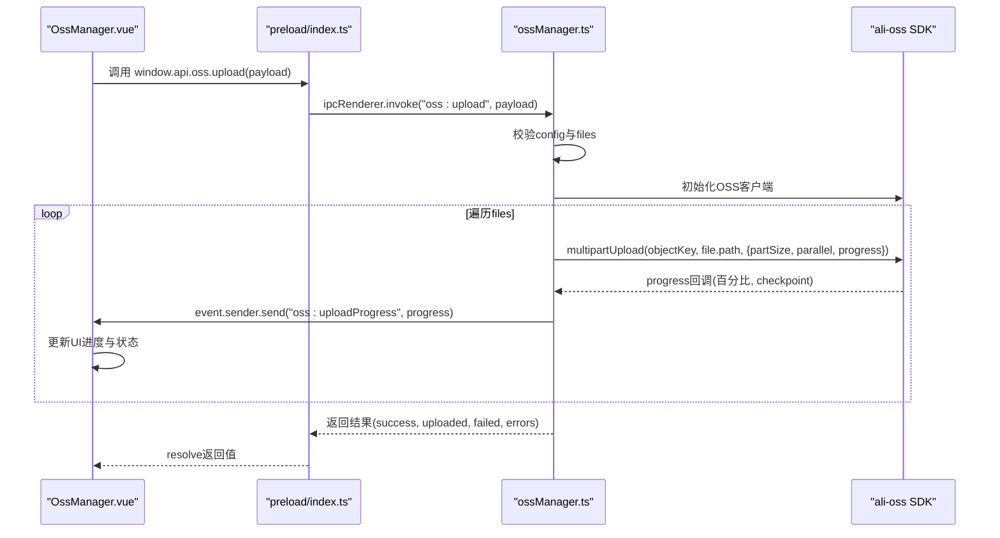
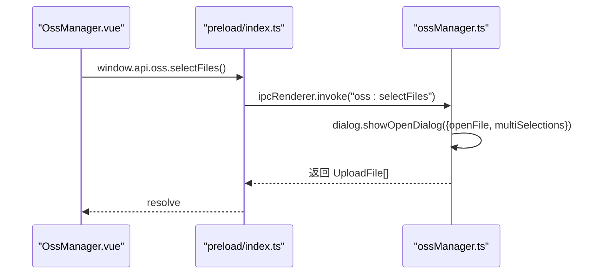
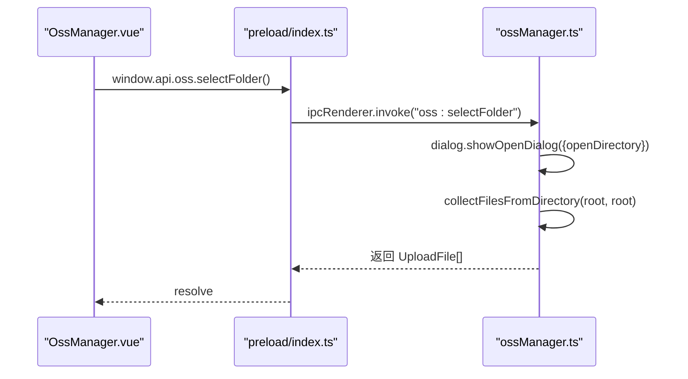
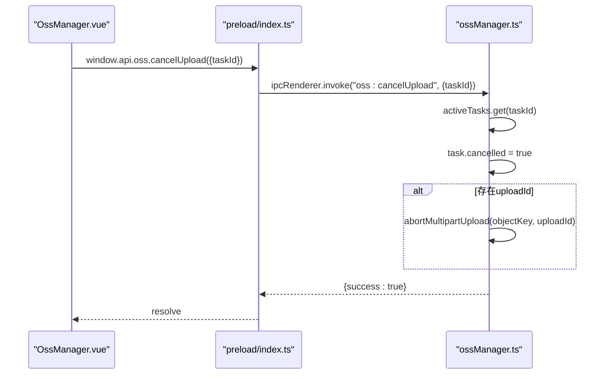
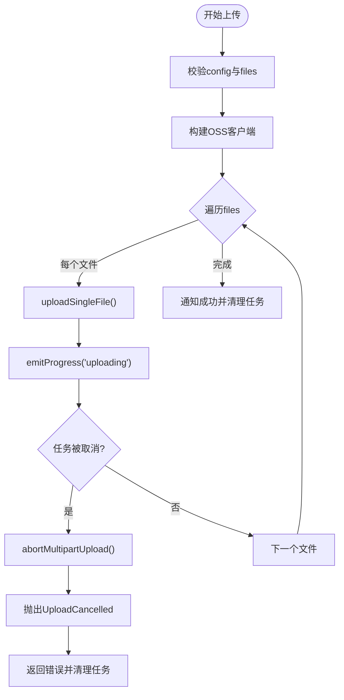
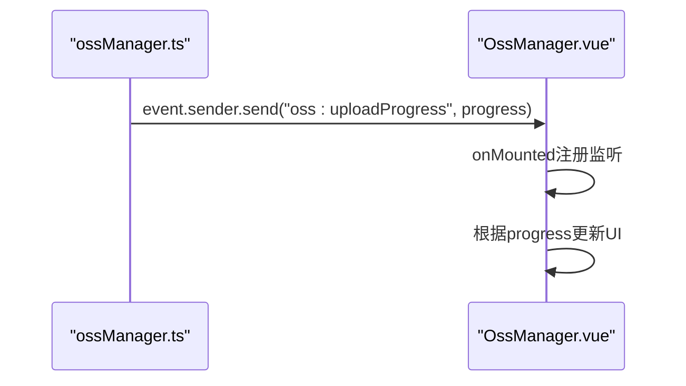
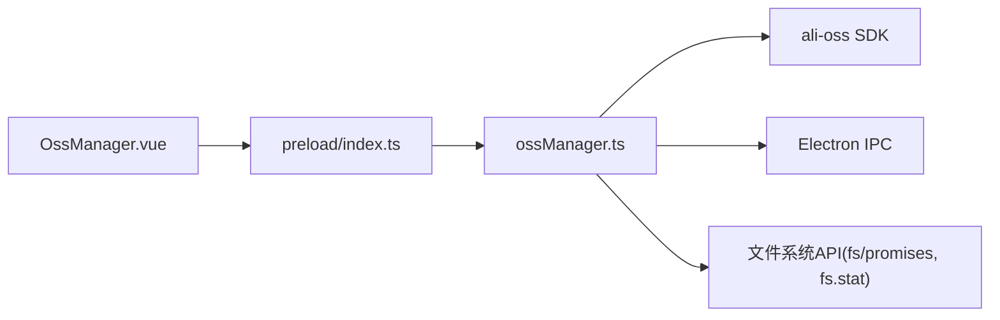

# OSS管理API

<cite>
**本文档引用的文件**
- [ossManager.ts](file://src/main/services/ossManager.ts)
- [OssManager.vue](file://src/renderer/src/views/oss/OssManager.vue)
- [index.ts](file://src/preload/index.ts)
- [index.ts](file://src/main/index.ts)
- [package.json](file://package.json)
- [README.md](file://README.md)
</cite>

## 目录
1. [简介](#简介)
2. [项目结构](#项目结构)
3. [核心组件](#核心组件)
4. [架构总览](#架构总览)
5. [详细组件分析](#详细组件分析)
6. [依赖关系分析](#依赖关系分析)
7. [性能考虑](#性能考虑)
8. [故障排除指南](#故障排除指南)
9. [结论](#结论)

## 简介
本文件为OSS管理API的详细接口文档，聚焦于阿里云OSS文件管理功能，覆盖以下核心操作：
- 文件选择：selectFiles()
- 文件夹选择：selectFolder()
- 取消上传：cancelUpload()
- 文件上传：upload()

文档还详细说明了上传任务(taskId)管理、配置对象(config)结构、文件数组(files)格式、进度事件监听(onUploadProgress)机制，并提供完整的错误处理、断点续传、并发控制和进度跟踪的实现指南，以及安全认证和性能优化的最佳实践。

## 项目结构
OSS管理功能由三部分协作构成：
- 主进程服务：负责OSS客户端初始化、文件收集、分片上传、任务管理与进度事件派发
- 预加载桥接层：在渲染进程中暴露安全的IPC API，供前端调用
- 渲染视图：提供UI交互、文件拖拽/选择、进度展示与任务控制

**图表来源**
- [OssManager.vue:1-913](file://src/renderer/src/views/oss/OssManager.vue#L1-L913)
- [index.ts:117-154](file://src/preload/index.ts#L117-L154)
- [ossManager.ts:107-127](file://src/main/services/ossManager.ts#L107-L127)

**章节来源**
- [README.md:48-53](file://README.md#L48-L53)
- [package.json:32-32](file://package.json#L32-L32)

## 核心组件
- 配置对象(OssConfig)
  - 字段：accessKeyId, accessKeySecret, endpoint, bucket, targetPath?, acl?
  - 用途：建立OSS客户端与上传策略
- 上传文件对象(UploadFile)
  - 字段：path, name?, relativePath?, size?
  - 用途：描述待上传文件的元数据
- 上传负载(UploadPayload)
  - 字段：taskId, config: OssConfig, files: UploadFile[]
  - 用途：封装一次上传任务的输入
- 进度对象(UploadProgress)
  - 字段：taskId, fileIndex, fileName, relativePath, fileLoaded, fileTotal, filePercent, overallLoaded, overallTotal, overallPercent, status, message?
  - 用途：实时上报单文件与整体上传进度

**章节来源**
- [ossManager.ts:14-49](file://src/main/services/ossManager.ts#L14-L49)
- [index.ts:122-132](file://src/preload/index.ts#L122-L132)

## 架构总览
OSS管理采用主进程单线程串行处理上传队列，结合ali-oss SDK的分片上传与并发控制，通过IPC事件流将进度实时推送到渲染进程。

**图表来源**
- [index.ts:122-132](file://src/preload/index.ts#L122-L132)
- [ossManager.ts:334-438](file://src/main/services/ossManager.ts#L334-L438)

## 详细组件分析

### 1) 文件选择：selectFiles()
- 功能：打开系统文件选择对话框，支持多选
- 返回：UploadFile[]（包含path/name/relativePath/size）
- 适用场景：用户手动选择单个或多个文件

**图表来源**
- [index.ts:119-119](file://src/preload/index.ts#L119-L119)
- [ossManager.ts:313-321](file://src/main/services/ossManager.ts#L313-L321)

**章节来源**
- [ossManager.ts:313-321](file://src/main/services/ossManager.ts#L313-L321)
- [index.ts:119-119](file://src/preload/index.ts#L119-L119)

### 2) 文件夹选择：selectFolder()
- 功能：打开系统文件夹选择对话框，递归收集所有文件
- 返回：UploadFile[]（包含相对路径与大小）
- 适用场景：批量上传整个目录树

**图表来源**
- [index.ts:120-120](file://src/preload/index.ts#L120-L120)
- [ossManager.ts:323-332](file://src/main/services/ossManager.ts#L323-L332)

**章节来源**
- [ossManager.ts:136-148](file://src/main/services/ossManager.ts#L136-L148)
- [ossManager.ts:323-332](file://src/main/services/ossManager.ts#L323-L332)

### 3) 取消上传：cancelUpload()
- 功能：标记任务为取消，若当前处于分片上传阶段则中止该分片
- 输入：{ taskId }
- 输出：{ success: boolean, error?: string }
- 注意：仅对当前活跃任务有效；若存在uploadId，会调用abortMultipartUpload

**图表来源**
- [index.ts:121-121](file://src/preload/index.ts#L121-L121)
- [ossManager.ts:297-311](file://src/main/services/ossManager.ts#L297-L311)

**章节来源**
- [ossManager.ts:64-74](file://src/main/services/ossManager.ts#L64-L74)
- [ossManager.ts:297-311](file://src/main/services/ossManager.ts#L297-L311)

### 4) 文件上传：upload()
- 功能：校验配置与文件列表，初始化OSS客户端，逐个文件进行分片上传，实时推送进度
- 输入：UploadPayload
  - taskId: string
  - config: OssConfig
  - files: UploadFile[]
- 输出：上传结果对象（success, uploaded, failed, errors）
- 并发与分片：默认分片大小5MB，并发数4
- ACL：默认public-read，可通过config.acl覆盖

**图表来源**
- [ossManager.ts:334-438](file://src/main/services/ossManager.ts#L334-L438)
- [ossManager.ts:191-294](file://src/main/services/ossManager.ts#L191-L294)

**章节来源**
- [ossManager.ts:107-127](file://src/main/services/ossManager.ts#L107-L127)
- [ossManager.ts:191-294](file://src/main/services/ossManager.ts#L191-L294)
- [ossManager.ts:334-438](file://src/main/services/ossManager.ts#L334-L438)

### 5) 进度事件监听：onUploadProgress
- 渲染进程订阅：window.api.oss.onUploadProgress(cb)
- 事件内容：UploadProgress
- UI联动：根据taskId过滤，更新当前文件进度、整体进度与状态

**图表来源**
- [ossManager.ts:383-385](file://src/main/services/ossManager.ts#L383-L385)
- [OssManager.vue:309-329](file://src/renderer/src/views/oss/OssManager.vue#L309-L329)

**章节来源**
- [index.ts:133-153](file://src/preload/index.ts#L133-L153)
- [OssManager.vue:309-329](file://src/renderer/src/views/oss/OssManager.vue#L309-L329)

## 依赖关系分析

**图表来源**
- [index.ts:1-229](file://src/preload/index.ts#L1-L229)
- [ossManager.ts:5-10](file://src/main/services/ossManager.ts#L5-L10)
- [package.json:32-32](file://package.json#L32-L32)

**章节来源**
- [package.json:28-50](file://package.json#L28-L50)
- [ossManager.ts:5-10](file://src/main/services/ossManager.ts#L5-L10)

## 性能考虑
- 分片大小与并发
  - 默认分片大小：5MB
  - 默认并发：4
  - 建议：根据网络带宽与CPU资源调整，过大可能导致内存压力，过小影响吞吐
- 进度节流
  - 上传中每约80ms最多触发一次进度事件，避免UI过度刷新
- 任务管理
  - 使用Map维护activeTasks，确保任务隔离与取消控制
- 网络与证书
  - endpoint解析自动识别HTTP/HTTPS与region，必要时启用cname适配非阿里云域名

**章节来源**
- [ossManager.ts:269-270](file://src/main/services/ossManager.ts#L269-L270)
- [ossManager.ts:231-231](file://src/main/services/ossManager.ts#L231-L231)
- [ossManager.ts:81-105](file://src/main/services/ossManager.ts#L81-L105)

## 故障排除指南
- 常见错误类型
  - UploadFailure：上传过程中发生的错误，携带已上传字节与总字节
  - UploadCancelled：任务被取消，可能伴随abortMultipartUpload
- 错误提取
  - 提取策略：优先使用错误对象的code与message，其次字符串或对象message
- 取消流程
  - 若存在uploadId，调用abortMultipartUpload中止分片上传
- UI反馈
  - 渲染进程收到error状态时，将对应文件标记为error并显示message
- 配置校验
  - 缺少config或字段为空时，直接返回错误并通知

**章节来源**
- [ossManager.ts:51-62](file://src/main/services/ossManager.ts#L51-L62)
- [ossManager.ts:178-189](file://src/main/services/ossManager.ts#L178-L189)
- [ossManager.ts:297-311](file://src/main/services/ossManager.ts#L297-L311)
- [ossManager.ts:387-421](file://src/main/services/ossManager.ts#L387-L421)
- [OssManager.vue:319-328](file://src/renderer/src/views/oss/OssManager.vue#L319-L328)

## 结论
OSS管理API通过清晰的职责分离与稳健的错误处理，提供了可靠的文件上传体验。其核心特性包括：
- 任务隔离与取消控制
- 断点续传与分片并发
- 实时进度事件与UI联动
- 安全的配置管理与错误提取

建议在生产环境中结合网络状况与业务需求，动态调整分片大小与并发数，并在前端持久化配置以提升用户体验。