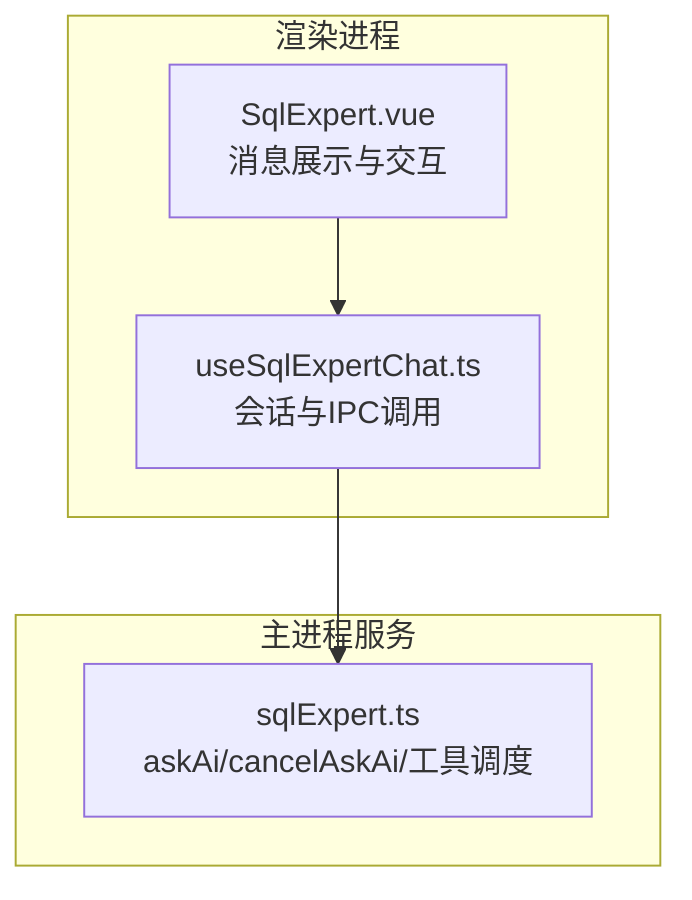
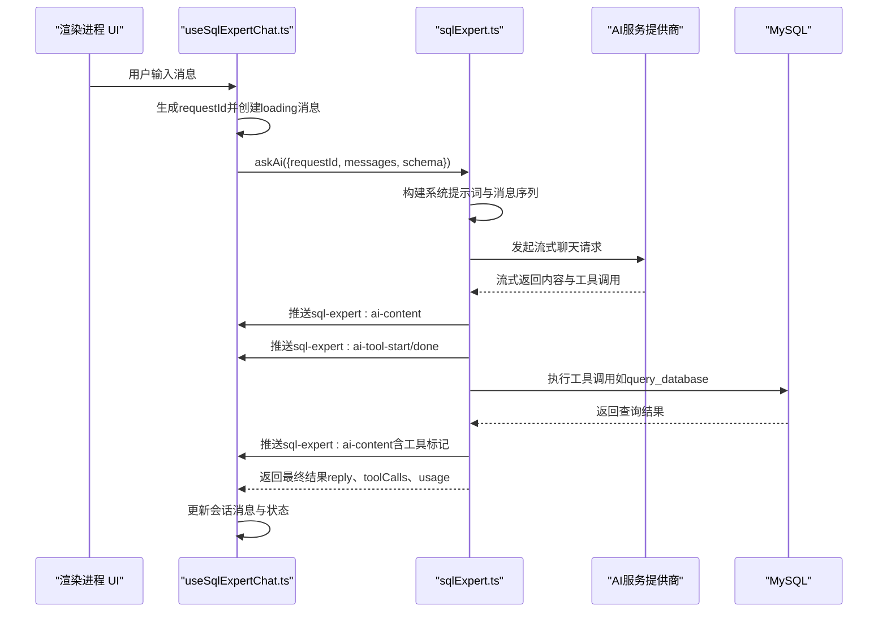
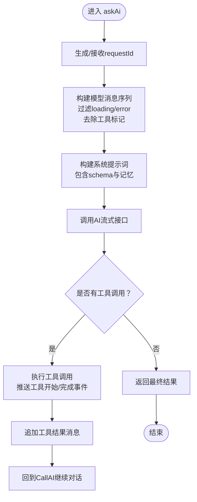
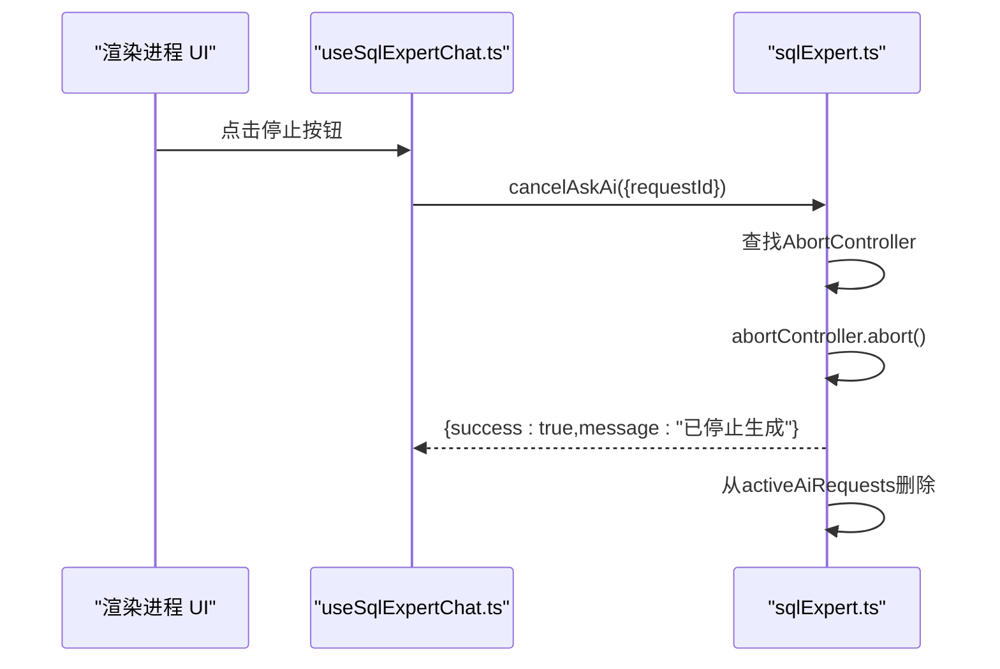
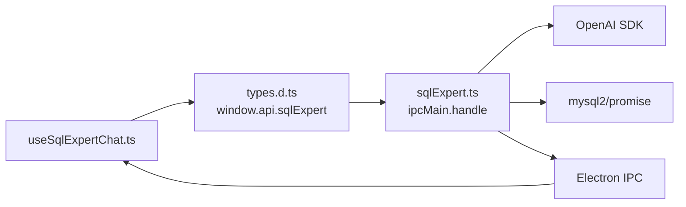

# AI查询交互

<cite>
**本文档引用的文件**
- [sqlExpert.ts](file://src/main/services/sqlExpert.ts)
- [useSqlExpertChat.ts](file://src/renderer/src/views/sqlexpert/useSqlExpertChat.ts)
- [types.d.ts](file://src/renderer/src/types.d.ts)
- [SqlExpert.vue](file://src/renderer/src/views/sqlexpert/SqlExpert.vue)
</cite>

## 目录
1. [简介](#简介)
2. [项目结构](#项目结构)
3. [核心组件](#核心组件)
4. [架构总览](#架构总览)
5. [详细组件分析](#详细组件分析)
6. [依赖关系分析](#依赖关系分析)
7. [性能考量](#性能考量)
8. [故障排查指南](#故障排查指南)
9. [结论](#结论)

## 简介
本文件面向“AI查询交互”能力，围绕 askAi() 方法的请求参数、消息格式、工具调用参数结构、取消查询机制与 requestId 管理策略进行系统化说明，并提供完整的对话流程示例、错误处理与性能优化建议，以及与 AI 服务提供商的集成方式与 API 限制处理策略。

## 项目结构
AI 查询交互由主进程服务与渲染进程 UI 两部分协作完成：
- 主进程服务负责：AI 请求转发、工具调度、数据库访问、流式回调、取消控制、配置持久化与内存管理。
- 渲染进程负责：会话管理、消息构建、流式事件监听、UI 展示与交互、取消请求。

**图表来源**
- [SqlExpert.vue:66-92](file://src/renderer/src/views/sqlexpert/SqlExpert.vue#L66-L92)
- [useSqlExpertChat.ts:282-420](file://src/renderer/src/views/sqlexpert/useSqlExpertChat.ts#L282-L420)
- [sqlExpert.ts:1280-1501](file://src/main/services/sqlExpert.ts#L1280-L1501)

**章节来源**
- [sqlExpert.ts:1-120](file://src/main/services/sqlExpert.ts#L1-L120)
- [useSqlExpertChat.ts:165-507](file://src/renderer/src/views/sqlexpert/useSqlExpertChat.ts#L165-L507)
- [types.d.ts:172-274](file://src/renderer/src/types.d.ts#L172-L274)

## 核心组件
- askAi() 请求参数
  - requestId: 可选字符串，用于标识一次对话请求；若未提供，主进程将生成随机 UUID。
  - messages: 数组，元素包含 role、content、status、toolCalls 等字段。
  - schema: 字符串，数据库表结构描述，用于系统提示词构建。
  - tools/toolChoice: 可选，用于向模型声明可用工具及选择策略。
- 消息格式要求
  - role 必须为 "user" 或 "assistant"。
  - content 为字符串，支持工具标记占位符。
  - toolCalls 为工具调用记录数组，包含 id、name、args、status、errorMessage、result 等。
- 工具调用参数结构
  - query_database: 参数包含 sql 与 reason，其中 sql 必须为只读查询并为输出列使用 AS 指定表头。
  - describe_table_schema: 参数可为单表名或表名数组，reason 说明查询原因。
  - render_chart: 参数包含 type、title、series、reason；type 支持 line、bar、pie、line_bar；折线/柱状/组合图需提供 xAxisData。
  - export_data: 参数包含 sql 与可选 reason、fileName；导出为 CSV 文件。
  - save_memory: 参数包含 content 与可选 reason；将经验保存至本地记忆。
- 取消查询 cancelAskAi()
  - 通过 requestId 定位并触发 AbortController.abort()，立即中断流式响应与后续处理。
  - 返回 success 与 message，表示是否成功取消。
- requestId 管理策略
  - 渲染进程每次发起对话生成新的 requestId 并存储于 currentRequestId。
  - 主进程维护 activeAiRequests 映射表，键为 requestId，值为对应的 AbortController。
  - 取消时从映射表移除；异常或完成时在 finally 中清理。

**章节来源**
- [sqlExpert.ts:42-70](file://src/main/services/sqlExpert.ts#L42-L70)
- [sqlExpert.ts:1280-1501](file://src/main/services/sqlExpert.ts#L1280-L1501)
- [useSqlExpertChat.ts:282-429](file://src/renderer/src/views/sqlexpert/useSqlExpertChat.ts#L282-L429)
- [types.d.ts:177-198](file://src/renderer/src/types.d.ts#L177-L198)

## 架构总览
AI 查询交互采用“主进程服务 + 渲染进程 UI”的双层架构，通过 Electron IPC 进行通信，支持流式内容推送与工具调用。

**图表来源**
- [useSqlExpertChat.ts:282-420](file://src/renderer/src/views/sqlexpert/useSqlExpertChat.ts#L282-L420)
- [sqlExpert.ts:1280-1501](file://src/main/services/sqlExpert.ts#L1280-L1501)

## 详细组件分析

### askAi() 方法与消息格式
- 请求参数
  - requestId: 可选；若缺失，主进程生成 UUID。
  - messages: 包含 role、content、status、toolCalls。
  - schema: 数据库表结构字符串。
- 消息格式要点
  - role 限定为 "user" 或 "assistant"。
  - content 支持工具标记占位符，主进程会去除这些标记后再发送给模型。
  - toolCalls 记录工具调用的 id、name、args、status、errorMessage、result。
- 上下文保持
  - 主进程将 messages 转换为模型消息数组，过滤 loading/error 状态的消息，保留有效历史。
  - 同时注入系统提示词（包含 schema 与记忆），确保上下文一致。

**图表来源**
- [sqlExpert.ts:1280-1501](file://src/main/services/sqlExpert.ts#L1280-L1501)
- [sqlExpert.ts:598-651](file://src/main/services/sqlExpert.ts#L598-L651)

**章节来源**
- [sqlExpert.ts:42-70](file://src/main/services/sqlExpert.ts#L42-L70)
- [sqlExpert.ts:598-651](file://src/main/services/sqlExpert.ts#L598-L651)
- [useSqlExpertChat.ts:341-366](file://src/renderer/src/views/sqlexpert/useSqlExpertChat.ts#L341-L366)

### 工具调用参数结构
- query_database
  - 参数: sql（只读查询，必须为 SELECT 或 WITH...SELECT，输出列使用 AS 指定表头）、reason（查询目的）。
  - 结果: ok、reason、truncated、totalRows、returnedRows、rows（最多返回固定行数）。
- describe_table_schema
  - 参数: tableName 或 tableNames（单个或数组），reason。
  - 结果: ok、reason、totalRows、returnedRows、rows（字段清单）。
- render_chart
  - 参数: type（line/bar/pie/line_bar）、title、xAxisData（折线/柱状/组合图必填）、series（系列数据）、reason。
  - 结果: ok、reason、chartConfig（图表配置对象）。
- export_data
  - 参数: sql（只读查询）、reason、fileName（可选）。
  - 结果: ok、reason、fileName、filePath（CSV文件路径）。
- save_memory
  - 参数: content（经验内容）、reason。
  - 结果: ok、reason、memoryId、memoryPath、rows（包含新增记忆条目）。

**章节来源**
- [sqlExpert.ts:473-571](file://src/main/services/sqlExpert.ts#L473-L571)
- [sqlExpert.ts:836-951](file://src/main/services/sqlExpert.ts#L836-L951)

### 取消查询 cancelAskAi() 机制
- 渲染进程通过 window.api.sqlExpert.cancelAskAi({requestId}) 触发取消。
- 主进程根据 requestId 获取对应 AbortController 并调用 abort()。
- 若请求已被取消，主进程返回 status 为 stopped，usage 为零，避免计费。
- 取消后从 activeAiRequests 映射表删除对应项。

**图表来源**
- [useSqlExpertChat.ts:422-429](file://src/renderer/src/views/sqlexpert/useSqlExpertChat.ts#L422-L429)
- [sqlExpert.ts:1268-1278](file://src/main/services/sqlExpert.ts#L1268-L1278)

**章节来源**
- [useSqlExpertChat.ts:422-429](file://src/renderer/src/views/sqlexpert/useSqlExpertChat.ts#L422-L429)
- [sqlExpert.ts:1268-1278](file://src/main/services/sqlExpert.ts#L1268-L1278)

### requestId 管理策略
- 渲染进程
  - 每次发起对话生成新的 requestId 并存入 currentRequestId。
  - 在 runAssistantReply 中注册流式事件监听，仅处理匹配当前 requestId 的事件。
  - finally 中清理监听器并将 currentRequestId 置空。
- 主进程
  - 使用 Map<requestId, AbortController> 管理活跃请求。
  - 取消时删除映射项；异常或完成时在 finally 中清理。

**章节来源**
- [useSqlExpertChat.ts:282-420](file://src/renderer/src/views/sqlexpert/useSqlExpertChat.ts#L282-L420)
- [sqlExpert.ts:92-93](file://src/main/services/sqlExpert.ts#L92-L93)
- [sqlExpert.ts:1280-1501](file://src/main/services/sqlExpert.ts#L1280-L1501)

### 与 AI 服务提供商的集成与限制处理
- 集成方式
  - 主进程通过 OpenAI SDK 创建流式聊天请求，启用 include_usage 以获取用量统计。
  - 支持工具调用（function calling），主进程解析工具调用并执行相应数据库操作。
- API 限制处理
  - 单轮工具调用上限：超过最大轮次（默认 15）后返回提示，建议用户分步提问或缩小范围。
  - 工具结果行数限制：数据库查询默认最多返回固定行数（例如 10 行），并在结果中标记 truncated。
  - SQL 语句校验：仅允许只读查询，禁止 DDL/DML/系统库访问等。
  - 超时控制：数据库查询设置超时时间（例如 60 秒），防止长时间阻塞。
  - 余额检查：提供检查余额接口，便于在调用前预判可用额度。

**章节来源**
- [sqlExpert.ts:676-739](file://src/main/services/sqlExpert.ts#L676-L739)
- [sqlExpert.ts:1308-1478](file://src/main/services/sqlExpert.ts#L1308-L1478)
- [sqlExpert.ts:742-744](file://src/main/services/sqlExpert.ts#L742-L744)
- [sqlExpert.ts:365-400](file://src/main/services/sqlExpert.ts#L365-L400)
- [sqlExpert.ts:1005-1035](file://src/main/services/sqlExpert.ts#L1005-L1035)

## 依赖关系分析
- 渲染进程依赖
  - window.api.sqlExpert 提供 askAi、cancelAskAi、onAiContent/onAiToolStart/onAiToolDone 等接口。
  - useSqlExpertChat.ts 负责会话管理、消息构建、事件监听与 UI 更新。
- 主进程依赖
  - OpenAI SDK 用于流式聊天与工具调用。
  - mysql2/promise 用于数据库连接与查询。
  - Electron ipcMain.handle 注册 IPC 接口。
- 关键依赖链
  - 渲染进程 -> askAi -> 主进程 -> OpenAI -> 工具调度 -> MySQL -> 返回结果 -> 渲染进程 UI 更新。

**图表来源**
- [types.d.ts:172-274](file://src/renderer/src/types.d.ts#L172-L274)
- [sqlExpert.ts:968-1035](file://src/main/services/sqlExpert.ts#L968-L1035)

**章节来源**
- [types.d.ts:172-274](file://src/renderer/src/types.d.ts#L172-L274)
- [sqlExpert.ts:968-1035](file://src/main/services/sqlExpert.ts#L968-L1035)

## 性能考量
- 流式传输
  - 使用流式接口逐步推送内容，避免一次性等待完整响应，提升用户体验。
- 工具调用并发
  - 工具调用按序执行，避免并发竞争；可在工具内部增加缓存与去重策略减少重复查询。
- 结果截断
  - 数据库查询默认截断返回行数，避免大结果集导致 UI 卡顿与网络压力。
- 超时与重试
  - 设置合理的数据库查询超时时间，防止长时间阻塞；对网络异常可考虑指数退避重试。
- 内存与持久化
  - 会话消息持久化时清理大数据字段（如 rows），降低存储与序列化开销。
- 请求去重
  - 对相同内容的重复请求可做去重处理，避免重复计算与资源浪费。

[本节为通用性能建议，无需特定文件来源]

## 故障排查指南
- 常见错误与定位
  - 未配置数据库或 AI 参数：主进程会在 askAi 前检查配置，返回明确错误提示。
  - 未加载表结构：schema 缺失会导致请求失败，需先加载 schema。
  - SQL 不合法：仅允许只读查询，且必须为 SELECT 或 WITH...SELECT，并为输出列使用 AS。
  - 工具调用失败：检查工具参数是否符合定义，如 render_chart 的 series、xAxisData 是否满足要求。
  - 取消无效：确认当前是否存在匹配的 requestId，且请求尚未完成。
- 日志与监控
  - 主进程在 finally 中清理 activeAiRequests，确保不会残留未完成的请求。
  - 使用 usage 字段监控 token 消耗，便于成本控制与优化。
- UI 层面
  - 渲染进程在 finally 中清理 IPC 监听器，避免内存泄漏。
  - 错误消息统一包装为“请求失败: ...”，便于用户理解。

**章节来源**
- [sqlExpert.ts:1288-1294](file://src/main/services/sqlExpert.ts#L1288-L1294)
- [sqlExpert.ts:365-400](file://src/main/services/sqlExpert.ts#L365-L400)
- [sqlExpert.ts:1479-1497](file://src/main/services/sqlExpert.ts#L1479-L1497)
- [useSqlExpertChat.ts:401-420](file://src/renderer/src/views/sqlexpert/useSqlExpertChat.ts#L401-L420)

## 结论
本方案通过清晰的请求参数定义、严格的 SQL 校验与工具调用约束、完善的流式传输与取消机制，实现了稳定高效的 AI 查询交互体验。结合工具调用上限、结果截断与超时控制，能够在保证安全与性能的前提下，满足企业级数据分析场景的需求。建议在实际部署中配合余额检查与用量监控，持续优化工具参数与对话策略。