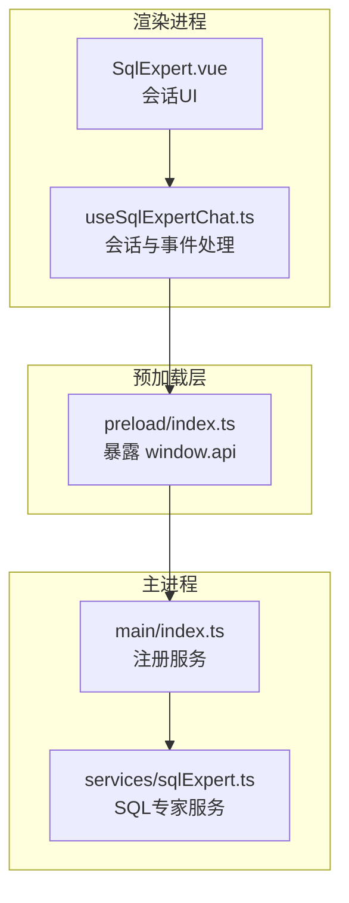
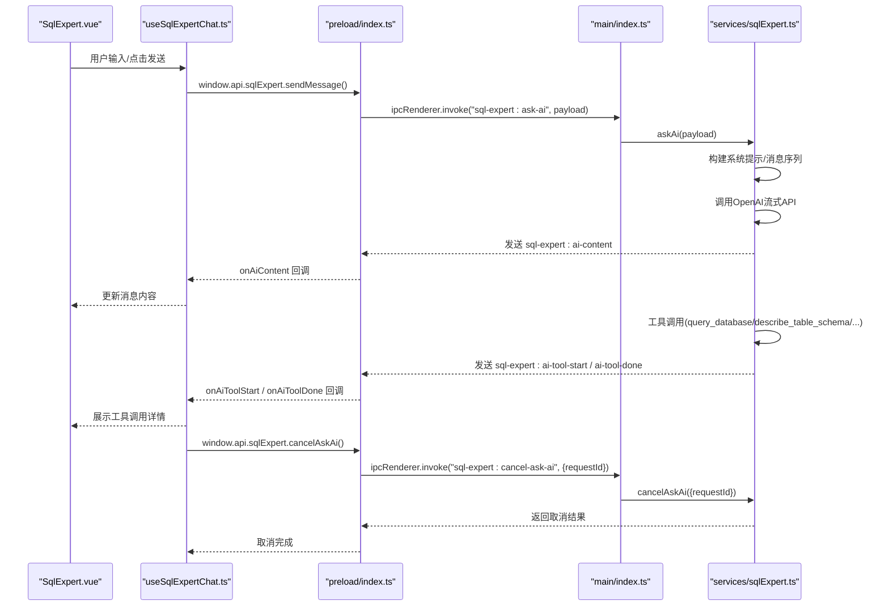
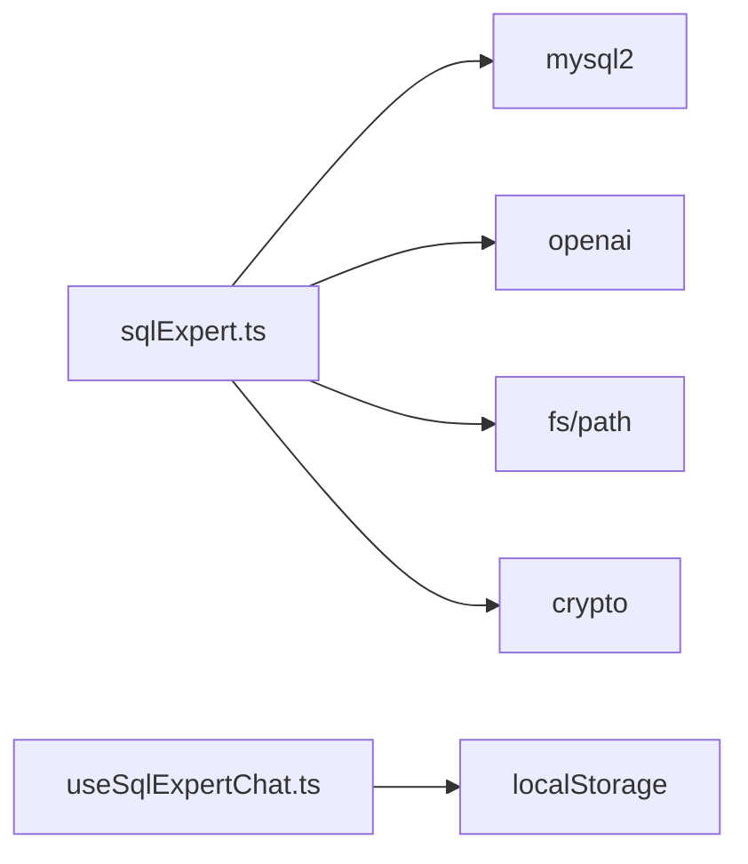

# SQL专家API

<cite>
**本文引用的文件**
- [src/main/services/sqlExpert.ts](file://src/main/services/sqlExpert.ts)
- [src/preload/index.ts](file://src/preload/index.ts)
- [src/renderer/src/views/sqlexpert/SqlExpert.vue](file://src/renderer/src/views/sqlexpert/SqlExpert.vue)
- [src/renderer/src/views/sqlexpert/useSqlExpertChat.ts](file://src/renderer/src/views/sqlexpert/useSqlExpertChat.ts)
- [src/main/index.ts](file://src/main/index.ts)
- [src/renderer/src/types.d.ts](file://src/renderer/src/types.d.ts)
- [src/preload/index.d.ts](file://src/preload/index.d.ts)
- [package.json](file://package.json)
</cite>

## 目录
1. [简介](#简介)
2. [项目结构](#项目结构)
3. [核心组件](#核心组件)
4. [架构总览](#架构总览)
5. [详细组件分析](#详细组件分析)
6. [依赖分析](#依赖分析)
7. [性能考虑](#性能考虑)
8. [故障排查指南](#故障排查指南)
9. [结论](#结论)
10. [附录](#附录)

## 简介
本文件为“SQL专家API”的全面接口文档，聚焦于sqlExpert对象在主进程侧提供的AI驱动数据库分析能力。覆盖以下核心功能：
- 数据库连接测试：testDb()
- AI查询：askAi()
- 取消查询：cancelAskAi()
- 执行SQL：executeSql()
- 配置管理：saveConfig()/loadConfig()
- 模式加载：loadSchema()
- 记忆管理：loadMemories()/updateMemory()/deleteMemory()/addMemory()
- 表描述：describeTable()
- 余额检查：checkBalance()
- 流式事件监听：onAiContent、onAiToolStart、onAiToolDone
- 监听器移除：removeAiListeners()

同时提供数据库连接、AI交互、错误处理与性能优化的实现指南，帮助开发者正确集成与扩展。

## 项目结构
该项目采用Electron + Vue的桌面应用架构，前端通过preload桥接暴露window.api.sqlExpert给渲染进程调用，主进程在src/main/services/sqlExpert.ts中实现具体逻辑并通过ipcMain.handle注册IPC接口。

**图表来源**
- [src/renderer/src/views/sqlexpert/SqlExpert.vue:1-120](file://src/renderer/src/views/sqlexpert/SqlExpert.vue#L1-L120)
- [src/renderer/src/views/sqlexpert/useSqlExpertChat.ts:165-507](file://src/renderer/src/views/sqlexpert/useSqlExpertChat.ts#L165-L507)
- [src/preload/index.ts:156-229](file://src/preload/index.ts#L156-L229)
- [src/main/index.ts:427-428](file://src/main/index.ts#L427-L428)
- [src/main/services/sqlExpert.ts:968-1502](file://src/main/services/sqlExpert.ts#L968-L1502)

**章节来源**
- [src/main/index.ts:427-428](file://src/main/index.ts#L427-L428)
- [src/preload/index.ts:156-229](file://src/preload/index.ts#L156-L229)
- [src/main/services/sqlExpert.ts:968-1502](file://src/main/services/sqlExpert.ts#L968-L1502)

## 核心组件
- sqlExpert对象：通过window.api.sqlExpert在渲染进程调用，封装数据库连接、AI对话、SQL执行、配置与记忆管理、表结构查询、余额检查等能力。
- 事件系统：onAiContent/onAiToolStart/onAiToolDone用于流式接收AI回复与工具调用进度；removeAiListeners用于清理监听。
- 会话管理：useSqlExpertChat.ts负责构建消息、注册事件、发起askAi、停止生成、重新生成、持久化会话等。
- 主进程服务：sqlExpert.ts实现数据库连接池、SQL校验、工具调度、AI流式响应、文件与内存持久化等。

**章节来源**
- [src/renderer/src/views/sqlexpert/useSqlExpertChat.ts:165-507](file://src/renderer/src/views/sqlexpert/useSqlExpertChat.ts#L165-L507)
- [src/preload/index.ts:156-229](file://src/preload/index.ts#L156-L229)
- [src/main/services/sqlExpert.ts:968-1502](file://src/main/services/sqlExpert.ts#L968-L1502)

## 架构总览
下图展示了从渲染进程到主进程的关键调用链与事件流。

**图表来源**
- [src/renderer/src/views/sqlexpert/SqlExpert.vue:585-611](file://src/renderer/src/views/sqlexpert/SqlExpert.vue#L585-L611)
- [src/renderer/src/views/sqlexpert/useSqlExpertChat.ts:282-420](file://src/renderer/src/views/sqlexpert/useSqlExpertChat.ts#L282-L420)
- [src/preload/index.ts:156-229](file://src/preload/index.ts#L156-L229)
- [src/main/index.ts:427-428](file://src/main/index.ts#L427-L428)
- [src/main/services/sqlExpert.ts:1280-1501](file://src/main/services/sqlExpert.ts#L1280-L1501)

## 详细组件分析

### 数据库连接测试 testDb()
- 功能：验证MySQL连接参数是否有效，支持超时与ping检测。
- 输入：DbConfig（host/port/user/password/database）
- 输出：{ success: boolean; message: string }
- 主进程实现：ipcMain.handle('sql-expert:test-db', ...)，创建临时连接并ping。
- 渲染调用：window.api.sqlExpert.testDb(config)

**章节来源**
- [src/main/services/sqlExpert.ts:968-991](file://src/main/services/sqlExpert.ts#L968-L991)
- [src/preload/index.ts:158-164](file://src/preload/index.ts#L158-L164)

### AI查询 askAi()
- 功能：发起多轮对话，支持工具调用（查询数据库、描述表结构、绘图、导出、保存记忆），流式返回内容与工具调用进度。
- 输入：AskAiPayload（requestId可选、messages、schema）
- 输出：{ success: boolean; requestId; reply; toolCalls; usage; status; error? }
- 主进程实现：ipcMain.handle('sql-expert:ask-ai', ...)，构建系统提示、消息序列，调用OpenAI流式API，实时推送事件。
- 渲染调用：window.api.sqlExpert.askAi(payload)
- 事件监听：
  - onAiContent：接收累积内容
  - onAiToolStart：工具开始
  - onAiToolDone：工具完成（含结果或错误）
  - removeAiListeners：移除所有监听

**章节来源**
- [src/main/services/sqlExpert.ts:1280-1501](file://src/main/services/sqlExpert.ts#L1280-L1501)
- [src/preload/index.ts:197-212](file://src/preload/index.ts#L197-L212)
- [src/renderer/src/views/sqlexpert/useSqlExpertChat.ts:282-420](file://src/renderer/src/views/sqlexpert/useSqlExpertChat.ts#L282-L420)

### 取消查询 cancelAskAi()
- 功能：根据requestId取消正在进行的askAi请求。
- 输入：{ requestId: string }
- 输出：{ success: boolean; message: string }
- 主进程实现：ipcMain.handle('sql-expert:cancel-ask-ai', ...)，通过AbortController中断流式请求。

**章节来源**
- [src/main/services/sqlExpert.ts:1268-1278](file://src/main/services/sqlExpert.ts#L1268-L1278)
- [src/preload/index.ts](file://src/preload/index.ts#L170)

### 执行SQL executeSql()
- 功能：执行只读SQL，限制最大返回行数，返回统计信息与数据。
- 输入：sql: string
- 输出：{ success: boolean; truncated?; totalRows?; returnedRows?; rows?; error? }
- 主进程实现：ipcMain.handle('sql-expert:execute-sql', ...)，调用validateSql与数据库查询。

**章节来源**
- [src/main/services/sqlExpert.ts:1243-1266](file://src/main/services/sqlExpert.ts#L1243-L1266)
- [src/preload/index.ts](file://src/preload/index.ts#L171)

### 配置管理 saveConfig()/loadConfig()
- saveConfig：
  - 输入：SqlExpertConfig（db与ai配置）
  - 输出：{ success: boolean; error? }
  - 主进程实现：保存到磁盘，重建连接池。
- loadConfig：
  - 输出：config、schema、schemaPath、memories、memoryPath、memoryScope、memoryCount
  - 主进程实现：读取磁盘配置与schema，加载对应数据库的记忆文件。

**章节来源**
- [src/main/services/sqlExpert.ts:993-1076](file://src/main/services/sqlExpert.ts#L993-L1076)
- [src/preload/index.ts:175-176](file://src/preload/index.ts#L175-L176)

### 模式加载 loadSchema()
- 功能：从information_schema动态生成表清单文本并缓存，同时加载对应记忆。
- 输入：可选DbConfig（若未提供则使用已保存配置）
- 输出：{ success: boolean; schema; schemaPath; tableCount; memories; memoryPath; memoryScope; memoryCount; error? }
- 主进程实现：连接数据库查询TABLES，生成文本并保存到磁盘。

**章节来源**
- [src/main/services/sqlExpert.ts:1158-1212](file://src/main/services/sqlExpert.ts#L1158-L1212)
- [src/preload/index.ts:183-183](file://src/preload/index.ts#L183-L183)

### 记忆管理 loadMemories()/updateMemory()/deleteMemory()/addMemory()
- loadMemories：
  - 输入：{ database?, apiKey? }（可选，未提供则使用已保存配置）
  - 输出：{ success; memories; memoryPath; memoryScope; memoryCount; error? }
- updateMemory：
  - 输入：{ memoryId; content; database?; apiKey? }
  - 输出：同上
- deleteMemory：
  - 输入：{ memoryId; database?; apiKey? }
  - 输出：同上
- addMemory：
  - 输入：{ content; database?; apiKey? }
  - 输出：同上
- 主进程实现：基于数据库名与API Key计算记忆作用域，读写JSON文件，保证结构一致性。

**章节来源**
- [src/main/services/sqlExpert.ts:1078-1156](file://src/main/services/sqlExpert.ts#L1078-L1156)
- [src/preload/index.ts:184-191](file://src/preload/index.ts#L184-L191)

### 表描述 describeTable()
- 功能：查询一个或多个表的字段结构（来自information_schema）。
- 输入：string[]（表名数组）
- 输出：{ success; rows; error? }

**章节来源**
- [src/main/services/sqlExpert.ts:1214-1241](file://src/main/services/sqlExpert.ts#L1214-L1241)
- [src/preload/index.ts:192-192](file://src/preload/index.ts#L192-L192)

### 余额检查 checkBalance()
- 功能：调用AI平台余额接口，返回可用余额信息。
- 输入：{ url?, apiKey? }（可选，未提供则使用已保存配置）
- 输出：{ success; message }
- 主进程实现：构造余额查询URL，发起HTTP GET，解析响应。

**章节来源**
- [src/main/services/sqlExpert.ts:1005-1057](file://src/main/services/sqlExpert.ts#L1005-L1057)
- [src/preload/index.ts:194-195](file://src/preload/index.ts#L194-L195)

### 流式事件监听与移除
- onAiContent：接收累积的AI回复内容
- onAiToolStart：工具开始调用（id/name/args）
- onAiToolDone：工具完成（status/result/errorMessage）
- removeAiListeners：移除上述所有监听
- 使用方式：在useSqlExpertChat.ts中注册监听，发起askAi后在finally中清理。

**章节来源**
- [src/preload/index.ts:197-212](file://src/preload/index.ts#L197-L212)
- [src/renderer/src/views/sqlexpert/useSqlExpertChat.ts:296-420](file://src/renderer/src/views/sqlexpert/useSqlExpertChat.ts#L296-L420)

## 依赖分析
- 数据库驱动：mysql2（Promise连接池）
- AI SDK：openai（流式ChatCompletion）
- 文件系统：fs（配置、schema、导出文件、记忆文件）
- 路径工具：path（拼接配置目录）
- 加密与哈希：crypto（API Key哈希）
- 会话持久化：localStorage（会话与消息）

**图表来源**
- [src/main/services/sqlExpert.ts:5-11](file://src/main/services/sqlExpert.ts#L5-L11)
- [src/renderer/src/views/sqlexpert/useSqlExpertChat.ts:104-121](file://src/renderer/src/views/sqlexpert/useSqlExpertChat.ts#L104-L121)
- [package.json:28-51](file://package.json#L28-L51)

**章节来源**
- [package.json:28-51](file://package.json#L28-L51)

## 性能考虑
- 连接池与超时
  - 连接池：connectionLimit=5，queueLimit=0，connectTimeout=10000ms
  - SQL查询：默认超时60秒，防止长时间阻塞
- 结果截断
  - 工具返回最大10行，避免大结果集传输
- 流式响应
  - OpenAI流式返回，逐步推送内容与工具调用状态，降低首屏等待
- 会话持久化
  - 仅持久化必要字段，清理大数据（rows），减少内存占用
- 令牌用量
  - 支持usage统计，便于成本估算与优化

**章节来源**
- [src/main/services/sqlExpert.ts:404-435](file://src/main/services/sqlExpert.ts#L404-L435)
- [src/main/services/sqlExpert.ts:743-744](file://src/main/services/sqlExpert.ts#L743-L744)
- [src/renderer/src/views/sqlexpert/useSqlExpertChat.ts:104-121](file://src/renderer/src/views/sqlexpert/useSqlExpertChat.ts#L104-L121)

## 故障排查指南
- 数据库连接失败
  - 现象：testDb返回失败
  - 排查：确认host/port/user/password/database；检查网络与防火墙；尝试ping
  - 参考实现：[src/main/services/sqlExpert.ts:968-991](file://src/main/services/sqlExpert.ts#L968-L991)
- AI配置缺失
  - 现象：askAi报错“请先配置AI模型参数”
  - 排查：确认已保存AI url/apiKey/model；检查网络与代理
  - 参考实现：[src/main/services/sqlExpert.ts:1288-1291](file://src/main/services/sqlExpert.ts#L1288-L1291)
- Schema未加载
  - 现象：askAi报错“请先加载数据库表结构”
  - 排查：先调用loadSchema，确保数据库名正确
  - 参考实现：[src/main/services/sqlExpert.ts:1293-1294](file://src/main/services/sqlExpert.ts#L1293-L1294)
- SQL语法错误
  - 现象：executeSql/工具调用返回error
  - 排查：仅支持SELECT/WITH...SELECT；禁止DDL/DML；禁止SELECT*
  - 参考实现：[src/main/services/sqlExpert.ts:365-400](file://src/main/services/sqlExpert.ts#L365-L400)
- 工具调用失败
  - 现象：onAiToolDone携带errorMessage
  - 排查：检查表名合法性、SQL可读性、权限
  - 参考实现：[src/main/services/sqlExpert.ts:836-951](file://src/main/services/sqlExpert.ts#L836-L951)
- 余额查询失败
  - 现象：checkBalance返回失败
  - 排查：确认API Key有效；检查网络；核对URL
  - 参考实现：[src/main/services/sqlExpert.ts:1005-1057](file://src/main/services/sqlExpert.ts#L1005-L1057)

**章节来源**
- [src/main/services/sqlExpert.ts:365-400](file://src/main/services/sqlExpert.ts#L365-L400)
- [src/main/services/sqlExpert.ts:836-951](file://src/main/services/sqlExpert.ts#L836-L951)
- [src/main/services/sqlExpert.ts:1005-1057](file://src/main/services/sqlExpert.ts#L1005-L1057)

## 结论
SQL专家API通过主进程服务与渲染进程事件系统，提供了从数据库连接、AI对话、工具调用到会话与记忆管理的完整能力。其设计强调安全性（只读SQL、系统库限制）、可观测性（流式事件、usage统计）与可维护性（配置持久化、会话清理）。遵循本文档的调用流程与最佳实践，可稳定地集成到桌面应用中。

## 附录

### API方法一览（渲染进程调用）
- testDb(config)
- askAi(payload)
- cancelAskAi({requestId})
- executeSql(sql)
- saveConfig(config)
- loadConfig()
- loadSchema(dbConfig?)
- loadMemories(payload?)
- updateMemory(payload)
- deleteMemory(payload)
- addMemory(payload)
- describeTable(tableNames[])
- checkBalance(config?)
- onAiContent(cb)
- onAiToolStart(cb)
- onAiToolDone(cb)
- removeAiListeners()

**章节来源**
- [src/preload/index.ts:156-229](file://src/preload/index.ts#L156-L229)
- [src/renderer/src/types.d.ts:172-274](file://src/renderer/src/types.d.ts#L172-L274)