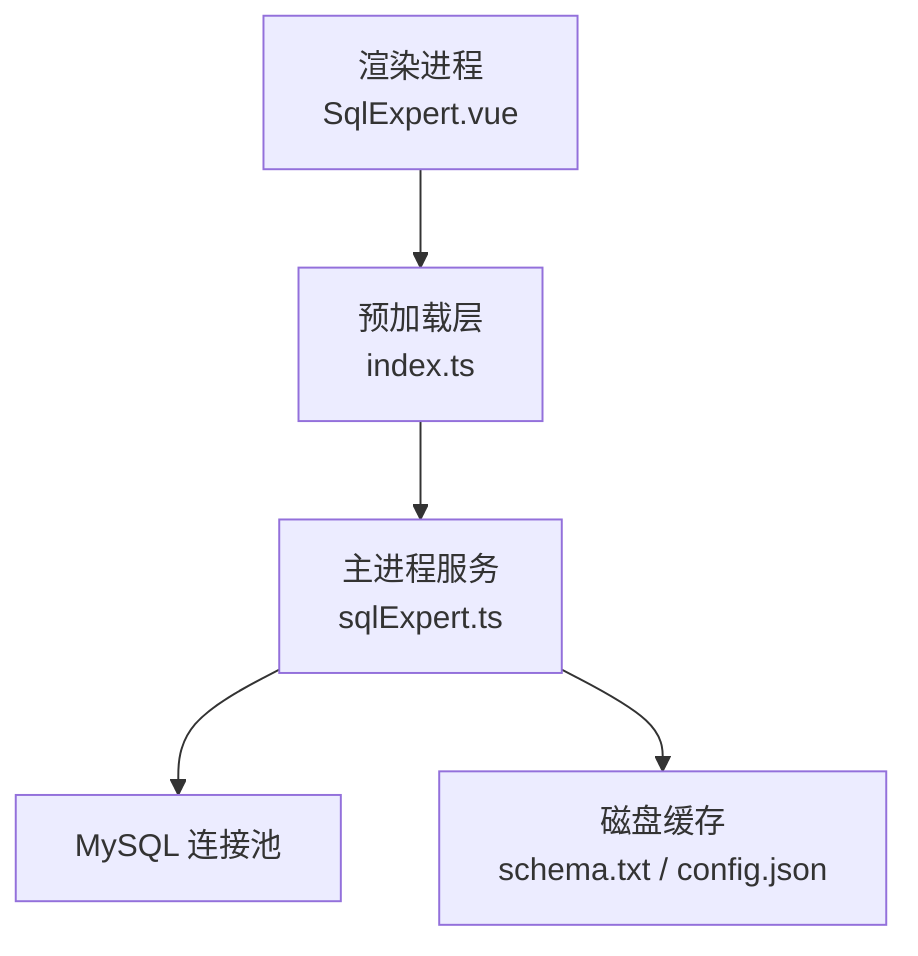
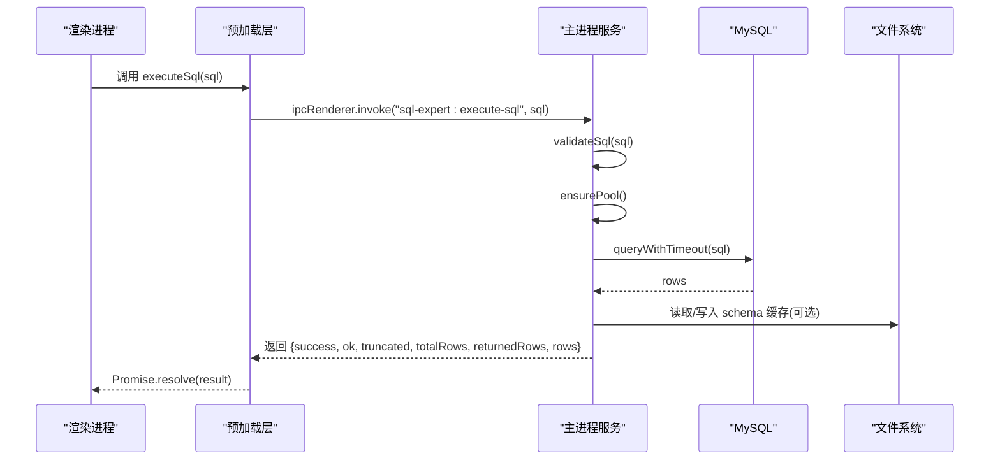
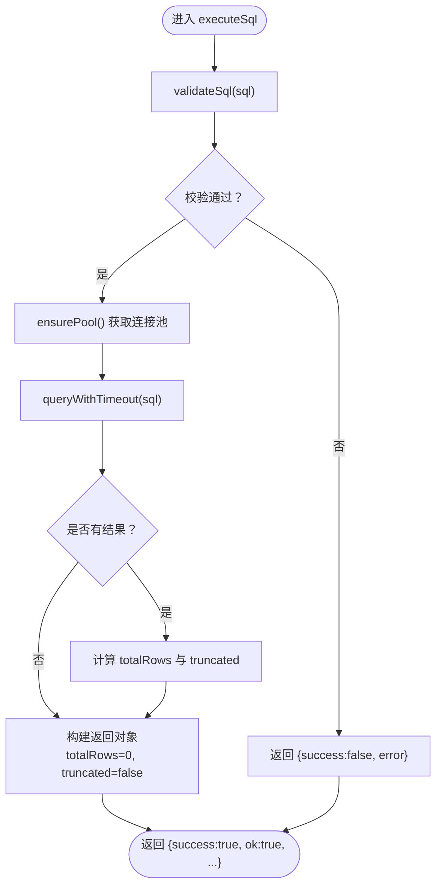
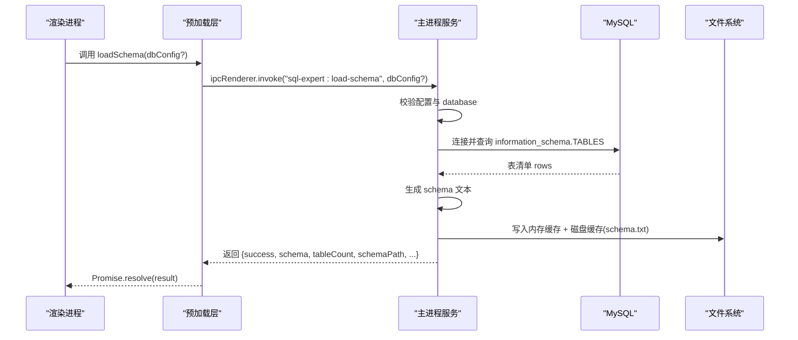
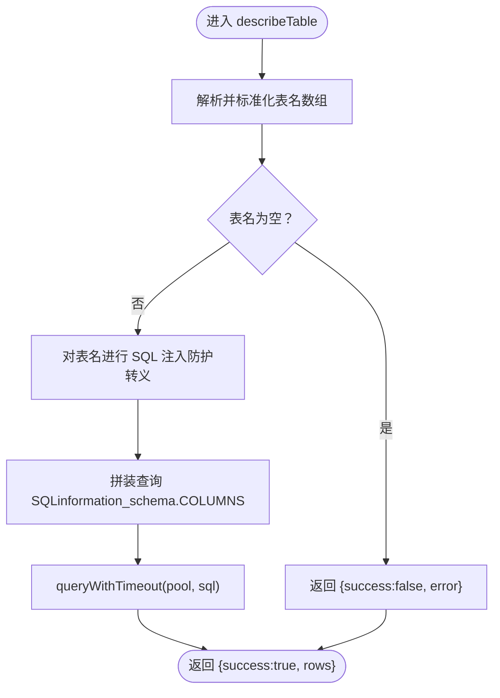
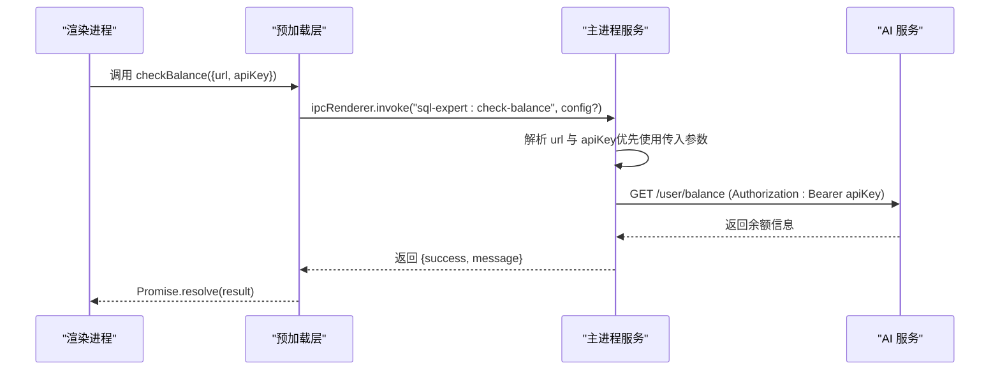
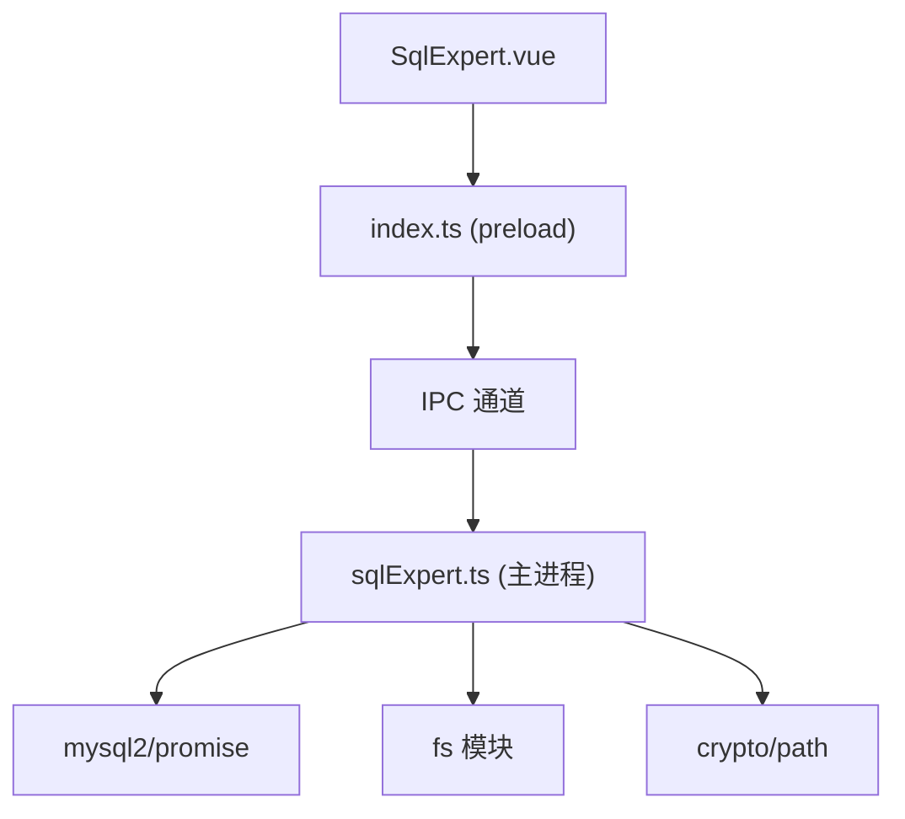

# 实用工具函数

<cite>
**本文档引用的文件**
- [src/main/services/sqlExpert.ts](file://src/main/services/sqlExpert.ts)
- [src/preload/index.ts](file://src/preload/index.ts)
- [src/preload/index.d.ts](file://src/preload/index.d.ts)
- [src/renderer/src/views/sqlexpert/SqlExpert.vue](file://src/renderer/src/views/sqlexpert/SqlExpert.vue)
</cite>

## 目录
1. [简介](#简介)
2. [项目结构](#项目结构)
3. [核心组件](#核心组件)
4. [架构概览](#架构概览)
5. [详细组件分析](#详细组件分析)
6. [依赖关系分析](#依赖关系分析)
7. [性能考虑](#性能考虑)
8. [故障排除指南](#故障排除指南)
9. [结论](#结论)

## 简介
本文档面向开发者，系统性地介绍 Dev Toolbox 中的实用工具函数，重点覆盖以下能力：
- executeSql：直接执行只读 SQL 的方法签名与返回格式
- loadSchema：动态加载数据库模式的参数与流程
- describeTable：表描述查询的表名数组格式与安全校验
- checkBalance：AI 余额检查的配置参数与调用策略

同时，文档将阐述 SQL 执行的安全限制、模式缓存机制、表描述的详细信息、余额查询的频率控制、性能优化与错误处理机制，并提供完整的使用示例与最佳实践。

## 项目结构
实用工具函数位于主进程服务模块中，通过 IPC 暴露给渲染进程使用。核心文件组织如下：
- 主进程服务：src/main/services/sqlExpert.ts
- 预加载层接口：src/preload/index.ts 与 src/preload/index.d.ts
- 渲染层调用示例：src/renderer/src/views/sqlexpert/SqlExpert.vue

**图表来源**
- [src/renderer/src/views/sqlexpert/SqlExpert.vue:585-611](file://src/renderer/src/views/sqlexpert/SqlExpert.vue#L585-L611)
- [src/preload/index.ts:171-195](file://src/preload/index.ts#L171-L195)
- [src/main/services/sqlExpert.ts:418-435](file://src/main/services/sqlExpert.ts#L418-L435)

**章节来源**
- [src/main/services/sqlExpert.ts:1-200](file://src/main/services/sqlExpert.ts#L1-L200)
- [src/preload/index.ts:171-195](file://src/preload/index.ts#L171-L195)
- [src/preload/index.d.ts:274-368](file://src/preload/index.d.ts#L274-L368)
- [src/renderer/src/views/sqlexpert/SqlExpert.vue:585-611](file://src/renderer/src/views/sqlexpert/SqlExpert.vue#L585-L611)

## 核心组件
本节概述四个关键工具函数及其职责边界：
- executeSql：执行只读 SQL，进行严格语法与权限校验，限制返回行数并超时保护
- loadSchema：从 information_schema 动态生成表清单，缓存至磁盘并返回元信息
- describeTable：查询一个或多个表的字段结构，进行表名校验与 SQL 注入防护
- checkBalance：向 AI 服务查询账户余额，支持默认 URL 与 API Key 解析

**章节来源**
- [src/main/services/sqlExpert.ts:365-400](file://src/main/services/sqlExpert.ts#L365-L400)
- [src/main/services/sqlExpert.ts:1158-1212](file://src/main/services/sqlExpert.ts#L1158-L1212)
- [src/main/services/sqlExpert.ts:1214-1241](file://src/main/services/sqlExpert.ts#L1214-L1241)
- [src/main/services/sqlExpert.ts:1005-1057](file://src/main/services/sqlExpert.ts#L1005-L1057)

## 架构概览
工具函数通过 IPC 在渲染层暴露 API，主进程负责：
- 数据库连接池管理与超时控制
- SQL 安全校验与注入防护
- 模式缓存与磁盘持久化
- AI 余额查询与错误处理

**图表来源**
- [src/preload/index.ts:171-171](file://src/preload/index.ts#L171-L171)
- [src/main/services/sqlExpert.ts:1244-1266](file://src/main/services/sqlExpert.ts#L1244-L1266)
- [src/main/services/sqlExpert.ts:365-400](file://src/main/services/sqlExpert.ts#L365-L400)
- [src/main/services/sqlExpert.ts:418-435](file://src/main/services/sqlExpert.ts#L418-L435)
- [src/main/services/sqlExpert.ts:824-834](file://src/main/services/sqlExpert.ts#L824-L834)

## 详细组件分析

### executeSql：只读 SQL 执行
- 方法签名
  - 渲染层调用：executeSql(sql: string)
  - 预加载层封装：ipcRenderer.invoke('sql-expert:execute-sql', sql)
  - 主进程处理：ipcMain.handle('sql-expert:execute-sql', async (_event, sql: string))
- 参数要求
  - sql: string，必填，不能为空字符串
- 安全限制
  - 仅允许 SELECT 或 WITH...SELECT
  - 禁止分号、DDL/DML/系统库访问、SELECT *、未使用 AS 的列
  - 每次仅允许一条 SQL
- 性能与限制
  - 超时：默认 60 秒
  - 结果截断：最多返回 10 行，通过 truncated 标记提示
- 返回格式
  - success: boolean
  - ok: boolean（仅当成功时为 true）
  - truncated: boolean（是否被截断）
  - totalRows: number（总行数）
  - returnedRows: number（返回行数）
  - rows: Record<string, unknown>[]（查询结果，最多 10 行）
  - error: string（仅失败时存在）

**图表来源**
- [src/main/services/sqlExpert.ts:365-400](file://src/main/services/sqlExpert.ts#L365-L400)
- [src/main/services/sqlExpert.ts:418-435](file://src/main/services/sqlExpert.ts#L418-L435)
- [src/main/services/sqlExpert.ts:824-834](file://src/main/services/sqlExpert.ts#L824-L834)
- [src/main/services/sqlExpert.ts:1244-1266](file://src/main/services/sqlExpert.ts#L1244-L1266)

**章节来源**
- [src/preload/index.ts:171-171](file://src/preload/index.ts#L171-L171)
- [src/preload/index.d.ts:296-304](file://src/preload/index.d.ts#L296-L304)
- [src/main/services/sqlExpert.ts:365-400](file://src/main/services/sqlExpert.ts#L365-L400)
- [src/main/services/sqlExpert.ts:418-435](file://src/main/services/sqlExpert.ts#L418-L435)
- [src/main/services/sqlExpert.ts:824-834](file://src/main/services/sqlExpert.ts#L824-L834)
- [src/main/services/sqlExpert.ts:1244-1266](file://src/main/services/sqlExpert.ts#L1244-L1266)

### loadSchema：动态加载数据库模式
- 方法签名
  - 渲染层调用：loadSchema(dbConfig?: DbConfig)
  - 预加载层封装：ipcRenderer.invoke('sql-expert:load-schema', dbConfig?)
  - 主进程处理：ipcMain.handle('sql-expert:load-schema', async (_event, dbConfig?: DbConfig))
- 参数要求
  - dbConfig?: DbConfig（可选，若不提供则使用已保存配置）
  - DbConfig 包含 host, port, user, password, database
- 执行流程
  - 校验配置完整性与 database 名称
  - 建立临时连接查询 information_schema.TABLES
  - 生成与内部约定格式一致的 schema 文本
  - 写入内存缓存与磁盘缓存（schema.txt）
  - 返回 schema 文本、表数量、文件路径与相关元信息
- 返回格式
  - success: boolean
  - schema: string（表清单文本）
  - schemaPath: string（磁盘路径）
  - tableCount: number（表数量）
  - memories: MemoryEntry[]
  - memoryPath: string
  - memoryScope: string
  - memoryCount: number
  - error: string（仅失败时存在）

**图表来源**
- [src/preload/index.ts:177-183](file://src/preload/index.ts#L177-L183)
- [src/main/services/sqlExpert.ts:1158-1212](file://src/main/services/sqlExpert.ts#L1158-L1212)
- [src/main/services/sqlExpert.ts:1175-1184](file://src/main/services/sqlExpert.ts#L1175-L1184)
- [src/main/services/sqlExpert.ts:1186-1187](file://src/main/services/sqlExpert.ts#L1186-L1187)
- [src/main/services/sqlExpert.ts:1060-1076](file://src/main/services/sqlExpert.ts#L1060-L1076)

**章节来源**
- [src/preload/index.ts:177-183](file://src/preload/index.ts#L177-L183)
- [src/preload/index.d.ts:315-325](file://src/preload/index.d.ts#L315-L325)
- [src/main/services/sqlExpert.ts:1158-1212](file://src/main/services/sqlExpert.ts#L1158-L1212)
- [src/main/services/sqlExpert.ts:1060-1076](file://src/main/services/sqlExpert.ts#L1060-L1076)

### describeTable：表描述查询
- 方法签名
  - 渲染层调用：describeTable(tableNames: string[])
  - 预加载层封装：ipcRenderer.invoke('sql-expert:describe-table', tableNames)
  - 主进程处理：ipcMain.handle('sql-expert:describe-table', async (_event, tableNames: string[]))
- 参数要求
  - tableNames: string[]，支持单个表名或多个表名
  - 支持字符串或数组形式（内部统一转换为数组）
- 安全与校验
  - 对每个表名进行 trim 与过滤，确保非空
  - 使用 SQL 注入防护：将表名用单引号包裹并转义单引号字符
  - 仅查询当前数据库（DATABASE()）
- 返回格式
  - success: boolean
  - rows: Record<string, unknown>[]（字段详情，包含表名、字段顺序、字段名、类型、是否可空、默认值、索引类型、额外信息、注释等）
  - error: string（仅失败时存在）

**图表来源**
- [src/preload/index.ts:192-193](file://src/preload/index.ts#L192-L193)
- [src/main/services/sqlExpert.ts:1214-1241](file://src/main/services/sqlExpert.ts#L1214-L1241)
- [src/main/services/sqlExpert.ts:1224-1234](file://src/main/services/sqlExpert.ts#L1224-L1234)
- [src/main/services/sqlExpert.ts:824-834](file://src/main/services/sqlExpert.ts#L824-L834)

**章节来源**
- [src/preload/index.ts:192-193](file://src/preload/index.ts#L192-L193)
- [src/preload/index.d.ts:358-362](file://src/preload/index.d.ts#L358-L362)
- [src/main/services/sqlExpert.ts:1214-1241](file://src/main/services/sqlExpert.ts#L1214-L1241)

### checkBalance：AI 余额检查
- 方法签名
  - 渲染层调用：checkBalance(config?: { url?: string; apiKey?: string })
  - 预加载层封装：ipcRenderer.invoke('sql-expert:check-balance', config?)
  - 主进程处理：ipcMain.handle('sql-expert:check-balance', async (_event, config?: { url?: string; apiKey?: string }))
- 参数要求
  - config?: { url?: string; apiKey?: string }
  - 若未提供，则尝试使用已保存配置中的 AI URL 与 API Key
- 调用策略与频率限制
  - 建议在 API Key 就绪时自动查询一次
  - 在会话发送完成后再次查询，用于成本感知
  - 避免频繁轮询，建议结合业务场景合理触发
- 返回格式
  - success: boolean
  - message: string（包含余额信息与可用性状态）

**图表来源**
- [src/preload/index.ts:194-195](file://src/preload/index.ts#L194-L195)
- [src/main/services/sqlExpert.ts:1005-1057](file://src/main/services/sqlExpert.ts#L1005-L1057)
- [src/renderer/src/views/sqlexpert/SqlExpert.vue:585-611](file://src/renderer/src/views/sqlexpert/SqlExpert.vue#L585-L611)

**章节来源**
- [src/preload/index.ts:194-195](file://src/preload/index.ts#L194-L195)
- [src/preload/index.d.ts:363-366](file://src/preload/index.d.ts#L363-L366)
- [src/main/services/sqlExpert.ts:1005-1057](file://src/main/services/sqlExpert.ts#L1005-L1057)
- [src/renderer/src/views/sqlexpert/SqlExpert.vue:585-611](file://src/renderer/src/views/sqlexpert/SqlExpert.vue#L585-L611)

## 依赖关系分析
- 渲染层依赖预加载层提供的 API 包装
- 预加载层通过 ipcRenderer.invoke 与主进程通信
- 主进程服务依赖 mysql2/promise 进行数据库操作
- 主进程服务依赖 fs 模块进行磁盘缓存（schema.txt、config.json、memories）
- 主进程服务依赖 crypto 与 path 进行文件名清理与哈希

**图表来源**
- [src/renderer/src/views/sqlexpert/SqlExpert.vue:585-611](file://src/renderer/src/views/sqlexpert/SqlExpert.vue#L585-L611)
- [src/preload/index.ts:171-195](file://src/preload/index.ts#L171-L195)
- [src/main/services/sqlExpert.ts:1-200](file://src/main/services/sqlExpert.ts#L1-L200)

**章节来源**
- [src/main/services/sqlExpert.ts:1-200](file://src/main/services/sqlExpert.ts#L1-L200)
- [src/preload/index.ts:171-195](file://src/preload/index.ts#L171-L195)
- [src/renderer/src/views/sqlexpert/SqlExpert.vue:585-611](file://src/renderer/src/views/sqlexpert/SqlExpert.vue#L585-L611)

## 性能考虑
- 连接池与并发
  - 连接池大小：5
  - 等待队列：无上限排队，注意控制并发
- 查询超时
  - 默认 60 秒，防止长时间阻塞
- 结果截断
  - 工具类查询默认最多返回 10 行，避免大结果集影响 UI 体验
- 模式缓存
  - 内存缓存 + 磁盘缓存（schema.txt），减少重复查询
- 磁盘 I/O
  - 配置与记忆文件采用 JSON 格式，写入时统一格式化，便于维护

**章节来源**
- [src/main/services/sqlExpert.ts:404-416](file://src/main/services/sqlExpert.ts#L404-L416)
- [src/main/services/sqlExpert.ts:418-435](file://src/main/services/sqlExpert.ts#L418-L435)
- [src/main/services/sqlExpert.ts:742-744](file://src/main/services/sqlExpert.ts#L742-L744)
- [src/main/services/sqlExpert.ts:1186-1187](file://src/main/services/sqlExpert.ts#L1186-L1187)
- [src/main/services/sqlExpert.ts:158-170](file://src/main/services/sqlExpert.ts#L158-L170)

## 故障排除指南
- SQL 执行失败
  - 检查 SQL 是否满足只读与列别名要求
  - 确认未使用分号、DDL/DML、系统库访问
  - 查看返回的 error 字段定位具体原因
- 连接失败
  - 确认数据库配置正确（host/port/user/password/database）
  - 检查网络连通性与防火墙
- 权限不足
  - 确保数据库用户具备只读权限
  - 避免访问 system schema
- 模式加载失败
  - 确认 database 名称正确
  - 检查磁盘缓存文件是否存在且可读写
- 余额查询失败
  - 确认 API Key 不为空
  - 检查 URL 正确性（自动去除末尾 /v1）
  - 关注 HTTP 状态码与错误消息

**章节来源**
- [src/main/services/sqlExpert.ts:365-400](file://src/main/services/sqlExpert.ts#L365-L400)
- [src/main/services/sqlExpert.ts:970-991](file://src/main/services/sqlExpert.ts#L970-L991)
- [src/main/services/sqlExpert.ts:1158-1212](file://src/main/services/sqlExpert.ts#L1158-L1212)
- [src/main/services/sqlExpert.ts:1005-1057](file://src/main/services/sqlExpert.ts#L1005-L1057)

## 结论
本文档系统梳理了 Dev Toolbox 中实用工具函数的 API 签名、参数要求、安全限制、缓存机制与错误处理。通过严格的 SQL 校验、连接池与超时控制、模式缓存与磁盘持久化，以及合理的余额查询策略，这些工具能够在保障安全性与稳定性的前提下，为用户提供高效的数据库查询与分析能力。建议在实际使用中遵循本文档的最佳实践，合理控制查询频率与结果规模，确保系统的高性能与可维护性。