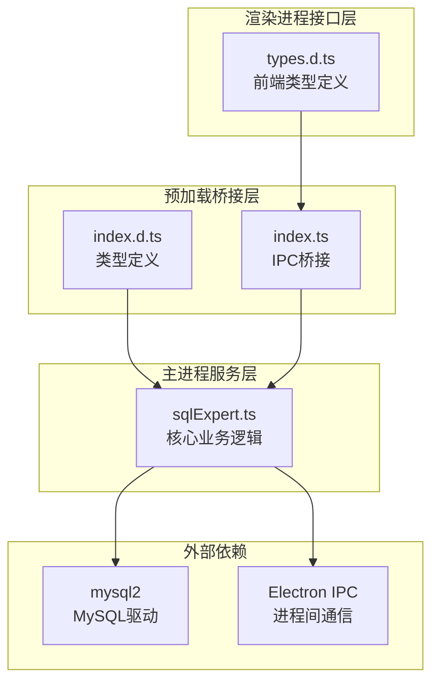
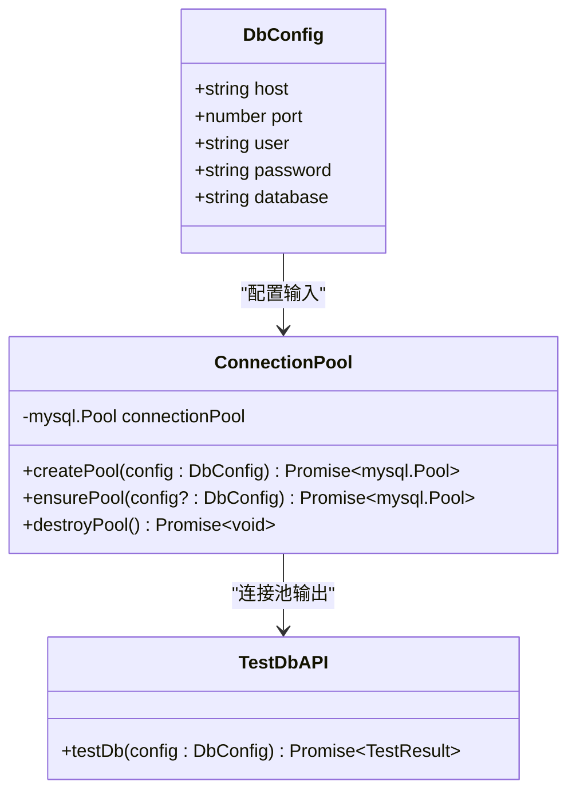
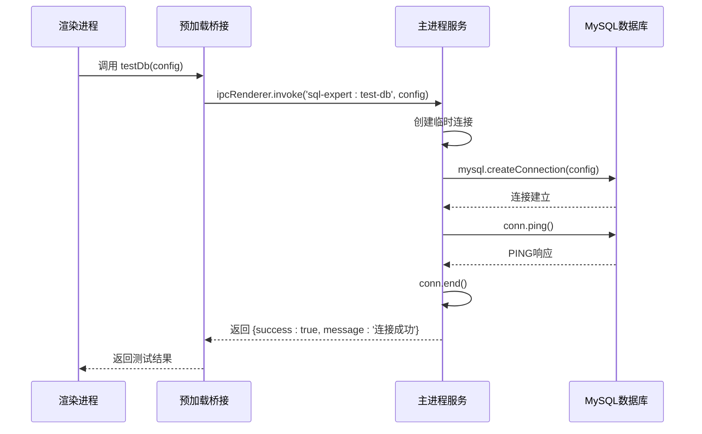
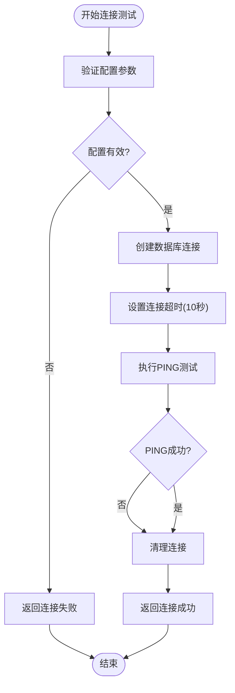
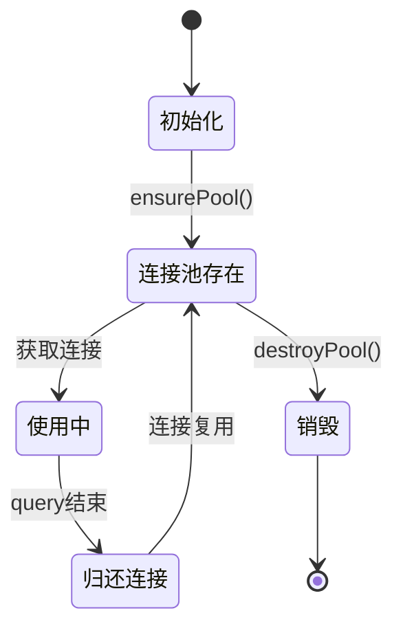
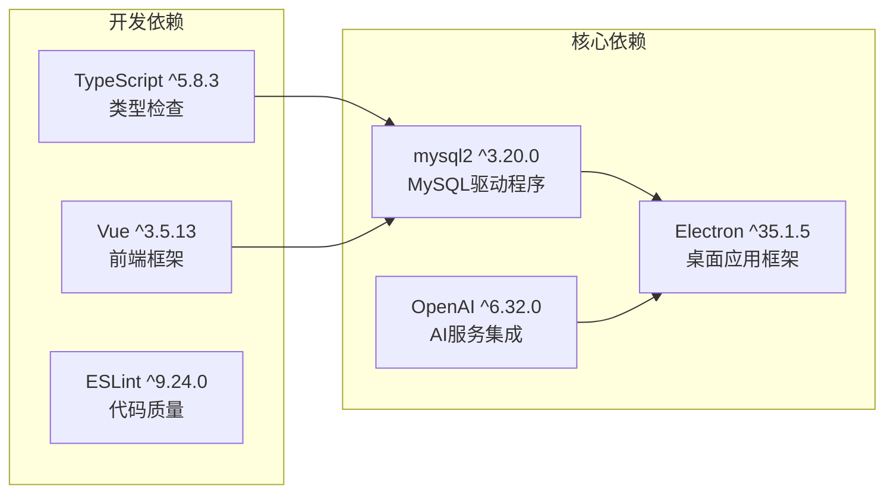
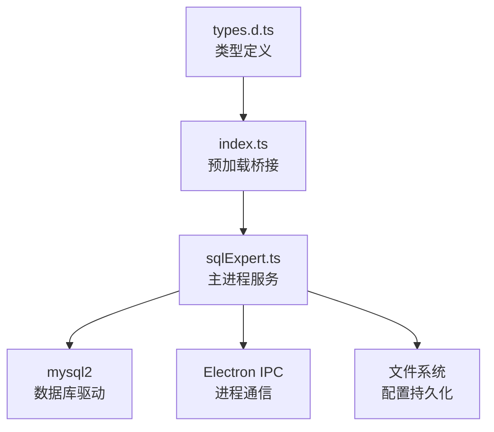

# 数据库连接管理

<cite>
**本文档引用的文件**
- [sqlExpert.ts](file://src/main/services/sqlExpert.ts)
- [index.d.ts](file://src/preload/index.d.ts)
- [index.ts](file://src/preload/index.ts)
- [types.d.ts](file://src/renderer/src/types.d.ts)
- [package.json](file://package.json)
</cite>

## 目录
1. [简介](#简介)
2. [项目结构](#项目结构)
3. [核心组件](#核心组件)
4. [架构概览](#架构概览)
5. [详细组件分析](#详细组件分析)
6. [依赖关系分析](#依赖关系分析)
7. [性能考虑](#性能考虑)
8. [故障排除指南](#故障排除指南)
9. [结论](#结论)

## 简介

数据库连接管理功能是开发者工具箱中的重要组成部分，主要负责MySQL数据库的连接测试、连接池管理、配置持久化等功能。该功能通过Electron的IPC机制提供跨进程的数据库连接能力，支持实时的连接状态验证和配置管理。

## 项目结构

数据库连接管理功能主要分布在以下文件中：

**图表来源**
- [sqlExpert.ts:1-50](file://src/main/services/sqlExpert.ts#L1-L50)
- [index.d.ts:245-275](file://src/preload/index.d.ts#L245-L275)
- [index.ts:157-212](file://src/preload/index.ts#L157-L212)

**章节来源**
- [sqlExpert.ts:1-50](file://src/main/services/sqlExpert.ts#L1-L50)
- [index.d.ts:245-275](file://src/preload/index.d.ts#L245-L275)
- [index.ts:157-212](file://src/preload/index.ts#L157-L212)

## 核心组件

### 数据库配置类型定义

数据库连接管理的核心数据结构是`DbConfig`接口，定义了连接数据库所需的所有参数：

| 参数名 | 类型 | 必填 | 描述 | 默认值 |
|--------|------|------|------|--------|
| host | string | 是 | 数据库服务器地址 | - |
| port | number | 是 | 数据库端口号 | - |
| user | string | 是 | 数据库用户名 | - |
| password | string | 是 | 数据库密码 | - |
| database | string | 是 | 要连接的数据库名 | - |

### 连接池管理

系统实现了单例模式的连接池管理，确保资源的有效利用和连接的复用：

**图表来源**
- [sqlExpert.ts:14-20](file://src/main/services/sqlExpert.ts#L14-L20)
- [sqlExpert.ts:404-435](file://src/main/services/sqlExpert.ts#L404-L435)

**章节来源**
- [sqlExpert.ts:14-20](file://src/main/services/sqlExpert.ts#L14-L20)
- [sqlExpert.ts:404-435](file://src/main/services/sqlExpert.ts#L404-L435)

## 架构概览

数据库连接管理采用分层架构设计，通过IPC机制实现跨进程通信：

**图表来源**
- [sqlExpert.ts:970-991](file://src/main/services/sqlExpert.ts#L970-L991)
- [index.ts:157-164](file://src/preload/index.ts#L157-L164)

## 详细组件分析

### testDb() 连接测试方法

#### 方法签名和参数

`testDb()`方法提供了完整的数据库连接测试功能：

**方法定义**: `testDb(config: SqlExpertDbConfig): Promise<{ success: boolean; message: string }>`

**参数配置**:
- `config`: 数据库连接配置对象，包含host、port、user、password、database五个必需参数

**返回值结构**:
- `success`: boolean - 连接测试结果标志
- `message`: string - 连接状态描述信息

#### 连接测试流程

**图表来源**
- [sqlExpert.ts:970-991](file://src/main/services/sqlExpert.ts#L970-L991)

#### 错误处理机制

系统实现了多层次的错误处理机制：

1. **连接建立阶段**: 捕获`mysql.createConnection()`抛出的异常
2. **PING测试阶段**: 捕获网络连接或认证失败异常  
3. **资源清理阶段**: 确保连接在finally块中正确关闭

**章节来源**
- [sqlExpert.ts:970-991](file://src/main/services/sqlExpert.ts#L970-L991)

### 连接池管理

#### 连接池配置

系统使用mysql2的Promise API创建连接池，配置如下：

| 配置项 | 值 | 说明 |
|--------|----|------|
| waitForConnections | true | 等待可用连接 |
| connectionLimit | 5 | 最大连接数 |
| queueLimit | 0 | 队列限制（0表示无限制） |
| connectTimeout | 10000 | 连接超时时间(ms) |

#### 连接池生命周期

**图表来源**
- [sqlExpert.ts:404-435](file://src/main/services/sqlExpert.ts#L404-L435)

**章节来源**
- [sqlExpert.ts:404-435](file://src/main/services/sqlExpert.ts#L404-L435)

### IPC接口集成

#### 预加载桥接层

预加载脚本提供了安全的IPC桥接，将主进程的服务暴露给渲染进程：

**暴露的API**:
- `api.sqlExpert.testDb(config)`: 数据库连接测试
- `api.sqlExpert.saveConfig(config)`: 保存配置
- `api.sqlExpert.loadConfig()`: 加载配置

#### 类型安全保障

系统通过TypeScript类型定义确保IPC调用的安全性和一致性：

**章节来源**
- [index.ts:157-212](file://src/preload/index.ts#L157-L212)
- [index.d.ts:274-275](file://src/preload/index.d.ts#L274-L275)

## 依赖关系分析

### 外部依赖

系统依赖以下关键包：

**图表来源**
- [package.json:28-51](file://package.json#L28-L51)

### 内部模块依赖

**图表来源**
- [sqlExpert.ts:5-11](file://src/main/services/sqlExpert.ts#L5-L11)
- [index.ts:1-3](file://src/preload/index.ts#L1-L3)

**章节来源**
- [package.json:28-51](file://package.json#L28-L51)
- [sqlExpert.ts:5-11](file://src/main/services/sqlExpert.ts#L5-L11)

## 性能考虑

### 连接池优化

系统采用连接池而非每次操作创建新连接的方式，具有以下优势：

1. **资源复用**: 减少TCP连接建立开销
2. **并发控制**: 通过connectionLimit限制最大并发连接数
3. **队列管理**: 通过queueLimit控制请求排队
4. **自动清理**: 连接池会在空闲时自动回收

### 超时配置

系统设置了合理的超时参数：

- **连接超时**: 10秒 (`connectTimeout: 10000`)
- **查询超时**: 60秒 (`SQL_QUERY_TIMEOUT_MS: 60000`)
- **工具调用超时**: 10秒 (`TOOL_RESULT_ROW_LIMIT: 10`)

### 内存管理

系统实现了完善的内存管理策略：

1. **连接清理**: 在finally块中确保连接正确关闭
2. **配置缓存**: 避免重复的磁盘IO操作
3. **错误恢复**: 异常情况下自动清理资源

## 故障排除指南

### 常见连接问题

| 问题类型 | 可能原因 | 解决方案 |
|----------|----------|----------|
| 连接超时 | 网络延迟或防火墙阻断 | 检查网络连通性，调整connectTimeout |
| 认证失败 | 用户名或密码错误 | 验证凭据，检查用户权限 |
| 数据库不存在 | database参数错误 | 确认数据库名称正确 |
| 端口占用 | MySQL服务未启动 | 启动MySQL服务，检查端口占用 |
| 连接池满 | 并发过高 | 调整connectionLimit，优化查询 |

### 调试建议

1. **启用详细日志**: 在开发环境中增加连接状态日志
2. **监控连接数**: 使用SHOW PROCESSLIST查看当前连接状态
3. **测试网络连通性**: 使用telnet或nc命令测试端口连通性
4. **验证凭据**: 在命令行工具中手动测试连接

### 性能监控指标

系统可以监控以下关键指标：

- **连接成功率**: 成功连接次数 / 总尝试次数
- **平均连接时间**: 连接建立的平均耗时
- **连接池利用率**: 使用中的连接数 / 总连接数
- **查询响应时间**: 平均查询耗时分布

**章节来源**
- [sqlExpert.ts:970-991](file://src/main/services/sqlExpert.ts#L970-L991)
- [sqlExpert.ts:404-435](file://src/main/services/sqlExpert.ts#L404-L435)

## 结论

数据库连接管理功能通过精心设计的架构实现了可靠、高效的数据库连接服务。其特点包括：

1. **安全性**: 通过预加载桥接层提供安全的IPC通信
2. **可靠性**: 实现了完善的错误处理和资源清理机制
3. **性能**: 采用连接池技术优化资源使用
4. **易用性**: 提供简洁的API接口和详细的错误反馈

该功能为上层的SQL专家服务提供了稳定的基础，支持复杂的数据库操作和AI驱动的数据分析场景。通过合理的配置和监控，可以确保在各种环境下都能提供可靠的数据库连接服务。