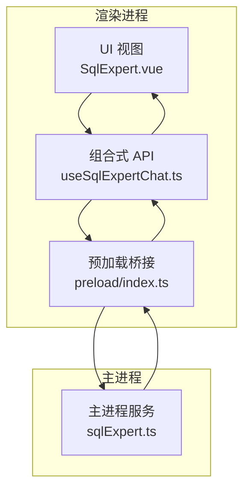
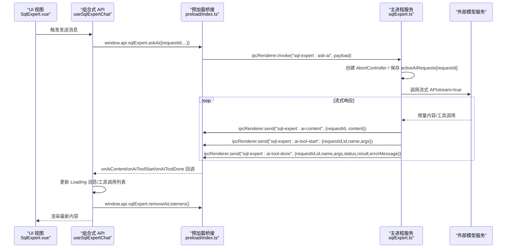
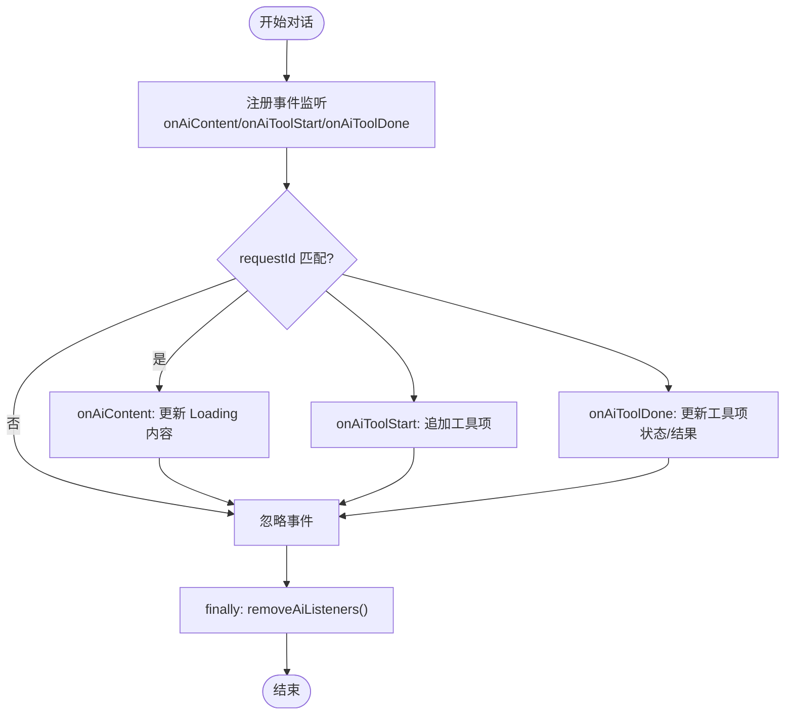
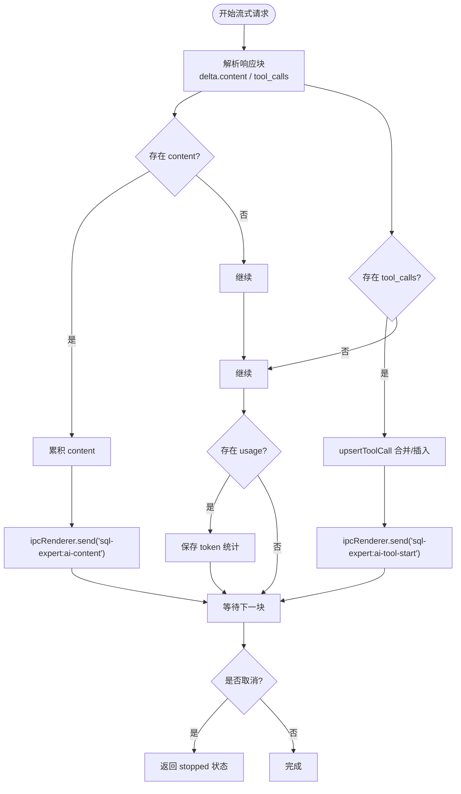
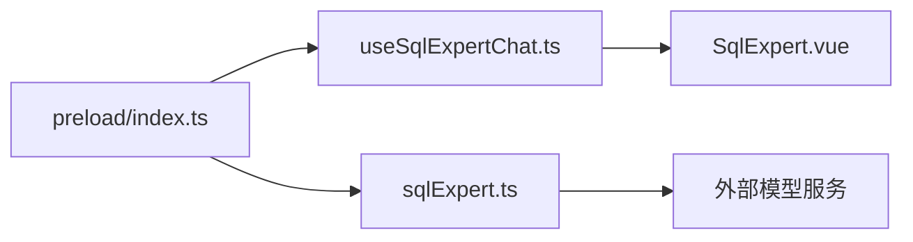

# 流式事件处理

<cite>
**本文引用的文件**
- [src/preload/index.ts](file://src/preload/index.ts)
- [src/preload/index.d.ts](file://src/preload/index.d.ts)
- [src/renderer/src/views/sqlexpert/useSqlExpertChat.ts](file://src/renderer/src/views/sqlexpert/useSqlExpertChat.ts)
- [src/main/services/sqlExpert.ts](file://src/main/services/sqlExpert.ts)
- [src/renderer/src/views/sqlexpert/SqlExpert.vue](file://src/renderer/src/views/sqlexpert/SqlExpert.vue)
</cite>

## 目录
1. [简介](#简介)
2. [项目结构](#项目结构)
3. [核心组件](#核心组件)
4. [架构总览](#架构总览)
5. [详细组件分析](#详细组件分析)
6. [依赖关系分析](#依赖关系分析)
7. [性能考量](#性能考量)
8. [故障排查指南](#故障排查指南)
9. [结论](#结论)
10. [附录](#附录)

## 简介
本文档围绕“流式事件处理”机制，系统性梳理并说明以下能力：
- onAiContent() 内容流监听器的回调参数（requestId、content）
- onAiToolStart() 工具开始监听器的参数结构（id、name、args）
- onAiToolDone() 工具完成监听器的完整参数（requestId、id、name、args、status、result、errorMessage）
- removeAiListeners() 监听器移除机制与内存泄漏防护
- 完整事件处理示例：实时内容展示、工具调用跟踪、错误恢复、性能监控
- 事件流生命周期管理与最佳实践

该机制贯穿主进程（Electron ipcMain）与渲染进程（Vue 组合式 API）之间的 IPC 通信，用于在对话过程中实时接收 AI 的内容增量与工具调用状态变更。

## 项目结构
与流式事件处理直接相关的模块分布如下：
- 预加载层（Preload）：在渲染进程暴露安全 API，封装 ipcRenderer 事件注册与移除
- 渲染层（Renderer）：使用组合式 API 订阅事件，驱动 UI 实时更新
- 主进程（Main）：对接外部模型服务，拆解流式响应，向渲染进程推送事件

**图表来源**
- [src/renderer/src/views/sqlexpert/SqlExpert.vue:1-120](file://src/renderer/src/views/sqlexpert/SqlExpert.vue#L1-L120)
- [src/renderer/src/views/sqlexpert/useSqlExpertChat.ts:282-420](file://src/renderer/src/views/sqlexpert/useSqlExpertChat.ts#L282-L420)
- [src/preload/index.ts:197-212](file://src/preload/index.ts#L197-L212)
- [src/main/services/sqlExpert.ts:1300-1500](file://src/main/services/sqlExpert.ts#L1300-L1500)

**章节来源**
- [src/preload/index.ts:197-212](file://src/preload/index.ts#L197-L212)
- [src/renderer/src/views/sqlexpert/useSqlExpertChat.ts:282-420](file://src/renderer/src/views/sqlexpert/useSqlExpertChat.ts#L282-L420)
- [src/main/services/sqlExpert.ts:1300-1500](file://src/main/services/sqlExpert.ts#L1300-L1500)

## 核心组件
- 预加载桥接（window.api.sqlExpert）
  - 提供 onAiContent、onAiToolStart、onAiToolDone、removeAiListeners 四类事件订阅接口
  - 通过 ipcRenderer.on 注册事件监听，removeAiListeners 统一移除
- 渲染层组合式 API（useSqlExpertChat）
  - 在发起对话时注册上述事件监听，按 requestId 过滤消息，实时更新 Loading 消息与工具调用列表
  - 对话结束后调用 removeAiListeners，避免内存泄漏
- 主进程服务（sqlExpert）
  - 解析流式响应，分发 onAiContent 与 onAiToolStart/onAiToolDone 事件
  - 支持取消请求（AbortSignal），并在 finally 中清理活跃请求映射

**章节来源**
- [src/preload/index.ts:197-212](file://src/preload/index.ts#L197-L212)
- [src/renderer/src/views/sqlexpert/useSqlExpertChat.ts:299-413](file://src/renderer/src/views/sqlexpert/useSqlExpertChat.ts#L299-L413)
- [src/main/services/sqlExpert.ts:676-739](file://src/main/services/sqlExpert.ts#L676-L739)

## 架构总览
下图展示了从渲染层发起请求，到主进程流式响应，再到渲染层事件消费的完整链路。

**图表来源**
- [src/renderer/src/views/sqlexpert/useSqlExpertChat.ts:282-420](file://src/renderer/src/views/sqlexpert/useSqlExpertChat.ts#L282-L420)
- [src/preload/index.ts:197-212](file://src/preload/index.ts#L197-L212)
- [src/main/services/sqlExpert.ts:1300-1500](file://src/main/services/sqlExpert.ts#L1300-L1500)

## 详细组件分析

### 预加载桥接（window.api.sqlExpert）
- onAiContent(callback)
  - 参数：{ requestId: string; content: string }
  - 作用：接收主进程推送的增量内容
- onAiToolStart(callback)
  - 参数：{ requestId: string; id: string; name: string; args: Record<string, unknown> }
  - 作用：工具调用开始，携带工具 id、名称与参数
- onAiToolDone(callback)
  - 参数：{ requestId: string; id: string; name: string; args: Record<string, unknown>; status: string; result: Record<string, unknown>; errorMessage?: string }
  - 作用：工具调用结束，携带状态、结果与可选错误信息
- removeAiListeners()
  - 作用：移除所有上述三类事件监听，防止内存泄漏

以上接口在 preload 层通过 ipcRenderer.on 注册，在渲染层通过 window.api.sqlExpert 使用。

**章节来源**
- [src/preload/index.ts:197-212](file://src/preload/index.ts#L197-L212)
- [src/preload/index.d.ts:367-371](file://src/preload/index.d.ts#L367-L371)

### 渲染层组合式 API（useSqlExpertChat）
- 事件订阅与过滤
  - 在 runAssistantReply 中注册 onAiContent/onAiToolStart/onAiToolDone
  - 通过 requestId 过滤，确保多轮对话互不干扰
- 实时更新
  - onAiContent：替换 Loading 消息的内容
  - onAiToolStart：将工具项加入 Loading 消息的 toolCalls 列表
  - onAiToolDone：更新对应工具项的状态、结果与错误信息
- 生命周期与清理
  - finally 中调用 removeAiListeners，清空事件监听
  - 更新会话时间戳与发送状态

**图表来源**
- [src/renderer/src/views/sqlexpert/useSqlExpertChat.ts:299-413](file://src/renderer/src/views/sqlexpert/useSqlExpertChat.ts#L299-L413)

**章节来源**
- [src/renderer/src/views/sqlexpert/useSqlExpertChat.ts:282-420](file://src/renderer/src/views/sqlexpert/useSqlExpertChat.ts#L282-L420)

### 主进程服务（sqlExpert）
- 流式响应解析
  - 调用外部模型的流式接口，逐块解析 choices.delta.content 与 tool_calls
  - 累积 content 并触发 onContent 回调
  - 合并/插入工具调用（upsertToolCall）
- 事件分发
  - 推送 sql-expert:ai-content（增量内容）
  - 推送 sql-expert:ai-tool-start（工具开始）
  - 推送 sql-expert:ai-tool-done（工具结束，含状态、结果、错误）
- 取消与清理
  - 使用 AbortController 支持取消
  - finally 中从 activeAiRequests 映射中删除 requestId

**图表来源**
- [src/main/services/sqlExpert.ts:676-739](file://src/main/services/sqlExpert.ts#L676-L739)
- [src/main/services/sqlExpert.ts:1300-1500](file://src/main/services/sqlExpert.ts#L1300-L1500)

**章节来源**
- [src/main/services/sqlExpert.ts:676-739](file://src/main/services/sqlExpert.ts#L676-L739)
- [src/main/services/sqlExpert.ts:1300-1500](file://src/main/services/sqlExpert.ts#L1300-L1500)

### UI 展示与工具调用可视化（SqlExpert.vue）
- 分段渲染：将消息内容按工具标记切分为文本段与工具段，交替显示
- 工具调用面板：展开/收起、状态图标、SQL 预览、结果摘要、图表渲染
- 性能指标：累计 tokens 与估算费用展示

**章节来源**
- [src/renderer/src/views/sqlexpert/SqlExpert.vue:90-160](file://src/renderer/src/views/sqlexpert/SqlExpert.vue#L90-L160)
- [src/renderer/src/views/sqlexpert/SqlExpert.vue:650-656](file://src/renderer/src/views/sqlexpert/SqlExpert.vue#L650-L656)

## 依赖关系分析
- 预加载桥接依赖 Electron 的 ipcRenderer，负责事件注册与移除
- 渲染层组合式 API 依赖预加载桥接提供的事件接口
- 主进程服务依赖外部模型 SDK 与 Electron 的 ipcMain，负责事件分发与请求生命周期管理
- UI 层依赖组合式 API 的状态与方法，进行渲染与交互

**图表来源**
- [src/preload/index.ts:197-212](file://src/preload/index.ts#L197-L212)
- [src/renderer/src/views/sqlexpert/useSqlExpertChat.ts:282-420](file://src/renderer/src/views/sqlexpert/useSqlExpertChat.ts#L282-L420)
- [src/main/services/sqlExpert.ts:1300-1500](file://src/main/services/sqlExpert.ts#L1300-L1500)

**章节来源**
- [src/preload/index.ts:197-212](file://src/preload/index.ts#L197-L212)
- [src/renderer/src/views/sqlexpert/useSqlExpertChat.ts:282-420](file://src/renderer/src/views/sqlexpert/useSqlExpertChat.ts#L282-L420)
- [src/main/services/sqlExpert.ts:1300-1500](file://src/main/services/sqlExpert.ts#L1300-L1500)

## 性能考量
- 流式增量渲染：仅在收到增量内容时更新 UI，避免全量重绘
- 工具调用并发：主进程逐个工具执行，避免并发冲突；渲染层维护 activeToolCalls，按 id 同步状态
- 取消与中断：通过 AbortController 与信号量及时终止长耗时请求，释放资源
- 内存泄漏防护：对话结束后统一移除事件监听，清理活跃请求映射

[本节为通用指导，无需特定文件来源]

## 故障排查指南
- 事件未触发
  - 检查是否在发起对话前注册了 onAiContent/onAiToolStart/onAiToolDone
  - 确认 requestId 是否匹配当前会话
  - 确认 removeAiListeners 是否提前调用
- 工具调用状态异常
  - 查看 onAiToolDone 的 status/result/errorMessage 字段
  - 检查工具执行过程中的异常捕获与错误信息透传
- 性能问题
  - 关注 UI 更新频率与工具调用数量
  - 合理限制工具返回行数与图表数据规模
- 取消无效
  - 确认是否正确传递 AbortSignal
  - 检查 finally 中是否清理了 activeAiRequests

**章节来源**
- [src/renderer/src/views/sqlexpert/useSqlExpertChat.ts:299-413](file://src/renderer/src/views/sqlexpert/useSqlExpertChat.ts#L299-L413)
- [src/main/services/sqlExpert.ts:1480-1500](file://src/main/services/sqlExpert.ts#L1480-L1500)

## 结论
该流式事件处理机制通过预加载桥接、渲染层组合式 API 与主进程服务的协同，实现了：
- 实时内容增量展示
- 工具调用的开始/结束状态追踪
- 错误恢复与取消控制
- 生命周期管理与内存泄漏防护

遵循本文档的最佳实践，可在复杂对话场景中保持良好的用户体验与系统稳定性。

[本节为总结，无需特定文件来源]

## 附录

### API 定义与参数说明
- onAiContent
  - 参数：{ requestId: string; content: string }
  - 用途：接收模型的增量内容
- onAiToolStart
  - 参数：{ requestId: string; id: string; name: string; args: Record<string, unknown> }
  - 用途：工具调用开始，携带工具 id、名称与参数
- onAiToolDone
  - 参数：{ requestId: string; id: string; name: string; args: Record<string, unknown>; status: string; result: Record<string, unknown>; errorMessage?: string }
  - 用途：工具调用结束，携带状态、结果与可选错误信息
- removeAiListeners
  - 用途：移除所有上述事件监听，防止内存泄漏

**章节来源**
- [src/preload/index.d.ts:367-371](file://src/preload/index.d.ts#L367-L371)
- [src/preload/index.ts:197-212](file://src/preload/index.ts#L197-L212)

### 事件处理示例（步骤说明）
- 实时内容展示
  - 在 runAssistantReply 中注册 onAiContent
  - 通过 requestId 过滤，更新 Loading 消息的内容
- 工具调用跟踪
  - 注册 onAiToolStart：将工具项加入 toolCalls
  - 注册 onAiToolDone：更新工具项状态、结果与错误信息
- 错误恢复
  - 捕获 askAi 返回的错误，更新 Loading 消息状态为 error
  - 可结合取消功能（cancelAskAi）中断长时间任务
- 性能监控
  - 使用 usage 字段（promptTokens/completionTokens/totalTokens 等）计算费用与统计
  - 在 finally 中统一移除监听，避免内存泄漏

**章节来源**
- [src/renderer/src/views/sqlexpert/useSqlExpertChat.ts:282-420](file://src/renderer/src/views/sqlexpert/useSqlExpertChat.ts#L282-L420)
- [src/renderer/src/views/sqlexpert/SqlExpert.vue:650-656](file://src/renderer/src/views/sqlexpert/SqlExpert.vue#L650-L656)