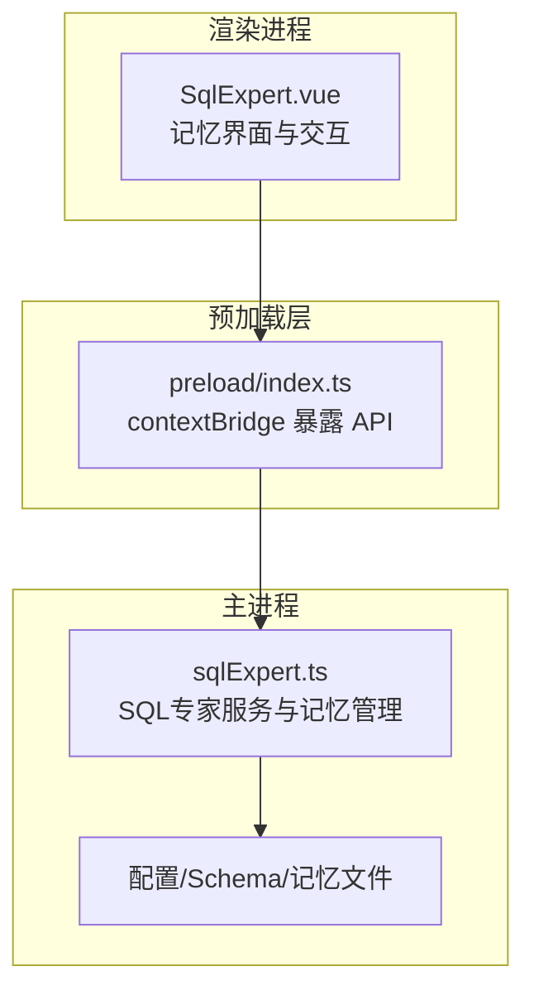
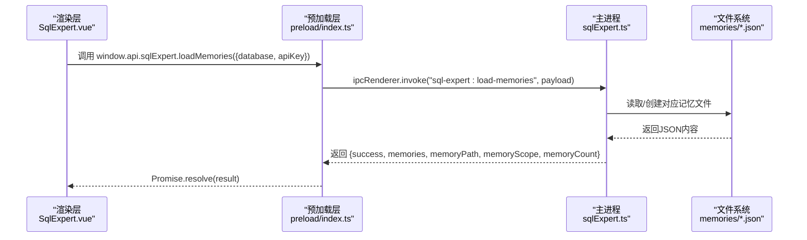
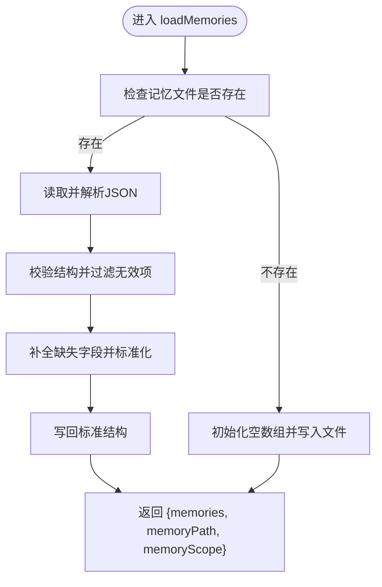
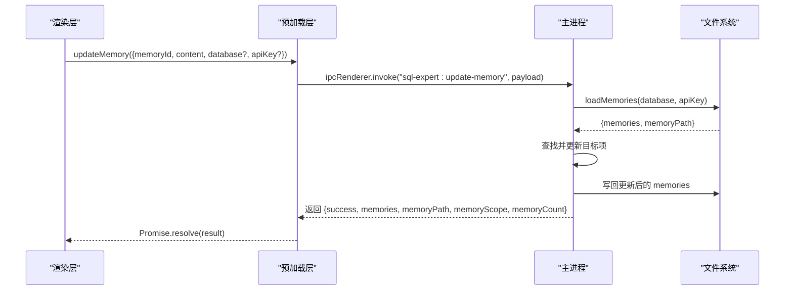
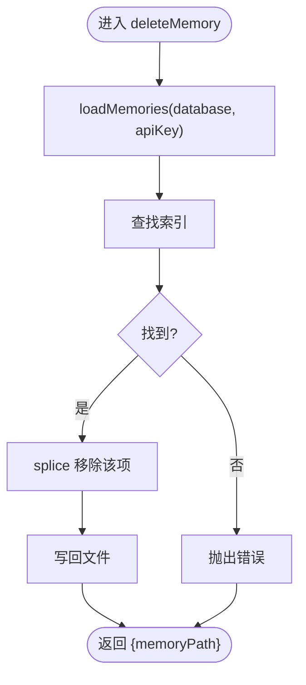
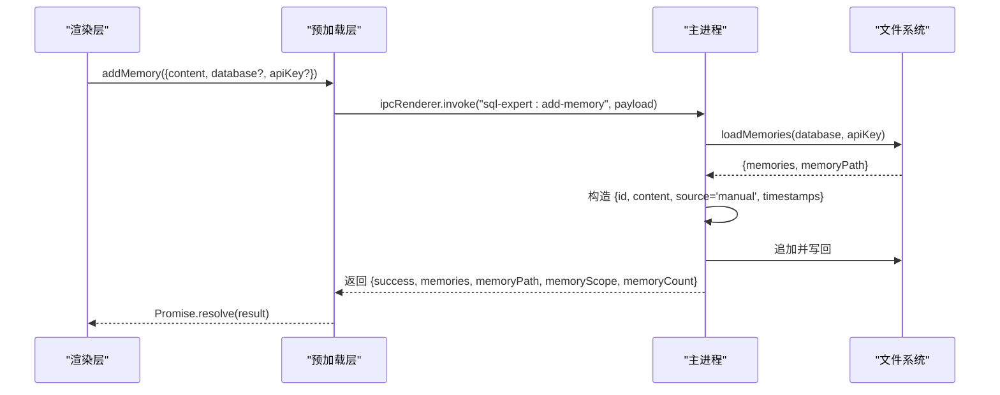
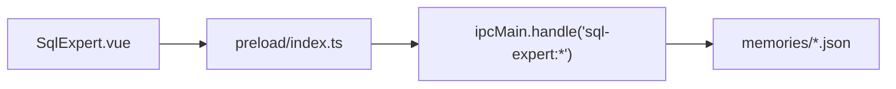

# 记忆管理

<cite>
**本文引用的文件**
- [src/main/services/sqlExpert.ts](file://src/main/services/sqlExpert.ts)
- [src/preload/index.ts](file://src/preload/index.ts)
- [src/renderer/src/views/sqlexpert/SqlExpert.vue](file://src/renderer/src/views/sqlexpert/SqlExpert.vue)
- [src/renderer/src/types.d.ts](file://src/renderer/src/types.d.ts)
- [src/main/index.ts](file://src/main/index.ts)
</cite>

## 目录
1. [简介](#简介)
2. [项目结构](#项目结构)
3. [核心组件](#核心组件)
4. [架构总览](#架构总览)
5. [详细组件分析](#详细组件分析)
6. [依赖关系分析](#依赖关系分析)
7. [性能考量](#性能考量)
8. [故障排查指南](#故障排查指南)
9. [结论](#结论)
10. [附录](#附录)

## 简介
本文件面向“记忆管理”功能，提供完整的API文档与实现解析，覆盖以下关键点：
- loadMemories() 加载记忆的方法签名与过滤条件
- updateMemory() 更新记忆的参数结构（memoryId、content、database、apiKey）
- deleteMemory() 删除记忆的删除策略
- addMemory() 添加记忆的内容格式要求
- 记忆数据的持久化机制、访问权限控制与数据同步策略
- 记忆管理示例：记忆分类、检索优化、批量操作与数据备份恢复
- 性能优化与存储容量管理

## 项目结构
记忆管理位于“企业级分析专家”子系统中，采用主进程IPC + 渲染进程桥接的模式：
- 主进程负责：配置与Schema持久化、记忆文件读写、AI工具调用与系统提示词构建
- 预加载层负责：向渲染进程暴露安全的API桥接
- 渲染层负责：UI交互、记忆编辑与调用记忆管理API

**图表来源**
- [src/renderer/src/views/sqlexpert/SqlExpert.vue:367-422](file://src/renderer/src/views/sqlexpert/SqlExpert.vue#L367-L422)
- [src/preload/index.ts:156-212](file://src/preload/index.ts#L156-L212)
- [src/main/services/sqlExpert.ts:968-1502](file://src/main/services/sqlExpert.ts#L968-L1502)

**章节来源**
- [src/main/services/sqlExpert.ts:968-1502](file://src/main/services/sqlExpert.ts#L968-L1502)
- [src/preload/index.ts:156-212](file://src/preload/index.ts#L156-L212)
- [src/renderer/src/views/sqlexpert/SqlExpert.vue:367-422](file://src/renderer/src/views/sqlexpert/SqlExpert.vue#L367-L422)

## 核心组件
- 记忆数据模型：MemoryEntry
  - 字段：id、content、createdAt、updatedAt、source
  - source枚举：'tool' | 'manual'
- 记忆文件组织：按 database + apiKey 的哈希组合命名，统一存放在 userData/sql-expert/memories 下
- 记忆作用域：buildMemoryScope(database, apiKey) 生成唯一作用域标识，确保不同数据库/密钥下的记忆隔离
- 主要API（IPC）：
  - sql-expert:load-memories
  - sql-expert:update-memory
  - sql-expert:delete-memory
  - sql-expert:add-memory

**章节来源**
- [src/main/services/sqlExpert.ts:72-78](file://src/main/services/sqlExpert.ts#L72-L78)
- [src/main/services/sqlExpert.ts:128-137](file://src/main/services/sqlExpert.ts#L128-L137)
- [src/main/services/sqlExpert.ts:1077-1156](file://src/main/services/sqlExpert.ts#L1077-L1156)

## 架构总览
记忆管理的端到端流程如下：

**图表来源**
- [src/renderer/src/views/sqlexpert/SqlExpert.vue:755-769](file://src/renderer/src/views/sqlexpert/SqlExpert.vue#L755-L769)
- [src/preload/index.ts:184-185](file://src/preload/index.ts#L184-L185)
- [src/main/services/sqlExpert.ts:1077-1105](file://src/main/services/sqlExpert.ts#L1077-L1105)

## 详细组件分析

### loadMemories() 加载记忆
- 方法签名与参数
  - 参数：payload?: { database?: string; apiKey?: string }
  - 返回：{ success, memories, memoryPath, memoryScope, memoryCount }
- 过滤与兼容
  - 仅保留 content 为字符串的项
  - 自动补全缺失字段（id、createdAt、updatedAt、source）
  - 兼容手工编辑：统一写回标准结构，便于后续增量追加
- 文件定位
  - 路径：userData/sql-expert/memories/{scope}.json
  - scope 由 database 与 apiKey 哈希组合生成
- 错误处理
  - 缺少 database 或 apiKey 时抛错
  - 文件不存在则初始化为空数组

**图表来源**
- [src/main/services/sqlExpert.ts:172-214](file://src/main/services/sqlExpert.ts#L172-L214)

**章节来源**
- [src/main/services/sqlExpert.ts:1077-1105](file://src/main/services/sqlExpert.ts#L1077-L1105)
- [src/main/services/sqlExpert.ts:172-214](file://src/main/services/sqlExpert.ts#L172-L214)

### updateMemory() 更新记忆
- 参数结构
  - payload: { memoryId: string; content: string; database?: string; apiKey?: string }
- 行为
  - 根据 database + apiKey 定位记忆文件
  - 查找匹配 id 的记忆项并更新 content 与 updatedAt
  - 写回文件
- 错误处理
  - 未找到 id 抛错
  - 缺少必要参数抛错

**图表来源**
- [src/preload/index.ts:186-189](file://src/preload/index.ts#L186-L189)
- [src/main/services/sqlExpert.ts:1107-1122](file://src/main/services/sqlExpert.ts#L1107-L1122)

**章节来源**
- [src/main/services/sqlExpert.ts:1107-1122](file://src/main/services/sqlExpert.ts#L1107-L1122)
- [src/renderer/src/views/sqlexpert/SqlExpert.vue:755-769](file://src/renderer/src/views/sqlexpert/SqlExpert.vue#L755-L769)

### deleteMemory() 删除记忆
- 参数结构
  - payload: { memoryId: string; database?: string; apiKey?: string }
- 行为
  - 根据 database + apiKey 定位记忆文件
  - 查找并移除匹配 id 的记忆项
  - 写回文件
- 错误处理
  - 未找到 id 抛错
  - 缺少必要参数抛错

**图表来源**
- [src/main/services/sqlExpert.ts:242-249](file://src/main/services/sqlExpert.ts#L242-L249)

**章节来源**
- [src/main/services/sqlExpert.ts:1124-1139](file://src/main/services/sqlExpert.ts#L1124-L1139)
- [src/renderer/src/views/sqlexpert/SqlExpert.vue:772-791](file://src/renderer/src/views/sqlexpert/SqlExpert.vue#L772-L791)

### addMemory() 添加记忆
- 参数结构
  - payload: { content: string; database?: string; apiKey?: string }
- 行为
  - 标准化 content（去除首尾空白）
  - 以 'manual' 来源写入新记忆项
  - 写回文件
- 错误处理
  - 缺少必要参数抛错
  - 内容为空抛错

**图表来源**
- [src/preload/index.ts:190-191](file://src/preload/index.ts#L190-L191)
- [src/main/services/sqlExpert.ts:1141-1156](file://src/main/services/sqlExpert.ts#L1141-L1156)

**章节来源**
- [src/main/services/sqlExpert.ts:1141-1156](file://src/main/services/sqlExpert.ts#L1141-L1156)
- [src/renderer/src/views/sqlexpert/SqlExpert.vue:800-810](file://src/renderer/src/views/sqlexpert/SqlExpert.vue#L800-L810)

### 记忆数据持久化机制
- 文件位置
  - userData/sql-expert/memories/{scope}.json
  - scope = sanitizeFileName(database) + "__" + sha256(apiKey).slice(0,24)
- 结构
  - 数组或对象中的 memories 字段
  - 每项标准化为 MemoryEntry
- 兼容性
  - 自动修复手工编辑导致的结构差异，统一写回标准结构

**章节来源**
- [src/main/services/sqlExpert.ts:112-137](file://src/main/services/sqlExpert.ts#L112-L137)
- [src/main/services/sqlExpert.ts:172-214](file://src/main/services/sqlExpert.ts#L172-L214)

### 访问权限控制
- 作用域隔离
  - 不同 database + apiKey 组合对应独立记忆文件，天然隔离
- 参数校验
  - 所有IPC入口均校验 database 与 apiKey 是否存在
- UI层面
  - 渲染层在调用API前收集数据库与AI密钥信息，确保调用有效

**章节来源**
- [src/main/services/sqlExpert.ts:1077-1156](file://src/main/services/sqlExpert.ts#L1077-L1156)
- [src/renderer/src/views/sqlexpert/SqlExpert.vue:755-769](file://src/renderer/src/views/sqlexpert/SqlExpert.vue#L755-L769)

### 数据同步策略
- 即时写入
  - 每次增删改均立即写回文件，保证一致性
- 读写流程
  - 读取 -> 修改 -> 写回，避免并发冲突
- 建议
  - 大量批量操作时，可在渲染层合并后再调用一次写入，减少IO次数

**章节来源**
- [src/main/services/sqlExpert.ts:216-264](file://src/main/services/sqlExpert.ts#L216-L264)

### 记忆分类与检索优化
- 分类
  - source 字段区分 'tool'（AI自动沉淀）与 'manual'（用户手动新增）
- 检索
  - 当前实现为内存数组遍历，适合中小规模记忆
  - 优化建议
    - 增加 content 关键词索引（如倒排索引）
    - 支持按 source/source 组合过滤
    - 支持按时间范围过滤
    - 支持分页与排序（createdAt/updatedAt）

**章节来源**
- [src/main/services/sqlExpert.ts:72-78](file://src/main/services/sqlExpert.ts#L72-L78)
- [src/main/services/sqlExpert.ts:172-214](file://src/main/services/sqlExpert.ts#L172-L214)

### 批量操作与数据备份恢复
- 批量操作
  - 当前API未提供批量增删改接口，可通过渲染层循环调用实现
- 备份
  - 备份路径：userData/sql-expert/memories/
  - 建议定期复制该目录到外部存储
- 恢复
  - 将备份文件放回原路径，重启应用后自动加载
  - 注意：恢复前应确保 database 与 apiKey 与备份时一致

**章节来源**
- [src/main/services/sqlExpert.ts:112-137](file://src/main/services/sqlExpert.ts#L112-L137)

## 依赖关系分析
- 渲染层依赖预加载层提供的API桥接
- 预加载层依赖主进程IPC注册
- 主进程依赖文件系统进行持久化
- 记忆文件依赖配置（database、apiKey）进行作用域隔离

**图表来源**
- [src/renderer/src/views/sqlexpert/SqlExpert.vue:755-769](file://src/renderer/src/views/sqlexpert/SqlExpert.vue#L755-L769)
- [src/preload/index.ts:184-191](file://src/preload/index.ts#L184-L191)
- [src/main/services/sqlExpert.ts:1077-1156](file://src/main/services/sqlExpert.ts#L1077-L1156)

**章节来源**
- [src/renderer/src/types.d.ts:234-265](file://src/renderer/src/types.d.ts#L234-L265)
- [src/preload/index.ts:156-212](file://src/preload/index.ts#L156-L212)
- [src/main/services/sqlExpert.ts:968-1502](file://src/main/services/sqlExpert.ts#L968-L1502)

## 性能考量
- IO成本
  - 每次增删改均触发文件写入，建议在渲染层合并操作
- 内存占用
  - loadMemories 会将整个文件读入内存，建议限制单文件大小
- 并发风险
  - 当前实现非事务性，建议在渲染层串行化调用
- 索引与搜索
  - 当前为线性扫描，建议引入关键词索引与分页

[本节为通用性能建议，无需特定文件来源]

## 故障排查指南
- 常见错误
  - 缺少 database 或 apiKey：检查配置是否正确保存
  - 记忆ID不存在：确认ID是否正确或已被删除
  - 文件读写异常：检查 userData 目录权限与磁盘空间
- 排查步骤
  - 在渲染层打印调用参数与返回值
  - 检查主进程日志输出
  - 手动打开记忆文件确认结构与内容
- 临时修复
  - 重新保存配置以重建连接池
  - 手工修复记忆文件结构后重启应用

**章节来源**
- [src/main/services/sqlExpert.ts:1077-1156](file://src/main/services/sqlExpert.ts#L1077-L1156)

## 结论
记忆管理功能通过明确的作用域隔离、即时写入与兼容性修复，提供了稳定可靠的记忆持久化能力。当前API简洁直观，适合中小规模使用；对于大规模场景，建议引入索引、分页与批量操作以提升性能与可用性。

[本节为总结性内容，无需特定文件来源]

## 附录

### API参考（方法签名与参数）
- loadMemories(payload?: { database?: string; apiKey?: string }): Promise<{ success, memories, memoryPath, memoryScope, memoryCount }>
- updateMemory(payload: { memoryId: string; content: string; database?: string; apiKey?: string }): Promise<{ success, memories, memoryPath, memoryScope, memoryCount }>
- deleteMemory(payload: { memoryId: string; database?: string; apiKey?: string }): Promise<{ success, memories, memoryPath, memoryScope, memoryCount }>
- addMemory(payload: { content: string; database?: string; apiKey?: string }): Promise<{ success, memories, memoryPath, memoryScope, memoryCount }>

**章节来源**
- [src/renderer/src/types.d.ts:234-265](file://src/renderer/src/types.d.ts#L234-L265)
- [src/preload/index.ts:184-191](file://src/preload/index.ts#L184-L191)
- [src/main/services/sqlExpert.ts:1077-1156](file://src/main/services/sqlExpert.ts#L1077-L1156)