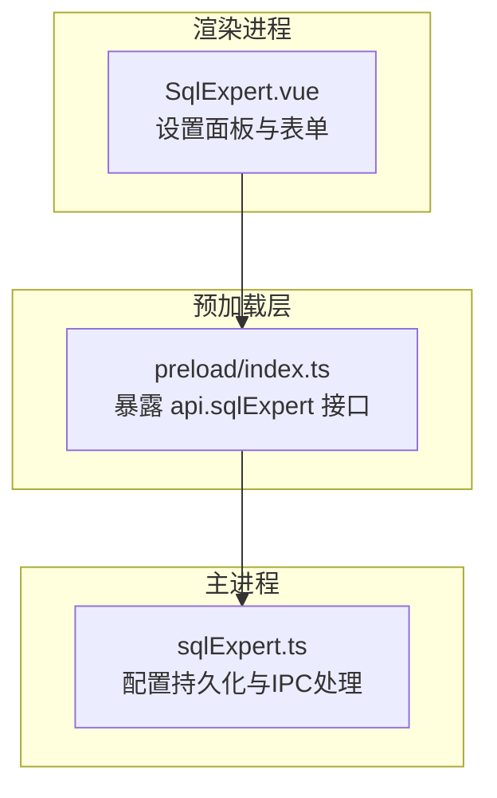
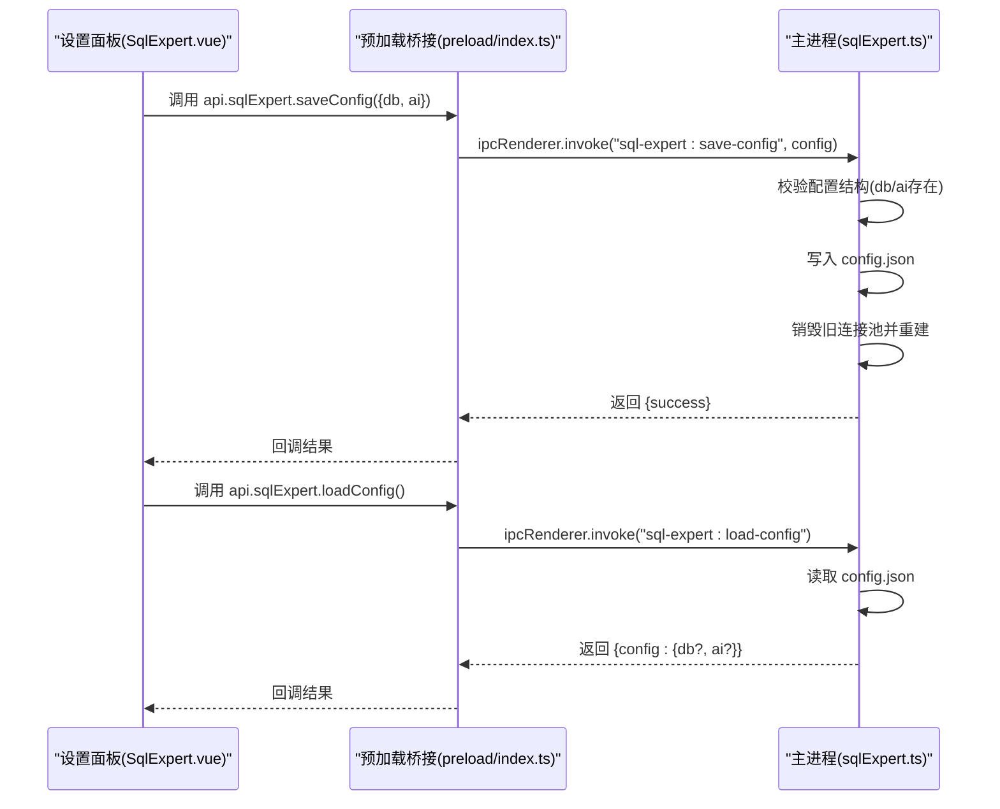
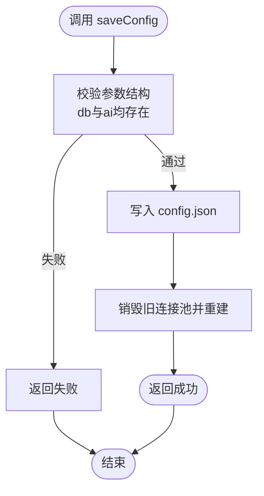
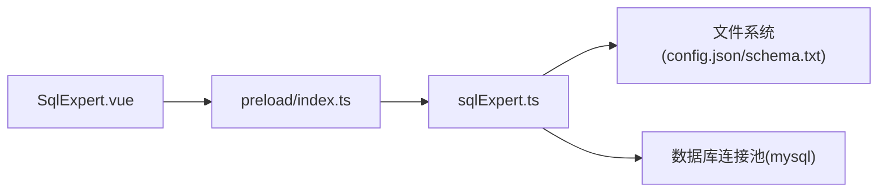

# 配置管理

<cite>
**本文档引用的文件**
- [src/main/services/sqlExpert.ts](file://src/main/services/sqlExpert.ts)
- [src/preload/index.ts](file://src/preload/index.ts)
- [src/renderer/src/views/sqlexpert/SqlExpert.vue](file://src/renderer/src/views/sqlexpert/SqlExpert.vue)
- [src/renderer/src/types.d.ts](file://src/renderer/src/types.d.ts)
</cite>

## 目录
1. [简介](#简介)
2. [项目结构](#项目结构)
3. [核心组件](#核心组件)
4. [架构总览](#架构总览)
5. [详细组件分析](#详细组件分析)
6. [依赖关系分析](#依赖关系分析)
7. [性能考量](#性能考量)
8. [故障排查指南](#故障排查指南)
9. [结论](#结论)
10. [附录](#附录)

## 简介
本文件面向“配置管理”功能，聚焦于数据库配置与AI配置的保存与加载流程，覆盖以下关键点：
- saveConfig() 方法参数与行为
- loadConfig() 返回值结构
- 配置文件的存储位置与格式
- 数据库配置与AI配置的验证规则
- 配置迁移、默认值、加密与版本兼容策略
- 配置热更新与冲突解决方案

## 项目结构
配置管理相关代码分布在主进程服务层、预加载桥接层与渲染层视图组件中，形成“IPC桥接 + 主进程持久化”的典型架构。

**图表来源**
- [src/renderer/src/views/sqlexpert/SqlExpert.vue](file://src/renderer/src/views/sqlexpert/SqlExpert.vue)
- [src/preload/index.ts](file://src/preload/index.ts)
- [src/main/services/sqlExpert.ts](file://src/main/services/sqlExpert.ts)

**章节来源**
- [src/renderer/src/views/sqlexpert/SqlExpert.vue](file://src/renderer/src/views/sqlexpert/SqlExpert.vue)
- [src/preload/index.ts](file://src/preload/index.ts)
- [src/main/services/sqlExpert.ts](file://src/main/services/sqlExpert.ts)

## 核心组件
- 配置类型定义
  - 数据库配置(DbConfig)：host、port、user、password、database
  - AI配置(AiConfig)：url、apiKey、model
  - 组合配置(SqlExpertConfig)：db与ai两部分
- 主进程持久化
  - 配置文件路径：应用用户数据目录下的“sql-expert/config.json”
  - Schema文件：应用用户数据目录下的“sql-expert/schema.txt”
  - 记忆文件：应用用户数据目录下的“sql-expert/memories/{scope}.json”
- IPC接口
  - 渲染层通过preload暴露的api.sqlExpert.saveConfig/loadConfig与主进程通信
  - 主进程处理saveConfig并触发连接池重建

**章节来源**
- [src/main/services/sqlExpert.ts](file://src/main/services/sqlExpert.ts)
- [src/preload/index.ts](file://src/preload/index.ts)
- [src/renderer/src/views/sqlexpert/SqlExpert.vue](file://src/renderer/src/views/sqlexpert/SqlExpert.vue)

## 架构总览
配置管理采用“渲染层表单 -> 预加载桥接 -> 主进程持久化/校验”的分层设计，确保UI交互与数据持久化解耦。

**图表来源**
- [src/renderer/src/views/sqlexpert/SqlExpert.vue](file://src/renderer/src/views/sqlexpert/SqlExpert.vue)
- [src/preload/index.ts](file://src/preload/index.ts)
- [src/main/services/sqlExpert.ts](file://src/main/services/sqlExpert.ts)

## 详细组件分析

### 1) saveConfig() 方法参数与行为
- 参数结构
  - db: { host, port, user, password, database }
  - ai: { url, apiKey, model }
- 行为
  - 主进程接收配置后，进行结构完整性校验（db与ai均存在）
  - 将配置序列化写入“config.json”
  - 触发数据库连接池销毁与重建，确保新配置生效
  - 返回布尔结果标识保存是否成功

**图表来源**
- [src/main/services/sqlExpert.ts](file://src/main/services/sqlExpert.ts)
- [src/preload/index.ts](file://src/preload/index.ts)

**章节来源**
- [src/main/services/sqlExpert.ts](file://src/main/services/sqlExpert.ts)
- [src/preload/index.ts](file://src/preload/index.ts)

### 2) loadConfig() 返回值结构
- 返回值包含：
  - config: { db?: DbConfig, ai?: AiConfig }
- 若磁盘不存在配置文件或解析失败，返回空配置
- 渲染层在挂载时调用loadConfig，将已有配置合并到表单

**章节来源**
- [src/main/services/sqlExpert.ts](file://src/main/services/sqlExpert.ts)
- [src/renderer/src/views/sqlexpert/SqlExpert.vue](file://src/renderer/src/views/sqlexpert/SqlExpert.vue)
- [src/renderer/src/types.d.ts](file://src/renderer/src/types.d.ts)

### 3) 配置文件存储位置与格式
- 存储位置
  - 配置文件：应用用户数据目录/sql-expert/config.json
  - Schema文件：应用用户数据目录/sql-expert/schema.txt
  - 记忆文件：应用用户数据目录/sql-expert/memories/{scope}.json
- 文件格式
  - config.json：JSON对象，包含db与ai字段
  - schema.txt：纯文本，包含数据库表清单
  - memory文件：JSON数组，每条记忆包含id、content、createdAt、updatedAt、source

**章节来源**
- [src/main/services/sqlExpert.ts](file://src/main/services/sqlExpert.ts)

### 4) 验证规则
- 结构完整性
  - 保存时要求db与ai字段均存在，否则拒绝保存
- 数据库连接测试
  - 提供独立的测试接口，连接超时与异常会被捕获并反馈
- SQL执行限制
  - 仅允许只读查询（SELECT/ WITH ... SELECT），禁止DDL/DML/系统库访问
  - 禁止SELECT *，要求显式使用AS别名
- AI余额检查
  - 支持通过API Key查询账户余额，若为空则提示

**章节来源**
- [src/main/services/sqlExpert.ts](file://src/main/services/sqlExpert.ts)

### 5) 配置迁移、默认值、加密与版本兼容
- 迁移与兼容
  - 读取配置时若文件缺失或解析异常，返回空配置，避免崩溃
  - 记忆文件加载时若格式不符，会重写为标准结构，实现向后兼容
- 默认值
  - 渲染层设置表单默认值（如AI URL、模型名），但不会写入磁盘
- 加密
  - 代码中未发现对配置文件的加密处理
- 版本兼容
  - 通过“兼容写回”策略（如记忆文件标准化）保障不同版本间的配置可用性

**章节来源**
- [src/main/services/sqlExpert.ts](file://src/main/services/sqlExpert.ts)
- [src/renderer/src/views/sqlexpert/SqlExpert.vue](file://src/renderer/src/views/sqlexpert/SqlExpert.vue)

### 6) 配置热更新与冲突解决
- 热更新
  - 保存配置后，主进程销毁旧连接池并重建，使新配置立即生效
- 冲突解决
  - 保存流程为原子写入（先校验再写入），避免半成品配置导致异常
  - 记忆文件采用“读取 -> 标准化 -> 写回”的策略，防止手工编辑破坏结构

**章节来源**
- [src/main/services/sqlExpert.ts](file://src/main/services/sqlExpert.ts)

## 依赖关系分析
- 渲染层依赖预加载桥接层提供的api.sqlExpert接口
- 预加载桥接层依赖Electron IPC与主进程注册的处理函数
- 主进程服务层负责文件系统IO与数据库连接池管理

**图表来源**
- [src/renderer/src/views/sqlexpert/SqlExpert.vue](file://src/renderer/src/views/sqlexpert/SqlExpert.vue)
- [src/preload/index.ts](file://src/preload/index.ts)
- [src/main/services/sqlExpert.ts](file://src/main/services/sqlExpert.ts)

**章节来源**
- [src/renderer/src/views/sqlexpert/SqlExpert.vue](file://src/renderer/src/views/sqlexpert/SqlExpert.vue)
- [src/preload/index.ts](file://src/preload/index.ts)
- [src/main/services/sqlExpert.ts](file://src/main/services/sqlExpert.ts)

## 性能考量
- 配置读写为轻量JSON操作，对性能影响极小
- 连接池重建仅在配置变更时触发，避免频繁重建
- SQL执行前的解析与校验在主进程完成，减少无效请求

## 故障排查指南
- 保存失败
  - 检查db与ai字段是否完整
  - 查看主进程返回的错误信息
- 连接失败
  - 使用“测试链接”按钮验证主机、端口、账号与数据库
- 余额查询失败
  - 确认API Key非空，检查网络与URL
- 记忆文件异常
  - 主进程会自动标准化记忆文件，若仍异常，可删除对应文件后重试

**章节来源**
- [src/main/services/sqlExpert.ts](file://src/main/services/sqlExpert.ts)
- [src/renderer/src/views/sqlexpert/SqlExpert.vue](file://src/renderer/src/views/sqlexpert/SqlExpert.vue)

## 结论
本配置管理方案以简洁的JSON文件为核心，结合IPC桥接与主进程持久化，实现了数据库与AI配置的可靠保存与加载。通过严格的结构校验、连接池热更新与兼容性写回策略，确保了配置变更的稳定性与向前兼容性。对于加密与更复杂的迁移场景，可在现有基础上扩展。

## 附录

### API定义与调用示例

- 保存配置
  - 调用方：渲染层
  - 接口：api.sqlExpert.saveConfig({ db, ai })
  - 行为：校验 -> 写入 -> 重建连接池 -> 返回结果
  - 示例路径：[保存设置按钮事件](file://src/renderer/src/views/sqlexpert/SqlExpert.vue)

- 加载配置
  - 调用方：渲染层
  - 接口：api.sqlExpert.loadConfig()
  - 返回：{ config: { db?, ai? } }
  - 示例路径：[挂载时加载配置](file://src/renderer/src/views/sqlexpert/SqlExpert.vue)

- 配置类型
  - DbConfig：host、port、user、password、database
  - AiConfig：url、apiKey、model
  - SqlExpertConfig：db与ai组合
  - 示例路径：[类型定义](file://src/main/services/sqlExpert.ts)

- 存储位置
  - config.json：应用用户数据目录/sql-expert/config.json
  - schema.txt：应用用户数据目录/sql-expert/schema.txt
  - memory文件：应用用户数据目录/sql-expert/memories/{scope}.json
  - 示例路径：[路径构建](file://src/main/services/sqlExpert.ts)