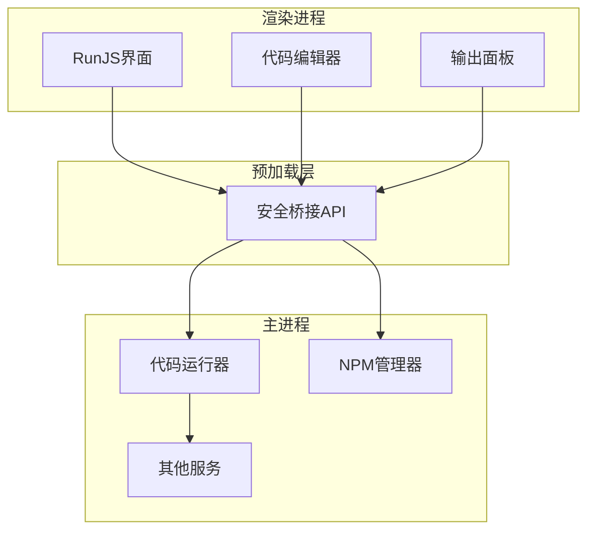
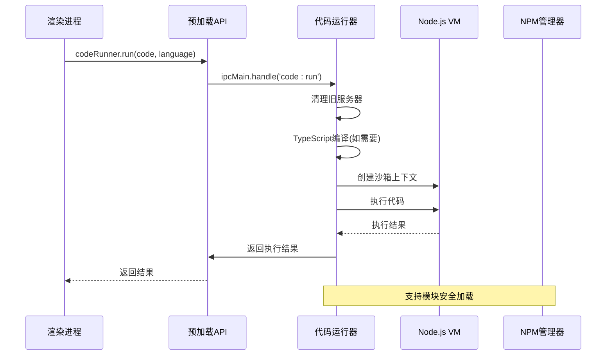
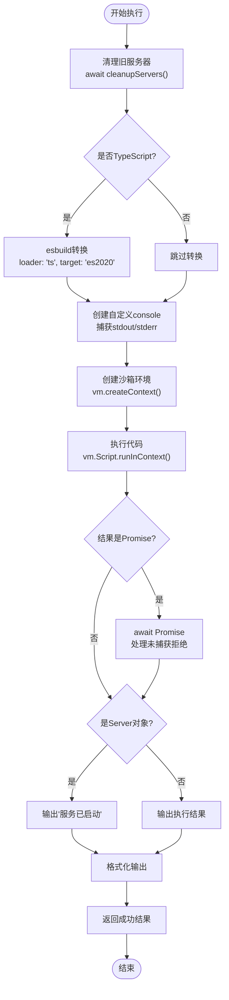
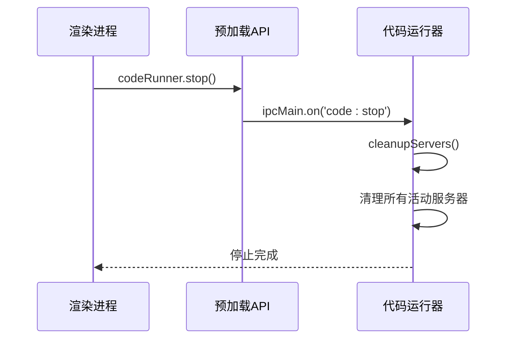
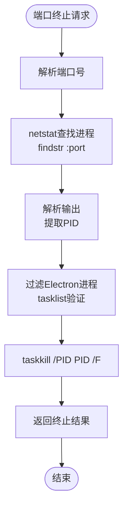
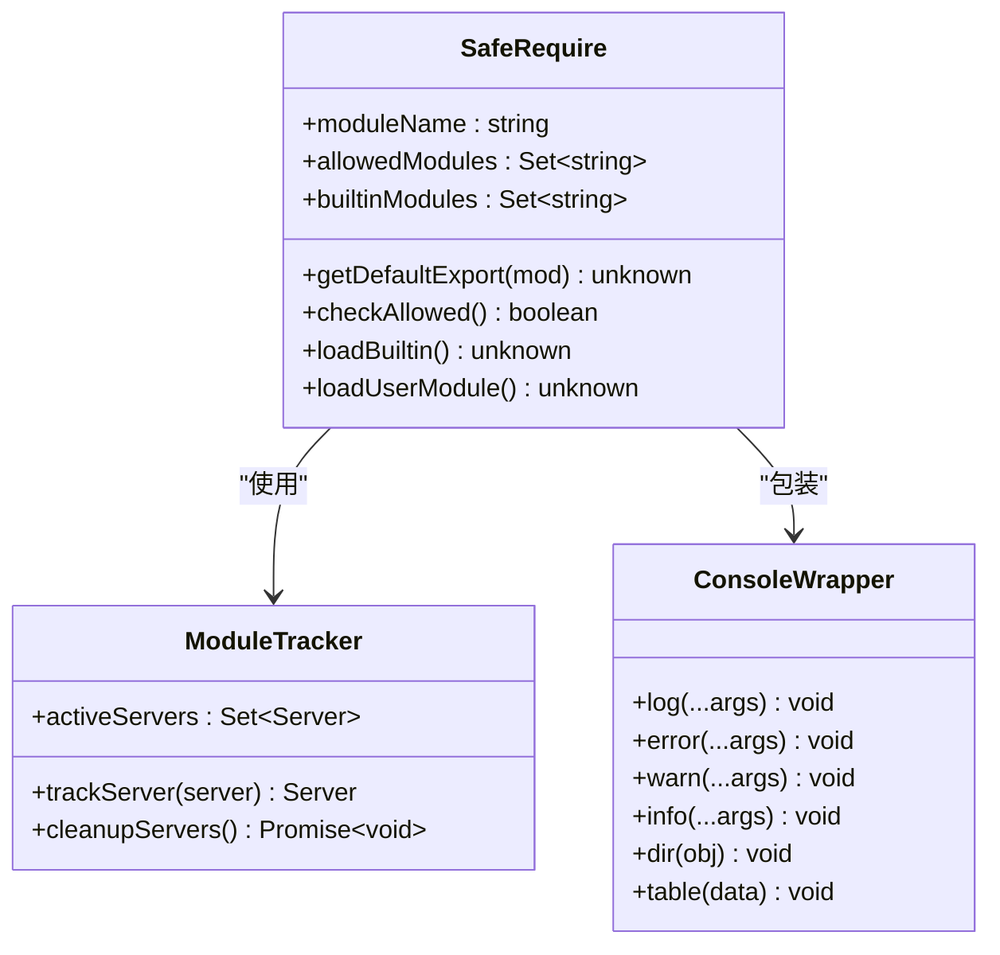
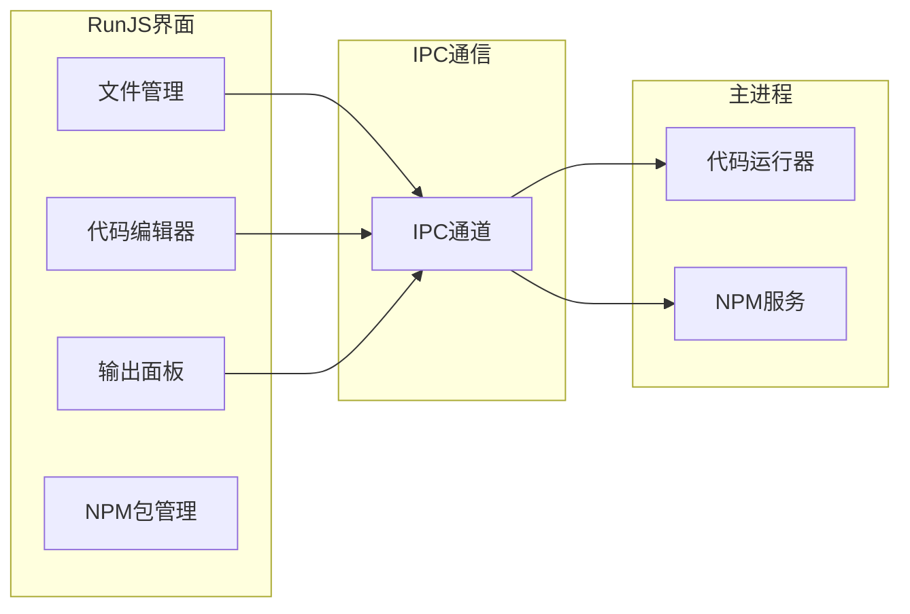

# 代码运行API

<cite>
**本文档引用的文件**
- [codeRunner.ts](file://src/main/services/codeRunner.ts)
- [index.ts](file://src/main/index.ts)
- [index.ts](file://src/preload/index.ts)
- [RunJS.vue](file://src/renderer/src/views/runjs/RunJS.vue)
- [CodeEditor.vue](file://src/renderer/src/views/runjs/components/CodeEditor.vue)
- [OutputPanel.vue](file://src/renderer/src/views/runjs/components/OutputPanel.vue)
- [npmManager.ts](file://src/main/services/npmManager.ts)
- [monacoSetup.ts](file://src/renderer/src/utils/monacoSetup.ts)
- [package.json](file://package.json)
</cite>

## 目录
1. [简介](#简介)
2. [项目结构](#项目结构)
3. [核心组件](#核心组件)
4. [架构概览](#架构概览)
5. [详细组件分析](#详细组件分析)
6. [依赖关系分析](#依赖关系分析)
7. [性能考量](#性能考量)
8. [故障排除指南](#故障排除指南)
9. [结论](#结论)

## 简介
本文档为代码运行API提供全面的接口文档，重点覆盖codeRunner对象下的代码执行功能。该API支持JavaScript和TypeScript语言，提供异步执行模式、执行上下文管理、资源清理机制，并包含错误处理、超时控制和性能监控的实现指南。同时涵盖沙箱执行的安全考虑和最佳实践。

## 项目结构
代码运行API位于Electron应用的主进程中，通过IPC通道与渲染进程交互。项目采用分层架构设计：



**图表来源**
- [index.ts:421-428](file://src/main/index.ts#L421-L428)
- [index.ts:62-85](file://src/preload/index.ts#L62-L85)

**章节来源**
- [index.ts:1-444](file://src/main/index.ts#L1-L444)
- [index.ts:1-229](file://src/preload/index.ts#L1-L229)

## 核心组件
代码运行API的核心组件包括：

### 1. 代码运行器（CodeRunner）
- 支持JavaScript和TypeScript代码执行
- 提供沙箱执行环境
- 实时输出捕获和格式化
- 资源清理和端口管理

### 2. 预加载API桥接
- 安全的IPC通信封装
- 类型安全的API暴露
- 异步操作支持

### 3. 渲染进程集成
- RunJS界面组件
- 代码编辑器集成
- 实时输出展示

**章节来源**
- [codeRunner.ts:14-461](file://src/main/services/codeRunner.ts#L14-L461)
- [index.ts:62-85](file://src/preload/index.ts#L62-L85)
- [RunJS.vue:1-353](file://src/renderer/src/views/runjs/RunJS.vue#L1-L353)

## 架构概览
代码运行API采用分层架构，确保安全性、可维护性和扩展性：



**图表来源**
- [codeRunner.ts:98-235](file://src/main/services/codeRunner.ts#L98-L235)
- [index.ts:62-69](file://src/preload/index.ts#L62-L69)

## 详细组件分析

### 代码运行器核心功能

#### run()方法 - 代码执行
run()方法是代码运行API的核心，负责完整的代码执行流程：



**图表来源**
- [codeRunner.ts:106-234](file://src/main/services/codeRunner.ts#L106-L234)

#### stop()方法 - 停止执行
stop()方法提供优雅的资源清理机制：



**图表来源**
- [codeRunner.ts:237-240](file://src/main/services/codeRunner.ts#L237-L240)

#### clean()方法 - 清理环境
clean()方法提供手动资源清理功能：

**章节来源**
- [codeRunner.ts:242-246](file://src/main/services/codeRunner.ts#L242-L246)

#### killPort()方法 - 端口终止
killPort()方法支持根据端口号终止进程：



**图表来源**
- [codeRunner.ts:248-317](file://src/main/services/codeRunner.ts#L248-L317)

### 沙箱执行与安全机制

#### 模块安全加载
代码运行器实现了严格的模块安全加载机制：



**图表来源**
- [codeRunner.ts:364-460](file://src/main/services/codeRunner.ts#L364-L460)
- [codeRunner.ts:29-96](file://src/main/services/codeRunner.ts#L29-L96)

#### 上下文隔离
代码运行器创建独立的执行上下文，确保安全性：

**章节来源**
- [codeRunner.ts:141-181](file://src/main/services/codeRunner.ts#L141-L181)

### 渲染进程集成

#### RunJS界面组件
RunJS界面提供了完整的代码运行体验：



**图表来源**
- [RunJS.vue:1-353](file://src/renderer/src/views/runjs/RunJS.vue#L1-L353)
- [CodeEditor.vue:1-556](file://src/renderer/src/views/runjs/components/CodeEditor.vue#L1-L556)
- [OutputPanel.vue:1-250](file://src/renderer/src/views/runjs/components/OutputPanel.vue#L1-L250)

**章节来源**
- [RunJS.vue:151-181](file://src/renderer/src/views/runjs/RunJS.vue#L151-L181)
- [CodeEditor.vue:194-216](file://src/renderer/src/views/runjs/components/CodeEditor.vue#L194-L216)
- [OutputPanel.vue:34-56](file://src/renderer/src/views/runjs/components/OutputPanel.vue#L34-L56)

## 依赖关系分析

### 外部依赖
代码运行API依赖以下关键模块：

```mermaid
graph TB
subgraph "核心依赖"
VM[vm模块] : Node.js内置
ESBuild[esbuild] : TypeScript编译
HTTP[http模块] : 网络服务
HTTPS[https模块] : 安全网络
NET[net模块] : TCP服务
end
subgraph "应用依赖"
Electron[electron] : 主进程框架
Monaco[monaco-editor] : 代码编辑器
UUID[uuid] : 唯一标识符
end
subgraph "运行时依赖"
NPM[npm] : 包管理
ChildProcess[child_process] : 进程管理
end
VM --> ESBuild
HTTP --> NET
HTTPS --> NET
ESBuild --> Electron
Monaco --> Electron
ChildProcess --> NPM
```

**图表来源**
- [codeRunner.ts:1-8](file://src/main/services/codeRunner.ts#L1-L8)
- [package.json:28-51](file://package.json#L28-L51)

### 内部依赖关系
代码运行API与其他服务的依赖关系：

**章节来源**
- [codeRunner.ts:8-8](file://src/main/services/codeRunner.ts#L8-L8)
- [npmManager.ts:1-6](file://src/main/services/npmManager.ts#L1-L6)

## 性能考量

### 执行超时控制
代码运行器实现了30秒的执行超时控制，防止长时间阻塞：

### 内存管理
- 活跃服务器集合管理
- 模块缓存清理
- 输出缓冲区限制

### 并发处理
- 异步清理操作
- 并行服务器关闭
- 非阻塞IPC通信

## 故障排除指南

### 常见问题及解决方案

#### 1. 代码执行超时
**症状**: 代码执行超过30秒后停止
**原因**: vm.Script执行超时
**解决方案**: 优化代码逻辑，避免长时间阻塞操作

#### 2. 端口占用问题
**症状**: 服务器无法启动，提示端口被占用
**原因**: 旧的服务器实例未正确清理
**解决方案**: 调用cleanupServers()或killPort()清理

#### 3. 模块加载失败
**症状**: require模块时报错
**原因**: 模块未安装或不在白名单中
**解决方案**: 通过NPM管理器安装所需模块

#### 4. 内存泄漏
**症状**: 应用内存持续增长
**原因**: 服务器实例未正确关闭
**解决方案**: 确保每次执行后调用清理方法

**章节来源**
- [codeRunner.ts:190-201](file://src/main/services/codeRunner.ts#L190-L201)
- [codeRunner.ts:78-96](file://src/main/services/codeRunner.ts#L78-L96)

## 结论
代码运行API提供了安全、高效的代码执行环境，具有以下特点：

1. **安全性**: 通过沙箱执行和模块白名单确保运行安全
2. **易用性**: 简洁的API接口和完善的错误处理
3. **可维护性**: 清晰的架构设计和模块化组织
4. **可扩展性**: 支持TypeScript编译和自定义模块加载

推荐的最佳实践包括：合理使用清理方法、避免长时间阻塞操作、正确处理异步代码、及时清理资源等。这些实践有助于确保代码运行API的稳定性和可靠性。