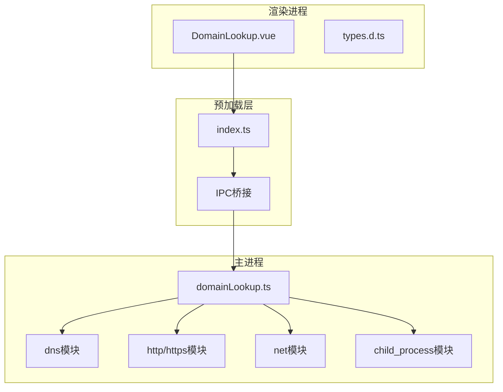
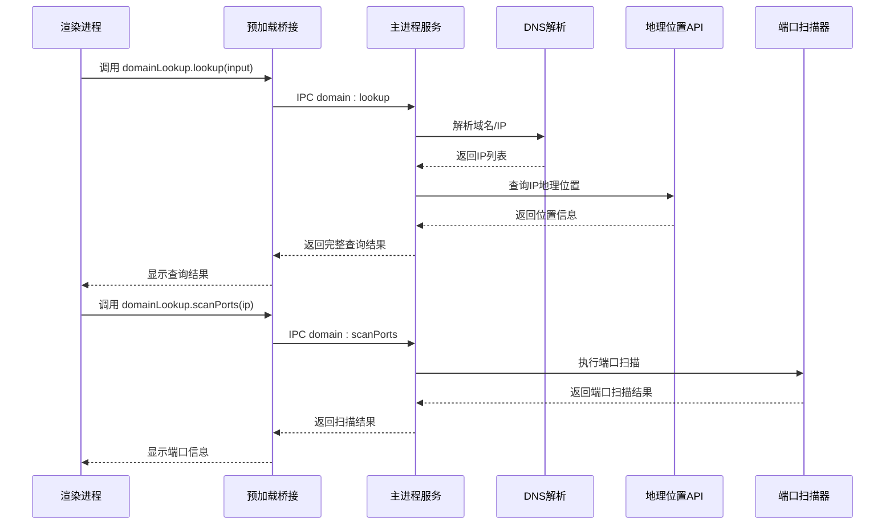
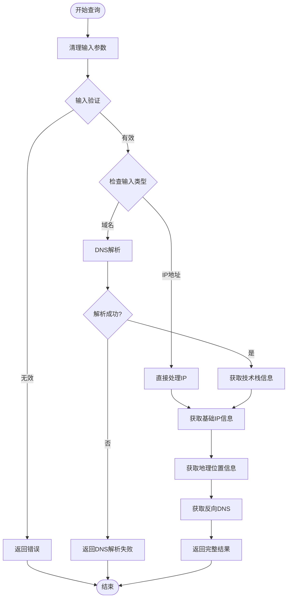
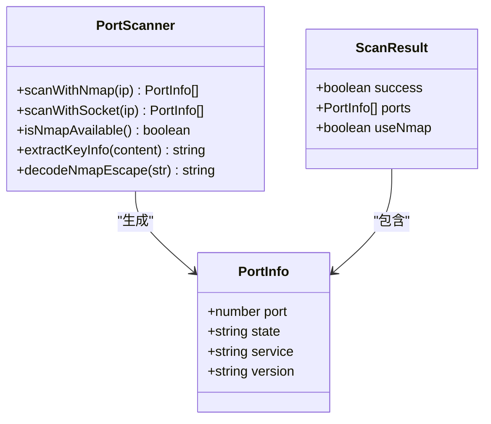
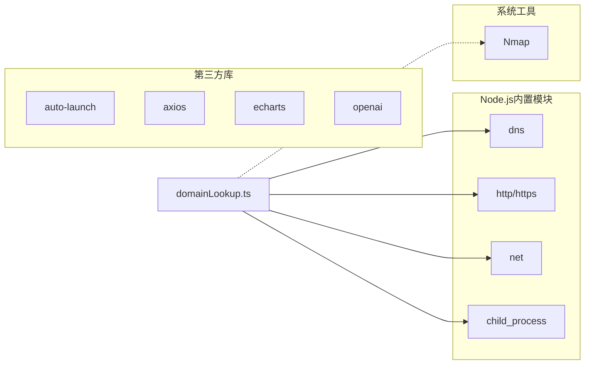
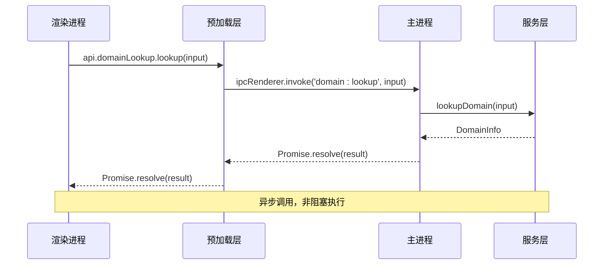

# 域名查询API

<cite>
**本文档引用的文件**
- [domainLookup.ts](file://src/main/services/domainLookup.ts)
- [DomainLookup.vue](file://src/renderer/src/views/domainlookup/DomainLookup.vue)
- [index.ts](file://src/main/index.ts)
- [index.ts](file://src/preload/index.ts)
- [types.d.ts](file://src/renderer/src/types.d.ts)
- [notification.ts](file://src/main/services/notification.ts)
- [README.md](file://README.md)
</cite>

## 目录
1. [简介](#简介)
2. [项目结构](#项目结构)
3. [核心组件](#核心组件)
4. [架构概览](#架构概览)
5. [详细组件分析](#详细组件分析)
6. [依赖关系分析](#依赖关系分析)
7. [性能考量](#性能考量)
8. [故障排除指南](#故障排除指南)
9. [结论](#结论)
10. [附录](#附录)

## 简介
域名查询API是开发者工具箱中的核心网络诊断功能模块，提供完整的域名解析、IP地理定位、ISP信息查询、反向DNS解析以及端口扫描能力。该API采用Electron IPC架构设计，通过主进程的安全网络访问和渲染进程的用户界面交互，为开发者提供便捷的网络诊断工具。

## 项目结构
域名查询功能分布在三个主要层次：
- **主进程服务层**：负责实际的网络查询和数据处理
- **预加载桥接层**：提供安全的IPC API暴露机制
- **渲染进程视图层**：实现用户交互和结果显示

**图表来源**
- [domainLookup.ts:679-689](file://src/main/services/domainLookup.ts#L679-L689)
- [index.ts:87-91](file://src/preload/index.ts#L87-L91)
- [DomainLookup.vue:76-98](file://src/renderer/src/views/domainlookup/DomainLookup.vue#L76-L98)

**章节来源**
- [README.md:34-40](file://README.md#L34-L40)
- [domainLookup.ts:1-86](file://src/main/services/domainLookup.ts#L1-L86)

## 核心组件
域名查询API包含以下核心数据结构和接口：

### 基础信息结构
- **BasicInfo**：IP地址基础信息，包含IP版本、地址类型、网络类别和子网信息
- **LocationInfo**：地理位置信息，支持国家、地区、城市、经纬度等
- **IspInfo**：ISP信息，包含运营商名称、组织信息和自治系统标识
- **ConnectionInfo**：连接类型信息，区分住宅/企业网络、移动网络、代理/VPN和数据中心
- **DomainDetails**：域名相关信息，包含正向域名和反向DNS记录

### 技术栈识别
- **TechInfo**：技术栈分析结果，包含Web服务器、应用框架、CDN服务和HTTP响应头
- **PortInfo**：端口扫描结果，包含端口号、状态、服务类型和版本信息

### 主查询流程
API提供两个主要方法：
- **lookup()**：统一查询入口，支持域名和IP地址解析
- **scanPorts()**：独立端口扫描功能，支持Nmap和Socket两种扫描方式

**章节来源**
- [domainLookup.ts:14-86](file://src/main/services/domainLookup.ts#L14-L86)
- [domainLookup.ts:607-666](file://src/main/services/domainLookup.ts#L607-L666)

## 架构概览
域名查询API采用分层架构设计，确保安全性、可扩展性和易用性：

**图表来源**
- [index.ts:424](file://src/main/index.ts#L424)
- [domainLookup.ts:679-689](file://src/main/services/domainLookup.ts#L679-L689)
- [DomainLookup.vue:76-102](file://src/renderer/src/views/domainlookup/DomainLookup.vue#L76-L102)

## 详细组件分析

### lookup() 方法详解
lookup()方法是域名查询的核心入口，支持域名和IP地址的统一查询：

#### 输入参数格式
- **input**：支持域名或IP地址字符串
- 自动处理协议前缀（http://、https://）
- 自动去除路径部分（/path）
- 自动去除端口号（:port）

#### 查询流程

**图表来源**
- [domainLookup.ts:607-666](file://src/main/services/domainLookup.ts#L607-L666)

#### DNS解析实现
DNS解析采用异步双栈策略：
- **IPv4解析**：使用dns.promises.resolve4()
- **IPv6解析**：使用dns.promises.resolve6()
- **容错处理**：单个协议解析失败不影响另一个协议的结果

#### 地理位置查询
使用ip-api.com服务获取详细的IP地理位置信息：
- 支持国家、地区、城市、经纬度坐标
- 获取ISP信息（运营商、组织、AS号）
- 识别连接类型（住宅/企业网络、移动网络、代理/VPN、数据中心）

#### 技术栈识别
通过HTTP头部分析识别服务器技术：
- **服务器类型**：从Server头识别
- **应用框架**：通过X-Powered-By等头部识别
- **CDN服务**：通过特定头部特征识别
- **支持的CDN**：Cloudflare、Vercel、Akamai、Fastly、阿里云CDN、腾讯云CDN等

**章节来源**
- [domainLookup.ts:175-194](file://src/main/services/domainLookup.ts#L175-L194)
- [domainLookup.ts:206-257](file://src/main/services/domainLookup.ts#L206-L257)
- [domainLookup.ts:259-360](file://src/main/services/domainLookup.ts#L259-L360)

### scanPorts() 端口扫描方法
端口扫描提供两种实现方案，自动选择最优方案：

#### Nmap扫描方案
当系统检测到Nmap可用时，使用专业级端口扫描：
- **快速模式**：-F参数扫描常用端口
- **版本探测**：-sV参数获取服务版本信息
- **优化参数**：--version-intensity 0、--unprivileged、-T4加速扫描
- **超时控制**：60秒超时限制
- **输出解析**：智能解析Nmap输出，提取端口状态和服务信息

#### Socket扫描方案
作为Nmap的回退方案，使用纯JavaScript实现：
- **并发扫描**：限制并发数为10，避免过度占用资源
- **超时控制**：每个端口2秒超时
- **批量处理**：每批10个端口，提高扫描效率
- **常用端口覆盖**：支持FTP、SSH、HTTP、HTTPS、数据库等常用端口

#### 端口状态识别
- **open**：开放端口，服务正常响应
- **closed**：关闭端口，服务拒绝连接
- **filtered**：过滤端口，可能被防火墙阻止

**图表来源**
- [domainLookup.ts:388-602](file://src/main/services/domainLookup.ts#L388-L602)

**章节来源**
- [domainLookup.ts:388-531](file://src/main/services/domainLookup.ts#L388-L531)
- [domainLookup.ts:533-585](file://src/main/services/domainLookup.ts#L533-L585)

### 错误处理机制
API实现了多层次的错误处理：

#### 输入验证错误
- 空输入或无效格式
- 返回标准化错误信息

#### 网络请求错误
- DNS解析失败
- IP地理位置查询失败
- HTTP请求超时或连接错误

#### 端口扫描错误
- Nmap命令执行失败
- Socket连接超时
- 系统资源限制

#### 通知机制
使用全局通知系统向用户反馈操作状态：
- 成功状态：绿色确认通知
- 警告状态：黄色警告通知  
- 错误状态：红色错误通知
- 信息状态：蓝色信息通知

**章节来源**
- [domainLookup.ts:615-663](file://src/main/services/domainLookup.ts#L615-L663)
- [notification.ts:15-28](file://src/main/services/notification.ts#L15-L28)

## 依赖关系分析

### 外部依赖
域名查询API依赖以下核心模块：

**图表来源**
- [domainLookup.ts:5-10](file://src/main/services/domainLookup.ts#L5-L10)

### IPC通信流程
渲染进程通过预加载桥接层与主进程通信：

**图表来源**
- [index.ts:87-91](file://src/preload/index.ts#L87-L91)
- [domainLookup.ts:679-683](file://src/main/services/domainLookup.ts#L679-L683)

**章节来源**
- [index.ts:424](file://src/main/index.ts#L424)
- [types.d.ts:138-141](file://src/renderer/src/types.d.ts#L138-L141)

## 性能考量

### 扫描性能优化
- **并发控制**：Socket扫描限制并发数为10，避免系统资源耗尽
- **超时设置**：每个端口2秒超时，总扫描时间约20秒
- **Nmap优化**：使用快速扫描模式和加速参数
- **内存管理**：及时清理扫描结果和中间缓冲区

### 网络请求优化
- **HTTP头部缓存**：复用HTTP连接减少握手开销
- **超时控制**：IP地理位置查询10秒超时限制
- **错误重试**：DNS解析失败时自动尝试IPv6
- **连接池**：合理管理网络连接生命周期

### 内存使用优化
- **流式处理**：HTTP响应采用流式读取，避免大对象内存占用
- **结果分页**：大量端口扫描结果分批处理
- **垃圾回收**：及时释放临时对象和缓冲区

## 故障排除指南

### 常见问题及解决方案

#### DNS解析失败
**症状**：域名无法解析为IP地址
**原因**：
- DNS服务器不可达
- 域名不存在或拼写错误
- 网络连接问题

**解决方案**：
- 检查网络连接状态
- 验证域名拼写
- 更换DNS服务器（8.8.8.8或114.114.114.114）

#### 端口扫描超时
**症状**：端口扫描长时间无响应
**原因**：
- 目标主机防火墙阻止
- 网络延迟过高
- Nmap未正确安装

**解决方案**：
- 检查目标主机防火墙设置
- 增加超时时间（修改源码）
- 确认Nmap已正确安装和配置

#### 地理位置查询失败
**症状**：无法获取IP地理位置信息
**原因**：
- ip-api.com服务不可用
- IP地址为特殊地址（私有地址、回环地址等）
- 网络连接问题

**解决方案**：
- 检查网络连接
- 稍后重试查询
- 使用其他地理位置服务

### 调试建议
1. **启用详细日志**：查看主进程控制台输出
2. **检查IPC连接**：确认预加载桥接正常工作
3. **验证系统依赖**：确认Nmap等外部工具已安装
4. **测试网络连通性**：验证DNS和HTTP服务可达性

**章节来源**
- [domainLookup.ts:615-663](file://src/main/services/domainLookup.ts#L615-L663)

## 结论
域名查询API提供了完整的网络诊断功能，具有以下特点：

### 技术优势
- **安全性**：通过IPC架构隔离网络操作，避免渲染进程直接访问系统资源
- **可靠性**：多层次错误处理和超时控制，确保系统稳定性
- **可扩展性**：模块化设计便于功能扩展和维护
- **用户体验**：直观的界面设计和实时反馈机制

### 功能完整性
- 支持域名和IP地址的统一查询
- 提供全面的网络信息展示
- 实现专业的端口扫描功能
- 集成地理位置和ISP信息查询

### 最佳实践建议
1. **合理使用**：避免频繁查询同一目标，遵守网络使用规范
2. **安全考虑**：仅对授权的目标进行端口扫描
3. **性能优化**：合理设置超时时间和并发数量
4. **错误处理**：妥善处理各种异常情况

## 附录

### API参考文档

#### lookup() 方法
**功能**：统一域名/IP查询入口
**参数**：
- input: string - 域名或IP地址
**返回值**：Promise<DomainInfo>
**错误处理**：返回包含error字段的对象

#### scanPorts() 方法  
**功能**：独立端口扫描功能
**参数**：
- ip: string - 目标IP地址
**返回值**：Promise<PortScanResult>
**错误处理**：返回包含空数组的结果

### 数据结构定义
所有数据结构均在domainLookup.ts中定义，包括：
- DomainInfo：完整查询结果
- BasicInfo：基础IP信息
- LocationInfo：地理位置信息
- IspInfo：ISP信息
- ConnectionInfo：连接类型信息
- DomainDetails：域名信息
- TechInfo：技术栈信息
- PortInfo：端口信息

### 配置选项
- **DNS解析**：支持IPv4和IPv6双重解析
- **端口扫描**：Nmap优先，Socket回退
- **超时设置**：IP地理位置查询10秒，端口扫描60秒
- **并发控制**：Socket扫描并发数限制为10