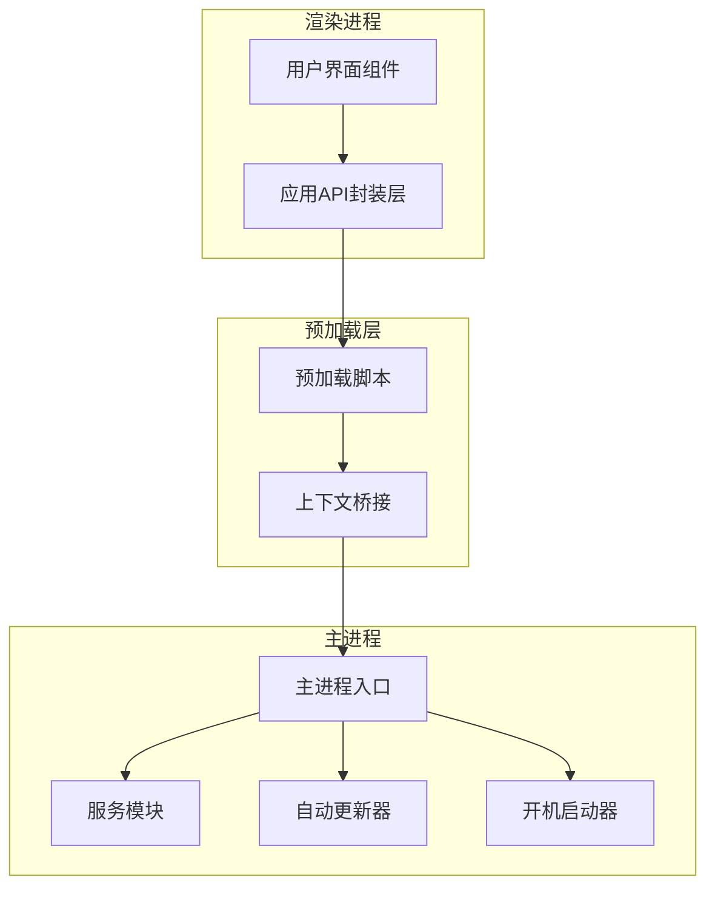
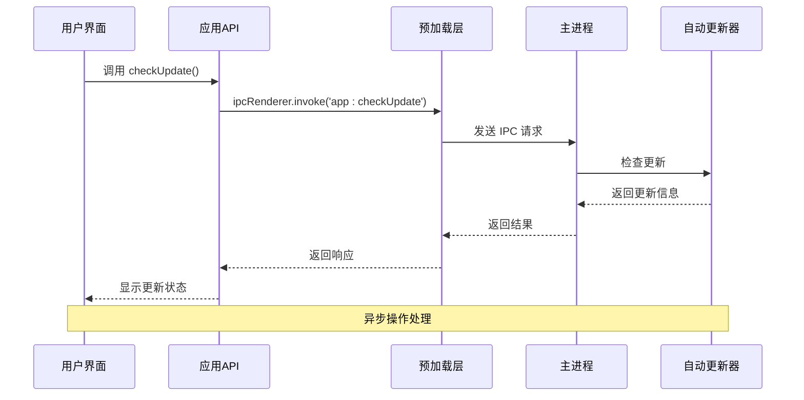
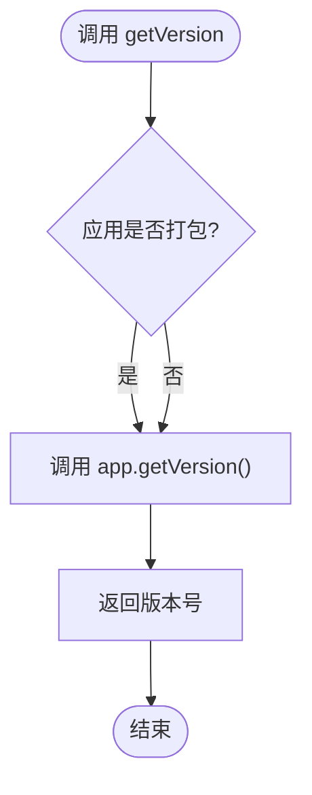
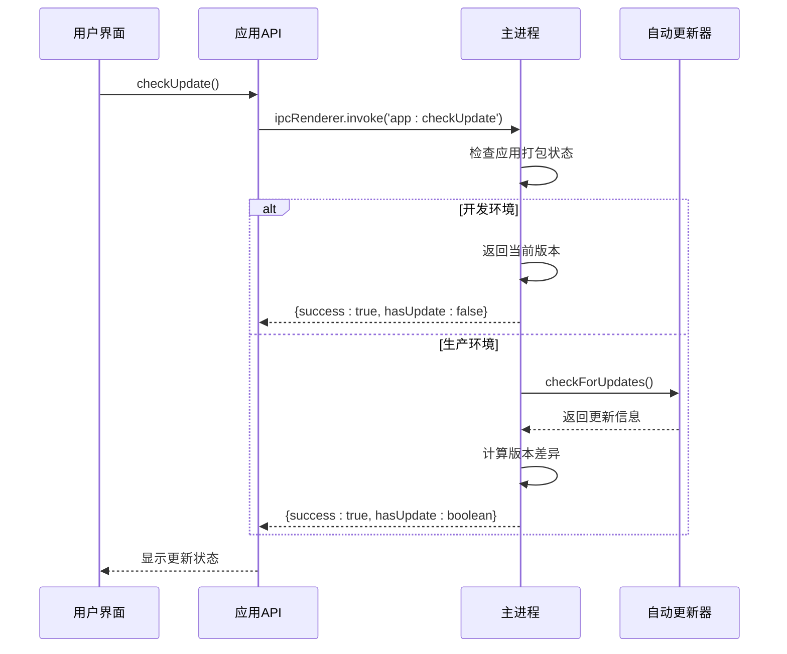
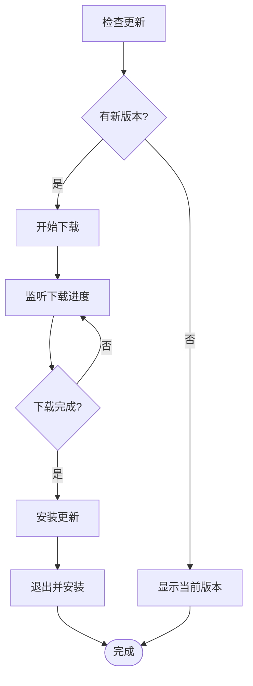
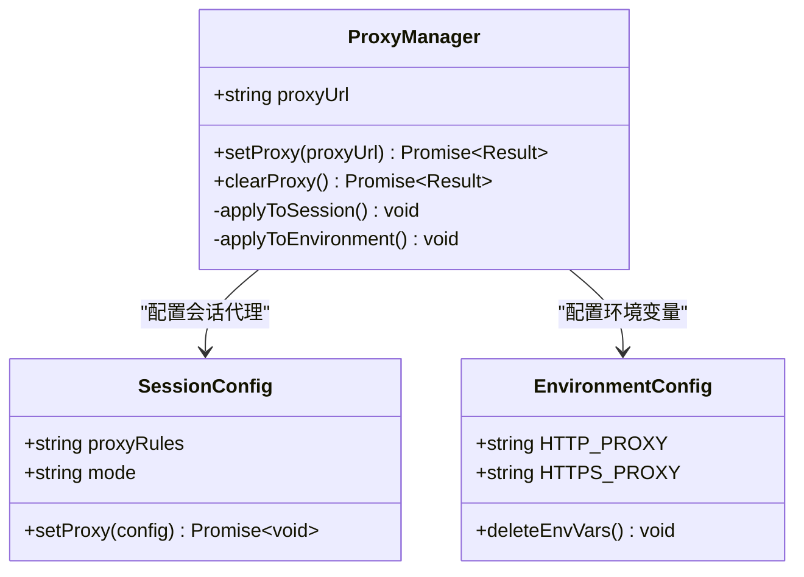
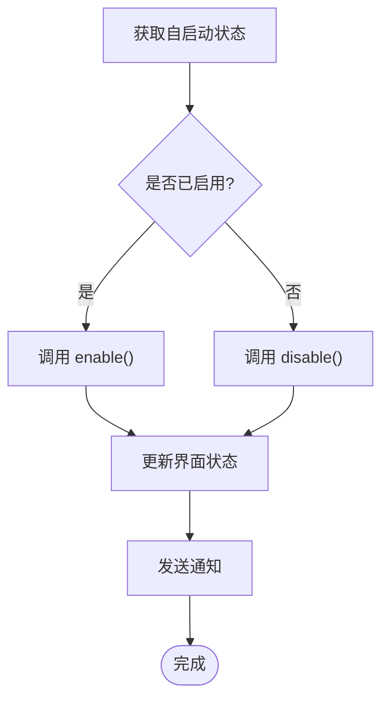
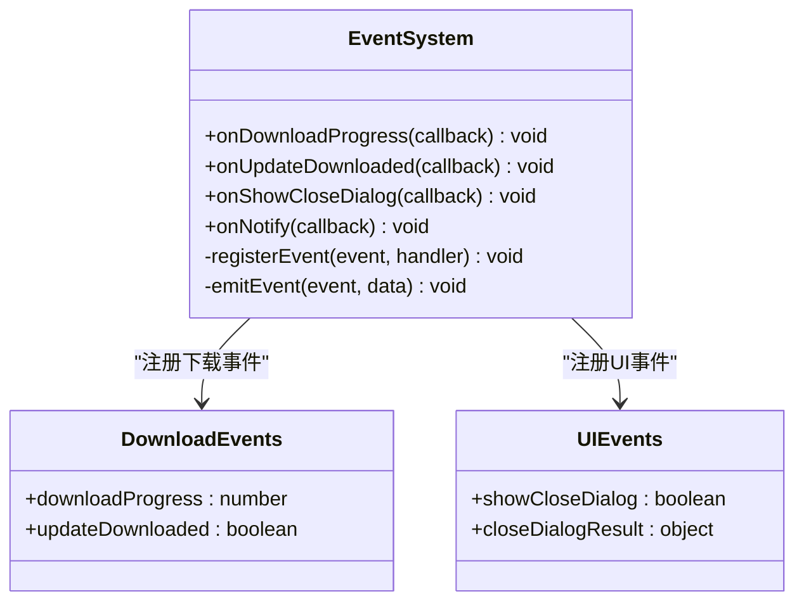
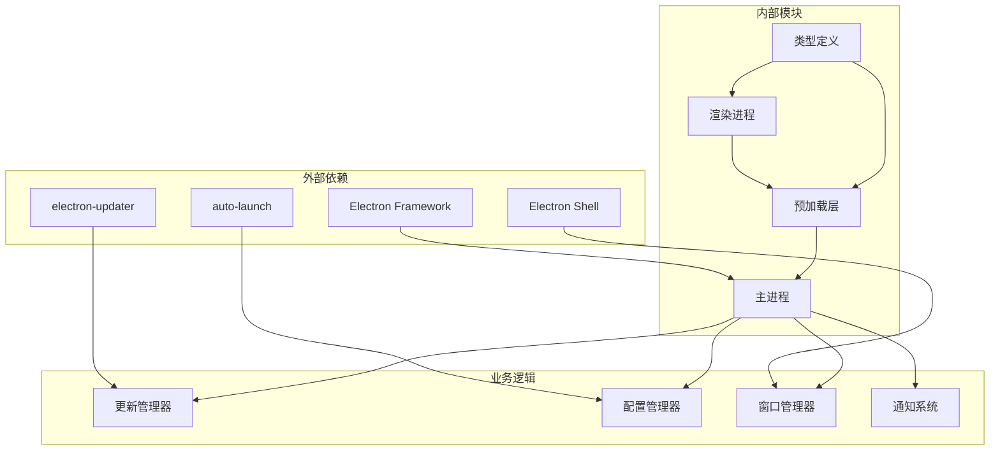

# 应用管理API

<cite>
**本文档引用的文件**
- [src/main/index.ts](file://src/main/index.ts)
- [src/preload/index.ts](file://src/preload/index.ts)
- [src/preload/index.d.ts](file://src/preload/index.d.ts)
- [src/renderer/src/components/Sidebar.vue](file://src/renderer/src/components/Sidebar.vue)
- [src/renderer/src/views/settings/Settings.vue](file://src/renderer/src/views/settings/Settings.vue)
- [src/main/services/notification.ts](file://src/main/services/notification.ts)
- [src/main/services/dockService.ts](file://src/main/services/dockService.ts)
- [src/preload/dock.ts](file://src/preload/dock.ts)
</cite>

## 目录
1. [简介](#简介)
2. [项目结构](#项目结构)
3. [核心组件](#核心组件)
4. [架构概览](#架构概览)
5. [详细组件分析](#详细组件分析)
6. [依赖关系分析](#依赖关系分析)
7. [性能考虑](#性能考虑)
8. [故障排除指南](#故障排除指南)
9. [结论](#结论)

## 简介

应用管理API是Dev Toolbox项目中的核心功能模块，负责管理应用程序的生命周期、配置和用户界面交互。该API提供了完整的应用更新管理、文件操作、代理设置、开机自启动配置以及关闭行为设置等功能。

本API采用Electron框架构建，通过IPC（进程间通信）机制在主进程和渲染进程之间传递数据。所有API调用都经过严格的类型检查和错误处理，确保应用程序的稳定性和可靠性。

## 项目结构

应用管理API的实现遵循标准的Electron架构模式，主要分为三个层次：

**图表来源**
- [src/main/index.ts:1-444](file://src/main/index.ts#L1-L444)
- [src/preload/index.ts:1-229](file://src/preload/index.ts#L1-L229)

**章节来源**
- [src/main/index.ts:1-444](file://src/main/index.ts#L1-L444)
- [src/preload/index.ts:1-229](file://src/preload/index.ts#L1-L229)

## 核心组件

应用管理API的核心组件包括以下主要功能模块：

### 应用生命周期管理
- 版本获取：`getVersion()` - 获取当前应用程序版本
- 更新检查：`checkUpdate()` - 检查是否有新版本可用
- 更新下载：`downloadUpdate()` - 下载最新版本的应用程序
- 更新安装：`installUpdate()` - 安装下载的更新包

### 应用配置管理
- 文件操作：`openFile()` - 打开指定路径的文件
- 代理设置：`setProxy()` - 配置HTTP/HTTPS代理服务器
- 开机自启动：`getAutoLaunch()` / `setAutoLaunch()` - 管理开机自启动功能
- 关闭行为：`getCloseBehavior()` / `setCloseBehavior()` - 配置窗口关闭行为

### 事件监听系统
- 下载进度：`onDownloadProgress()` - 监听更新下载进度
- 更新完成：`onUpdateDownloaded()` - 监听更新下载完成事件
- 关闭对话框：`onShowCloseDialog()` - 监听关闭对话框显示事件

**章节来源**
- [src/preload/index.ts:24-48](file://src/preload/index.ts#L24-L48)
- [src/preload/index.d.ts:14-33](file://src/preload/index.d.ts#L14-L33)

## 架构概览

应用管理API采用分层架构设计，确保各层职责清晰分离：

**图表来源**
- [src/preload/index.ts:25-28](file://src/preload/index.ts#L25-L28)
- [src/main/index.ts:218-269](file://src/main/index.ts#L218-L269)

## 详细组件分析

### 应用更新管理组件

应用更新管理是API的核心功能之一，提供了完整的更新生命周期管理：

#### 版本获取功能

**图表来源**
- [src/main/index.ts](file://src/main/index.ts#L216)
- [src/preload/index.ts](file://src/preload/index.ts#L25)

#### 更新检查流程

**图表来源**
- [src/main/index.ts:218-269](file://src/main/index.ts#L218-L269)
- [src/preload/index.ts](file://src/preload/index.ts#L26)

#### 更新下载与安装

**图表来源**
- [src/main/index.ts:271-299](file://src/main/index.ts#L271-L299)
- [src/preload/index.ts:27-28](file://src/preload/index.ts#L27-L28)

**章节来源**
- [src/main/index.ts:216-299](file://src/main/index.ts#L216-L299)
- [src/renderer/src/components/Sidebar.vue:25-79](file://src/renderer/src/components/Sidebar.vue#L25-L79)

### 应用配置管理组件

应用配置管理提供了多种系统配置功能：

#### 代理设置功能

**图表来源**
- [src/main/index.ts:307-327](file://src/main/index.ts#L307-L327)
- [src/preload/index.ts](file://src/preload/index.ts#L30)

#### 开机自启动管理

**图表来源**
- [src/main/index.ts:329-353](file://src/main/index.ts#L329-L353)
- [src/preload/index.ts:31-32](file://src/preload/index.ts#L31-L32)

**章节来源**
- [src/main/index.ts:307-361](file://src/main/index.ts#L307-L361)
- [src/renderer/src/views/settings/Settings.vue:9-57](file://src/renderer/src/views/settings/Settings.vue#L9-L57)

### 事件监听系统

应用管理API提供了完善的事件监听机制：

#### 事件类型定义

**图表来源**
- [src/preload/index.ts:39-47](file://src/preload/index.ts#L39-L47)
- [src/main/index.ts:129-157](file://src/main/index.ts#L129-L157)

**章节来源**
- [src/preload/index.ts:39-47](file://src/preload/index.ts#L39-L47)
- [src/main/index.ts:129-157](file://src/main/index.ts#L129-L157)

## 依赖关系分析

应用管理API的依赖关系体现了清晰的分层架构：

**图表来源**
- [src/main/index.ts:1-14](file://src/main/index.ts#L1-L14)
- [src/preload/index.ts:1-2](file://src/preload/index.ts#L1-L2)

**章节来源**
- [src/main/index.ts:1-14](file://src/main/index.ts#L1-L14)
- [src/preload/index.ts:1-2](file://src/preload/index.ts#L1-L2)

## 性能考虑

应用管理API在设计时充分考虑了性能优化：

### 异步操作处理
- 所有IPC调用都是异步的，避免阻塞主线程
- 使用Promise和async/await简化异步代码
- 合理的错误处理和超时机制

### 内存管理
- 及时清理事件监听器
- 合理的资源释放策略
- 避免内存泄漏

### 网络优化
- 代理设置支持HTTP/HTTPS
- 错误重试机制
- 进度反馈优化用户体验

## 故障排除指南

### 常见问题及解决方案

#### 更新检查失败
**症状**：检查更新时出现网络错误
**原因**：
- 网络连接问题
- 代理配置错误
- GitHub访问受限

**解决方案**：
1. 检查网络连接状态
2. 配置正确的代理设置
3. 稍后重试更新检查

#### 更新下载失败
**症状**：下载过程中断或失败
**原因**：
- 网络不稳定
- 磁盘空间不足
- 权限问题

**解决方案**：
1. 检查磁盘空间
2. 确认写入权限
3. 重新下载更新

#### 代理设置无效
**症状**：设置代理后仍无法访问网络
**原因**：
- 代理格式不正确
- 环境变量未生效
- 应用程序未重启

**解决方案**：
1. 验证代理URL格式
2. 重启应用程序
3. 检查防火墙设置

**章节来源**
- [src/main/index.ts:252-268](file://src/main/index.ts#L252-L268)
- [src/main/index.ts:277-293](file://src/main/index.ts#L277-L293)
- [src/main/index.ts:322-326](file://src/main/index.ts#L322-L326)

## 结论

应用管理API为Dev Toolbox提供了完整而强大的应用程序管理功能。通过精心设计的架构和完善的错误处理机制，该API确保了应用程序的稳定性、可靠性和易用性。

主要特点包括：
- 完整的更新生命周期管理
- 灵活的配置选项
- 丰富的事件监听机制
- 严格的类型安全保证
- 优秀的错误处理能力

该API的设计充分体现了现代桌面应用程序的最佳实践，为开发者提供了清晰、易用且功能强大的接口，能够满足各种应用场景的需求。