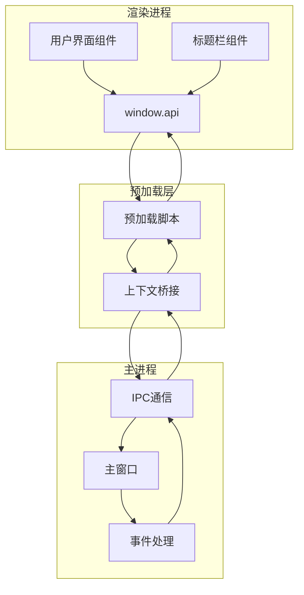
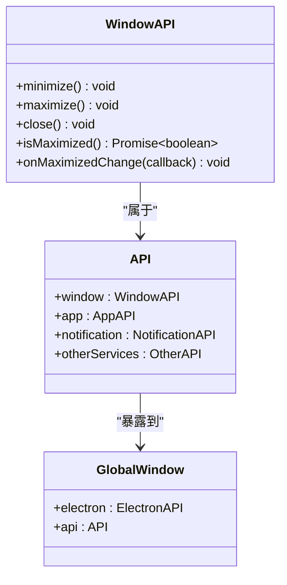
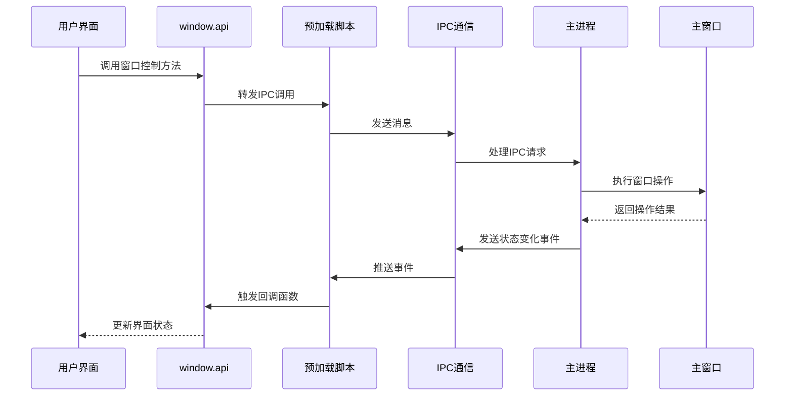
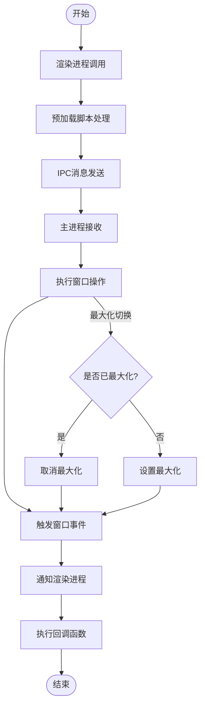
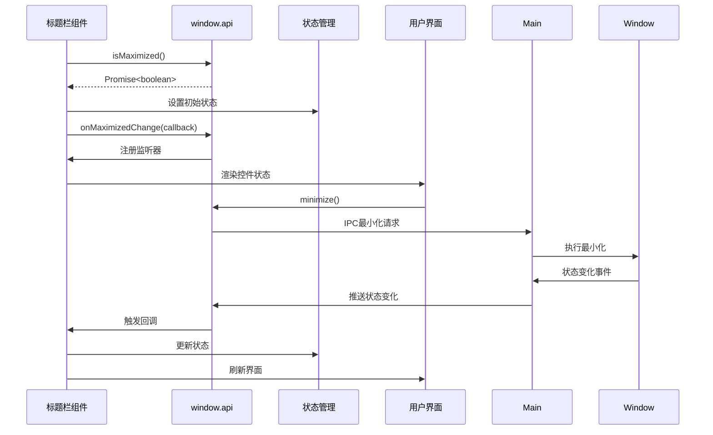
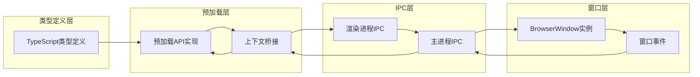

# 窗口控制API

<cite>
**本文档引用的文件**
- [src/preload/index.ts](file://src/preload/index.ts)
- [src/preload/index.d.ts](file://src/preload/index.d.ts)
- [src/renderer/src/components/TitleBar.vue](file://src/renderer/src/components/TitleBar.vue)
- [src/main/index.ts](file://src/main/index.ts)
- [src/renderer/src/types.d.ts](file://src/renderer/src/types.d.ts)
</cite>

## 目录
1. [简介](#简介)
2. [项目结构](#项目结构)
3. [核心组件](#核心组件)
4. [架构概览](#架构概览)
5. [详细组件分析](#详细组件分析)
6. [依赖关系分析](#依赖关系分析)
7. [性能考虑](#性能考虑)
8. [故障排除指南](#故障排除指南)
9. [结论](#结论)

## 简介

窗口控制API是Electron应用中的一个关键功能模块，负责管理主窗口的各种操作。该API提供了对窗口状态的完全控制能力，包括窗口的最小化、最大化、关闭等基本操作，以及窗口状态查询和事件监听功能。

本API采用IPC（进程间通信）机制实现，通过预加载脚本暴露给渲染进程，确保了安全性和类型安全性。它支持实时的状态同步和事件通知，为用户提供流畅的窗口控制体验。

## 项目结构

窗口控制API在整个项目架构中扮演着重要角色，主要涉及以下组件：

**图表来源**
- [src/preload/index.ts:1-32](file://src/preload/index.ts#L1-L32)
- [src/main/index.ts:175-189](file://src/main/index.ts#L175-L189)

**章节来源**
- [src/preload/index.ts:1-32](file://src/preload/index.ts#L1-L32)
- [src/main/index.ts:110-127](file://src/main/index.ts#L110-L127)

## 核心组件

窗口控制API的核心由四个主要部分组成：

### 1. 类型定义系统

API采用严格的TypeScript类型定义，确保编译时的安全性：

**图表来源**
- [src/preload/index.d.ts:6-12](file://src/preload/index.d.ts#L6-L12)
- [src/preload/index.d.ts:374-385](file://src/preload/index.d.ts#L374-L385)
- [src/preload/index.d.ts:406-412](file://src/preload/index.d.ts#L406-L412)

### 2. 预加载脚本实现

预加载脚本负责将窗口控制功能安全地暴露给渲染进程：

**章节来源**
- [src/preload/index.ts:11-21](file://src/preload/index.ts#L11-L21)

### 3. 主进程IPC处理

主进程负责实际的窗口操作和事件分发：

**章节来源**
- [src/main/index.ts:175-189](file://src/main/index.ts#L175-L189)
- [src/main/index.ts:386-391](file://src/main/index.ts#L386-L391)

### 4. 渲染进程使用示例

标题栏组件展示了API的实际使用方式：

**章节来源**
- [src/renderer/src/components/TitleBar.vue:1-16](file://src/renderer/src/components/TitleBar.vue#L1-L16)

## 架构概览

窗口控制API采用分层架构设计，确保了安全性和可维护性：

**图表来源**
- [src/preload/index.ts:14-20](file://src/preload/index.ts#L14-L20)
- [src/main/index.ts:175-189](file://src/main/index.ts#L175-L189)
- [src/main/index.ts:386-391](file://src/main/index.ts#L386-L391)

## 详细组件分析

### WindowAPI 接口定义

WindowAPI接口定义了完整的窗口控制功能集合：

#### 方法一：minimize() - 窗口最小化

**方法签名**: `minimize(): void`

**功能描述**: 将当前主窗口最小化到任务栏或系统托盘

**参数**: 无

**返回值**: `void`

**使用场景**:
- 用户点击最小化按钮
- 快捷键组合触发最小化
- 程序逻辑需要暂时隐藏窗口

**最佳实践**:
- 在调用前检查窗口是否已最小化
- 提供视觉反馈确认操作成功

#### 方法二：maximize() - 窗口最大化

**方法签名**: `maximize(): void`

**功能描述**: 切换主窗口的最大化状态（最大化/还原）

**参数**: 无

**返回值**: `void`

**使用场景**:
- 用户点击最大化按钮
- 双击标题栏区域
- 快捷键组合触发最大化

**实现细节**:
- 内部会检查当前窗口状态
- 如果已最大化则还原，否则最大化

**最佳实践**:
- 结合状态查询方法使用
- 注意与全屏模式的区别

#### 方法三：close() - 窗口关闭

**方法签名**: `close(): void`

**功能描述**: 触发主窗口关闭流程

**参数**: 无

**返回值**: `void`

**使用场景**:
- 用户点击关闭按钮
- 程序正常退出
- 异常情况下的强制关闭

**实现机制**:
- 通过IPC触发主进程的窗口关闭事件
- 主进程会根据配置决定具体行为

**最佳实践**:
- 在关闭前保存用户数据
- 确认未完成的操作

#### 方法四：isMaximized() - 状态查询

**方法签名**: `isMaximized(): Promise<boolean>`

**功能描述**: 查询当前窗口是否处于最大化状态

**参数**: 无

**返回值**: `Promise<boolean>`

**使用场景**:
- 初始化界面状态
- 动态更新UI控件状态
- 条件逻辑判断

**异步原因**:
- 需要与主进程进行IPC通信
- 确保获取到最新的窗口状态

**最佳实践**:
- 在组件挂载时调用
- 缓存查询结果避免频繁调用

#### 方法五：onMaximizedChange() - 状态监听

**方法签名**: `onMaximizedChange(callback: (isMaximized: boolean) => void): void`

**功能描述**: 注册窗口最大化状态变化的事件监听器

**参数**:
- `callback`: `(isMaximized: boolean) => void` - 回调函数
  - `isMaximized`: `boolean` - 新的窗口状态

**返回值**: `void`

**使用场景**:
- 实时更新UI控件状态
- 同步应用内部状态
- 记录用户操作习惯

**事件机制**:
- 主进程监听窗口事件
- 自动推送状态变化通知
- 支持多个监听器注册

**最佳实践**:
- 在组件卸载时移除监听器
- 避免内存泄漏
- 处理回调函数的错误

**章节来源**
- [src/preload/index.d.ts:6-12](file://src/preload/index.d.ts#L6-L12)
- [src/renderer/src/types.d.ts:15-21](file://src/renderer/src/types.d.ts#L15-L21)

### IPC通信流程

窗口控制API通过IPC实现跨进程通信：

**图表来源**
- [src/preload/index.ts:14-20](file://src/preload/index.ts#L14-L20)
- [src/main/index.ts:175-183](file://src/main/index.ts#L175-L183)

**章节来源**
- [src/preload/index.ts:14-20](file://src/preload/index.ts#L14-L20)
- [src/main/index.ts:175-189](file://src/main/index.ts#L175-L189)

### 实际使用示例

#### 标题栏组件集成

标题栏组件展示了API的完整使用模式：

**图表来源**
- [src/renderer/src/components/TitleBar.vue:10-15](file://src/renderer/src/components/TitleBar.vue#L10-L15)
- [src/renderer/src/components/TitleBar.vue:6-8](file://src/renderer/src/components/TitleBar.vue#L6-L8)

**章节来源**
- [src/renderer/src/components/TitleBar.vue:1-16](file://src/renderer/src/components/TitleBar.vue#L1-L16)

## 依赖关系分析

窗口控制API的依赖关系相对简单但层次清晰：

**图表来源**
- [src/preload/index.d.ts:406-412](file://src/preload/index.d.ts#L406-L412)
- [src/preload/index.ts:1-32](file://src/preload/index.ts#L1-L32)

**章节来源**
- [src/preload/index.ts:1-32](file://src/preload/index.ts#L1-L32)
- [src/main/index.ts:110-127](file://src/main/index.ts#L110-L127)

## 性能考虑

### IPC通信优化

1. **异步调用**: 所有IPC调用都是异步的，避免阻塞主线程
2. **状态缓存**: 建议在渲染进程中缓存窗口状态，减少不必要的IPC调用
3. **事件去抖**: 对于频繁的状态变化事件，可以考虑添加去抖机制

### 内存管理

1. **监听器清理**: 组件卸载时必须清理所有注册的事件监听器
2. **回调函数**: 避免在回调函数中创建闭包导致的内存泄漏
3. **状态同步**: 使用响应式状态管理，避免手动DOM操作

### 错误处理策略

1. **IPC失败处理**: 当IPC通信失败时，应该提供降级方案
2. **状态同步**: 窗口状态变化可能延迟，需要适当的容错机制
3. **异常恢复**: 窗口操作异常时，应该尝试恢复到稳定状态

## 故障排除指南

### 常见问题及解决方案

#### 问题1: 窗口状态查询返回undefined

**症状**: `isMaximized()`返回`undefined`或抛出异常

**原因**:
- 预加载脚本未正确初始化
- IPC通信失败
- 窗口实例不存在

**解决方案**:
- 检查预加载脚本的加载顺序
- 添加错误捕获和重试机制
- 确保在窗口创建后再调用API

#### 问题2: 状态监听器不触发

**症状**: `onMaximizedChange()`回调函数不被调用

**原因**:
- 监听器注册时机不当
- 组件提前卸载
- IPC通道断开

**解决方案**:
- 在组件挂载时注册监听器
- 在组件卸载时清理监听器
- 检查IPC连接状态

#### 问题3: 窗口操作无响应

**症状**: 调用`minimize()`、`maximize()`或`close()`没有效果

**原因**:
- 预加载API未正确暴露
- 主进程未处理相应的IPC消息
- 窗口已被销毁

**解决方案**:
- 验证预加载脚本的导出
- 检查主进程的IPC处理器
- 确保窗口实例有效

### 调试技巧

1. **启用IPC日志**: 在开发环境中启用Electron的IPC调试日志
2. **状态监控**: 使用Vue DevTools监控组件状态变化
3. **错误边界**: 为API调用添加try-catch包装

**章节来源**
- [src/preload/index.ts:14-20](file://src/preload/index.ts#L14-L20)
- [src/main/index.ts:175-189](file://src/main/index.ts#L175-L189)

## 结论

窗口控制API是一个设计良好、实现简洁且功能完整的窗口管理解决方案。它通过严格的类型定义确保了编译时的安全性，通过IPC机制实现了跨进程的安全通信，通过事件驱动的方式提供了实时的状态同步能力。

该API的主要优势包括：
- **类型安全**: 完整的TypeScript类型定义
- **事件驱动**: 实时的状态变化通知
- **易于使用**: 简洁的API设计和直观的方法命名
- **可扩展性**: 良好的架构设计支持功能扩展

对于开发者而言，建议遵循本文档的最佳实践，在使用过程中注意内存管理和错误处理，以确保应用的稳定性和用户体验。