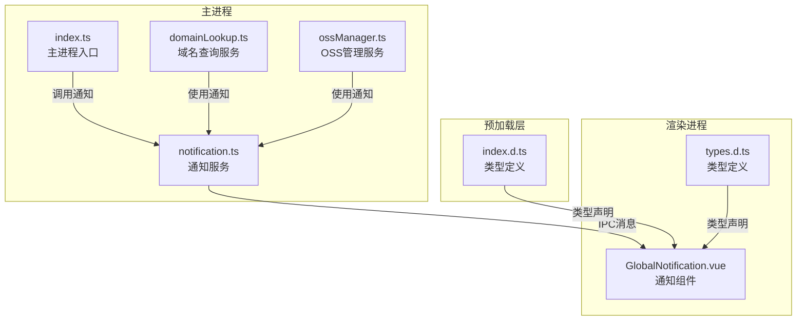
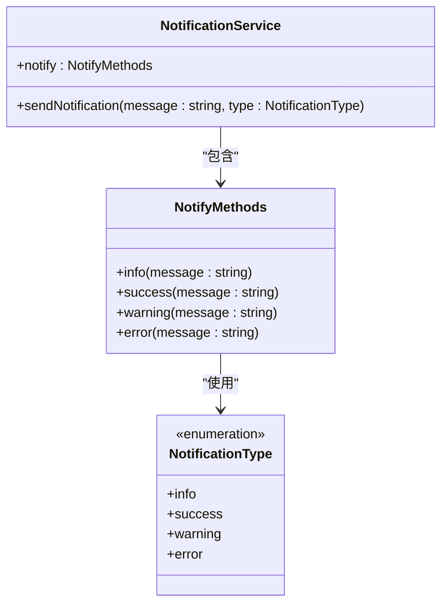
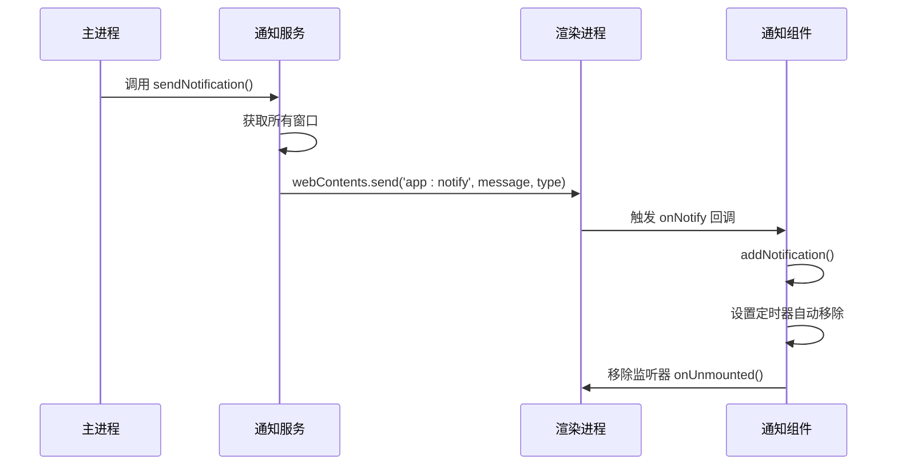
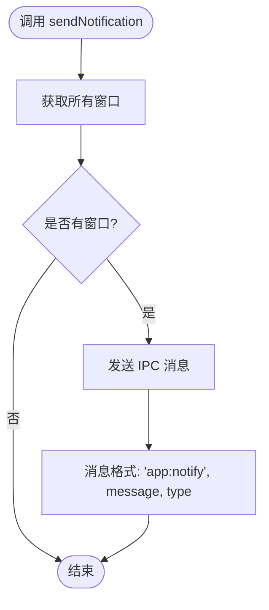
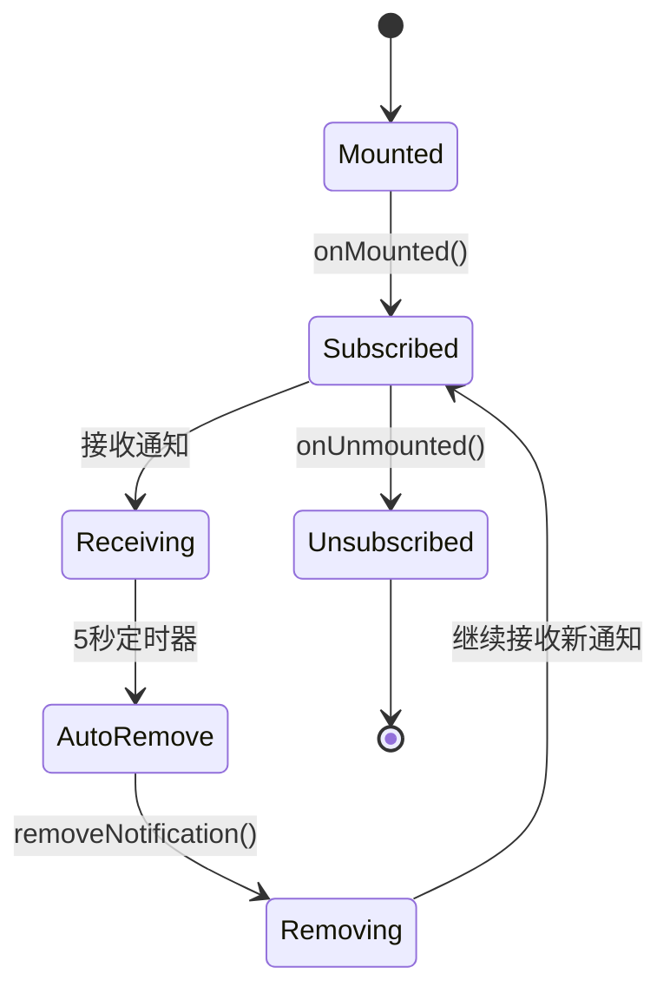
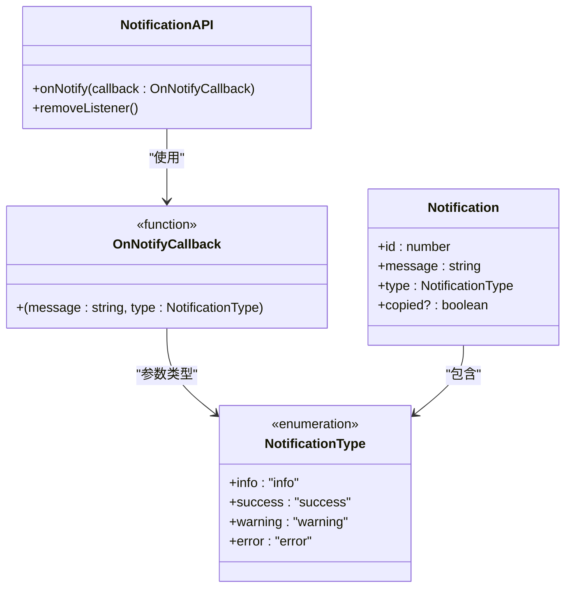
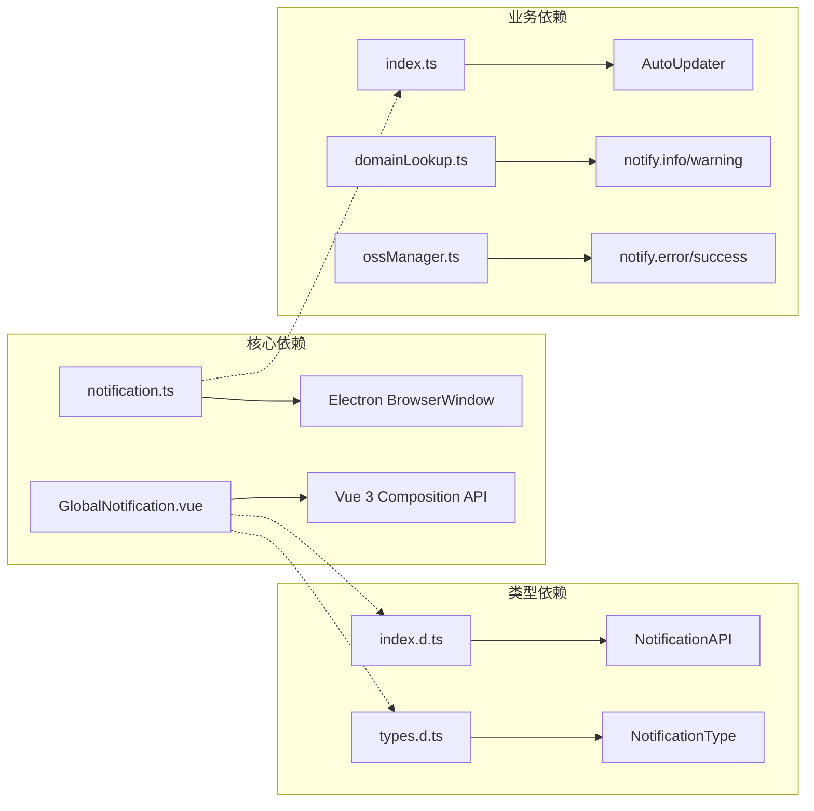

# 通知系统API

<cite>
**本文档引用的文件**
- [notification.ts](file://src/main/services/notification.ts)
- [GlobalNotification.vue](file://src/renderer/src/components/GlobalNotification.vue)
- [index.d.ts](file://src/preload/index.d.ts)
- [types.d.ts](file://src/renderer/src/types.d.ts)
- [index.ts](file://src/main/index.ts)
- [domainLookup.ts](file://src/main/services/domainLookup.ts)
- [ossManager.ts](file://src/main/services/ossManager.ts)
</cite>

## 目录
1. [简介](#简介)
2. [项目结构](#项目结构)
3. [核心组件](#核心组件)
4. [架构概览](#架构概览)
5. [详细组件分析](#详细组件分析)
6. [依赖关系分析](#依赖关系分析)
7. [性能考虑](#性能考虑)
8. [故障排除指南](#故障排除指南)
9. [结论](#结论)

## 简介

通知系统API是一个基于Electron的跨进程通知机制，实现了主进程与渲染进程之间的实时通信。该系统提供了统一的通知管理功能，包括通知类型枚举、事件监听器、回调函数签名以及消息格式规范。

通知系统的核心特性：
- **类型安全**：使用TypeScript枚举确保通知类型的完整性
- **跨进程通信**：通过Electron IPC实现主进程与渲染进程的消息传递
- **生命周期管理**：提供完整的事件订阅和移除机制
- **内存泄漏防护**：通过正确的生命周期管理防止内存泄漏

## 项目结构

通知系统涉及以下关键文件和组件：

**图表来源**
- [notification.ts:1-29](file://src/main/services/notification.ts#L1-L29)
- [GlobalNotification.vue:1-211](file://src/renderer/src/components/GlobalNotification.vue#L1-L211)
- [index.d.ts:35-39](file://src/preload/index.d.ts#L35-L39)

**章节来源**
- [notification.ts:1-29](file://src/main/services/notification.ts#L1-L29)
- [GlobalNotification.vue:1-211](file://src/renderer/src/components/GlobalNotification.vue#L1-L211)
- [index.d.ts:35-39](file://src/preload/index.d.ts#L35-L39)

## 核心组件

### 通知类型枚举

通知系统定义了四种标准通知类型，确保类型安全和一致性：

| 类型 | 描述 | 使用场景 |
|------|------|----------|
| `'info'` | 信息性通知 | 提供一般性信息、状态更新、操作说明 |
| `'success'` | 成功通知 | 操作成功完成、任务完成、确认信息 |
| `'warning'` | 警告通知 | 需要注意的情况、潜在问题、建议操作 |
| `'error'` | 错误通知 | 操作失败、错误情况、异常状态 |

### 通知服务接口

通知服务提供了两个核心接口：

1. **sendNotification()** - 直接发送通知
2. **notify 对象** - 便捷方法集合

**图表来源**
- [notification.ts:7-28](file://src/main/services/notification.ts#L7-L28)

**章节来源**
- [notification.ts:7-28](file://src/main/services/notification.ts#L7-L28)

## 架构概览

通知系统采用分层架构设计，实现了清晰的职责分离：

**图表来源**
- [notification.ts:15-20](file://src/main/services/notification.ts#L15-L20)
- [GlobalNotification.vue:54-62](file://src/renderer/src/components/GlobalNotification.vue#L54-L62)

### 数据流分析

通知数据流遵循以下路径：
1. **主进程** → **IPC通道** → **渲染进程** → **Vue组件**
2. **组件内部** → **状态管理** → **UI渲染** → **自动清理**

**章节来源**
- [notification.ts:15-20](file://src/main/services/notification.ts#L15-L20)
- [GlobalNotification.vue:54-62](file://src/renderer/src/components/GlobalNotification.vue#L54-L62)

## 详细组件分析

### 主进程通知服务

主进程通知服务负责将通知从主进程传递到渲染进程：

#### 核心功能
- **消息发送**：通过Electron IPC发送通知消息
- **窗口管理**：遍历所有打开的窗口确保消息送达
- **类型验证**：使用TypeScript枚举确保类型安全

#### 实现细节

**图表来源**
- [notification.ts:15-20](file://src/main/services/notification.ts#L15-L20)

**章节来源**
- [notification.ts:15-20](file://src/main/services/notification.ts#L15-L20)

### 渲染进程通知组件

渲染进程通知组件负责接收和展示通知：

#### 生命周期管理

**图表来源**
- [GlobalNotification.vue:54-62](file://src/renderer/src/components/GlobalNotification.vue#L54-L62)

#### 核心功能
- **事件监听**：订阅主进程发送的通知
- **状态管理**：维护通知列表和计时器
- **用户交互**：支持手动关闭和复制功能
- **自动清理**：5秒后自动移除通知

**章节来源**
- [GlobalNotification.vue:16-30](file://src/renderer/src/components/GlobalNotification.vue#L16-L30)
- [GlobalNotification.vue:54-62](file://src/renderer/src/components/GlobalNotification.vue#L54-L62)

### 类型定义系统

通知系统提供了完整的TypeScript类型定义：

#### 类型定义层次

**图表来源**
- [index.d.ts:36-38](file://src/preload/index.d.ts#L36-L38)
- [types.d.ts:133-136](file://src/renderer/src/types.d.ts#L133-L136)

**章节来源**
- [index.d.ts:36-38](file://src/preload/index.d.ts#L36-L38)
- [types.d.ts:133-136](file://src/renderer/src/types.d.ts#L133-L136)

## 依赖关系分析

通知系统与其他组件的依赖关系：

**图表来源**
- [notification.ts:5](file://src/main/services/notification.ts#L5)
- [GlobalNotification.vue:2](file://src/renderer/src/components/GlobalNotification.vue#L2)
- [index.ts:12](file://src/main/index.ts#L12)

**章节来源**
- [index.ts:12](file://src/main/index.ts#L12)
- [domainLookup.ts:592](file://src/main/services/domainLookup.ts#L592)
- [ossManager.ts:336](file://src/main/services/ossManager.ts#L336)

## 性能考虑

### 内存管理优化

通知系统在设计上考虑了内存效率：

1. **自动清理机制**：通知在5秒后自动移除，防止内存泄漏
2. **事件监听器管理**：组件卸载时自动移除监听器
3. **最小化状态存储**：只存储必要的通知信息

### 性能最佳实践

- **批量通知处理**：避免在同一帧内发送过多通知
- **延迟初始化**：仅在需要时创建通知组件
- **资源释放**：确保所有定时器和监听器正确清理

## 故障排除指南

### 常见问题及解决方案

#### 问题1：通知无法显示
**症状**：主进程发送通知但渲染进程不显示
**原因**：窗口未正确初始化或IPC通道中断
**解决方案**：
1. 确保主进程有可用的BrowserWindow实例
2. 检查IPC通道是否正常工作
3. 验证渲染进程的onNotify监听器是否正确注册

#### 问题2：内存泄漏
**症状**：应用运行时间越长，内存使用量越大
**原因**：事件监听器未正确移除
**解决方案**：
1. 确保在组件卸载时调用removeListener()
2. 检查定时器是否正确清理
3. 验证通知数组的状态管理

#### 问题3：通知类型错误
**症状**：编译时报类型错误
**原因**：使用了非标准的通知类型
**解决方案**：
1. 使用标准的四个通知类型枚举值
2. 确保TypeScript类型定义正确导入
3. 检查类型兼容性

**章节来源**
- [GlobalNotification.vue:60-62](file://src/renderer/src/components/GlobalNotification.vue#L60-L62)

## 结论

通知系统API提供了一个完整、类型安全且易于使用的跨进程通知解决方案。其设计特点包括：

### 核心优势
- **类型安全**：完整的TypeScript支持确保编译时类型检查
- **生命周期管理**：自动化的事件监听器和内存管理
- **扩展性**：模块化设计便于功能扩展
- **易用性**：简洁的API设计降低使用复杂度

### 最佳实践总结
1. **正确使用监听器**：始终在组件挂载时注册，在卸载时移除
2. **合理使用通知类型**：根据语义选择合适的通知类型
3. **注意性能影响**：避免过度频繁的通知发送
4. **错误处理**：实现适当的错误处理和降级策略

通知系统为开发者提供了一个可靠的通信桥梁，使得主进程和渲染进程能够高效地交换状态信息和用户反馈，是构建现代桌面应用的重要基础设施。