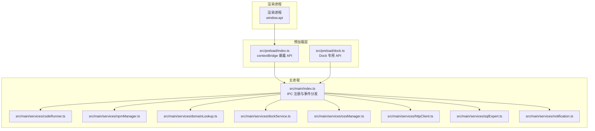
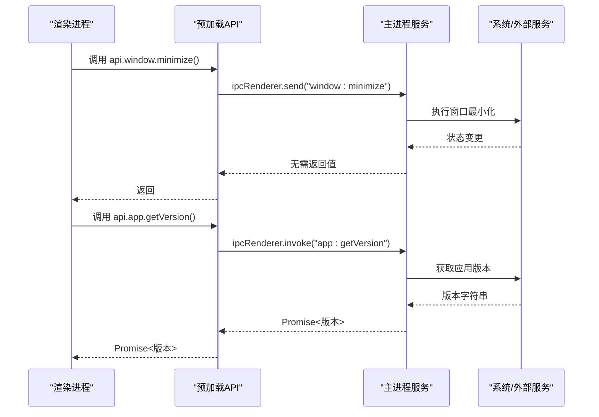
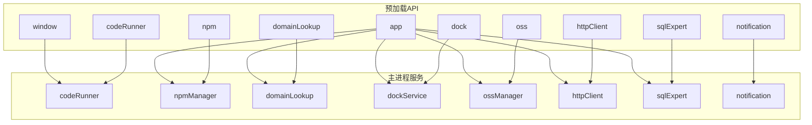

# 预加载API接口

<cite>
**本文档引用的文件**
- [src/preload/index.ts](file://src/preload/index.ts)
- [src/preload/index.d.ts](file://src/preload/index.d.ts)
- [src/preload/dock.ts](file://src/preload/dock.ts)
- [src/main/index.ts](file://src/main/index.ts)
- [src/main/services/codeRunner.ts](file://src/main/services/codeRunner.ts)
- [src/main/services/npmManager.ts](file://src/main/services/npmManager.ts)
- [src/main/services/domainLookup.ts](file://src/main/services/domainLookup.ts)
- [src/main/services/dockService.ts](file://src/main/services/dockService.ts)
- [src/main/services/ossManager.ts](file://src/main/services/ossManager.ts)
- [src/main/services/httpClient.ts](file://src/main/services/httpClient.ts)
- [src/main/services/sqlExpert.ts](file://src/main/services/sqlExpert.ts)
- [src/main/services/notification.ts](file://src/main/services/notification.ts)
</cite>

## 目录
1. [简介](#简介)
2. [项目结构](#项目结构)
3. [核心组件](#核心组件)
4. [架构总览](#架构总览)
5. [详细组件分析](#详细组件分析)
6. [依赖关系分析](#依赖关系分析)
7. [性能考虑](#性能考虑)
8. [故障排除指南](#故障排除指南)
9. [结论](#结论)
10. [附录](#附录)

## 简介
本文件为开发者工具箱的预加载API接口文档，面向渲染进程开发者，系统性说明 window.api 对象提供的统一接口规范。涵盖窗口控制、应用管理、通知系统、代码运行、NPM管理、域名查询、Dock服务、HTTP客户端、OSS管理和SQL专家等模块。文档提供TypeScript类型定义参考、使用示例和最佳实践，并包含错误处理、异步操作和事件订阅的完整指南。

## 项目结构
预加载API位于 src/preload 目录，通过 contextBridge 暴露到渲染进程，主进程在 src/main/services 下实现各功能模块的IPC处理器。

**图表来源**
- [src/preload/index.ts:1-229](file://src/preload/index.ts#L1-L229)
- [src/preload/dock.ts:1-19](file://src/preload/dock.ts#L1-L19)
- [src/main/index.ts:1-444](file://src/main/index.ts#L1-L444)

**章节来源**
- [src/preload/index.ts:1-229](file://src/preload/index.ts#L1-L229)
- [src/main/index.ts:1-444](file://src/main/index.ts#L1-L444)

## 核心组件
- window.api：统一的预加载API入口，提供各功能模块的类型安全接口
- Dock 专用API：仅在 Dock 窗口使用，提供 action 调用能力
- 主进程服务：通过 ipcMain.handle/on 注册IPC处理器，实现具体功能

**章节来源**
- [src/preload/index.ts:11-213](file://src/preload/index.ts#L11-L213)
- [src/preload/dock.ts:1-19](file://src/preload/dock.ts#L1-L19)

## 架构总览
预加载API采用“桥接层 + IPC处理器”的架构：
- 预加载层负责类型声明和IPC调用封装
- 主进程服务负责实际业务逻辑和系统交互
- 通过 ipcRenderer/ipcMain 实现双向通信

**图表来源**
- [src/preload/index.ts:13-28](file://src/preload/index.ts#L13-L28)
- [src/main/index.ts:175-216](file://src/main/index.ts#L175-L216)

**章节来源**
- [src/preload/index.ts:1-229](file://src/preload/index.ts#L1-L229)
- [src/main/index.ts:1-444](file://src/main/index.ts#L1-L444)

## 详细组件分析

### 窗口控制 (window)
提供窗口基本操作和状态监听。

- 方法
  - minimize(): void - 最小化窗口
  - maximize(): void - 最大化/还原窗口
  - close(): void - 关闭窗口
  - isMaximized(): Promise<boolean> - 查询窗口是否最大化
  - onMaximizedChange(callback: (isMaximized: boolean) => void): void - 监听最大化状态变化

- 事件
  - window:maximized-change: 由主进程触发，通知窗口最大化状态变化

- 使用示例
  - 窗口最小化：api.window.minimize()
  - 查询最大化状态：const isMax = await api.window.isMaximized()

- 最佳实践
  - 使用 onMaximizedChange 监听状态变化，避免轮询
  - 在关闭窗口前考虑用户偏好（最小化到托盘）

**章节来源**
- [src/preload/index.ts:13-21](file://src/preload/index.ts#L13-L21)
- [src/main/index.ts:175-189](file://src/main/index.ts#L175-L189)
- [src/main/index.ts:386-391](file://src/main/index.ts#L386-L391)

### 应用管理 (app)
提供应用版本、更新、文件操作、代理设置、开机自启动、关闭行为等管理功能。

- 方法
  - getVersion(): Promise<string> - 获取应用版本
  - checkUpdate(): Promise<UpdateResult> - 检查更新
  - downloadUpdate(url?: string): Promise<{ success: boolean; error?: string }> - 下载更新
  - installUpdate(): Promise<{ success: boolean }> - 安装更新
  - openFile(filePath: string): Promise<{ success: boolean }> - 打开文件
  - setProxy(proxyUrl: string): Promise<{ success: boolean; error?: string }> - 设置代理
  - getAutoLaunch(): Promise<boolean> - 获取开机自启动状态
  - setAutoLaunch(enabled: boolean): Promise<{ success: boolean; error?: string }> - 设置开机自启动
  - getCloseBehavior(): Promise<'ask' | 'minimize' | 'quit'> - 获取关闭行为
  - setCloseBehavior(behavior: 'ask' | 'minimize' | 'quit'): Promise<{ success: boolean }> - 设置关闭行为
  - sendCloseDialogResult(result: { action: 'minimize' | 'quit'; remember: boolean }): void - 发送关闭对话框结果
  - quit(): void - 退出应用
  - onShowCloseDialog(callback: () => void): void - 监听显示关闭对话框事件
  - onDownloadProgress(callback: (progress: number) => void): void - 监听下载进度
  - onUpdateDownloaded(callback: () => void): void - 监听更新下载完成

- 类型定义
  - UpdateResult: 包含 success、currentVersion、latestVersion、hasUpdate、releaseUrl、downloadUrl、error 等字段

- 使用示例
  - 检查更新：const result = await api.app.checkUpdate()
  - 设置代理：await api.app.setProxy('http://127.0.0.1:7890')

- 最佳实践
  - 更新流程：checkUpdate -> downloadUpdate -> onUpdateDownloaded -> installUpdate
  - 代理设置后通知用户设置成功/失败
  - 关闭行为建议提供用户选择并支持记住选项

**章节来源**
- [src/preload/index.ts:24-48](file://src/preload/index.ts#L24-L48)
- [src/preload/index.d.ts:14-33](file://src/preload/index.d.ts#L14-L33)
- [src/main/index.ts:218-384](file://src/main/index.ts#L218-L384)

### 通知系统 (notification)
提供全局通知事件订阅。

- 方法
  - onNotify(callback: (message: string, type: NotificationType) => void): void - 订阅通知
  - removeListener(): void - 移除通知监听

- 类型定义
  - NotificationType: 'info' | 'success' | 'warning' | 'error'

- 使用示例
  - 订阅通知：api.notification.onNotify((msg, type) => console.log(msg, type))

- 最佳实践
  - 在组件卸载时调用 removeListener 清理监听
  - 使用统一的通知样式和位置

**章节来源**
- [src/preload/index.ts:51-60](file://src/preload/index.ts#L51-L60)
- [src/preload/index.d.ts:36-39](file://src/preload/index.d.ts#L36-L39)
- [src/main/services/notification.ts:1-29](file://src/main/services/notification.ts#L1-L29)

### 代码运行 (codeRunner)
提供代码执行、停止、清理和端口终止能力。

- 方法
  - run(code: string, language: 'javascript' | 'typescript'): Promise<CodeRunResult> - 执行代码
  - stop(): void - 停止执行
  - clean(): Promise<boolean> - 清理资源
  - killPort(port: number): Promise<{ success: boolean; message: string }> - 终止占用端口的进程

- 类型定义
  - CodeRunResult: 包含 success、output、error、duration 等字段

- 使用示例
  - 执行JavaScript：await api.codeRunner.run('console.log("hello")', 'javascript')
  - 终止端口：await api.codeRunner.killPort(3000)

- 最佳实践
  - TypeScript 代码会先编译再执行
  - 使用 stop() 和 clean() 清理长时间运行的服务
  - killPort() 仅终止 Electron 进程，避免误杀其他进程

**章节来源**
- [src/preload/index.ts:63-69](file://src/preload/index.ts#L63-L69)
- [src/preload/index.d.ts:41-46](file://src/preload/index.d.ts#L41-L46)
- [src/main/services/codeRunner.ts:1-461](file://src/main/services/codeRunner.ts#L1-L461)

### NPM 管理 (npm)
提供包搜索、安装、卸载、版本管理、类型定义等功能。

- 方法
  - search(query: string): Promise<NpmPackage[]> - 搜索包
  - install(packageName: string): Promise<{ success: boolean; message: string }> - 安装包
  - uninstall(packageName: string): Promise<{ success: boolean; message: string }> - 卸载包
  - list(): Promise<InstalledPackage[]> - 获取已安装包列表
  - versions(packageName: string): Promise<string[]> - 获取包版本列表
  - changeVersion(packageName: string, version: string): Promise<{ success: boolean; message: string }> - 切换版本
  - getDir(): Promise<string> - 获取包安装目录
  - setDir(): Promise<{ success: boolean; path?: string }> - 设置包安装目录
  - resetDir(): Promise<{ success: boolean; path: string }> - 重置包安装目录
  - getTypes(packageName: string): Promise<{ success: boolean; content?: string; version?: string; files?: Record<string, string>; entry?: string }> - 获取类型定义
  - clearTypeCache(packageName: string): Promise<void> - 清除类型缓存

- 类型定义
  - NpmPackage: { name: string; version: string; description: string }
  - InstalledPackage: { name: string; version: string; installed: boolean }

- 使用示例
  - 搜索包：const pkgs = await api.npm.search('axios')
  - 安装包：await api.npm.install('lodash')

- 最佳实践
  - 默认目录为 app.getPath('userData')/npm_packages
  - 自动安装 @types 包以提供类型支持
  - 版本切换会重新安装指定版本

**章节来源**
- [src/preload/index.ts:72-85](file://src/preload/index.ts#L72-L85)
- [src/preload/index.d.ts:48-69](file://src/preload/index.d.ts#L48-L69)
- [src/main/services/npmManager.ts:1-635](file://src/main/services/npmManager.ts#L1-L635)

### 域名查询 (domainLookup)
提供域名解析、IP地理信息、ISP信息、连接类型、反向DNS、端口扫描等功能。

- 方法
  - lookup(input: string): Promise<DomainInfo> - 域名/IP查询
  - scanPorts(ip: string): Promise<PortScanResult> - 端口扫描

- 类型定义
  - DomainInfo: 包含 input、ips、basic、location、isp、connection、domainDetails、tech、error 等字段
  - PortScanResult: 包含 success、ports、useNmap 等字段
  - PortInfo: 包含 port、state、service、version 等字段

- 使用示例
  - 查询域名：const info = await api.domainLookup.lookup('example.com')
  - 扫描端口：const result = await api.domainLookup.scanPorts('8.8.8.8')

- 最佳实践
  - 优先使用 Nmap 扫描，若未安装则降级为 Socket 扫描
  - 端口扫描可能耗时较长，建议提供进度反馈
  - 反向DNS查询可能失败，需做好容错

**章节来源**
- [src/preload/index.ts:88-91](file://src/preload/index.ts#L88-L91)
- [src/preload/index.d.ts:145-148](file://src/preload/index.d.ts#L145-L148)
- [src/main/services/domainLookup.ts:1-690](file://src/main/services/domainLookup.ts#L1-L690)

### macOS Dock 服务 (dock)
提供 Dock 窗口的打开、关闭、状态查询和动作执行。

- 方法
  - open(settings: DockSettings): Promise<DockResult> - 打开 Dock
  - close(): Promise<DockResult> - 关闭 Dock
  - isOpen(): Promise<boolean> - 查询 Dock 是否打开
  - action(action: string): Promise<{ success: boolean }> - 执行动作

- Dock 专用API (仅 Dock 窗口)
  - action(action: string): Promise<{ success: boolean }> - 执行动作

- 类型定义
  - DockSettings: { position: 'bottom' | 'left' | 'right'; iconSize: number; autoHide: boolean; magnification: boolean }
  - DockResult: { success: boolean; message?: string }

- 使用示例
  - 打开 Dock：await api.dock.open({ position: 'bottom', iconSize: 48, autoHide: true, magnification: true })
  - Dock 窗口内：window.dockAPI.action('openSettings')

- 最佳实践
  - Dock 窗口始终置顶且透明
  - 支持多种动作：打开设置、打开文件夹、打开终端、打开浏览器、打开应用等
  - 关闭 Dock 时恢复主窗口

**章节来源**
- [src/preload/index.ts:94-104](file://src/preload/index.ts#L94-L104)
- [src/preload/index.d.ts:164-169](file://src/preload/index.d.ts#L164-L169)
- [src/preload/dock.ts:1-19](file://src/preload/dock.ts#L1-L19)
- [src/main/services/dockService.ts:1-243](file://src/main/services/dockService.ts#L1-L243)

### HTTP 客户端 (httpClient)
提供绕过CORS限制的HTTP请求能力。

- 方法
  - send(payload: HttpClientRequestPayload): Promise<HttpClientResponse> - 发送HTTP请求

- 类型定义
  - HttpClientRequestPayload: { method: string; url: string; headers: Record<string, string>; body?: string; timeout?: number }
  - HttpClientResponse: { status: number; statusText: string; headers: Record<string, string>; body: string; size: number; time: number; error?: string }

- 使用示例
  - GET 请求：const resp = await api.httpClient.send({ method: 'GET', url: 'https://api.example.com/data' })

- 最佳实践
  - 默认超时时间为30秒
  - 自动使用应用代理设置
  - 错误处理包含超时和网络异常

**章节来源**
- [src/preload/index.ts:108-114](file://src/preload/index.ts#L108-L114)
- [src/preload/index.d.ts:240-242](file://src/preload/index.d.ts#L240-L242)
- [src/main/services/httpClient.ts:1-113](file://src/main/services/httpClient.ts#L1-L113)

### 阿里云 OSS 管理 (oss)
提供文件选择、批量上传、进度监控和取消上传功能。

- 方法
  - selectFiles(): Promise<OssUploadFile[]> - 选择文件
  - selectFolder(): Promise<OssUploadFile[]> - 选择文件夹
  - cancelUpload(payload: { taskId: string }): Promise<{ success: boolean; error?: string }> - 取消上传
  - upload(payload: { taskId: string; config: OssConfig; files: OssUploadFile[] }): Promise<OssUploadResult> - 上传文件
  - onUploadProgress(callback: (progress: OssUploadProgress) => void): void - 订阅上传进度
  - removeUploadListener(): void - 移除上传监听

- 类型定义
  - OssConfig: { accessKeyId: string; accessKeySecret: string; endpoint: string; bucket: string; targetPath?: string; acl?: 'public-read' | 'private' | 'public-read-write' }
  - OssUploadFile: { path: string; name?: string; relativePath?: string; size?: number }
  - OssUploadProgress: { taskId: string; fileIndex: number; fileName: string; relativePath: string; fileLoaded: number; fileTotal: number; filePercent: number; overallLoaded: number; overallTotal: number; overallPercent: number; status: 'uploading' | 'done' | 'error'; message?: string }
  - OssUploadResult: { success: boolean; uploaded?: number; failed?: number; errors?: { file: string; message: string }[]; error?: string }

- 使用示例
  - 选择文件并上传：const files = await api.oss.selectFiles(); await api.oss.upload({ taskId: '1', config, files })

- 最佳实践
  - 支持断点续传和多文件并发上传
  - 进度事件每80ms发送一次，避免过于频繁
  - 取消上传会清理 multipartUpload

**章节来源**
- [src/preload/index.ts:119-154](file://src/preload/index.ts#L119-L154)
- [src/preload/index.d.ts:211-218](file://src/preload/index.d.ts#L211-L218)
- [src/main/services/ossManager.ts:1-440](file://src/main/services/ossManager.ts#L1-L440)

### 企业级分析专家 (sqlExpert)
提供数据库连接测试、AI对话、SQL执行、Schema管理、记忆管理、图表渲染、数据导出等功能。

- 方法
  - testDb(config: SqlExpertDbConfig): Promise<{ success: boolean; message: string }> - 测试数据库连接
  - askAi(payload: { requestId?: string; messages: Array<{ role: string; content: string; status?: string; toolCalls?: any[] }>; schema: string }): Promise<{ success: boolean; requestId?: string; reply?: string; toolCalls?: SqlExpertToolCallResult[]; usage?: { promptTokens: number; completionTokens: number; totalTokens: number; promptCacheHitTokens: number; promptCacheMissTokens: number }; status?: 'done' | 'stopped'; error?: string }> - AI对话
  - cancelAskAi(payload: { requestId: string }): Promise<{ success: boolean; message: string }> - 取消AI请求
  - executeSql(sql: string): Promise<{ success: boolean; ok?: boolean; truncated?: boolean; totalRows?: number; returnedRows?: number; rows?: Array<Record<string, unknown>>; error?: string }> - 执行SQL
  - saveConfig(config: SqlExpertConfig): Promise<{ success: boolean; error?: string }> - 保存配置
  - loadConfig(): Promise<{ config: SqlExpertConfig | null; schema: string; schemaPath: string; memories: Array<{ id: string; content: string; createdAt: string; updatedAt: string; source: 'tool' | 'manual' }>; memoryPath: string; memoryScope: string; memoryCount: number }> - 加载配置
  - loadSchema(dbConfig?: SqlExpertDbConfig): Promise<{ success: boolean; schema?: string; schemaPath?: string; tableCount?: number; memories?: Array<{ id: string; content: string; createdAt: string; updatedAt: string; source: 'tool' | 'manual' }>; memoryPath?: string; memoryScope?: string; memoryCount?: number; error?: string }> - 加载Schema
  - loadMemories(payload?: { database?: string; apiKey?: string }): Promise<{ success: boolean; memories: Array<{ id: string; content: string; createdAt: string; updatedAt: string; source: 'tool' | 'manual' }>; memoryPath: string; memoryScope: string; memoryCount: number; error?: string }> - 加载记忆
  - updateMemory(payload: { memoryId: string; content: string; database?: string; apiKey?: string }): Promise<{ success: boolean; memories: Array<{ id: string; content: string; createdAt: string; updatedAt: string; source: 'tool' | 'manual' }>; memoryPath?: string; memoryScope?: string; memoryCount?: number; error?: string }> - 更新记忆
  - deleteMemory(payload: { memoryId: string; database?: string; apiKey?: string }): Promise<{ success: boolean; memories: Array<{ id: string; content: string; createdAt: string; updatedAt: string; source: 'tool' | 'manual' }>; memoryPath?: string; memoryScope?: string; memoryCount?: number; error?: string }> - 删除记忆
  - addMemory(payload: { content: string; database?: string; apiKey?: string }): Promise<{ success: boolean; memories: Array<{ id: string; content: string; createdAt: string; updatedAt: string; source: 'tool' | 'manual' }>; memoryPath?: string; memoryScope?: string; memoryCount?: number; error?: string }> - 新增记忆
  - describeTable(tableNames: string[]): Promise<{ success: boolean; rows?: Array<Record<string, unknown>>; error?: string }> - 描述表结构
  - checkBalance(config?: { url?: string; apiKey?: string }): Promise<{ success: boolean; message: string }> - 查询余额
  - onAiContent(callback: (data: { requestId: string; content: string }) => void): void - 订阅AI内容
  - onAiToolStart(callback: (data: { requestId: string; id: string; name: string; args: Record<string, unknown> }) => void): void - 订阅工具开始
  - onAiToolDone(callback: (data: { requestId: string; id: string; name: string; args: Record<string, unknown>; status: string; result: Record<string, unknown>; errorMessage?: string }) => void): void - 订阅工具完成
  - removeAiListeners(): void - 移除AI监听

- 类型定义
  - SqlExpertDbConfig: { host: string; port: number; user: string; password: string; database: string }
  - SqlExpertAiConfig: { url: string; apiKey: string; model: string }
  - SqlExpertConfig: { db: SqlExpertDbConfig; ai: SqlExpertAiConfig }
  - SqlExpertToolCallResult: { id: string; name: string; args: Record<string, unknown>; result: Record<string, unknown>; status: string; errorMessage?: string }

- 使用示例
  - 测试数据库：await api.sqlExpert.testDb({ host, port, user, password, database })
  - 执行SQL：const result = await api.sqlExpert.executeSql('SELECT 1')
  - AI对话：await api.sqlExpert.askAi({ messages: [{ role: 'user', content: '查询用户数' }], schema })

- 最佳实践
  - 严格限制只读SQL，禁止DDL/数据修改
  - 工具调用最多15轮，避免无限循环
  - 图表渲染支持多种类型：line、bar、pie、line_bar
  - 记忆管理支持手动和工具沉淀两种来源

**章节来源**
- [src/preload/index.ts:158-212](file://src/preload/index.ts#L158-L212)
- [src/preload/index.d.ts:274-372](file://src/preload/index.d.ts#L274-L372)
- [src/main/services/sqlExpert.ts:1-1503](file://src/main/services/sqlExpert.ts#L1-L1503)

## 依赖关系分析

**图表来源**
- [src/preload/index.ts:1-229](file://src/preload/index.ts#L1-L229)
- [src/main/index.ts:421-428](file://src/main/index.ts#L421-L428)

**章节来源**
- [src/preload/index.ts:1-229](file://src/preload/index.ts#L1-L229)
- [src/main/index.ts:421-428](file://src/main/index.ts#L421-L428)

## 性能考虑
- 异步操作：所有API均为异步，使用 Promise/IPC 调用，避免阻塞UI线程
- 资源清理：代码运行器会跟踪并清理HTTP/HTTPS/NET服务器实例
- 进度上报：OSS上传每80ms上报一次进度，避免过多事件
- 超时控制：HTTP客户端默认30秒超时，SQL查询默认60秒超时
- 并发限制：NPM安装/卸载使用子进程，避免阻塞主进程
- 缓存策略：SQL专家的Schema和记忆文件本地缓存，减少重复查询

## 故障排除指南
- 更新失败
  - 检查网络连接和代理设置
  - 查看通知错误信息，必要时重试
  - 参考：[src/main/index.ts:140-157](file://src/main/index.ts#L140-L157)

- 代码运行异常
  - 检查代码语法和依赖包
  - 使用 stop() 和 clean() 清理资源
  - 参考：[src/main/services/codeRunner.ts:237-246](file://src/main/services/codeRunner.ts#L237-L246)

- NPM包安装失败
  - 确认包名正确和网络可用
  - 检查安装目录权限
  - 参考：[src/main/services/npmManager.ts:233-266](file://src/main/services/npmManager.ts#L233-L266)

- 域名查询超时
  - 确认DNS解析正常
  - 检查防火墙设置
  - 参考：[src/main/services/domainLookup.ts:590-602](file://src/main/services/domainLookup.ts#L590-L602)

- OSS上传失败
  - 检查AK配置和Bucket权限
  - 查看具体错误信息
  - 参考：[src/main/services/ossManager.ts:334-438](file://src/main/services/ossManager.ts#L334-L438)

- SQL执行失败
  - 检查SQL语法和权限
  - 确认数据库连接正常
  - 参考：[src/main/services/sqlExpert.ts:1280-1501](file://src/main/services/sqlExpert.ts#L1280-L1501)

**章节来源**
- [src/main/index.ts:140-157](file://src/main/index.ts#L140-L157)
- [src/main/services/codeRunner.ts:237-246](file://src/main/services/codeRunner.ts#L237-L246)
- [src/main/services/npmManager.ts:233-266](file://src/main/services/npmManager.ts#L233-L266)
- [src/main/services/domainLookup.ts:590-602](file://src/main/services/domainLookup.ts#L590-L602)
- [src/main/services/ossManager.ts:334-438](file://src/main/services/ossManager.ts#L334-L438)
- [src/main/services/sqlExpert.ts:1280-1501](file://src/main/services/sqlExpert.ts#L1280-L1501)

## 结论
预加载API为开发者工具箱提供了统一、类型安全的接口规范，覆盖了应用开发的各个方面。通过清晰的模块划分、完善的错误处理和事件机制，开发者可以构建功能丰富、用户体验良好的桌面应用。建议在实际使用中遵循最佳实践，合理使用异步操作和资源清理机制，确保应用的稳定性和性能。

## 附录

### TypeScript 类型定义参考
- API 接口定义：[src/preload/index.d.ts:374-385](file://src/preload/index.d.ts#L374-L385)
- 窗口控制类型：[src/preload/index.d.ts:6-12](file://src/preload/index.d.ts#L6-L12)
- 应用管理类型：[src/preload/index.d.ts:14-33](file://src/preload/index.d.ts#L14-L33)
- 通知类型：[src/preload/index.d.ts:36-39](file://src/preload/index.d.ts#L36-L39)
- 代码运行类型：[src/preload/index.d.ts:41-46](file://src/preload/index.d.ts#L41-L46)
- NPM管理类型：[src/preload/index.d.ts:48-69](file://src/preload/index.d.ts#L48-L69)
- 域名查询类型：[src/preload/index.d.ts:145-148](file://src/preload/index.d.ts#L145-L148)
- Dock类型：[src/preload/index.d.ts:164-169](file://src/preload/index.d.ts#L164-L169)
- HTTP客户端类型：[src/preload/index.d.ts:240-242](file://src/preload/index.d.ts#L240-L242)
- OSS类型：[src/preload/index.d.ts:211-218](file://src/preload/index.d.ts#L211-L218)
- SQL专家类型：[src/preload/index.d.ts:274-372](file://src/preload/index.d.ts#L274-L372)

### 使用示例模板
- 窗口控制：[src/preload/index.ts:13-21](file://src/preload/index.ts#L13-L21)
- 应用管理：[src/preload/index.ts:24-48](file://src/preload/index.ts#L24-L48)
- 通知系统：[src/preload/index.ts:51-60](file://src/preload/index.ts#L51-L60)
- 代码运行：[src/preload/index.ts:63-69](file://src/preload/index.ts#L63-L69)
- NPM管理：[src/preload/index.ts:72-85](file://src/preload/index.ts#L72-L85)
- 域名查询：[src/preload/index.ts:88-91](file://src/preload/index.ts#L88-L91)
- Dock服务：[src/preload/index.ts:94-104](file://src/preload/index.ts#L94-L104)
- HTTP客户端：[src/preload/index.ts:108-114](file://src/preload/index.ts#L108-L114)
- OSS管理：[src/preload/index.ts:119-154](file://src/preload/index.ts#L119-L154)
- SQL专家：[src/preload/index.ts:158-212](file://src/preload/index.ts#L158-L212)