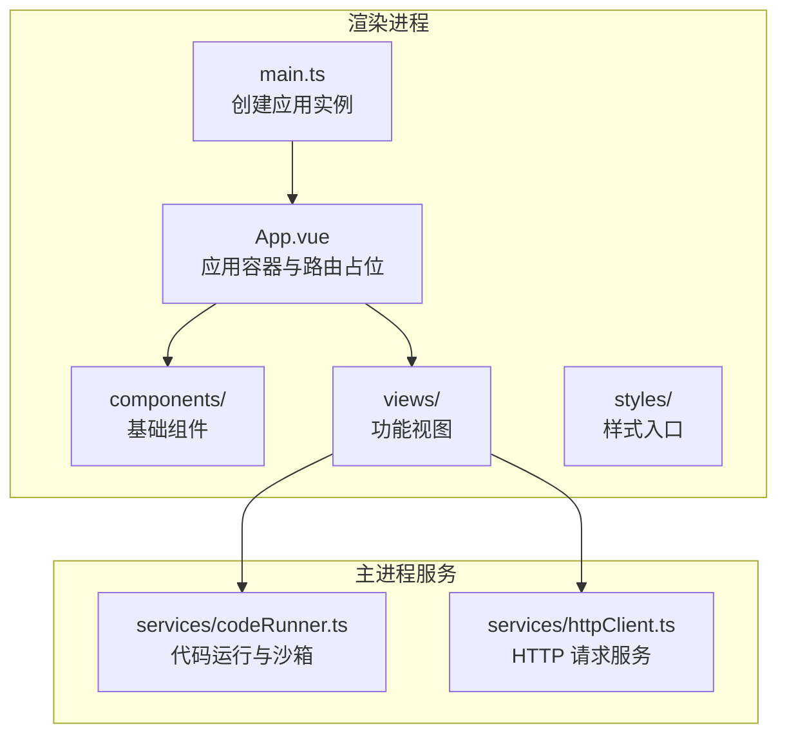
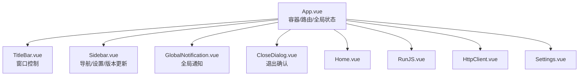
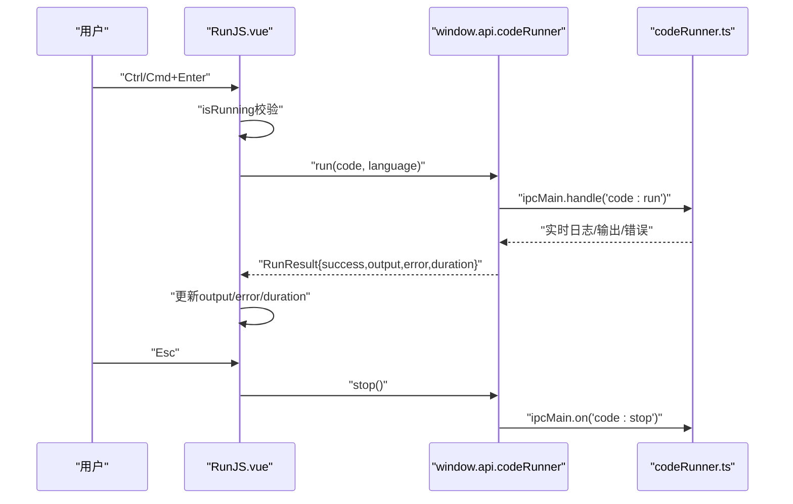
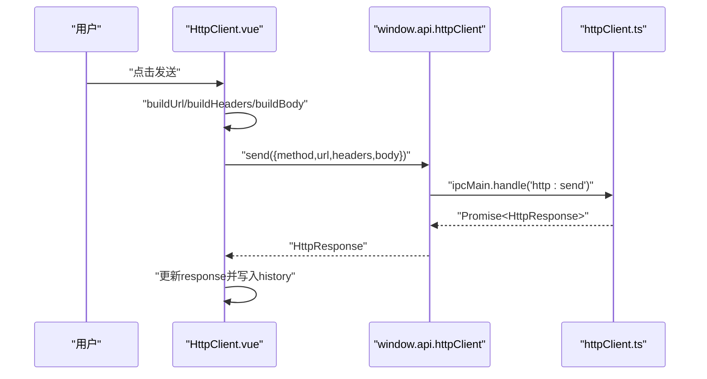
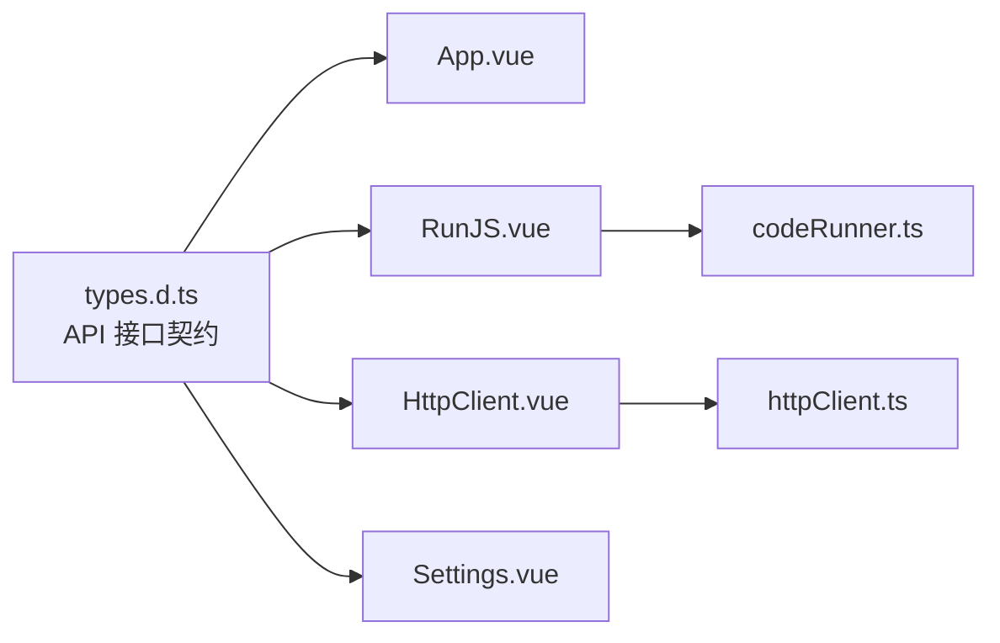

# 前端组件架构

<cite>
**本文引用的文件**
- [App.vue](file://src/renderer/src/App.vue)
- [main.ts](file://src/renderer/src/main.ts)
- [TitleBar.vue](file://src/renderer/src/components/TitleBar.vue)
- [Sidebar.vue](file://src/renderer/src/components/Sidebar.vue)
- [GlobalNotification.vue](file://src/renderer/src/components/GlobalNotification.vue)
- [CloseDialog.vue](file://src/renderer/src/components/CloseDialog.vue)
- [Home.vue](file://src/renderer/src/views/home/Home.vue)
- [RunJS.vue](file://src/renderer/src/views/runjs/RunJS.vue)
- [HttpClient.vue](file://src/renderer/src/views/httpclient/HttpClient.vue)
- [types.ts](file://src/renderer/src/views/httpclient/types.ts)
- [Settings.vue](file://src/renderer/src/views/settings/Settings.vue)
- [codeRunner.ts](file://src/main/services/codeRunner.ts)
- [httpClient.ts](file://src/main/services/httpClient.ts)
- [types.d.ts](file://src/renderer/src/types.d.ts)
- [package.json](file://package.json)
</cite>

## 目录
1. [简介](#简介)
2. [项目结构](#项目结构)
3. [核心组件](#核心组件)
4. [架构总览](#架构总览)
5. [组件详解](#组件详解)
6. [依赖关系分析](#依赖关系分析)
7. [性能考量](#性能考量)
8. [故障排查指南](#故障排查指南)
9. [结论](#结论)
10. [附录](#附录)

## 简介
本文件面向开发者工具箱的前端组件架构，系统性梳理基于 Vue 3 的组件体系，涵盖组件层次结构、状态管理模式、组件间通信机制与生命周期管理。重点覆盖基础组件（标题栏、侧边栏、全局通知、关闭对话框）与功能视图（主页、RunJS、HTTP 客户端、设置等）的设计与实现，并总结组件开发最佳实践与代码规范。

## 项目结构
应用采用 Electron + Vue 3 + Vite 的技术栈，前端渲染层位于 src/renderer/src，包含组件、视图、样式与类型声明；主进程服务位于 src/main/services，负责与系统能力交互（如代码运行、HTTP 请求、通知等）。入口文件通过 main.ts 创建应用实例并挂载根组件 App.vue。

图表来源
- [main.ts:1-6](file://src/renderer/src/main.ts#L1-L6)
- [App.vue:1-102](file://src/renderer/src/App.vue#L1-L102)
- [codeRunner.ts:1-461](file://src/main/services/codeRunner.ts#L1-L461)
- [httpClient.ts:1-113](file://src/main/services/httpClient.ts#L1-L113)

章节来源
- [main.ts:1-6](file://src/renderer/src/main.ts#L1-L6)
- [package.json:19-26](file://package.json#L19-L26)

## 核心组件
- 应用容器与动态路由
  - App.vue 通过 defineAsyncComponent 动态导入各功能视图，使用 KeepAlive 缓存当前视图，避免重复渲染与状态丢失。
  - 通过 activeTool 与工具列表控制侧边栏选中态与视图切换。
- 基础组件
  - TitleBar：窗口控制按钮与品牌区，响应最大化状态变化。
  - Sidebar：导航菜单、设置入口、版本更新控制与下载进度反馈。
  - GlobalNotification：全局通知弹窗，支持复制消息、自动消失与过渡动画。
  - CloseDialog：退出时的确认对话框，支持最小化或退出两种行为选择。
- 视图组件
  - Home：欢迎页与时间显示，使用 requestAnimationFrame 控制刷新节奏。
  - RunJS：多文件编辑器、NPM 包面板、文件面板、输出面板与运行控制。
  - HttpClient：请求构建、历史记录、响应展示与代理自动使用。
  - Settings：代理设置、开机自启动开关与保存逻辑。

章节来源
- [App.vue:11-31](file://src/renderer/src/App.vue#L11-L31)
- [App.vue:33-52](file://src/renderer/src/App.vue#L33-L52)
- [TitleBar.vue:1-150](file://src/renderer/src/components/TitleBar.vue#L1-L150)
- [Sidebar.vue:1-385](file://src/renderer/src/components/Sidebar.vue#L1-L385)
- [GlobalNotification.vue:1-211](file://src/renderer/src/components/GlobalNotification.vue#L1-L211)
- [CloseDialog.vue:1-215](file://src/renderer/src/components/CloseDialog.vue#L1-L215)
- [Home.vue:1-220](file://src/renderer/src/views/home/Home.vue#L1-L220)
- [RunJS.vue:1-353](file://src/renderer/src/views/runjs/RunJS.vue#L1-L353)
- [HttpClient.vue:1-275](file://src/renderer/src/views/httpclient/HttpClient.vue#L1-L275)
- [Settings.vue:1-315](file://src/renderer/src/views/settings/Settings.vue#L1-L315)

## 架构总览
前端采用“容器-视图-组件”分层：
- 容器层：App.vue 负责路由与全局状态（当前工具、关闭对话框可见性）。
- 视图层：各功能页面封装业务逻辑与本地状态，通过 props/emits 与子组件解耦。
- 组件层：基础 UI 组件独立、无副作用，通过注入的 window.api 与主进程通信。

图表来源
- [App.vue:55-75](file://src/renderer/src/App.vue#L55-L75)
- [TitleBar.vue:18-59](file://src/renderer/src/components/TitleBar.vue#L18-L59)
- [Sidebar.vue:94-194](file://src/renderer/src/components/Sidebar.vue#L94-L194)
- [GlobalNotification.vue:69-95](file://src/renderer/src/components/GlobalNotification.vue#L69-L95)
- [CloseDialog.vue:24-58](file://src/renderer/src/components/CloseDialog.vue#L24-L58)

## 组件详解

### 容器与路由：App.vue
- 动态路由
  - 使用 defineAsyncComponent 按需加载视图，减少首屏体积。
  - 通过 activeComponent 计算属性与 KeepAlive 缓存当前视图。
- 全局状态
  - activeTool：当前选中的工具 ID。
  - showCloseDialog：控制关闭对话框显示。
- 生命周期
  - onMounted：加载本地代理配置并注册关闭对话框回调。
- 事件流
  - Sidebar 通过 select/go-home 事件驱动 activeTool 变化，进而切换视图。

章节来源
- [App.vue:11-31](file://src/renderer/src/App.vue#L11-L31)
- [App.vue:33-52](file://src/renderer/src/App.vue#L33-L52)
- [App.vue:55-75](file://src/renderer/src/App.vue#L55-L75)

### 基础组件：TitleBar
- 功能点
  - 最小化、最大化/还原、关闭窗口。
  - 监听窗口最大化状态变化并实时更新 UI。
- 交互
  - 通过 window.api.window.* 调用主进程窗口控制能力。

章节来源
- [TitleBar.vue:1-150](file://src/renderer/src/components/TitleBar.vue#L1-L150)

### 基础组件：Sidebar
- 导航
  - 工具列表与图标映射，支持“回到首页”与“打开设置”。
- 版本更新
  - 检查更新、下载进度、下载完成提示与安装触发。
- 事件
  - select、go-home、settings 事件向上冒泡，由父组件处理。

章节来源
- [Sidebar.vue:1-385](file://src/renderer/src/components/Sidebar.vue#L1-L385)

### 基础组件：GlobalNotification
- 通知模型
  - 支持 info/success/warning/error 四类，自动 5 秒消失。
- 交互
  - 点击复制消息至剪贴板，支持二次提示。
- 生命周期
  - onMounted 注册通知监听，onUnmounted 移除监听，避免内存泄漏。

章节来源
- [GlobalNotification.vue:1-211](file://src/renderer/src/components/GlobalNotification.vue#L1-L211)

### 基础组件：CloseDialog
- 行为
  - 提供最小化到托盘或直接退出两种选项，支持“不再提醒”记忆。
- 事件
  - confirm 时向主进程发送结果，随后关闭对话框。

章节来源
- [CloseDialog.vue:1-215](file://src/renderer/src/components/CloseDialog.vue#L1-L215)

### 视图组件：Home
- 交互
  - 使用 requestAnimationFrame 控制时间刷新，避免不必要的重渲染。
- 数据
  - greeting/timeDisplay/dateDisplay 基于当前时间计算，保持响应式。

章节来源
- [Home.vue:1-220](file://src/renderer/src/views/home/Home.vue#L1-L220)

### 视图组件：RunJS
- 状态管理
  - files/activeFileId/isRunning/output/error/duration/activePanel 等本地状态。
- 数据持久化
  - 通过 localStorage 迁移旧数据并持久化当前文件与活动文件 ID。
- 事件与快捷键
  - Ctrl/Cmd+Enter 运行，Esc 停止；支持标签页新增/切换/关闭。
- 与主进程通信
  - 通过 window.api.codeRunner.run/stop 与主进程沙箱执行器交互。

图表来源
- [RunJS.vue:151-181](file://src/renderer/src/views/runjs/RunJS.vue#L151-L181)
- [codeRunner.ts:98-247](file://src/main/services/codeRunner.ts#L98-L247)

章节来源
- [RunJS.vue:1-353](file://src/renderer/src/views/runjs/RunJS.vue#L1-L353)
- [codeRunner.ts:1-461](file://src/main/services/codeRunner.ts#L1-L461)

### 视图组件：HttpClient
- 请求构建
  - method/url/headers/queryParams/bodyType/body/formData。
- URL 与头部处理
  - 自动补全协议、合并查询参数、按 bodyType 自动设置 Content-Type。
- 历史记录
  - 本地存储最多 100 条历史，支持选择、删除与清空。
- 与主进程通信
  - 通过 window.api.httpClient.send 调用主进程 net.request 实现跨域与代理。

图表来源
- [HttpClient.vue:121-167](file://src/renderer/src/views/httpclient/HttpClient.vue#L121-L167)
- [httpClient.ts:15-112](file://src/main/services/httpClient.ts#L15-L112)
- [types.ts:1-38](file://src/renderer/src/views/httpclient/types.ts#L1-L38)

章节来源
- [HttpClient.vue:1-275](file://src/renderer/src/views/httpclient/HttpClient.vue#L1-L275)
- [types.ts:1-38](file://src/renderer/src/views/httpclient/types.ts#L1-L38)
- [httpClient.ts:1-113](file://src/main/services/httpClient.ts#L1-L113)

### 视图组件：Settings
- 代理设置
  - 本地存储 app_proxy_url，保存时调用 window.api.app.setProxy 并同步到本地。
- 开机自启动
  - 通过 window.api.app.getAutoLaunch/setAutoLaunch 切换状态。

章节来源
- [Settings.vue:1-315](file://src/renderer/src/views/settings/Settings.vue#L1-L315)

## 依赖关系分析
- 类型与 API 契约
  - types.d.ts 定义了 window.api 下各模块的接口契约，包括 window、codeRunner、httpClient、app、notification 等。
- 组件与服务的耦合
  - 视图组件通过 window.api.* 与主进程服务解耦，降低组件复杂度。
- 第三方库
  - 项目使用 Monaco Editor、UUID、TailwindCSS 等库，分别用于代码编辑与 UI 样式。

图表来源
- [types.d.ts:15-287](file://src/renderer/src/types.d.ts#L15-L287)
- [App.vue:1-102](file://src/renderer/src/App.vue#L1-L102)
- [RunJS.vue:1-353](file://src/renderer/src/views/runjs/RunJS.vue#L1-L353)
- [HttpClient.vue:1-275](file://src/renderer/src/views/httpclient/HttpClient.vue#L1-L275)
- [Settings.vue:1-315](file://src/renderer/src/views/settings/Settings.vue#L1-L315)
- [codeRunner.ts:1-461](file://src/main/services/codeRunner.ts#L1-L461)
- [httpClient.ts:1-113](file://src/main/services/httpClient.ts#L1-L113)

章节来源
- [types.d.ts:1-295](file://src/renderer/src/types.d.ts#L1-L295)
- [package.json:28-73](file://package.json#L28-L73)

## 性能考量
- 按需加载与缓存
  - 使用 defineAsyncComponent 与 KeepAlive 减少首屏与频繁切换开销。
- 本地状态与持久化
  - RunJS 与 HttpClient 通过 localStorage 缓存状态，避免每次进入重建。
- 渲染优化
  - Home 使用 requestAnimationFrame 控制刷新频率；RunJS 使用 Transition 控制面板切换动画。
- 主进程隔离
  - 代码运行与 HTTP 请求在主进程执行，避免渲染线程阻塞。

## 故障排查指南
- 通知无法显示
  - 检查 GlobalNotification 是否成功注册 window.api.notification.onNotify，并在卸载时调用 removeListener。
- 代码运行异常
  - 确认主进程 codeRunner.ts 已注册 ipcMain.handle('code:run')，并检查沙箱输出与错误日志。
- HTTP 请求失败
  - 核对 HttpClient 构建的 URL/Headers/Body，确认主进程 httpClient.ts 正常处理 net.request 并返回结果。
- 代理设置无效
  - 检查 Settings.vue 中保存逻辑与 localStorage 同步，以及主进程 app.setProxy 的调用链。

章节来源
- [GlobalNotification.vue:54-62](file://src/renderer/src/components/GlobalNotification.vue#L54-L62)
- [codeRunner.ts:98-247](file://src/main/services/codeRunner.ts#L98-L247)
- [httpClient.ts:15-112](file://src/main/services/httpClient.ts#L15-L112)
- [Settings.vue:9-57](file://src/renderer/src/views/settings/Settings.vue#L9-L57)

## 结论
该前端组件架构以 App.vue 为容器，配合 Sidebar、TitleBar、GlobalNotification、CloseDialog 等基础组件，形成清晰的 UI 分层；视图组件围绕业务场景组织状态与交互，通过 window.api 与主进程服务解耦。整体设计具备良好的可维护性与扩展性，适合持续迭代与功能拓展。

## 附录

### 组件生命周期与事件处理要点
- 生命周期
  - onMounted：初始化外部监听、读取本地存储、注册全局事件。
  - onUnmounted：移除监听、清理定时器与资源。
- 事件处理
  - 子组件通过 emits 向上冒泡，父组件集中处理路由与状态变更。
  - 全局快捷键在视图组件内注册与注销，避免重复绑定。

章节来源
- [Home.vue:43-50](file://src/renderer/src/views/home/Home.vue#L43-L50)
- [RunJS.vue:205-211](file://src/renderer/src/views/runjs/RunJS.vue#L205-L211)
- [GlobalNotification.vue:54-62](file://src/renderer/src/components/GlobalNotification.vue#L54-L62)

### 数据绑定策略
- 响应式数据
  - 使用 ref/computed/watch 管理本地状态与派生数据。
- 表单与双向绑定
  - Settings 中使用 v-model 绑定输入框，减少显式 setter。
- 列表渲染
  - Sidebar 与 HttpClient 使用 v-for 渲染工具项与历史项，结合唯一 key 提升重排效率。

章节来源
- [Settings.vue:92-112](file://src/renderer/src/views/settings/Settings.vue#L92-L112)
- [Sidebar.vue:107-126](file://src/renderer/src/components/Sidebar.vue#L107-L126)
- [HttpClient.vue:194-201](file://src/renderer/src/views/httpclient/HttpClient.vue#L194-L201)

### 组件开发最佳实践与代码规范
- 组件职责单一
  - 基础组件专注 UI 与交互，不直接访问主进程 API；业务组件封装状态与流程。
- 明确的 props/emits
  - 通过类型定义约束输入输出，提升可读性与可测试性。
- 事件命名与冒泡
  - 使用语义化事件名，避免深层嵌套；必要时使用 .native 或自定义修饰符。
- 状态持久化
  - 重要状态写入 localStorage 或 sessionStorage，注意序列化与异常处理。
- 错误处理
  - 对外暴露统一的错误信息与降级策略，避免抛出不可控异常。
- 性能优化
  - 合理使用 KeepAlive、懒加载与过渡动画；避免在渲染函数中进行重型计算。