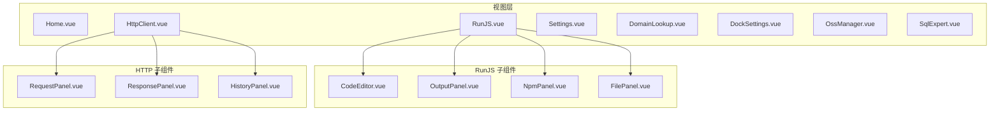
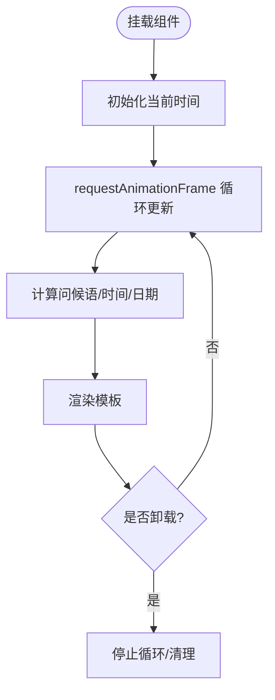
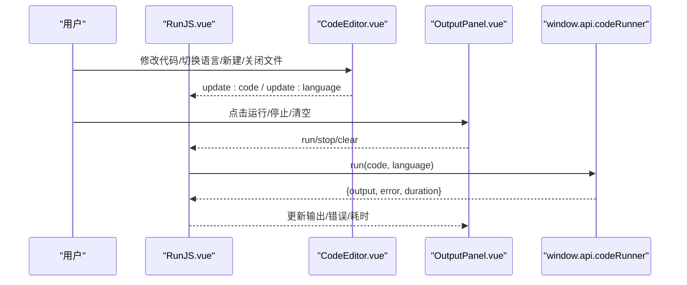
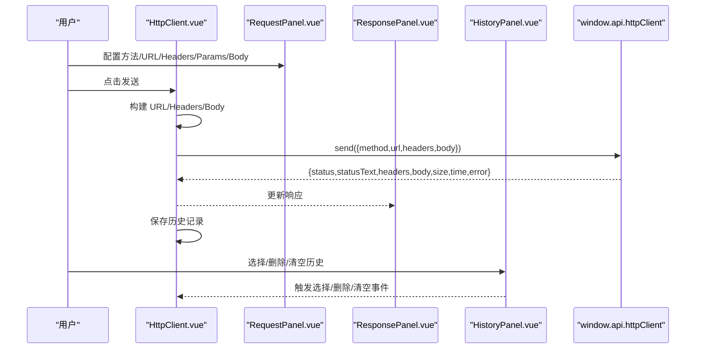
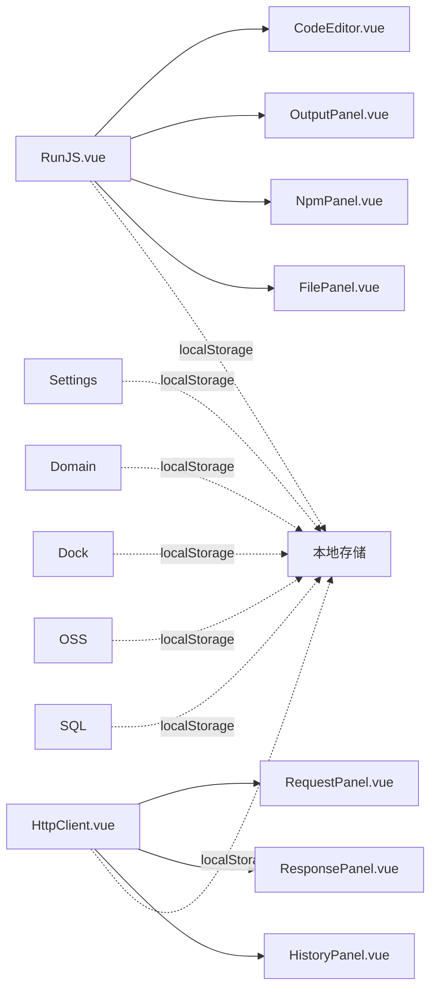

# 功能视图组件

<cite>
**本文档引用的文件**
- [Home.vue](file://src/renderer/src/views/home/Home.vue)
- [RunJS.vue](file://src/renderer/src/views/runjs/RunJS.vue)
- [CodeEditor.vue](file://src/renderer/src/views/runjs/components/CodeEditor.vue)
- [OutputPanel.vue](file://src/renderer/src/views/runjs/components/OutputPanel.vue)
- [NpmPanel.vue](file://src/renderer/src/views/runjs/components/NpmPanel.vue)
- [FilePanel.vue](file://src/renderer/src/views/runjs/components/FilePanel.vue)
- [HttpClient.vue](file://src/renderer/src/views/httpclient/HttpClient.vue)
- [RequestPanel.vue](file://src/renderer/src/views/httpclient/components/RequestPanel.vue)
- [ResponsePanel.vue](file://src/renderer/src/views/httpclient/components/ResponsePanel.vue)
- [HistoryPanel.vue](file://src/renderer/src/views/httpclient/components/HistoryPanel.vue)
- [types.ts](file://src/renderer/src/views/httpclient/types.ts)
- [Settings.vue](file://src/renderer/src/views/settings/Settings.vue)
- [DomainLookup.vue](file://src/renderer/src/views/domainlookup/DomainLookup.vue)
- [DockSettings.vue](file://src/renderer/src/views/dock/DockSettings.vue)
- [OssManager.vue](file://src/renderer/src/views/oss/OssManager.vue)
- [SqlExpert.vue](file://src/renderer/src/views/sqlexpert/SqlExpert.vue)
</cite>

## 目录
1. [简介](#简介)
2. [项目结构](#项目结构)
3. [核心组件](#核心组件)
4. [架构总览](#架构总览)
5. [详细组件分析](#详细组件分析)
6. [依赖关系分析](#依赖关系分析)
7. [性能考虑](#性能考虑)
8. [故障排除指南](#故障排除指南)
9. [结论](#结论)

## 简介
本文件面向开发者工具箱的功能视图组件，系统性梳理主页视图、RunJS 代码运行器、HTTP 客户端、设置面板以及专业工具视图（域名查询、Dock 设置、OSS 管理、SQL 专家）的设计模式、布局结构与交互流程，并总结组件间的数据流与状态管理机制。

## 项目结构
- 视图层采用按功能域划分的目录结构，每个视图包含自身页面组件与其子组件。
- 主要视图：
  - 主页：Home.vue
  - 代码运行器：RunJS.vue 及其子组件
  - HTTP 客户端：HttpClient.vue 及其子组件
  - 设置面板：Settings.vue
  - 专业工具：DomainLookup.vue、DockSettings.vue、OssManager.vue、SqlExpert.vue
- 子组件通过 props/emit 与父组件通信，共享状态通过本地存储或窗口桥接 API 与主进程交互。

图表来源
- [RunJS.vue:1-353](file://src/renderer/src/views/runjs/RunJS.vue#L1-L353)
- [HttpClient.vue:1-275](file://src/renderer/src/views/httpclient/HttpClient.vue#L1-L275)

章节来源
- [Home.vue:1-220](file://src/renderer/src/views/home/Home.vue#L1-L220)
- [RunJS.vue:1-353](file://src/renderer/src/views/runjs/RunJS.vue#L1-L353)
- [HttpClient.vue:1-275](file://src/renderer/src/views/httpclient/HttpClient.vue#L1-L275)
- [Settings.vue:1-315](file://src/renderer/src/views/settings/Settings.vue#L1-L315)
- [DomainLookup.vue:1-913](file://src/renderer/src/views/domainlookup/DomainLookup.vue#L1-L913)
- [DockSettings.vue:1-651](file://src/renderer/src/views/dock/DockSettings.vue#L1-L651)
- [OssManager.vue:1-913](file://src/renderer/src/views/oss/OssManager.vue#L1-L913)
- [SqlExpert.vue:1-1105](file://src/renderer/src/views/sqlexpert/SqlExpert.vue#L1-L1105)

## 核心组件
- 主页视图（Home.vue）
  - 设计模式：基于响应式时间计算问候语与日期时间显示；使用 requestAnimationFrame 驱动时钟更新；模板内含动画与背景装饰元素。
  - 布局结构：全屏居中布局，背景包含动态光晕与网格遮罩，内容区包含问候语、时间块与日期。
- RunJS 代码运行器（RunJS.vue + 子组件）
  - 设计模式：单页三栏布局（左侧 NPM/文件面板、中间编辑器、右侧输出面板），状态集中于组件内并通过本地存储持久化；通过 window.api 与主进程交互。
  - 关键子组件：CodeEditor（Monaco 集成、类型加载、快捷键）、OutputPanel（运行/停止/清空、端口终止）、NpmPanel（包搜索/安装/卸载/版本切换）、FilePanel（文件列表与操作）。
- HTTP 客户端（HttpClient.vue + 子组件）
  - 设计模式：左右布局（左侧历史面板折叠开关、右侧主体），主体分为请求配置区与响应展示区；请求构建与发送通过 window.api.httpClient。
  - 关键子组件：RequestPanel（方法/URL/Params/Headers/Body 配置）、ResponsePanel（状态/头部/正文展示与复制）、HistoryPanel（历史记录列表与操作）。
- 设置面板（Settings.vue）
  - 设计模式：卡片式布局，包含通用与网络两个部分；通过 window.api.app 设置代理与开机自启动，并持久化到本地存储。
- 专业工具视图
  - 域名查询（DomainLookup.vue）：输入域名/IP，发起查询与端口扫描，展示地理/ISP/连接/技术栈等多维度信息。
  - Dock 设置（DockSettings.vue）：模拟 macOS Dock，支持位置、图标大小、自动隐藏、放大效果等设置，通过 window.api.dock 打开/关闭 Dock 并持久化设置。
  - OSS 管理（OssManager.vue）：拖拽/选择文件上传至阿里云 OSS，支持批量进度监控与取消上传，配置持久化。
  - SQL 专家（SqlExpert.vue）：基于会话的历史记录、AI 对话、工具调用（导出数据、渲染图表、保存记忆）与设置面板。

章节来源
- [Home.vue:1-220](file://src/renderer/src/views/home/Home.vue#L1-L220)
- [RunJS.vue:1-353](file://src/renderer/src/views/runjs/RunJS.vue#L1-L353)
- [HttpClient.vue:1-275](file://src/renderer/src/views/httpclient/HttpClient.vue#L1-L275)
- [Settings.vue:1-315](file://src/renderer/src/views/settings/Settings.vue#L1-L315)
- [DomainLookup.vue:1-913](file://src/renderer/src/views/domainlookup/DomainLookup.vue#L1-L913)
- [DockSettings.vue:1-651](file://src/renderer/src/views/dock/DockSettings.vue#L1-L651)
- [OssManager.vue:1-913](file://src/renderer/src/views/oss/OssManager.vue#L1-L913)
- [SqlExpert.vue:1-1105](file://src/renderer/src/views/sqlexpert/SqlExpert.vue#L1-L1105)

## 架构总览
- 视图层组件通过 props/emit 与子组件通信，状态通过本地存储或 window.api 与主进程交互。
- RunJS 与 HTTP 客户端均依赖 window.api.* 接口进行实际执行与网络请求。
- 专业工具视图分别对接各自的服务接口（域名查询、Dock、OSS、SQL 专家）。

```mermaid
graph TB
Home["Home.vue"]
RunJS["RunJS.vue"]
Http["HttpClient.vue"]
Settings["Settings.vue"]
Domain["DomainLookup.vue"]
Dock["DockSettings.vue"]
OSS["OssManager.vue"]
SQL["SqlExpert.vue"]
subgraph "RunJS 子组件"
CE["CodeEditor.vue"]
OP["OutputPanel.vue"]
NP["NpmPanel.vue"]
FP["FilePanel.vue"]
end
subgraph "HTTP 子组件"
RP["RequestPanel.vue"]
RSP["ResponsePanel.vue"]
HP["HistoryPanel.vue"]
end
RunJS --> CE
RunJS --> OP
RunJS --> NP
RunJS --> FP
Http --> RP
Http --> RSP
Http --> HP
RunJS -.->|"window.api.codeRunner"| RunJS_API["主进程代码运行器"]
Http -.->|"window.api.httpClient"| Http_API["主进程 HTTP 客户端"]
Settings -.->|"window.api.app"| App_API["主进程应用服务"]
Domain -.->|"window.api.domainLookup"| Domain_API["主进程域名查询"]
Dock -.->|"window.api.dock"| Dock_API["主进程 Dock 窗口"]
OSS -.->|"window.api.oss"| OSS_API["主进程 OSS 上传"]
SQL -.->|"window.api.sqlExpert"| SQL_API["主进程 SQL 专家"]
```

图表来源
- [RunJS.vue:150-182](file://src/renderer/src/views/runjs/RunJS.vue#L150-L182)
- [HttpClient.vue:121-167](file://src/renderer/src/views/httpclient/HttpClient.vue#L121-L167)
- [Settings.vue:23-57](file://src/renderer/src/views/settings/Settings.vue#L23-L57)
- [DomainLookup.vue:76-88](file://src/renderer/src/views/domainlookup/DomainLookup.vue#L76-L88)
- [DockSettings.vue:114-135](file://src/renderer/src/views/dock/DockSettings.vue#L114-L135)
- [OssManager.vue:220-264](file://src/renderer/src/views/oss/OssManager.vue#L220-L264)
- [SqlExpert.vue:589-599](file://src/renderer/src/views/sqlexpert/SqlExpert.vue#L589-L599)

## 详细组件分析

### 主页视图（Home.vue）
- 设计要点
  - 响应式问候语与时间显示：根据小时数动态生成问候语，使用本地时间驱动更新。
  - 动画与视觉：背景光晕与网格遮罩，内容区逐项入场动画，时间显示采用等宽字体与数字分隔。
- 数据与状态
  - 当前时间状态、问候语与日期时间计算均为本地响应式状态。
- 生命周期
  - 挂载时启动定时更新，卸载时停止更新，避免内存泄漏。

图表来源
- [Home.vue:43-50](file://src/renderer/src/views/home/Home.vue#L43-L50)

章节来源
- [Home.vue:1-220](file://src/renderer/src/views/home/Home.vue#L1-L220)

### RunJS 代码运行器（RunJS.vue）
- 设计模式
  - 三栏布局：左侧 NPM/文件面板、中间编辑器、右侧输出面板；支持标签页切换与文件管理。
  - 状态管理：文件列表、活动文件、运行状态、输出/错误、执行耗时；通过本地存储持久化。
  - 交互：快捷键（Ctrl/Cmd+Enter 运行、Esc 停止）、文件操作（新建/关闭/切换）、语言切换（JS/TS）。
- 关键流程
  - 代码运行：调用 window.api.codeRunner.run，接收输出/错误与耗时；支持停止与端口进程终止。
  - 类型加载：编辑器内容变化触发类型定义加载，NPM 面板支持包搜索/安装/卸载与版本切换。
- 数据结构
  - CodeFile：文件标识、名称、内容、语言、最后修改时间。
  - 运行结果：输出文本、错误信息、耗时。

图表来源
- [RunJS.vue:151-181](file://src/renderer/src/views/runjs/RunJS.vue#L151-L181)
- [OutputPanel.vue:11-15](file://src/renderer/src/views/runjs/components/OutputPanel.vue#L11-L15)

章节来源
- [RunJS.vue:1-353](file://src/renderer/src/views/runjs/RunJS.vue#L1-L353)
- [CodeEditor.vue:1-556](file://src/renderer/src/views/runjs/components/CodeEditor.vue#L1-L556)
- [OutputPanel.vue:1-250](file://src/renderer/src/views/runjs/components/OutputPanel.vue#L1-L250)
- [NpmPanel.vue:1-431](file://src/renderer/src/views/runjs/components/NpmPanel.vue#L1-L431)
- [FilePanel.vue:1-100](file://src/renderer/src/views/runjs/components/FilePanel.vue#L1-L100)

### HTTP 客户端（HttpClient.vue）
- 设计模式
  - 左右布局：左侧历史面板可折叠，右侧主体分为请求配置与响应展示。
  - 请求构建：方法/URL/Headers/Query Params/Body（JSON/Form/Text）；自动补全协议与 Content-Type。
  - 响应展示：状态码分级样式、耗时/大小、JSON 格式化、复制响应。
  - 历史管理：本地存储历史记录，支持选择、删除、清空。
- 关键流程
  - 发送请求：构建 URL/Headers/Body，调用 window.api.httpClient.send，更新响应与历史。
  - 历史操作：选择历史项填充请求配置，删除单条或清空全部。

图表来源
- [HttpClient.vue:121-167](file://src/renderer/src/views/httpclient/HttpClient.vue#L121-L167)
- [RequestPanel.vue:1-227](file://src/renderer/src/views/httpclient/components/RequestPanel.vue#L1-L227)
- [ResponsePanel.vue:1-180](file://src/renderer/src/views/httpclient/components/ResponsePanel.vue#L1-L180)
- [HistoryPanel.vue:1-116](file://src/renderer/src/views/httpclient/components/HistoryPanel.vue#L1-L116)
- [types.ts:1-38](file://src/renderer/src/views/httpclient/types.ts#L1-L38)

章节来源
- [HttpClient.vue:1-275](file://src/renderer/src/views/httpclient/HttpClient.vue#L1-L275)
- [RequestPanel.vue:1-227](file://src/renderer/src/views/httpclient/components/RequestPanel.vue#L1-L227)
- [ResponsePanel.vue:1-180](file://src/renderer/src/views/httpclient/components/ResponsePanel.vue#L1-L180)
- [HistoryPanel.vue:1-116](file://src/renderer/src/views/httpclient/components/HistoryPanel.vue#L1-L116)
- [types.ts:1-38](file://src/renderer/src/views/httpclient/types.ts#L1-L38)

### 设置面板（Settings.vue）
- 功能模块
  - 通用：开机自启动开关，通过 window.api.app.getAutoLaunch/setAutoLaunch 控制。
  - 网络：HTTP 代理设置，支持保存与清除，写入/读取本地存储并调用 window.api.app.setProxy。
- 状态管理
  - 代理 URL 与自启动状态通过本地存储持久化，首次挂载时读取并应用。

章节来源
- [Settings.vue:1-315](file://src/renderer/src/views/settings/Settings.vue#L1-L315)

### 专业工具视图

#### 域名查询（DomainLookup.vue）
- 功能特性
  - 输入域名/IP，发起查询与端口扫描，展示基础信息、地理位置、ISP、连接类型、域名信息、安全信息与技术栈/端口扫描结果。
  - 支持复制文本、停止查询、键盘回车触发查询。
- 数据结构
  - 查询结果包含 IP 列表、基础信息、位置、ISP、连接、域名详情、技术栈与端口扫描结果等。

章节来源
- [DomainLookup.vue:1-913](file://src/renderer/src/views/domainlookup/DomainLookup.vue#L1-L913)

#### Dock 设置（DockSettings.vue）
- 功能特性
  - 模拟 macOS Dock，支持位置（底部/左侧/右侧）、图标大小、自动隐藏、放大效果等设置。
  - 应用管理：添加/编辑/删除应用（含分隔线），支持预设与自定义动作（打开网址/打开应用），拖拽排序。
  - 状态检查：检查 Dock 窗口是否已打开，通过 window.api.dock.open/close 控制。
- 状态管理
  - 设置与应用列表持久化到本地存储，深拷贝设置对象用于 IPC 传输。

章节来源
- [DockSettings.vue:1-651](file://src/renderer/src/views/dock/DockSettings.vue#L1-L651)

#### OSS 管理（OssManager.vue）
- 功能特性
  - 配置 OSS 连接（AccessKey/Secret/Endpoint/Bucket），目标路径（可选），默认 ACL 为 public-read。
  - 拖拽/选择文件/文件夹上传，批量进度监控与取消上传。
  - 文件列表支持清空与终止上传，进度条与统计信息实时更新。
- 状态管理
  - 配置与文件列表持久化到本地存储，上传进度通过 window.api.oss.onUploadProgress 监听回调更新。

章节来源
- [OssManager.vue:1-913](file://src/renderer/src/views/oss/OssManager.vue#L1-L913)

#### SQL 专家（SqlExpert.vue）
- 功能特性
  - 会话历史管理、新聊天、会话文件弹窗、记忆管理（新增/编辑/删除）。
  - 设置面板：数据库连接（MySQL）、AI 模型（DeepSeek）、一键加载表结构与本地记忆刷新。
  - 对话渲染：Markdown 渲染、代码高亮、工具调用分段显示（导出数据/渲染图表/保存记忆）。
  - 余额查询与用量统计：自动查询余额与估算费用。
- 状态管理
  - 使用组合式函数 useSqlExpertChat 管理会话、消息、历史、Schema、记忆等状态。

章节来源
- [SqlExpert.vue:1-1105](file://src/renderer/src/views/sqlexpert/SqlExpert.vue#L1-L1105)

## 依赖关系分析
- 组件耦合
  - RunJS 与 HTTP 客户端均依赖 window.api.* 接口，形成与主进程的弱耦合。
  - 子组件通过 props/emit 与父组件通信，降低跨层级耦合。
- 外部依赖
  - RunJS：Monaco Editor、类型加载与代码片段。
  - HTTP 客户端：请求构建与响应格式化。
  - SQL 专家：MarkdownIt、highlight.js、DOMPurify。
- 数据持久化
  - RunJS：localStorage 存储文件与活动文件 ID。
  - HTTP 客户端：localStorage 存储历史记录。
  - 设置面板：localStorage 存储代理 URL。
  - 专业工具：各视图独立持久化配置与状态。

图表来源
- [RunJS.vue:30-90](file://src/renderer/src/views/runjs/RunJS.vue#L30-L90)
- [HttpClient.vue:33-51](file://src/renderer/src/views/httpclient/HttpClient.vue#L33-L51)
- [Settings.vue:9-21](file://src/renderer/src/views/settings/Settings.vue#L9-L21)
- [DomainLookup.vue:67-89](file://src/renderer/src/views/domainlookup/DomainLookup.vue#L67-L89)
- [DockSettings.vue:92-111](file://src/renderer/src/views/dock/DockSettings.vue#L92-L111)
- [OssManager.vue:62-92](file://src/renderer/src/views/oss/OssManager.vue#L62-L92)
- [SqlExpert.vue:519-537](file://src/renderer/src/views/sqlexpert/SqlExpert.vue#L519-L537)

章节来源
- [RunJS.vue:30-90](file://src/renderer/src/views/runjs/RunJS.vue#L30-L90)
- [HttpClient.vue:33-51](file://src/renderer/src/views/httpclient/HttpClient.vue#L33-L51)
- [Settings.vue:9-21](file://src/renderer/src/views/settings/Settings.vue#L9-L21)
- [DomainLookup.vue:67-89](file://src/renderer/src/views/domainlookup/DomainLookup.vue#L67-L89)
- [DockSettings.vue:92-111](file://src/renderer/src/views/dock/DockSettings.vue#L92-L111)
- [OssManager.vue:62-92](file://src/renderer/src/views/oss/OssManager.vue#L62-L92)
- [SqlExpert.vue:519-537](file://src/renderer/src/views/sqlexpert/SqlExpert.vue#L519-L537)

## 性能考虑
- RunJS
  - Monaco 编辑器初始化与模型切换需谨慎，避免频繁重建模型导致性能下降；内容变化触发类型加载采用防抖策略。
  - 本地存储读写在状态变更时进行，建议批量化更新以减少 I/O。
- HTTP 客户端
  - URL 构建与 JSON 格式化在渲染前完成，避免重复计算；历史记录上限控制在 100 条以内。
- 专业工具
  - SQL 专家的 Markdown 渲染与代码高亮在组件内完成，建议对长文本进行分段渲染或虚拟滚动优化。
  - OSS 上传进度监听在组件挂载时注册，卸载时清理监听器，防止内存泄漏。

## 故障排除指南
- RunJS
  - 代码运行失败：检查 window.api.codeRunner 返回的错误信息，确认语言与内容格式；尝试停止运行后重试。
  - 类型加载异常：关注类型加载状态提示，确认网络与包安装状态。
- HTTP 客户端
  - 请求失败：检查 URL 协议与 Query Params，确认 Content-Type 自动设置；查看错误响应。
  - 历史记录异常：清空历史后重试，确认本地存储可写。
- 设置面板
  - 代理设置无效：确认 window.api.app.setProxy 返回成功；检查本地存储代理 URL 是否正确。
- 专业工具
  - 域名查询超时：检查网络与 DNS；尝试停止后重试。
  - Dock 设置未生效：确认 window.api.dock.open 返回成功；检查本地存储设置。
  - OSS 上传失败：检查 AccessKey/Endpoint/Bucket 与目标路径；查看进度回调中的错误信息。
  - SQL 专家工具调用失败：检查数据库连接与 AI 模型配置；查看工具调用结果与错误信息。

章节来源
- [RunJS.vue:167-171](file://src/renderer/src/views/runjs/RunJS.vue#L167-L171)
- [HttpClient.vue:154-166](file://src/renderer/src/views/httpclient/HttpClient.vue#L154-L166)
- [Settings.vue:23-57](file://src/renderer/src/views/settings/Settings.vue#L23-L57)
- [DomainLookup.vue:79-88](file://src/renderer/src/views/domainlookup/DomainLookup.vue#L79-L88)
- [DockSettings.vue:114-135](file://src/renderer/src/views/dock/DockSettings.vue#L114-L135)
- [OssManager.vue:243-264](file://src/renderer/src/views/oss/OssManager.vue#L243-L264)
- [SqlExpert.vue:104-153](file://src/renderer/src/views/sqlexpert/SqlExpert.vue#L104-L153)

## 结论
开发者工具箱的功能视图组件围绕“简洁、高效、可扩展”的设计目标构建：主页提供友好体验，RunJS 与 HTTP 客户端覆盖日常开发高频场景，设置面板统一管理应用配置，专业工具视图满足特定领域需求。组件间通过 props/emit 与 window.api 形成清晰的边界与职责分离，配合本地存储实现状态持久化，整体具备良好的可维护性与扩展性。