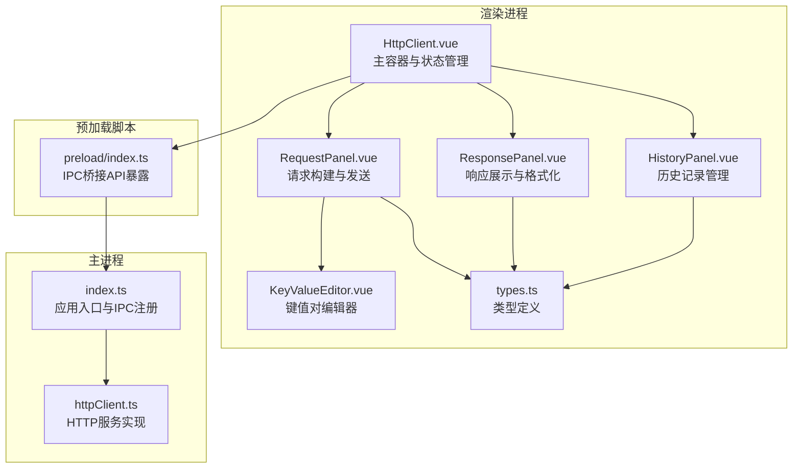
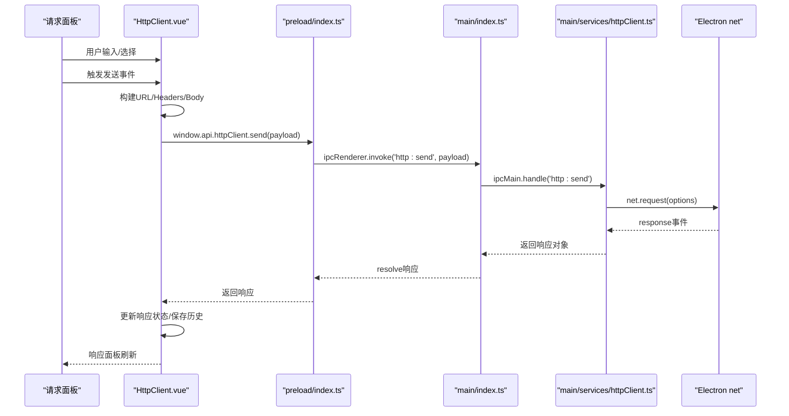
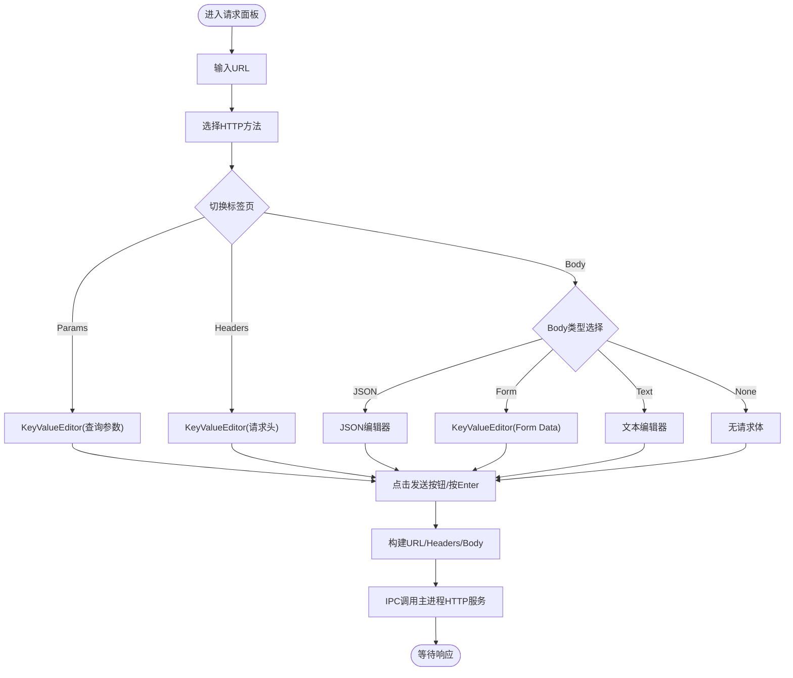
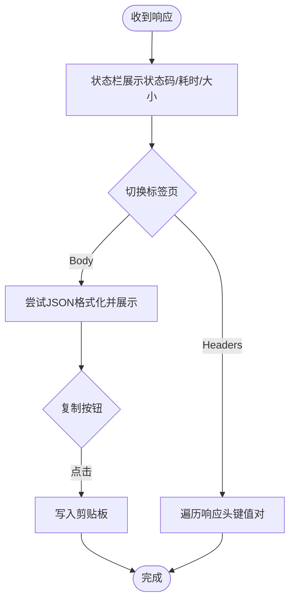
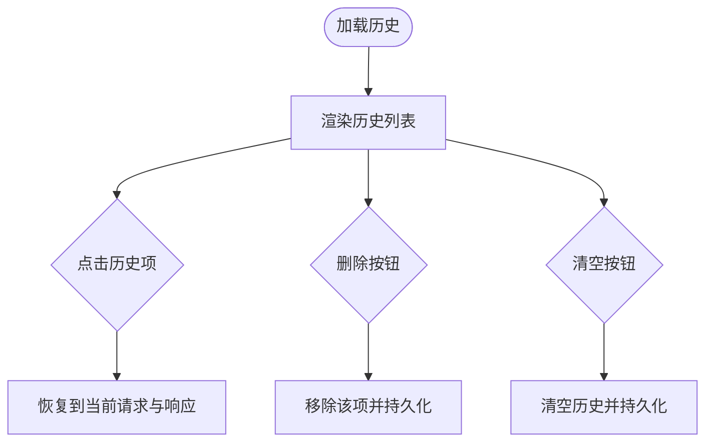
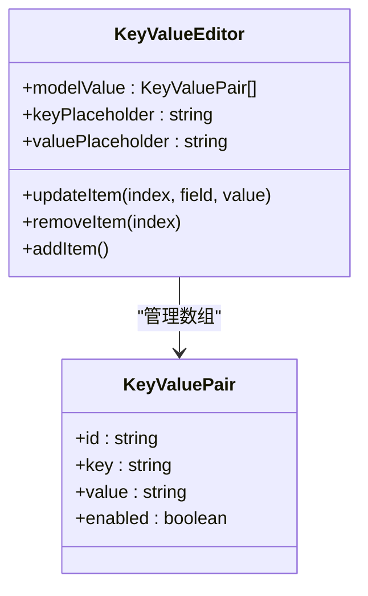
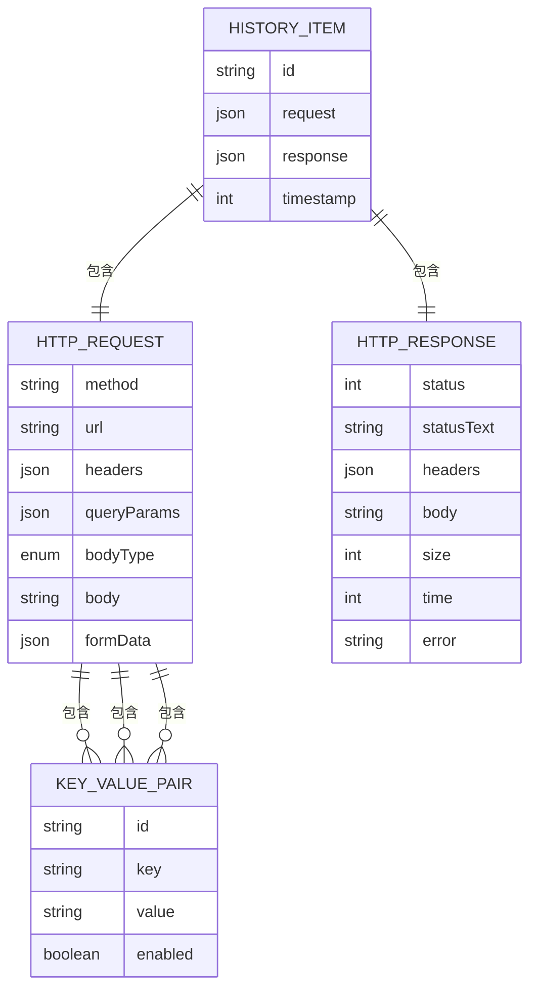
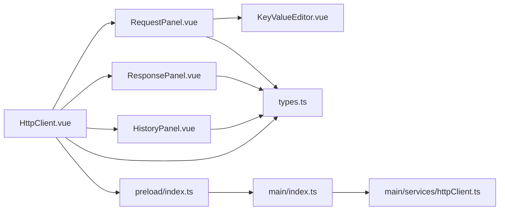

# HTTP客户端组件群

<cite>
**本文档引用的文件**
- [HttpClient.vue](file://src/renderer/src/views/httpclient/HttpClient.vue)
- [RequestPanel.vue](file://src/renderer/src/views/httpclient/components/RequestPanel.vue)
- [ResponsePanel.vue](file://src/renderer/src/views/httpclient/components/ResponsePanel.vue)
- [HistoryPanel.vue](file://src/renderer/src/views/httpclient/components/HistoryPanel.vue)
- [KeyValueEditor.vue](file://src/renderer/src/views/httpclient/components/KeyValueEditor.vue)
- [types.ts](file://src/renderer/src/views/httpclient/types.ts)
- [httpClient.ts](file://src/main/services/httpClient.ts)
- [index.ts](file://src/main/index.ts)
- [index.ts](file://src/preload/index.ts)
- [index.css](file://src/renderer/src/styles/index.css)
</cite>

## 目录
1. [简介](#简介)
2. [项目结构](#项目结构)
3. [核心组件](#核心组件)
4. [架构总览](#架构总览)
5. [详细组件分析](#详细组件分析)
6. [依赖关系分析](#依赖关系分析)
7. [性能考虑](#性能考虑)
8. [故障排除指南](#故障排除指南)
9. [结论](#结论)

## 简介
本文件为HTTP客户端组件群的技术文档，涵盖请求面板、响应面板、历史面板与键值编辑器的实现细节，以及整体架构、请求发送流程、响应处理机制、错误处理策略、组件间通信与数据流、以及与主进程HTTP服务的IPC集成。文档旨在帮助开发者快速理解与扩展该模块。

## 项目结构
HTTP客户端模块位于渲染进程的视图层，采用Vue 3 Composition API与TypeScript实现；请求实际由Electron主进程通过net模块执行，渲染进程通过IPC与主进程交互。

图表来源
- [HttpClient.vue:1-275](file://src/renderer/src/views/httpclient/HttpClient.vue#L1-L275)
- [RequestPanel.vue:1-227](file://src/renderer/src/views/httpclient/components/RequestPanel.vue#L1-L227)
- [ResponsePanel.vue:1-180](file://src/renderer/src/views/httpclient/components/ResponsePanel.vue#L1-L180)
- [HistoryPanel.vue:1-116](file://src/renderer/src/views/httpclient/components/HistoryPanel.vue#L1-L116)
- [KeyValueEditor.vue:1-106](file://src/renderer/src/views/httpclient/components/KeyValueEditor.vue#L1-L106)
- [types.ts:1-38](file://src/renderer/src/views/httpclient/types.ts#L1-L38)
- [index.ts:1-444](file://src/main/index.ts#L1-L444)
- [httpClient.ts:1-113](file://src/main/services/httpClient.ts#L1-L113)
- [index.ts:1-229](file://src/preload/index.ts#L1-L229)

章节来源
- [HttpClient.vue:1-275](file://src/renderer/src/views/httpclient/HttpClient.vue#L1-L275)
- [index.ts:421-428](file://src/main/index.ts#L421-L428)

## 核心组件
- 主容器组件：负责全局状态（当前请求、响应、历史、加载态）、URL构建、请求头与请求体构建、调用主进程HTTP服务、历史持久化与清理。
- 请求面板：提供URL输入、方法选择、Params/Headers/Body三类配置，支持JSON格式化、方法下拉选择、快捷键触发发送。
- 响应面板：展示状态码与耗时、大小、错误信息，支持响应体JSON格式化与复制、响应头列表展示。
- 历史面板：展示历史记录列表、时间戳、方法与状态色、短URL、清空与删除操作。
- 键值编辑器：通用的键值对增删改查、启用/禁用、占位符配置，用于Params、Headers、FormData等场景。

章节来源
- [HttpClient.vue:15-25](file://src/renderer/src/views/httpclient/HttpClient.vue#L15-L25)
- [RequestPanel.vue:16-30](file://src/renderer/src/views/httpclient/components/RequestPanel.vue#L16-L30)
- [ResponsePanel.vue:13-21](file://src/renderer/src/views/httpclient/components/ResponsePanel.vue#L13-L21)
- [HistoryPanel.vue:16-24](file://src/renderer/src/views/httpclient/components/HistoryPanel.vue#L16-L24)
- [KeyValueEditor.vue:14-16](file://src/renderer/src/views/httpclient/components/KeyValueEditor.vue#L14-L16)

## 架构总览
渲染进程通过预加载脚本暴露的API调用主进程HTTP服务，主进程使用Electron net模块发起请求，返回结果经IPC回传渲染进程，渲染进程更新UI并持久化历史记录。

图表来源
- [HttpClient.vue:122-167](file://src/renderer/src/views/httpclient/HttpClient.vue#L122-L167)
- [index.ts:107-115](file://src/preload/index.ts#L107-L115)
- [index.ts:426-426](file://src/main/index.ts#L426-L426)
- [httpClient.ts:15-112](file://src/main/services/httpClient.ts#L15-L112)

## 详细组件分析

### 请求面板(RequestPanel)
- URL输入与自动协议补全：支持手动输入完整URL或仅输入域名，自动补全为https协议；当存在查询参数时，合并到URL。
- 方法选择：下拉菜单支持GET/POST/PUT/DELETE/PATCH/HEAD/OPTIONS，按方法着色区分。
- 参数与头部：通过KeyValueEditor管理键值对，支持启用/禁用、增删、占位符。
- 请求体：
  - None：无请求体（适用于GET/HEAD/OPTIONS）。
  - JSON：文本域输入，支持一键格式化。
  - Form：使用KeyValueEditor生成application/x-www-form-urlencoded编码。
  - Text：原始文本。
- 发送逻辑：监听Enter键触发发送；发送按钮禁用条件为URL为空或正在发送中。

图表来源
- [RequestPanel.vue:58-226](file://src/renderer/src/views/httpclient/components/RequestPanel.vue#L58-L226)
- [HttpClient.vue:54-119](file://src/renderer/src/views/httpclient/HttpClient.vue#L54-L119)

章节来源
- [RequestPanel.vue:16-30](file://src/renderer/src/views/httpclient/components/RequestPanel.vue#L16-L30)
- [RequestPanel.vue:47-54](file://src/renderer/src/views/httpclient/components/RequestPanel.vue#L47-L54)
- [HttpClient.vue:54-119](file://src/renderer/src/views/httpclient/HttpClient.vue#L54-L119)

### 响应面板(ResponsePanel)
- 状态栏：根据状态码范围着色（2xx/3xx/4xx/5xx），显示耗时与大小；错误时展示错误信息。
- 内容区：
  - Body：尝试将响应体解析为JSON并格式化输出；支持复制到剪贴板。
  - Headers：以键值对列表展示，支持统计数量。
- 空状态与错误状态：分别提供默认占位与错误提示。

图表来源
- [ResponsePanel.vue:68-179](file://src/renderer/src/views/httpclient/components/ResponsePanel.vue#L68-L179)

章节来源
- [ResponsePanel.vue:13-21](file://src/renderer/src/views/httpclient/components/ResponsePanel.vue#L13-L21)
- [ResponsePanel.vue:23-42](file://src/renderer/src/views/httpclient/components/ResponsePanel.vue#L23-L42)
- [ResponsePanel.vue:55-64](file://src/renderer/src/views/httpclient/components/ResponsePanel.vue#L55-L64)

### 历史面板(HistoryPanel)
- 展示最近请求的历史项，包含方法、状态码、耗时、短URL与时间戳。
- 支持选择某条历史项恢复到当前请求，支持删除单条历史项与清空全部历史。
- 历史项颜色按方法与状态码着色，便于快速识别。

图表来源
- [HistoryPanel.vue:48-115](file://src/renderer/src/views/httpclient/components/HistoryPanel.vue#L48-L115)
- [HttpClient.vue:170-183](file://src/renderer/src/views/httpclient/HttpClient.vue#L170-L183)

章节来源
- [HistoryPanel.vue:26-29](file://src/renderer/src/views/httpclient/components/HistoryPanel.vue#L26-L29)
- [HistoryPanel.vue:31-38](file://src/renderer/src/views/httpclient/components/HistoryPanel.vue#L31-L38)
- [HttpClient.vue:170-183](file://src/renderer/src/views/httpclient/HttpClient.vue#L170-L183)

### 键值编辑器(KeyValueEditor)
- 通用键值对编辑组件，支持：
  - 启用/禁用：通过复选框控制是否参与构建。
  - 新增：追加一行新的键值对。
  - 删除：移除指定索引的键值对。
  - 编辑：实时更新key/value。
- 适用于Params、Headers、FormData等场景，统一了编辑体验。

图表来源
- [KeyValueEditor.vue:1-106](file://src/renderer/src/views/httpclient/components/KeyValueEditor.vue#L1-L106)
- [types.ts:3-8](file://src/renderer/src/views/httpclient/types.ts#L3-L8)

章节来源
- [KeyValueEditor.vue:18-34](file://src/renderer/src/views/httpclient/components/KeyValueEditor.vue#L18-L34)
- [types.ts:3-8](file://src/renderer/src/views/httpclient/types.ts#L3-L8)

### 类型定义与数据模型
- HttpMethod：GET/POST/PUT/DELETE/PATCH/HEAD/OPTIONS。
- KeyValuePair：键值对实体，含唯一id、键、值、启用标志。
- BodyType：none/json/form/text。
- HttpRequest：包含方法、URL、Headers、QueryParams、BodyType、Body、FormData。
- HttpResponse：包含状态码、状态文本、响应头、响应体、大小、耗时、可选错误信息。
- HistoryItem：包含id、请求快照、响应快照、时间戳。

图表来源
- [types.ts:1-38](file://src/renderer/src/views/httpclient/types.ts#L1-L38)

章节来源
- [types.ts:1-38](file://src/renderer/src/views/httpclient/types.ts#L1-L38)

## 依赖关系分析
- 组件耦合：
  - HttpClient.vue作为主容器，聚合RequestPanel、ResponsePanel、HistoryPanel，并持有全局状态。
  - RequestPanel依赖KeyValueEditor进行Params/Headers/FormData编辑。
  - ResponsePanel依赖HttpResponse类型进行展示。
  - HistoryPanel依赖HistoryItem类型进行列表渲染。
- 外部依赖：
  - Electron IPC：通过preload暴露的window.api.httpClient.send与主进程通信。
  - 主进程HTTP服务：基于Electron net模块实现，支持超时、错误处理与响应头标准化。
- 数据流：
  - 渲染进程构建请求参数 -> IPC -> 主进程执行 -> 返回响应 -> 渲染进程更新UI与历史。

图表来源
- [HttpClient.vue:1-31](file://src/renderer/src/views/httpclient/HttpClient.vue#L1-L31)
- [RequestPanel.vue:1-14](file://src/renderer/src/views/httpclient/components/RequestPanel.vue#L1-L14)
- [ResponsePanel.vue:1-8](file://src/renderer/src/views/httpclient/components/ResponsePanel.vue#L1-L8)
- [HistoryPanel.vue:1-7](file://src/renderer/src/views/httpclient/components/HistoryPanel.vue#L1-L7)
- [types.ts:1-38](file://src/renderer/src/views/httpclient/types.ts#L1-L38)
- [index.ts:107-115](file://src/preload/index.ts#L107-L115)
- [index.ts:426-426](file://src/main/index.ts#L426-L426)
- [httpClient.ts:15-112](file://src/main/services/httpClient.ts#L15-L112)

章节来源
- [index.ts:426-426](file://src/main/index.ts#L426-L426)
- [index.ts:107-115](file://src/preload/index.ts#L107-L115)
- [httpClient.ts:15-112](file://src/main/services/httpClient.ts#L15-L112)

## 性能考虑
- URL构建与参数合并：使用URL对象解析与拼接，避免字符串拼接错误；非法URL时回退到查询串拼接。
- 请求体构建：仅在允许的方法上构建Body；Form Data使用编码后的字符串，减少不必要的序列化成本。
- 响应体格式化：仅在JSON可解析时进行格式化，避免无效解析带来的开销。
- 历史记录：限制最大历史数量，避免localStorage膨胀；异步保存，避免阻塞主线程。
- IPC调用：主进程HTTP服务内部使用超时控制，防止长时间阻塞；错误与超时均返回结构化响应。

## 故障排除指南
- 发送按钮不可用：
  - 检查URL是否为空；确认loading状态未被其他操作占用。
- JSON格式化失败：
  - 确认输入为有效JSON；无效时格式化会忽略。
- 响应显示错误：
  - 查看错误字段；常见于网络异常或超时；检查代理设置与网络连通性。
- 历史记录无法保存：
  - 检查localStorage可用性；确认未超出存储限制。
- IPC调用失败：
  - 确认主进程已注册http:send处理器；检查preload暴露的API是否可用。

章节来源
- [HttpClient.vue:122-167](file://src/renderer/src/views/httpclient/HttpClient.vue#L122-L167)
- [ResponsePanel.vue:55-64](file://src/renderer/src/views/httpclient/components/ResponsePanel.vue#L55-L64)
- [httpClient.ts:16-112](file://src/main/services/httpClient.ts#L16-L112)

## 结论
HTTP客户端组件群通过清晰的职责划分与稳定的IPC通信机制，实现了从请求构建、发送、响应展示到历史管理的完整闭环。键值编辑器的复用提升了开发效率与一致性；主进程HTTP服务提供了跨平台、可配置的网络能力。建议后续可扩展历史导入导出、批量编辑与更多Body类型支持，以进一步提升用户体验与适用场景。