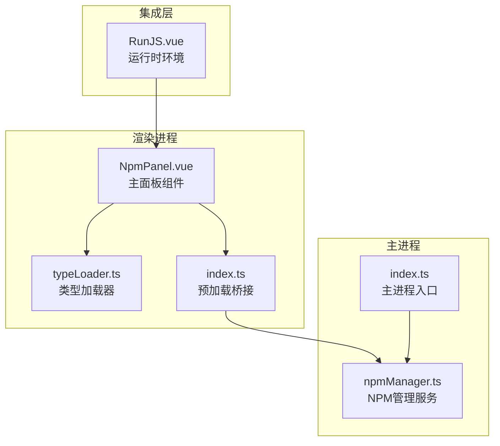
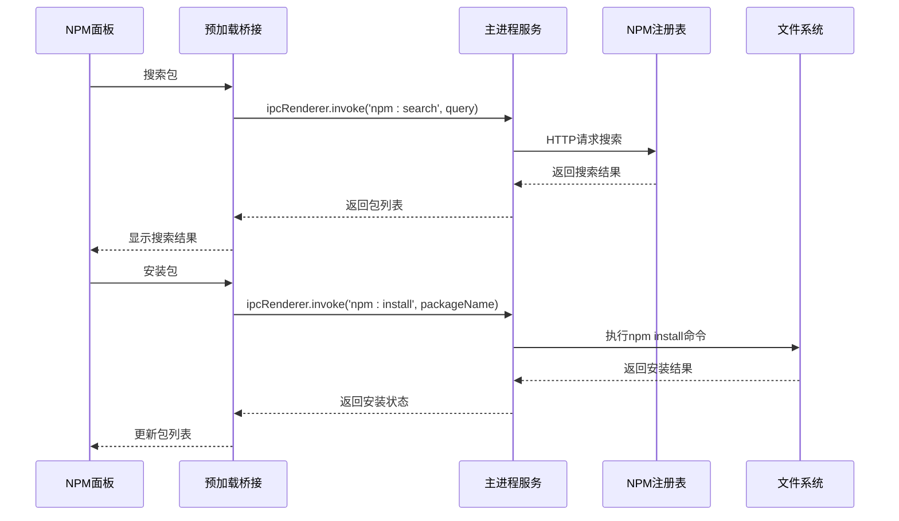
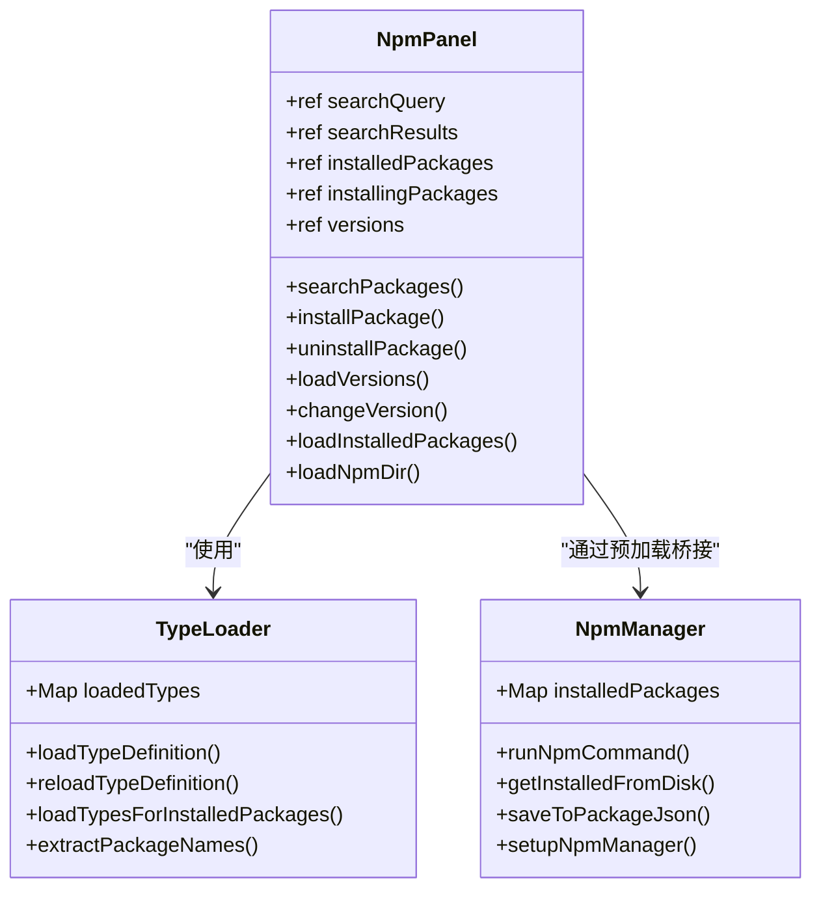
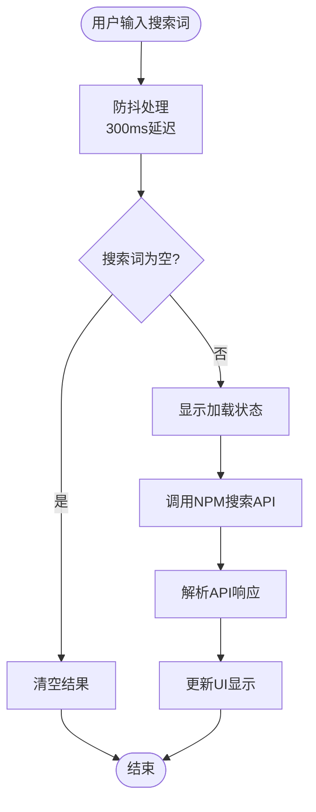
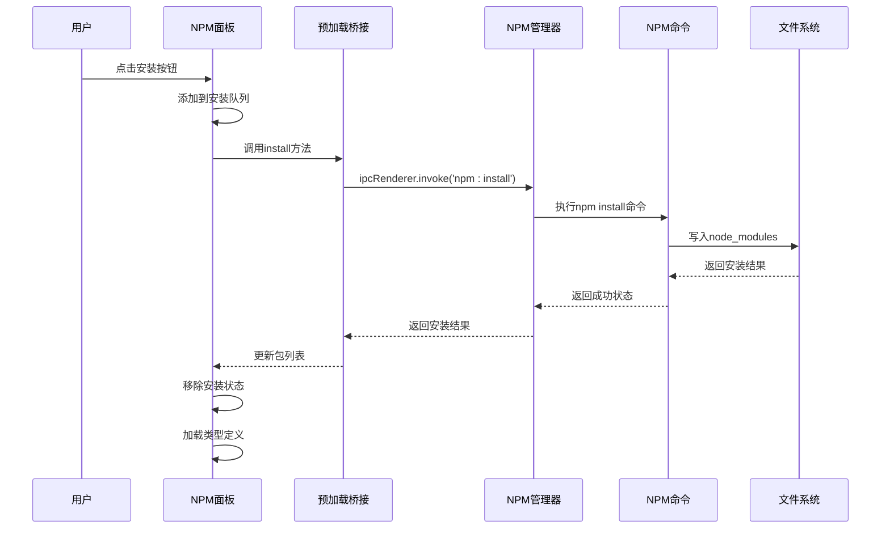
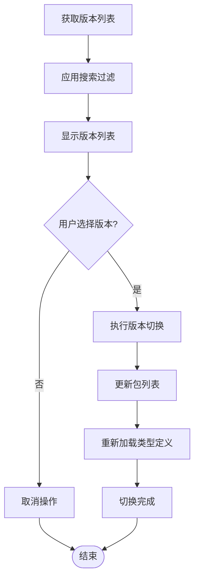
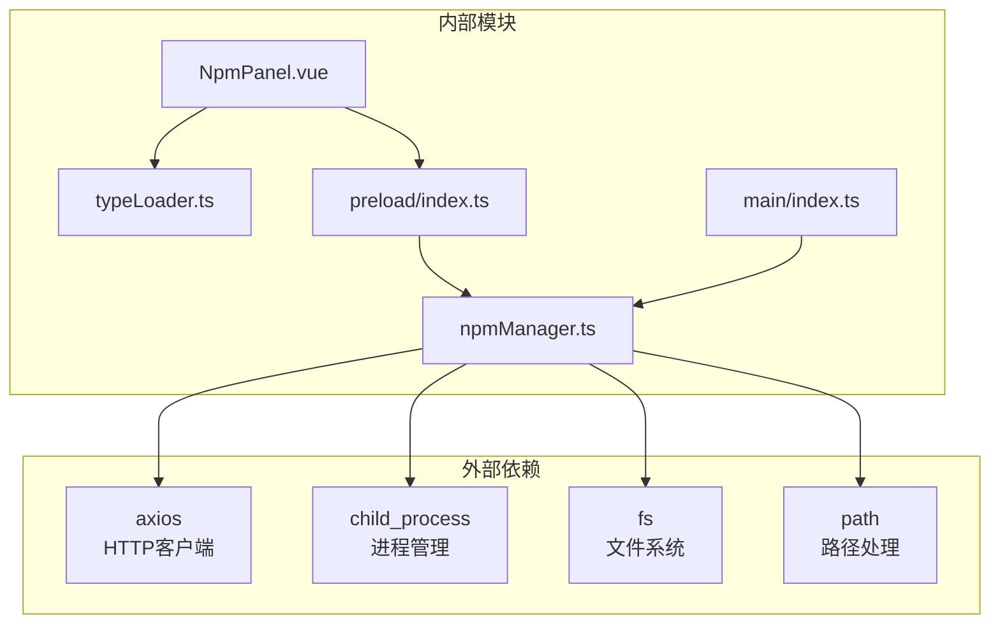

# NPM面板组件

<cite>
**本文档引用的文件**
- [NpmPanel.vue](file://src/renderer/src/views/runjs/components/NpmPanel.vue)
- [npmManager.ts](file://src/main/services/npmManager.ts)
- [index.ts](file://src/preload/index.ts)
- [typeLoader.ts](file://src/renderer/src/utils/typeLoader.ts)
- [RunJS.vue](file://src/renderer/src/views/runjs/RunJS.vue)
- [index.ts](file://src/main/index.ts)
- [package.json](file://package.json)
</cite>

## 目录
1. [简介](#简介)
2. [项目结构](#项目结构)
3. [核心组件](#核心组件)
4. [架构概览](#架构概览)
5. [详细组件分析](#详细组件分析)
6. [依赖关系分析](#依赖关系分析)
7. [性能考虑](#性能考虑)
8. [故障排除指南](#故障排除指南)
9. [结论](#结论)

## 简介

NPM面板组件是开发者工具箱中的一个重要功能模块，为用户提供了一个直观的界面来管理Node.js包。该组件实现了完整的NPM包生命周期管理，包括包搜索、安装、卸载、版本切换等功能，并提供了丰富的包信息展示和状态管理能力。

该组件采用Electron框架构建，结合Vue.js前端框架和TypeScript类型系统，实现了跨平台的包管理功能。通过与主进程的NPM管理服务通信，实现了安全可靠的包操作。

## 项目结构

NPM面板组件位于项目的运行时JavaScript开发环境中，主要包含以下关键文件：

**图表来源**
- [NpmPanel.vue:1-431](file://src/renderer/src/views/runjs/components/NpmPanel.vue#L1-L431)
- [npmManager.ts:1-635](file://src/main/services/npmManager.ts#L1-L635)
- [index.ts:1-229](file://src/preload/index.ts#L1-L229)

**章节来源**
- [NpmPanel.vue:1-50](file://src/renderer/src/views/runjs/components/NpmPanel.vue#L1-L50)
- [npmManager.ts:1-50](file://src/main/services/npmManager.ts#L1-L50)

## 核心组件

### NPM面板组件 (NpmPanel.vue)

NPM面板组件是整个包管理功能的核心UI组件，提供了完整的包管理界面。该组件具有以下核心特性：

- **实时搜索功能**：支持关键词搜索NPM包，带有防抖机制
- **包状态管理**：显示已安装包列表，支持安装状态指示
- **版本管理**：提供版本切换功能，支持版本搜索和过滤
- **目录管理**：允许用户自定义包安装目录
- **类型定义支持**：集成TypeScript类型定义加载

### NPM管理服务 (npmManager.ts)

主进程中的NPM管理服务负责实际的包操作，包括：
- 与NPM注册表的通信
- 包的安装和卸载
- 版本管理和切换
- 类型定义文件的解析和加载
- 文件系统操作和权限验证

### 预加载桥接 (index.ts)

预加载脚本在渲染进程和主进程之间建立了安全的通信桥梁，提供了：
- IPC通信封装
- API方法暴露
- 错误处理和类型安全

**章节来源**
- [NpmPanel.vue:50-215](file://src/renderer/src/views/runjs/components/NpmPanel.vue#L50-L215)
- [npmManager.ts:207-552](file://src/main/services/npmManager.ts#L207-L552)
- [index.ts:71-85](file://src/preload/index.ts#L71-L85)

## 架构概览

NPM面板组件采用了典型的Electron架构模式，实现了清晰的职责分离：

**图表来源**
- [NpmPanel.vue:60-98](file://src/renderer/src/views/runjs/components/NpmPanel.vue#L60-L98)
- [index.ts:72-84](file://src/preload/index.ts#L72-L84)
- [npmManager.ts:232-267](file://src/main/services/npmManager.ts#L232-L267)

## 详细组件分析

### NPM面板组件架构

NPM面板组件采用Vue.js Composition API设计，实现了响应式的数据绑定和状态管理：

**图表来源**
- [NpmPanel.vue:5-162](file://src/renderer/src/views/runjs/components/NpmPanel.vue#L5-L162)
- [typeLoader.ts:68-139](file://src/renderer/src/utils/typeLoader.ts#L68-L139)
- [npmManager.ts:117-151](file://src/main/services/npmManager.ts#L117-L151)

### 包搜索功能实现

包搜索功能实现了智能的搜索体验，包含以下特性：

- **防抖搜索**：300毫秒防抖延迟，减少不必要的API调用
- **实时结果显示**：搜索过程中显示加载状态
- **结果限制**：最多显示5个搜索结果
- **状态指示**：为已安装包显示特殊标识

**图表来源**
- [NpmPanel.vue:164-171](file://src/renderer/src/views/runjs/components/NpmPanel.vue#L164-L171)
- [NpmPanel.vue:59-78](file://src/renderer/src/views/runjs/components/NpmPanel.vue#L59-L78)

### 包安装流程

包安装过程包含了完整的错误处理和状态管理：

**图表来源**
- [NpmPanel.vue:80-98](file://src/renderer/src/views/runjs/components/NpmPanel.vue#L80-L98)
- [npmManager.ts:232-267](file://src/main/services/npmManager.ts#L232-L267)

### 版本管理功能

版本管理功能提供了灵活的版本切换能力：

- **版本列表获取**：从NPM注册表获取包的所有可用版本
- **版本搜索**：支持按版本号搜索和过滤
- **版本切换**：安全地切换到指定版本
- **当前版本显示**：清晰标识当前安装的版本

**图表来源**
- [NpmPanel.vue:117-156](file://src/renderer/src/views/runjs/components/NpmPanel.vue#L117-L156)
- [npmManager.ts:363-426](file://src/main/services/npmManager.ts#L363-L426)

### 类型定义加载机制

类型定义加载器提供了强大的TypeScript支持：

- **多源加载**：优先从本地node_modules加载，其次使用内置类型
- **递归解析**：自动解析类型文件的依赖关系
- **缓存管理**：智能缓存已加载的类型定义
- **并发优化**：批量加载多个包的类型定义

**章节来源**
- [NpmPanel.vue:112-162](file://src/renderer/src/views/runjs/components/NpmPanel.vue#L112-L162)
- [typeLoader.ts:68-139](file://src/renderer/src/utils/typeLoader.ts#L68-L139)
- [npmManager.ts:428-552](file://src/main/services/npmManager.ts#L428-L552)

## 依赖关系分析

NPM面板组件的依赖关系体现了清晰的分层架构：

**图表来源**
- [npmManager.ts:1-6](file://src/main/services/npmManager.ts#L1-L6)
- [index.ts:1-2](file://src/preload/index.ts#L1-L2)

**章节来源**
- [package.json:28-51](file://package.json#L28-L51)
- [npmManager.ts:1-6](file://src/main/services/npmManager.ts#L1-L6)

## 性能考虑

NPM面板组件在设计时充分考虑了性能优化：

### 异步操作处理
- **防抖机制**：搜索输入使用300ms防抖，减少API调用频率
- **并发控制**：类型定义加载限制并发数量，避免内存占用过高
- **超时处理**：所有外部请求设置合理超时时间

### 内存管理
- **状态缓存**：使用Set和Map优化状态存储
- **类型缓存**：智能缓存已加载的类型定义
- **垃圾回收**：及时清理不再使用的状态和事件监听器

### 网络优化
- **镜像源**：使用npmmirror.com提高访问速度
- **请求复用**：共享HTTP连接，减少连接开销
- **错误重试**：对临时性错误进行自动重试

## 故障排除指南

### 常见问题及解决方案

**包搜索失败**
- 检查网络连接和代理设置
- 验证NPM注册表可用性
- 查看控制台错误日志

**包安装失败**
- 确认目标目录有写入权限
- 检查磁盘空间是否充足
- 验证包名是否正确

**版本切换异常**
- 确认目标版本是否存在
- 检查依赖包的兼容性
- 重新加载类型定义

**类型定义加载失败**
- 检查包是否包含.d.ts文件
- 验证@types包的可用性
- 清除类型缓存后重试

**章节来源**
- [NpmPanel.vue:51-57](file://src/renderer/src/views/runjs/components/NpmPanel.vue#L51-L57)
- [npmManager.ts:188-194](file://src/main/services/npmManager.ts#L188-L194)

## 结论

NPM面板组件是一个功能完整、架构清晰的包管理解决方案。它成功地将复杂的包管理功能封装在一个用户友好的界面中，同时保持了高性能和高可靠性。

该组件的主要优势包括：
- **完整的功能覆盖**：从包搜索到版本管理的全流程支持
- **优秀的用户体验**：响应式设计和流畅的交互体验
- **强大的技术实现**：基于Electron和Vue.js的现代Web技术栈
- **可靠的安全机制**：严格的权限控制和错误处理

未来可以考虑的功能增强包括：
- 更详细的包信息展示
- 批量操作支持
- 更丰富的过滤和排序选项
- 与包管理器的深度集成