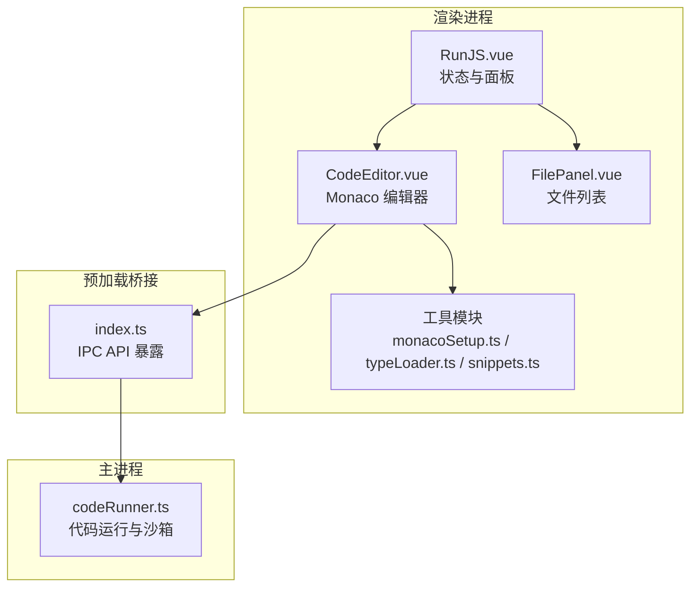
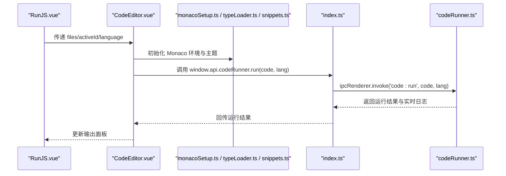
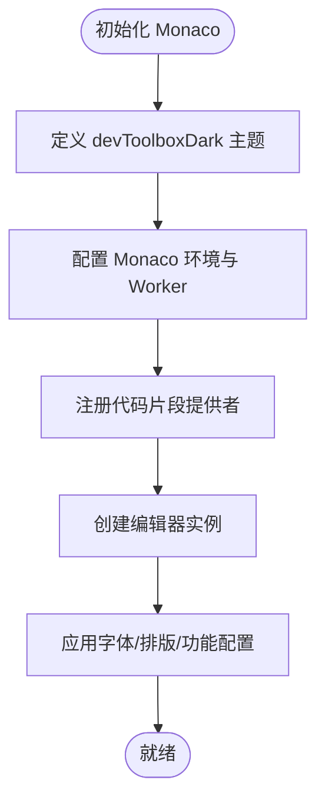
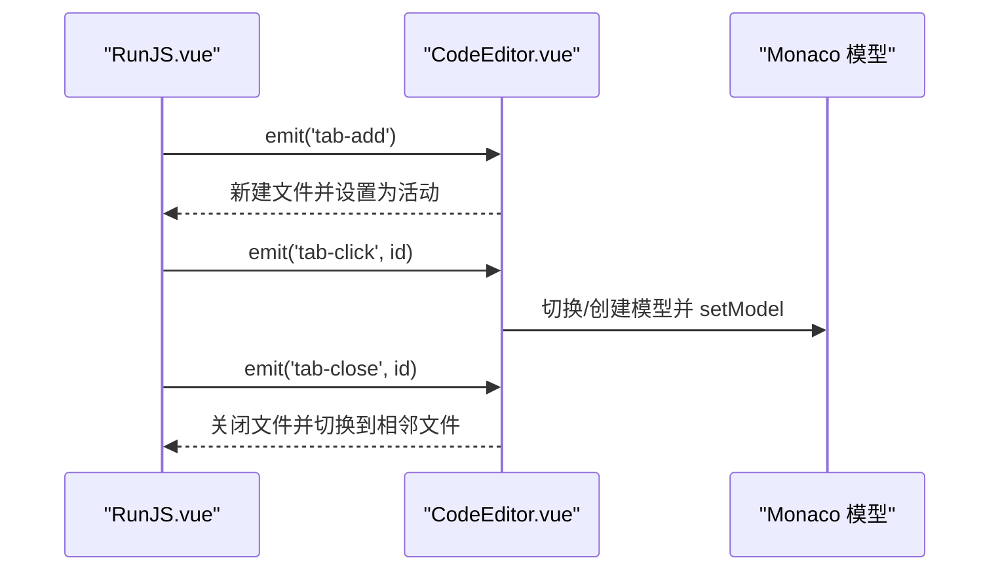
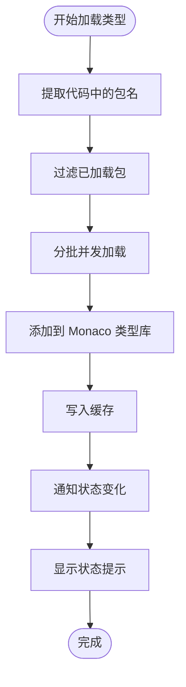
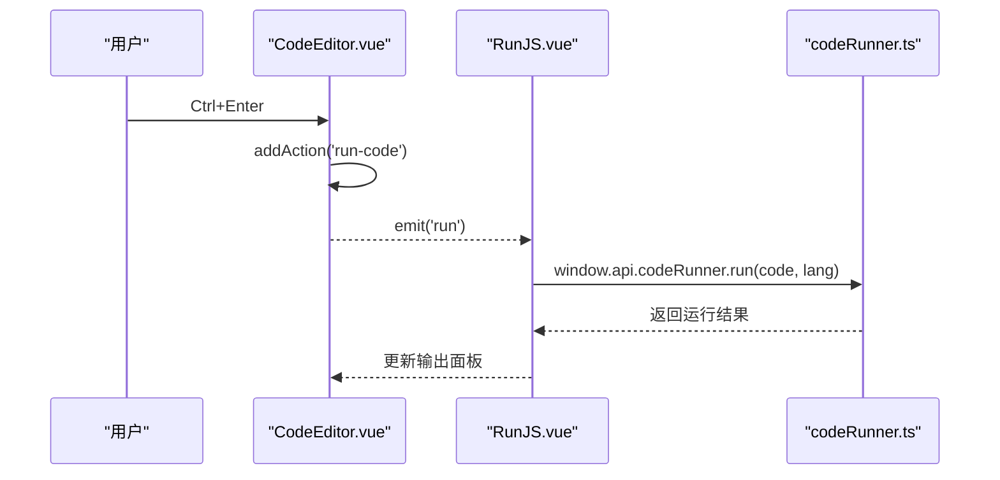
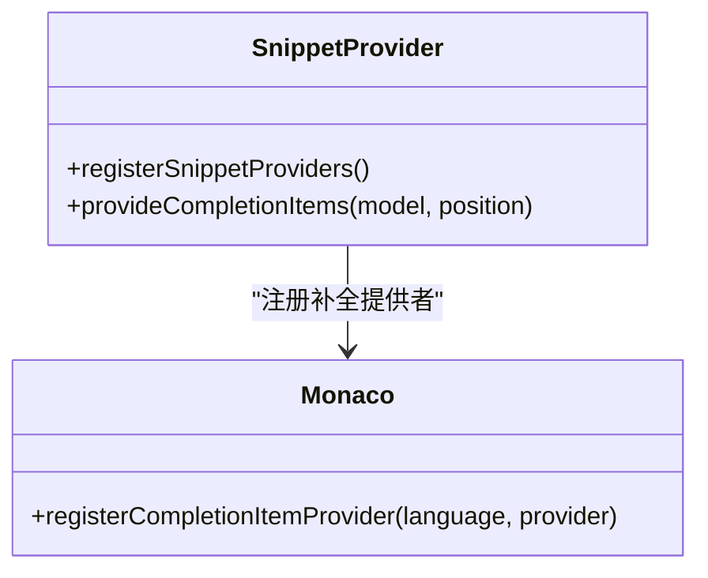
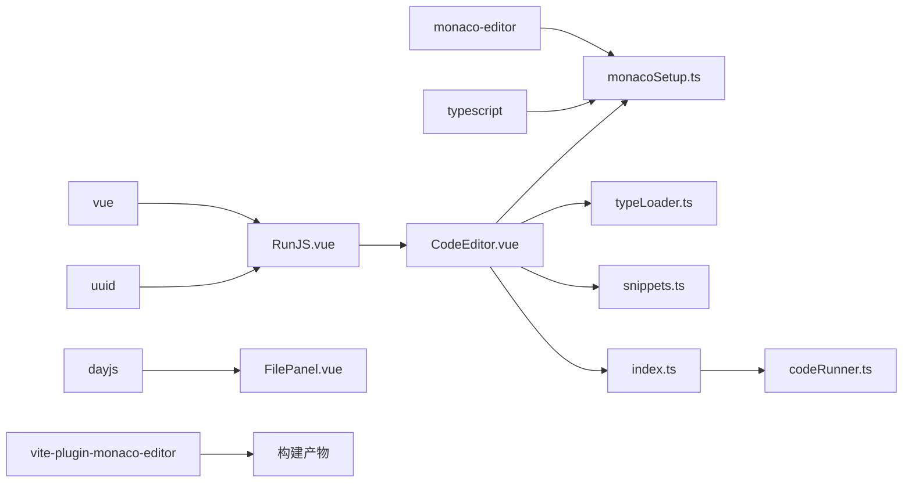

# 代码编辑器组件

<cite>
**本文引用的文件**
- [CodeEditor.vue](file://src/renderer/src/views/runjs/components/CodeEditor.vue)
- [monacoSetup.ts](file://src/renderer/src/utils/monacoSetup.ts)
- [typeLoader.ts](file://src/renderer/src/utils/typeLoader.ts)
- [snippets.ts](file://src/renderer/src/utils/snippets.ts)
- [RunJS.vue](file://src/renderer/src/views/runjs/RunJS.vue)
- [FilePanel.vue](file://src/renderer/src/views/runjs/components/FilePanel.vue)
- [codeRunner.ts](file://src/main/services/codeRunner.ts)
- [index.ts](file://src/preload/index.ts)
- [package.json](file://package.json)
</cite>

## 目录
1. [简介](#简介)
2. [项目结构](#项目结构)
3. [核心组件](#核心组件)
4. [架构总览](#架构总览)
5. [详细组件分析](#详细组件分析)
6. [依赖关系分析](#依赖关系分析)
7. [性能考量](#性能考量)
8. [故障排查指南](#故障排查指南)
9. [结论](#结论)
10. [附录](#附录)

## 简介
本技术文档围绕“代码编辑器组件”进行深入剖析，重点涵盖：
- Monaco Editor 的集成与定制：自定义主题、语法高亮、字体与排版配置
- 编辑器初始化流程：Worker 配置、TypeScript/JavaScript 环境、智能提示与代码片段
- 文件标签系统：多文件切换、标签关闭、新建文件与持久化
- 类型加载机制：本地类型、CDN 类型、缓存类型的状态管理与并发加载
- 快捷键系统：运行代码、保存、复制行等常用操作
- 组件属性、事件与状态管理策略

## 项目结构
该编辑器位于运行 JS 视图中，采用“视图 + 组件 + 工具模块”的分层组织方式：
- 视图层：RunJS.vue 负责状态管理与面板布局
- 编辑器组件：CodeEditor.vue 负责 Monaco 实例、主题、配置、快捷键与类型加载
- 工具模块：monacoSetup.ts、typeLoader.ts、snippets.ts 提供 Worker 配置、类型加载与代码片段
- 预加载桥接：index.ts 暴露 IPC API，供渲染进程调用主进程能力（如代码运行、NPM 类型）
- 主进程服务：codeRunner.ts 提供安全沙箱执行与服务器追踪清理

图表来源
- [RunJS.vue:1-353](file://src/renderer/src/views/runjs/RunJS.vue#L1-L353)
- [CodeEditor.vue:1-556](file://src/renderer/src/views/runjs/components/CodeEditor.vue#L1-L556)
- [monacoSetup.ts:1-76](file://src/renderer/src/utils/monacoSetup.ts#L1-L76)
- [typeLoader.ts:1-206](file://src/renderer/src/utils/typeLoader.ts#L1-L206)
- [snippets.ts:1-169](file://src/renderer/src/utils/snippets.ts#L1-L169)
- [index.ts:1-229](file://src/preload/index.ts#L1-L229)
- [codeRunner.ts:1-461](file://src/main/services/codeRunner.ts#L1-L461)

章节来源
- [RunJS.vue:1-353](file://src/renderer/src/views/runjs/RunJS.vue#L1-L353)
- [CodeEditor.vue:1-556](file://src/renderer/src/views/runjs/components/CodeEditor.vue#L1-L556)

## 核心组件
- CodeEditor.vue：Monaco 编辑器实例化、主题与字体配置、快捷键、类型加载状态提示、模型切换与语言更新
- monacoSetup.ts：Worker 环境配置、TypeScript/JavaScript 编译与诊断选项、启用模型同步
- typeLoader.ts：类型加载状态事件、本地/内置类型优先加载、缓存与并发加载、代码包名提取
- snippets.ts：通用与 TS 专用代码片段、NPM 包补全、按语言注册补全提供者
- RunJS.vue：文件集合与活动文件管理、新建/关闭/切换文件、运行/停止代码、全局快捷键
- FilePanel.vue：最近文件列表展示、文件选择与删除
- index.ts：暴露 IPC API（代码运行、NPM 类型、通知等）
- codeRunner.ts：主进程代码运行、沙箱、服务器追踪与清理、端口终止

章节来源
- [CodeEditor.vue:1-556](file://src/renderer/src/views/runjs/components/CodeEditor.vue#L1-L556)
- [monacoSetup.ts:1-76](file://src/renderer/src/utils/monacoSetup.ts#L1-L76)
- [typeLoader.ts:1-206](file://src/renderer/src/utils/typeLoader.ts#L1-L206)
- [snippets.ts:1-169](file://src/renderer/src/utils/snippets.ts#L1-L169)
- [RunJS.vue:1-353](file://src/renderer/src/views/runjs/RunJS.vue#L1-L353)
- [FilePanel.vue:1-100](file://src/renderer/src/views/runjs/components/FilePanel.vue#L1-L100)
- [index.ts:1-229](file://src/preload/index.ts#L1-L229)
- [codeRunner.ts:1-461](file://src/main/services/codeRunner.ts#L1-L461)

## 架构总览
编辑器组件通过“视图-组件-工具模块-预加载桥接-主进程服务”的链路协同工作：
- 视图层负责状态与面板布局，组件层负责编辑器交互与类型加载
- 工具模块提供 Monaco 环境、类型加载与代码片段
- 预加载桥接将主进程能力暴露给渲染进程
- 主进程服务提供安全的代码运行与资源清理

图表来源
- [RunJS.vue:249-262](file://src/renderer/src/views/runjs/RunJS.vue#L249-L262)
- [CodeEditor.vue:152-172](file://src/renderer/src/views/runjs/components/CodeEditor.vue#L152-L172)
- [index.ts:63-69](file://src/preload/index.ts#L63-L69)
- [codeRunner.ts:98-247](file://src/main/services/codeRunner.ts#L98-L247)

## 详细组件分析

### Monaco 编辑器初始化与主题配置
- 自定义主题：定义名为 devToolboxDark 的主题，覆盖编辑器背景、前景、行高亮、光标与行号颜色
- 字体与排版：字号、字体族（包含 Fira Code、Cascadia Code 等等宽字体）、连字、行高、内边距、滚动行为、自动布局等
- 编辑器特性：最小化缩略图禁用、自动补全、参数提示、悬停提示、括号配对高亮、平滑滚动、光标动画等
- Worker 配置：通过 MonacoEnvironment 指定 TypeScript/JavaScript Worker，保证语法检查与智能提示可用
- TypeScript/JavaScript 环境：设置编译目标、模块系统、模块解析、严格性、lib 等，并开启模型同步

图表来源
- [CodeEditor.vue:58-168](file://src/renderer/src/views/runjs/components/CodeEditor.vue#L58-L168)
- [monacoSetup.ts:11-73](file://src/renderer/src/utils/monacoSetup.ts#L11-L73)

章节来源
- [CodeEditor.vue:58-168](file://src/renderer/src/views/runjs/components/CodeEditor.vue#L58-L168)
- [monacoSetup.ts:11-73](file://src/renderer/src/utils/monacoSetup.ts#L11-L73)

### 文件标签系统设计
- 多文件切换：通过 activeId 与 files 列表驱动，监听 activeId 变化并同步编辑器模型
- 标签关闭：关闭当前文件时自动切换到相邻文件，至少保留一个文件
- 新建文件：生成新文件并设置为活动文件；文件名根据语言自动带扩展名
- 持久化：使用 localStorage 存储文件集合与活动文件 ID，支持迁移旧数据
- 模型清理：监听 files 变化，清理已不存在文件对应的模型，避免内存泄漏

图表来源
- [RunJS.vue:92-121](file://src/renderer/src/views/runjs/RunJS.vue#L92-L121)
- [CodeEditor.vue:290-347](file://src/renderer/src/views/runjs/components/CodeEditor.vue#L290-L347)

章节来源
- [RunJS.vue:92-121](file://src/renderer/src/views/runjs/RunJS.vue#L92-L121)
- [CodeEditor.vue:290-347](file://src/renderer/src/views/runjs/components/CodeEditor.vue#L290-L347)

### 类型加载机制与状态管理
- 类型来源优先级：本地 node_modules -> 内置类型（通过 window.api.npm.getTypes）
- 并发加载：对已安装包进行分批并发加载，限制并发数以平衡性能与稳定性
- 缓存策略：使用 Map 记录已加载包及其版本，避免重复加载
- 状态事件：统一的事件发布/订阅，支持类型加载状态（loading/local/cdn/failed/cached）与来源信息
- 代码分析：从代码中提取 require/import 的包名，过滤已加载项后批量加载
- 实时反馈：编辑器底部弹出 toast，根据状态显示不同图标与颜色，自动定时消失

图表来源
- [typeLoader.ts:122-139](file://src/renderer/src/utils/typeLoader.ts#L122-L139)
- [typeLoader.ts:174-184](file://src/renderer/src/utils/typeLoader.ts#L174-L184)
- [CodeEditor.vue:262-282](file://src/renderer/src/views/runjs/components/CodeEditor.vue#L262-L282)

章节来源
- [typeLoader.ts:1-206](file://src/renderer/src/utils/typeLoader.ts#L1-L206)
- [CodeEditor.vue:262-282](file://src/renderer/src/views/runjs/components/CodeEditor.vue#L262-L282)

### 快捷键系统实现
- 编辑器内快捷键：
  - Ctrl/Cmd + Enter：运行代码（若未在运行中）
  - Ctrl/Cmd + S：保存（预留逻辑）
  - Ctrl/Cmd + D：复制当前行
- 全局快捷键：
  - Ctrl/Cmd + Enter：运行代码（全局监听）
  - Escape：停止运行（全局监听）

图表来源
- [CodeEditor.vue:194-215](file://src/renderer/src/views/runjs/components/CodeEditor.vue#L194-L215)
- [RunJS.vue:191-203](file://src/renderer/src/views/runjs/RunJS.vue#L191-L203)
- [index.ts:63-69](file://src/preload/index.ts#L63-L69)
- [codeRunner.ts:98-247](file://src/main/services/codeRunner.ts#L98-L247)

章节来源
- [CodeEditor.vue:194-241](file://src/renderer/src/views/runjs/components/CodeEditor.vue#L194-L241)
- [RunJS.vue:191-203](file://src/renderer/src/views/runjs/RunJS.vue#L191-L203)

### 代码补全与智能提示
- 代码片段：提供通用 JS 片段与 TS 专用片段，支持占位符与插入规则
- NPM 包补全：在 require/import 语境下提供常见包名建议
- 智能提示：开启字符串与注释的快速建议、参数提示、悬停提示、自动补全与预览

图表来源
- [snippets.ts:72-168](file://src/renderer/src/utils/snippets.ts#L72-L168)
- [CodeEditor.vue:85-86](file://src/renderer/src/views/runjs/components/CodeEditor.vue#L85-L86)

章节来源
- [snippets.ts:1-169](file://src/renderer/src/utils/snippets.ts#L1-L169)
- [CodeEditor.vue:85-167](file://src/renderer/src/views/runjs/components/CodeEditor.vue#L85-L167)

### 组件属性、事件与状态管理策略
- 属性（Props）：
  - code：当前文件内容
  - language：javascript 或 typescript
  - isRunning：是否正在运行
  - files：文件集合
  - activeId：当前活动文件 ID
- 事件（Emits）：
  - update:code：内容变更
  - update:language：语言变更
  - run：请求运行
  - tab-click：点击标签
  - tab-close：关闭标签
  - tab-add：新建文件
- 状态管理策略：
  - 编辑器内部：响应 props 变化，动态切换模型与语言
  - 视图层：集中管理文件集合、活动文件、运行状态与输出
  - 预加载桥接：统一暴露 IPC API，便于跨层调用

章节来源
- [CodeEditor.vue:12-27](file://src/renderer/src/views/runjs/components/CodeEditor.vue#L12-L27)
- [RunJS.vue:92-149](file://src/renderer/src/views/runjs/RunJS.vue#L92-L149)

## 依赖关系分析
- 第三方依赖：monaco-editor、typescript、uuid、dayjs 等
- 构建插件：vite-plugin-monaco-editor 用于打包 Monaco 资源
- 主进程服务：codeRunner.ts 提供安全运行与资源清理
- 预加载桥接：index.ts 暴露 IPC API，连接渲染进程与主进程

图表来源
- [package.json:45-72](file://package.json#L45-L72)
- [monacoSetup.ts:1-76](file://src/renderer/src/utils/monacoSetup.ts#L1-L76)
- [typeLoader.ts:1-206](file://src/renderer/src/utils/typeLoader.ts#L1-L206)
- [snippets.ts:1-169](file://src/renderer/src/utils/snippets.ts#L1-L169)
- [RunJS.vue:1-353](file://src/renderer/src/views/runjs/RunJS.vue#L1-L353)
- [FilePanel.vue:1-100](file://src/renderer/src/views/runjs/components/FilePanel.vue#L1-L100)
- [index.ts:1-229](file://src/preload/index.ts#L1-L229)
- [codeRunner.ts:1-461](file://src/main/services/codeRunner.ts#L1-L461)

章节来源
- [package.json:1-120](file://package.json#L1-L120)

## 性能考量
- 类型加载并发：分批并发加载已安装包类型，避免阻塞主线程
- 编辑器模型同步：启用 eagerModelSync，减少延迟；仅在必要时重建模型，避免频繁销毁
- 防抖加载：内容变更后 500ms 防抖再触发类型加载，降低频繁 IO
- 字体与排版：启用连字与等宽字体，兼顾可读性与渲染性能
- Worker 隔离：独立的 TypeScript/JavaScript Worker，避免主线程阻塞

## 故障排查指南
- 编辑器无法初始化
  - 检查 Monaco 环境配置与 Worker 是否正确加载
  - 确认 monacoSetup.ts 中的 getWorker 返回逻辑
- 类型加载失败
  - 确认 window.api.npm.getTypes 是否可用
  - 检查 typeLoader.ts 的事件订阅与缓存状态
- 运行代码异常
  - 查看主进程 codeRunner.ts 的错误日志与服务器清理
  - 确认全局快捷键未被其他组件拦截
- 内存泄漏
  - 确认关闭文件时模型已被 dispose
  - 监听 files 变化，清理不存在文件的模型

章节来源
- [monacoSetup.ts:11-18](file://src/renderer/src/utils/monacoSetup.ts#L11-L18)
- [typeLoader.ts:82-102](file://src/renderer/src/utils/typeLoader.ts#L82-L102)
- [codeRunner.ts:78-96](file://src/main/services/codeRunner.ts#L78-L96)
- [CodeEditor.vue:250-253](file://src/renderer/src/views/runjs/components/CodeEditor.vue#L250-L253)

## 结论
该代码编辑器组件通过清晰的分层设计与完善的工具模块，实现了：
- 可定制的主题与排版，满足开发者的视觉偏好
- 高效的类型加载与缓存策略，提升智能提示质量
- 完整的文件标签系统与持久化，保障多文件工作流
- 丰富的快捷键与智能补全，提升编码效率
- 与主进程的安全运行与资源管理无缝衔接

## 附录
- 相关依赖版本与构建插件见 package.json
- 编辑器初始化与主题配置参考 monacoSetup.ts 与 CodeEditor.vue
- 类型加载与状态管理参考 typeLoader.ts 与 CodeEditor.vue
- 代码补全与片段参考 snippets.ts 与 CodeEditor.vue
- 运行与停止逻辑参考 RunJS.vue 与 codeRunner.ts
- 预加载桥接参考 index.ts