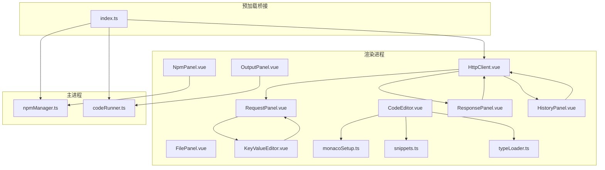
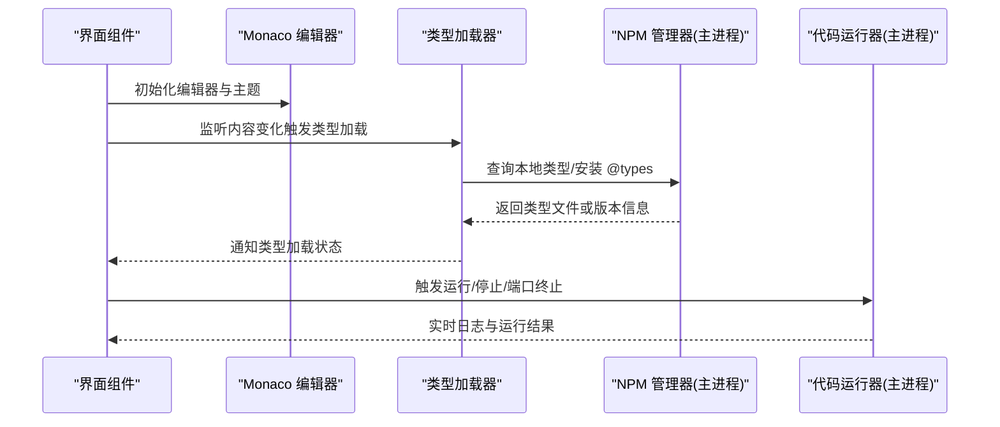
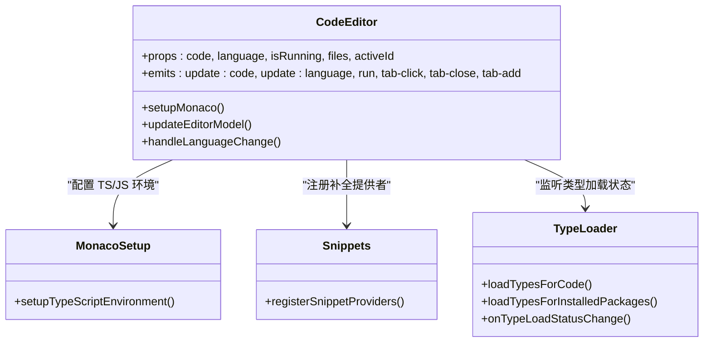
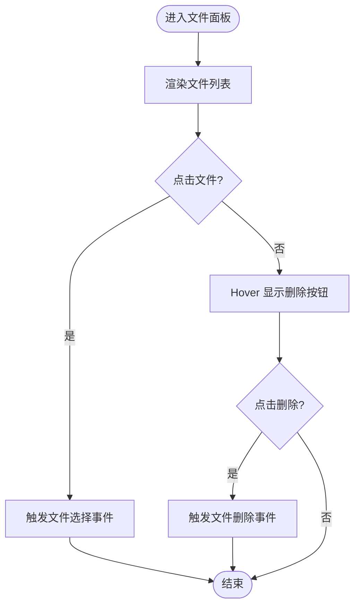
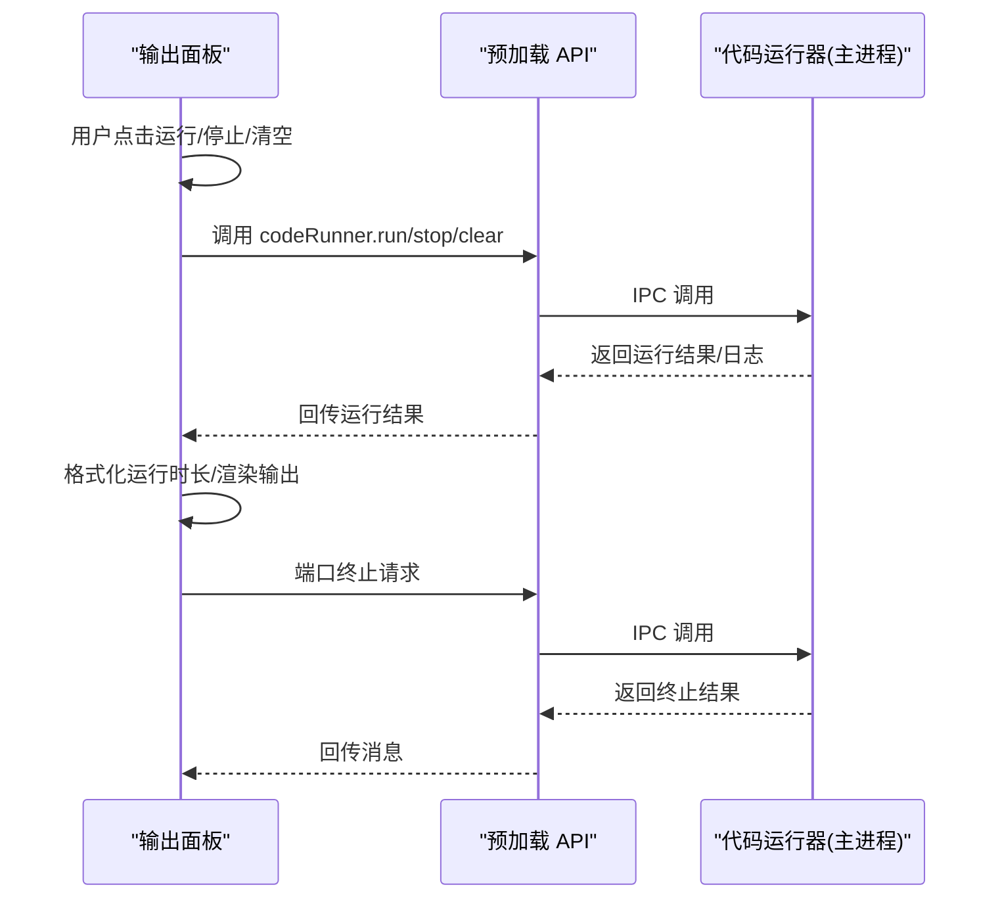
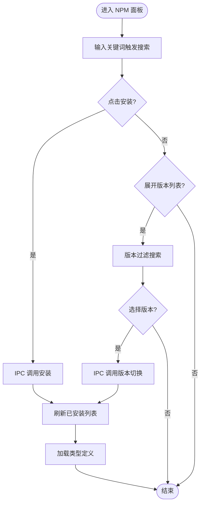
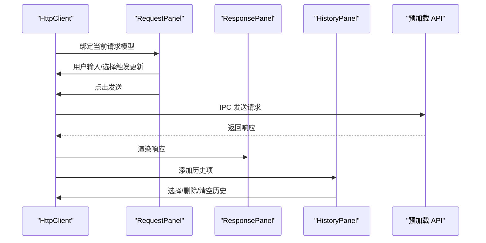
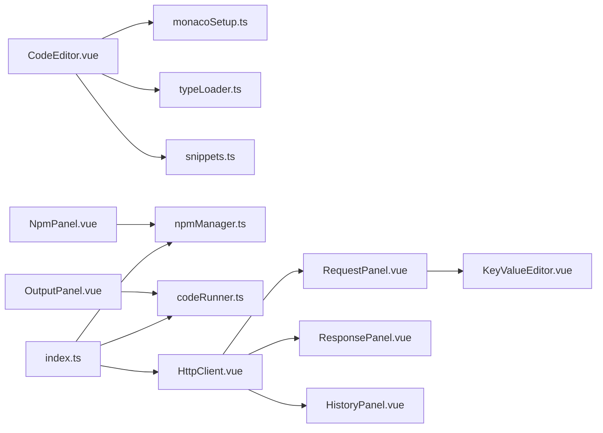

# 工具组件系统

<cite>
**本文档引用的文件**
- [CodeEditor.vue](file://src/renderer/src/views/runjs/components/CodeEditor.vue)
- [FilePanel.vue](file://src/renderer/src/views/runjs/components/FilePanel.vue)
- [NpmPanel.vue](file://src/renderer/src/views/runjs/components/NpmPanel.vue)
- [OutputPanel.vue](file://src/renderer/src/views/runjs/components/OutputPanel.vue)
- [monacoSetup.ts](file://src/renderer/src/utils/monacoSetup.ts)
- [snippets.ts](file://src/renderer/src/utils/snippets.ts)
- [typeLoader.ts](file://src/renderer/src/utils/typeLoader.ts)
- [HttpClient.vue](file://src/renderer/src/views/httpclient/HttpClient.vue)
- [RequestPanel.vue](file://src/renderer/src/views/httpclient/components/RequestPanel.vue)
- [ResponsePanel.vue](file://src/renderer/src/views/httpclient/components/ResponsePanel.vue)
- [HistoryPanel.vue](file://src/renderer/src/views/httpclient/components/HistoryPanel.vue)
- [KeyValueEditor.vue](file://src/renderer/src/views/httpclient/components/KeyValueEditor.vue)
- [types.ts](file://src/renderer/src/views/httpclient/types.ts)
- [npmManager.ts](file://src/main/services/npmManager.ts)
- [codeRunner.ts](file://src/main/services/codeRunner.ts)
- [index.ts](file://src/preload/index.ts)
</cite>

## 目录
1. [简介](#简介)
2. [项目结构](#项目结构)
3. [核心组件](#核心组件)
4. [架构总览](#架构总览)
5. [详细组件分析](#详细组件分析)
6. [依赖关系分析](#依赖关系分析)
7. [性能考虑](#性能考虑)
8. [故障排除指南](#故障排除指南)
9. [结论](#结论)
10. [附录](#附录)

## 简介
本文件面向开发者工具箱的工具组件系统，聚焦以下能力：
- 代码编辑器组件：基于 Monaco Editor 的集成、语法高亮与智能补全、类型定义加载与状态提示。
- 文件面板：文件浏览、选择与删除交互。
- 输出面板：运行结果展示、错误呈现、运行时长与端口终止控制。
- NPM 面板：包搜索、安装/卸载、版本切换、类型定义加载与缓存。
- HTTP 客户端：请求构建、响应展示、历史记录与键值编辑器。

文档将从架构、数据流、处理逻辑、事件与数据绑定策略等方面进行深入说明，并提供可视化图示帮助理解。

## 项目结构
工具组件系统位于渲染进程的视图层与工具层，配合主进程的服务实现 IPC 通信与系统级能力（如包管理、代码运行、HTTP 请求等）。核心文件分布如下：
- 渲染进程组件：RunJS 页面的代码编辑器、文件面板、NPM 面板、输出面板；HTTP 客户端页面的请求面板、响应面板、历史面板、键值编辑器。
- 工具与配置：Monaco 配置、代码片段与补全、类型加载器。
- 主进程服务：NPM 管理器、代码运行器、HTTP 客户端服务、预加载桥接 API。

**图表来源**
- [CodeEditor.vue:1-556](file://src/renderer/src/views/runjs/components/CodeEditor.vue#L1-L556)
- [NpmPanel.vue:1-431](file://src/renderer/src/views/runjs/components/NpmPanel.vue#L1-L431)
- [OutputPanel.vue:1-250](file://src/renderer/src/views/runjs/components/OutputPanel.vue#L1-L250)
- [HttpClient.vue:1-275](file://src/renderer/src/views/httpclient/HttpClient.vue#L1-L275)
- [RequestPanel.vue:1-227](file://src/renderer/src/views/httpclient/components/RequestPanel.vue#L1-L227)
- [ResponsePanel.vue:1-180](file://src/renderer/src/views/httpclient/components/ResponsePanel.vue#L1-L180)
- [HistoryPanel.vue:1-116](file://src/renderer/src/views/httpclient/components/HistoryPanel.vue#L1-L116)
- [KeyValueEditor.vue:1-106](file://src/renderer/src/views/httpclient/components/KeyValueEditor.vue#L1-L106)
- [monacoSetup.ts:1-76](file://src/renderer/src/utils/monacoSetup.ts#L1-L76)
- [snippets.ts:1-169](file://src/renderer/src/utils/snippets.ts#L1-L169)
- [typeLoader.ts:1-206](file://src/renderer/src/utils/typeLoader.ts#L1-L206)
- [npmManager.ts:1-635](file://src/main/services/npmManager.ts#L1-L635)
- [codeRunner.ts:1-461](file://src/main/services/codeRunner.ts#L1-L461)
- [index.ts:1-229](file://src/preload/index.ts#L1-L229)

**章节来源**
- [CodeEditor.vue:1-556](file://src/renderer/src/views/runjs/components/CodeEditor.vue#L1-L556)
- [NpmPanel.vue:1-431](file://src/renderer/src/views/runjs/components/NpmPanel.vue#L1-L431)
- [OutputPanel.vue:1-250](file://src/renderer/src/views/runjs/components/OutputPanel.vue#L1-L250)
- [HttpClient.vue:1-275](file://src/renderer/src/views/httpclient/HttpClient.vue#L1-L275)
- [monacoSetup.ts:1-76](file://src/renderer/src/utils/monacoSetup.ts#L1-L76)
- [snippets.ts:1-169](file://src/renderer/src/utils/snippets.ts#L1-L169)
- [typeLoader.ts:1-206](file://src/renderer/src/utils/typeLoader.ts#L1-L206)
- [npmManager.ts:1-635](file://src/main/services/npmManager.ts#L1-L635)
- [codeRunner.ts:1-461](file://src/main/services/codeRunner.ts#L1-L461)
- [index.ts:1-229](file://src/preload/index.ts#L1-L229)

## 核心组件
- 代码编辑器组件：负责 Monaco Editor 初始化、主题与配置、语言切换、模型管理、快捷键、类型加载状态提示、内容变更事件。
- 文件面板：展示最近打开的文件列表，支持点击选择与删除。
- NPM 面板：提供包搜索、安装/卸载、版本列表与切换、安装位置管理、类型定义加载与缓存。
- 输出面板：展示运行结果与错误、运行时长、实时日志、端口终止控制。
- HTTP 客户端：请求构建（方法、URL、Headers、Query Params、Body）、响应展示（状态码、耗时、大小、Headers、Body）、历史记录管理与折叠面板。

**章节来源**
- [CodeEditor.vue:1-556](file://src/renderer/src/views/runjs/components/CodeEditor.vue#L1-L556)
- [FilePanel.vue:1-100](file://src/renderer/src/views/runjs/components/FilePanel.vue#L1-L100)
- [NpmPanel.vue:1-431](file://src/renderer/src/views/runjs/components/NpmPanel.vue#L1-L431)
- [OutputPanel.vue:1-250](file://src/renderer/src/views/runjs/components/OutputPanel.vue#L1-L250)
- [HttpClient.vue:1-275](file://src/renderer/src/views/httpclient/HttpClient.vue#L1-L275)

## 架构总览
组件间通过 Vue Props/Events 与 Electron IPC 进行数据与事件传递。Monaco 与类型加载器在渲染进程内协作，NPM 与代码运行在主进程提供能力并通过预加载桥接暴露给渲染进程。

**图表来源**
- [CodeEditor.vue:1-556](file://src/renderer/src/views/runjs/components/CodeEditor.vue#L1-L556)
- [typeLoader.ts:1-206](file://src/renderer/src/utils/typeLoader.ts#L1-L206)
- [npmManager.ts:1-635](file://src/main/services/npmManager.ts#L1-L635)
- [codeRunner.ts:1-461](file://src/main/services/codeRunner.ts#L1-L461)
- [index.ts:1-229](file://src/preload/index.ts#L1-L229)

## 详细组件分析

### 代码编辑器组件（Monaco 集成）
- Monaco 初始化与主题：自定义深色主题、字体与行高、参数提示、悬停提示、自动补全与代码片段。
- 模型管理：根据活动文件动态切换/创建模型，保持语言模式与 URI 后缀一致。
- 事件与快捷键：内容变更 emit、运行/保存/复制行快捷键、窗口 resize 布局。
- 类型加载：内容变更防抖触发类型加载，监听类型加载状态并在 UI 上提示。
- 代码片段与补全：注册 JS/TS 补全提供者，支持包名补全与常用代码片段。

**图表来源**
- [CodeEditor.vue:1-556](file://src/renderer/src/views/runjs/components/CodeEditor.vue#L1-L556)
- [monacoSetup.ts:1-76](file://src/renderer/src/utils/monacoSetup.ts#L1-L76)
- [snippets.ts:1-169](file://src/renderer/src/utils/snippets.ts#L1-L169)
- [typeLoader.ts:1-206](file://src/renderer/src/utils/typeLoader.ts#L1-L206)

**章节来源**
- [CodeEditor.vue:58-193](file://src/renderer/src/views/runjs/components/CodeEditor.vue#L58-L193)
- [CodeEditor.vue:284-388](file://src/renderer/src/views/runjs/components/CodeEditor.vue#L284-L388)
- [monacoSetup.ts:20-73](file://src/renderer/src/utils/monacoSetup.ts#L20-L73)
- [snippets.ts:72-168](file://src/renderer/src/utils/snippets.ts#L72-L168)
- [typeLoader.ts:174-184](file://src/renderer/src/utils/typeLoader.ts#L174-L184)

### 文件面板（文件浏览与管理）
- 展示最近文件列表，支持点击选择与删除。
- 语言图标与时间格式化，Hover 效果与渐变边框。
- 交互事件：文件选择与删除事件向上冒泡。

**图表来源**
- [FilePanel.vue:20-33](file://src/renderer/src/views/runjs/components/FilePanel.vue#L20-L33)
- [FilePanel.vue:36-99](file://src/renderer/src/views/runjs/components/FilePanel.vue#L36-L99)

**章节来源**
- [FilePanel.vue:10-18](file://src/renderer/src/views/runjs/components/FilePanel.vue#L10-L18)
- [FilePanel.vue:20-33](file://src/renderer/src/views/runjs/components/FilePanel.vue#L20-L33)
- [FilePanel.vue:36-99](file://src/renderer/src/views/runjs/components/FilePanel.vue#L36-L99)

### 输出面板（结果展示与格式化）
- 标签页：控制台与错误页签，根据错误状态自动切换。
- 运行/停止/清空：按钮事件与运行时长格式化。
- 端口终止：输入端口号，校验范围后发起终止请求，反馈消息。
- 输出内容：成功输出与错误输出分别渲染，空状态提示。

**图表来源**
- [OutputPanel.vue:11-56](file://src/renderer/src/views/runjs/components/OutputPanel.vue#L11-L56)
- [OutputPanel.vue:28-56](file://src/renderer/src/views/runjs/components/OutputPanel.vue#L28-L56)
- [index.ts:62-69](file://src/preload/index.ts#L62-L69)
- [codeRunner.ts:98-246](file://src/main/services/codeRunner.ts#L98-L246)

**章节来源**
- [OutputPanel.vue:4-15](file://src/renderer/src/views/runjs/components/OutputPanel.vue#L4-L15)
- [OutputPanel.vue:28-56](file://src/renderer/src/views/runjs/components/OutputPanel.vue#L28-L56)
- [OutputPanel.vue:59-211](file://src/renderer/src/views/runjs/components/OutputPanel.vue#L59-L211)
- [index.ts:62-69](file://src/preload/index.ts#L62-L69)
- [codeRunner.ts:98-246](file://src/main/services/codeRunner.ts#L98-L246)

### NPM 面板（包管理与依赖处理）
- 搜索与安装：防抖搜索、安装状态、安装成功后加载类型。
- 已安装包列表：版本切换、卸载、加载位置管理（更改/重置）。
- 版本选择：展开版本列表、过滤搜索、切换版本后重新加载类型。
- 类型加载：优先本地 node_modules，失败则回退或自动安装 @types。

**图表来源**
- [NpmPanel.vue:59-171](file://src/renderer/src/views/runjs/components/NpmPanel.vue#L59-L171)
- [NpmPanel.vue:173-215](file://src/renderer/src/views/runjs/components/NpmPanel.vue#L173-L215)
- [typeLoader.ts:68-103](file://src/renderer/src/utils/typeLoader.ts#L68-L103)
- [npmManager.ts:211-266](file://src/main/services/npmManager.ts#L211-L266)
- [npmManager.ts:379-426](file://src/main/services/npmManager.ts#L379-L426)

**章节来源**
- [NpmPanel.vue:1-431](file://src/renderer/src/views/runjs/components/NpmPanel.vue#L1-L431)
- [typeLoader.ts:68-103](file://src/renderer/src/utils/typeLoader.ts#L68-L103)
- [npmManager.ts:211-266](file://src/main/services/npmManager.ts#L211-L266)
- [npmManager.ts:379-426](file://src/main/services/npmManager.ts#L379-L426)

### HTTP 客户端（请求/响应/历史/键值编辑器）
- 请求面板：方法选择、URL 输入、Params/Headers/Body 三标签页、JSON 格式化、发送按钮。
- 响应面板：状态码分级样式、耗时与大小格式化、Headers/Body 页签、复制 Body。
- 历史面板：历史记录列表、选择/删除/清空、时间与状态着色、折叠开关。
- 键值编辑器：通用的 Key/Value 列表，支持启用/禁用、增删与占位符。

**图表来源**
- [HttpClient.vue:15-183](file://src/renderer/src/views/httpclient/HttpClient.vue#L15-L183)
- [RequestPanel.vue:32-54](file://src/renderer/src/views/httpclient/components/RequestPanel.vue#L32-L54)
- [ResponsePanel.vue:13-42](file://src/renderer/src/views/httpclient/components/ResponsePanel.vue#L13-L42)
- [HistoryPanel.vue:16-45](file://src/renderer/src/views/httpclient/components/HistoryPanel.vue#L16-L45)
- [types.ts:1-38](file://src/renderer/src/views/httpclient/types.ts#L1-L38)
- [index.ts:106-115](file://src/preload/index.ts#L106-L115)

**章节来源**
- [HttpClient.vue:1-275](file://src/renderer/src/views/httpclient/HttpClient.vue#L1-L275)
- [RequestPanel.vue:1-227](file://src/renderer/src/views/httpclient/components/RequestPanel.vue#L1-L227)
- [ResponsePanel.vue:1-180](file://src/renderer/src/views/httpclient/components/ResponsePanel.vue#L1-L180)
- [HistoryPanel.vue:1-116](file://src/renderer/src/views/httpclient/components/HistoryPanel.vue#L1-L116)
- [KeyValueEditor.vue:1-106](file://src/renderer/src/views/httpclient/components/KeyValueEditor.vue#L1-L106)
- [types.ts:1-38](file://src/renderer/src/views/httpclient/types.ts#L1-L38)
- [index.ts:106-115](file://src/preload/index.ts#L106-L115)

## 依赖关系分析
- 组件耦合：代码编辑器依赖 Monaco 配置与类型加载器；NPM 面板依赖主进程 NPM 管理器；输出面板依赖代码运行器；HTTP 客户端依赖预加载 API。
- 数据绑定：Vue 双向绑定与 v-model 在请求面板与键值编辑器中广泛使用；历史面板与请求/响应面板通过 props 与事件交互。
- 外部依赖：Monaco Editor、esbuild（TS 编译）、vm（沙箱执行）、axios（NPM 搜索与版本查询）、Electron IPC。

**图表来源**
- [CodeEditor.vue:1-556](file://src/renderer/src/views/runjs/components/CodeEditor.vue#L1-L556)
- [monacoSetup.ts:1-76](file://src/renderer/src/utils/monacoSetup.ts#L1-L76)
- [snippets.ts:1-169](file://src/renderer/src/utils/snippets.ts#L1-L169)
- [typeLoader.ts:1-206](file://src/renderer/src/utils/typeLoader.ts#L1-L206)
- [NpmPanel.vue:1-431](file://src/renderer/src/views/runjs/components/NpmPanel.vue#L1-L431)
- [npmManager.ts:1-635](file://src/main/services/npmManager.ts#L1-L635)
- [OutputPanel.vue:1-250](file://src/renderer/src/views/runjs/components/OutputPanel.vue#L1-L250)
- [codeRunner.ts:1-461](file://src/main/services/codeRunner.ts#L1-L461)
- [HttpClient.vue:1-275](file://src/renderer/src/views/httpclient/HttpClient.vue#L1-L275)
- [RequestPanel.vue:1-227](file://src/renderer/src/views/httpclient/components/RequestPanel.vue#L1-L227)
- [ResponsePanel.vue:1-180](file://src/renderer/src/views/httpclient/components/ResponsePanel.vue#L1-L180)
- [HistoryPanel.vue:1-116](file://src/renderer/src/views/httpclient/components/HistoryPanel.vue#L1-L116)
- [KeyValueEditor.vue:1-106](file://src/renderer/src/views/httpclient/components/KeyValueEditor.vue#L1-L106)
- [index.ts:1-229](file://src/preload/index.ts#L1-L229)

**章节来源**
- [index.ts:1-229](file://src/preload/index.ts#L1-L229)

## 性能考虑
- Monaco 配置：启用 eagerModelSync 与合理建议/悬停/参数提示配置，避免过度计算导致卡顿。
- 类型加载：对代码变更进行防抖（500ms），批量加载已安装包类型，限制并发批次。
- NPM 搜索：输入防抖（300ms），减少网络请求频率。
- HTTP 客户端：URL 构建与 JSON 格式化在渲染线程执行，避免阻塞主线程。
- 代码运行：VM 沙箱执行与超时控制，及时清理服务器实例，避免端口占用。

[本节为通用指导，无需特定文件引用]

## 故障排除指南
- 类型加载失败：检查本地 node_modules 是否存在对应包，确认 @types 包是否可自动安装。
- NPM 安装/卸载失败：确认安装目录可写、网络可达镜像源、超时（60s）与错误输出。
- 端口占用无法终止：确认进程为 electron.exe，非占用端口时返回“未被占用”。
- HTTP 请求异常：检查 URL 自动补全协议、Headers 内容类型、Body 类型与参数拼接。
- 编辑器卡顿：关闭不必要的建议/悬停/参数提示，减少大文件编辑。

**章节来源**
- [typeLoader.ts:82-102](file://src/renderer/src/utils/typeLoader.ts#L82-L102)
- [npmManager.ts:153-194](file://src/main/services/npmManager.ts#L153-L194)
- [codeRunner.ts:248-317](file://src/main/services/codeRunner.ts#L248-L317)
- [HttpClient.vue:53-77](file://src/renderer/src/views/httpclient/HttpClient.vue#L53-L77)

## 结论
工具组件系统通过清晰的职责划分与 IPC 通信，实现了从代码编辑、包管理到 HTTP 请求与运行输出的完整开发体验。Monaco 集成提供了高质量的编辑体验，类型加载器与代码片段增强了开发效率，NPM 面板与主进程服务保障了依赖管理的可靠性，输出面板与 HTTP 客户端提升了调试与测试效率。

[本节为总结性内容，无需特定文件引用]

## 附录
- 属性配置要点
  - 代码编辑器：语言、代码内容、文件列表与活动 ID、运行状态。
  - 文件面板：文件列表、活动文件 ID。
  - NPM 面板：搜索关键词、安装/卸载状态、版本列表、安装目录。
  - 输出面板：输出文本、错误信息、运行时长、运行状态。
  - HTTP 客户端：请求模型（方法、URL、Headers、Query Params、Body 类型与内容）、响应、历史列表。
- 事件处理策略
  - 编辑器：内容变更 emit、运行/保存/复制行快捷键、模型切换与清理。
  - 文件面板：文件选择与删除事件。
  - NPM 面板：搜索、安装、卸载、版本切换、目录变更与重置。
  - 输出面板：运行/停止/清空/端口终止事件。
  - HTTP 客户端：发送请求、选择/删除/清空历史事件。
- 数据绑定策略
  - 双向绑定：请求面板与键值编辑器使用 v-model 绑定模型。
  - 单向数据流：历史面板与响应面板通过 props 接收数据，通过事件向上冒泡。

**章节来源**
- [CodeEditor.vue:12-27](file://src/renderer/src/views/runjs/components/CodeEditor.vue#L12-L27)
- [FilePanel.vue:10-18](file://src/renderer/src/views/runjs/components/FilePanel.vue#L10-L18)
- [NpmPanel.vue:17-38](file://src/renderer/src/views/runjs/components/NpmPanel.vue#L17-L38)
- [OutputPanel.vue:4-9](file://src/renderer/src/views/runjs/components/OutputPanel.vue#L4-L9)
- [RequestPanel.vue:6-14](file://src/renderer/src/views/httpclient/components/RequestPanel.vue#L6-L14)
- [KeyValueEditor.vue:4-12](file://src/renderer/src/views/httpclient/components/KeyValueEditor.vue#L4-L12)
- [HttpClient.vue:27-31](file://src/renderer/src/views/httpclient/HttpClient.vue#L27-L31)