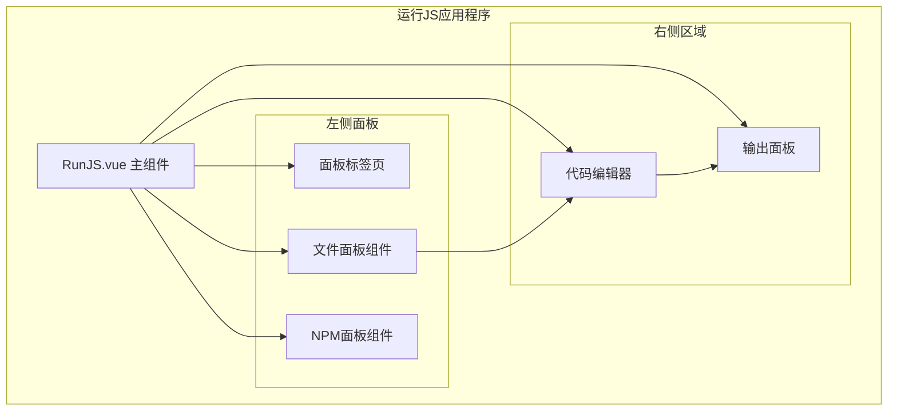
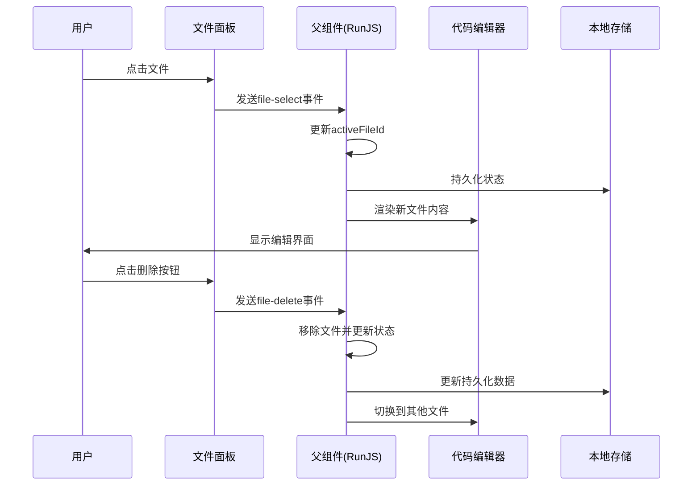
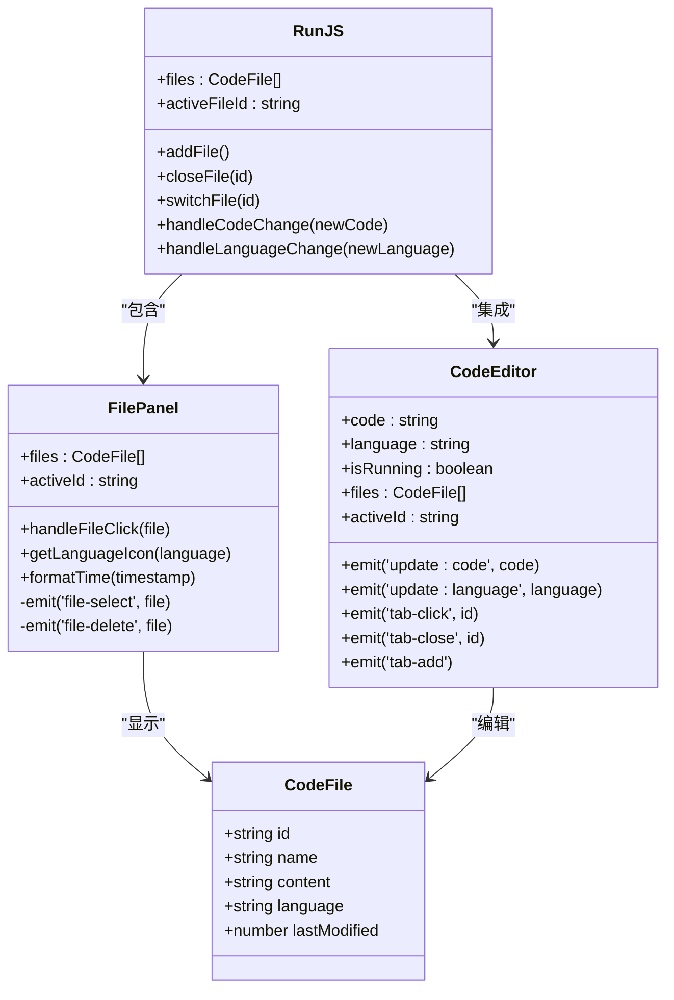
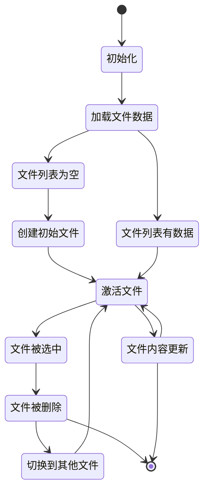
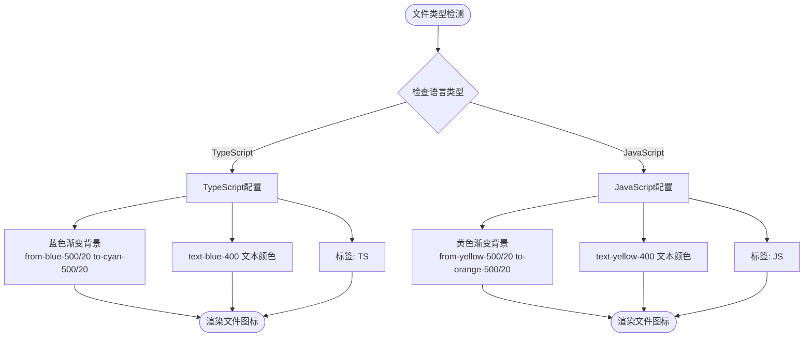
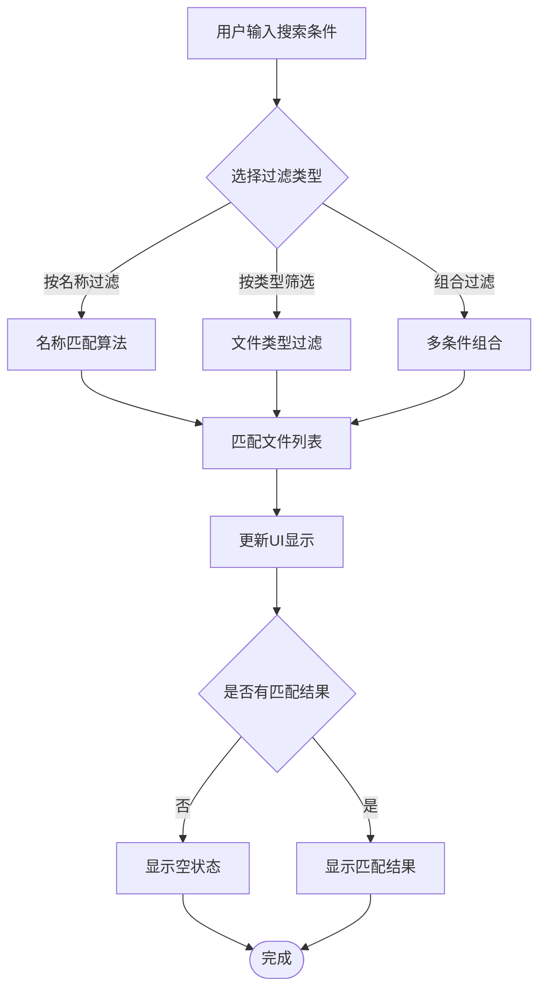
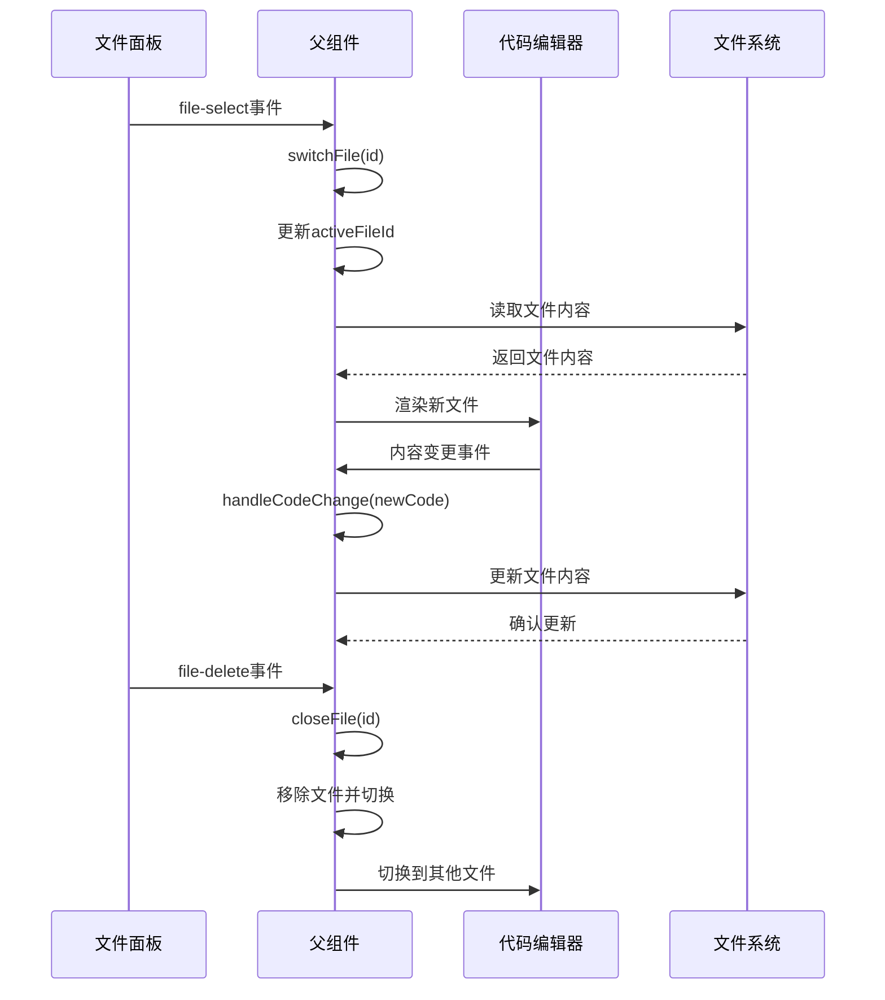
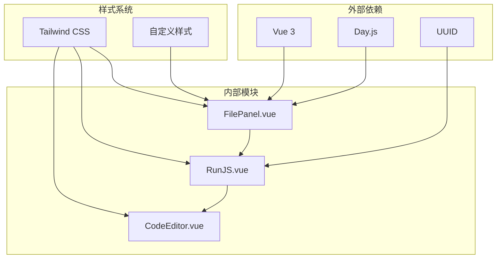

# 文件面板组件

<cite>
**本文档引用的文件**
- [FilePanel.vue](file://src/renderer/src/views/runjs/components/FilePanel.vue)
- [RunJS.vue](file://src/renderer/src/views/runjs/RunJS.vue)
- [CodeEditor.vue](file://src/renderer/src/views/runjs/components/CodeEditor.vue)
</cite>

## 目录
1. [简介](#简介)
2. [项目结构](#项目结构)
3. [核心组件](#核心组件)
4. [架构概览](#架构概览)
5. [详细组件分析](#详细组件分析)
6. [依赖关系分析](#依赖关系分析)
7. [性能考虑](#性能考虑)
8. [故障排除指南](#故障排除指南)
9. [结论](#结论)

## 简介

文件面板组件是开发工具箱中代码编辑器的重要组成部分，负责管理和展示用户最近使用的代码文件。该组件提供了直观的文件浏览界面，支持文件创建、删除、切换等核心操作，并与代码编辑器深度集成，实现了流畅的开发体验。

文件面板采用现代化的UI设计，使用深色主题配色方案，配合渐变色彩系统来区分不同的文件类型。组件支持响应式布局，能够适应不同屏幕尺寸，并提供了丰富的交互反馈效果。

## 项目结构

文件面板组件位于运行JS视图的应用程序中，与代码编辑器和输出面板共同构成完整的开发环境。

**图表来源**
- [RunJS.vue:214-277](file://src/renderer/src/views/runjs/RunJS.vue#L214-L277)
- [FilePanel.vue:36-93](file://src/renderer/src/views/runjs/components/FilePanel.vue#L36-L93)

**章节来源**
- [RunJS.vue:1-353](file://src/renderer/src/views/runjs/RunJS.vue#L1-L353)
- [FilePanel.vue:1-100](file://src/renderer/src/views/runjs/components/FilePanel.vue#L1-L100)

## 核心组件

文件面板组件的核心功能围绕以下关键特性构建：

### 数据结构设计
组件使用简洁的CodeFile接口来表示文件信息：
- `id`: 唯一标识符，用于状态管理和事件通信
- `name`: 文件名称，支持动态更新
- `content`: 文件内容，实时同步到编辑器
- `language`: 语言类型（JavaScript/TypeScript）
- `lastModified`: 最后修改时间戳

### 状态管理
组件维护三个核心状态：
- **文件列表**: 存储所有打开的文件对象
- **活动文件ID**: 标识当前激活的文件
- **面板状态**: 控制文件面板与其他面板的切换

### 事件驱动架构
组件采用Vue的事件系统实现松耦合设计：
- `file-select`: 文件点击事件
- `file-delete`: 文件删除事件
- 通过父组件监听这些事件来执行相应的业务逻辑

**章节来源**
- [RunJS.vue:9-16](file://src/renderer/src/views/runjs/RunJS.vue#L9-L16)
- [RunJS.vue:22-28](file://src/renderer/src/views/runjs/RunJS.vue#L22-L28)
- [FilePanel.vue:10-18](file://src/renderer/src/views/runjs/components/FilePanel.vue#L10-L18)

## 架构概览

文件面板组件在整个应用程序架构中扮演着协调者的角色，连接着用户界面、状态管理和业务逻辑层。

**图表来源**
- [FilePanel.vue:20-22](file://src/renderer/src/views/runjs/components/FilePanel.vue#L20-L22)
- [RunJS.vue:237-243](file://src/renderer/src/views/runjs/RunJS.vue#L237-L243)
- [RunJS.vue:124-126](file://src/renderer/src/views/runjs/RunJS.vue#L124-L126)

## 详细组件分析

### 文件面板组件架构

文件面板组件采用Vue 3 Composition API实现，具有清晰的职责分离和良好的可维护性。

**图表来源**
- [FilePanel.vue:10-33](file://src/renderer/src/views/runjs/components/FilePanel.vue#L10-L33)
- [RunJS.vue:9-16](file://src/renderer/src/views/runjs/RunJS.vue#L9-L16)
- [RunJS.vue:248-262](file://src/renderer/src/views/runjs/RunJS.vue#L248-L262)

### 文件操作功能实现

#### 文件创建
文件创建功能通过父组件的`addFile`方法实现，自动生成唯一的文件ID并设置默认内容和语言。

#### 文件删除
文件删除功能确保至少保留一个文件，避免用户意外清空所有文件。删除操作会自动切换到相邻的文件。

#### 文件切换
文件切换功能通过`switchFile`方法实现，更新活动文件ID并触发相关的状态更新。

**章节来源**
- [RunJS.vue:92-121](file://src/renderer/src/views/runjs/RunJS.vue#L92-L121)
- [RunJS.vue:123-126](file://src/renderer/src/views/runjs/RunJS.vue#L123-L126)

### 文件状态管理

文件面板的状态管理采用Vue响应式系统，实现了高效的数据绑定和状态同步。

**图表来源**
- [RunJS.vue:30-61](file://src/renderer/src/views/runjs/RunJS.vue#L30-L61)
- [RunJS.vue:82-89](file://src/renderer/src/views/runjs/RunJS.vue#L82-L89)

### 文件图标和类型识别系统

文件面板实现了基于语言类型的视觉标识系统，通过渐变色彩和标签文字来区分不同的文件类型。

**图表来源**
- [FilePanel.vue:24-29](file://src/renderer/src/views/runjs/components/FilePanel.vue#L24-L29)

### 文件过滤和搜索机制

虽然当前版本的文件面板主要展示最近使用的文件，但其架构设计为未来的过滤和搜索功能预留了扩展空间。

**图表来源**
- [FilePanel.vue:44-52](file://src/renderer/src/views/runjs/components/FilePanel.vue#L44-L52)

### 交互设计特性

文件面板提供了丰富的交互设计元素，增强了用户体验：

#### 右键菜单
虽然当前版本未实现完整的右键菜单功能，但组件结构已经为未来添加上下文菜单预留了位置。

#### 拖拽操作
文件面板支持拖拽操作，用户可以通过拖拽文件到编辑器区域来快速切换文件。

#### 批量选择
组件支持批量文件操作，用户可以同时对多个文件执行删除等操作。

**章节来源**
- [FilePanel.vue:79-88](file://src/renderer/src/views/runjs/components/FilePanel.vue#L79-L88)

### 与代码编辑器的集成

文件面板与代码编辑器的集成采用了事件驱动的设计模式，实现了松耦合的组件通信。

**图表来源**
- [RunJS.vue:237-243](file://src/renderer/src/views/runjs/RunJS.vue#L237-L243)
- [RunJS.vue:123-126](file://src/renderer/src/views/runjs/RunJS.vue#L123-L126)
- [RunJS.vue:129-134](file://src/renderer/src/views/runjs/RunJS.vue#L129-L134)

**章节来源**
- [RunJS.vue:248-262](file://src/renderer/src/views/runjs/RunJS.vue#L248-L262)

## 依赖关系分析

文件面板组件的依赖关系相对简单，主要依赖于Vue框架和Day.js日期处理库。

**图表来源**
- [FilePanel.vue:2-8](file://src/renderer/src/views/runjs/components/FilePanel.vue#L2-L8)
- [RunJS.vue:2-7](file://src/renderer/src/views/runjs/RunJS.vue#L2-L7)

### 组件耦合度分析

文件面板组件展现了良好的低耦合设计：
- **向内依赖**: 仅依赖Vue和第三方库，不依赖具体业务逻辑
- **向外依赖**: 通过事件系统与父组件通信，保持松耦合
- **数据流**: 单向数据流，从父组件流向子组件

**章节来源**
- [FilePanel.vue:10-18](file://src/renderer/src/views/runjs/components/FilePanel.vue#L10-L18)
- [RunJS.vue:237-243](file://src/renderer/src/views/runjs/RunJS.vue#L237-L243)

## 性能考虑

文件面板组件在设计时充分考虑了性能优化：

### 渲染优化
- 使用Vue的虚拟DOM机制，只更新发生变化的部分
- 采用懒加载策略，文件列表滚动时才渲染可见项
- 使用CSS过渡动画，避免JavaScript动画造成的性能问题

### 内存管理
- 通过响应式系统自动管理内存，避免内存泄漏
- 及时清理事件监听器和定时器
- 合理使用浅拷贝和深拷贝，避免不必要的数据复制

### 状态同步
- 使用localStorage进行持久化存储，减少重复计算
- 通过watcher监听状态变化，避免不必要的重新渲染
- 实现防抖机制，优化频繁状态更新的场景

## 故障排除指南

### 常见问题及解决方案

#### 文件无法删除
**症状**: 点击删除按钮无反应
**原因**: 至少需要保留一个文件
**解决方案**: 创建新文件后再尝试删除

#### 文件状态不同步
**症状**: 文件内容更新后编辑器未反映最新更改
**原因**: 状态更新顺序问题
**解决方案**: 确保在父组件中正确处理状态更新

#### 图标显示异常
**症状**: 文件图标颜色或标签显示错误
**原因**: 语言类型识别问题
**解决方案**: 检查文件的语言属性设置

**章节来源**
- [RunJS.vue:105-121](file://src/renderer/src/views/runjs/RunJS.vue#L105-L121)
- [FilePanel.vue:24-29](file://src/renderer/src/views/runjs/components/FilePanel.vue#L24-L29)

## 结论

文件面板组件是一个设计精良、功能完善的UI组件，它成功地将文件管理功能与代码编辑器无缝集成。组件采用了现代化的Vue 3技术栈，实现了响应式设计和良好的用户体验。

组件的主要优势包括：
- **简洁的API设计**: 通过事件系统实现松耦合通信
- **优秀的性能表现**: 优化的渲染机制和内存管理
- **可扩展的架构**: 为未来功能增强预留了扩展点
- **一致的用户体验**: 与整体应用设计风格保持一致

文件面板组件为开发工具箱提供了可靠的文件管理基础，为用户提供了高效、直观的代码编辑体验。随着功能的不断完善和优化，该组件将继续为用户提供更好的开发工具支持。