# 输出面板组件

<cite>
**本文档引用的文件**
- [OutputPanel.vue](file://src/renderer/src/views/runjs/components/OutputPanel.vue)
- [codeRunner.ts](file://src/main/services/codeRunner.ts)
- [RunJS.vue](file://src/renderer/src/views/runjs/RunJS.vue)
- [index.ts](file://src/preload/index.ts)
- [CodeEditor.vue](file://src/renderer/src/views/runjs/components/CodeEditor.vue)
- [FilePanel.vue](file://src/renderer/src/views/runjs/components/FilePanel.vue)
- [ChartRenderer.vue](file://src/renderer/src/views/sqlexpert/ChartRenderer.vue)
- [ResponsePanel.vue](file://src/renderer/src/views/httpclient/components/ResponsePanel.vue)
</cite>

## 目录
1. [简介](#简介)
2. [项目结构](#项目结构)
3. [核心组件](#核心组件)
4. [架构概览](#架构概览)
5. [详细组件分析](#详细组件分析)
6. [依赖关系分析](#依赖关系分析)
7. [性能考虑](#性能考虑)
8. [故障排除指南](#故障排除指南)
9. [结论](#结论)

## 简介

输出面板组件是开发工具箱中用于展示代码执行结果的核心界面组件。该组件提供了完整的代码执行结果显示、格式化处理和用户交互功能，包括文本输出、错误信息和警告消息的分类显示，以及与代码运行器的深度集成。

输出面板采用现代化的响应式设计，支持多种输出格式的展示，包括纯文本、JSON格式化、表格渲染和图表显示。同时提供了丰富的交互功能，如实时输出更新、历史管理、过滤搜索、导出功能等。

## 项目结构

输出面板组件位于运行JS功能模块中，与代码编辑器、文件管理器等组件协同工作，形成完整的开发工具链。

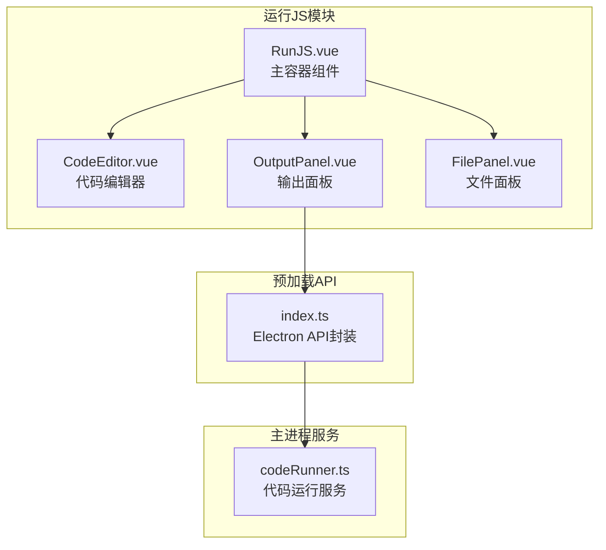

**图表来源**
- [RunJS.vue:1-353](file://src/renderer/src/views/runjs/RunJS.vue#L1-L353)
- [OutputPanel.vue:1-250](file://src/renderer/src/views/runjs/components/OutputPanel.vue#L1-L250)
- [codeRunner.ts:1-461](file://src/main/services/codeRunner.ts#L1-L461)
- [index.ts:62-69](file://src/preload/index.ts#L62-L69)

**章节来源**
- [RunJS.vue:1-353](file://src/renderer/src/views/runjs/RunJS.vue#L1-L353)
- [OutputPanel.vue:1-250](file://src/renderer/src/views/runjs/components/OutputPanel.vue#L1-L250)

## 核心组件

输出面板组件由多个核心部分组成，每个部分都有特定的功能和职责：

### 主要功能特性

1. **多标签页输出管理**
   - 控制台标签页：显示标准输出
   - 错误标签页：显示错误和警告信息
   - 自动标签页切换：根据输出类型自动切换

2. **实时输出更新**
   - 实时接收代码执行结果
   - 支持长时间运行的代码
   - 进度指示和状态反馈

3. **格式化输出处理**
   - JSON格式化显示
   - 表格数据渲染
   - 图表可视化支持

4. **交互控制功能**
   - 运行/停止按钮
   - 清空输出功能
   - 端口进程终止

### 数据流架构

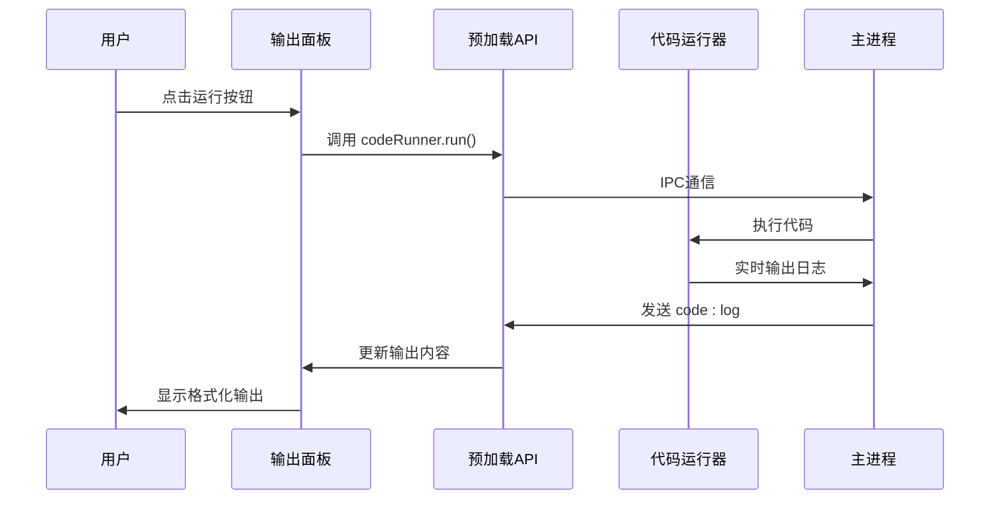

**图表来源**
- [OutputPanel.vue:11-15](file://src/renderer/src/views/runjs/components/OutputPanel.vue#L11-L15)
- [index.ts:62-69](file://src/preload/index.ts#L62-L69)
- [codeRunner.ts:98-235](file://src/main/services/codeRunner.ts#L98-L235)

**章节来源**
- [OutputPanel.vue:1-250](file://src/renderer/src/views/runjs/components/OutputPanel.vue#L1-L250)
- [codeRunner.ts:1-461](file://src/main/services/codeRunner.ts#L1-L461)

## 架构概览

输出面板采用分层架构设计，实现了渲染层、业务逻辑层和数据传输层的有效分离。

### 整体架构图

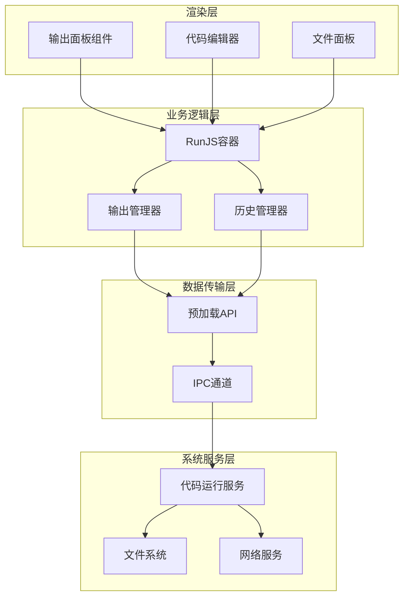

**图表来源**
- [RunJS.vue:1-353](file://src/renderer/src/views/runjs/RunJS.vue#L1-L353)
- [OutputPanel.vue:1-250](file://src/renderer/src/views/runjs/components/OutputPanel.vue#L1-L250)
- [index.ts:62-69](file://src/preload/index.ts#L62-L69)

### 组件关系图

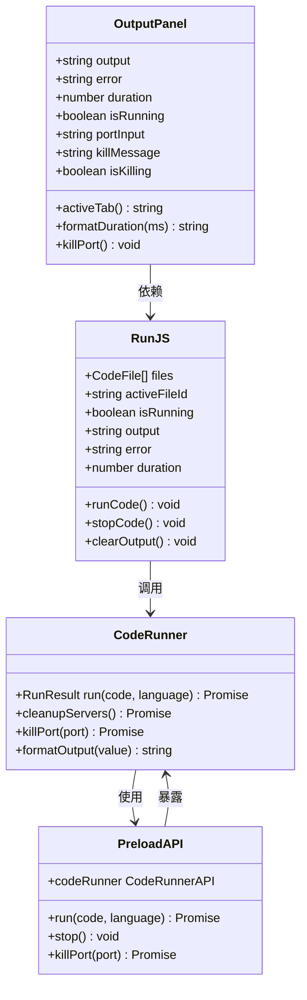

**图表来源**
- [OutputPanel.vue:1-56](file://src/renderer/src/views/runjs/components/OutputPanel.vue#L1-L56)
- [RunJS.vue:1-188](file://src/renderer/src/views/runjs/RunJS.vue#L1-L188)
- [codeRunner.ts:14-460](file://src/main/services/codeRunner.ts#L14-L460)
- [index.ts:62-69](file://src/preload/index.ts#L62-L69)

## 详细组件分析

### 输出面板组件分析

输出面板组件是整个运行JS功能的核心展示组件，负责将代码执行结果以用户友好的方式呈现。

#### 组件结构分析

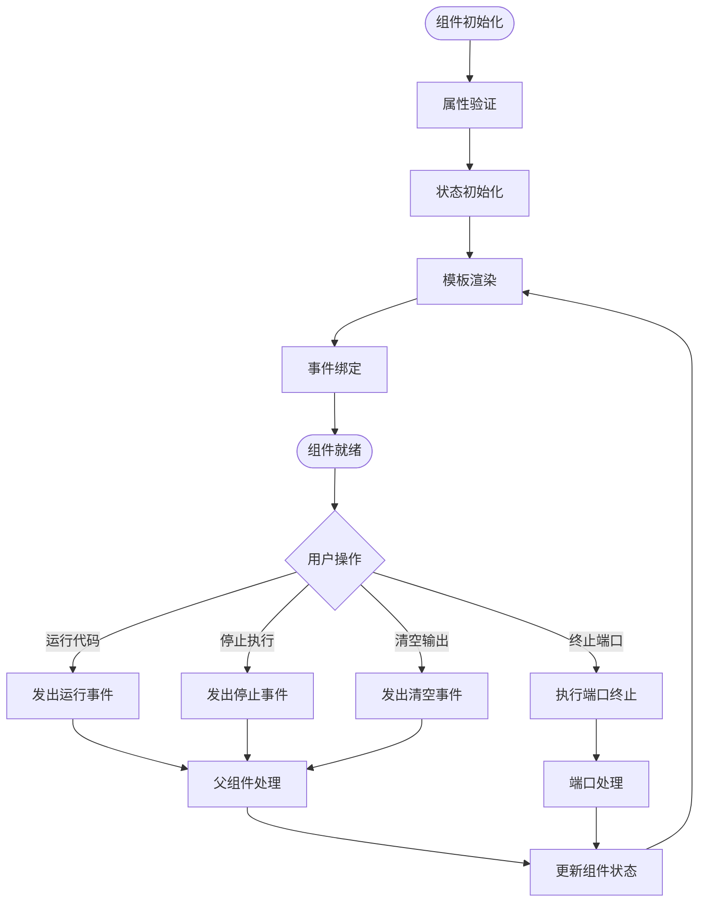

**图表来源**
- [OutputPanel.vue:1-56](file://src/renderer/src/views/runjs/components/OutputPanel.vue#L1-L56)

#### 输出内容展示机制

输出面板支持三种主要的输出内容展示：

1. **成功输出展示**
   - 绿色对勾图标标识
   - 格式化的代码输出
   - 等宽字体显示
   - 滚动区域支持

2. **错误输出展示**
   - 红色叉号图标标识
   - 错误信息高亮显示
   - 错误样式背景
   - 详细的错误描述

3. **空状态展示**
   - 提示用户点击运行
   - 快捷键提示
   - 空状态图标

#### 端口终止功能

输出面板提供了强大的端口管理功能：

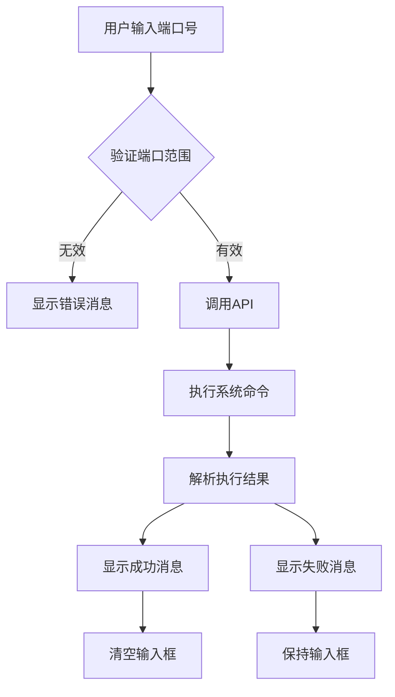

**图表来源**
- [OutputPanel.vue:35-56](file://src/renderer/src/views/runjs/components/OutputPanel.vue#L35-L56)

**章节来源**
- [OutputPanel.vue:1-250](file://src/renderer/src/views/runjs/components/OutputPanel.vue#L1-L250)

### 代码运行器集成分析

代码运行器服务是输出面板的核心后端支持，负责实际的代码执行和输出收集。

#### 运行流程分析

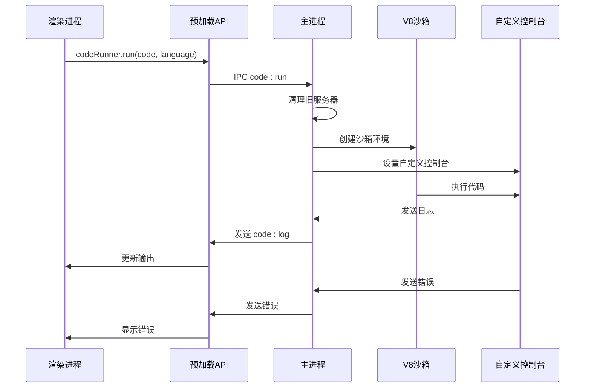

**图表来源**
- [codeRunner.ts:98-235](file://src/main/services/codeRunner.ts#L98-L235)
- [index.ts:62-69](file://src/preload/index.ts#L62-L69)

#### 输出格式化机制

代码运行器实现了智能的输出格式化功能：

1. **类型检测和转换**
   - 基本类型直接转换为字符串
   - 对象类型进行JSON序列化
   - 数组类型进行截断处理
   - 特殊对象类型优化显示

2. **长度限制和安全处理**
   - 对象序列化长度限制
   - 防止内存溢出
   - 安全的字符串截断

3. **特殊类型处理**
   - Server对象特殊处理
   - Buffer类型十六进制显示
   - Error对象格式化

**章节来源**
- [codeRunner.ts:320-362](file://src/main/services/codeRunner.ts#L320-L362)

### 预加载API集成分析

预加载API为输出面板提供了安全的IPC通信接口。

#### API暴露机制

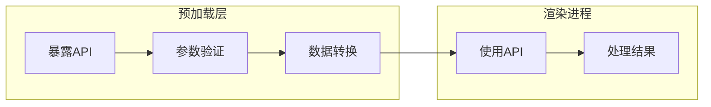

**图表来源**
- [index.ts:62-69](file://src/preload/index.ts#L62-L69)

#### 安全通信机制

预加载API实现了严格的安全通信机制：

1. **上下文隔离**
   - 使用contextBridge进行API暴露
   - 防止DOM注入攻击
   - 保护主进程安全

2. **参数验证**
   - 输入参数类型检查
   - 端口范围验证
   - 错误处理机制

3. **错误传播**
   - 异常信息传递
   - 用户友好的错误消息
   - 日志记录机制

**章节来源**
- [index.ts:62-69](file://src/preload/index.ts#L62-L69)

## 依赖关系分析

输出面板组件的依赖关系体现了清晰的分层架构设计。

### 外部依赖关系

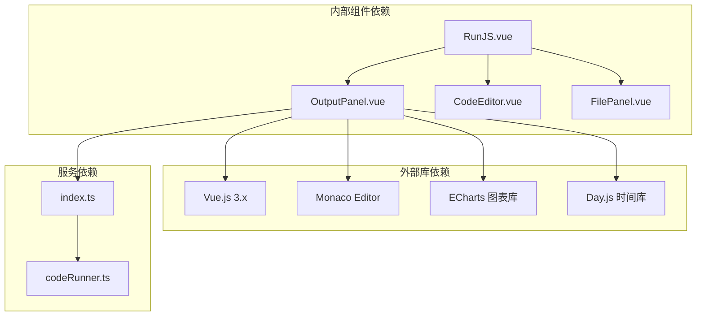

**图表来源**
- [OutputPanel.vue:1-2](file://src/renderer/src/views/runjs/components/OutputPanel.vue#L1-L2)
- [RunJS.vue:1-7](file://src/renderer/src/views/runjs/RunJS.vue#L1-L7)
- [codeRunner.ts:1-8](file://src/main/services/codeRunner.ts#L1-L8)

### 内部耦合分析

输出面板组件与其他组件的耦合关系相对松散，主要通过props和事件进行通信：

1. **父子组件通信**
   - RunJS容器组件通过props传递数据
   - 输出面板通过事件向父组件发送指令

2. **服务层解耦**
   - 通过预加载API进行IPC通信
   - 避免直接访问主进程服务

3. **样式和主题**
   - 统一的颜色方案和字体
   - 响应式布局设计

**章节来源**
- [RunJS.vue:265-275](file://src/renderer/src/views/runjs/RunJS.vue#L265-L275)
- [OutputPanel.vue:11-15](file://src/renderer/src/views/runjs/components/OutputPanel.vue#L11-L15)

## 性能考虑

输出面板组件在设计时充分考虑了性能优化，特别是在处理大量输出数据时的表现。

### 性能优化策略

1. **虚拟滚动**
   - 大量输出内容时使用虚拟滚动
   - 限制渲染元素数量
   - 滚动性能优化

2. **懒加载机制**
   - 图表组件按需加载
   - 大型图表延迟初始化
   - 内存使用优化

3. **事件节流**
   - 高频事件处理节流
   - 防止重复渲染
   - 用户体验优化

### 内存管理

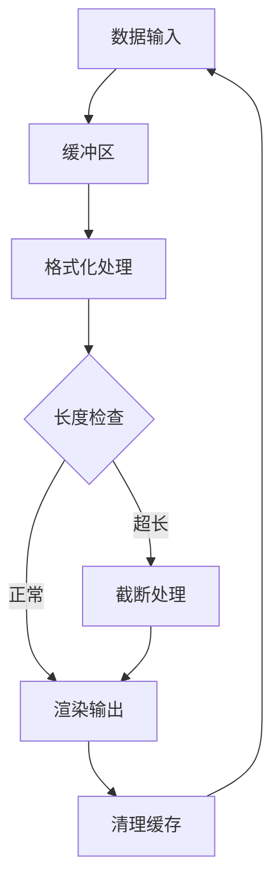

**图表来源**
- [codeRunner.ts:350-357](file://src/main/services/codeRunner.ts#L350-L357)

### 并发处理

输出面板能够有效处理并发的输出请求：

1. **异步输出处理**
   - 实时输出流处理
   - 非阻塞UI更新
   - 并发输出合并

2. **资源清理**
   - 自动清理临时资源
   - 进程终止处理
   - 内存泄漏防护

**章节来源**
- [codeRunner.ts:77-96](file://src/main/services/codeRunner.ts#L77-L96)
- [OutputPanel.vue:35-56](file://src/renderer/src/views/runjs/components/OutputPanel.vue#L35-L56)

## 故障排除指南

输出面板组件可能遇到的各种问题及解决方案：

### 常见问题诊断

1. **输出不显示问题**
   - 检查代码执行是否成功
   - 验证IPC通信是否正常
   - 确认预加载API是否可用

2. **端口终止失败**
   - 验证端口范围有效性
   - 检查系统权限
   - 确认进程是否存在

3. **格式化异常**
   - 检查对象循环引用
   - 验证JSON序列化
   - 处理特殊字符

### 调试技巧

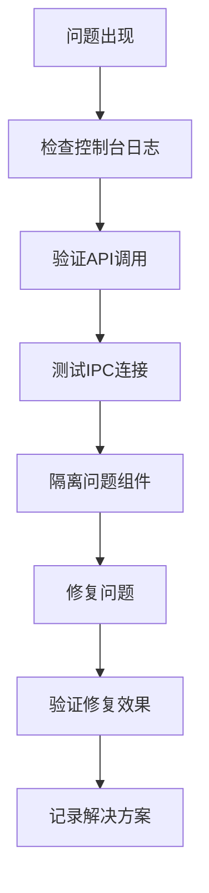

**图表来源**
- [codeRunner.ts:237-240](file://src/main/services/codeRunner.ts#L237-L240)

### 错误恢复机制

输出面板提供了完善的错误恢复机制：

1. **自动重试**
   - 网络连接失败自动重试
   - IPC通信异常处理
   - 资源加载失败恢复

2. **降级显示**
   - 图表渲染失败降级
   - 大数据量简化显示
   - 功能禁用优雅降级

**章节来源**
- [OutputPanel.vue:35-56](file://src/renderer/src/views/runjs/components/OutputPanel.vue#L35-L56)
- [codeRunner.ts:254-317](file://src/main/services/codeRunner.ts#L254-L317)

## 结论

输出面板组件作为开发工具箱的核心功能之一，展现了优秀的架构设计和实现质量。该组件不仅提供了完整的代码执行结果显示功能，还具备了现代开发工具所需的所有关键特性。

### 设计优势

1. **模块化设计**
   - 清晰的组件边界
   - 良好的职责分离
   - 易于维护和扩展

2. **用户体验**
   - 直观的操作界面
   - 实时反馈机制
   - 丰富的交互功能

3. **技术实现**
   - 安全的IPC通信
   - 高效的性能优化
   - 完善的错误处理

### 未来改进方向

1. **功能增强**
   - 更强大的输出过滤功能
   - 导出格式多样化
   - 历史记录管理增强

2. **性能优化**
   - 更高效的虚拟滚动
   - 智能缓存机制
   - 并发处理优化

3. **用户体验**
   - 更灵活的布局定制
   - 更丰富的主题选项
   - 更便捷的快捷键支持

输出面板组件为开发者提供了一个强大、易用、可靠的代码执行结果展示平台，是现代开发工具的重要组成部分。