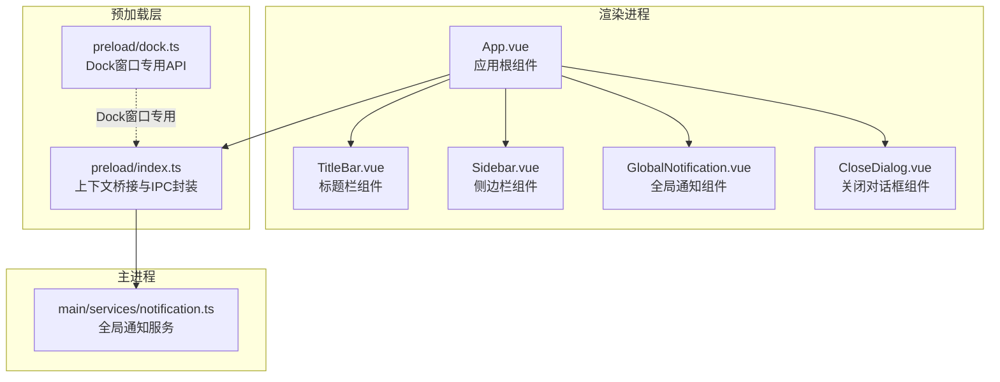
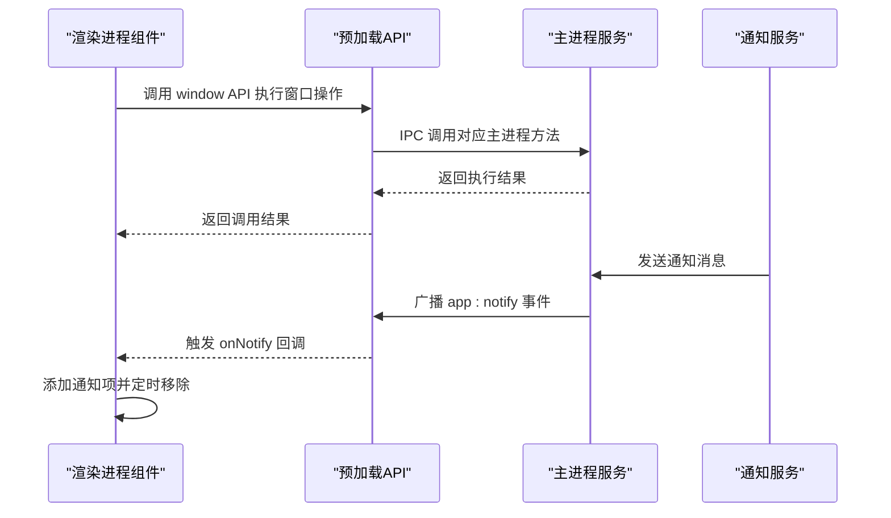
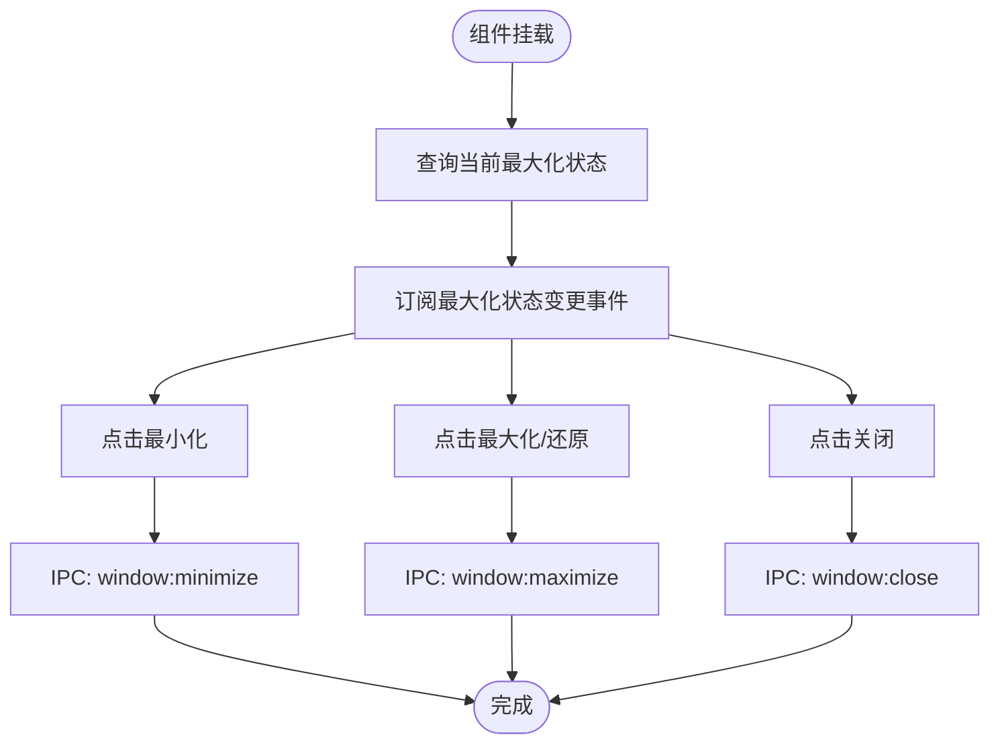
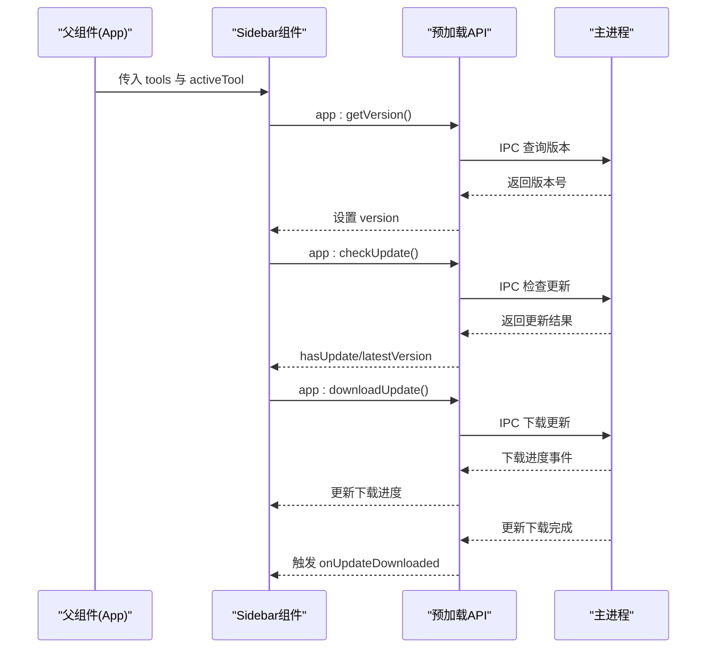
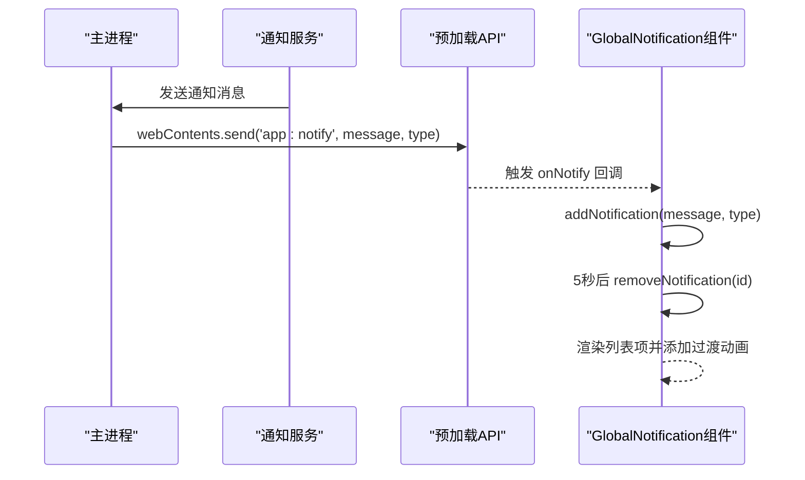
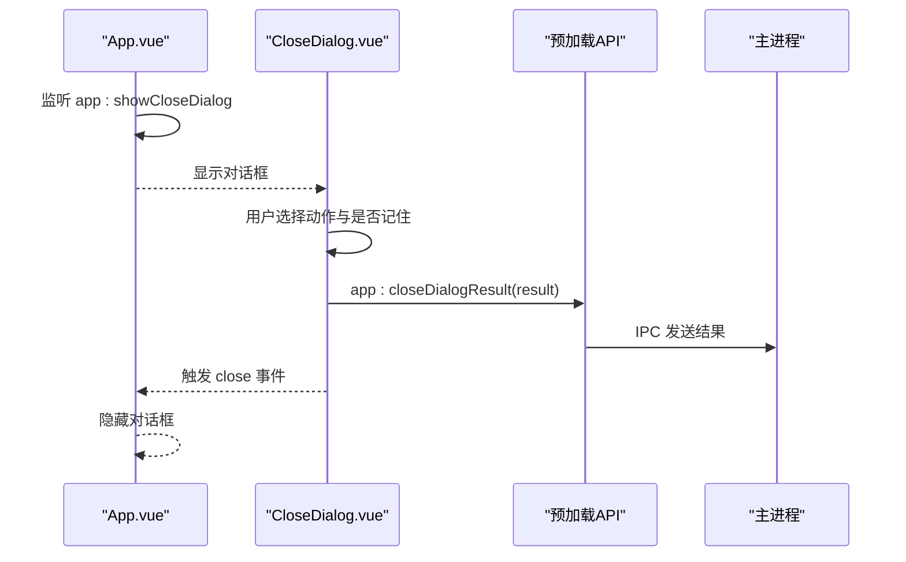
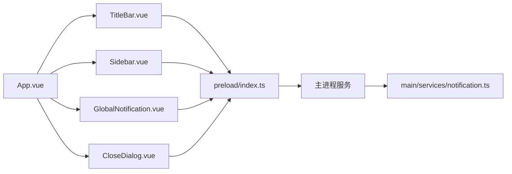

# 应用基础组件

<cite>
**本文档引用的文件**
- [TitleBar.vue](file://src/renderer/src/components/TitleBar.vue)
- [Sidebar.vue](file://src/renderer/src/components/Sidebar.vue)
- [GlobalNotification.vue](file://src/renderer/src/components/GlobalNotification.vue)
- [CloseDialog.vue](file://src/renderer/src/components/CloseDialog.vue)
- [index.ts](file://src/preload/index.ts)
- [notification.ts](file://src/main/services/notification.ts)
- [index.css](file://src/renderer/src/styles/index.css)
- [App.vue](file://src/renderer/src/App.vue)
- [main.ts](file://src/renderer/src/main.ts)
- [dock.ts](file://src/preload/dock.ts)
</cite>

## 目录
1. [简介](#简介)
2. [项目结构](#项目结构)
3. [核心组件](#核心组件)
4. [架构总览](#架构总览)
5. [详细组件分析](#详细组件分析)
6. [依赖关系分析](#依赖关系分析)
7. [性能考虑](#性能考虑)
8. [故障排除指南](#故障排除指南)
9. [结论](#结论)

## 简介
本文件面向开发者工具箱应用的基础组件，重点解析以下四个核心UI组件：
- 标题栏组件：窗口控制按钮、应用信息展示与系统集成机制
- 侧边栏导航组件：工具列表管理、活动状态跟踪与用户交互处理
- 全局通知组件：消息管理与显示机制
- 关闭对话框：确认流程与用户体验设计

同时提供组件属性配置、事件处理与样式定制的实现细节，帮助开发者快速理解并扩展这些基础组件。

## 项目结构
应用采用 Electron + Vue 3 的前端架构，基础组件位于渲染进程的组件目录中，通过预加载脚本暴露安全的 IPC 接口给渲染进程使用。样式统一在全局样式文件中定义，主题变量集中管理。

图表来源
- [App.vue:1-102](file://src/renderer/src/App.vue#L1-L102)
- [TitleBar.vue:1-150](file://src/renderer/src/components/TitleBar.vue#L1-L150)
- [Sidebar.vue:1-385](file://src/renderer/src/components/Sidebar.vue#L1-L385)
- [GlobalNotification.vue:1-211](file://src/renderer/src/components/GlobalNotification.vue#L1-L211)
- [CloseDialog.vue:1-215](file://src/renderer/src/components/CloseDialog.vue#L1-L215)
- [index.ts:1-229](file://src/preload/index.ts#L1-L229)
- [notification.ts:1-29](file://src/main/services/notification.ts#L1-L29)
- [dock.ts:1-19](file://src/preload/dock.ts#L1-L19)

章节来源
- [App.vue:1-102](file://src/renderer/src/App.vue#L1-L102)
- [index.ts:1-229](file://src/preload/index.ts#L1-L229)
- [index.css:1-171](file://src/renderer/src/styles/index.css#L1-L171)

## 核心组件
本节概述四个基础组件的功能职责与关键实现点：
- 标题栏组件：提供窗口最小化、最大化/还原、关闭操作；显示品牌标识与应用名称；响应窗口最大化状态变化。
- 侧边栏组件：维护工具列表与活动状态；处理工具选择与“回到首页”事件；内置版本检查与更新下载逻辑。
- 全局通知组件：接收主进程推送的通知消息，自动定时移除；支持复制消息到剪贴板；提供不同类型的视觉反馈。
- 关闭对话框：拦截窗口关闭事件，弹出确认对话框，允许用户选择最小化或退出，并可记住用户偏好。

章节来源
- [TitleBar.vue:1-150](file://src/renderer/src/components/TitleBar.vue#L1-L150)
- [Sidebar.vue:1-385](file://src/renderer/src/components/Sidebar.vue#L1-L385)
- [GlobalNotification.vue:1-211](file://src/renderer/src/components/GlobalNotification.vue#L1-L211)
- [CloseDialog.vue:1-215](file://src/renderer/src/components/CloseDialog.vue#L1-L215)

## 架构总览
基础组件通过预加载脚本提供的安全 IPC 接口与主进程通信，实现系统级功能与跨进程消息传递。全局通知服务从主进程向渲染进程广播通知，确保一致的用户体验。

图表来源
- [index.ts:10-60](file://src/preload/index.ts#L10-L60)
- [notification.ts:10-29](file://src/main/services/notification.ts#L10-L29)
- [GlobalNotification.vue:54-62](file://src/renderer/src/components/GlobalNotification.vue#L54-L62)

## 详细组件分析

### 标题栏组件（TitleBar）
- 设计目标：提供标准窗口控制按钮与应用品牌展示，支持拖拽区域与系统集成。
- 关键实现：
  - 状态管理：通过响应式变量跟踪窗口是否最大化。
  - 事件绑定：最小化、最大化/还原、关闭三个按钮分别调用预加载 API。
  - 生命周期：挂载时查询当前最大化状态，并订阅最大化状态变更事件。
  - 样式策略：使用 CSS 变量与过渡动画，确保深色主题一致性。

图表来源
- [TitleBar.vue:10-15](file://src/renderer/src/components/TitleBar.vue#L10-L15)
- [TitleBar.vue:6-8](file://src/renderer/src/components/TitleBar.vue#L6-L8)
- [index.ts:13-21](file://src/preload/index.ts#L13-L21)

章节来源
- [TitleBar.vue:1-150](file://src/renderer/src/components/TitleBar.vue#L1-L150)
- [index.ts:13-21](file://src/preload/index.ts#L13-L21)

### 侧边栏导航组件（Sidebar）
- 设计目标：提供工具导航、设置入口与版本信息展示，支持活动状态高亮与更新流程。
- 关键实现：
  - 工具列表：通过 props 接收工具数组与当前活动工具 ID。
  - 事件发射：工具选择与“回到首页”事件由子组件发出，父组件负责状态管理。
  - 版本与更新：初始化时获取应用版本，订阅下载进度与更新完成事件；支持检查更新、下载更新与安装更新。
  - 图标系统：内置多套 SVG 图标，根据图标名称动态注入。
  - 样式策略：固定宽度侧边栏，导航项为正方形布局，活动态指示器随状态变化。

图表来源
- [Sidebar.vue:25-34](file://src/renderer/src/components/Sidebar.vue#L25-L34)
- [Sidebar.vue:36-50](file://src/renderer/src/components/Sidebar.vue#L36-L50)
- [Sidebar.vue:52-68](file://src/renderer/src/components/Sidebar.vue#L52-L68)
- [index.ts:24-47](file://src/preload/index.ts#L24-L47)

章节来源
- [Sidebar.vue:1-385](file://src/renderer/src/components/Sidebar.vue#L1-L385)
- [index.ts:24-47](file://src/preload/index.ts#L24-L47)

### 全局通知组件（GlobalNotification）
- 设计目标：统一接收并展示来自主进程的通知消息，提供复制与自动消失能力。
- 关键实现：
  - 数据模型：通知对象包含唯一 ID、消息内容、类型与复制状态。
  - 生命周期：组件挂载时注册通知回调，卸载时移除监听；每条通知在固定时间后自动移除。
  - 用户交互：支持点击复制到剪贴板与手动关闭；复制成功后短暂提示。
  - 视觉反馈：不同类型通知使用不同背景色与边框色，配合过渡动画提升体验。

图表来源
- [notification.ts:15-20](file://src/main/services/notification.ts#L15-L20)
- [index.ts:50-60](file://src/preload/index.ts#L50-L60)
- [GlobalNotification.vue:54-62](file://src/renderer/src/components/GlobalNotification.vue#L54-L62)
- [GlobalNotification.vue:16-30](file://src/renderer/src/components/GlobalNotification.vue#L16-L30)

章节来源
- [GlobalNotification.vue:1-211](file://src/renderer/src/components/GlobalNotification.vue#L1-L211)
- [notification.ts:1-29](file://src/main/services/notification.ts#L1-L29)
- [index.ts:50-60](file://src/preload/index.ts#L50-L60)

### 关闭对话框（CloseDialog）
- 设计目标：在用户尝试关闭窗口时弹出确认对话框，提供最小化到托盘或直接退出两种选项，并可记住用户偏好。
- 关键实现：
  - 状态管理：内部维护选中的动作与“不再提醒”复选框状态。
  - 事件处理：确认时通过 IPC 将结果发送给主进程，随后触发组件关闭事件；取消时仅触发关闭事件。
  - 用户体验：对话框居中显示，带遮罩与淡入动画；选项项高亮与选中态明确。

图表来源
- [App.vue:49-52](file://src/renderer/src/App.vue#L49-L52)
- [CloseDialog.vue:11-21](file://src/renderer/src/components/CloseDialog.vue#L11-L21)
- [index.ts:36-41](file://src/preload/index.ts#L36-L41)

章节来源
- [CloseDialog.vue:1-215](file://src/renderer/src/components/CloseDialog.vue#L1-L215)
- [App.vue:49-52](file://src/renderer/src/App.vue#L49-L52)
- [index.ts:36-41](file://src/preload/index.ts#L36-L41)

## 依赖关系分析
基础组件之间的依赖关系与数据流如下：
- App.vue 作为根组件，持有当前活动工具状态，向 Sidebar 注入工具列表与活动状态，并处理工具选择事件。
- TitleBar 与 Sidebar 通过预加载 API 与主进程通信，实现窗口控制与应用信息查询。
- GlobalNotification 通过预加载 API 订阅主进程通知事件，实现全局消息展示。
- CloseDialog 通过预加载 API 与主进程交互，处理关闭行为确认。

图表来源
- [App.vue:1-102](file://src/renderer/src/App.vue#L1-L102)
- [index.ts:10-60](file://src/preload/index.ts#L10-L60)
- [notification.ts:1-29](file://src/main/services/notification.ts#L1-L29)

章节来源
- [App.vue:1-102](file://src/renderer/src/App.vue#L1-L102)
- [index.ts:10-60](file://src/preload/index.ts#L10-L60)

## 性能考虑
- 组件渲染优化
  - 使用 Vue 的响应式系统管理状态，避免不必要的重渲染。
  - 侧边栏工具列表使用 v-for 渲染，保持 key 的稳定性以提升列表更新性能。
- IPC 调用频率控制
  - 版本检查与下载流程中对并发调用进行状态标记，防止重复请求。
- 动画与过渡
  - 使用 CSS 变量与简洁的过渡函数，减少复杂动画对性能的影响。
- 样式隔离
  - 使用 scoped 样式与 CSS 变量，避免全局样式污染，提升样式计算效率。

## 故障排除指南
- 标题栏按钮无响应
  - 检查预加载 API 是否正确暴露窗口控制方法。
  - 确认渲染进程上下文桥接是否启用。
- 侧边栏无法显示版本或更新
  - 确认主进程应用服务已实现相应 IPC 处理。
  - 检查下载进度与更新完成事件是否正确触发。
- 全局通知不显示
  - 确认主进程通知服务已向所有窗口广播消息。
  - 检查预加载 API 的 onNotify 回调是否被正确注册与移除。
- 关闭对话框不出现
  - 确认主进程已发送 app:showCloseDialog 事件。
  - 检查渲染进程是否正确监听该事件并显示对话框。

章节来源
- [index.ts:216-229](file://src/preload/index.ts#L216-L229)
- [notification.ts:15-20](file://src/main/services/notification.ts#L15-L20)
- [App.vue:49-52](file://src/renderer/src/App.vue#L49-L52)

## 结论
开发者工具箱的基础组件围绕 Electron + Vue 的架构实现了窗口控制、导航管理、通知展示与关闭确认等核心功能。通过预加载脚本的安全 IPC 封装，组件能够稳定地与主进程交互，同时保持良好的用户体验与可维护性。建议在扩展新功能时遵循现有模式，统一使用预加载 API 进行跨进程通信，并保持样式与交互的一致性。