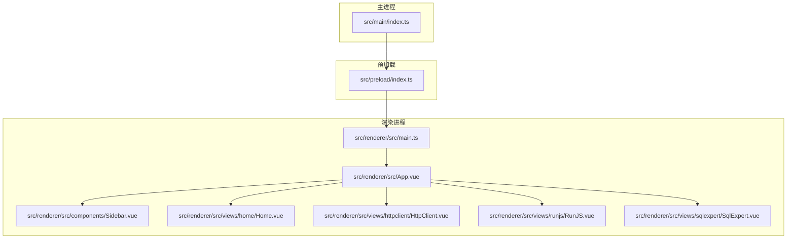
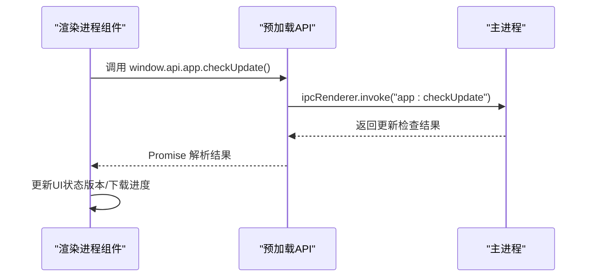
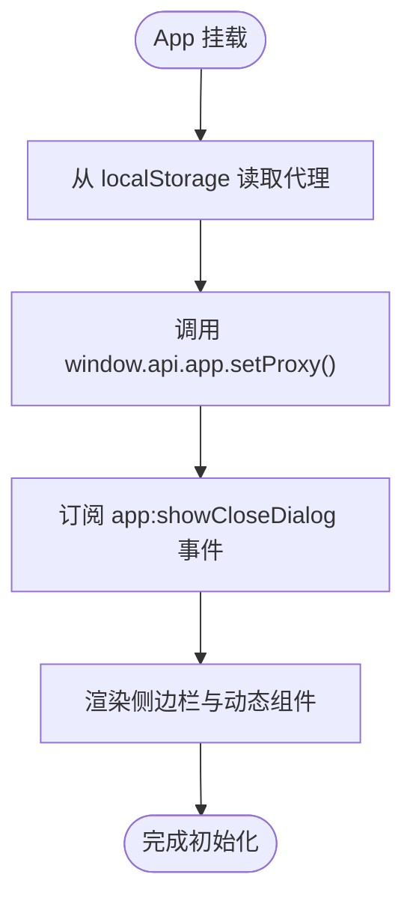
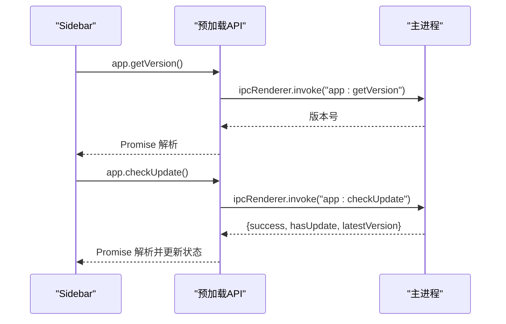
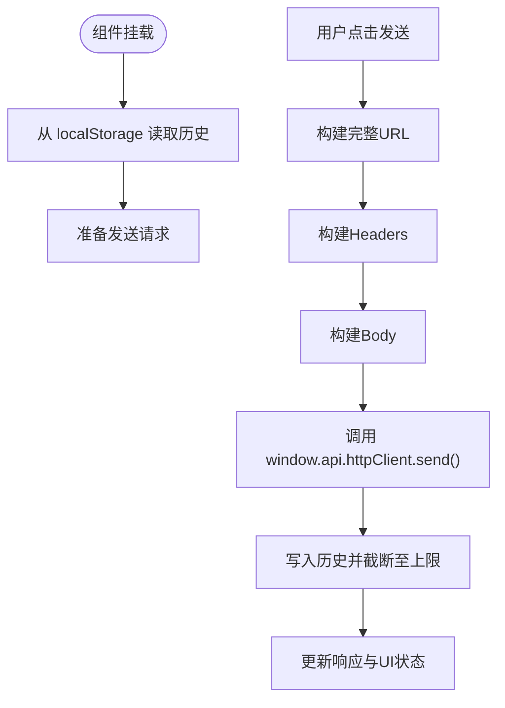
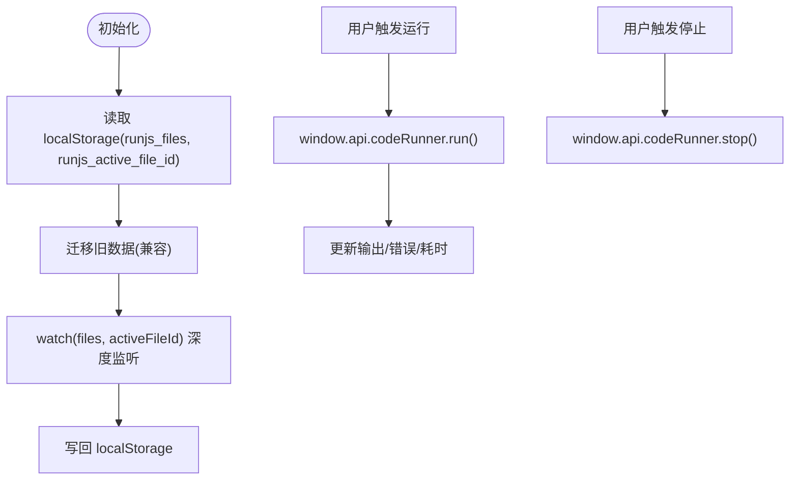
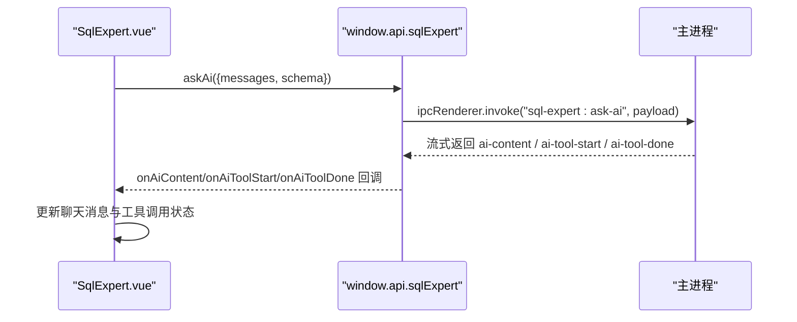
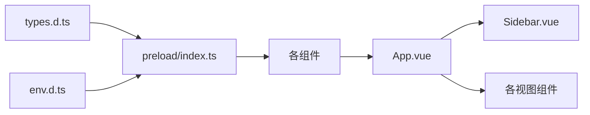

# 状态管理与数据流

<cite>
**本文引用的文件**
- [src/main/index.ts](file://src/main/index.ts)
- [src/preload/index.ts](file://src/preload/index.ts)
- [src/renderer/src/main.ts](file://src/renderer/src/main.ts)
- [src/renderer/src/App.vue](file://src/renderer/src/App.vue)
- [src/renderer/src/env.d.ts](file://src/renderer/src/env.d.ts)
- [src/renderer/src/types.d.ts](file://src/renderer/src/types.d.ts)
- [src/renderer/src/components/Sidebar.vue](file://src/renderer/src/components/Sidebar.vue)
- [src/renderer/src/views/home/Home.vue](file://src/renderer/src/views/home/Home.vue)
- [src/renderer/src/views/httpclient/HttpClient.vue](file://src/renderer/src/views/httpclient/HttpClient.vue)
- [src/renderer/src/views/runjs/RunJS.vue](file://src/renderer/src/views/runjs/RunJS.vue)
- [src/renderer/src/views/sqlexpert/SqlExpert.vue](file://src/renderer/src/views/sqlexpert/SqlExpert.vue)
</cite>

## 目录
1. [简介](#简介)
2. [项目结构](#项目结构)
3. [核心组件](#核心组件)
4. [架构总览](#架构总览)
5. [详细组件分析](#详细组件分析)
6. [依赖关系分析](#依赖关系分析)
7. [性能考虑](#性能考虑)
8. [故障排查指南](#故障排查指南)
9. [结论](#结论)
10. [附录](#附录)

## 简介
本文件面向开发者工具箱的应用前端，系统性梳理其基于 Vue 3 Composition API 的状态管理与数据流设计，涵盖以下主题：
- Vue 3 Composition API 使用模式与最佳实践
- 全局状态设计与响应式数据绑定
- 组件间通信（props、事件、provide/inject）
- 数据持久化（localStorage）与状态恢复
- 类型系统与 TypeScript 集成
- 性能优化与内存管理建议

## 项目结构
应用采用 Electron + Vue 3 的双进程架构：
- 主进程负责系统托盘、窗口生命周期、自动更新、IPC 服务注册等
- 预加载脚本通过 contextBridge 暴露受控 API 给渲染进程
- 渲染进程使用 Vue 3 Composition API 管理局部状态与数据流

**图表来源**
- [src/main/index.ts:1-444](file://src/main/index.ts#L1-L444)
- [src/preload/index.ts:1-229](file://src/preload/index.ts#L1-L229)
- [src/renderer/src/main.ts:1-6](file://src/renderer/src/main.ts#L1-L6)
- [src/renderer/src/App.vue:1-102](file://src/renderer/src/App.vue#L1-L102)

**章节来源**
- [src/main/index.ts:1-444](file://src/main/index.ts#L1-L444)
- [src/preload/index.ts:1-229](file://src/preload/index.ts#L1-L229)
- [src/renderer/src/main.ts:1-6](file://src/renderer/src/main.ts#L1-L6)
- [src/renderer/src/App.vue:1-102](file://src/renderer/src/App.vue#L1-L102)

## 核心组件
- 应用入口与根组件
  - 入口挂载：[src/renderer/src/main.ts:1-6](file://src/renderer/src/main.ts#L1-L6)
  - 根组件：[src/renderer/src/App.vue:1-102](file://src/renderer/src/App.vue#L1-L102)
- 预加载桥接层
  - 提供安全的 IPC API 暴露：[src/preload/index.ts:1-229](file://src/preload/index.ts#L1-L229)
- 类型系统
  - 全局 API 类型声明：[src/renderer/src/types.d.ts:1-295](file://src/renderer/src/types.d.ts#L1-L295)
  - 模块声明：[src/renderer/src/env.d.ts:1-8](file://src/renderer/src/env.d.ts#L1-L8)
- 全局导航与更新
  - 侧边栏与版本更新流程：[src/renderer/src/components/Sidebar.vue:1-385](file://src/renderer/src/components/Sidebar.vue#L1-L385)
- 视图层示例
  - 时间显示与定时器：[src/renderer/src/views/home/Home.vue:1-220](file://src/renderer/src/views/home/Home.vue#L1-L220)
  - HTTP 客户端与历史记录持久化：[src/renderer/src/views/httpclient/HttpClient.vue:1-275](file://src/renderer/src/views/httpclient/HttpClient.vue#L1-L275)
  - 在线代码运行与文件状态持久化：[src/renderer/src/views/runjs/RunJS.vue:1-353](file://src/renderer/src/views/runjs/RunJS.vue#L1-L353)
  - AI SQL 专家聊天与复杂状态管理：[src/renderer/src/views/sqlexpert/SqlExpert.vue:1-800](file://src/renderer/src/views/sqlexpert/SqlExpert.vue#L1-L800)

**章节来源**
- [src/renderer/src/main.ts:1-6](file://src/renderer/src/main.ts#L1-L6)
- [src/renderer/src/App.vue:1-102](file://src/renderer/src/App.vue#L1-L102)
- [src/preload/index.ts:1-229](file://src/preload/index.ts#L1-L229)
- [src/renderer/src/types.d.ts:1-295](file://src/renderer/src/types.d.ts#L1-L295)
- [src/renderer/src/env.d.ts:1-8](file://src/renderer/src/env.d.ts#L1-L8)
- [src/renderer/src/components/Sidebar.vue:1-385](file://src/renderer/src/components/Sidebar.vue#L1-L385)
- [src/renderer/src/views/home/Home.vue:1-220](file://src/renderer/src/views/home/Home.vue#L1-L220)
- [src/renderer/src/views/httpclient/HttpClient.vue:1-275](file://src/renderer/src/views/httpclient/HttpClient.vue#L1-L275)
- [src/renderer/src/views/runjs/RunJS.vue:1-353](file://src/renderer/src/views/runjs/RunJS.vue#L1-L353)
- [src/renderer/src/views/sqlexpert/SqlExpert.vue:1-800](file://src/renderer/src/views/sqlexpert/SqlExpert.vue#L1-L800)

## 架构总览
渲染进程通过预加载脚本暴露的 API 与主进程进行 IPC 通信，实现系统功能（如更新、代理、Dock 等）。组件内部通过 Composition API 管理局部状态，并结合 localStorage 实现轻量持久化。

**图表来源**
- [src/preload/index.ts:24-47](file://src/preload/index.ts#L24-L47)
- [src/main/index.ts:218-269](file://src/main/index.ts#L218-L269)
- [src/renderer/src/components/Sidebar.vue:36-79](file://src/renderer/src/components/Sidebar.vue#L36-L79)

**章节来源**
- [src/preload/index.ts:1-229](file://src/preload/index.ts#L1-L229)
- [src/main/index.ts:1-444](file://src/main/index.ts#L1-L444)
- [src/renderer/src/components/Sidebar.vue:1-385](file://src/renderer/src/components/Sidebar.vue#L1-L385)

## 详细组件分析

### 应用根组件与路由选择
- 根组件负责工具列表、动态组件加载与 KeepAlive 缓存
- 通过 ref/computed 管理当前选中工具与异步组件映射
- 生命周期内从 localStorage 恢复代理设置并订阅关闭对话框事件

**图表来源**
- [src/renderer/src/App.vue:37-52](file://src/renderer/src/App.vue#L37-L52)

**章节来源**
- [src/renderer/src/App.vue:1-102](file://src/renderer/src/App.vue#L1-L102)

### 侧边栏与版本更新流程
- 侧边栏维护版本号、检查更新、下载进度与安装状态
- 通过 window.api.app 的 IPC 接口与主进程交互
- 使用事件监听器实时更新 UI

**图表来源**
- [src/renderer/src/components/Sidebar.vue:25-50](file://src/renderer/src/components/Sidebar.vue#L25-L50)
- [src/preload/index.ts:24-35](file://src/preload/index.ts#L24-L35)
- [src/main/index.ts:218-269](file://src/main/index.ts#L218-L269)

**章节来源**
- [src/renderer/src/components/Sidebar.vue:1-385](file://src/renderer/src/components/Sidebar.vue#L1-L385)
- [src/preload/index.ts:1-229](file://src/preload/index.ts#L1-L229)
- [src/main/index.ts:1-444](file://src/main/index.ts#L1-L444)

### HTTP 客户端与历史记录持久化
- 使用 ref 管理请求体、响应、加载状态与历史记录
- 历史记录通过 localStorage 存储与恢复，限制最大条数
- 构建 URL、Headers、Body 并调用 window.api.httpClient.send()

**图表来源**
- [src/renderer/src/views/httpclient/HttpClient.vue:33-51](file://src/renderer/src/views/httpclient/HttpClient.vue#L33-L51)
- [src/renderer/src/views/httpclient/HttpClient.vue:121-167](file://src/renderer/src/views/httpclient/HttpClient.vue#L121-L167)

**章节来源**
- [src/renderer/src/views/httpclient/HttpClient.vue:1-275](file://src/renderer/src/views/httpclient/HttpClient.vue#L1-L275)

### 在线代码运行与文件状态持久化
- 通过 ref/watch 维护文件列表与当前激活文件 ID
- 支持新建、切换、关闭文件；语言变更自动调整扩展名
- 使用 localStorage 迁移旧数据并持久化当前状态
- 通过 window.api.codeRunner 执行代码并处理中断与错误

**图表来源**
- [src/renderer/src/views/runjs/RunJS.vue:30-61](file://src/renderer/src/views/runjs/RunJS.vue#L30-L61)
- [src/renderer/src/views/runjs/RunJS.vue:82-90](file://src/renderer/src/views/runjs/RunJS.vue#L82-L90)
- [src/renderer/src/views/runjs/RunJS.vue:151-181](file://src/renderer/src/views/runjs/RunJS.vue#L151-L181)

**章节来源**
- [src/renderer/src/views/runjs/RunJS.vue:1-353](file://src/renderer/src/views/runjs/RunJS.vue#L1-L353)

### AI SQL 专家聊天与复杂状态管理
- 使用组合式函数（useSqlExpertChat）抽象聊天状态与历史
- 通过 window.api.sqlExpert 系列接口与主进程交互
- 支持余额查询、表结构加载、记忆增删改查、导出文件打开等
- UI 层通过计算属性与事件处理实现输入框自适应、工具展开折叠、消息分段渲染

**图表来源**
- [src/renderer/src/views/sqlexpert/SqlExpert.vue:495-517](file://src/renderer/src/views/sqlexpert/SqlExpert.vue#L495-L517)
- [src/preload/index.ts:157-212](file://src/preload/index.ts#L157-L212)
- [src/main/index.ts:1-444](file://src/main/index.ts#L1-L444)

**章节来源**
- [src/renderer/src/views/sqlexpert/SqlExpert.vue:1-800](file://src/renderer/src/views/sqlexpert/SqlExpert.vue#L1-L800)
- [src/preload/index.ts:1-229](file://src/preload/index.ts#L1-L229)
- [src/main/index.ts:1-444](file://src/main/index.ts#L1-L444)

## 依赖关系分析
- 类型系统
  - 全局 API 类型在 [src/renderer/src/types.d.ts:276-295](file://src/renderer/src/types.d.ts#L276-L295) 中统一声明，覆盖 window.electron 与 window.api 的各模块接口
  - 模块声明在 [src/renderer/src/env.d.ts:1-8](file://src/renderer/src/env.d.ts#L1-L8) 中定义 .vue 模块解析
- 预加载桥接
  - [src/preload/index.ts:11-213](file://src/preload/index.ts#L11-L213) 将主进程的 ipcMain 处理器封装为渲染进程可用的 Promise/回调 API
- 组件间通信
  - props：Sidebar 接收 tools/activeTool，向父组件发出 select/go-home 事件
  - 事件：App.vue 通过 emits 与子组件通信，实现工具切换
  - provide/inject：当前仓库未使用 provide/inject，主要依赖 props/事件

**图表来源**
- [src/renderer/src/types.d.ts:276-295](file://src/renderer/src/types.d.ts#L276-L295)
- [src/renderer/src/env.d.ts:1-8](file://src/renderer/src/env.d.ts#L1-L8)
- [src/preload/index.ts:1-229](file://src/preload/index.ts#L1-L229)
- [src/renderer/src/App.vue:1-102](file://src/renderer/src/App.vue#L1-L102)
- [src/renderer/src/components/Sidebar.vue:1-385](file://src/renderer/src/components/Sidebar.vue#L1-L385)

**章节来源**
- [src/renderer/src/types.d.ts:1-295](file://src/renderer/src/types.d.ts#L1-L295)
- [src/renderer/src/env.d.ts:1-8](file://src/renderer/src/env.d.ts#L1-L8)
- [src/preload/index.ts:1-229](file://src/preload/index.ts#L1-L229)
- [src/renderer/src/App.vue:1-102](file://src/renderer/src/App.vue#L1-L102)
- [src/renderer/src/components/Sidebar.vue:1-385](file://src/renderer/src/components/Sidebar.vue#L1-L385)

## 性能考虑
- 响应式与计算属性
  - 合理使用 computed 与 watch，避免在模板中直接进行复杂计算
  - 对大数组/对象使用浅层监听或节流策略
- 组件缓存
  - 使用 KeepAlive 缓存动态组件，减少重复渲染与资源加载
- IPC 通信
  - 将频繁调用的 IPC 操作合并或去抖，避免主线程阻塞
- 存储与序列化
  - localStorage 写入建议批量合并，避免高频小粒度写入
- 渲染优化
  - 大列表使用虚拟滚动或分页
  - 图片与高开销元素延迟加载

## 故障排查指南
- 代理设置无法生效
  - 检查主进程是否正确设置 session.proxy 与环境变量
  - 渲染进程是否在挂载时读取并调用 window.api.app.setProxy
- 更新流程异常
  - 检查主进程 autoUpdater 配置与错误回调
  - 渲染进程是否正确订阅 downloadProgress 与 updateDownloaded 事件
- HTTP 客户端历史丢失
  - 确认 localStorage 可用且未被清理
  - 检查历史上限与 JSON 序列化/反序列化逻辑
- RunJS 文件状态不同步
  - 确认 watch 深度监听是否生效
  - 检查旧数据迁移逻辑与默认值填充

**章节来源**
- [src/main/index.ts:306-327](file://src/main/index.ts#L306-L327)
- [src/renderer/src/App.vue:37-52](file://src/renderer/src/App.vue#L37-L52)
- [src/renderer/src/components/Sidebar.vue:25-79](file://src/renderer/src/components/Sidebar.vue#L25-L79)
- [src/renderer/src/views/httpclient/HttpClient.vue:33-51](file://src/renderer/src/views/httpclient/HttpClient.vue#L33-L51)
- [src/renderer/src/views/runjs/RunJS.vue:82-90](file://src/renderer/src/views/runjs/RunJS.vue#L82-L90)

## 结论
本项目在渲染进程内广泛采用 Vue 3 Composition API 管理局部状态，结合预加载桥接层与主进程 IPC 实现系统能力集成。通过 localStorage 实现轻量持久化，配合 KeepAlive 与计算属性提升用户体验。未来可在复杂场景引入集中式状态库（如 Pinia）以进一步降低跨组件耦合与提升可维护性。

## 附录
- 最佳实践清单
  - 使用 ref 管理简单状态，computed 管理派生状态，watch 管理副作用
  - 将 IPC 调用封装为组合式函数，便于复用与测试
  - 对 localStorage 操作进行 try/catch 与大小限制
  - 对高频事件（如键盘、滚动）进行节流/防抖
  - 明确组件边界，优先使用 props/事件而非 provide/inject