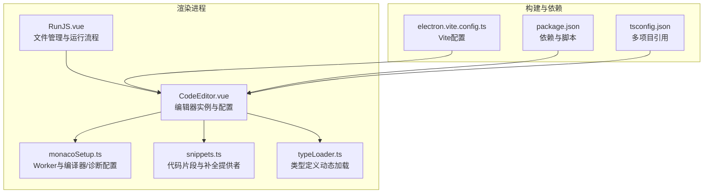
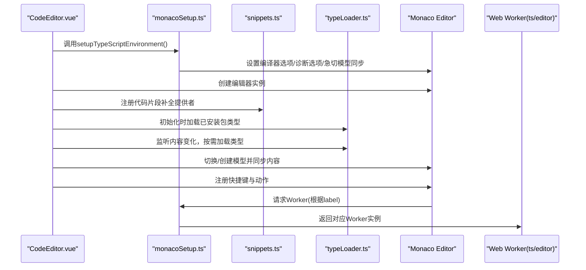
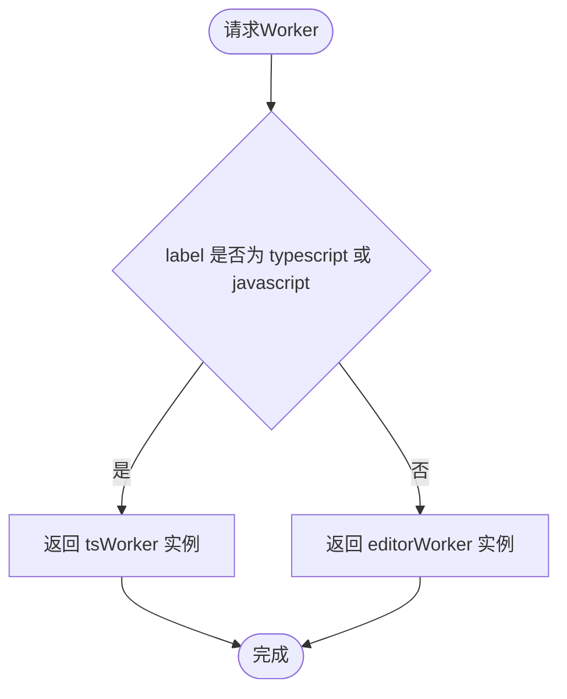
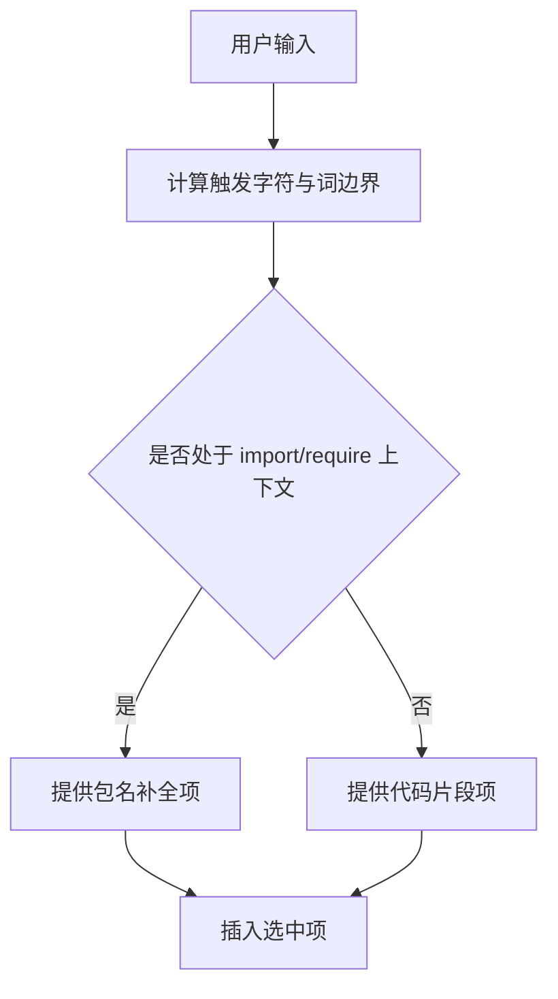
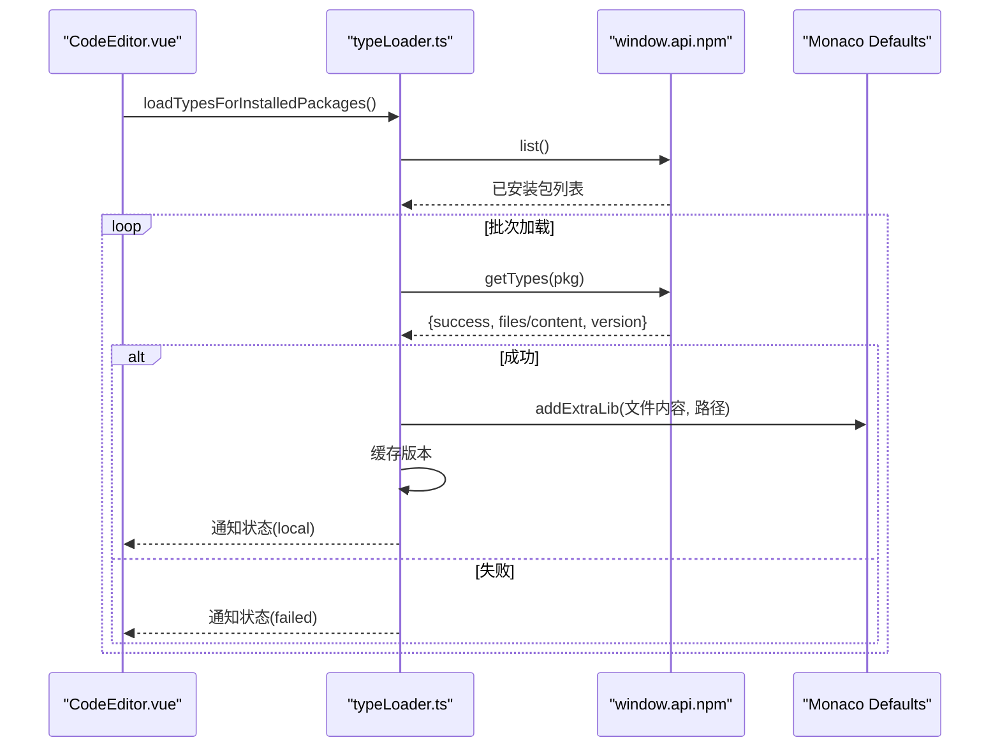
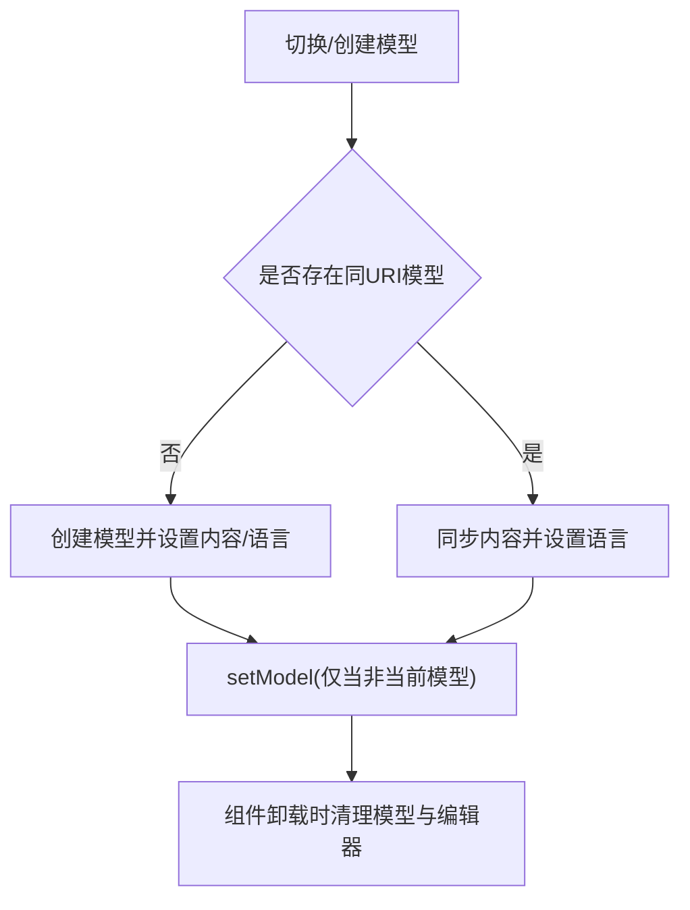
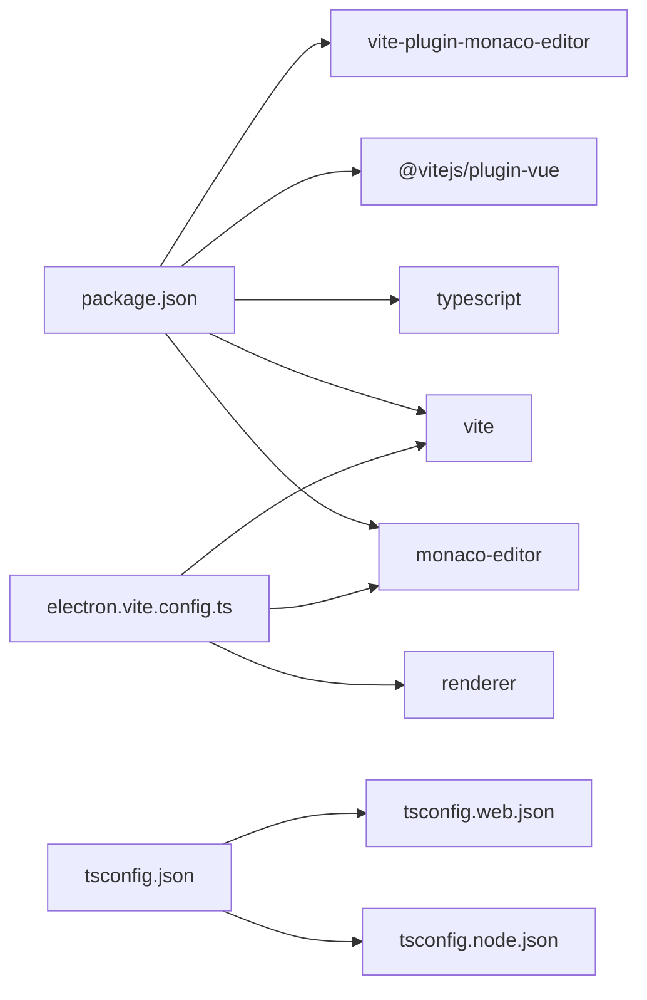

# Monaco编辑器配置

<cite>
**本文引用的文件**
- [monacoSetup.ts](file://src/renderer/src/utils/monacoSetup.ts)
- [snippets.ts](file://src/renderer/src/utils/snippets.ts)
- [typeLoader.ts](file://src/renderer/src/utils/typeLoader.ts)
- [CodeEditor.vue](file://src/renderer/src/views/runjs/components/CodeEditor.vue)
- [RunJS.vue](file://src/renderer/src/views/runjs/RunJS.vue)
- [package.json](file://package.json)
- [tsconfig.json](file://tsconfig.json)
- [electron.vite.config.ts](file://electron.vite.config.ts)
</cite>

## 目录
1. [简介](#简介)
2. [项目结构](#项目结构)
3. [核心组件](#核心组件)
4. [架构总览](#架构总览)
5. [详细组件分析](#详细组件分析)
6. [依赖关系分析](#依赖关系分析)
7. [性能考虑](#性能考虑)
8. [故障排查指南](#故障排查指南)
9. [结论](#结论)
10. [附录](#附录)

## 简介
本文件面向Monaco编辑器在本项目中的配置与使用，重点覆盖以下方面：
- Web Worker配置机制：如何为TypeScript/JavaScript语言服务分配独立Worker，避免主线程阻塞
- 编译器选项：模块解析、严格模式、lib配置等对智能感知与诊断的影响
- 诊断选项：语法校验、语义校验、建议诊断的开关与影响
- 代码片段管理：snippets.ts中的模板定义与补全提供者的注册方式
- 类型加载器：动态加载NPM包的类型定义，支持本地node_modules优先策略
- 性能优化：模型同步、内存管理、并发加载与防抖策略
- 实际配置示例与常见问题解决方案

## 项目结构
本项目采用Electron + Vue渲染层 + Vite构建的架构，Monaco编辑器位于渲染进程内，通过Vite插件与打包配置进行集成。编辑器相关能力集中在renderer子目录的utils与views/runjs组件中。

图表来源
- [CodeEditor.vue:1-556](file://src/renderer/src/views/runjs/components/CodeEditor.vue#L1-L556)
- [monacoSetup.ts:1-76](file://src/renderer/src/utils/monacoSetup.ts#L1-L76)
- [snippets.ts:1-169](file://src/renderer/src/utils/snippets.ts#L1-L169)
- [typeLoader.ts:1-206](file://src/renderer/src/utils/typeLoader.ts#L1-L206)
- [RunJS.vue:1-200](file://src/renderer/src/views/runjs/RunJS.vue#L1-L200)
- [electron.vite.config.ts:1-49](file://electron.vite.config.ts#L1-L49)
- [package.json:1-120](file://package.json#L1-L120)
- [tsconfig.json:1-8](file://tsconfig.json#L1-L8)

章节来源
- [CodeEditor.vue:1-556](file://src/renderer/src/views/runjs/components/CodeEditor.vue#L1-L556)
- [monacoSetup.ts:1-76](file://src/renderer/src/utils/monacoSetup.ts#L1-L76)
- [snippets.ts:1-169](file://src/renderer/src/utils/snippets.ts#L1-L169)
- [typeLoader.ts:1-206](file://src/renderer/src/utils/typeLoader.ts#L1-L206)
- [RunJS.vue:1-200](file://src/renderer/src/views/runjs/RunJS.vue#L1-L200)
- [electron.vite.config.ts:1-49](file://electron.vite.config.ts#L1-L49)
- [package.json:1-120](file://package.json#L1-L120)
- [tsconfig.json:1-8](file://tsconfig.json#L1-L8)

## 核心组件
- Web Worker与环境配置：通过自定义MonacoEnvironment.getWorker，将typescript/javascript请求路由到tsWorker，其余场景使用editorWorker，确保语言服务在独立线程运行。
- 编译器与诊断配置：统一设置TypeScript/JavaScript默认编译选项与诊断开关，并启用“急切模型同步”，提升实时性。
- 代码片段与补全：集中定义通用与TS专用片段，按语言注册补全提供者；在import/require上下文中提供包名补全。
- 类型加载器：优先从本地node_modules加载类型定义，支持批量并发加载、缓存与事件通知；可按代码分析提取依赖包并按需加载。
- 编辑器生命周期与模型管理：在组件挂载时初始化主题、环境与补全；监听内容变化与文件切换，进行模型同步与清理；提供快捷键与状态提示。

章节来源
- [monacoSetup.ts:1-76](file://src/renderer/src/utils/monacoSetup.ts#L1-L76)
- [snippets.ts:1-169](file://src/renderer/src/utils/snippets.ts#L1-L169)
- [typeLoader.ts:1-206](file://src/renderer/src/utils/typeLoader.ts#L1-L206)
- [CodeEditor.vue:1-556](file://src/renderer/src/views/runjs/components/CodeEditor.vue#L1-L556)

## 架构总览
下图展示了编辑器从初始化到运行的关键交互流程，包括Worker选择、编译器配置、类型加载与模型同步。

图表来源
- [CodeEditor.vue:58-192](file://src/renderer/src/views/runjs/components/CodeEditor.vue#L58-L192)
- [monacoSetup.ts:11-18](file://src/renderer/src/utils/monacoSetup.ts#L11-L18)
- [snippets.ts:72-168](file://src/renderer/src/utils/snippets.ts#L72-L168)
- [typeLoader.ts:122-139](file://src/renderer/src/utils/typeLoader.ts#L122-L139)

## 详细组件分析

### Web Worker配置机制
- Worker选择策略：通过MonacoEnvironment.getWorker根据label返回不同Worker实例，typescript/javascript走tsWorker，其他场景走editorWorker。
- Worker导入方式：使用Vite的?worker查询参数导入，确保打包时正确拆分与注入。
- 优势：将语言服务（语法、语义、诊断、自动补全）移至Web Worker，避免阻塞UI线程，提升响应性。

图表来源
- [monacoSetup.ts:11-18](file://src/renderer/src/utils/monacoSetup.ts#L11-L18)

章节来源
- [monacoSetup.ts:1-76](file://src/renderer/src/utils/monacoSetup.ts#L1-L76)

### TypeScript与JavaScript编译器选项
- 目标与模块：ESNext，模块系统NodeJs，便于现代语法与Node生态兼容。
- JS支持：允许JS文件、检查JS、允许非TS扩展，结合lib配置提供DOM/DOM迭代API支持。
- 严格性：strict设为false，skipLibCheck减少第三方库的类型检查开销；isolatedModules开启，适配增量编译与IDE体验。
- lib配置：包含esnext、dom、dom.iterable，确保丰富的内置API可用。
- 急切模型同步：启用后，编辑器会更积极地同步模型，提升实时性与交互流畅度。

章节来源
- [monacoSetup.ts:20-73](file://src/renderer/src/utils/monacoSetup.ts#L20-L73)

### 诊断选项与错误提示机制
- 诊断开关：noSemanticValidation、noSyntaxValidation、noSuggestionDiagnostics均设为false，表示启用语法、语义与建议诊断。
- 影响：开启后，编辑器会在语法错误、类型错误、建议提示等方面提供更全面的反馈，有助于开发效率。

章节来源
- [monacoSetup.ts:40-45](file://src/renderer/src/utils/monacoSetup.ts#L40-L45)

### 代码片段管理系统
- 片段定义：commonSnippets提供通用JavaScript片段，tsSnippets提供TypeScript专用片段。
- 补全提供者：分别为javascript与typescript注册CompletionItemProvider，支持触发字符与范围计算。
- 上下文识别：在import/require语句中提供包名补全；否则提供代码片段。
- 插入规则：使用InsertAsSnippet规则，支持占位符与Tab切换。

图表来源
- [snippets.ts:72-168](file://src/renderer/src/utils/snippets.ts#L72-L168)

章节来源
- [snippets.ts:1-169](file://src/renderer/src/utils/snippets.ts#L1-L169)

### 类型加载器工作原理
- 优先级：优先从本地node_modules加载类型定义；若失败则忽略（不回退CDN），避免网络依赖。
- 缓存：使用Map记录已加载包及其版本，避免重复加载。
- 事件系统：提供onTypeLoadStatusChange订阅，通知加载状态（loading/local/cached/failed）。
- 批量加载：支持并行加载已安装包类型，限制并发批次大小；支持按代码分析提取依赖包并按需加载。
- 路径规范化：将相对路径标准化为file:///node_modules/<pkg><path>形式，分别注入TypeScript与JavaScript默认库。

图表来源
- [typeLoader.ts:122-139](file://src/renderer/src/utils/typeLoader.ts#L122-L139)
- [typeLoader.ts:68-103](file://src/renderer/src/utils/typeLoader.ts#L68-L103)
- [typeLoader.ts:45-62](file://src/renderer/src/utils/typeLoader.ts#L45-L62)

章节来源
- [typeLoader.ts:1-206](file://src/renderer/src/utils/typeLoader.ts#L1-L206)

### 模型同步与内存管理
- 模型创建与切换：根据文件ID与语言生成URI，若不存在则创建新模型；存在则同步内容并确保语言正确。
- 语言切换：当扩展名与语言不一致时重建模型，保证TypeScript智能提示正常工作。
- 内存清理：组件卸载时释放编辑器实例与所有file:///workspace开头的模型，防止内存泄漏。
- 文件关闭清理：监听files变化，移除不再存在的模型。

图表来源
- [CodeEditor.vue:290-376](file://src/renderer/src/views/runjs/components/CodeEditor.vue#L290-L376)
- [CodeEditor.vue:248-257](file://src/renderer/src/views/runjs/components/CodeEditor.vue#L248-L257)

章节来源
- [CodeEditor.vue:290-376](file://src/renderer/src/views/runjs/components/CodeEditor.vue#L290-L376)
- [CodeEditor.vue:248-257](file://src/renderer/src/views/runjs/components/CodeEditor.vue#L248-L257)

### 编辑器主题与交互配置
- 主题：自定义devToolboxDark主题，调整背景、前景、行高亮、光标与行号颜色。
- 编辑器选项：字体、行高、滚动、最小化预览、自动布局、缩进、自动补全、悬停提示、参数提示、代码片段建议等。
- 快捷键：Ctrl/Cmd+Enter运行、Ctrl/Cmd+S保存、Ctrl/Cmd+D复制当前行。
- 状态提示：类型加载状态Toast展示，支持不同状态的显示时长与颜色。

章节来源
- [CodeEditor.vue:58-192](file://src/renderer/src/views/runjs/components/CodeEditor.vue#L58-L192)
- [CodeEditor.vue:262-282](file://src/renderer/src/views/runjs/components/CodeEditor.vue#L262-L282)

## 依赖关系分析
- 依赖版本：Monaco编辑器与TypeScript版本在package.json中明确；Vite插件用于Monaco编辑器资源处理。
- 构建配置：electron-vite配置了主进程、预加载与渲染进程的别名与插件；渲染进程使用Vue与TailwindCSS。
- 多项目引用：tsconfig.json通过references组织node/web两个子配置，确保类型检查分离。

图表来源
- [package.json:28-73](file://package.json#L28-L73)
- [electron.vite.config.ts:1-49](file://electron.vite.config.ts#L1-L49)
- [tsconfig.json:1-8](file://tsconfig.json#L1-L8)

章节来源
- [package.json:1-120](file://package.json#L1-L120)
- [electron.vite.config.ts:1-49](file://electron.vite.config.ts#L1-L49)
- [tsconfig.json:1-8](file://tsconfig.json#L1-L8)

## 性能考虑
- Worker隔离：将语言服务放入独立Worker，避免主线程阻塞，提高交互响应。
- 急切模型同步：提升编辑器实时性，但可能增加Worker负载；可根据场景权衡。
- 并发与批处理：类型加载采用批次并发，避免过多并发导致资源争用；内容变化采用防抖（500ms）减少频繁加载。
- 内存管理：组件卸载时主动释放编辑器与模型；关闭文件时清理不再使用的模型，降低内存占用。
- 本地优先策略：优先从本地node_modules加载类型，减少网络I/O与等待时间。
- 字体与渲染：启用字体连字与平滑滚动，提升阅读体验；禁用minimap减少渲染开销。

章节来源
- [monacoSetup.ts:71-73](file://src/renderer/src/utils/monacoSetup.ts#L71-L73)
- [typeLoader.ts:128-133](file://src/renderer/src/utils/typeLoader.ts#L128-L133)
- [CodeEditor.vue:176-186](file://src/renderer/src/views/runjs/components/CodeEditor.vue#L176-L186)
- [CodeEditor.vue:248-257](file://src/renderer/src/views/runjs/components/CodeEditor.vue#L248-L257)

## 故障排查指南
- Worker无法加载或报错
  - 检查MonacoEnvironment.getWorker返回逻辑是否正确，确保typescript/javascript走tsWorker。
  - 确认Vite构建未将Worker打包为普通模块，保持?worker查询参数。
  - 参考路径：[monacoSetup.ts:11-18](file://src/renderer/src/utils/monacoSetup.ts#L11-L18)
- 类型定义未生效
  - 确认本地node_modules中存在对应包的类型定义；类型加载器会优先尝试本地加载。
  - 观察类型加载状态事件，确认是否标记为failed或cached。
  - 参考路径：[typeLoader.ts:68-103](file://src/renderer/src/utils/typeLoader.ts#L68-L103)
- 代码片段不出现
  - 检查补全提供者是否注册成功，触发字符与上下文识别逻辑是否符合预期。
  - 确认编辑器已启用quickSuggestions与snippetSuggestions。
  - 参考路径：[snippets.ts:72-168](file://src/renderer/src/utils/snippets.ts#L72-L168)
- 模型切换异常或内存泄漏
  - 确保切换时正确同步内容与语言；组件卸载时释放编辑器与模型。
  - 参考路径：[CodeEditor.vue:290-376](file://src/renderer/src/views/runjs/components/CodeEditor.vue#L290-L376)
- 诊断信息缺失
  - 确认诊断选项未被全局禁用；检查noSemanticValidation/noSyntaxValidation/noSuggestionDiagnostics。
  - 参考路径：[monacoSetup.ts:40-45](file://src/renderer/src/utils/monacoSetup.ts#L40-L45)

章节来源
- [monacoSetup.ts:11-18](file://src/renderer/src/utils/monacoSetup.ts#L11-L18)
- [typeLoader.ts:68-103](file://src/renderer/src/utils/typeLoader.ts#L68-L103)
- [snippets.ts:72-168](file://src/renderer/src/utils/snippets.ts#L72-L168)
- [CodeEditor.vue:290-376](file://src/renderer/src/views/runjs/components/CodeEditor.vue#L290-L376)

## 结论
本项目对Monaco编辑器进行了系统化的配置与封装，实现了：
- 明确的Worker分离策略，保障语言服务性能
- 合理的编译器与诊断选项，兼顾开发体验与性能
- 完整的代码片段体系与按上下文的智能补全
- 健壮的类型加载器，支持本地优先与事件驱动的状态反馈
- 完善的模型生命周期管理与内存清理策略

这些设计使得编辑器在本应用中具备良好的实时性、可维护性与扩展性。

## 附录
- 实际配置示例（路径）
  - Worker与编译器/诊断配置：[monacoSetup.ts:11-73](file://src/renderer/src/utils/monacoSetup.ts#L11-L73)
  - 代码片段定义与提供者注册：[snippets.ts:8-168](file://src/renderer/src/utils/snippets.ts#L8-L168)
  - 类型加载器与事件订阅：[typeLoader.ts:24-139](file://src/renderer/src/utils/typeLoader.ts#L24-L139)
  - 编辑器初始化与模型同步：[CodeEditor.vue:58-376](file://src/renderer/src/views/runjs/components/CodeEditor.vue#L58-L376)
- 常见问题速查
  - Worker加载失败：检查MonacoEnvironment与Vite配置
  - 类型未生效：确认本地类型存在与加载事件状态
  - 片段不出现：检查触发字符与上下文识别
  - 内存泄漏：确保卸载时释放编辑器与模型