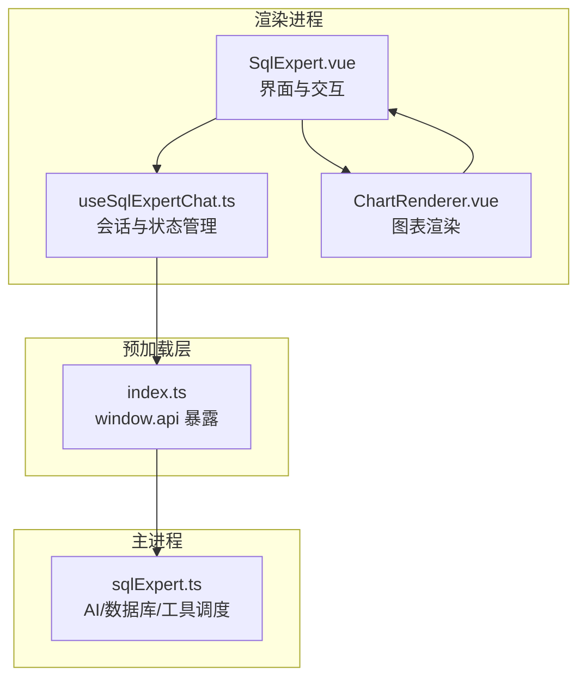
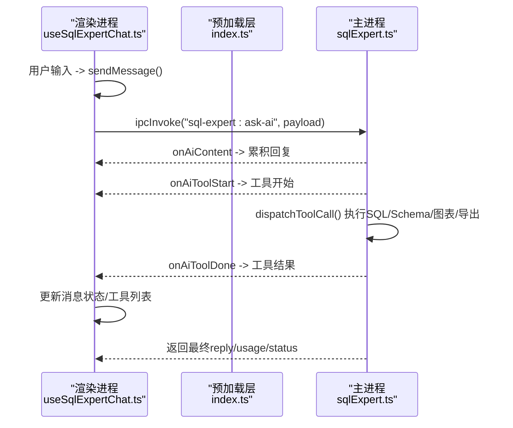
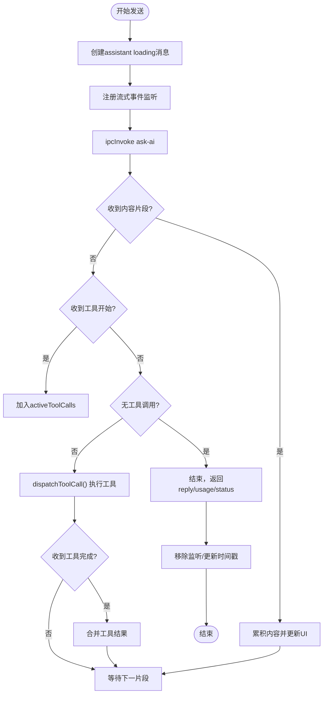
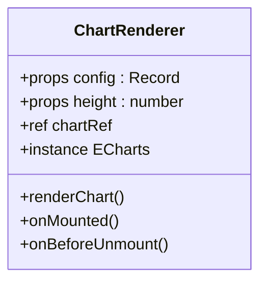
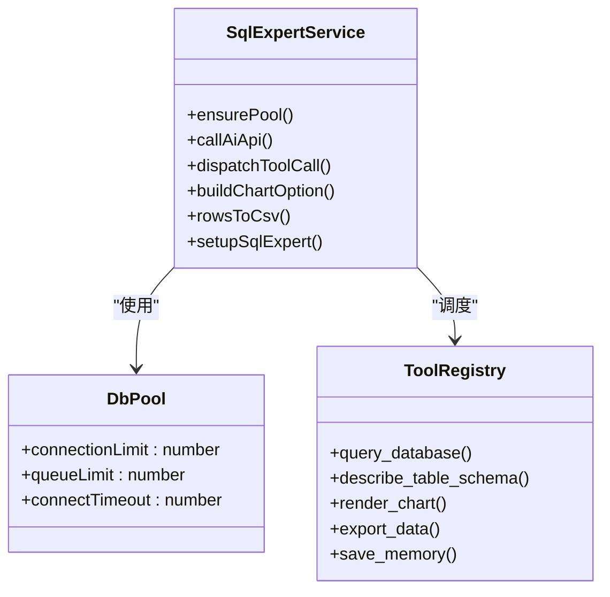
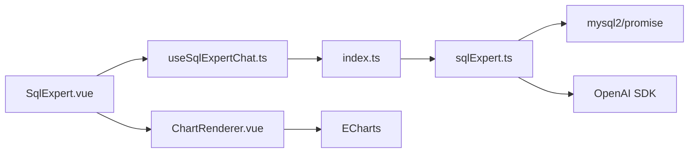

# SQL专家聊天系统

<cite>
**本文引用的文件**
- [useSqlExpertChat.ts](file://src/renderer/src/views/sqlexpert/useSqlExpertChat.ts)
- [ChartRenderer.vue](file://src/renderer/src/views/sqlexpert/ChartRenderer.vue)
- [SqlExpert.vue](file://src/renderer/src/views/sqlexpert/SqlExpert.vue)
- [sqlExpert.ts](file://src/main/services/sqlExpert.ts)
- [index.ts](file://src/preload/index.ts)
- [types.d.ts](file://src/renderer/src/types.d.ts)
</cite>

## 目录
1. [简介](#简介)
2. [项目结构](#项目结构)
3. [核心组件](#核心组件)
4. [架构总览](#架构总览)
5. [详细组件分析](#详细组件分析)
6. [依赖关系分析](#依赖关系分析)
7. [性能考量](#性能考量)
8. [故障排查指南](#故障排查指南)
9. [结论](#结论)
10. [附录](#附录)

## 简介
SQL专家聊天系统是一个基于Electron + Vue的桌面应用，提供“自然语言对话 + 工具编排”的企业级数据分析能力。系统通过主进程的AI服务与数据库连接池协作，实现：
- 对话式SQL查询与分析
- Schema驱动的工具调用（查询、表结构、图表、导出、记忆）
- 流式响应渲染与实时工具反馈
- 本地记忆与会话持久化

## 项目结构
系统采用“渲染进程 + 主进程 + 预加载桥接”的三层架构：
- 渲染进程：Vue组件负责UI与用户交互，使用自定义composable管理会话与状态
- 预加载层：通过contextBridge暴露安全的window.api，封装IPC通道
- 主进程：核心服务（sqlExpert.ts）负责数据库连接、AI调用、工具调度、文件IO与内存管理

**图表来源**
- [SqlExpert.vue:1-120](file://src/renderer/src/views/sqlexpert/SqlExpert.vue#L1-L120)
- [useSqlExpertChat.ts:165-507](file://src/renderer/src/views/sqlexpert/useSqlExpertChat.ts#L165-L507)
- [ChartRenderer.vue:1-66](file://src/renderer/src/views/sqlexpert/ChartRenderer.vue#L1-L66)
- [index.ts:156-212](file://src/preload/index.ts#L156-L212)
- [sqlExpert.ts:968-1501](file://src/main/services/sqlExpert.ts#L968-L1501)

**章节来源**
- [SqlExpert.vue:1-120](file://src/renderer/src/views/sqlexpert/SqlExpert.vue#L1-L120)
- [useSqlExpertChat.ts:165-507](file://src/renderer/src/views/sqlexpert/useSqlExpertChat.ts#L165-L507)
- [ChartRenderer.vue:1-66](file://src/renderer/src/views/sqlexpert/ChartRenderer.vue#L1-L66)
- [index.ts:156-212](file://src/preload/index.ts#L156-L212)
- [sqlExpert.ts:968-1501](file://src/main/services/sqlExpert.ts#L968-L1501)

## 核心组件
- useSqlExpertChat.ts：会话管理、消息队列、流式事件监听、工具调用协调、会话持久化
- ChartRenderer.vue：基于ECharts的轻量图表渲染组件，支持响应式尺寸与深度监听
- sqlExpert.ts：主进程服务，负责数据库连接池、AI流式调用、工具调度、Schema与记忆管理、IPC注册
- index.ts：预加载脚本，暴露window.api.sqlExpert及其流式事件监听器
- SqlExpert.vue：主界面，整合Markdown渲染、消息分段、工具展开/折叠、图表渲染与导出文件展示

**章节来源**
- [useSqlExpertChat.ts:165-507](file://src/renderer/src/views/sqlexpert/useSqlExpertChat.ts#L165-L507)
- [ChartRenderer.vue:1-66](file://src/renderer/src/views/sqlexpert/ChartRenderer.vue#L1-L66)
- [sqlExpert.ts:968-1501](file://src/main/services/sqlExpert.ts#L968-L1501)
- [index.ts:156-212](file://src/preload/index.ts#L156-L212)
- [SqlExpert.vue:434-517](file://src/renderer/src/views/sqlexpert/SqlExpert.vue#L434-L517)

## 架构总览
系统通过window.api.sqlExpert与主进程建立双向通信，主进程以“系统提示词 + 用户消息 + 工具调用”三段式推进，渲染进程实时接收流式事件并更新UI。

**图表来源**
- [useSqlExpertChat.ts:282-420](file://src/renderer/src/views/sqlexpert/useSqlExpertChat.ts#L282-L420)
- [index.ts:197-211](file://src/preload/index.ts#L197-L211)
- [sqlExpert.ts:1280-1501](file://src/main/services/sqlExpert.ts#L1280-L1501)

**章节来源**
- [useSqlExpertChat.ts:282-420](file://src/renderer/src/views/sqlexpert/useSqlExpertChat.ts#L282-L420)
- [index.ts:197-211](file://src/preload/index.ts#L197-L211)
- [sqlExpert.ts:1280-1501](file://src/main/services/sqlExpert.ts#L1280-L1501)

## 详细组件分析

### useSqlExpertChat.ts：AI对话与会话管理
- 会话与消息模型：ChatSession、ChatMessage、ToolCallItem，支持状态机（done/loading/error/stopped）
- 会话持久化：localStorage键值存储，发送前清理大数据字段避免体积膨胀
- 流式事件监听：注册onAiContent/onAiToolStart/onAiToolDone，实时更新assistant消息
- 工具调用协调：维护activeToolCalls，合并工具结果，支持停止请求
- Schema与记忆：初始化加载、刷新记忆、记忆文件按数据库+API Key作用域隔离
- 令牌用量：接收usage并计算费用估算

**图表来源**
- [useSqlExpertChat.ts:282-420](file://src/renderer/src/views/sqlexpert/useSqlExpertChat.ts#L282-L420)
- [sqlExpert.ts:1280-1501](file://src/main/services/sqlExpert.ts#L1280-L1501)

**章节来源**
- [useSqlExpertChat.ts:165-507](file://src/renderer/src/views/sqlexpert/useSqlExpertChat.ts#L165-L507)

### ChartRenderer.vue：图表渲染组件
- 单一职责：接收config对象，初始化ECharts实例，设置选项并监听容器尺寸变化
- 生命周期：mounted时初始化，watch深度监听config变化，beforeUnmount释放资源
- 交互：支持ResizeObserver自动resize，适合嵌入消息体中随内容滚动

**图表来源**
- [ChartRenderer.vue:1-66](file://src/renderer/src/views/sqlexpert/ChartRenderer.vue#L1-L66)

**章节来源**
- [ChartRenderer.vue:1-66](file://src/renderer/src/views/sqlexpert/ChartRenderer.vue#L1-L66)

### 主进程服务：sqlExpert.ts
- 数据库连接池：单例连接池，超时与限制配置，支持动态重建
- AI流式调用：OpenAI SDK流式接口，逐片累积内容，同时收集usage
- 工具调度：query_database/describe_table_schema/render_chart/export_data/save_memory
- Schema与记忆：本地文件缓存，按数据库+API Key作用域隔离，支持增删改查
- IPC注册：统一暴露sql-expert:*方法，含余额查询、表结构加载、SQL执行、工具调用等

**图表来源**
- [sqlExpert.ts:402-435](file://src/main/services/sqlExpert.ts#L402-L435)
- [sqlExpert.ts:676-739](file://src/main/services/sqlExpert.ts#L676-L739)
- [sqlExpert.ts:836-951](file://src/main/services/sqlExpert.ts#L836-L951)
- [sqlExpert.ts:968-1501](file://src/main/services/sqlExpert.ts#L968-L1501)

**章节来源**
- [sqlExpert.ts:402-435](file://src/main/services/sqlExpert.ts#L402-L435)
- [sqlExpert.ts:676-739](file://src/main/services/sqlExpert.ts#L676-L739)
- [sqlExpert.ts:836-951](file://src/main/services/sqlExpert.ts#L836-L951)
- [sqlExpert.ts:968-1501](file://src/main/services/sqlExpert.ts#L968-L1501)

### 预加载桥接：index.ts
- 暴露window.api.sqlExpert的所有方法与流式事件监听器
- 提供onAiContent/onAiToolStart/onAiToolDone/removeAiListeners等事件绑定/解绑
- 通过ipcRenderer.invoke/send与主进程通信

**章节来源**
- [index.ts:156-212](file://src/preload/index.ts#L156-L212)

### 主界面：SqlExpert.vue
- Markdown渲染：使用MarkdownIt + highlight.js，DOMPurify防注入
- 消息分段：将AI回复中的工具标记拆分为text与tool两类段落
- 工具展开/折叠：支持展开/折叠具体工具调用细节
- 图表渲染：当工具返回chartConfig时，嵌入ChartRenderer
- 会话文件：扫描export_data工具生成的CSV文件并展示

**章节来源**
- [SqlExpert.vue:434-517](file://src/renderer/src/views/sqlexpert/SqlExpert.vue#L434-L517)
- [SqlExpert.vue:444-491](file://src/renderer/src/views/sqlexpert/SqlExpert.vue#L444-L491)
- [SqlExpert.vue:144-148](file://src/renderer/src/views/sqlexpert/SqlExpert.vue#L144-L148)

## 依赖关系分析
- 渲染进程依赖预加载层提供的window.api，避免直接操作IPC
- 预加载层依赖Electron的ipcRenderer与contextBridge
- 主进程依赖mysql2/promise、OpenAI SDK、本地文件系统
- 图表渲染依赖ECharts，组件化封装降低耦合

**图表来源**
- [useSqlExpertChat.ts:165-507](file://src/renderer/src/views/sqlexpert/useSqlExpertChat.ts#L165-L507)
- [index.ts:156-212](file://src/preload/index.ts#L156-L212)
- [sqlExpert.ts:968-1501](file://src/main/services/sqlExpert.ts#L968-L1501)
- [SqlExpert.vue:434-517](file://src/renderer/src/views/sqlexpert/SqlExpert.vue#L434-L517)
- [ChartRenderer.vue:1-66](file://src/renderer/src/views/sqlexpert/ChartRenderer.vue#L1-L66)

**章节来源**
- [useSqlExpertChat.ts:165-507](file://src/renderer/src/views/sqlexpert/useSqlExpertChat.ts#L165-L507)
- [index.ts:156-212](file://src/preload/index.ts#L156-L212)
- [sqlExpert.ts:968-1501](file://src/main/services/sqlExpert.ts#L968-L1501)
- [SqlExpert.vue:434-517](file://src/renderer/src/views/sqlexpert/SqlExpert.vue#L434-L517)
- [ChartRenderer.vue:1-66](file://src/renderer/src/views/sqlexpert/ChartRenderer.vue#L1-L66)

## 性能考量
- 数据库连接池：限制并发与队列，避免阻塞；连接超时控制
- 工具结果截断：默认仅返回前10行，避免大结果集传输
- 会话持久化：发送前清理toolCalls.result.rows，减少localStorage体积
- 流式渲染：边收边渲染，降低首屏等待
- 图表渲染：仅在config变化时setOption，避免重复初始化
- 令牌用量：记录prompt/cache/complete tokens，便于成本估算

[本节为通用指导，无需特定文件引用]

## 故障排查指南
- 数据库连接失败：检查host/port/user/password/database；使用testDb验证
- AI余额查询失败：确认API Key与URL正确；检查网络代理
- 工具调用异常：查看工具返回的errorMessage；核对SQL合法性与表名存在性
- 停止生成无效：确保requestId匹配；确认AbortController未被提前释放
- 图表不显示：确认chartConfig结构正确；检查容器高度与ResizeObserver

**章节来源**
- [sqlExpert.ts:970-991](file://src/main/services/sqlExpert.ts#L970-L991)
- [sqlExpert.ts:1005-1057](file://src/main/services/sqlExpert.ts#L1005-L1057)
- [sqlExpert.ts:1268-1278](file://src/main/services/sqlExpert.ts#L1268-L1278)
- [ChartRenderer.vue:33-57](file://src/renderer/src/views/sqlexpert/ChartRenderer.vue#L33-L57)

## 结论
SQL专家聊天系统通过清晰的三层架构与严格的工具约束，实现了“自然语言 + 数据库 + 可视化”的一体化体验。其流式渲染与工具编排机制提升了交互效率，而Schema与记忆机制则保障了查询的准确性与可复用性。建议在生产环境中结合监控与日志，持续优化SQL执行与图表渲染性能。

[本节为总结，无需特定文件引用]

## 附录

### API接口说明（window.api.sqlExpert）
- askAi(payload)：发起AI对话，返回reply、toolCalls、usage、status
- cancelAskAi(payload)：取消当前请求
- executeSql(sql)：执行只读SQL，返回rows与统计
- loadSchema(dbConfig?)：加载数据库表结构
- loadMemories(payload?)：加载本地记忆
- updateMemory/deleteMemory/addMemory：记忆增删改查
- describeTable(tableNames)：查询表字段结构
- checkBalance(config?)：查询AI余额
- 流式事件：onAiContent/onAiToolStart/onAiToolDone/removeAiListeners

**章节来源**
- [index.ts:156-212](file://src/preload/index.ts#L156-L212)
- [types.d.ts:172-274](file://src/renderer/src/types.d.ts#L172-L274)

### 实际使用示例与最佳实践
- 复杂查询场景
  - 先describe_table_schema获取字段清单，再构造精确的SELECT语句
  - 使用render_chart生成可视化图表，结合export_data导出完整数据
- 性能优化技巧
  - 显式为输出列使用AS别名，避免SELECT *
  - 缩小查询范围与时间窗口，减少结果集大小
  - 合理使用记忆沉淀常见口径，减少重复询问

[本节为通用指导，无需特定文件引用]