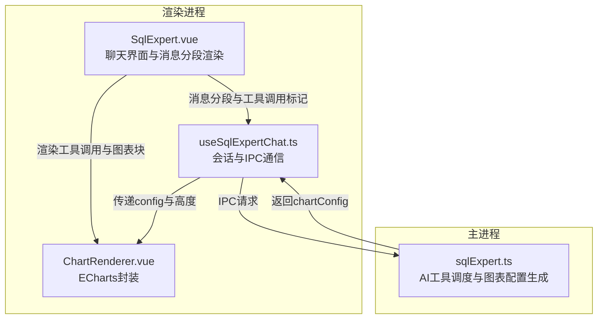
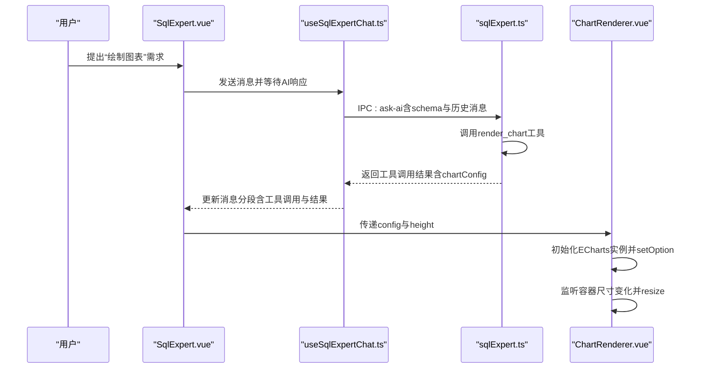
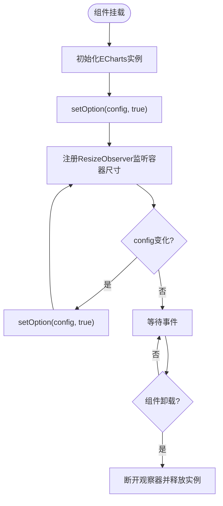
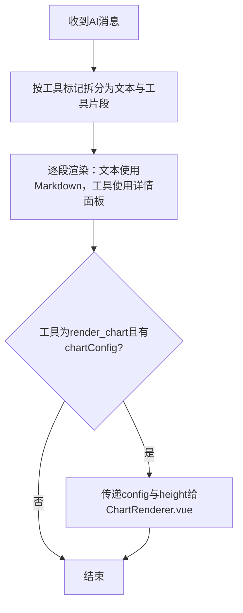
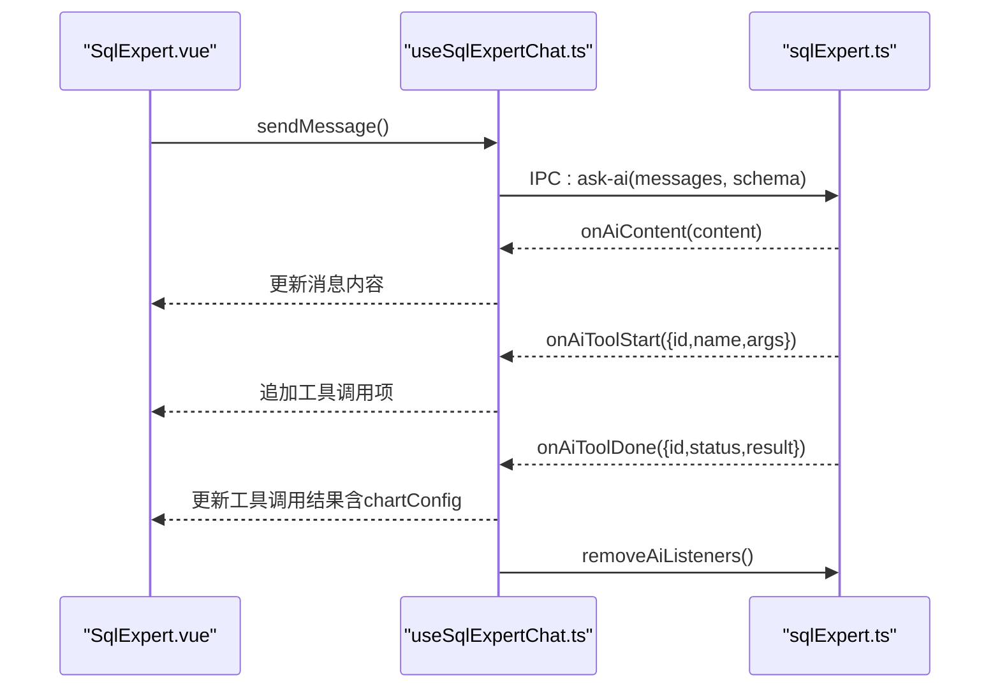
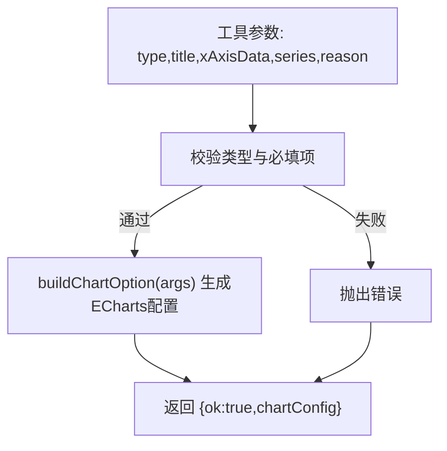
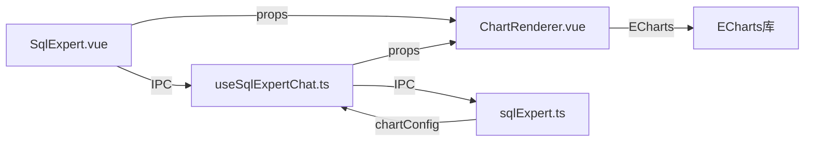

# 图表渲染组件

<cite>
**本文引用的文件**
- [ChartRenderer.vue](file://src/renderer/src/views/sqlexpert/ChartRenderer.vue)
- [SqlExpert.vue](file://src/renderer/src/views/sqlexpert/SqlExpert.vue)
- [useSqlExpertChat.ts](file://src/renderer/src/views/sqlexpert/useSqlExpertChat.ts)
- [sqlExpert.ts](file://src/main/services/sqlExpert.ts)
</cite>

## 目录
1. [简介](#简介)
2. [项目结构](#项目结构)
3. [核心组件](#核心组件)
4. [架构总览](#架构总览)
5. [详细组件分析](#详细组件分析)
6. [依赖关系分析](#依赖关系分析)
7. [性能考量](#性能考量)
8. [故障排查指南](#故障排查指南)
9. [结论](#结论)
10. [附录](#附录)

## 简介
本文件面向SQL专家聊天系统的图表渲染组件，聚焦ChartRenderer.vue的设计与实现，系统性阐述其与SQL查询结果的集成方式、支持的图表类型、数据可视化策略、响应式与主题适配、定制与扩展方法，以及复杂数据场景下的使用示例与性能优化建议。读者无需深厚的前端背景，也能通过本文快速掌握图表渲染组件的使用与扩展。

## 项目结构
图表渲染组件位于渲染进程的sqlexpert视图模块中，围绕ChartRenderer.vue展开，配合SqlExpert.vue的UI容器与useSqlExpertChat.ts的会话管理，形成“消息分段渲染 + 工具调用 + 图表配置传递”的闭环。

**图表来源**
- [SqlExpert.vue:144-148](file://src/renderer/src/views/sqlexpert/SqlExpert.vue#L144-L148)
- [ChartRenderer.vue:1-66](file://src/renderer/src/views/sqlexpert/ChartRenderer.vue#L1-L66)
- [useSqlExpertChat.ts:283-420](file://src/renderer/src/views/sqlexpert/useSqlExpertChat.ts#L283-L420)
- [sqlExpert.ts:898-916](file://src/main/services/sqlExpert.ts#L898-L916)

**章节来源**
- [ChartRenderer.vue:1-66](file://src/renderer/src/views/sqlexpert/ChartRenderer.vue#L1-L66)
- [SqlExpert.vue:144-148](file://src/renderer/src/views/sqlexpert/SqlExpert.vue#L144-L148)
- [useSqlExpertChat.ts:283-420](file://src/renderer/src/views/sqlexpert/useSqlExpertChat.ts#L283-L420)
- [sqlExpert.ts:898-916](file://src/main/services/sqlExpert.ts#L898-L916)

## 核心组件
- ChartRenderer.vue：轻量封装ECharts，负责接收配置、初始化实例、响应容器尺寸变化并进行重绘。
- SqlExpert.vue：聊天界面容器，负责将AI工具调用结果中的图表配置提取并传递给ChartRenderer.vue。
- useSqlExpertChat.ts：会话与IPC通信层，负责构建消息、订阅AI流式事件、组装工具调用结果。
- sqlExpert.ts（主进程）：AI工具调度器，其中render_chart工具负责校验参数并生成ECharts配置对象。

**章节来源**
- [ChartRenderer.vue:1-66](file://src/renderer/src/views/sqlexpert/ChartRenderer.vue#L1-L66)
- [SqlExpert.vue:144-148](file://src/renderer/src/views/sqlexpert/SqlExpert.vue#L144-L148)
- [useSqlExpertChat.ts:283-420](file://src/renderer/src/views/sqlexpert/useSqlExpertChat.ts#L283-L420)
- [sqlExpert.ts:898-916](file://src/main/services/sqlExpert.ts#L898-L916)

## 架构总览
图表渲染的端到端流程如下：
- 用户在聊天界面提出“绘制图表”需求；
- AI模型识别并调用render_chart工具，携带图表类型、标题、系列与横轴数据等参数；
- 主进程校验参数并生成ECharts配置对象（chartConfig）；
- 渲染进程通过IPC接收工具调用结果，提取chartConfig并传递给ChartRenderer.vue；
- ChartRenderer.vue基于配置初始化ECharts实例并在容器尺寸变化时自动重绘。

**图表来源**
- [SqlExpert.vue:144-148](file://src/renderer/src/views/sqlexpert/SqlExpert.vue#L144-L148)
- [useSqlExpertChat.ts:283-420](file://src/renderer/src/views/sqlexpert/useSqlExpertChat.ts#L283-L420)
- [sqlExpert.ts:898-916](file://src/main/services/sqlExpert.ts#L898-L916)
- [ChartRenderer.vue:23-31](file://src/renderer/src/views/sqlexpert/ChartRenderer.vue#L23-L31)

## 详细组件分析

### ChartRenderer.vue：ECharts封装与生命周期
- 接收props：
  - config：ECharts配置对象（由主进程render_chart工具生成）
  - height：图表容器高度，默认320
- 生命周期与行为：
  - mounted：初始化ECharts实例并setOption
  - watch(config)：深度监听配置变化，触发重新setOption
  - ResizeObserver：监听容器尺寸变化并调用实例resize
  - onBeforeUnmount：断开观察器并释放实例
- 样式：
  - 容器宽度100%，最小高度180px，确保在不同布局下稳定显示

**图表来源**
- [ChartRenderer.vue:23-57](file://src/renderer/src/views/sqlexpert/ChartRenderer.vue#L23-L57)

**章节来源**
- [ChartRenderer.vue:1-66](file://src/renderer/src/views/sqlexpert/ChartRenderer.vue#L1-L66)

### SqlExpert.vue：消息分段与图表块渲染
- 消息分段：
  - 使用特殊标记将文本与工具调用片段混合渲染，便于逐段展示AI回复与工具调用过程
- 图表块：
  - 当工具调用为render_chart且存在chartConfig时，渲染ChartRenderer.vue并传入config与height
- 工具调用解析：
  - 通过getChartConfig从工具调用结果中提取chartConfig
  - 支持展开/折叠工具调用详情，便于调试与理解

**图表来源**
- [SqlExpert.vue:89-159](file://src/renderer/src/views/sqlexpert/SqlExpert.vue#L89-L159)
- [SqlExpert.vue:700-703](file://src/renderer/src/views/sqlexpert/SqlExpert.vue#L700-L703)

**章节来源**
- [SqlExpert.vue:89-159](file://src/renderer/src/views/sqlexpert/SqlExpert.vue#L89-L159)
- [SqlExpert.vue:700-703](file://src/renderer/src/views/sqlexpert/SqlExpert.vue#L700-L703)

### useSqlExpertChat.ts：会话与IPC通信
- 会话管理：
  - 创建/加载/保存会话，维护消息列表与工具调用状态
- IPC事件：
  - 订阅AI内容流、工具开始与完成事件，实时更新loading消息
  - 在请求结束后移除监听，避免内存泄漏
- 工具调用结果：
  - 将工具调用结果（含chartConfig）注入消息，供SqlExpert.vue渲染

**图表来源**
- [useSqlExpertChat.ts:283-420](file://src/renderer/src/views/sqlexpert/useSqlExpertChat.ts#L283-L420)

**章节来源**
- [useSqlExpertChat.ts:283-420](file://src/renderer/src/views/sqlexpert/useSqlExpertChat.ts#L283-L420)

### 主进程sqlExpert.ts：图表配置生成与工具调度
- render_chart工具：
  - 校验图表类型（line、bar、pie、line_bar）
  - 校验series非空；非饼图需提供xAxisData
  - 生成ECharts配置对象（chartConfig），包含title、tooltip、legend、grid、xAxis、yAxis、series等
- 配置生成逻辑：
  - 饼图：series为饼图，半径、中心、标签格式等
  - 折线/柱状/组合：series为折线/柱状，平滑曲线、最大宽度、双轴支持等
- 结果汇总：
  - 工具调用结果中包含chartConfig，渲染进程据此渲染图表

**图表来源**
- [sqlExpert.ts:898-916](file://src/main/services/sqlExpert.ts#L898-L916)
- [sqlExpert.ts:746-785](file://src/main/services/sqlExpert.ts#L746-L785)

**章节来源**
- [sqlExpert.ts:898-916](file://src/main/services/sqlExpert.ts#L898-L916)
- [sqlExpert.ts:746-785](file://src/main/services/sqlExpert.ts#L746-L785)

## 依赖关系分析
- 组件耦合：
  - ChartRenderer.vue与ECharts强耦合，但通过props解耦了配置来源
  - SqlExpert.vue通过工具调用结果与ChartRenderer.vue弱耦合
  - useSqlExpertChat.ts通过IPC与主进程解耦
- 外部依赖：
  - ECharts：用于图表渲染与交互
  - Electron IPC：用于渲染进程与主进程通信
- 潜在风险：
  - 配置过大导致频繁setOption影响性能
  - ResizeObserver兼容性问题（已在代码中做能力检测）

**图表来源**
- [ChartRenderer.vue:1-66](file://src/renderer/src/views/sqlexpert/ChartRenderer.vue#L1-L66)
- [SqlExpert.vue:144-148](file://src/renderer/src/views/sqlexpert/SqlExpert.vue#L144-L148)
- [useSqlExpertChat.ts:283-420](file://src/renderer/src/views/sqlexpert/useSqlExpertChat.ts#L283-L420)
- [sqlExpert.ts:898-916](file://src/main/services/sqlExpert.ts#L898-L916)

**章节来源**
- [ChartRenderer.vue:1-66](file://src/renderer/src/views/sqlexpert/ChartRenderer.vue#L1-L66)
- [SqlExpert.vue:144-148](file://src/renderer/src/views/sqlexpert/SqlExpert.vue#L144-L148)
- [useSqlExpertChat.ts:283-420](file://src/renderer/src/views/sqlexpert/useSqlExpertChat.ts#L283-L420)
- [sqlExpert.ts:898-916](file://src/main/services/sqlExpert.ts#L898-L916)

## 性能考量
- 配置更新策略
  - 使用setOption的合并模式（第二个参数为true），避免全量重绘
  - 深度监听props.config，仅在配置变化时更新，减少无效渲染
- 尺寸自适应
  - 使用ResizeObserver监听容器尺寸变化，仅在容器变化时调用实例resize
- 大数据处理
  - 主进程render_chart工具返回chartConfig，不直接传递原始数据行，避免渲染进程负担过重
- 会话持久化
  - 会话存储时清理工具调用结果中的大字段（如rows），降低localStorage体积

**章节来源**
- [ChartRenderer.vue:23-57](file://src/renderer/src/views/sqlexpert/ChartRenderer.vue#L23-L57)
- [useSqlExpertChat.ts:104-121](file://src/renderer/src/views/sqlexpert/useSqlExpertChat.ts#L104-L121)

## 故障排查指南
- 图表不显示
  - 检查config是否为有效的ECharts配置对象
  - 确认容器高度设置合理（默认320），避免容器高度为0
- 图表不随容器变化而重绘
  - 确认浏览器支持ResizeObserver；若不支持，需降级方案
- 图表类型报错
  - 确认render_chart工具参数：type必须为line、bar、pie、line_bar之一
  - 非饼图需提供xAxisData；series必须非空
- IPC事件未生效
  - 确认useSqlExpertChat.ts在请求结束后正确移除了监听
  - 检查主进程IPC通道是否正常注册

**章节来源**
- [ChartRenderer.vue:36-41](file://src/renderer/src/views/sqlexpert/ChartRenderer.vue#L36-L41)
- [sqlExpert.ts:898-916](file://src/main/services/sqlExpert.ts#L898-L916)
- [useSqlExpertChat.ts:412-419](file://src/renderer/src/views/sqlexpert/useSqlExpertChat.ts#L412-L419)

## 结论
ChartRenderer.vue以极简封装实现了与ECharts的无缝对接，结合主进程的render_chart工具与渲染进程的消息分段渲染机制，形成了“AI生成配置 -> 主进程校验与生成 -> 渲染进程渲染”的高效闭环。通过合理的配置更新策略、尺寸自适应与IPC事件管理，组件在复杂数据场景下仍能保持良好的性能与稳定性。

## 附录

### 支持的图表类型与配置要点
- 折线图（line）
  - 必填：series（折线）、xAxisData（横轴分类）
  - 特点：series可smooth平滑曲线
- 柱状图（bar）
  - 必填：series（柱状）、xAxisData
  - 特点：series可设置barMaxWidth限制柱宽
- 饼图（pie）
  - 必填：series（饼图），无需xAxisData
  - 特点：series包含半径、中心、标签格式
- 组合图（line_bar）
  - 必填：series（折线与柱状组合）、xAxisData
  - 特点：支持双轴（yAxisIndex=1）

**章节来源**
- [sqlExpert.ts:519-536](file://src/main/services/sqlExpert.ts#L519-L536)
- [sqlExpert.ts:746-785](file://src/main/services/sqlExpert.ts#L746-L785)

### 数据可视化策略
- 数据预处理
  - 主进程render_chart工具负责参数校验与配置生成，不直接处理原始数据行
- 坐标轴配置
  - xAxis为category类型，yAxis默认单轴；当series包含yAxisIndex=1时启用双轴
- 颜色主题
  - 采用ECharts默认主题；可通过传入config覆盖主题色系
- 交互功能
  - tooltip支持axis/cross模式；legend支持底部滚动

**章节来源**
- [sqlExpert.ts:746-785](file://src/main/services/sqlExpert.ts#L746-L785)

### 响应式设计与主题适配
- 尺寸自适应
  - 容器宽度100%，最小高度180px；ResizeObserver监听容器变化并调用实例resize
- 主题切换
  - ECharts实例初始化时可传入主题；当前实现依赖默认主题
- 移动端适配
  - 建议在移动端容器上设置合适的height与grid边距，避免文字溢出

**章节来源**
- [ChartRenderer.vue:60-65](file://src/renderer/src/views/sqlexpert/ChartRenderer.vue#L60-L65)
- [ChartRenderer.vue:36-41](file://src/renderer/src/views/sqlexpert/ChartRenderer.vue#L36-L41)

### 图表定制指南
- 样式覆盖
  - 通过传入完整的ECharts配置对象（config）覆盖默认样式
- 事件绑定
  - 可在config中注册事件回调（如点击、悬停等），由ECharts实例处理
- 扩展开发
  - 若需自定义图表类型，可在主进程render_chart工具中扩展参数与配置生成逻辑

**章节来源**
- [ChartRenderer.vue:9-17](file://src/renderer/src/views/sqlexpert/ChartRenderer.vue#L9-L17)
- [sqlExpert.ts:519-536](file://src/main/services/sqlExpert.ts#L519-L536)

### 使用示例与最佳实践
- 基础折线图
  - 提供type、title、series（折线）、xAxisData
- 基础柱状图
  - 提供type、title、series（柱状）、xAxisData
- 饼图
  - 提供type、title、series（饼图），series.data为各扇区数值
- 组合图
  - 提供type、title、series（折线与柱状组合）、xAxisData；series中通过yAxisIndex区分左右轴
- 最佳实践
  - 控制series数量与数据点数量，避免过多渲染开销
  - 合理设置legend与tooltip，提升可读性
  - 在移动端适当调整grid边距与字体大小

**章节来源**
- [sqlExpert.ts:746-785](file://src/main/services/sqlExpert.ts#L746-L785)