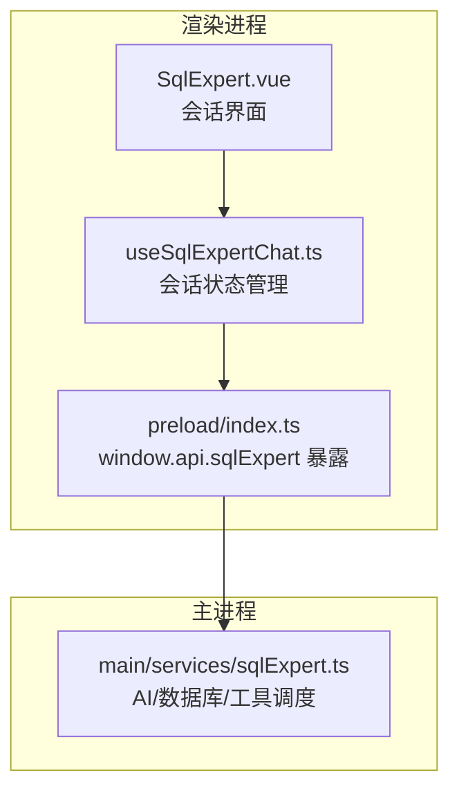
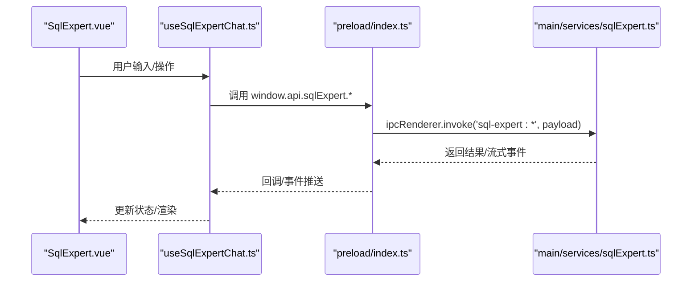
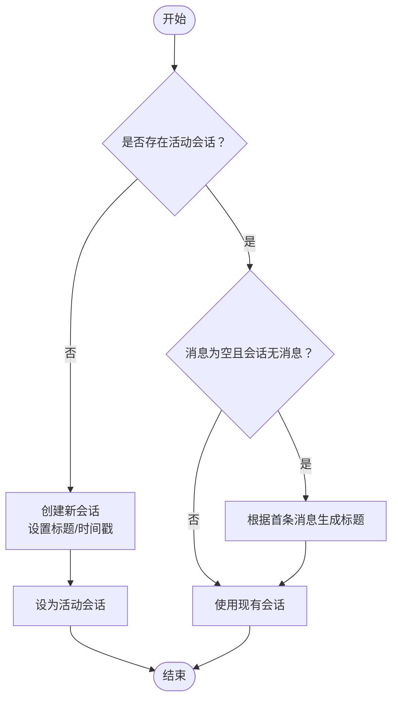
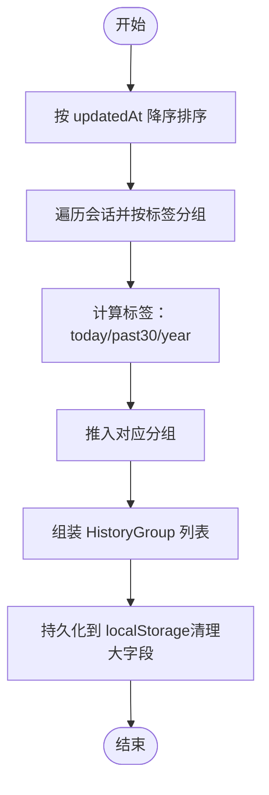
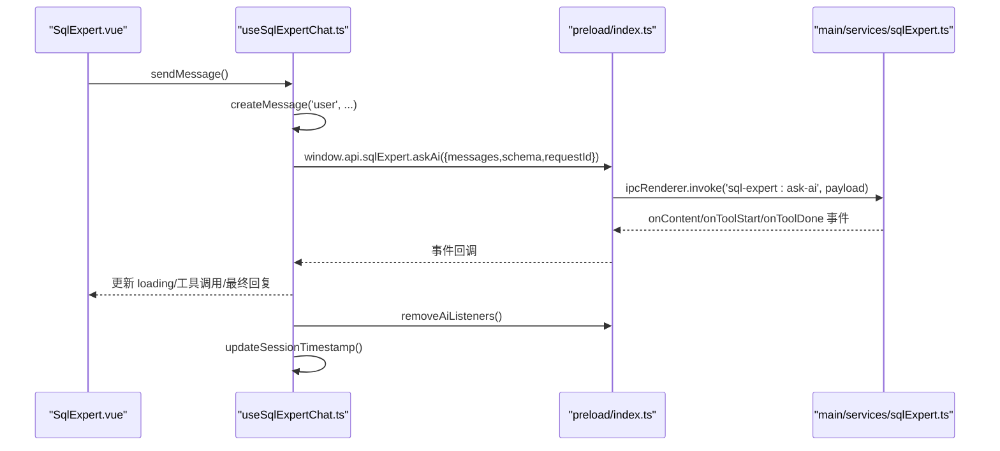
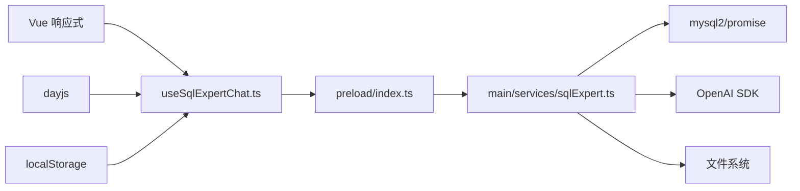

# 对话会话管理

<cite>
**本文引用的文件**
- [useSqlExpertChat.ts](file://src/renderer/src/views/sqlexpert/useSqlExpertChat.ts)
- [SqlExpert.vue](file://src/renderer/src/views/sqlexpert/SqlExpert.vue)
- [sqlExpert.ts](file://src/main/services/sqlExpert.ts)
- [index.ts](file://src/preload/index.ts)
</cite>

## 目录
1. [简介](#简介)
2. [项目结构](#项目结构)
3. [核心组件](#核心组件)
4. [架构总览](#架构总览)
5. [详细组件分析](#详细组件分析)
6. [依赖关系分析](#依赖关系分析)
7. [性能考量](#性能考量)
8. [故障排查指南](#故障排查指南)
9. [结论](#结论)
10. [附录](#附录)

## 简介
本文件面向“SQL专家聊天系统”的对话会话管理功能，围绕 useSqlExpertChat.ts 展开，系统性梳理会话状态模型、创建与销毁流程、消息队列管理、会话历史分组与本地持久化策略，以及会话切换、删除与重建的完整链路。同时给出配置项说明、使用示例与最佳实践，帮助开发者在复杂会话场景下稳定运行并优化性能。

## 项目结构
- 渲染进程侧：
  - useSqlExpertChat.ts：会话状态管理与UI交互逻辑的核心 Composable，负责会话生命周期、消息队列、历史分组、本地持久化与IPC通信封装。
  - SqlExpert.vue：会话界面，绑定 useSqlExpertChat 返回的状态与方法，驱动UI渲染与用户交互。
  - preload/index.ts：桥接 Electron IPC，向渲染进程暴露 window.api.sqlExpert 接口。
- 主进程侧：
  - main/services/sqlExpert.ts：数据库连接池、AI请求（流式）、工具调度（查询、导出、绘图、记忆）、配置与Schema/记忆持久化、IPC注册。

图表来源
- [useSqlExpertChat.ts:165-507](file://src/renderer/src/views/sqlexpert/useSqlExpertChat.ts#L165-L507)
- [SqlExpert.vue:434-517](file://src/renderer/src/views/sqlexpert/SqlExpert.vue#L434-L517)
- [index.ts:156-212](file://src/preload/index.ts#L156-L212)
- [sqlExpert.ts:968-1501](file://src/main/services/sqlExpert.ts#L968-L1501)

章节来源
- [useSqlExpertChat.ts:165-507](file://src/renderer/src/views/sqlexpert/useSqlExpertChat.ts#L165-L507)
- [SqlExpert.vue:434-517](file://src/renderer/src/views/sqlexpert/SqlExpert.vue#L434-L517)
- [index.ts:156-212](file://src/preload/index.ts#L156-L212)
- [sqlExpert.ts:968-1501](file://src/main/services/sqlExpert.ts#L968-L1501)

## 核心组件
- ChatSession 接口：会话实体，包含唯一标识、标题、消息列表、创建与更新时间戳。
- ChatMessage 接口：消息实体，支持角色、状态、工具调用、思考提示等。
- ToolCallItem 接口：工具调用项，记录工具名、参数、结果、状态与错误信息。
- 历史分组 HistoryGroup：按时间标签分组的会话列表，用于侧边栏展示。
- Composable useSqlExpertChat：集中管理会话状态、消息队列、历史分组、持久化与IPC调用。

章节来源
- [useSqlExpertChat.ts:14-51](file://src/renderer/src/views/sqlexpert/useSqlExpertChat.ts#L14-L51)

## 架构总览
渲染进程通过 window.api.sqlExpert 与主进程通信，主进程负责数据库连接、AI流式响应、工具调度与持久化。useSqlExpertChat 在渲染进程中维护会话列表、活动会话、消息队列与历史分组，并将状态持久化到 localStorage。

图表来源
- [SqlExpert.vue:495-517](file://src/renderer/src/views/sqlexpert/SqlExpert.vue#L495-L517)
- [index.ts:156-212](file://src/preload/index.ts#L156-L212)
- [sqlExpert.ts:1280-1501](file://src/main/services/sqlExpert.ts#L1280-L1501)

## 详细组件分析

### 会话状态模型与消息队列
- ChatSession：包含 id、title、messages、createdAt、updatedAt。
- ChatMessage：包含 id、role、content、thinking、showThinking、toolCalls、status、createdAt。
- ToolCallItem：包含 id、name、args、result、status、errorMessage。
- 消息过滤与序列化：在发送至主进程前，会过滤 loading/error 状态与空白内容，并将 toolCalls 的 result.rows 等大数据字段清理，避免localStorage膨胀。

章节来源
- [useSqlExpertChat.ts:14-51](file://src/renderer/src/views/sqlexpert/useSqlExpertChat.ts#L14-L51)
- [useSqlExpertChat.ts:342-360](file://src/renderer/src/views/sqlexpert/useSqlExpertChat.ts#L342-L360)
- [useSqlExpertChat.ts:104-121](file://src/renderer/src/views/sqlexpert/useSqlExpertChat.ts#L104-L121)

### 会话创建与销毁流程
- 创建：首次发送消息时若无活动会话，则创建新会话并置为活动；标题由首条消息构建。
- 销毁：删除会话时从 sessions 列表移除，并在当前活动会话被删除时尝试选择相邻会话保持焦点。
- 重建：应用启动时从 localStorage 加载会话列表并按 updatedAt 降序排列。

图表来源
- [useSqlExpertChat.ts:217-229](file://src/renderer/src/views/sqlexpert/useSqlExpertChat.ts#L217-L229)
- [useSqlExpertChat.ts:231-235](file://src/renderer/src/views/sqlexpert/useSqlExpertChat.ts#L231-L235)

章节来源
- [useSqlExpertChat.ts:217-229](file://src/renderer/src/views/sqlexpert/useSqlExpertChat.ts#L217-L229)
- [useSqlExpertChat.ts:231-235](file://src/renderer/src/views/sqlexpert/useSqlExpertChat.ts#L231-L235)
- [useSqlExpertChat.ts:460-478](file://src/renderer/src/views/sqlexpert/useSqlExpertChat.ts#L460-L478)

### 历史分组算法与本地存储
- 时间标签生成：基于 updatedAt 与当前时间差，生成“今天”、“过去30天”、“YYYY”三档标签。
- 历史排序：按 updatedAt 降序排序，确保最新会话在前。
- 本地存储：使用 localStorage，键名为固定常量；持久化前清理 toolCalls.result.rows 等大对象字段，降低体积与序列化成本。

图表来源
- [useSqlExpertChat.ts:192-204](file://src/renderer/src/views/sqlexpert/useSqlExpertChat.ts#L192-L204)
- [useSqlExpertChat.ts:95-102](file://src/renderer/src/views/sqlexpert/useSqlExpertChat.ts#L95-L102)
- [useSqlExpertChat.ts:104-121](file://src/renderer/src/views/sqlexpert/useSqlExpertChat.ts#L104-L121)
- [useSqlExpertChat.ts:123-135](file://src/renderer/src/views/sqlexpert/useSqlExpertChat.ts#L123-L135)

章节来源
- [useSqlExpertChat.ts:192-204](file://src/renderer/src/views/sqlexpert/useSqlExpertChat.ts#L192-L204)
- [useSqlExpertChat.ts:95-102](file://src/renderer/src/views/sqlexpert/useSqlExpertChat.ts#L95-L102)
- [useSqlExpertChat.ts:104-121](file://src/renderer/src/views/sqlexpert/useSqlExpertChat.ts#L104-L121)
- [useSqlExpertChat.ts:123-135](file://src/renderer/src/views/sqlexpert/useSqlExpertChat.ts#L123-L135)

### 会话切换、删除与重建
- 切换：selectChat(id) 更新 activeChatId，UI 即刻切换到对应会话的消息列表。
- 删除：deleteChat(id) 从 sessions 移除并处理活动会话切换；删除后不可恢复。
- 重建：应用启动时 loadSessions() 从 localStorage 读取并排序，初始化 sessions 与 activeChatId。

章节来源
- [useSqlExpertChat.ts:465-478](file://src/renderer/src/views/sqlexpert/useSqlExpertChat.ts#L465-L478)
- [useSqlExpertChat.ts:165-169](file://src/renderer/src/views/sqlexpert/useSqlExpertChat.ts#L165-L169)
- [useSqlExpertChat.ts:123-135](file://src/renderer/src/views/sqlexpert/useSqlExpertChat.ts#L123-L135)

### AI 对话与工具调用流式处理
- 发送消息：sendMessage() 创建用户消息，调用 runAssistantReply()。
- 流式进度：主进程通过 ipcRenderer.on('sql-expert:ai-content') 推送增量内容；工具调用通过 onAiToolStart/onAiToolDone 事件推进。
- 结束与清理：AI 完成或停止后，清理事件监听器，更新 usage 与会话时间戳。

图表来源
- [useSqlExpertChat.ts:283-420](file://src/renderer/src/views/sqlexpert/useSqlExpertChat.ts#L283-L420)
- [index.ts:197-212](file://src/preload/index.ts#L197-L212)
- [sqlExpert.ts:1280-1501](file://src/main/services/sqlExpert.ts#L1280-L1501)

章节来源
- [useSqlExpertChat.ts:283-420](file://src/renderer/src/views/sqlexpert/useSqlExpertChat.ts#L283-L420)
- [index.ts:197-212](file://src/preload/index.ts#L197-L212)
- [sqlExpert.ts:1280-1501](file://src/main/services/sqlExpert.ts#L1280-L1501)

### 会话配置选项与行为
- 标题生成规则：首条非空消息去空白后截断至24字符，否则默认“新对话”。
- 消息过滤条件：发送前过滤 loading/error 状态与空白内容；toolCalls 参数与结果进行安全序列化。
- 性能优化建议：
  - 持久化前清理大字段（如 toolCalls.result.rows），避免 localStorage 膨胀。
  - 使用深拷贝与 slice 复制数组，避免直接修改引用导致的响应式异常。
  - 会话排序与历史分组采用 Map 聚合，减少重复遍历。
  - 事件监听在完成后及时移除，防止内存泄漏。

章节来源
- [useSqlExpertChat.ts:90-93](file://src/renderer/src/views/sqlexpert/useSqlExpertChat.ts#L90-L93)
- [useSqlExpertChat.ts:342-360](file://src/renderer/src/views/sqlexpert/useSqlExpertChat.ts#L342-L360)
- [useSqlExpertChat.ts:104-121](file://src/renderer/src/views/sqlexpert/useSqlExpertChat.ts#L104-L121)
- [useSqlExpertChat.ts:211-215](file://src/renderer/src/views/sqlexpert/useSqlExpertChat.ts#L211-L215)
- [useSqlExpertChat.ts:192-204](file://src/renderer/src/views/sqlexpert/useSqlExpertChat.ts#L192-L204)

### 实际使用示例与最佳实践
- 新建会话：首次输入消息即创建；若消息为空则不会生成标题。
- 重新生成：regenerateMessage() 会回退到最近一条用户消息处，重新发起 AI 请求。
- 停止生成：stopMessage() 通过 cancelAskAi() 触发主进程 AbortController，中断当前请求。
- 会话切换：点击侧边栏历史项即可切换；删除会话时确认提示。
- 复杂场景：
  - 多轮工具调用：主进程最多执行15轮，超过上限会提示用户缩小范围或分步提问。
  - SQL 校验：仅允许 SELECT/WITH，禁止系统库访问与通配列，强制列别名。
  - 导出与绘图：导出CSV文件到固定目录，图表配置由工具生成并交由前端渲染。

章节来源
- [useSqlExpertChat.ts:431-458](file://src/renderer/src/views/sqlexpert/useSqlExpertChat.ts#L431-L458)
- [useSqlExpertChat.ts:422-429](file://src/renderer/src/views/sqlexpert/useSqlExpertChat.ts#L422-L429)
- [useSqlExpertChat.ts:465-478](file://src/renderer/src/views/sqlexpert/useSqlExpertChat.ts#L465-L478)
- [sqlExpert.ts:1308-1479](file://src/main/services/sqlExpert.ts#L1308-L1479)
- [sqlExpert.ts:365-400](file://src/main/services/sqlExpert.ts#L365-L400)

## 依赖关系分析
- 渲染进程依赖：
  - Vue 响应式系统（ref/computed/watch）管理状态。
  - dayjs 用于时间差计算与标签生成。
  - localStorage 用于会话持久化。
  - window.api.sqlExpert 提供 IPC 能力。
- 主进程依赖：
  - mysql2/promise 连接池与查询。
  - OpenAI SDK 流式调用。
  - 文件系统读写用于配置、Schema、记忆与导出文件。
  - IPC 注册与事件广播。

图表来源
- [useSqlExpertChat.ts:6-7](file://src/renderer/src/views/sqlexpert/useSqlExpertChat.ts#L6-L7)
- [index.ts:156-212](file://src/preload/index.ts#L156-L212)
- [sqlExpert.ts:5-10](file://src/main/services/sqlExpert.ts#L5-L10)

章节来源
- [useSqlExpertChat.ts:6-7](file://src/renderer/src/views/sqlexpert/useSqlExpertChat.ts#L6-L7)
- [index.ts:156-212](file://src/preload/index.ts#L156-L212)
- [sqlExpert.ts:5-10](file://src/main/services/sqlExpert.ts#L5-L10)

## 性能考量
- 大对象清理：持久化前清理 toolCalls.result.rows，显著降低序列化与存储体积。
- 深拷贝与不可变更新：通过 slice 与展开运算符更新数组，避免响应式副作用。
- 事件监听管理：AI 完成或停止后立即移除监听，避免内存泄漏。
- SQL 校验与限制：提前拒绝高风险或低效 SQL，减少无效请求与数据库压力。
- 工具调用上限：主进程限制最大轮次，防止无限循环与资源耗尽。

章节来源
- [useSqlExpertChat.ts:104-121](file://src/renderer/src/views/sqlexpert/useSqlExpertChat.ts#L104-L121)
- [useSqlExpertChat.ts:142-147](file://src/renderer/src/views/sqlexpert/useSqlExpertChat.ts#L142-L147)
- [sqlExpert.ts:1308-1479](file://src/main/services/sqlExpert.ts#L1308-L1479)
- [sqlExpert.ts:365-400](file://src/main/services/sqlExpert.ts#L365-L400)

## 故障排查指南
- 会话无法加载：检查 localStorage 键名与数据结构，确保 sessions 数组存在且每项包含 id 与 messages。
- AI 请求失败：确认已配置 AI URL/API Key，且主进程已加载 Schema；查看主进程日志与错误返回。
- 工具调用异常：检查 SQL 合法性（仅 SELECT/WITH、禁止系统库、禁止通配列、强制别名）；确认表名存在于 Schema。
- 事件未触发：确认在 runAssistantReply 中正确注册 onAiContent/onAiToolStart/onAiToolDone，并在 finally 中移除。
- 停止生成无效：确认 requestId 匹配，且主进程 AbortController 正确触发。

章节来源
- [useSqlExpertChat.ts:123-135](file://src/renderer/src/views/sqlexpert/useSqlExpertChat.ts#L123-L135)
- [useSqlExpertChat.ts:283-420](file://src/renderer/src/views/sqlexpert/useSqlExpertChat.ts#L283-L420)
- [sqlExpert.ts:1268-1278](file://src/main/services/sqlExpert.ts#L1268-L1278)
- [sqlExpert.ts:365-400](file://src/main/services/sqlExpert.ts#L365-L400)

## 结论
useSqlExpertChat.ts 通过清晰的会话模型、完善的生命周期管理与本地持久化策略，结合主进程的数据库与AI能力，实现了稳定高效的SQL专家聊天体验。遵循本文的配置规则、使用示例与最佳实践，可在复杂场景下保持良好的性能与可靠性。

## 附录
- 关键路径参考：
  - 会话创建与标题生成：[useSqlExpertChat.ts:217-229](file://src/renderer/src/views/sqlexpert/useSqlExpertChat.ts#L217-L229)
  - 历史分组与标签生成：[useSqlExpertChat.ts:95-102](file://src/renderer/src/views/sqlexpert/useSqlExpertChat.ts#L95-L102)、[useSqlExpertChat.ts:192-204](file://src/renderer/src/views/sqlexpert/useSqlExpertChat.ts#L192-L204)
  - 本地持久化与清理：[useSqlExpertChat.ts:104-121](file://src/renderer/src/views/sqlexpert/useSqlExpertChat.ts#L104-L121)
  - AI 流式处理与事件监听：[useSqlExpertChat.ts:283-420](file://src/renderer/src/views/sqlexpert/useSqlExpertChat.ts#L283-L420)
  - 主进程 IPC 注册与工具调度：[sqlExpert.ts:968-1501](file://src/main/services/sqlExpert.ts#L968-L1501)
  - 渲染进程 IPC 暴露：[index.ts:156-212](file://src/preload/index.ts#L156-L212)