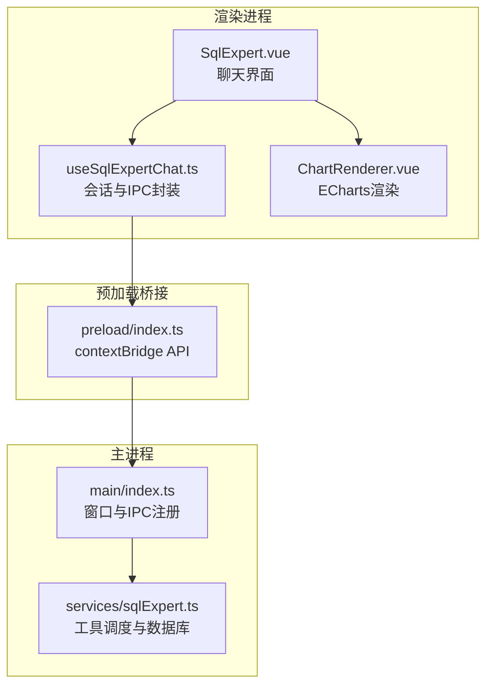
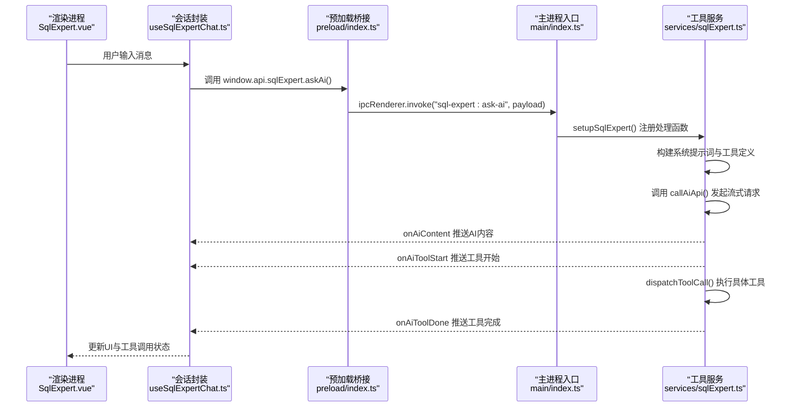
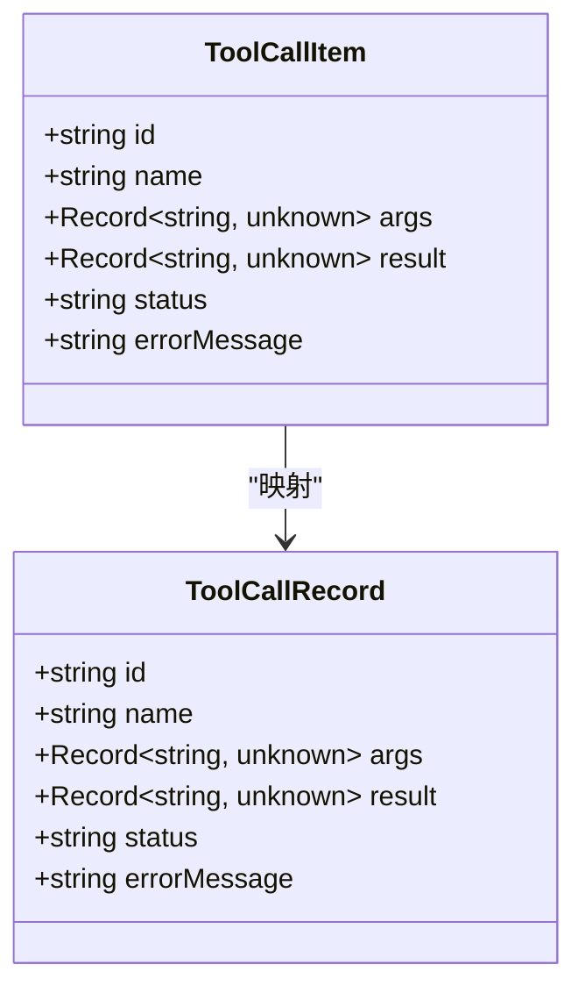
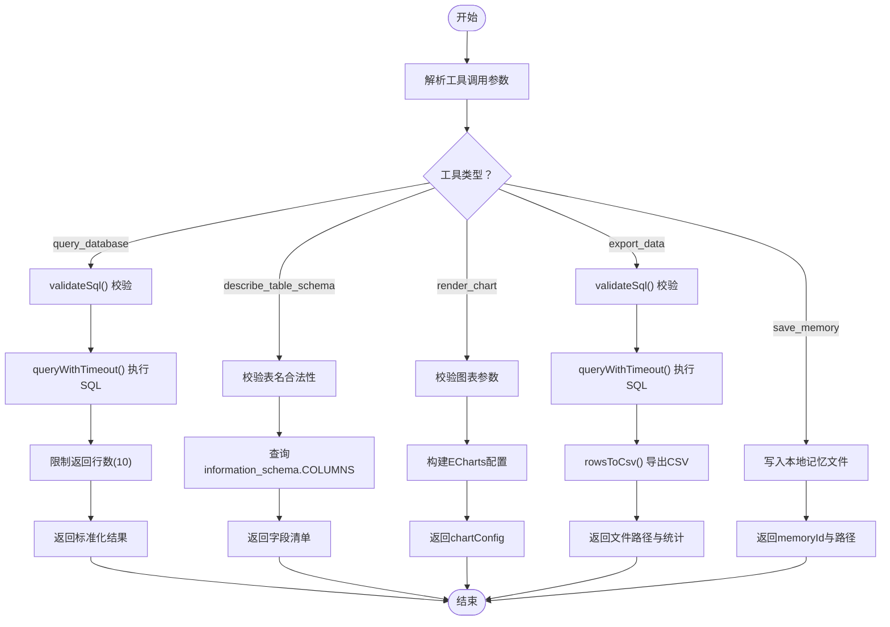
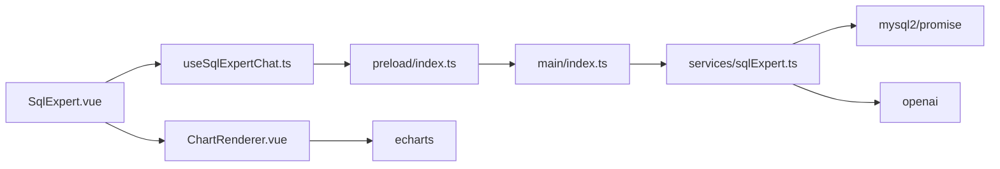

# 工具调用系统

<cite>
**本文引用的文件**
- [sqlExpert.ts](file://src/main/services/sqlExpert.ts)
- [useSqlExpertChat.ts](file://src/renderer/src/views/sqlexpert/useSqlExpertChat.ts)
- [SqlExpert.vue](file://src/renderer/src/views/sqlexpert/SqlExpert.vue)
- [ChartRenderer.vue](file://src/renderer/src/views/sqlexpert/ChartRenderer.vue)
- [index.ts（主进程入口）](file://src/main/index.ts)
- [index.ts（预加载桥接）](file://src/preload/index.ts)
- [types.d.ts](file://src/renderer/src/types.d.ts)
</cite>

## 目录
1. [简介](#简介)
2. [项目结构](#项目结构)
3. [核心组件](#核心组件)
4. [架构总览](#架构总览)
5. [详细组件分析](#详细组件分析)
6. [依赖关系分析](#依赖关系分析)
7. [性能考量](#性能考量)
8. [故障排除指南](#故障排除指南)
9. [结论](#结论)
10. [附录](#附录)

## 简介
本文件面向SQL专家聊天系统的“工具调用系统”，系统通过主进程内的工具调度器对接AI模型与数据库，实现“工具发现—参数校验—执行状态跟踪—结果处理”的完整生命周期管理。内置工具包括：
- query_database：只读SQL查询，限制返回行数并进行安全校验
- describe_table_schema：查询表结构（支持单表或多表）
- render_chart：基于真实查询结果生成图表配置
- export_data：导出完整查询结果为CSV文件
- save_memory：将可复用经验保存为本地记忆

系统采用Electron IPC在渲染进程与主进程之间传递消息，支持流式进度推送与工具调用的实时可视化反馈。

## 项目结构
- 主进程服务层：负责数据库连接、AI调用、工具调度与持久化
- 预加载桥接层：暴露受控API给渲染进程
- 渲染进程视图层：提供聊天界面、工具调用UI与图表渲染

图表来源
- [SqlExpert.vue:1-1105](file://src/renderer/src/views/sqlexpert/SqlExpert.vue#L1-L1105)
- [useSqlExpertChat.ts:1-508](file://src/renderer/src/views/sqlexpert/useSqlExpertChat.ts#L1-L508)
- [ChartRenderer.vue:1-66](file://src/renderer/src/views/sqlexpert/ChartRenderer.vue#L1-L66)
- [index.ts（预加载桥接）:1-229](file://src/preload/index.ts#L1-L229)
- [index.ts（主进程入口）:1-444](file://src/main/index.ts#L1-L444)
- [sqlExpert.ts:1-1503](file://src/main/services/sqlExpert.ts#L1-L1503)

章节来源
- [index.ts（主进程入口）:1-444](file://src/main/index.ts#L1-L444)
- [index.ts（预加载桥接）:1-229](file://src/preload/index.ts#L1-L229)
- [sqlExpert.ts:1-1503](file://src/main/services/sqlExpert.ts#L1-L1503)
- [useSqlExpertChat.ts:1-508](file://src/renderer/src/views/sqlexpert/useSqlExpertChat.ts#L1-L508)
- [SqlExpert.vue:1-1105](file://src/renderer/src/views/sqlexpert/SqlExpert.vue#L1-L1105)
- [ChartRenderer.vue:1-66](file://src/renderer/src/views/sqlexpert/ChartRenderer.vue#L1-L66)

## 核心组件
- ToolCallItem（渲染层）：描述一次工具调用的标识、名称、参数、结果、状态与错误信息
- ToolCallRecord（主进程）：与AI模型交互时的工具调用记录，包含结果摘要与错误信息
- 工具定义：getTools() 返回AI可用工具清单，含参数模式与必填项
- SQL校验：validateSql() 对SQL进行只读、列别名、通配符等规则校验
- 工具调度：dispatchToolCall() 根据工具名执行对应逻辑，返回标准化结果
- 流式进度：callAiApi() 支持流式内容与工具调用的实时推送

章节来源
- [useSqlExpertChat.ts:25-32](file://src/renderer/src/views/sqlexpert/useSqlExpertChat.ts#L25-L32)
- [sqlExpert.ts:33-47](file://src/main/services/sqlExpert.ts#L33-L47)
- [sqlExpert.ts:473-572](file://src/main/services/sqlExpert.ts#L473-L572)
- [sqlExpert.ts:365-400](file://src/main/services/sqlExpert.ts#L365-L400)
- [sqlExpert.ts:836-951](file://src/main/services/sqlExpert.ts#L836-L951)
- [sqlExpert.ts:676-739](file://src/main/services/sqlExpert.ts#L676-L739)

## 架构总览
系统通过“主进程服务”承载数据库连接池、AI调用与工具调度，通过“预加载桥接”向渲染进程暴露受控API，渲染进程负责UI与交互。

图表来源
- [SqlExpert.vue:282-420](file://src/renderer/src/views/sqlexpert/SqlExpert.vue#L282-L420)
- [useSqlExpertChat.ts:282-420](file://src/renderer/src/views/sqlexpert/useSqlExpertChat.ts#L282-L420)
- [index.ts（预加载桥接）:156-212](file://src/preload/index.ts#L156-L212)
- [index.ts（主进程入口）:427-427](file://src/main/index.ts#L427-L427)
- [sqlExpert.ts:1280-1501](file://src/main/services/sqlExpert.ts#L1280-L1501)

章节来源
- [SqlExpert.vue:282-420](file://src/renderer/src/views/sqlexpert/SqlExpert.vue#L282-L420)
- [useSqlExpertChat.ts:282-420](file://src/renderer/src/views/sqlexpert/useSqlExpertChat.ts#L282-L420)
- [index.ts（预加载桥接）:156-212](file://src/preload/index.ts#L156-L212)
- [index.ts（主进程入口）:427-427](file://src/main/index.ts#L427-L427)
- [sqlExpert.ts:1280-1501](file://src/main/services/sqlExpert.ts#L1280-L1501)

## 详细组件分析

### ToolCallItem接口设计与生命周期
- 接口字段
  - id：工具调用唯一标识
  - name：工具名称（如 query_database）
  - args：工具参数对象
  - result：工具执行结果（标准化字段：ok、reason、totalRows、returnedRows、truncated、fileName、chartConfig等）
  - status：执行状态（running/success/error/stopped）
  - errorMessage：错误信息
- 生命周期
  - 开始：渲染进程收到 onAiToolStart，创建 ToolCallItem 并标记为 running
  - 执行：主进程 dispatchToolCall() 执行具体逻辑
  - 结束：渲染进程收到 onAiToolDone，更新 result 或 errorMessage，并标记状态
  - 可视化：SqlExpert.vue 使用工具调用UI展示执行结果与图表

图表来源
- [useSqlExpertChat.ts:25-32](file://src/renderer/src/views/sqlexpert/useSqlExpertChat.ts#L25-L32)
- [sqlExpert.ts:33-47](file://src/main/services/sqlExpert.ts#L33-L47)

章节来源
- [useSqlExpertChat.ts:25-32](file://src/renderer/src/views/sqlexpert/useSqlExpertChat.ts#L25-L32)
- [sqlExpert.ts:33-47](file://src/main/services/sqlExpert.ts#L33-L47)

### 工具发现与参数定义
- 工具清单：getTools() 返回工具定义数组，包含类型、名称、描述与参数模式
- 参数模式
  - query_database：必需参数 sql、reason
  - describe_table_schema：二选一参数 tableName 或 tableNames，以及 reason
  - render_chart：必需参数 type、title、series，可选 xAxisData、reason
  - export_data：必需参数 sql，可选 reason、fileName
  - save_memory：必需参数 content，可选 reason

章节来源
- [sqlExpert.ts:473-572](file://src/main/services/sqlExpert.ts#L473-L572)

### 参数验证与SQL安全校验
- validateSql() 校验规则
  - 必须为单条只读SQL（SELECT或WITH）
  - 不允许DDL/修改类语句
  - 不允许访问information_schema等系统库（除非允许）
  - 不允许 SELECT *
  - 输出列必须使用 AS 明确别名
- queryWithTimeout() 为数据库查询设置超时，防止长时间阻塞

章节来源
- [sqlExpert.ts:365-400](file://src/main/services/sqlExpert.ts#L365-L400)
- [sqlExpert.ts:823-834](file://src/main/services/sqlExpert.ts#L823-L834)

### 工具调度与执行流程
- dispatchToolCall() 根据工具名执行：
  - query_database：执行SQL，限制返回行数（默认10行），返回标准化结果
  - describe_table_schema：查询information_schema，返回字段清单
  - render_chart：校验参数并构建ECharts配置
  - export_data：执行SQL并导出CSV文件
  - save_memory：写入本地记忆文件
- 结果摘要：buildToolResultSummary() 将工具结果转为简洁摘要字符串，便于模型消息拼接

图表来源
- [sqlExpert.ts:836-951](file://src/main/services/sqlExpert.ts#L836-L951)
- [sqlExpert.ts:823-834](file://src/main/services/sqlExpert.ts#L823-L834)
- [sqlExpert.ts:787-808](file://src/main/services/sqlExpert.ts#L787-L808)
- [sqlExpert.ts:800-808](file://src/main/services/sqlExpert.ts#L800-L808)

章节来源
- [sqlExpert.ts:836-951](file://src/main/services/sqlExpert.ts#L836-L951)
- [sqlExpert.ts:787-808](file://src/main/services/sqlExpert.ts#L787-L808)

### 流式进度与状态跟踪
- callAiApi() 支持流式内容与工具调用增量更新
- onAiContent/onAiToolStart/onAiToolDone 事件在渲染层实时更新UI
- 最大轮次限制（MAX_ROUNDS=15）防止无限循环

章节来源
- [sqlExpert.ts:676-739](file://src/main/services/sqlExpert.ts#L676-L739)
- [sqlExpert.ts:1308-1479](file://src/main/services/sqlExpert.ts#L1308-L1479)
- [useSqlExpertChat.ts:282-420](file://src/renderer/src/views/sqlexpert/useSqlExpertChat.ts#L282-L420)

### 内置工具功能实现详解

#### query_database
- 功能：执行只读SQL，限制返回行数并返回统计信息
- 参数：sql（必需）、reason（可选）
- 安全：validateSql() 校验；queryWithTimeout() 超时保护
- 结果：ok、reason、totalRows、returnedRows、truncated、rows（最多10行）

章节来源
- [sqlExpert.ts:473-494](file://src/main/services/sqlExpert.ts#L473-L494)
- [sqlExpert.ts:844-859](file://src/main/services/sqlExpert.ts#L844-L859)

#### describe_table_schema
- 功能：查询一个或多个表的字段结构
- 参数：tableName 或 tableNames（二选一）、reason（可选）
- 结果：ok、reason、totalRows、returnedRows、rows（字段清单）

章节来源
- [sqlExpert.ts:495-515](file://src/main/services/sqlExpert.ts#L495-L515)
- [sqlExpert.ts:862-896](file://src/main/services/sqlExpert.ts#L862-L896)

#### render_chart
- 功能：根据真实查询结果绘制图表
- 参数：type（line/bar/pie/line_bar）、title、xAxisData（折线/柱状/组合图必填）、series（必需）、reason（可选）
- 结果：ok、reason、chartConfig（ECharts配置）

章节来源
- [sqlExpert.ts:516-537](file://src/main/services/sqlExpert.ts#L516-L537)
- [sqlExpert.ts:898-916](file://src/main/services/sqlExpert.ts#L898-L916)
- [ChartRenderer.vue:1-66](file://src/renderer/src/views/sqlexpert/ChartRenderer.vue#L1-L66)

#### export_data
- 功能：执行只读SQL并导出完整结果为CSV文件
- 参数：sql（必需）、reason（可选）、fileName（可选）
- 结果：ok、reason、totalRows、returnedRows、fileName、filePath

章节来源
- [sqlExpert.ts:554-570](file://src/main/services/sqlExpert.ts#L554-L570)
- [sqlExpert.ts:933-948](file://src/main/services/sqlExpert.ts#L933-L948)
- [SqlExpert.vue:134-142](file://src/renderer/src/views/sqlexpert/SqlExpert.vue#L134-L142)

#### save_memory
- 功能：保存可复用经验到本地记忆文件
- 参数：content（必需）、reason（可选）
- 结果：ok、reason、memoryId、memoryPath、rows（包含新建记忆条目）

章节来源
- [sqlExpert.ts:541-553](file://src/main/services/sqlExpert.ts#L541-L553)
- [sqlExpert.ts:918-931](file://src/main/services/sqlExpert.ts#L918-L931)

### 错误处理机制
- 参数校验：validateSql() 抛出错误，工具执行前统一拦截
- 执行异常：dispatchToolCall() 捕获异常，返回 { ok: false, error: message }
- 错误信息格式化：buildToolResultSummary() 将工具结果转为JSON字符串摘要
- 中断与取消：AbortController支持请求取消，主动停止生成

章节来源
- [sqlExpert.ts:365-400](file://src/main/services/sqlExpert.ts#L365-L400)
- [sqlExpert.ts:844-859](file://src/main/services/sqlExpert.ts#L844-L859)
- [sqlExpert.ts:1436-1468](file://src/main/services/sqlExpert.ts#L1436-L1468)
- [sqlExpert.ts:1268-1278](file://src/main/services/sqlExpert.ts#L1268-L1278)

### 性能优化策略
- 并发控制：数据库连接池（默认5连接），避免过多并发导致资源争用
- 结果截断：默认最多返回10行样例，降低传输与渲染成本
- 超时控制：queryWithTimeout() 设置查询超时，防止长时间阻塞
- 缓存机制：schema缓存与内存缓存（cachedSchema），减少重复加载
- 资源管理：连接池销毁与ECharts实例释放，避免内存泄漏

章节来源
- [sqlExpert.ts:404-435](file://src/main/services/sqlExpert.ts#L404-L435)
- [sqlExpert.ts:743-744](file://src/main/services/sqlExpert.ts#L743-L744)
- [sqlExpert.ts:1186-1187](file://src/main/services/sqlExpert.ts#L1186-L1187)
- [ChartRenderer.vue:52-57](file://src/renderer/src/views/sqlexpert/ChartRenderer.vue#L52-L57)

### 工具扩展指南
- 新增工具步骤
  - 在 getTools() 中添加新的工具定义（type/function/name/description/parameters）
  - 在 dispatchToolCall() 中添加对应的分支逻辑，返回标准化结果
  - 在渲染层 useSqlExpertChat.ts 中完善显示映射与UI交互
  - 如需持久化或导出，补充主进程IPC处理与文件操作
- 参数定义规范
  - 使用 additionalProperties: false 限制多余字段
  - 使用 required 指定必填参数
  - 使用 anyOf/oneOf 控制互斥或二选一参数
- 集成方法
  - 通过 window.api.sqlExpert.xxx 暴露新能力
  - 在主进程 setupSqlExpert() 中注册 ipcMain.handle
  - 在渲染层通过 onAiToolStart/onAiToolDone 接收工具执行状态

章节来源
- [sqlExpert.ts:473-572](file://src/main/services/sqlExpert.ts#L473-L572)
- [sqlExpert.ts:836-951](file://src/main/services/sqlExpert.ts#L836-L951)
- [index.ts（预加载桥接）:156-212](file://src/preload/index.ts#L156-L212)
- [useSqlExpertChat.ts:57-63](file://src/renderer/src/views/sqlexpert/useSqlExpertChat.ts#L57-L63)

### 实际使用示例
- 查询数据库：用户输入“查询近7天销售数据”，AI调用 query_database，返回前10行样例与统计
- 查询表结构：用户询问某张表字段，AI调用 describe_table_schema，返回字段清单
- 绘制图表：用户要求柱状图展示销售额，AI调用 render_chart，返回ECharts配置并在前端渲染
- 导出数据：用户要求导出完整报表，AI调用 export_data，返回CSV文件路径
- 保存记忆：沉淀可复用口径，AI调用 save_memory，返回记忆ID

章节来源
- [SqlExpert.vue:117-149](file://src/renderer/src/views/sqlexpert/SqlExpert.vue#L117-L149)
- [useSqlExpertChat.ts:57-63](file://src/renderer/src/views/sqlexpert/useSqlExpertChat.ts#L57-L63)

## 依赖关系分析
- 渲染层依赖预加载桥接提供的API，主进程通过ipcMain.handle注册处理函数
- 主进程服务依赖数据库连接池与AI SDK，负责工具调度与持久化
- 图表渲染依赖ECharts，随配置变化自动重绘

图表来源
- [SqlExpert.vue:1-1105](file://src/renderer/src/views/sqlexpert/SqlExpert.vue#L1-L1105)
- [useSqlExpertChat.ts:1-508](file://src/renderer/src/views/sqlexpert/useSqlExpertChat.ts#L1-L508)
- [index.ts（预加载桥接）:1-229](file://src/preload/index.ts#L1-L229)
- [index.ts（主进程入口）:1-444](file://src/main/index.ts#L1-L444)
- [sqlExpert.ts:1-1503](file://src/main/services/sqlExpert.ts#L1-L1503)
- [ChartRenderer.vue:1-66](file://src/renderer/src/views/sqlexpert/ChartRenderer.vue#L1-L66)

章节来源
- [index.ts（主进程入口）:1-444](file://src/main/index.ts#L1-L444)
- [index.ts（预加载桥接）:1-229](file://src/preload/index.ts#L1-L229)
- [sqlExpert.ts:1-1503](file://src/main/services/sqlExpert.ts#L1-L1503)
- [ChartRenderer.vue:1-66](file://src/renderer/src/views/sqlexpert/ChartRenderer.vue#L1-L66)

## 性能考量
- 数据库连接池：限制最大连接数，避免高并发下的资源耗尽
- 结果截断：默认10行样例，兼顾性能与用户体验
- 超时控制：查询超时防止长时间阻塞
- 缓存：schema与内存缓存减少重复加载
- 渲染优化：工具调用UI按需展开，避免一次性渲染大量节点

章节来源
- [sqlExpert.ts:404-435](file://src/main/services/sqlExpert.ts#L404-L435)
- [sqlExpert.ts:743-744](file://src/main/services/sqlExpert.ts#L743-L744)
- [sqlExpert.ts:1186-1187](file://src/main/services/sqlExpert.ts#L1186-L1187)
- [SqlExpert.vue:683-689](file://src/renderer/src/views/sqlexpert/SqlExpert.vue#L683-L689)

## 故障排除指南
- 数据库连接失败
  - 检查数据库配置与连通性
  - 使用 window.api.sqlExpert.testDb() 进行连通性测试
- AI请求失败
  - 检查AI模型URL与API Key
  - 使用 window.api.sqlExpert.checkBalance() 查询余额
- 工具调用异常
  - 查看工具调用UI中的错误信息
  - 检查SQL语法与参数完整性
- 图表渲染异常
  - 确认 series 与 xAxisData 参数正确
  - 检查 chartConfig 是否为空

章节来源
- [index.ts（预加载桥接）:156-212](file://src/preload/index.ts#L156-L212)
- [sqlExpert.ts:968-1057](file://src/main/services/sqlExpert.ts#L968-L1057)
- [SqlExpert.vue:144-149](file://src/renderer/src/views/sqlexpert/SqlExpert.vue#L144-L149)

## 结论
工具调用系统通过严格的参数校验、流式进度推送与标准化结果处理，实现了从“自然语言意图”到“数据库查询与可视化呈现”的闭环。内置工具覆盖查询、结构探索、图表与导出等核心场景，具备良好的扩展性与稳定性。通过连接池、超时与截断等策略，系统在性能与安全性之间取得平衡。

## 附录
- 类型定义参考：types.d.ts 中的 SqlExpertAPI 接口
- UI交互参考：SqlExpert.vue 中的消息分段渲染与工具调用UI
- 图表渲染参考：ChartRenderer.vue 中的ECharts初始化与重绘

章节来源
- [types.d.ts:172-274](file://src/renderer/src/types.d.ts#L172-L274)
- [SqlExpert.vue:460-489](file://src/renderer/src/views/sqlexpert/SqlExpert.vue#L460-L489)
- [ChartRenderer.vue:23-50](file://src/renderer/src/views/sqlexpert/ChartRenderer.vue#L23-L50)