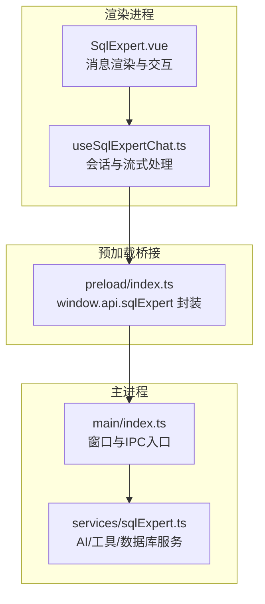
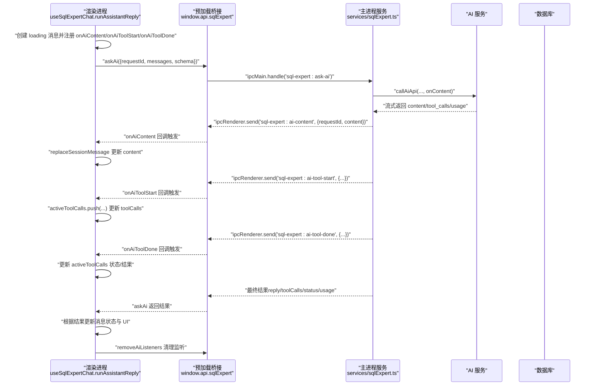
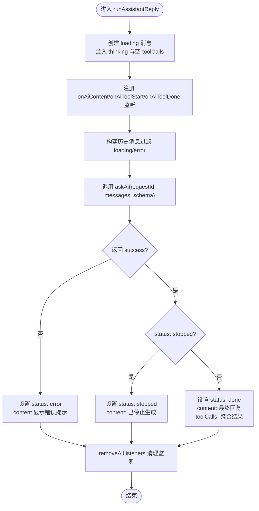
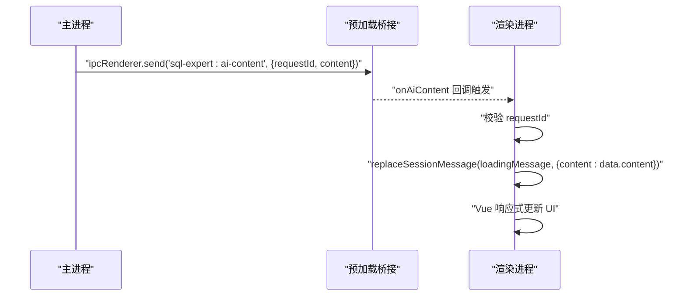
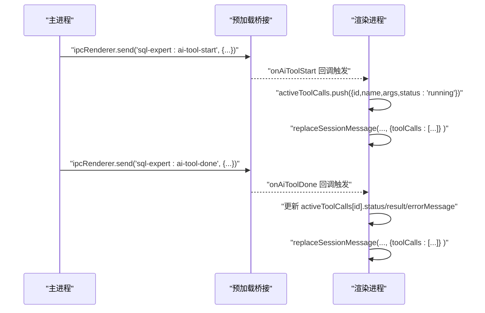
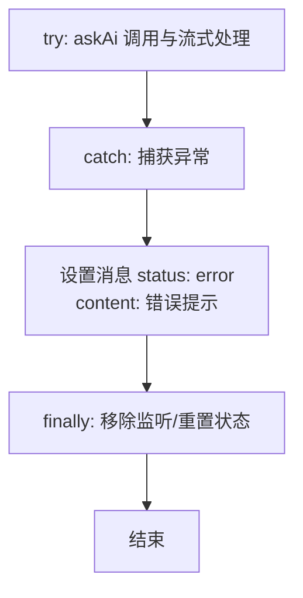
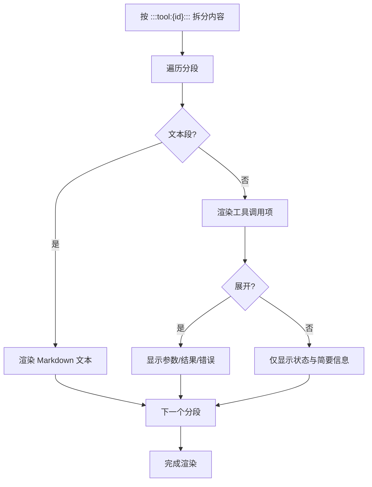
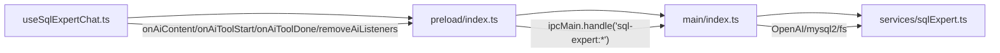

# 流式响应处理

<cite>
**本文引用的文件**
- [useSqlExpertChat.ts](file://src/renderer/src/views/sqlexpert/useSqlExpertChat.ts)
- [sqlExpert.ts](file://src/main/services/sqlExpert.ts)
- [SqlExpert.vue](file://src/renderer/src/views/sqlexpert/SqlExpert.vue)
- [index.ts](file://src/main/index.ts)
- [index.ts](file://src/preload/index.ts)
</cite>

## 目录
1. [简介](#简介)
2. [项目结构](#项目结构)
3. [核心组件](#核心组件)
4. [架构总览](#架构总览)
5. [详细组件分析](#详细组件分析)
6. [依赖关系分析](#依赖关系分析)
7. [性能考量](#性能考量)
8. [故障排查指南](#故障排查指南)
9. [结论](#结论)
10. [附录](#附录)

## 简介
本文围绕 SQL 专家聊天系统的“流式响应处理”机制，系统梳理 runAssistantReply 函数的实现原理与运行时行为，覆盖以下关键点：
- 流式事件监听器注册与实时消息更新
- AI 内容流 onAiContent 的增量更新与 UI 实时渲染
- 工具调用流 onAiToolStart/onAiToolDone 的响应处理、状态跟踪与结果聚合
- 错误恢复机制（异常捕获、错误状态设置、用户提示）
- 性能优化建议（内存管理、事件去重、渲染优化）
- 使用示例与调试技巧

## 项目结构
SQL 专家模块采用“渲染进程 + 预加载桥接 + 主进程服务”的三层架构：
- 渲染进程负责 UI、状态管理与事件监听
- 预加载层通过 contextBridge 暴露 window.api.sqlExpert，封装 IPC 通道
- 主进程服务负责数据库连接、AI 调用、工具调度与流式事件推送

**图表来源**
- [SqlExpert.vue:1-200](file://src/renderer/src/views/sqlexpert/SqlExpert.vue#L1-200)
- [useSqlExpertChat.ts:165-420](file://src/renderer/src/views/sqlexpert/useSqlExpertChat.ts#L165-420)
- [index.ts:156-212](file://src/preload/index.ts#L156-212)
- [index.ts:427-427](file://src/main/index.ts#L427-427)
- [sqlExpert.ts:968-1000](file://src/main/services/sqlExpert.ts#L968-1000)

**章节来源**
- [SqlExpert.vue:1-200](file://src/renderer/src/views/sqlexpert/SqlExpert.vue#L1-200)
- [useSqlExpertChat.ts:165-420](file://src/renderer/src/views/sqlexpert/useSqlExpertChat.ts#L165-420)
- [index.ts:156-212](file://src/preload/index.ts#L156-212)
- [index.ts:427-427](file://src/main/index.ts#L427-427)
- [sqlExpert.ts:968-1000](file://src/main/services/sqlExpert.ts#L968-1000)

## 核心组件
- useSqlExpertChat：会话状态、消息构建、runAssistantReply 流式处理、IPC 事件监听与清理
- preload/index.ts：window.api.sqlExpert 的 IPC 暴露层，提供 onAiContent/onAiToolStart/onAiToolDone/removeAiListeners
- services/sqlExpert.ts：主进程 AI/工具/数据库服务，负责流式内容推送、工具调用执行与状态聚合
- SqlExpert.vue：UI 渲染层，负责消息分段渲染、工具调用可视化、图表渲染与交互

**章节来源**
- [useSqlExpertChat.ts:165-420](file://src/renderer/src/views/sqlexpert/useSqlExpertChat.ts#L165-420)
- [index.ts:156-212](file://src/preload/index.ts#L156-212)
- [sqlExpert.ts:653-740](file://src/main/services/sqlExpert.ts#L653-740)
- [SqlExpert.vue:434-800](file://src/renderer/src/views/sqlexpert/SqlExpert.vue#L434-800)

## 架构总览
流式响应的关键流程如下：
- 渲染进程调用 runAssistantReply，创建“加载中”消息并注册 onAiContent/onAiToolStart/onAiToolDone 监听
- 主进程通过 callAiApi 接入 AI 流式接口，逐块推送 content 与 tool_calls
- 渲染进程收到 onAiContent 后，增量更新 loading 消息的 content 字段
- 收到 onAiToolStart/onAiToolDone 后，维护 activeToolCalls 并更新 UI
- 主进程在工具执行期间通过 onAi-tool-start/onAi-tool-done 推送工具状态与结果
- 最终根据主进程返回的最终状态（done/stopped/error）更新消息状态与 UI

**图表来源**
- [useSqlExpertChat.ts:282-420](file://src/renderer/src/views/sqlexpert/useSqlExpertChat.ts#L282-420)
- [index.ts:198-211](file://src/preload/index.ts#L198-211)
- [sqlExpert.ts:676-740](file://src/main/services/sqlExpert.ts#L676-740)
- [sqlExpert.ts:1354-1470](file://src/main/services/sqlExpert.ts#L1354-1470)

**章节来源**
- [useSqlExpertChat.ts:282-420](file://src/renderer/src/views/sqlexpert/useSqlExpertChat.ts#L282-420)
- [index.ts:198-211](file://src/preload/index.ts#L198-211)
- [sqlExpert.ts:676-740](file://src/main/services/sqlExpert.ts#L676-740)
- [sqlExpert.ts:1354-1470](file://src/main/services/sqlExpert.ts#L1354-1470)

## 详细组件分析

### runAssistantReply：流式响应处理核心
- 目标：发起一次对话请求，注册流式事件监听，实时更新 UI，并在完成后清理监听
- 关键步骤
  - 创建 loading 消息（status: loading），注入初始 thinking 与空 toolCalls
  - 注册 onAiContent：将收到的增量 content 直接替换 loading 消息的 content
  - 注册 onAiToolStart：将工具调用项加入 activeToolCalls，并更新 UI
  - 注册 onAiToolDone：更新对应工具的状态、结果与错误信息，并刷新 UI
  - 发起 askAi 请求，携带过滤后的历史消息与 schema
  - 根据返回结果更新消息状态（done/stopped/error），并设置 usage
  - finally 中清理 IPC 监听、重置 currentRequestId、更新会话时间戳

**图表来源**
- [useSqlExpertChat.ts:282-420](file://src/renderer/src/views/sqlexpert/useSqlExpertChat.ts#L282-420)

**章节来源**
- [useSqlExpertChat.ts:282-420](file://src/renderer/src/views/sqlexpert/useSqlExpertChat.ts#L282-420)

### onAiContent：AI 内容流的增量更新与 UI 渲染
- 数据接收：主进程通过 callAiApi 流式返回 choices[0].delta.content，合并到累积 content
- 增量更新：渲染进程收到 onAiContent 后，直接将 data.content 替换 loading 消息的 content 字段
- UI 实时渲染：由于 Vue 响应式系统，content 的变化会触发 UI 重新渲染，实现“打字机”效果
- 请求隔离：通过 requestId 校验，确保多轮并发请求不会互相污染

**图表来源**
- [sqlExpert.ts:1354-1365](file://src/main/services/sqlExpert.ts#L1354-1365)
- [index.ts:198-200](file://src/preload/index.ts#L198-200)
- [useSqlExpertChat.ts:299-307](file://src/renderer/src/views/sqlexpert/useSqlExpertChat.ts#L299-307)

**章节来源**
- [sqlExpert.ts:1354-1365](file://src/main/services/sqlExpert.ts#L1354-1365)
- [index.ts:198-200](file://src/preload/index.ts#L198-200)
- [useSqlExpertChat.ts:299-307](file://src/renderer/src/views/sqlexpert/useSqlExpertChat.ts#L299-307)

### onAiToolStart/onAiToolDone：工具调用流的响应处理与聚合
- onAiToolStart：主进程在工具调用开始时推送 {requestId, id, name, args}，渲染进程将其加入 activeToolCalls 并更新 UI
- onAiToolDone：主进程在工具调用结束时推送 {requestId, id, status, result, errorMessage}，渲染进程更新对应工具的状态与结果
- 结果聚合：渲染进程维护 activeToolCalls 数组，每次更新都会触发 UI 重新渲染，展示工具调用的进度与结果
- 请求隔离：同样通过 requestId 校验，避免并发请求干扰

**图表来源**
- [sqlExpert.ts:1426-1461](file://src/main/services/sqlExpert.ts#L1426-1461)
- [index.ts:201-211](file://src/preload/index.ts#L201-211)
- [useSqlExpertChat.ts:309-339](file://src/renderer/src/views/sqlexpert/useSqlExpertChat.ts#L309-339)

**章节来源**
- [sqlExpert.ts:1426-1461](file://src/main/services/sqlExpert.ts#L1426-1461)
- [index.ts:201-211](file://src/preload/index.ts#L201-211)
- [useSqlExpertChat.ts:309-339](file://src/renderer/src/views/sqlexpert/useSqlExpertChat.ts#L309-339)

### 错误恢复机制
- 异常捕获：runAssistantReply 在 askAi 调用与流式事件处理中均进行 try/catch
- 错误状态设置：当发生异常时，将 loading 消息的 status 设为 error，并在 content 中显示错误提示
- 用户提示：UI 层通过消息状态与内容提示用户当前处于错误状态
- 监听清理：finally 中移除所有流式事件监听，防止内存泄漏与重复触发

**图表来源**
- [useSqlExpertChat.ts:401-419](file://src/renderer/src/views/sqlexpert/useSqlExpertChat.ts#L401-419)

**章节来源**
- [useSqlExpertChat.ts:401-419](file://src/renderer/src/views/sqlexpert/useSqlExpertChat.ts#L401-419)

### UI 渲染与消息分段
- 消息分段：SqlExpert.vue 将消息内容按 :::tool:{id}::: 标记拆分为文本段与工具段，交替渲染
- 工具展开：用户可点击工具调用项展开/收起，查看参数与结果
- 图表渲染：当工具返回图表配置时，使用 ChartRenderer 组件渲染
- Markdown 渲染：使用 MarkdownIt + DOMPurify 渲染富文本，支持高亮

**图表来源**
- [SqlExpert.vue:472-489](file://src/renderer/src/views/sqlexpert/SqlExpert.vue#L472-489)

**章节来源**
- [SqlExpert.vue:472-489](file://src/renderer/src/views/sqlexpert/SqlExpert.vue#L472-489)

## 依赖关系分析
- 渲染进程依赖预加载桥接提供的 window.api.sqlExpert，用于注册/移除流式事件监听与发起 askAi 请求
- 预加载桥接依赖主进程的 ipcMain.handle 注册的 IPC 处理函数
- 主进程服务依赖 OpenAI SDK、mysql2、文件系统与内存中的活跃请求映射

**图表来源**
- [useSqlExpertChat.ts:282-420](file://src/renderer/src/views/sqlexpert/useSqlExpertChat.ts#L282-420)
- [index.ts:156-212](file://src/preload/index.ts#L156-212)
- [index.ts:427-427](file://src/main/index.ts#L427-427)
- [sqlExpert.ts:676-740](file://src/main/services/sqlExpert.ts#L676-740)

**章节来源**
- [useSqlExpertChat.ts:282-420](file://src/renderer/src/views/sqlexpert/useSqlExpertChat.ts#L282-420)
- [index.ts:156-212](file://src/preload/index.ts#L156-212)
- [index.ts:427-427](file://src/main/index.ts#L427-427)
- [sqlExpert.ts:676-740](file://src/main/services/sqlExpert.ts#L676-740)

## 性能考量
- 内存管理
  - 会话持久化：在持久化前清理 toolCalls.result.rows 等大对象，降低 localStorage 体积
  - 监听清理：finally 中移除所有流式事件监听，避免内存泄漏
- 事件去重
  - requestId 校验：确保同一请求的流式事件才更新 UI，避免并发请求互相污染
- 渲染优化
  - 消息分段渲染：将长文本与工具调用分段渲染，减少单次 DOM 更新压力
  - 工具展开/收起：默认折叠，仅在用户交互时渲染详细内容
  - Markdown 渲染：使用 DOMPurify 过滤 HTML，避免 XSS 与不必要的渲染
- 工具调用限制
  - 工具调用轮次上限：超过上限时提示用户分步提问，避免长时间占用资源
  - SQL 查询超时：工具执行 SQL 时设置超时，防止阻塞

**章节来源**
- [useSqlExpertChat.ts:104-121](file://src/renderer/src/views/sqlexpert/useSqlExpertChat.ts#L104-121)
- [useSqlExpertChat.ts:412-419](file://src/renderer/src/views/sqlexpert/useSqlExpertChat.ts#L412-419)
- [SqlExpert.vue:472-489](file://src/renderer/src/views/sqlexpert/SqlExpert.vue#L472-489)
- [sqlExpert.ts:1308-1316](file://src/main/services/sqlExpert.ts#L1308-1316)
- [sqlExpert.ts:824-834](file://src/main/services/sqlExpert.ts#L824-834)

## 故障排查指南
- 无法收到 onAiContent
  - 检查 requestId 是否匹配，确保 runAssistantReply 正确创建并传递
  - 确认 removeAiListeners 未提前移除监听
- 工具调用状态异常
  - 检查 onAiToolStart/onAiToolDone 是否正确推送 id/name/status/result
  - 确认 activeToolCalls 的查找与更新逻辑
- 错误状态未显示
  - 检查 askAi 返回的 error 字段与 catch 分支
  - 确认 replaceSessionMessage 的错误分支是否执行
- UI 不更新
  - 确保 content/toolCalls 的更新触发了 Vue 响应式更新
  - 检查消息状态与 UI 绑定逻辑

**章节来源**
- [useSqlExpertChat.ts:299-339](file://src/renderer/src/views/sqlexpert/useSqlExpertChat.ts#L299-339)
- [useSqlExpertChat.ts:401-419](file://src/renderer/src/views/sqlexpert/useSqlExpertChat.ts#L401-419)
- [SqlExpert.vue:472-489](file://src/renderer/src/views/sqlexpert/SqlExpert.vue#L472-489)

## 结论
SQL 专家聊天系统的流式响应处理通过“渲染进程 + 预加载桥接 + 主进程服务”的协作，实现了：
- 实时内容增量更新与工具调用状态跟踪
- 清晰的错误恢复与 UI 提示
- 可扩展的工具调用与结果聚合
- 面向性能的内存与渲染优化

该机制为复杂对话场景提供了稳定、可扩展的流式体验基础。

## 附录
- 使用示例
  - 发送消息：调用 useSqlExpertChat.sendMessage，内部会创建用户消息并触发 runAssistantReply
  - 停止生成：调用 stopMessage，向主进程发送取消请求
  - 重新生成：调用 regenerateMessage，清空后续消息并重新发起请求
- 调试技巧
  - 在控制台打印 requestId，验证事件归属
  - 在 onAiContent/onAiToolStart/onAiToolDone 中添加日志，观察数据流转
  - 检查 askAi 返回的 usage 与 status，辅助定位问题

**章节来源**
- [useSqlExpertChat.ts:431-458](file://src/renderer/src/views/sqlexpert/useSqlExpertChat.ts#L431-458)
- [useSqlExpertChat.ts:422-429](file://src/renderer/src/views/sqlexpert/useSqlExpertChat.ts#L422-429)
- [SqlExpert.vue:658-664](file://src/renderer/src/views/sqlexpert/SqlExpert.vue#L658-664)