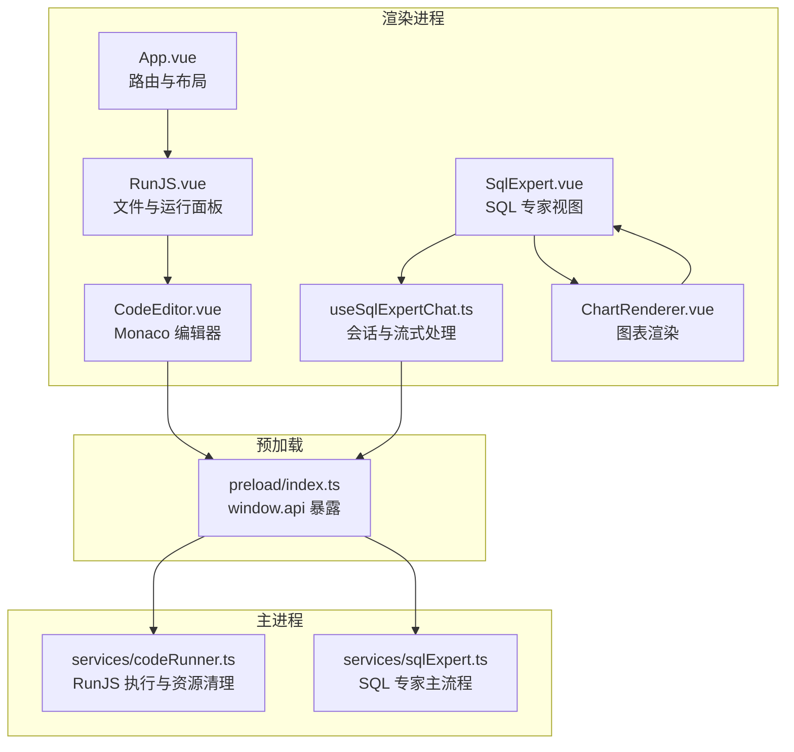
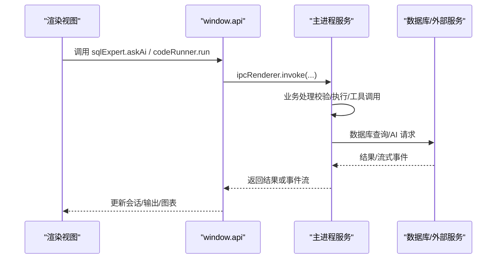
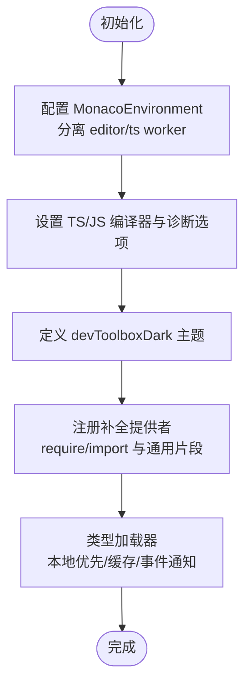
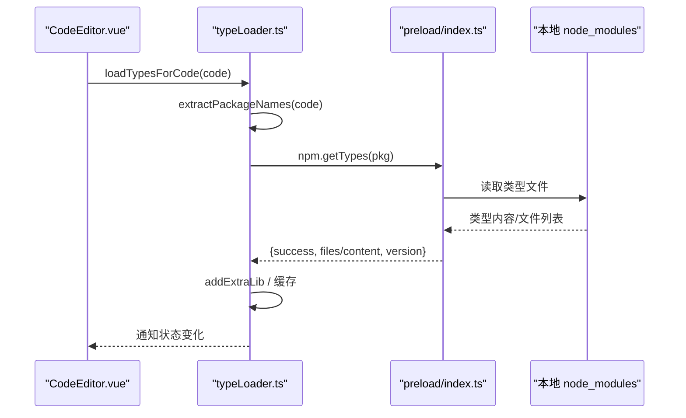
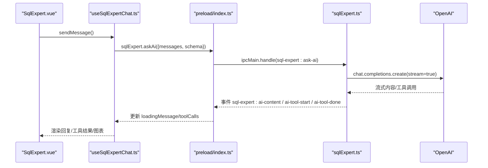
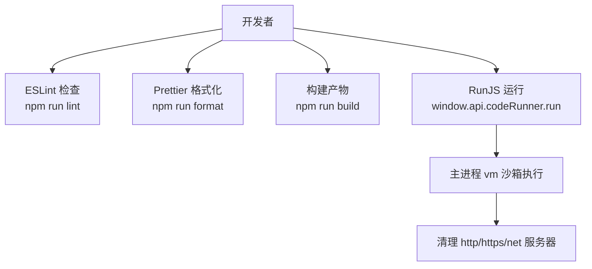
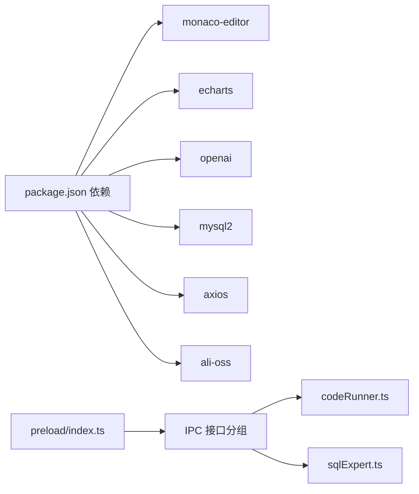

# 开发工具与实用程序

<cite>
**本文引用的文件**
- [README.md](file://README.md)
- [DEVELOPMENT.md](file://DEVELOPMENT.md)
- [package.json](file://package.json)
- [eslint.config.mjs](file://eslint.config.mjs)
- [.prettierrc](file://.prettierrc)
- [src/preload/index.ts](file://src/preload/index.ts)
- [src/main/services/sqlExpert.ts](file://src/main/services/sqlExpert.ts)
- [src/renderer/src/utils/monacoSetup.ts](file://src/renderer/src/utils/monacoSetup.ts)
- [src/renderer/src/utils/snippets.ts](file://src/renderer/src/utils/snippets.ts)
- [src/renderer/src/utils/typeLoader.ts](file://src/renderer/src/utils/typeLoader.ts)
- [src/renderer/src/views/runjs/components/CodeEditor.vue](file://src/renderer/src/views/runjs/components/CodeEditor.vue)
- [src/renderer/src/views/sqlexpert/useSqlExpertChat.ts](file://src/renderer/src/views/sqlexpert/useSqlExpertChat.ts)
- [src/renderer/src/views/sqlexpert/ChartRenderer.vue](file://src/renderer/src/views/sqlexpert/ChartRenderer.vue)
- [src/renderer/src/views/runjs/RunJS.vue](file://src/renderer/src/views/runjs/RunJS.vue)
- [src/main/services/codeRunner.ts](file://src/main/services/codeRunner.ts)
</cite>

## 目录
1. [引言](#引言)
2. [项目结构](#项目结构)
3. [核心组件](#核心组件)
4. [架构总览](#架构总览)
5. [详细组件分析](#详细组件分析)
6. [依赖关系分析](#依赖关系分析)
7. [性能考量](#性能考量)
8. [故障排查指南](#故障排查指南)
9. [结论](#结论)
10. [附录](#附录)

## 引言
本文件面向开发者工具箱中的开发工具与实用程序，聚焦以下能力：
- Monaco 编辑器的配置与定制：Worker 配置、语言环境、主题与智能提示
- 代码片段与类型加载器：内置片段、NPM 包补全、类型定义加载与缓存
- SQL 专家聊天系统：AI 对话管理、工具调用处理、流式响应与图表渲染
- 开发辅助工具：代码格式化、ESLint 配置与 Prettier 集成
- 实用工具函数 API 与最佳实践

## 项目结构
项目采用 Electron + Vue 3 + TypeScript 的桌面应用架构，分为渲染进程、预加载桥接与主进程三层。核心模块分布如下：
- 渲染进程：视图组件、工具页面、编辑器与图表渲染
- 预加载：安全桥接 API（window.api），统一暴露主进程能力
- 主进程：服务模块（RunJS 执行、SQL 专家、NPM 管理、OSS、HTTP、Dock、通知等）

**图表来源**
- [src/renderer/src/views/runjs/RunJS.vue:1-200](file://src/renderer/src/views/runjs/RunJS.vue#L1-L200)
- [src/renderer/src/views/runjs/components/CodeEditor.vue:1-556](file://src/renderer/src/views/runjs/components/CodeEditor.vue#L1-L556)
- [src/renderer/src/views/sqlexpert/SqlExpert.vue](file://src/renderer/src/views/sqlexpert/SqlExpert.vue)
- [src/renderer/src/views/sqlexpert/useSqlExpertChat.ts:1-508](file://src/renderer/src/views/sqlexpert/useSqlExpertChat.ts#L1-L508)
- [src/renderer/src/views/sqlexpert/ChartRenderer.vue:1-66](file://src/renderer/src/views/sqlexpert/ChartRenderer.vue#L1-L66)
- [src/preload/index.ts:1-229](file://src/preload/index.ts#L1-L229)
- [src/main/services/codeRunner.ts:1-200](file://src/main/services/codeRunner.ts#L1-L200)
- [src/main/services/sqlExpert.ts:1-800](file://src/main/services/sqlExpert.ts#L1-L800)

**章节来源**
- [README.md: 140-153:140-153](file://README.md#L140-L153)
- [DEVELOPMENT.md: 68-102:68-102](file://DEVELOPMENT.md#L68-L102)

## 核心组件
- Monaco 编辑器工具集：Monaco 配置、代码片段与类型加载器
- RunJS 代码运行器：文件管理、运行与输出、快捷键与类型加载
- SQL 专家：会话管理、工具调用、流式响应、图表渲染
- 预加载 API：统一 IPC 暴露与事件监听
- ESLint/Prettier：代码质量与格式化工具链

**章节来源**
- [src/renderer/src/utils/monacoSetup.ts: 1-76:1-76](file://src/renderer/src/utils/monacoSetup.ts#L1-L76)
- [src/renderer/src/utils/snippets.ts: 1-169:1-169](file://src/renderer/src/utils/snippets.ts#L1-L169)
- [src/renderer/src/utils/typeLoader.ts: 1-206:1-206](file://src/renderer/src/utils/typeLoader.ts#L1-L206)
- [src/renderer/src/views/runjs/components/CodeEditor.vue: 1-L556:1-556](file://src/renderer/src/views/runjs/components/CodeEditor.vue#L1-L556)
- [src/renderer/src/views/sqlexpert/useSqlExpertChat.ts: 1-L508:1-508](file://src/renderer/src/views/sqlexpert/useSqlExpertChat.ts#L1-L508)
- [src/preload/index.ts: 1-L229:1-229](file://src/preload/index.ts#L1-L229)
- [eslint.config.mjs: 1-29:1-29](file://eslint.config.mjs#L1-L29)
- [.prettierrc: 1-9:1-9](file://.prettierrc#L1-L9)

## 架构总览
渲染进程通过 window.api 与主进程通信，主进程提供系统能力与业务服务。SQL 专家与 RunJS 分别承载 AI 对话与代码运行两大核心能力。

**图表来源**
- [src/preload/index.ts: 156-L212:156-212](file://src/preload/index.ts#L156-L212)
- [src/main/services/sqlExpert.ts: 653-L739:653-739](file://src/main/services/sqlExpert.ts#L653-L739)
- [src/main/services/codeRunner.ts: 98-L200:98-200](file://src/main/services/codeRunner.ts#L98-L200)

## 详细组件分析

### Monaco 编辑器配置与定制
- Worker 与语言环境
  - 通过自定义 MonacoEnvironment 将 editor 与 ts worker 分离，确保 TypeScript/JavaScript 正确加载
  - 设置编译器选项（目标、模块、解析器、lib 等）与诊断选项，启用 eager 模型同步
- 主题与 UI
  - 定义深色主题 devToolboxDark，覆盖编辑器背景、前景、行高亮、光标与行号颜色
  - 启用自动补全、参数提示、悬停提示、括号着色、行高亮、平滑滚动等
- 代码片段与补全
  - 注册 JavaScript/TypeScript 补全提供者，支持 require/import 语境下的包名补全与通用代码片段
- 类型加载器
  - 从本地 node_modules 优先加载类型定义，支持多文件类型包与缓存
  - 提供批量加载、按代码提取依赖、事件监听与版本查询

**图表来源**
- [src/renderer/src/utils/monacoSetup.ts: 11-L73:11-73](file://src/renderer/src/utils/monacoSetup.ts#L11-L73)
- [src/renderer/src/utils/snippets.ts: 72-L168:72-168](file://src/renderer/src/utils/snippets.ts#L72-L168)
- [src/renderer/src/utils/typeLoader.ts: 68-L139:68-139](file://src/renderer/src/utils/typeLoader.ts#L68-L139)

**章节来源**
- [src/renderer/src/utils/monacoSetup.ts: 1-L76:1-76](file://src/renderer/src/utils/monacoSetup.ts#L1-L76)
- [src/renderer/src/utils/snippets.ts: 1-L169:1-169](file://src/renderer/src/utils/snippets.ts#L1-L169)
- [src/renderer/src/utils/typeLoader.ts: 1-L206:1-206](file://src/renderer/src/utils/typeLoader.ts#L1-L206)

### 代码片段与类型加载器 API
- 代码片段
  - commonSnippets：通用 JS/TS 片段（函数、循环、异步、导入等）
  - tsSnippets：TS 专属片段（接口、类型别名、枚举、泛型等）
  - npmPackages：常用包补全（名称、详情、文档）
  - registerSnippetProviders：按语言注册补全提供者，支持 require/import 语境
- 类型加载器
  - loadTypeDefinition：加载单个包类型，优先本地 node_modules，支持强制重载与缓存
  - loadTypesForInstalledPackages：批量加载已安装包类型（并发节流）
  - loadTypesForCode：从代码中提取依赖并加载类型
  - onTypeLoadStatusChange：订阅类型加载状态变化事件
  - 工具函数：extractPackageNames、hasLoadedTypes、getLoadedTypes、getLoadedVersion

**图表来源**
- [src/renderer/src/views/runjs/components/CodeEditor.vue: 176-L189:176-189](file://src/renderer/src/views/runjs/components/CodeEditor.vue#L176-L189)
- [src/renderer/src/utils/typeLoader.ts: 68-L103:68-103](file://src/renderer/src/utils/typeLoader.ts#L68-L103)
- [src/preload/index.ts: 83](file://src/preload/index.ts#L83)

**章节来源**
- [src/renderer/src/utils/snippets.ts: 8-L168:8-168](file://src/renderer/src/utils/snippets.ts#L8-L168)
- [src/renderer/src/utils/typeLoader.ts: 68-L206:68-206](file://src/renderer/src/utils/typeLoader.ts#L68-L206)
- [src/renderer/src/views/runjs/components/CodeEditor.vue: 176-L282:176-282](file://src/renderer/src/views/runjs/components/CodeEditor.vue#L176-L282)

### SQL 专家聊天系统
- 会话管理
  - useSqlExpertChat：管理会话、消息、历史分组、标题生成、持久化
  - 支持新增、删除、选择、重新生成消息；流式事件监听（内容、工具开始/完成）
- 工具调用与流式响应
  - callAiApi：OpenAI 流式请求，累积内容与工具调用，返回用量统计
  - toModelMessages：清洗消息、构建工具调用与工具结果消息
  - 工具定义：query_database、describe_table_schema、render_chart、export_data、save_memory
- 图表渲染
  - ChartRenderer：基于 ECharts 的响应式渲染组件，支持配置变更与尺寸监听
  - buildChartOption：根据工具参数生成图表配置（折线、柱状、饼图、组合）

**图表来源**
- [src/renderer/src/views/sqlexpert/useSqlExpertChat.ts: 282-L420:282-420](file://src/renderer/src/views/sqlexpert/useSqlExpertChat.ts#L282-L420)
- [src/preload/index.ts: 156-L212:156-212](file://src/preload/index.ts#L156-L212)
- [src/main/services/sqlExpert.ts: 653-L739:653-739](file://src/main/services/sqlExpert.ts#L653-L739)

**章节来源**
- [src/renderer/src/views/sqlexpert/useSqlExpertChat.ts: 1-L508:1-508](file://src/renderer/src/views/sqlexpert/useSqlExpertChat.ts#L1-L508)
- [src/renderer/src/views/sqlexpert/ChartRenderer.vue: 1-L66:1-66](file://src/renderer/src/views/sqlexpert/ChartRenderer.vue#L1-L66)
- [src/main/services/sqlExpert.ts: 473-L572:473-572](file://src/main/services/sqlExpert.ts#L473-L572)

### 开发辅助工具：格式化、ESLint 与 Prettier
- ESLint 配置
  - 基于 @electron-toolkit/eslint-config-ts 推荐规则，扩展 Vue 文件解析与规则
  - 关闭多词组件名强制与 v-html 限制，便于现有项目过渡
- Prettier 集成
  - 配置：无分号、2 空格缩进、单引号、100 字符行长、无尾随逗号、箭头函数括号
  - 命令：npm run format 调用 prettier --write .
- RunJS 代码运行器
  - 通过 window.api.codeRunner.run 触发主进程执行，支持 TypeScript 转译与日志流式推送
  - 资源清理：全局劫持 http/https/net 模块，追踪并清理活跃服务器，避免端口占用

**图表来源**
- [eslint.config.mjs: 6-L28:6-28](file://eslint.config.mjs#L6-L28)
- [.prettierrc: 1-L9:1-9](file://.prettierrc#L1-L9)
- [package.json: 12-L27:12-27](file://package.json#L12-L27)
- [src/renderer/src/views/runjs/RunJS.vue: 151-L181:151-181](file://src/renderer/src/views/runjs/RunJS.vue#L151-L181)
- [src/main/services/codeRunner.ts: 98-L200:98-200](file://src/main/services/codeRunner.ts#L98-L200)

**章节来源**
- [eslint.config.mjs: 1-L29:1-29](file://eslint.config.mjs#L1-L29)
- [.prettierrc: 1-L9:1-9](file://.prettierrc#L1-L9)
- [package.json: 12-L27:12-27](file://package.json#L12-L27)
- [src/renderer/src/views/runjs/RunJS.vue: 1-L200:1-200](file://src/renderer/src/views/runjs/RunJS.vue#L1-L200)
- [src/main/services/codeRunner.ts: 1-L200:1-200](file://src/main/services/codeRunner.ts#L1-L200)

## 依赖关系分析
- 渲染进程依赖
  - Monaco 编辑器、ECharts、Dayjs、Axios、OpenAI SDK、mysql2、ali-oss 等
- 预加载 API
  - 统一暴露窗口控制、应用信息、代码运行、NPM 管理、域名查询、Dock、HTTP 客户端、OSS、SQL 专家等 IPC 接口
- 主进程服务
  - RunJS 执行与资源清理、SQL 专家 AI 对话与工具调用、NPM 管理、OSS 上传、HTTP 请求代理、Dock 服务、通知

**图表来源**
- [package.json: 28-L73:28-73](file://package.json#L28-L73)
- [src/preload/index.ts: 11-L212:11-212](file://src/preload/index.ts#L11-L212)

**章节来源**
- [package.json: 28-L73:28-73](file://package.json#L28-L73)
- [src/preload/index.ts: 1-L229:1-229](file://src/preload/index.ts#L1-L229)

## 性能考量
- Monaco 编辑器
  - 启用 eager 模型同步与合理建议配置，减少输入延迟
  - 主题与字体设置影响渲染性能，建议保持默认或轻量配置
- 类型加载
  - 本地优先加载与缓存，批量加载时采用并发节流（每批 3 个），降低 I/O 压力
  - 代码变更防抖（500ms）避免频繁触发类型加载
- SQL 专家
  - 流式响应按块累积，避免一次性渲染大量内容
  - 工具调用限制返回行数（10 行样例），避免前端卡顿
- RunJS
  - 每次执行前清理活跃服务器，避免端口冲突导致的阻塞
  - 代码转译与沙箱执行限制，保障安全性与稳定性

[本节为通用性能建议，无需特定文件引用]

## 故障排查指南
- RunJS 无法运行或端口占用
  - 确认上次执行的服务器已被清理，必要时手动清理端口进程
  - 检查 esbuild 转译与 vm 沙箱日志
- Monaco 类型加载失败
  - 检查本地 node_modules 是否存在目标包类型文件
  - 确认 npm.getTypes 返回成功与版本信息
- SQL 专家无法回答或工具调用失败
  - 校验数据库连接与 schema 加载是否成功
  - 检查 AI 服务 URL、API Key、模型配置是否有效
  - 查看工具调用结果摘要与错误信息
- ESLint/Prettier 报错
  - 使用 npm run lint 与 npm run format 修复
  - 确认 .prettierrc 与 eslint.config.mjs 配置生效

**章节来源**
- [src/main/services/codeRunner.ts: 77-L96:77-96](file://src/main/services/codeRunner.ts#L77-L96)
- [src/renderer/src/utils/typeLoader.ts: 86-L103:86-103](file://src/renderer/src/utils/typeLoader.ts#L86-L103)
- [src/main/services/sqlExpert.ts: 139-L170:139-170](file://src/main/services/sqlExpert.ts#L139-L170)
- [eslint.config.mjs: 6-L28:6-28](file://eslint.config.mjs#L6-L28)
- [.prettierrc: 1-L9:1-9](file://.prettierrc#L1-L9)

## 结论
本项目通过精心设计的三层架构与模块化服务，提供了强大的开发工具与实用程序：
- Monaco 编辑器与类型加载器为代码编写与智能提示提供坚实基础
- SQL 专家结合 AI 工具调用与图表渲染，实现从查询到可视化的闭环
- 预加载 API 统一了 IPC 接口，保障安全与可维护性
- ESLint/Prettier 与构建脚本形成完整的质量保障体系

建议在扩展新模块时遵循单向依赖、IPC 命名规范与职责单一原则，持续优化性能与用户体验。

[本节为总结性内容，无需特定文件引用]

## 附录
- 常用命令
  - 代码检查：npm run lint
  - 类型检查：npm run typecheck
  - 格式化：npm run format
  - 构建：npm run build
- 配置位置
  - RunJS NPM 目录配置与缓存：Electron userData 下的 npm-config.json 与 npm_packages/
  - SQL Expert 配置与缓存：sql-expert/config.json、schema.txt、memories/*.json

**章节来源**
- [README.md: 96-L114:96-114](file://README.md#L96-L114)
- [DEVELOPMENT.md: 249-L265:249-265](file://DEVELOPMENT.md#L249-L265)