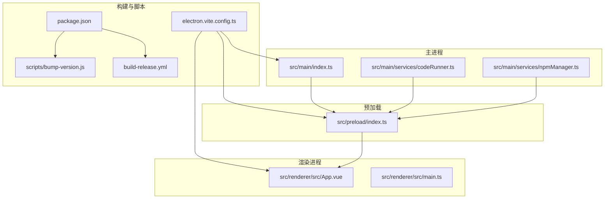
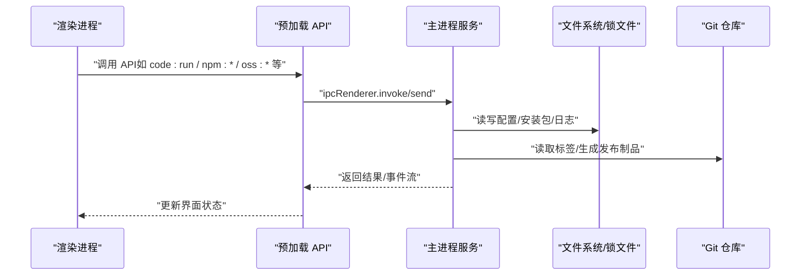
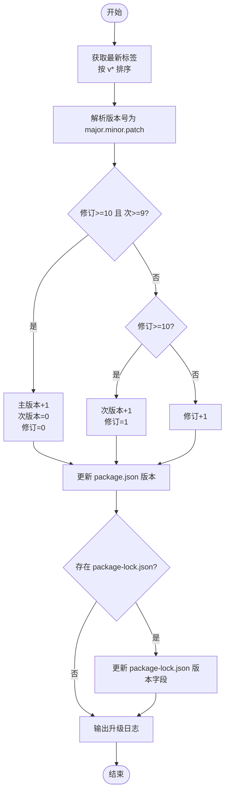
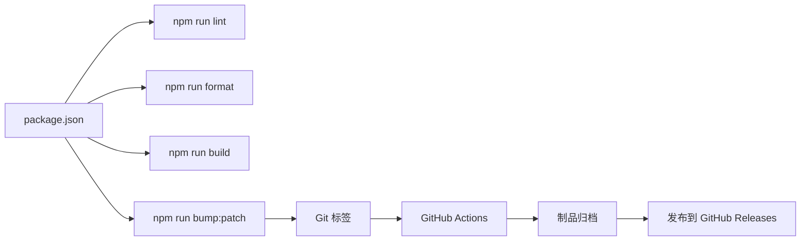

# 开发辅助工具

<cite>
**本文引用的文件**
- [scripts/bump-version.js](file://scripts/bump-version.js)
- [.prettierrc](file://.prettierrc)
- [eslint.config.mjs](file://eslint.config.mjs)
- [package.json](file://package.json)
- [README.md](file://README.md)
- [.github/workflows/build-release.yml](file://.github/workflows/build-release.yml)
- [electron.vite.config.ts](file://electron.vite.config.ts)
- [tsconfig.json](file://tsconfig.json)
- [DEVELOPMENT.md](file://DEVELOPMENT.md)
- [src/main/services/codeRunner.ts](file://src/main/services/codeRunner.ts)
- [src/main/services/npmManager.ts](file://src/main/services/npmManager.ts)
- [src/preload/index.ts](file://src/preload/index.ts)
</cite>

## 目录
1. [简介](#简介)
2. [项目结构](#项目结构)
3. [核心组件](#核心组件)
4. [架构总览](#架构总览)
5. [详细组件分析](#详细组件分析)
6. [依赖关系分析](#依赖关系分析)
7. [性能考虑](#性能考虑)
8. [故障排除指南](#故障排除指南)
9. [结论](#结论)
10. [附录](#附录)

## 简介
本项目是一个基于 Electron + Vue 3 + TypeScript 的桌面开发工具集合，提供代码运行器、NPM 包管理、域名/IP 查询、HTTP 请求调试、OSS 上传、SQL Expert（MySQL + AI 分析）、Dock 悬浮工具栏等能力。本文档聚焦开发辅助工具，围绕以下主题展开：
- 版本管理脚本 bump-version.js 的功能与使用，包括版本号升级策略、Git 标签管理与发布流程自动化
- Prettier 代码格式化配置与使用指南（规则定制、IDE 集成、CI/CD 集成）
- ESLint 代码规范配置的实现原理（规则定义、插件配置、自定义规则开发）
- 开发工作流优化建议（提交规范、分支管理、自动化测试与质量门禁）
- 实际配置示例与故障排除指南

## 项目结构
项目采用 Electron-Vite 多入口架构，分为主进程、预加载（Preload）与渲染进程三层；同时提供脚本工具与构建发布配置，便于本地开发与自动化发布。

图示来源
- [electron.vite.config.ts:1-49](file://electron.vite.config.ts#L1-L49)
- [package.json:12-27](file://package.json#L12-L27)
- [scripts/bump-version.js:1-72](file://scripts/bump-version.js#L1-L72)
- [.github/workflows/build-release.yml:1-91](file://.github/workflows/build-release.yml#L1-L91)

章节来源
- [README.md:140-163](file://README.md#L140-L163)
- [DEVELOPMENT.md:68-102](file://DEVELOPMENT.md#L68-L102)

## 核心组件
- 版本管理脚本：根据 Git 最新标签计算下一个版本号，更新 package.json 与 package-lock.json，并输出升级日志
- 代码格式化：Prettier 配置文件定义统一格式化规则，配合 npm scripts 一键格式化
- 代码规范：ESLint 通过共享配置与插件组合，对 TS/TSX/Vue 文件进行静态检查
- 构建与发布：electron-vite 配置多入口，package.json 定义构建脚本与 electron-builder 发布配置，GitHub Actions 自动化打包与发布

章节来源
- [scripts/bump-version.js:51-72](file://scripts/bump-version.js#L51-L72)
- [.prettierrc:1-9](file://.prettierrc#L1-L9)
- [eslint.config.mjs:1-29](file://eslint.config.mjs#L1-L29)
- [package.json:12-27](file://package.json#L12-L27)
- [electron.vite.config.ts:1-49](file://electron.vite.config.ts#L1-L49)

## 架构总览
项目采用三层架构与 IPC 通信：
- Renderer（Vue）：负责 UI 与交互，不直接使用 Node 能力
- Preload（contextBridge）：通过白名单 API 暴露给渲染进程
- Main（Electron）：实现系统能力、网络、文件、数据库、AI 调用等

图示来源
- [src/preload/index.ts:10-229](file://src/preload/index.ts#L10-L229)
- [src/main/services/codeRunner.ts:98-200](file://src/main/services/codeRunner.ts#L98-L200)
- [src/main/services/npmManager.ts:153-194](file://src/main/services/npmManager.ts#L153-L194)

章节来源
- [DEVELOPMENT.md:106-128](file://DEVELOPMENT.md#L106-L128)
- [src/preload/index.ts:10-229](file://src/preload/index.ts#L10-L229)

## 详细组件分析

### 版本管理脚本 bump-version.js
- 功能概述
  - 读取 Git 标签列表并按语义化版本排序，取最新标签
  - 解析版本号为三段式（主/次/修订），若不存在则默认 v0.0.0
  - 根据自定义升级策略计算下一个版本号
  - 更新 package.json 与 package-lock.json 的 version 字段
  - 输出升级日志，便于 CI/CD 记录

- 版本号升级策略
  - 当修订 >= 10 且次版本 >= 9 时，主版本 +1，次版本与修订重置为 0
  - 当修订 >= 10 时，次版本 +1，修订重置为 1
  - 否则，修订 +1
  - 该策略适配项目内部的版本节奏，避免修订位频繁溢出导致主版本增长缓慢

- Git 标签管理与发布流程自动化
  - 本地执行脚本生成新版本号并提交
  - GitHub Actions 根据 package.json 的版本号生成发布标签并上传制品
  - 发布流程包含 Windows 与 macOS 平台构建与制品归档

图示来源
- [scripts/bump-version.js:5-72](file://scripts/bump-version.js#L5-L72)

章节来源
- [scripts/bump-version.js:5-72](file://scripts/bump-version.js#L5-L72)
- [.github/workflows/build-release.yml:64-85](file://.github/workflows/build-release.yml#L64-L85)
- [package.json:12-27](file://package.json#L12-L27)

### Prettier 代码格式化配置与使用
- 配置规则
  - 不使用分号；制表符宽度为 2；单引号；行长 100；不使用尾随逗号；箭头函数括号总是保留
  - 以上规则适用于所有受 Prettier 管理的文件类型

- 使用指南
  - 一键格式化：执行 npm run format，对项目根目录进行格式化
  - IDE 集成：推荐在编辑器中启用 Prettier 插件，并配置保存时自动格式化
  - CI/CD 集成：可在 CI 步骤中加入 prettier --check 或 --write，确保代码风格一致性

章节来源
- [.prettierrc:1-9](file://.prettierrc#L1-L9)
- [package.json:14](file://package.json#L14)

### ESLint 代码规范配置与实现原理
- 配置实现
  - 使用共享配置：引入 @electron-toolkit/eslint-config-ts 与 @electron-toolkit/eslint-config-prettier
  - 针对 Vue 文件：启用 eslint-plugin-vue，使用 vue-eslint-parser，解析器为 @typescript-eslint/parser
  - 规则覆盖：继承推荐规则集，忽略 node_modules/out/dist 目录
  - 自定义规则：关闭多词组件名与禁止使用 v-html 等规则，以适配项目现状

- 规则定义与插件配置
  - TS/TSX/Vue 统一由 ESLint 管理，结合 Prettier 保持格式一致
  - 通过 defineConfig 组织配置数组，便于扩展与维护

- 自定义规则开发建议
  - 建议在现有配置基础上新增规则时，遵循团队约定与项目目标
  - 可参考共享配置的规则命名与分组方式，保持一致性

章节来源
- [eslint.config.mjs:1-29](file://eslint.config.mjs#L1-L29)
- [package.json:52-73](file://package.json#L52-L73)

### 开发工作流优化建议
- 代码提交规范
  - 建议采用约定式提交（如 feat/fix/docs/chore 等），便于自动生成变更日志与版本号
  - 配合脚本 bump:patch，形成“提交 -> 版本号升级 -> 标签 -> 发布”的闭环

- 分支管理策略
  - 主分支（main）用于稳定发布；特性分支从 main 切出，合并前进行代码审查与质量检查
  - 发布前在 main 上打标签，触发 GitHub Actions 自动构建与发布

- 自动化测试与质量门禁
  - 在 CI 中增加 lint 与 typecheck 步骤，作为合并门禁
  - 可选地加入单元测试与 E2E 测试，提升发布质量

章节来源
- [package.json:12-18](file://package.json#L12-L18)
- [.github/workflows/build-release.yml:1-91](file://.github/workflows/build-release.yml#L1-L91)

## 依赖关系分析
- 构建与脚本
  - electron.vite.config.ts 定义主进程、预加载与渲染进程的多入口与别名
  - package.json 定义构建脚本、依赖与 electron-builder 发布配置
  - bump-version.js 与 GitHub Actions 共同完成版本号与发布自动化

- 代码质量
  - Prettier 与 ESLint 通过 npm scripts 统一入口，保证本地与 CI 一致

图示来源
- [package.json:12-27](file://package.json#L12-L27)
- [.github/workflows/build-release.yml:64-91](file://.github/workflows/build-release.yml#L64-L91)

章节来源
- [electron.vite.config.ts:1-49](file://electron.vite.config.ts#L1-L49)
- [package.json:74-118](file://package.json#L74-L118)

## 性能考虑
- 代码运行器（RunJS）
  - 通过全局劫持 http/https/net 的 createServer，追踪活跃服务并在每次执行前清理，避免端口占用
  - 使用沙箱执行用户代码，限制可 require 范围，兼顾安全与可用性
- NPM 管理
  - 使用 npmmirror 源加速安装，设置超时与错误兜底，提升安装稳定性
- 构建与打包
  - electron-vite 多入口与 Rollup 输入配置，减少打包体积与提升构建效率

章节来源
- [src/main/services/codeRunner.ts:25-96](file://src/main/services/codeRunner.ts#L25-L96)
- [src/main/services/npmManager.ts:153-194](file://src/main/services/npmManager.ts#L153-L194)
- [electron.vite.config.ts:31-47](file://electron.vite.config.ts#L31-L47)

## 故障排除指南
- 版本升级失败
  - 检查是否存在 v* 格式的 Git 标签；若无则脚本会回退到 v0.0.0
  - 确认 package.json 与 package-lock.json 权限可写
- ESLint 报错
  - 检查共享配置是否正确引入；确认 Vue 文件解析器与插件版本匹配
  - 忽略目录配置是否覆盖了目标文件
- Prettier 格式化不生效
  - 确认编辑器已启用 Prettier 插件；检查 .prettierrc 是否被正确读取
- CI 发布失败
  - 检查 GitHub Token 权限与 Actions 设置；确认 package.json 版本号与标签一致
- RunJS 安装包失败
  - 检查 NPM 安装目录权限与网络代理；必要时切换至默认目录
- 端口扫描慢
  - 优先安装 nmap；无 nmap 时回退 Socket 扫描，仅覆盖常见端口

章节来源
- [scripts/bump-version.js:5-16](file://scripts/bump-version.js#L5-L16)
- [eslint.config.mjs:1-29](file://eslint.config.mjs#L1-L29)
- [.prettierrc:1-9](file://.prettierrc#L1-L9)
- [.github/workflows/build-release.yml:64-85](file://.github/workflows/build-release.yml#L64-L85)
- [src/main/services/npmManager.ts:53-80](file://src/main/services/npmManager.ts#L53-L80)
- [DEVELOPMENT.md:327-347](file://DEVELOPMENT.md#L327-L347)

## 结论
本项目通过脚本、配置与 CI/CD 的协同，实现了版本号升级与发布的自动化；借助 Prettier 与 ESLint 统一了代码风格与质量标准；通过 Electron-Vite 的多入口架构与 IPC 通信，构建了清晰的三层分离与可扩展的模块体系。建议在现有基础上进一步完善提交规范、分支策略与测试覆盖率，持续提升开发效率与发布质量。

## 附录
- 常用命令
  - 代码检查：npm run lint
  - 类型检查：npm run typecheck
  - 格式化：npm run format
  - 构建：npm run build
  - 版本号补丁升级：npm run bump:patch
- 发布配置
  - electron-builder 已配置 appId、输出目录与 GitHub 发布信息
  - GitHub Actions 自动构建 Windows 与 macOS 平台制品并上传到 Release

章节来源
- [README.md:96-114](file://README.md#L96-L114)
- [package.json:74-118](file://package.json#L74-L118)
- [.github/workflows/build-release.yml:12-91](file://.github/workflows/build-release.yml#L12-L91)