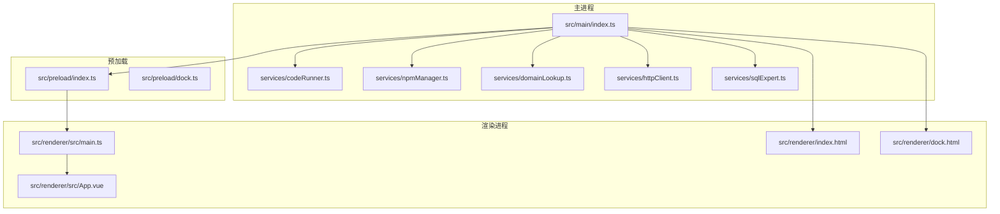
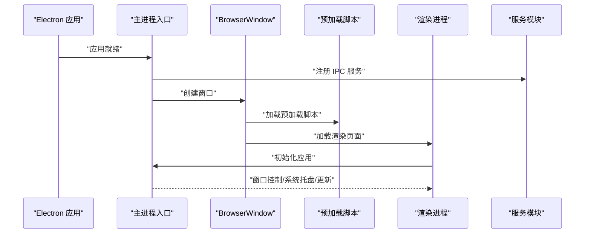
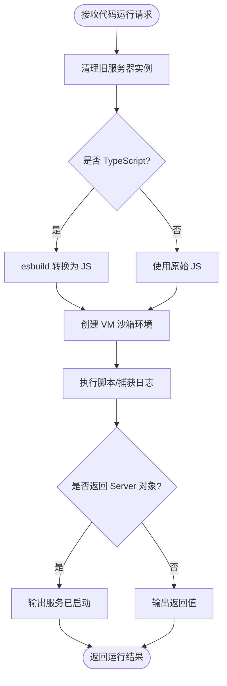
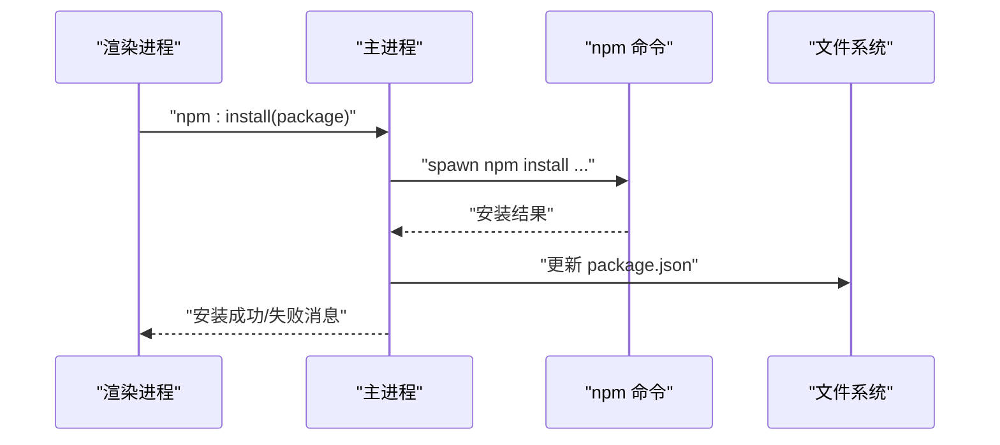
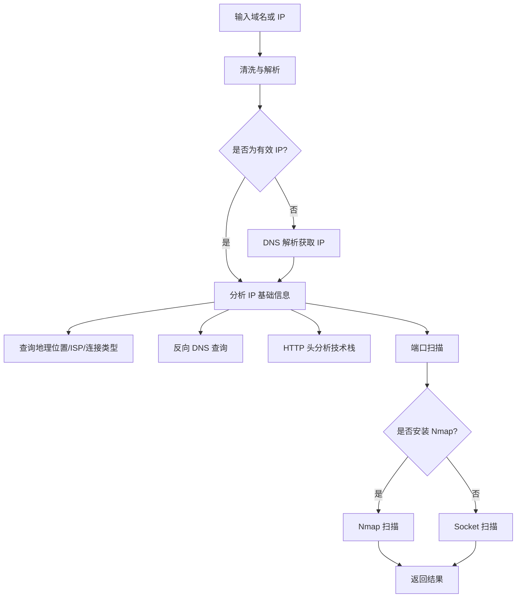
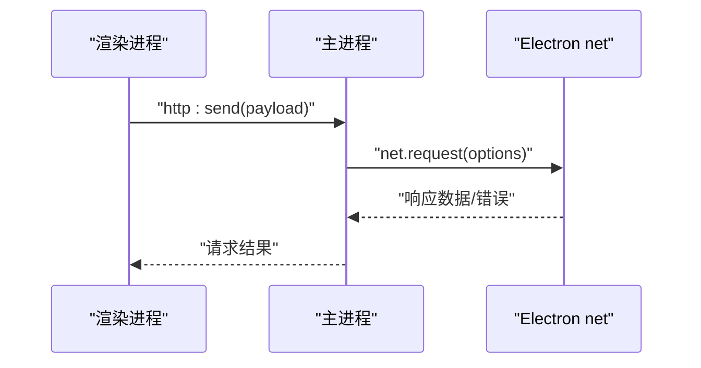
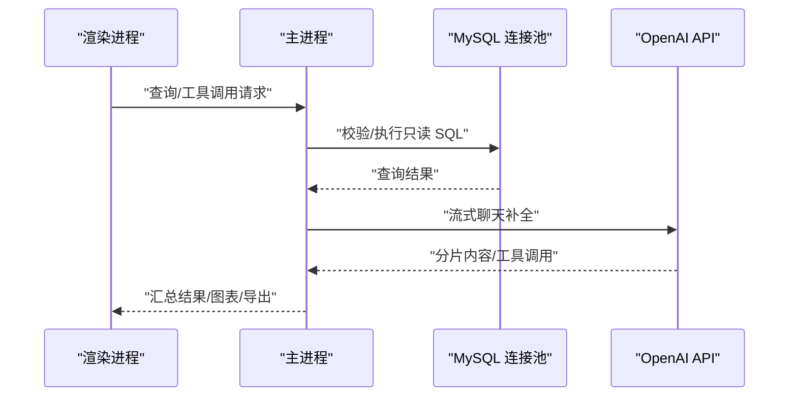
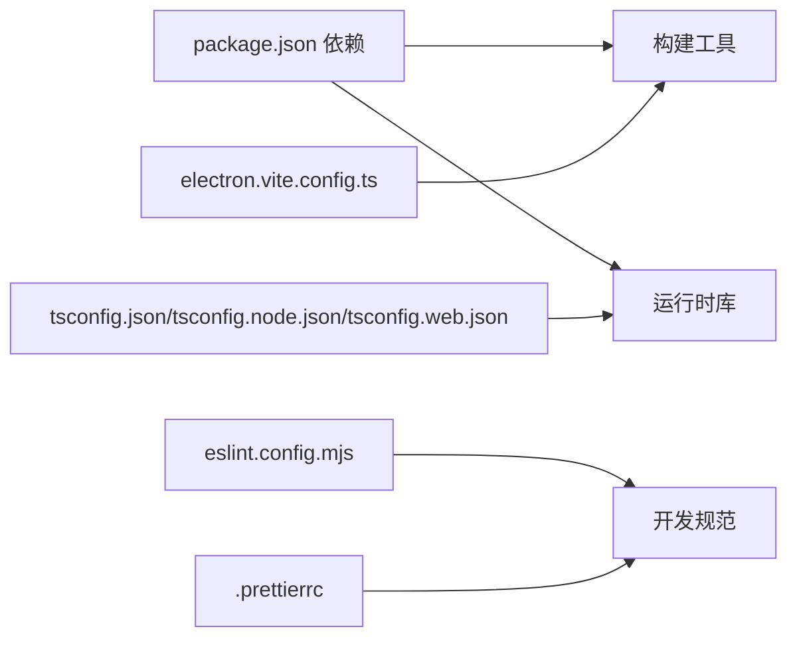

# 快速开始

<cite>
**本文档引用的文件**
- [README.md](file://README.md)
- [package.json](file://package.json)
- [electron.vite.config.ts](file://electron.vite.config.ts)
- [tsconfig.json](file://tsconfig.json)
- [tsconfig.node.json](file://tsconfig.node.json)
- [tsconfig.web.json](file://tsconfig.web.json)
- [eslint.config.mjs](file://eslint.config.mjs)
- [.prettierrc](file://.prettierrc)
- [src/main/index.ts](file://src/main/index.ts)
- [src/main/services/codeRunner.ts](file://src/main/services/codeRunner.ts)
- [src/main/services/npmManager.ts](file://src/main/services/npmManager.ts)
- [src/main/services/domainLookup.ts](file://src/main/services/domainLookup.ts)
- [src/main/services/httpClient.ts](file://src/main/services/httpClient.ts)
- [src/main/services/sqlExpert.ts](file://src/main/services/sqlExpert.ts)
- [src/renderer/src/main.ts](file://src/renderer/src/main.ts)
</cite>

## 目录
1. [简介](#简介)
2. [项目结构](#项目结构)
3. [核心组件](#核心组件)
4. [架构总览](#架构总览)
5. [详细组件分析](#详细组件分析)
6. [依赖分析](#依赖分析)
7. [性能考虑](#性能考虑)
8. [故障排除指南](#故障排除指南)
9. [结论](#结论)
10. [附录](#附录)

## 简介
开发者工具箱是一个基于 Electron + Vue 3 + TypeScript 的桌面开发工具集合，旨在为日常开发与运维场景提供一体化的工具平台。项目包含代码运行器、NPM 包管理、域名/IP 查询与端口扫描、HTTP 请求调试、阿里云 OSS 上传管理、MySQL + AI 的 SQL 分析助手、仿 macOS Dock 的悬浮快捷工具栏等模块。

## 项目结构
项目采用 Electron + Vite 的多进程架构，分为主进程（Electron 主进程与 IPC 服务）、预加载（Preload Bridge）与渲染进程（Vue 应用）。构建配置由 electron-vite 管理，支持多入口（主窗口与 Dock 窗口）。

**图示来源**
- [src/main/index.ts:1-444](file://src/main/index.ts#L1-L444)
- [src/preload/index.ts](file://src/preload/index.ts)
- [src/preload/dock.ts](file://src/preload/dock.ts)
- [src/renderer/src/main.ts:1-6](file://src/renderer/src/main.ts#L1-L6)
- [src/renderer/index.html](file://src/renderer/index.html)
- [src/renderer/dock.html](file://src/renderer/dock.html)

**章节来源**
- [README.md:86-163](file://README.md#L86-L163)
- [electron.vite.config.ts:1-49](file://electron.vite.config.ts#L1-L49)

## 核心组件
- 主进程入口负责窗口创建、IPC 通信、系统托盘、自动更新、代理设置、开机自启动等。
- 代码运行器：支持 JS/TS 运行、实时日志、服务器资源清理、端口终止。
- NPM 包管理：搜索、安装、卸载、切换版本、类型定义读取与自动补全。
- 域名/IP 查询：DNS 解析、地理位置、ISP、反向 DNS、HTTP 头分析、端口扫描（Nmap 优先，无则回退 Socket）。
- HTTP 客户端：在主进程发起请求，绕过前端 CORS 限制，自动使用应用代理。
- SQL 专家：MySQL 连接、只读 SQL 校验、AI 工具调用（查询、描述表、渲染图表、导出 CSV、保存记忆）。
- Dock 模块：独立透明悬浮窗口，支持停靠位置与应用项管理。

**章节来源**
- [src/main/index.ts:1-444](file://src/main/index.ts#L1-L444)
- [src/main/services/codeRunner.ts:1-461](file://src/main/services/codeRunner.ts#L1-L461)
- [src/main/services/npmManager.ts:1-635](file://src/main/services/npmManager.ts#L1-L635)
- [src/main/services/domainLookup.ts:1-690](file://src/main/services/domainLookup.ts#L1-L690)
- [src/main/services/httpClient.ts:1-113](file://src/main/services/httpClient.ts#L1-L113)
- [src/main/services/sqlExpert.ts:1-800](file://src/main/services/sqlExpert.ts#L1-L800)

## 架构总览
下图展示了应用启动到功能模块启用的关键流程，包括主进程初始化、IPC 注册、窗口创建与渲染进程挂载。

**图示来源**
- [src/main/index.ts:412-444](file://src/main/index.ts#L412-L444)
- [src/renderer/src/main.ts:1-6](file://src/renderer/src/main.ts#L1-L6)

**章节来源**
- [src/main/index.ts:412-444](file://src/main/index.ts#L412-L444)
- [src/renderer/src/main.ts:1-6](file://src/renderer/src/main.ts#L1-L6)

## 详细组件分析

### 代码运行器（RunJS）
- 功能要点：支持 JavaScript/TypeScript 运行、实时日志、服务器资源追踪与清理、端口终止、安全沙箱。
- 关键机制：通过 esbuild 将 TS 转换为 JS；使用 vm 创建沙箱环境；劫持 http/https/net 模块以追踪服务器实例；提供清理与端口终止能力。
- IPC 接口：code:run、code:stop、code:clean、code:killPort。

**图示来源**
- [src/main/services/codeRunner.ts:98-318](file://src/main/services/codeRunner.ts#L98-L318)

**章节来源**
- [src/main/services/codeRunner.ts:1-461](file://src/main/services/codeRunner.ts#L1-L461)

### NPM 包管理
- 功能要点：搜索、安装、卸载、切换版本、类型定义读取、@types 自动安装、包目录配置与重置。
- 关键机制：使用子进程调用 npm，维护本地 package.json，支持用户自定义安装目录，类型文件递归收集。
- IPC 接口：npm:search、npm:install、npm:uninstall、npm:list、npm:getDir、npm:setDir、npm:resetDir、npm:versions、npm:changeVersion、npm:getTypes、npm:clearTypeCache。

**图示来源**
- [src/main/services/npmManager.ts:207-426](file://src/main/services/npmManager.ts#L207-L426)

**章节来源**
- [src/main/services/npmManager.ts:1-635](file://src/main/services/npmManager.ts#L1-L635)

### 域名/IP 查询与端口扫描
- 功能要点：DNS 解析（IPv4/IPv6）、IP 地址分类与子网分析、地理位置与 ISP、反向 DNS、HTTP 头技术栈识别、端口扫描（Nmap 优先，无则回退 Socket）。
- 关键机制：使用 Node.js dns/http/https/net 模块；Nmap 输出解析与乱码解码；Socket 批量并发扫描。
- IPC 接口：domain:lookup、domain:scanPorts。

**图示来源**
- [src/main/services/domainLookup.ts:607-689](file://src/main/services/domainLookup.ts#L607-L689)

**章节来源**
- [src/main/services/domainLookup.ts:1-690](file://src/main/services/domainLookup.ts#L1-L690)

### HTTP 请求调试
- 功能要点：在主进程发起请求，支持自定义方法/头/体/超时，自动使用应用代理设置。
- 关键机制：使用 Electron net 模块，封装响应数据与错误信息。
- IPC 接口：http:send。

**图示来源**
- [src/main/services/httpClient.ts:15-112](file://src/main/services/httpClient.ts#L15-L112)

**章节来源**
- [src/main/services/httpClient.ts:1-113](file://src/main/services/httpClient.ts#L1-L113)

### SQL 专家（分析助手）
- 功能要点：MySQL 连接测试与配置持久化、动态读取表结构、只读 SQL 校验与执行、AI 工具调用（查询、描述表、渲染图表、导出 CSV、保存记忆）、CSV 导出、图表渲染。
- 关键机制：连接池管理、SQL 语法与权限校验、AI 流式响应解析、工具调用记录与摘要、内存持久化。
- IPC 接口：数据库与 AI 相关的多组接口（详见源码）。

**图示来源**
- [src/main/services/sqlExpert.ts:418-800](file://src/main/services/sqlExpert.ts#L418-L800)

**章节来源**
- [src/main/services/sqlExpert.ts:1-800](file://src/main/services/sqlExpert.ts#L1-L800)

## 依赖分析
- 构建与开发工具：electron-vite、vite、@vitejs/plugin-vue、@types/node、eslint、prettier、vue-tsc 等。
- 运行时依赖：electron、vue、monaco-editor、axios、mysql2、openai、ali-oss、tailwindcss、daisyui 等。
- 构建配置：electron-vite 多入口（主窗口与 Dock 窗口），路径别名与插件配置。
- TypeScript 配置：分层 tsconfig（node/web），路径别名与模块解析策略。

**图示来源**
- [package.json:28-73](file://package.json#L28-L73)
- [electron.vite.config.ts:1-49](file://electron.vite.config.ts#L1-L49)
- [tsconfig.json:1-8](file://tsconfig.json#L1-L8)
- [tsconfig.node.json:1-19](file://tsconfig.node.json#L1-L19)
- [tsconfig.web.json:1-18](file://tsconfig.web.json#L1-L18)
- [eslint.config.mjs:1-29](file://eslint.config.mjs#L1-L29)
- [.prettierrc:1-9](file://.prettierrc#L1-L9)

**章节来源**
- [package.json:1-120](file://package.json#L1-L120)
- [electron.vite.config.ts:1-49](file://electron.vite.config.ts#L1-L49)
- [tsconfig.json:1-8](file://tsconfig.json#L1-L8)
- [tsconfig.node.json:1-19](file://tsconfig.node.json#L1-L19)
- [tsconfig.web.json:1-18](file://tsconfig.web.json#L1-L18)
- [eslint.config.mjs:1-29](file://eslint.config.mjs#L1-L29)
- [.prettierrc:1-9](file://.prettierrc#L1-L9)

## 性能考虑
- 代码运行器：VM 沙箱与服务器追踪避免资源泄漏；TypeScript 编译采用 esbuild；日志实时推送减少阻塞。
- NPM 管理：超时控制（60 秒）、registry 镜像加速、目录写入权限验证。
- 域名查询：Nmap 优先提升准确性与速度；无 Nmap 时使用并发 Socket 扫描；输出解码与乱码处理。
- HTTP 客户端：超时控制与错误包装；自动使用应用代理。
- SQL 专家：连接池限制并发；只读 SQL 校验与行数限制；AI 流式响应按块处理。

[本节为通用性能建议，无需特定文件引用]

## 故障排除指南
- 启动失败或黑屏
  - 检查主进程窗口创建与 ready-to-show 事件是否触发。
  - 确认开发环境 HMR URL 或本地 HTML 加载路径。
  - 参考：[src/main/index.ts:159-174](file://src/main/index.ts#L159-L174)

- 代理设置无效
  - 应用代理通过 session.setProxy 与环境变量 HTTPS_PROXY/HTTP_PROXY 生效。
  - 参考：[src/main/index.ts:306-327](file://src/main/index.ts#L306-L327)

- 自动更新失败
  - 检查网络与代理设置；错误类型包含超时/拒绝/不可达时提示配置代理。
  - 参考：[src/main/index.ts:140-157](file://src/main/index.ts#L140-L157)

- 代码运行器报模块未安装
  - 确认包已安装并在内置目录或用户目录存在；必要时重启应用。
  - 参考：[src/main/services/codeRunner.ts:444-460](file://src/main/services/codeRunner.ts#L444-L460)

- NPM 安装超时或权限不足
  - 检查安装目录写权限与网络连通性；镜像源为 npmmirror。
  - 参考：[src/main/services/npmManager.ts:154-194](file://src/main/services/npmManager.ts#L154-L194)

- 域名查询无结果或端口扫描失败
  - 确认已安装 Nmap；否则使用 Socket 扫描（范围有限）。
  - 参考：[src/main/services/domainLookup.ts:388-402](file://src/main/services/domainLookup.ts#L388-L402)

- HTTP 请求超时或错误
  - 调整超时时间；检查代理设置；确认 URL 与方法。
  - 参考：[src/main/services/httpClient.ts:15-112](file://src/main/services/httpClient.ts#L15-L112)

**章节来源**
- [src/main/index.ts:140-174](file://src/main/index.ts#L140-L174)
- [src/main/services/codeRunner.ts:444-460](file://src/main/services/codeRunner.ts#L444-L460)
- [src/main/services/npmManager.ts:154-194](file://src/main/services/npmManager.ts#L154-L194)
- [src/main/services/domainLookup.ts:388-402](file://src/main/services/domainLookup.ts#L388-L402)
- [src/main/services/httpClient.ts:15-112](file://src/main/services/httpClient.ts#L15-L112)

## 结论
开发者工具箱提供了从代码运行、包管理、网络诊断到数据库与 AI 辅助分析的一站式桌面开发体验。通过 Electron + Vue + TypeScript 的组合与 electron-vite 的现代化构建体系，项目具备良好的扩展性与可维护性。按照本文档的环境准备、安装与启动步骤，新手开发者可在最短时间内上手并开展日常开发与运维工作。

[本节为总结性内容，无需特定文件引用]

## 附录

### 环境要求与前置条件
- Node.js 与包管理器
  - 使用 npm 作为包管理器，项目包含 postinstall 钩子安装应用依赖。
  - 参考：[package.json:22](file://package.json#L22)

- 操作系统兼容性
  - 主进程通过 Electron 调用系统 API（托盘、窗口、代理等），适用于 Windows、macOS、Linux。
  - 参考：[src/main/index.ts:39-41](file://src/main/index.ts#L39-L41)

- 可选工具
  - Nmap：用于域名/IP 端口扫描（优先使用）。
  - 参考：[src/main/services/domainLookup.ts:388-402](file://src/main/services/domainLookup.ts#L388-L402)

**章节来源**
- [package.json:22](file://package.json#L22)
- [src/main/index.ts:39-41](file://src/main/index.ts#L39-L41)
- [src/main/services/domainLookup.ts:388-402](file://src/main/services/domainLookup.ts#L388-L402)

### 依赖安装步骤
- 安装依赖
  - 使用 npm install 安装项目依赖。
  - 参考：[README.md:88-94](file://README.md#L88-L94)

- Post-install（可选）
  - 项目配置了 postinstall 钩子以安装应用依赖。
  - 参考：[package.json:22](file://package.json#L22)

**章节来源**
- [README.md:88-94](file://README.md#L88-L94)
- [package.json:22](file://package.json#L22)

### 开发环境启动
- 启动开发服务器
  - 使用 npm run dev 启动 electron-vite 开发服务器。
  - 参考：[README.md:88-94](file://README.md#L88-L94)

- 预览（非开发模式）
  - 使用 npm run start 进行预览。
  - 参考：[package.json:19](file://package.json#L19)

**章节来源**
- [README.md:88-94](file://README.md#L88-L94)
- [package.json:19](file://package.json#L19)

### 常见开发命令
- 代码检查
  - npm run lint（ESLint）
  - npm run typecheck（TypeScript 类型检查）
  - 参考：[README.md:96-114](file://README.md#L96-L114)

- 格式化
  - npm run format（Prettier）
  - 参考：[README.md:96-114](file://README.md#L96-L114)

- 构建
  - npm run build（类型检查 + 构建）
  - npm run build:win / build:mac / build:linux（打包）
  - 参考：[README.md:96-114](file://README.md#L96-L114)

- 版本号补丁升级
  - npm run bump:patch（脚本）
  - 参考：[README.md:96-114](file://README.md#L96-L114)

**章节来源**
- [README.md:96-114](file://README.md#L96-L114)
- [package.json:12-26](file://package.json#L12-L26)

### 第一次使用完整流程
- 步骤 1：安装依赖
  - 执行 npm install。
  - 参考：[README.md:88-94](file://README.md#L88-L94)

- 步骤 2：启动开发环境
  - 执行 npm run dev。
  - 参考：[README.md:88-94](file://README.md#L88-L94)

- 步骤 3：验证功能
  - 在应用中打开各功能模块（RunJS、NPM、域名查询、HTTP、OSS、SQL Expert、Dock）进行基本验证。
  - 参考：[README.md:17-75](file://README.md#L17-L75)

- 步骤 4：配置代理（如需）
  - 在「设置」中配置代理地址（例如 http://127.0.0.1:7890）。
  - 参考：[README.md:118-121](file://README.md#L118-L121)

- 步骤 5：配置 SQL Expert（如需）
  - 在应用内配置 MySQL 连接信息与 AI 服务参数，配置会保存在 Electron 用户目录。
  - 参考：[README.md:122-129](file://README.md#L122-L129)

- 步骤 6：配置 OSS（如需）
  - 准备 accessKeyId、accessKeySecret、endpoint、bucket 等参数。
  - 参考：[README.md:131-139](file://README.md#L131-L139)

**章节来源**
- [README.md:88-139](file://README.md#L88-L139)