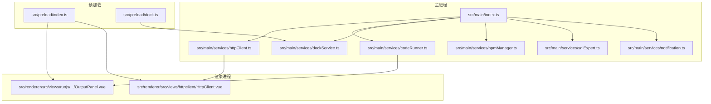
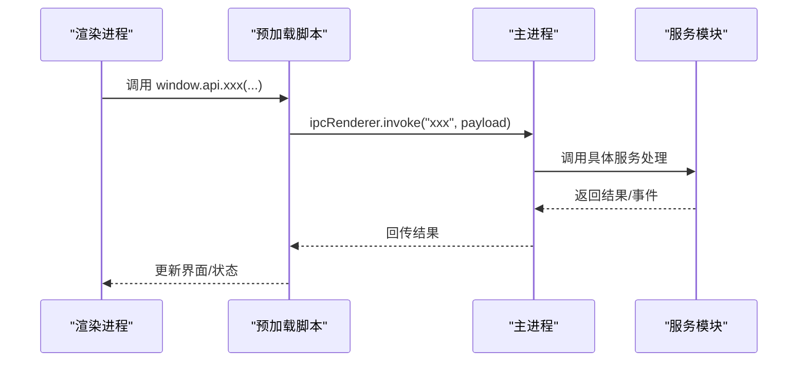
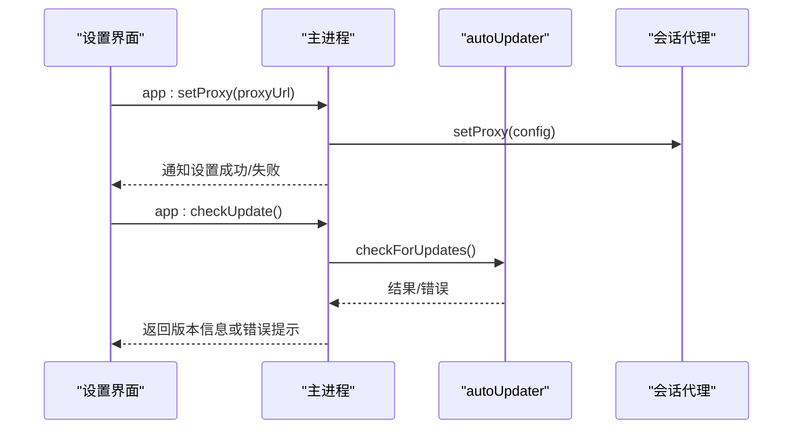
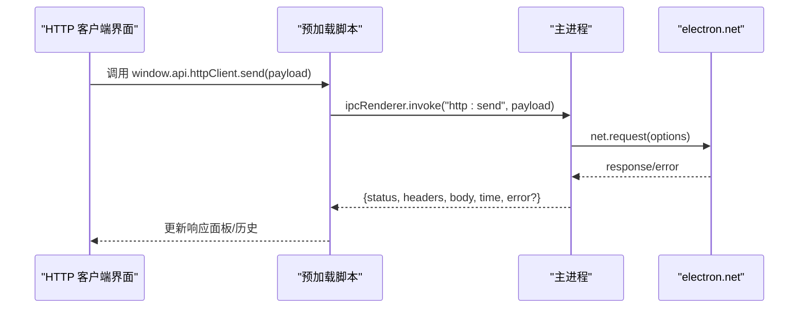
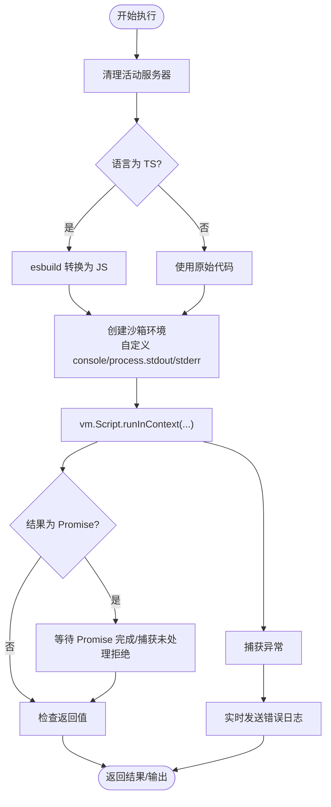
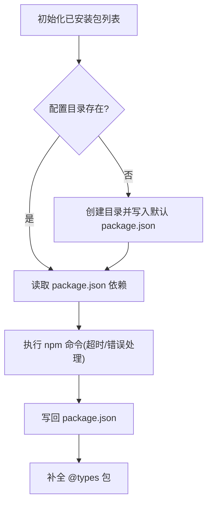
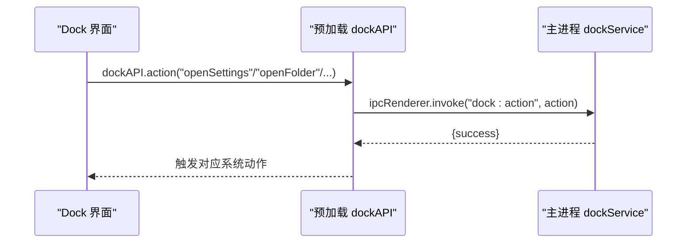
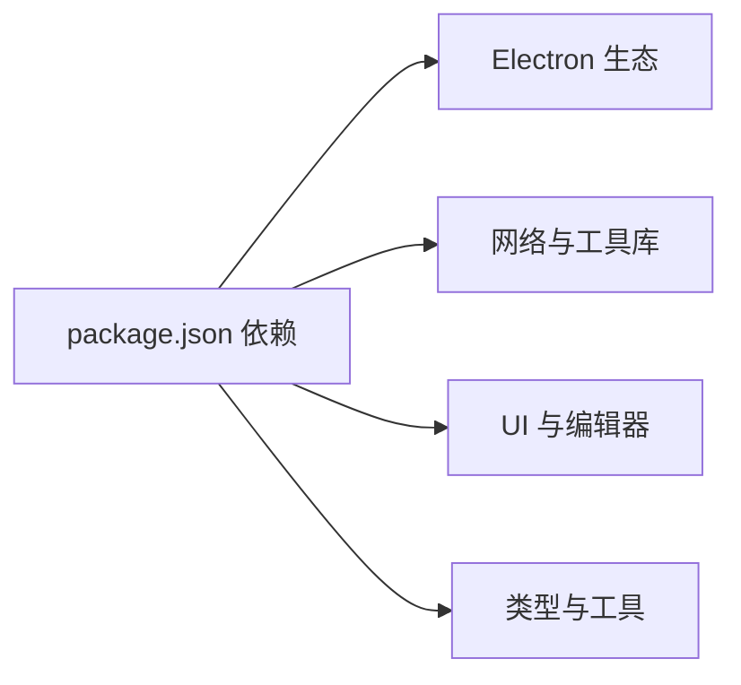

# 故障排除

<cite>
**本文引用的文件**
- [package.json](file://package.json)
- [README.md](file://README.md)
- [src/main/index.ts](file://src/main/index.ts)
- [src/main/services/notification.ts](file://src/main/services/notification.ts)
- [src/main/services/dockService.ts](file://src/main/services/dockService.ts)
- [src/main/services/httpClient.ts](file://src/main/services/httpClient.ts)
- [src/main/services/codeRunner.ts](file://src/main/services/codeRunner.ts)
- [src/main/services/npmManager.ts](file://src/main/services/npmManager.ts)
- [src/main/services/sqlExpert.ts](file://src/main/services/sqlExpert.ts)
- [src/preload/index.ts](file://src/preload/index.ts)
- [src/preload/dock.ts](file://src/preload/dock.ts)
- [src/renderer/src/views/runjs/components/OutputPanel.vue](file://src/renderer/src/views/runjs/components/OutputPanel.vue)
- [src/renderer/src/views/httpclient/HttpClient.vue](file://src/renderer/src/views/httpclient/HttpClient.vue)
</cite>

## 目录
1. [简介](#简介)
2. [项目结构](#项目结构)
3. [核心组件](#核心组件)
4. [架构总览](#架构总览)
5. [详细组件分析](#详细组件分析)
6. [依赖分析](#依赖分析)
7. [性能考虑](#性能考虑)
8. [故障排除指南](#故障排除指南)
9. [结论](#结论)
10. [附录](#附录)

## 简介
本指南面向开发者工具箱（Dev Toolbox）的使用者与维护者，聚焦安装、运行时错误、网络连接、功能异常等问题的系统化排查与解决。内容涵盖调试方法、日志分析、性能优化、内存泄漏排查、崩溃分析、错误代码对照与社区支持渠道，帮助快速定位与修复问题。

## 项目结构
项目采用 Electron + Vue 3 + TypeScript 架构，主进程负责系统托盘、自动更新、IPC 服务与系统集成；渲染进程承载各功能视图；预加载脚本提供安全的 IPC 桥接。

**图表来源**
- [src/main/index.ts:1-444](file://src/main/index.ts#L1-L444)
- [src/main/services/httpClient.ts:1-113](file://src/main/services/httpClient.ts#L1-L113)
- [src/main/services/codeRunner.ts:1-461](file://src/main/services/codeRunner.ts#L1-L461)
- [src/main/services/dockService.ts:1-243](file://src/main/services/dockService.ts#L1-L243)
- [src/main/services/npmManager.ts:1-635](file://src/main/services/npmManager.ts#L1-L635)
- [src/main/services/sqlExpert.ts:1-1200](file://src/main/services/sqlExpert.ts#L1-L1200)
- [src/preload/index.ts:65-95](file://src/preload/index.ts#L65-L95)
- [src/preload/dock.ts:1-18](file://src/preload/dock.ts#L1-L18)
- [src/renderer/src/views/runjs/components/OutputPanel.vue:180-250](file://src/renderer/src/views/runjs/components/OutputPanel.vue#L180-L250)
- [src/renderer/src/views/httpclient/HttpClient.vue:1-232](file://src/renderer/src/views/httpclient/HttpClient.vue#L1-L232)

**章节来源**
- [README.md:1-163](file://README.md#L1-L163)
- [package.json:1-120](file://package.json#L1-L120)

## 核心组件
- 自动更新与网络代理：主进程通过 autoUpdater 与 session.setProxy 配合，支持代理设置与错误提示。
- HTTP 请求工具：主进程使用 electron.net 发送请求，规避前端 CORS 限制，并内置超时与错误处理。
- 代码运行器：基于 vm + esbuild 的沙箱执行，支持 JS/TS，自动清理活动服务器，提供实时日志与错误上报。
- NPM 包管理：封装 npm 命令执行、包目录管理、类型定义读取与自动补全。
- Dock 模块：透明悬浮窗口，支持多平台动作（打开终端、浏览器、文件夹等）。
- 通知系统：统一从主进程向渲染进程推送通知消息。

**章节来源**
- [src/main/index.ts:1-444](file://src/main/index.ts#L1-L444)
- [src/main/services/httpClient.ts:1-113](file://src/main/services/httpClient.ts#L1-L113)
- [src/main/services/codeRunner.ts:1-461](file://src/main/services/codeRunner.ts#L1-L461)
- [src/main/services/npmManager.ts:1-635](file://src/main/services/npmManager.ts#L1-L635)
- [src/main/services/dockService.ts:1-243](file://src/main/services/dockService.ts#L1-L243)
- [src/main/services/notification.ts:1-29](file://src/main/services/notification.ts#L1-L29)

## 架构总览
应用通过主进程统一调度各服务，渲染进程通过 preload 暴露的安全 API 与主进程通信。自动更新、代理、托盘、Dock 等能力均在主进程实现，渲染层负责 UI 与交互。

**图表来源**
- [src/preload/index.ts:65-95](file://src/preload/index.ts#L65-L95)
- [src/main/index.ts:1-444](file://src/main/index.ts#L1-L444)

## 详细组件分析

### 自动更新与代理
- 自动更新：仅在打包状态下配置 feed，支持下载进度、下载完成与错误回调；错误消息根据网络类关键词提示设置代理。
- 代理设置：通过 session.setProxy 与环境变量 HTTPS_PROXY/HTTP_PROXY 生效，错误时统一通知。

**图表来源**
- [src/main/index.ts:129-157](file://src/main/index.ts#L129-L157)
- [src/main/index.ts:218-294](file://src/main/index.ts#L218-L294)

**章节来源**
- [src/main/index.ts:129-157](file://src/main/index.ts#L129-L157)
- [src/main/index.ts:218-294](file://src/main/index.ts#L218-L294)

### HTTP 请求工具
- 主进程使用 electron.net 发起请求，自动应用代理设置，支持超时与错误处理。
- 渲染进程负责构建请求、发起调用、展示响应与历史记录。

**图表来源**
- [src/renderer/src/views/httpclient/HttpClient.vue:125-167](file://src/renderer/src/views/httpclient/HttpClient.vue#L125-L167)
- [src/main/services/httpClient.ts:15-113](file://src/main/services/httpClient.ts#L15-L113)

**章节来源**
- [src/renderer/src/views/httpclient/HttpClient.vue:1-232](file://src/renderer/src/views/httpclient/HttpClient.vue#L1-L232)
- [src/main/services/httpClient.ts:1-113](file://src/main/services/httpClient.ts#L1-L113)

### 代码运行器（RunJS）
- 沙箱执行：使用 vm + esbuild 编译 TS，自定义 console 捕获输出，限制输出长度与对象深度。
- 服务器追踪：劫持 http/https/net 模块，跟踪并清理活动 Server，避免端口占用。
- 日志与错误：实时通过 IPC 发送日志，错误时统一上报。

**图表来源**
- [src/main/services/codeRunner.ts:98-235](file://src/main/services/codeRunner.ts#L98-L235)

**章节来源**
- [src/main/services/codeRunner.ts:1-461](file://src/main/services/codeRunner.ts#L1-L461)
- [src/renderer/src/views/runjs/components/OutputPanel.vue:180-250](file://src/renderer/src/views/runjs/components/OutputPanel.vue#L180-L250)

### NPM 包管理
- 包目录：默认位于 userData 下的 npm_packages，支持自定义安装目录与回退策略。
- 命令执行：封装 npm 命令，带超时与错误处理，镜像源指向国内镜像。
- 类型补全：自动尝试补全 @types/* 并保存 package.json。

**图表来源**
- [src/main/services/npmManager.ts:23-194](file://src/main/services/npmManager.ts#L23-L194)

**章节来源**
- [src/main/services/npmManager.ts:1-635](file://src/main/services/npmManager.ts#L1-L635)

### Dock 模块
- 透明悬浮窗口：始终置顶，支持底部/左右停靠，自动隐藏与放大效果。
- 动作处理：打开设置、打开文件夹、打开终端、打开浏览器、打开指定 URL 或应用。

**图表来源**
- [src/preload/dock.ts:1-18](file://src/preload/dock.ts#L1-L18)
- [src/main/services/dockService.ts:161-228](file://src/main/services/dockService.ts#L161-L228)

**章节来源**
- [src/main/services/dockService.ts:1-243](file://src/main/services/dockService.ts#L1-L243)
- [src/preload/dock.ts:1-18](file://src/preload/dock.ts#L1-L18)

### 通知系统
- 统一通知：主进程通过 BrowserWindow 向渲染进程发送通知，支持 info/success/warning/error。

**章节来源**
- [src/main/services/notification.ts:1-29](file://src/main/services/notification.ts#L1-L29)

## 依赖分析
- Electron 与构建：electron-vite、electron-builder、electron-updater。
- 网络与工具：axios、esbuild、mysql2、openai、ali-oss、monaco-editor、echarts 等。
- UI 与样式：Vue 3、TailwindCSS、DaisyUI、markdown-it、highlight.js。

**图表来源**
- [package.json:28-73](file://package.json#L28-L73)

**章节来源**
- [package.json:1-120](file://package.json#L1-L120)

## 性能考虑
- 代码运行器输出限制：对数组、日期、正则、Error、Server 等特殊类型进行格式化与长度限制，避免巨大日志影响性能。
- HTTP 请求超时：默认 30 秒，超时主动 abort，减少资源占用。
- NPM 命令超时：默认 60 秒，避免长时间阻塞。
- Dock 窗口尺寸计算：根据图标数量与分隔符动态计算，减少无效绘制。

**章节来源**
- [src/main/services/codeRunner.ts:329-362](file://src/main/services/codeRunner.ts#L329-L362)
- [src/main/services/httpClient.ts:38-50](file://src/main/services/httpClient.ts#L38-L50)
- [src/main/services/npmManager.ts:188-194](file://src/main/services/npmManager.ts#L188-L194)
- [src/main/services/dockService.ts:29-62](file://src/main/services/dockService.ts#L29-L62)

## 故障排除指南

### 通用排查步骤
- 检查系统日志与应用通知：主进程通过通知模块推送错误信息，关注“更新失败”“设置代理失败”“请求超时”等提示。
- 开启开发者工具：开发模式下可按 F12 打开 DevTools，查看 Console 与 Network。
- 复现最小化问题：尽量使用最小输入复现，便于定位。

**章节来源**
- [src/main/services/notification.ts:1-29](file://src/main/services/notification.ts#L1-L29)
- [src/main/index.ts:417-419](file://src/main/index.ts#L417-L419)

### 安装与构建问题
- 依赖安装失败
  - 现象：npm install 或 npm run build 报错。
  - 排查：确认网络可达，必要时配置 npm registry 镜像；检查 Node 版本与系统权限。
  - 参考：NPM 命令封装与镜像源配置。
- 构建产物缺失
  - 现象：dist 目录为空或缺少资源。
  - 排查：执行 npm run build，确认类型检查通过；检查 electron-builder 配置与资源路径。

**章节来源**
- [src/main/services/npmManager.ts:154-194](file://src/main/services/npmManager.ts#L154-L194)
- [package.json:12-27](file://package.json#L12-L27)

### 运行时错误

#### 代码运行器（RunJS）
- 现象：运行长时间运行的服务后端口占用、无法再次启动。
  - 排查：使用“清理资源”或“按端口终止进程”，确保活动服务器被正确关闭。
  - 参考：服务器追踪与清理逻辑。
- 现象：输出过大导致卡顿或崩溃。
  - 排查：代码运行器对输出进行了长度与对象深度限制，检查是否输出了超大对象。
- 现象：TypeScript 编译失败。
  - 排查：确认 esbuild 可用与语法正确；查看实时日志中的编译错误。

**章节来源**
- [src/main/services/codeRunner.ts:78-96](file://src/main/services/codeRunner.ts#L78-L96)
- [src/main/services/codeRunner.ts:118-235](file://src/main/services/codeRunner.ts#L118-L235)
- [src/renderer/src/views/runjs/components/OutputPanel.vue:180-250](file://src/renderer/src/views/runjs/components/OutputPanel.vue#L180-L250)

#### HTTP 请求工具
- 现象：请求超时或失败。
  - 排查：检查代理设置；确认目标地址可访问；查看响应中的 error 字段。
- 现象：CORS 限制导致前端请求失败。
  - 说明：该工具在主进程发起请求，绕过前端 CORS 限制，无需前端处理。

**章节来源**
- [src/main/services/httpClient.ts:38-50](file://src/main/services/httpClient.ts#L38-L50)
- [src/main/services/httpClient.ts:79-92](file://src/main/services/httpClient.ts#L79-L92)
- [src/renderer/src/views/httpclient/HttpClient.vue:125-167](file://src/renderer/src/views/httpclient/HttpClient.vue#L125-L167)

#### NPM 包管理
- 现象：安装超时或失败。
  - 排查：检查网络与镜像源；查看命令输出；确认目录权限。
- 现象：类型定义缺失。
  - 排查：触发类型补全流程；确认 @types 包命名规范。

**章节来源**
- [src/main/services/npmManager.ts:154-194](file://src/main/services/npmManager.ts#L154-L194)
- [src/main/services/npmManager.ts:196-200](file://src/main/services/npmManager.ts#L196-L200)

#### Dock 模块
- 现象：Dock 窗口无法打开或显示异常。
  - 排查：确认主窗口已隐藏；检查屏幕边界与尺寸计算；查看动作处理分支。
- 现象：打开终端/浏览器失败。
  - 排查：检查平台差异与默认程序；确认路径与权限。

**章节来源**
- [src/main/services/dockService.ts:114-141](file://src/main/services/dockService.ts#L114-L141)
- [src/main/services/dockService.ts:161-228](file://src/main/services/dockService.ts#L161-L228)

#### 自动更新与代理
- 现象：检查/下载更新失败。
  - 排查：确认网络连通性；若出现超时/拒绝/解析失败等关键词，配置代理后再试。
- 现象：代理设置后仍无法联网。
  - 排查：确认 session.setProxy 与环境变量生效；重启应用后重试。

**章节来源**
- [src/main/index.ts:129-157](file://src/main/index.ts#L129-L157)
- [src/main/index.ts:218-294](file://src/main/index.ts#L218-L294)

### 网络连接问题
- 代理配置
  - 在设置中配置代理地址（如 http://127.0.0.1:7890），用于网络请求与更新检查。
- DNS/域名查询
  - 若域名解析失败，检查本地 DNS 与网络；必要时更换 DNS 服务器。
- 端口扫描
  - 优先使用 nmap，若无 nmap 则回退 Socket 扫描；无 nmap 时注意权限与防火墙。

**章节来源**
- [README.md:118-120](file://README.md#L118-L120)
- [README.md:34-41](file://README.md#L34-L41)

### 功能异常

#### SQL Expert
- 现象：连接失败或超时。
  - 排查：检查数据库连接信息与网络；适当增加超时时间；确认数据库可访问。
- 现象：Schema 加载失败。
  - 排查：确认数据库已选择具体 schema；查看错误日志。

**章节来源**
- [src/main/services/sqlExpert.ts:1158-1179](file://src/main/services/sqlExpert.ts#L1158-L1179)

#### OSS 管理
- 现象：上传失败。
  - 排查：检查 AK/SK/Endpoint/Bucket 配置；确认网络与权限；查看进度与错误信息。

**章节来源**
- [README.md:131-139](file://README.md#L131-L139)

### 日志分析与调试技巧
- 主进程日志：关注 autoUpdater 错误、HTTP 请求错误、NPM 命令输出。
- 渲染进程日志：RunJS 输出面板实时展示 stdout/stderr；HTTP 响应面板展示状态码与错误。
- 通知系统：统一通过通知模块推送错误与成功信息，便于用户感知。

**章节来源**
- [src/main/services/codeRunner.ts:110-116](file://src/main/services/codeRunner.ts#L110-L116)
- [src/renderer/src/views/runjs/components/OutputPanel.vue:180-250](file://src/renderer/src/views/runjs/components/OutputPanel.vue#L180-L250)
- [src/main/services/notification.ts:15-28](file://src/main/services/notification.ts#L15-L28)

### 性能优化建议
- 控制输出规模：避免在循环中输出大量数据；必要时分批输出。
- 合理设置超时：HTTP 请求与 NPM 命令均有限时，避免长时间阻塞。
- 释放资源：定期清理活动服务器与临时文件，避免内存泄漏。

**章节来源**
- [src/main/services/codeRunner.ts:329-362](file://src/main/services/codeRunner.ts#L329-L362)
- [src/main/services/httpClient.ts:38-50](file://src/main/services/httpClient.ts#L38-L50)
- [src/main/services/npmManager.ts:188-194](file://src/main/services/npmManager.ts#L188-L194)

### 内存泄漏排查
- 服务器追踪：代码运行器会追踪并清理活动 Server，避免端口占用与资源泄露。
- 通知与日志：通过统一通知与日志输出，观察异常峰值与持续增长。

**章节来源**
- [src/main/services/codeRunner.ts:29-96](file://src/main/services/codeRunner.ts#L29-L96)
- [src/main/services/notification.ts:1-29](file://src/main/services/notification.ts#L1-L29)

### 崩溃分析方法
- 开启 DevTools：开发模式下按 F12 查看堆栈与错误。
- 捕获异常：代码运行器在执行过程中捕获异常并实时上报；HTTP 请求工具在 error 事件中返回错误信息。
- 代理与网络：若崩溃与网络相关，优先检查代理设置与超时配置。

**章节来源**
- [src/main/services/codeRunner.ts:220-235](file://src/main/services/codeRunner.ts#L220-L235)
- [src/main/services/httpClient.ts:79-92](file://src/main/services/httpClient.ts#L79-L92)
- [src/main/index.ts:306-327](file://src/main/index.ts#L306-L327)

### 错误代码对照表与解决方案索引
- 更新失败
  - 现象：自动更新检查/下载失败。
  - 解决：配置代理后重试；检查网络与 GitHub Releases 可达性。
  - 参考：错误消息处理与通知。
- 请求超时
  - 现象：HTTP 请求超过默认超时。
  - 解决：调整超时时间或优化目标服务；检查代理。
  - 参考：超时处理与 abort。
- 设置代理失败
  - 现象：代理设置后仍无法联网。
  - 解决：确认 session.setProxy 与环境变量生效；重启应用。
  - 参考：代理设置逻辑。
- 安装超时
  - 现象：NPM 安装超过默认超时。
  - 解决：检查网络与镜像源；降低并发或重试。
  - 参考：NPM 命令超时处理。

**章节来源**
- [src/main/index.ts:140-157](file://src/main/index.ts#L140-L157)
- [src/main/index.ts:252-269](file://src/main/index.ts#L252-L269)
- [src/main/services/httpClient.ts:38-50](file://src/main/services/httpClient.ts#L38-L50)
- [src/main/services/npmManager.ts:188-194](file://src/main/services/npmManager.ts#L188-L194)
- [src/main/index.ts:306-327](file://src/main/index.ts#L306-L327)

### 社区支持与问题反馈
- 发布与更新：项目已配置 GitHub Releases，可通过应用内更新逻辑进行版本检测与下载。
- 反馈渠道：参考项目主页与发布信息，提交 Issue 时附带版本、操作系统、复现步骤与日志。

**章节来源**
- [README.md:155-163](file://README.md#L155-L163)
- [package.json:111-118](file://package.json#L111-L118)

## 结论
通过系统化的故障排除流程、日志分析与性能优化实践，大多数安装、运行时错误、网络与功能异常均可快速定位与解决。建议在开发与生产环境中均启用通知与日志监控，结合本指南的排查步骤，提升问题定位效率。

## 附录

### 常用命令
- 启动开发环境：npm run dev
- 构建：npm run build
- 打包（Windows/Mac/Linux）：npm run build:win / build:mac / build:linux
- 代码检查与格式化：npm run lint / npm run format
- 类型检查：npm run typecheck

**章节来源**
- [README.md:86-114](file://README.md#L86-L114)
- [package.json:12-27](file://package.json#L12-L27)