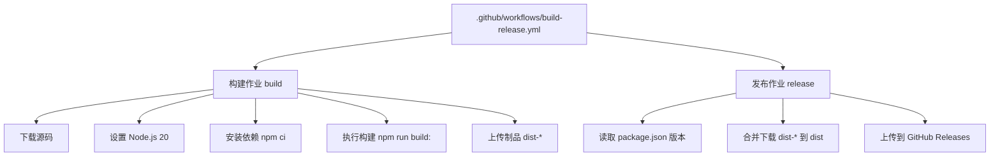
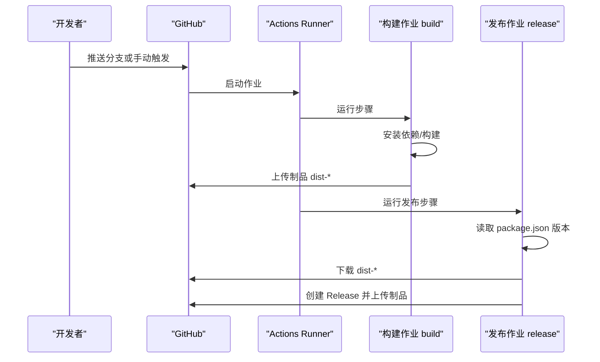
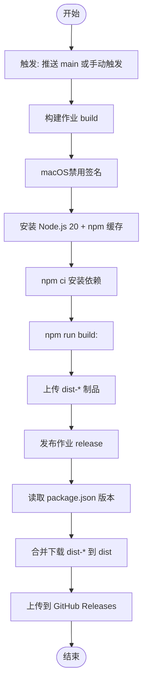
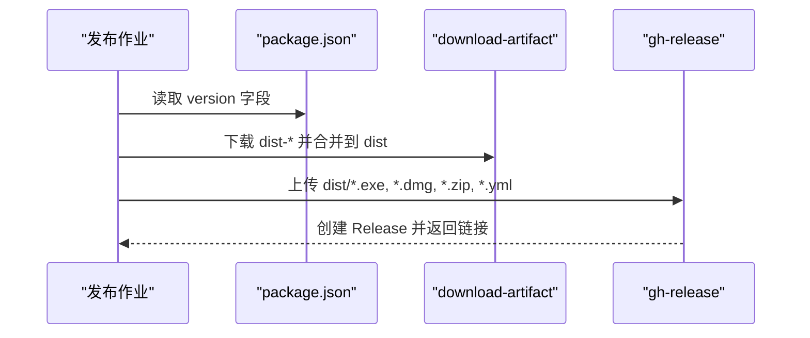
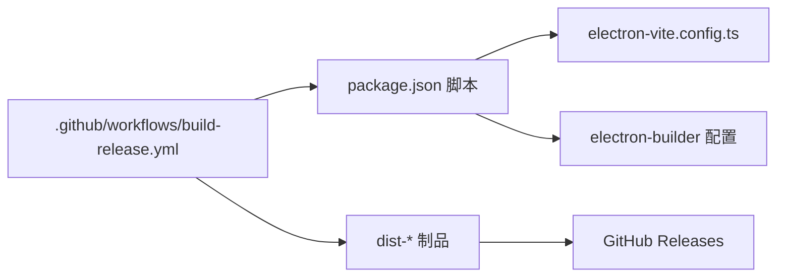

# CI/CD工作流

<cite>
**本文引用的文件**
- [.github/workflows/build-release.yml](file://.github/workflows/build-release.yml)
- [package.json](file://package.json)
- [electron.vite.config.ts](file://electron.vite.config.ts)
- [scripts/bump-version.js](file://scripts/bump-version.js)
- [eslint.config.mjs](file://eslint.config.mjs)
- [.prettierrc](file://.prettierrc)
- [tsconfig.json](file://tsconfig.json)
- [tsconfig.node.json](file://tsconfig.node.json)
- [tsconfig.web.json](file://tsconfig.web.json)
- [src/main/services/codeRunner.ts](file://src/main/services/codeRunner.ts)
- [src/main/services/dockService.ts](file://src/main/services/dockService.ts)
- [src/main/services/httpClient.ts](file://src/main/services/httpClient.ts)
</cite>

## 目录
1. [简介](#简介)
2. [项目结构](#项目结构)
3. [核心组件](#核心组件)
4. [架构总览](#架构总览)
5. [详细组件分析](#详细组件分析)
6. [依赖关系分析](#依赖关系分析)
7. [性能考虑](#性能考虑)
8. [故障排查指南](#故障排查指南)
9. [结论](#结论)
10. [附录](#附录)

## 简介
本文件面向开发者工具箱项目的CI/CD工作流，系统性梳理GitHub Actions工作流配置、构建触发条件、多平台构建矩阵与测试执行策略、自动化发布流程（构建产物上传、版本标签与发布包分发）、持续集成中的代码质量检查（格式化、类型检查、安全扫描）以及工作流自定义与扩展方法（环境变量与构建参数）。文档同时提供故障排查与性能优化建议，帮助团队高效稳定地交付应用。

## 项目结构
开发者工具箱是一个基于Electron-Vite的跨平台桌面应用，采用多入口的主进程、预加载脚本与渲染器页面结构。CI/CD工作流围绕以下关键文件展开：
- GitHub Actions工作流：定义构建与发布流程
- 构建脚本与配置：package.json中的脚本与electron-builder配置
- 类型与格式化配置：TypeScript、ESLint、Prettier
- 项目入口与构建配置：electron.vite.config.ts

图表来源
- [.github/workflows/build-release.yml:1-91](file://.github/workflows/build-release.yml#L1-L91)
- [package.json:12-26](file://package.json#L12-L26)

章节来源
- [.github/workflows/build-release.yml:1-91](file://.github/workflows/build-release.yml#L1-L91)
- [package.json:12-26](file://package.json#L12-L26)

## 核心组件
- GitHub Actions工作流：定义触发器、权限、作业与步骤，实现跨平台构建与发布。
- 构建脚本与配置：通过npm脚本与electron-builder配置实现多平台打包。
- 代码质量工具链：ESLint、Prettier、TypeScript类型检查。
- 自动化版本提升：通过脚本读取最新标签并生成下一版本号。

章节来源
- [.github/workflows/build-release.yml:1-91](file://.github/workflows/build-release.yml#L1-L91)
- [package.json:12-26](file://package.json#L12-L26)
- [scripts/bump-version.js:1-72](file://scripts/bump-version.js#L1-L72)
- [eslint.config.mjs:1-29](file://eslint.config.mjs#L1-L29)
- [.prettierrc:1-9](file://.prettierrc#L1-L9)
- [tsconfig.json:1-8](file://tsconfig.json#L1-L8)

## 架构总览
下图展示CI/CD工作流在GitHub Actions中的整体交互：触发器触发构建作业，构建完成后由发布作业读取版本信息并上传制品到GitHub Releases。

图表来源
- [.github/workflows/build-release.yml:3-91](file://.github/workflows/build-release.yml#L3-L91)
- [package.json:12-26](file://package.json#L12-L26)

## 详细组件分析

### GitHub Actions工作流配置
- 触发条件
  - 推送到main分支时自动触发
  - 支持workflow_dispatch手动触发
- 权限
  - 对内容写入权限，用于创建Release
- 作业与矩阵
  - 构建作业build：使用strategy.matrix包含Windows与macOS两个平台
  - 发布作业release：在构建完成后运行，使用ubuntu-latest作为运行环境
- 步骤详解
  - checkout：拉取仓库代码
  - macOS签名：在macOS Runner上禁用Apple代码签名以生成未签名制品
  - setup-node：安装Node.js 20并启用npm缓存
  - 安装依赖：使用npm ci确保锁定版本一致性
  - 构建：调用npm run build:<platform>分别构建Windows与macOS产物
  - 上传制品：将dist目录作为artifact上传，命名规则dist-<platform>
  - 发布：读取package.json版本，合并下载所有dist-*制品到dist，使用gh-release上传exe、dmg、zip、yml等文件

图表来源
- [.github/workflows/build-release.yml:3-91](file://.github/workflows/build-release.yml#L3-L91)

章节来源
- [.github/workflows/build-release.yml:1-91](file://.github/workflows/build-release.yml#L1-L91)

### 构建触发条件与多平台矩阵
- 触发条件
  - 分支推送：main分支
  - 手动触发：workflow_dispatch
- 多平台矩阵
  - Windows：windows-latest
  - macOS：macos-latest
- 平台特定行为
  - macOS Runner上设置CSC_IDENTITY_AUTO_DISCOVERY=false以禁用Apple代码签名，便于CI生成未签名制品

章节来源
- [.github/workflows/build-release.yml:3-33](file://.github/workflows/build-release.yml#L3-L33)

### 测试执行策略
- 当前工作流未包含测试步骤
- 建议在构建作业中加入测试脚本（如npm run test或npm run lint），并在成功后才进入发布阶段

章节来源
- [.github/workflows/build-release.yml:41-51](file://.github/workflows/build-release.yml#L41-L51)

### 自动化发布流程
- 版本读取
  - 通过Node命令读取package.json中的version字段
- 制品合并
  - 使用download-artifact合并pattern: dist-*到dist目录
- 发布上传
  - 使用softprops/action-gh-release上传dist目录下的exe、dmg、zip、yml文件
  - 标签名与发布名使用读取到的版本号

图表来源
- [.github/workflows/build-release.yml:64-91](file://.github/workflows/build-release.yml#L64-L91)
- [package.json](file://package.json#L3)

章节来源
- [.github/workflows/build-release.yml:53-91](file://.github/workflows/build-release.yml#L53-L91)
- [package.json](file://package.json#L3)

### 代码质量检查
- ESLint
  - 使用@electron-toolkit/eslint-config-ts推荐配置
  - 针对Vue文件配置parser与插件，关闭部分规则以适配项目需求
- Prettier
  - 通过.prettierrc统一格式化风格
- TypeScript类型检查
  - 提供独立的node/web类型检查脚本，可在CI中并行执行
- 建议在CI中增加lint与typecheck步骤，确保质量门槛

章节来源
- [eslint.config.mjs:1-29](file://eslint.config.mjs#L1-L29)
- [.prettierrc:1-9](file://.prettierrc#L1-L9)
- [package.json:16-18](file://package.json#L16-L18)
- [tsconfig.json:1-8](file://tsconfig.json#L1-L8)
- [tsconfig.node.json:1-19](file://tsconfig.node.json#L1-L19)
- [tsconfig.web.json:1-18](file://tsconfig.web.json#L1-L18)

### 构建脚本与配置
- npm脚本
  - build: 执行类型检查后进行Electron-Vite构建
  - build:win/mac/linux: 调用build并传入对应平台参数
  - bump:patch: 调用脚本提升版本
- electron-builder配置
  - 输出目录、文件包含、NSIS安装包配置、GitHub发布配置等

章节来源
- [package.json:12-26](file://package.json#L12-L26)
- [package.json:74-118](file://package.json#L74-L118)

### 版本提升脚本
- 功能概述
  - 读取最新Git标签（v*），解析主/次/补丁版本
  - 根据规则生成下一版本号并更新package.json与package-lock.json
- 规则要点
  - 当补丁≥10且次版本≥9时，主版本+1并重置次/补丁为0
  - 当补丁≥10时，次版本+1并将补丁重置为1
  - 否则补丁+1
- 使用场景
  - 可结合CI在PR合并或发布前自动提升版本

章节来源
- [scripts/bump-version.js:1-72](file://scripts/bump-version.js#L1-L72)

### 项目入口与构建配置
- electron.vite.config.ts
  - 主进程、预加载与渲染器三类入口配置
  - 预加载与渲染器多入口（index、dock）
  - 路径别名与插件配置

章节来源
- [electron.vite.config.ts:1-49](file://electron.vite.config.ts#L1-L49)

## 依赖关系分析
- 工作流对构建脚本的依赖
  - 构建作业依赖npm run build:<platform>生成dist目录
  - 发布作业依赖dist-* artifact的存在
- 构建脚本对工具链的依赖
  - electron-vite负责打包
  - electron-builder负责多平台安装包与发布配置
- 质量工具对项目配置的依赖
  - ESLint与Prettier依赖各自配置文件
  - TypeScript类型检查依赖多tsconfig文件

图表来源
- [.github/workflows/build-release.yml:44-91](file://.github/workflows/build-release.yml#L44-L91)
- [package.json:12-26](file://package.json#L12-L26)
- [electron.vite.config.ts:1-49](file://electron.vite.config.ts#L1-L49)

章节来源
- [.github/workflows/build-release.yml:1-91](file://.github/workflows/build-release.yml#L1-L91)
- [package.json:12-26](file://package.json#L12-L26)
- [electron.vite.config.ts:1-49](file://electron.vite.config.ts#L1-L49)

## 性能考虑
- 依赖安装缓存
  - 使用npm缓存减少重复安装时间
- 并行构建
  - 多平台矩阵并行执行，缩短总耗时
- 制品合并
  - 使用download-artifact的merge-multiple减少后续处理步骤
- 建议
  - 在构建前增加lint与typecheck步骤，尽早发现质量问题
  - 对大型项目可考虑分层缓存（如node_modules与dist）

[本节为通用建议，无需特定文件来源]

## 故障排查指南
- 构建失败
  - 检查Node.js版本与缓存命中情况
  - 确认npm ci安装依赖无冲突
- macOS签名问题
  - 确认已按工作流设置禁用Apple代码签名
- 发布失败
  - 检查GITHUB_TOKEN权限与GitHub Releases访问
  - 确认dist目录包含预期文件（exe、dmg、zip、yml）
- 版本不一致
  - 检查package.json版本与脚本读取逻辑
  - 确认脚本执行顺序与Git标签状态

章节来源
- [.github/workflows/build-release.yml:24-51](file://.github/workflows/build-release.yml#L24-L51)
- [.github/workflows/build-release.yml:57-91](file://.github/workflows/build-release.yml#L57-L91)
- [scripts/bump-version.js:51-72](file://scripts/bump-version.js#L51-L72)

## 结论
当前工作流实现了跨平台构建与发布自动化，具备良好的扩展性。建议补充测试与质量检查步骤，完善版本管理与发布流程，以进一步提升交付质量与稳定性。

[本节为总结，无需特定文件来源]

## 附录

### 工作流自定义与扩展
- 环境变量
  - GITHUB_TOKEN：用于Actions与GitHub API交互
  - CSC_IDENTITY_AUTO_DISCOVERY：macOS禁用Apple代码签名
- 构建参数调整
  - 在matrix中新增平台（如Linux）或调整Node版本
  - 在npm脚本中添加更多构建目标（如arm64）
- 质量检查扩展
  - 在构建作业中加入lint与typecheck步骤
  - 可选加入安全扫描（如npm audit或第三方工具）

章节来源
- [.github/workflows/build-release.yml:24-51](file://.github/workflows/build-release.yml#L24-L51)
- [package.json:16-26](file://package.json#L16-L26)

### 代码质量检查清单
- 格式化：Prettier配置与执行
- 类型检查：TypeScript多配置并行检查
- 规范检查：ESLint配置与规则
- 建议在CI中增加执行步骤，失败即中断发布

章节来源
- [.prettierrc:1-9](file://.prettierrc#L1-L9)
- [tsconfig.json:1-8](file://tsconfig.json#L1-L8)
- [tsconfig.node.json:1-19](file://tsconfig.node.json#L1-L19)
- [tsconfig.web.json:1-18](file://tsconfig.web.json#L1-L18)
- [eslint.config.mjs:1-29](file://eslint.config.mjs#L1-L29)
- [package.json:16-18](file://package.json#L16-L18)